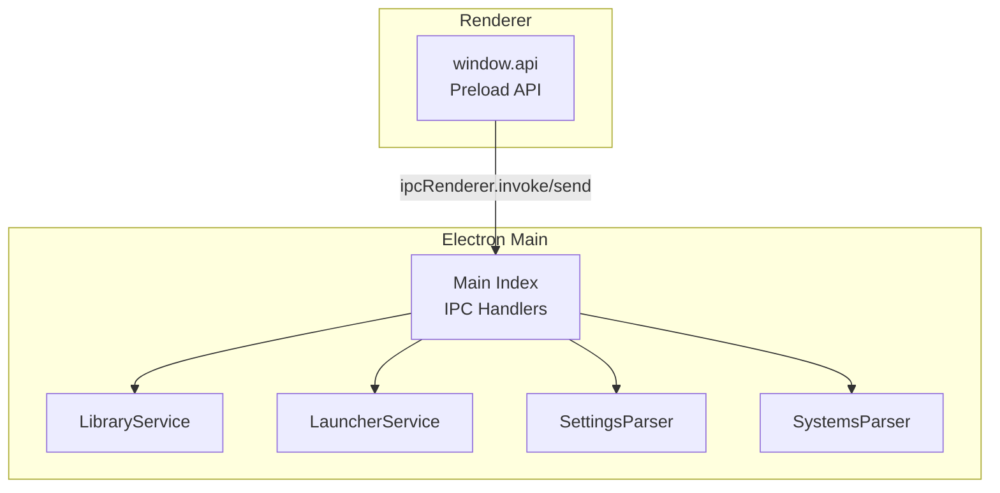
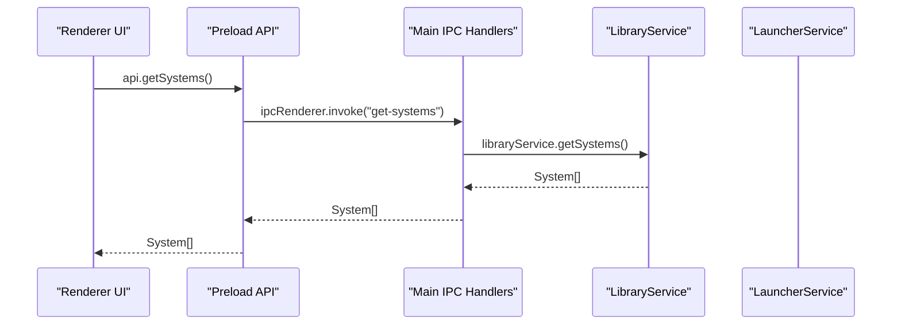
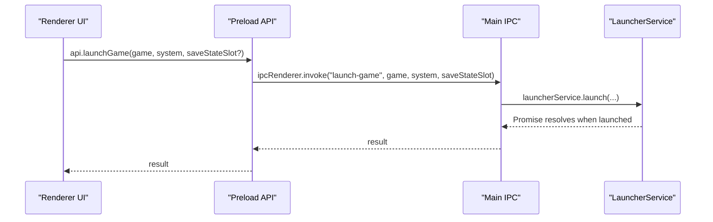
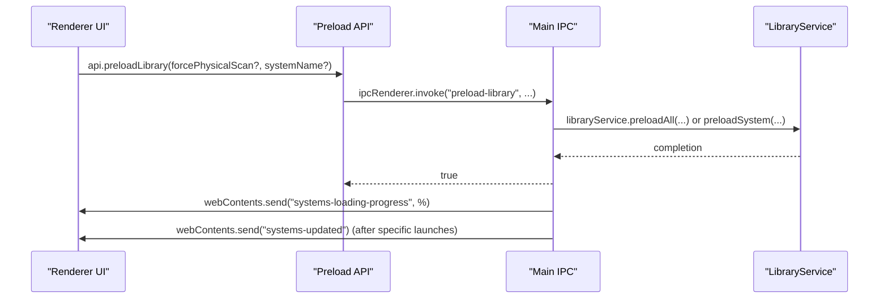
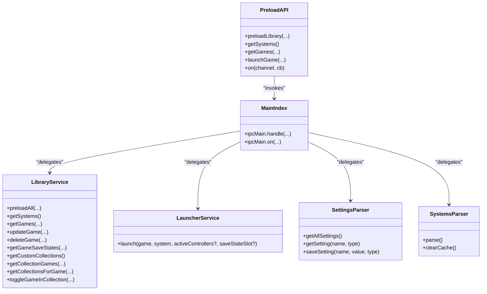

# API Reference

<cite>
**Referenced Files in This Document**
- [index.ts](file://emulationstation/.riescade/src/src/main/index.ts)
- [index.ts](file://emulationstation/.riescade/src/src/preload/index.ts)
- [LibraryService.ts](file://emulationstation/.riescade/src/src/main/services/LibraryService.ts)
- [LauncherService.ts](file://emulationstation/.riescade/src/src/main/services/LauncherService.ts)
- [SettingsParser.ts](file://emulationstation/.riescade/src/src/main/parsers/SettingsParser.ts)
- [SystemsParser.ts](file://emulationstation/.riescade/src/src/main/parsers/SystemsParser.ts)
- [types.ts](file://emulationstation/.riescade/src/src/shared/types.ts)
</cite>

## Table of Contents
1. [Introduction](#introduction)
2. [Project Structure](#project-structure)
3. [Core Components](#core-components)
4. [Architecture Overview](#architecture-overview)
5. [Detailed Component Analysis](#detailed-component-analysis)
6. [Dependency Analysis](#dependency-analysis)
7. [Performance Considerations](#performance-considerations)
8. [Troubleshooting Guide](#troubleshooting-guide)
9. [Conclusion](#conclusion)
10. [Appendices](#appendices)

## Introduction
This document provides an API reference for RIESCADE_SYSTEM’s internal Electron-based desktop application. It covers:
- IPC bridge between Electron main and renderer processes, including message protocols, data serialization, and event-driven synchronization.
- Internal service interfaces for library management, game launching, and configuration handling.
- Method-level documentation for LibraryService, LauncherService, and SettingsParser, including parameters, return values, and error handling.
- Typical usage patterns, invocation sequences, and data flow between components.
- Guidance on extending functionality, performance optimization, API versioning/backward compatibility, and debugging/metrics.

## Project Structure
The Electron application is organized into:
- Main process entry and IPC handlers
- Preload script exposing a controlled API surface to the renderer
- Services for library management, launching, theming, and scraping
- Parsers for configuration and systems metadata
- Shared types used across main and preload

**Diagram sources**
- [index.ts:1-1335](file://emulationstation/.riescade/src/src/main/index.ts#L1-L1335)
- [index.ts:1-78](file://emulationstation/.riescade/src/src/preload/index.ts#L1-L78)

**Section sources**
- [index.ts:1-1335](file://emulationstation/.riescade/src/src/main/index.ts#L1-L1335)
- [index.ts:1-78](file://emulationstation/.riescade/src/src/preload/index.ts#L1-L78)

## Core Components
- Preload API: Exposes a typed interface to the renderer via contextBridge, wrapping ipcRenderer.invoke and ipcRenderer.send.
- Main IPC Handlers: Implement all backend operations and delegate to services.
- Services:
  - LibraryService: Library scanning, caching, and metadata operations.
  - LauncherService: Game launch orchestration via emulatorLauncher.exe.
  - SettingsParser: Reads/writes application settings and theme settings.
- Parsers:
  - SystemsParser: Parses system configurations and caches results.
- Shared Types: Define Game and System structures used across IPC.

**Section sources**
- [index.ts:1-78](file://emulationstation/.riescade/src/src/preload/index.ts#L1-L78)
- [index.ts:1-1335](file://emulationstation/.riescade/src/src/main/index.ts#L1-L1335)
- [LibraryService.ts:436-496](file://emulationstation/.riescade/src/src/main/services/LibraryService.ts#L436-L496)
- [LauncherService.ts:1-25](file://emulationstation/.riescade/src/src/main/services/LauncherService.ts#L1-L25)
- [SettingsParser.ts:41-81](file://emulationstation/.riescade/src/src/main/parsers/SettingsParser.ts#L41-L81)
- [SystemsParser.ts:1-48](file://emulationstation/.riescade/src/src/main/parsers/SystemsParser.ts#L1-L48)
- [types.ts](file://emulationstation/.riescade/src/src/shared/types.ts)

## Architecture Overview
The renderer invokes preload methods that map to ipcRenderer.invoke or ipcRenderer.send. The main process registers ipcMain.handle or ipcMain.on handlers, performs work, and optionally emits events back to the renderer.

**Diagram sources**
- [index.ts:1-78](file://emulationstation/.riescade/src/src/preload/index.ts#L1-L78)
- [index.ts:1-1335](file://emulationstation/.riescade/src/src/main/index.ts#L1-L1335)
- [LibraryService.ts:436-496](file://emulationstation/.riescade/src/src/main/services/LibraryService.ts#L436-L496)

## Detailed Component Analysis

### IPC Bridge: Message Protocol and Serialization
- Invocation pattern:
  - Renderer calls window.api.method(args)
  - Preload wraps calls with ipcRenderer.invoke(channel, ...args) for request-response semantics.
  - Some commands use ipcRenderer.send(channel, ...args) for fire-and-forget notifications.
- Event subscription:
  - window.api.on(channel, handler) subscribes to asynchronous updates from main.
- Serialization:
  - Arguments and return values are serialized across process boundaries. Prefer primitives, arrays, and objects compatible with JSON; avoid functions, symbols, and cyclic structures.
- Synchronization:
  - Progress and state updates are sent via BrowserWindow.webContents.send during long-running operations (e.g., library preload progress).

Common channels and usage:
- Library management: preload-library, get-systems, get-games, update-game, delete-game, scan-save-states, get-custom-collections, get-collection-games, get-collections-for-game, toggle-game-in-collection.
- Launching: launch-game.
- Themes: get-themes, get-active-theme, load-theme.
- Settings: get-settings, save-setting, get-theme-settings, save-theme-setting, get-file-content.
- Controllers: get-configured-controllers, save-input-config, get-bluetooth-devices.
- System commands: system-command (send).
- Media scraping: start-scrape, cancel-scrape, search-game-media, download-game-media, download-temp-media.
- Utilities: get-version, get-hostname, get-bios-information, clean-gamelists, reset-gamelist-usage, reset-file-extensions, clear-caches, get-music-files, get-music-path.

**Section sources**
- [index.ts:1-78](file://emulationstation/.riescade/src/src/preload/index.ts#L1-L78)
- [index.ts:86-506](file://emulationstation/.riescade/src/src/main/index.ts#L86-L506)

### LibraryService API
Responsibilities:
- Preloading systems and games, maintaining caches, and exposing metadata operations.
- Emitting progress updates and triggering UI refresh after specific operations.

Key methods and behaviors:
- preloadAll(forcePhysicalScan): Initializes system metadata and caches; emits progress via “systems-loading-progress”.
- preloadSystem(systemName, forcePhysicalScan): Loads a single system.
- getSystems(): Returns system definitions.
- getGames(systemName): Returns games for a system.
- updateGame(systemName, gameData): Persists game metadata updates.
- deleteGame(systemName, gamePath, deletePhysical): Removes game entries and optionally deletes physical files.
- getGameSaveStates(systemName, gamePath): Scans and returns save-state files.
- getCustomCollections(), getCollectionGames(collectionName), getCollectionsForGame(systemName, gamePath), toggleGameInCollection(...): Manages custom collections.
- clearCaches(): Clears internal caches.

Notes:
- Caching: Quick counts and system lists are cached; clearCache() is used to invalidate caches after external changes (e.g., Windows installers lifecycle).
- Event emission: After specific launches (e.g., windows_installers), main sends “systems-updated” to notify the renderer.

**Section sources**
- [index.ts:86-158](file://emulationstation/.riescade/src/src/main/index.ts#L86-L158)
- [LibraryService.ts:436-496](file://emulationstation/.riescade/src/src/main/services/LibraryService.ts#L436-L496)

### LauncherService API
Responsibilities:
- Launch games via emulatorLauncher.exe using resolved paths and active controller mappings.

Key method:
- launch(game, system, activeControllers?, saveStateSlot?): Executes the emulator with appropriate arguments and controller configuration.

Behavior:
- Resolves ROM path relative to system.path.
- Uses emulatorLauncher.exe from RetroBat installation.
- Integrates active controller info passed from main.

**Section sources**
- [LauncherService.ts:1-25](file://emulationstation/.riescade/src/src/main/services/LauncherService.ts#L1-L25)
- [index.ts:106-130](file://emulationstation/.riescade/src/src/main/index.ts#L106-L130)

### SettingsParser API
Responsibilities:
- Parse and manage application settings and theme settings.
- Provide typed getters and setters for settings.

Key methods:
- getAllSettings(): Parses settings XML and returns a normalized map of settingName -> { value, type }.
- getSetting(name, type): Retrieves a setting by name with expected type.
- saveSetting(name, value, type): Writes a setting back to disk.
- getSelectedTheme(): Convenience getter for theme selection.

Serialization:
- Settings are stored in XML format and parsed using fast-xml-parser.

**Section sources**
- [SettingsParser.ts:41-81](file://emulationstation/.riescade/src/src/main/parsers/SettingsParser.ts#L41-L81)
- [index.ts:217-223](file://emulationstation/.riescade/src/src/main/index.ts#L217-L223)

### SystemsParser API
Responsibilities:
- Parse system configuration files (es_systems.cfg and variants) into System objects.
- Cache parsed results to avoid repeated IO.

Key methods:
- parse(): Returns System[] from merged configuration files.
- clearCache(): Clears the in-memory cache.

**Section sources**
- [SystemsParser.ts:1-48](file://emulationstation/.riescade/src/src/main/parsers/SystemsParser.ts#L1-L48)

### Shared Types
- Game: Defines game metadata used across IPC and services.
- System: Defines system metadata used across IPC and services.

These types are referenced by preload and main IPC handlers and services.

**Section sources**
- [types.ts](file://emulationstation/.riescade/src/src/shared/types.ts)

### Typical API Usage Patterns

#### Launch a Game

**Diagram sources**
- [index.ts:1-78](file://emulationstation/.riescade/src/src/preload/index.ts#L1-L78)
- [index.ts:106-130](file://emulationstation/.riescade/src/src/main/index.ts#L106-L130)
- [LauncherService.ts:1-25](file://emulationstation/.riescade/src/src/main/services/LauncherService.ts#L1-L25)

#### Load and Refresh Library

**Diagram sources**
- [index.ts:1-78](file://emulationstation/.riescade/src/src/preload/index.ts#L1-L78)
- [index.ts:86-158](file://emulationstation/.riescade/src/src/main/index.ts#L86-L158)
- [LibraryService.ts:471-496](file://emulationstation/.riescade/src/src/main/services/LibraryService.ts#L471-L496)

### Data Flow Between Components
- Renderer → Preload: Typed method calls mapped to IPC channels.
- Preload → Main: ipcRenderer.invoke for request-response; ipcRenderer.send for notifications.
- Main → Services: Delegation to LibraryService, LauncherService, SettingsParser, SystemsParser.
- Main ← Services: Results returned to main handlers; events emitted to renderer windows.

**Section sources**
- [index.ts:1-1335](file://emulationstation/.riescade/src/src/main/index.ts#L1-L1335)
- [index.ts:1-78](file://emulationstation/.riescade/src/src/preload/index.ts#L1-L78)

## Dependency Analysis

**Diagram sources**
- [index.ts:1-1335](file://emulationstation/.riescade/src/src/main/index.ts#L1-L1335)
- [index.ts:1-78](file://emulationstation/.riescade/src/src/preload/index.ts#L1-L78)
- [LibraryService.ts:436-496](file://emulationstation/.riescade/src/src/main/services/LibraryService.ts#L436-L496)
- [LauncherService.ts:1-25](file://emulationstation/.riescade/src/src/main/services/LauncherService.ts#L1-L25)
- [SettingsParser.ts:41-81](file://emulationstation/.riescade/src/src/main/parsers/SettingsParser.ts#L41-L81)
- [SystemsParser.ts:1-48](file://emulationstation/.riescade/src/src/main/parsers/SystemsParser.ts#L1-L48)

**Section sources**
- [index.ts:1-1335](file://emulationstation/.riescade/src/src/main/index.ts#L1-L1335)
- [index.ts:1-78](file://emulationstation/.riescade/src/src/preload/index.ts#L1-L78)

## Performance Considerations
- Prefer batch operations: Use preloadLibrary(systemName?) to target specific systems when possible.
- Cache-aware operations: LibraryService caches quick counts and system lists; clear caches after external changes (e.g., windows_installers lifecycle).
- Debounce UI updates: The main process emits “systems-loading-progress”; avoid excessive polling in the renderer.
- Avoid heavy synchronous IO in renderers; keep all IO-bound tasks in main via IPC.
- Minimize argument sizes: Keep payloads small; serialize only necessary fields.

[No sources needed since this section provides general guidance]

## Troubleshooting Guide
Common issues and diagnostics:
- IPC channel not found: Verify channel names in preload and main handlers match exactly.
- Serialization errors: Ensure arguments are JSON-compatible; avoid functions and cycles.
- Settings parsing failures: Check settings XML validity; SettingsParser logs errors on parse failure.
- Controller config persistence: save-input-config writes to es_input.cfg and es_last_input.cfg; confirm file permissions and paths.
- Theme live reload: load-theme sets up a watcher; ensure theme directory exists and is readable.
- Scraping failures: ScreenScraper/ArcadeDB/IGDB queries depend on network and credentials; inspect logs for HTTP errors and missing credentials.

**Section sources**
- [index.ts:247-320](file://emulationstation/.riescade/src/src/main/index.ts#L247-L320)
- [index.ts:169-214](file://emulationstation/.riescade/src/src/main/index.ts#L169-L214)
- [SettingsParser.ts:41-81](file://emulationstation/.riescade/src/src/main/parsers/SettingsParser.ts#L41-L81)

## Conclusion
The RIESCADE_SYSTEM desktop application exposes a focused IPC surface via a preload API, delegating to robust services for library management, launching, and configuration. By following the documented patterns and constraints—especially around serialization, caching, and event-driven updates—you can extend functionality safely and efficiently.

[No sources needed since this section summarizes without analyzing specific files]

## Appendices

### API Versioning and Backward Compatibility
- Channel naming: Maintain stable channel names for request-response handlers to preserve client compatibility.
- Argument shapes: Add optional fields rather than changing existing signatures; parsers should tolerate missing keys.
- Error handling: Return structured errors or null/empty results consistently; avoid throwing unhandled exceptions across IPC.
- Migration strategy: Introduce new channels for breaking changes; keep old channels for a deprecation period with warnings.

[No sources needed since this section provides general guidance]

### Debugging Tools and Monitoring Approaches
- Enable logging: Inspect console output in main and renderer processes for IPC errors and service logs.
- Network monitoring: For scraping endpoints, monitor HTTP status codes and timeouts.
- File watchers: Use main process watchers for theme and system changes; emit renderer events to reflect updates.
- Metrics: Track IPC latency and long-running operation durations (e.g., preload progress).

[No sources needed since this section provides general guidance]