# Configuration APIs

<cite>
**Referenced Files in This Document**
- [systems_names.lst](file://system/configgen/systems_names.lst)
- [emulators_names.lst](file://system/configgen/emulators_names.lst)
- [templates_files.lst](file://system/configgen/templates_files.lst)
- [retrobat_template.ini](file://system/resources/retrobat_template.ini)
- [Dolphin.ini](file://system/templates/dolphin-emu/User\Config\Dolphin.ini)
- [retroarch.cfg](file://system/templates/retroarch/retroarch.cfg)
- [fmtownsux.ini](file://system/templates/mame/ini/fmtownsux.ini)
- [portable.ini](file://system/templates/pcsx2/portable.ini)
- [config.yml](file://system/templates/vita3k/config.yml)
- [xenia.config.toml](file://system/templates/xenia/xenia.config.toml)
- [splash.xml](file://system/resources/emulationstation/splash.xml)
</cite>

## Table of Contents
1. [Introduction](#introduction)
2. [Project Structure](#project-structure)
3. [Core Components](#core-components)
4. [Architecture Overview](#architecture-overview)
5. [Detailed Component Analysis](#detailed-component-analysis)
6. [Dependency Analysis](#dependency-analysis)
7. [Performance Considerations](#performance-considerations)
8. [Troubleshooting Guide](#troubleshooting-guide)
9. [Conclusion](#conclusion)
10. [Appendices](#appendices)

## Introduction
This document describes the template-based configuration system used by RIESCADE_SYSTEM. It covers:
- Configuration file formats: XML-based themes, INI-style emulator configs, TOML/YAML-based emulator configs, and list-based discovery files.
- Generation APIs for emulator-specific configurations, system templates, and platform settings.
- Dynamic discovery APIs for systems and emulators.
- Template processing APIs for generating runtime configurations from static templates.
- Examples of configuration inheritance, overrides, validation rules, versioning, migration, and backward compatibility.
- Troubleshooting common configuration issues.

## Project Structure
The configuration system is organized around:
- Discovery lists: systems_names.lst and emulators_names.lst for dynamic discovery.
- Template registry: templates_files.lst mapping static template files to runtime destinations.
- Templates: per-emulator configuration files in INI/TOML/YAML/XML formats.
- Global template: retrobat_template.ini for global RetroBat settings.
- Theme resources: XML theme definitions for EmulationStation.

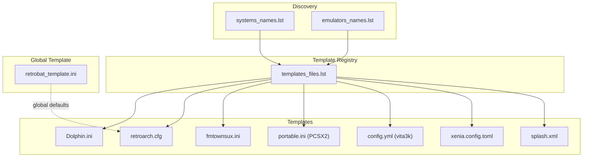

**Diagram sources**
- [systems_names.lst:1-241](file://system/configgen/systems_names.lst#L1-L241)
- [emulators_names.lst:1-130](file://system/configgen/emulators_names.lst#L1-L130)
- [templates_files.lst:1-215](file://system/configgen/templates_files.lst#L1-L215)
- [Dolphin.ini:1-58](file://system/templates/dolphin-emu/User\Config\Dolphin.ini#L1-L58)
- [retroarch.cfg:1-800](file://system/templates/retroarch/retroarch.cfg#L1-L800)
- [fmtownsux.ini:1-486](file://system/templates/mame/ini/fmtownsux.ini#L1-L486)
- [portable.ini:1-2](file://system/templates/pcsx2/portable.ini#L1-L2)
- [config.yml:1-182](file://system/templates/vita3k/config.yml#L1-L182)
- [xenia.config.toml:1-374](file://system/templates/xenia/xenia.config.toml#L1-L374)
- [splash.xml:1-53](file://system/resources/emulationstation/splash.xml#L1-L53)
- [retrobat_template.ini:1-91](file://system/resources/retrobat_template.ini#L1-L91)

**Section sources**
- [systems_names.lst:1-241](file://system/configgen/systems_names.lst#L1-L241)
- [emulators_names.lst:1-130](file://system/configgen/emulators_names.lst#L1-L130)
- [templates_files.lst:1-215](file://system/configgen/templates_files.lst#L1-L215)
- [retrobat_template.ini:1-91](file://system/resources/retrobat_template.ini#L1-L91)

## Core Components
- Systems discovery list: enumerates supported platforms for configuration generation.
- Emulators discovery list: enumerates supported emulators for configuration generation.
- Template registry: maps template files to destination paths and groups related files (e.g., saves, assets).
- Emulator templates: per-emulator configuration files in INI/TOML/YAML/XML formats.
- Global template: RetroBat global settings applied across EmulationStation and RetroArch.

Examples of configuration formats:
- XML: EmulationStation theme definition.
- INI: Emulator configuration with sections and key=value pairs.
- TOML: Emulator configuration with nested tables and arrays.
- YAML: Emulator configuration with nested keys and lists.
- List files: newline-separated entries for discovery and mapping.

**Section sources**
- [systems_names.lst:1-241](file://system/configgen/systems_names.lst#L1-L241)
- [emulators_names.lst:1-130](file://system/configgen/emulators_names.lst#L1-L130)
- [templates_files.lst:1-215](file://system/configgen/templates_files.lst#L1-L215)
- [Dolphin.ini:1-58](file://system/templates/dolphin-emu/User\Config\Dolphin.ini#L1-L58)
- [retroarch.cfg:1-800](file://system/templates/retroarch/retroarch.cfg#L1-L800)
- [fmtownsux.ini:1-486](file://system/templates/mame/ini/fmtownsux.ini#L1-L486)
- [portable.ini:1-2](file://system/templates/pcsx2/portable.ini#L1-L2)
- [config.yml:1-182](file://system/templates/vita3k/config.yml#L1-L182)
- [xenia.config.toml:1-374](file://system/templates/xenia/xenia.config.toml#L1-L374)
- [splash.xml:1-53](file://system/resources/emulationstation/splash.xml#L1-L53)

## Architecture Overview
The configuration generation pipeline:
- Discovery: read systems_names.lst and emulators_names.lst to build the catalog of supported systems and emulators.
- Registry: process templates_files.lst to locate template files and their destination paths.
- Template selection: choose appropriate templates based on selected system/emulator.
- Template processing: copy/move template files to runtime destinations; adjust paths and references as needed.
- Global defaults: apply retrobat_template.ini to EmulationStation and RetroArch defaults.

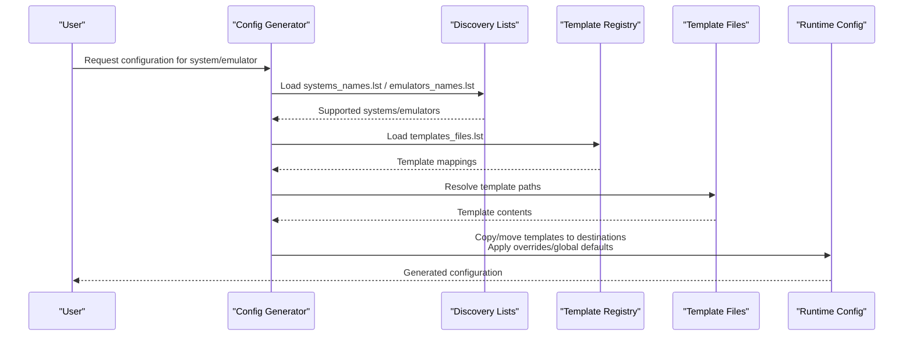

**Diagram sources**
- [systems_names.lst:1-241](file://system/configgen/systems_names.lst#L1-L241)
- [emulators_names.lst:1-130](file://system/configgen/emulators_names.lst#L1-L130)
- [templates_files.lst:1-215](file://system/configgen/templates_files.lst#L1-L215)

## Detailed Component Analysis

### Systems and Emulators Discovery APIs
- systems_names.lst: newline-separated list of supported systems/platforms.
- emulators_names.lst: newline-separated list of supported emulators.

Usage:
- Dynamically enumerate available systems/emulators for UI and generation.
- Validate user selections against these lists.

Validation rules:
- Entries are unique and lowercase identifiers.
- Empty lines and comments are ignored by typical parsers.

**Section sources**
- [systems_names.lst:1-241](file://system/configgen/systems_names.lst#L1-L241)
- [emulators_names.lst:1-130](file://system/configgen/emulators_names.lst#L1-L130)

### Template Registry API
- templates_files.lst: maps template source paths to destination paths and groups related files.

Format:
- Each line defines a mapping from a source path to a destination path or directory.
- Supports multiple entries per emulator/system.

Processing logic:
- Normalize paths and resolve relative paths from a base directory.
- Group related files (e.g., saves, assets) under a single destination directory.

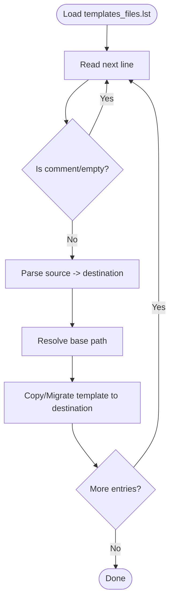

**Diagram sources**
- [templates_files.lst:1-215](file://system/configgen/templates_files.lst#L1-L215)

**Section sources**
- [templates_files.lst:1-215](file://system/configgen/templates_files.lst#L1-L215)

### Emulator Configuration Templates

#### INI-style Templates
- Dolphin.ini: EmulationStation-compatible INI with sections and key=value pairs.
- Example keys include display, general paths, and core settings.

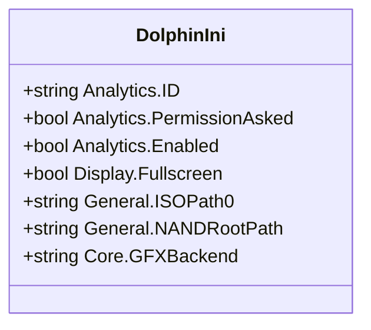

**Diagram sources**
- [Dolphin.ini:1-58](file://system/templates/dolphin-emu/User\Config\Dolphin.ini#L1-L58)

**Section sources**
- [Dolphin.ini:1-58](file://system/templates/dolphin-emu/User\Config\Dolphin.ini#L1-L58)

#### TOML Templates
- xenia.config.toml: Hierarchical configuration with sections and typed values.

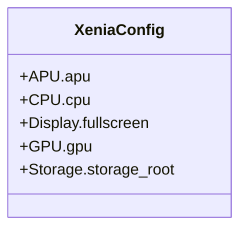

**Diagram sources**
- [xenia.config.toml:1-374](file://system/templates/xenia/xenia.config.toml#L1-L374)

**Section sources**
- [xenia.config.toml:1-374](file://system/templates/xenia/xenia.config.toml#L1-L374)

#### YAML Templates
- config.yml (vita3k): Nested keys and arrays for renderer, input, and save paths.

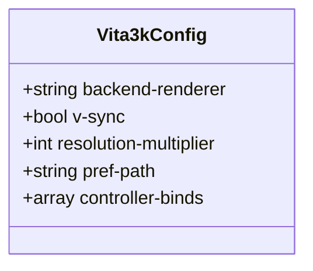

**Diagram sources**
- [config.yml:1-182](file://system/templates/vita3k/config.yml#L1-L182)

**Section sources**
- [config.yml:1-182](file://system/templates/vita3k/config.yml#L1-L182)

#### RetroArch Configuration
- retroarch.cfg: Flat key=value pairs with thousands of options for input, core options, and UI.

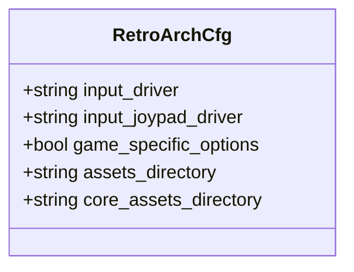

**Diagram sources**
- [retroarch.cfg:1-800](file://system/templates/retroarch/retroarch.cfg#L1-L800)

**Section sources**
- [retroarch.cfg:1-800](file://system/templates/retroarch/retroarch.cfg#L1-L800)

#### MAME INI Template
- fmtownsux.ini: Comprehensive INI with sections for paths, performance, rendering, sound, input, and post-processing.

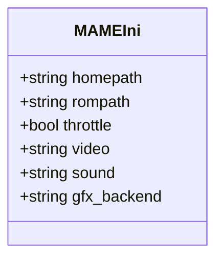

**Diagram sources**
- [fmtownsux.ini:1-486](file://system/templates/mame/ini/fmtownsux.ini#L1-L486)

**Section sources**
- [fmtownsux.ini:1-486](file://system/templates/mame/ini/fmtownsux.ini#L1-L486)

#### PCSX2 Portable Template
- portable.ini: Minimal INI toggling wizard state.

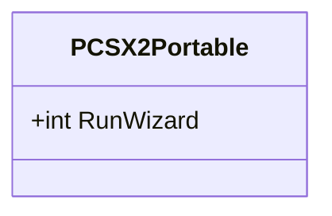

**Diagram sources**
- [portable.ini:1-2](file://system/templates/pcsx2/portable.ini#L1-L2)

**Section sources**
- [portable.ini:1-2](file://system/templates/pcsx2/portable.ini#L1-L2)

### Global Template API
- retrobat_template.ini: Global RetroBat settings for splash, EmulationStation, and other subsystems.

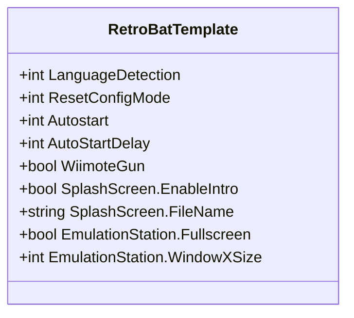

**Diagram sources**
- [retrobat_template.ini:1-91](file://system/resources/retrobat_template.ini#L1-L91)

**Section sources**
- [retrobat_template.ini:1-91](file://system/resources/retrobat_template.ini#L1-L91)

### Theme Resource API
- splash.xml: EmulationStation theme definition using XML with variables and views.

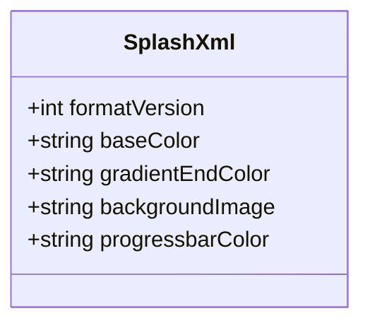

**Diagram sources**
- [splash.xml:1-53](file://system/resources/emulationstation/splash.xml#L1-L53)

**Section sources**
- [splash.xml:1-53](file://system/resources/emulationstation/splash.xml#L1-L53)

## Dependency Analysis
- Discovery lists feed the registry: systems_names.lst and emulators_names.lst define the universe of supported items.
- Template registry depends on template files’ existence and correct paths.
- Global template influences emulator defaults (e.g., EmulationStation and RetroArch behavior).
- Theme resources depend on splash.xml and referenced assets.

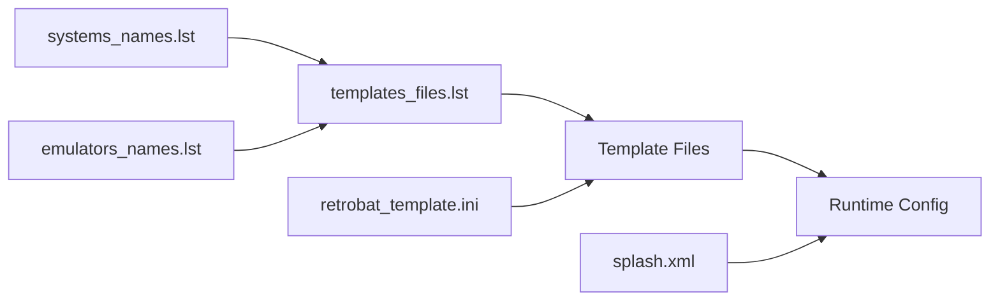

**Diagram sources**
- [systems_names.lst:1-241](file://system/configgen/systems_names.lst#L1-L241)
- [emulators_names.lst:1-130](file://system/configgen/emulators_names.lst#L1-L130)
- [templates_files.lst:1-215](file://system/configgen/templates_files.lst#L1-L215)
- [retrobat_template.ini:1-91](file://system/resources/retrobat_template.ini#L1-L91)
- [splash.xml:1-53](file://system/resources/emulationstation/splash.xml#L1-L53)

**Section sources**
- [systems_names.lst:1-241](file://system/configgen/systems_names.lst#L1-L241)
- [emulators_names.lst:1-130](file://system/configgen/emulators_names.lst#L1-L130)
- [templates_files.lst:1-215](file://system/configgen/templates_files.lst#L1-L215)
- [retrobat_template.ini:1-91](file://system/resources/retrobat_template.ini#L1-L91)
- [splash.xml:1-53](file://system/resources/emulationstation/splash.xml#L1-L53)

## Performance Considerations
- Template registry parsing: Keep templates_files.lst minimal and grouped to reduce IO overhead.
- INI/TOML/YAML parsing: Prefer streaming parsers for large files (e.g., retroarch.cfg) to avoid memory spikes.
- Path normalization: Cache normalized paths to avoid repeated filesystem checks.
- Asset grouping: Place related assets under destination directories to minimize file operations.

## Troubleshooting Guide
Common issues and resolutions:
- Missing template file: Verify templates_files.lst entries exist and are reachable from the base path.
- Incorrect paths in INI/TOML/YAML: Ensure relative paths resolve correctly; adjust based on installation directory.
- EmulationStation not starting fullscreen: Check EmulationStation.Fullscreen in retrobat_template.ini and emulator-specific INI overrides.
- RetroArch input not recognized: Validate input_driver and joypad_driver in retroarch.cfg; confirm mappings align with hardware.
- Dolphin save paths invalid: Confirm General.NANDRootPath and related paths exist and are writable.
- Vita3K save path missing: Ensure pref-path resolves to a valid directory.
- Xenia rendering issues: Adjust GPU and display settings in xenia.config.toml; verify adapter/device availability.
- Theme assets not found: Ensure splash.xml references are correct and assets are copied alongside splash.xml.

Validation rules:
- Systems/emulators must be present in systems_names.lst/emulators_names.lst.
- Template mappings in templates_files.lst must resolve to existing files.
- INI/TOML/YAML must be syntactically valid; use dedicated validators for each format.
- Paths must be absolute or resolvable from a known base directory.

Versioning and migration:
- RetroArch: Many options are additive; newer versions often add defaults. Use retrobat_template.ini to enforce baseline behavior.
- Xenia: The Config.defaults_date field indicates default version; update when defaults change to preserve behavior.
- Dolphin: Paths and sections evolve; keep templates aligned with target emulator versions.
- MAME: INI sections and keys vary by core; maintain separate presets for different systems.

Backward compatibility:
- Provide fallbacks for renamed keys (e.g., legacy vs. modern INI keys).
- Maintain multiple template variants for older emulator versions.
- Use global template to normalize behavior across versions.

**Section sources**
- [retrobat_template.ini:1-91](file://system/resources/retrobat_template.ini#L1-L91)
- [Dolphin.ini:1-58](file://system/templates/dolphin-emu/User\Config\Dolphin.ini#L1-L58)
- [retroarch.cfg:1-800](file://system/templates/retroarch/retroarch.cfg#L1-L800)
- [fmtownsux.ini:1-486](file://system/templates/mame/ini/fmtownsux.ini#L1-L486)
- [config.yml:1-182](file://system/templates/vita3k/config.yml#L1-L182)
- [xenia.config.toml:1-374](file://system/templates/xenia/xenia.config.toml#L1-L374)

## Conclusion
RIESCADE_SYSTEM’s template-based configuration system provides a robust framework for generating emulator-specific configurations from static templates. By leveraging discovery lists, a centralized template registry, and format-specific templates, it enables scalable configuration management across diverse emulators and platforms. Applying global defaults, enforcing validation rules, and maintaining version-aware templates ensures reliability and backward compatibility.

## Appendices
- Example configuration inheritance:
  - Global defaults in retrobat_template.ini influence EmulationStation and RetroArch.
  - Emulator-specific templates override global defaults where applicable.
- Override mechanisms:
  - Destination paths in templates_files.lst allow targeted overrides.
  - Emulator templates can selectively enable/disable features via key/value pairs.
- Validation checklist:
  - Systems/emulators present in discovery lists.
  - Template registry entries resolve to existing files.
  - Emulator templates are syntactically valid for their format.
  - Paths are writable and resolvable.