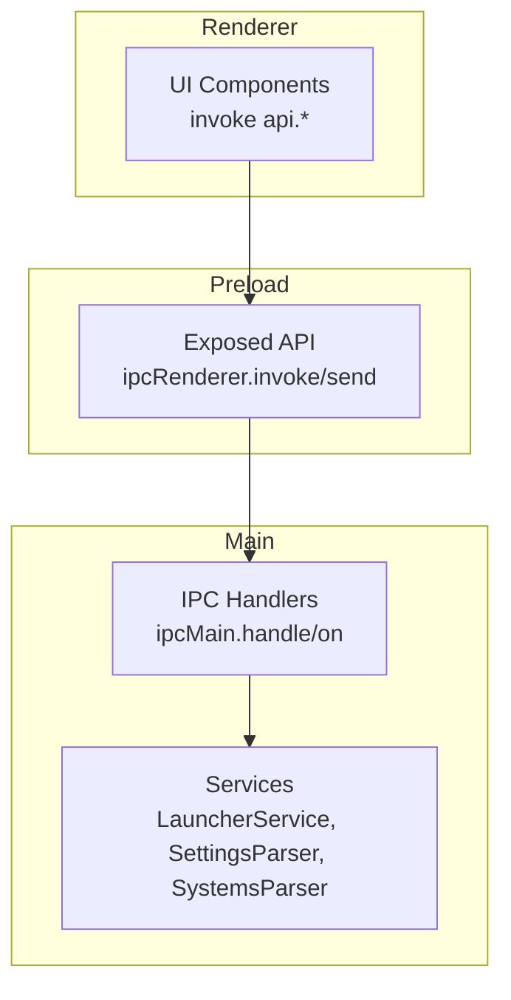
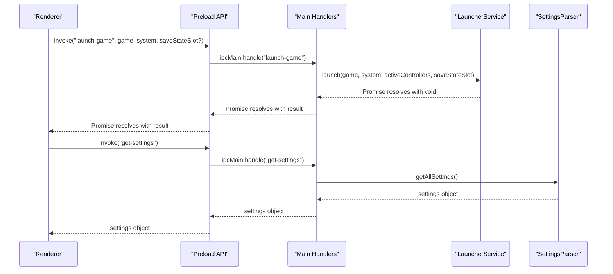
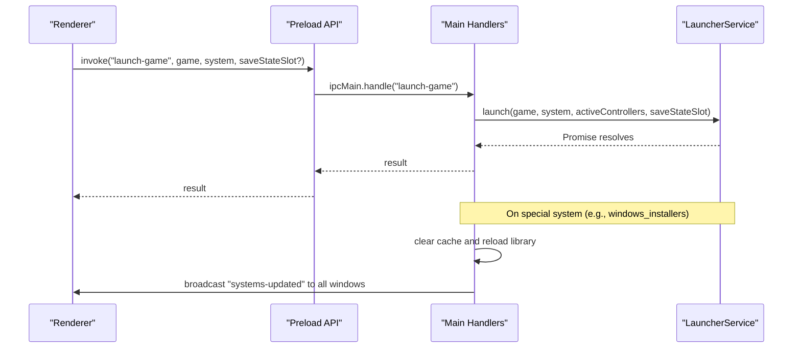
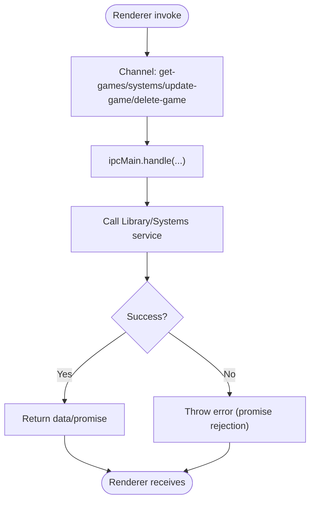
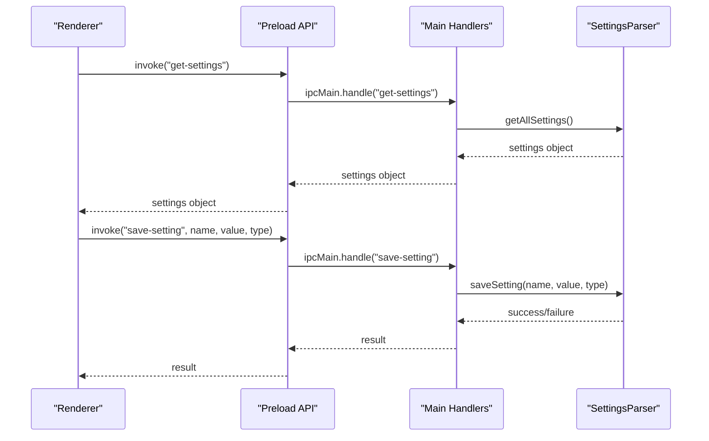
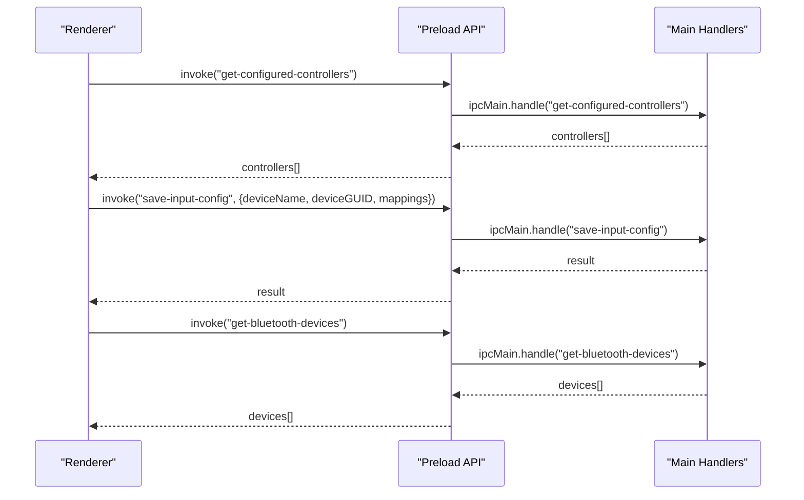
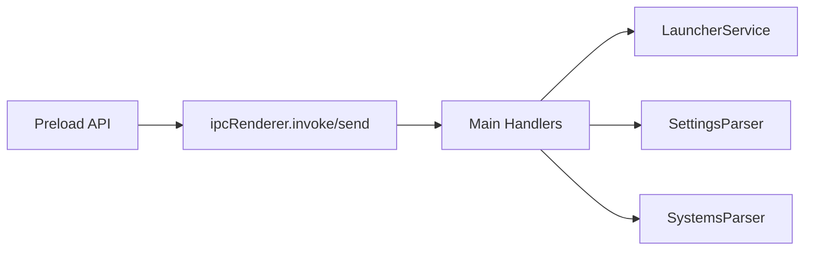

# IPC Communication

<cite>
**Referenced Files in This Document**
- [index.ts](file://emulationstation/.riescade/src/src/preload/index.ts)
- [index.ts](file://emulationstation/.riescade/src/src/main/index.ts)
- [LauncherService.ts](file://emulationstation/.riescade/src/src/main/services/LauncherService.ts)
- [SettingsParser.ts](file://emulationstation/.riescade/src/src/main/parsers/SettingsParser.ts)
- [SystemsParser.ts](file://emulationstation/.riescade/src/src/main/parsers/SystemsParser.ts)
- [electron.vite.config.ts](file://emulationstation/.riescade/src/electron.vite.config.ts)
</cite>

## Table of Contents
1. [Introduction](#introduction)
2. [Project Structure](#project-structure)
3. [Core Components](#core-components)
4. [Architecture Overview](#architecture-overview)
5. [Detailed Component Analysis](#detailed-component-analysis)
6. [Dependency Analysis](#dependency-analysis)
7. [Performance Considerations](#performance-considerations)
8. [Troubleshooting Guide](#troubleshooting-guide)
9. [Conclusion](#conclusion)

## Introduction
This document describes the Inter-Process Communication (IPC) architecture used by RIESCADE_SYSTEM’s Electron-based frontend. It focuses on the communication between the main process and renderer process, including message channels, data serialization, synchronization, and security posture. It also documents the IPC endpoints used for game launching, library management, settings configuration, and input device handling, along with practical debugging and performance guidance.

## Project Structure
The Electron app is organized into three primary parts:
- Preload script exposing a controlled API to the renderer
- Main process wiring IPC handlers and orchestrating services
- Renderer-side components invoking the exposed API

**Diagram sources**
- [index.ts:1-77](file://emulationstation/.riescade/src/src/preload/index.ts#L1-L77)
- [index.ts:102-249](file://emulationstation/.riescade/src/src/main/index.ts#L102-L249)

**Section sources**
- [index.ts:1-77](file://emulationstation/.riescade/src/src/preload/index.ts#L1-L77)
- [index.ts:27-71](file://emulationstation/.riescade/src/src/main/index.ts#L27-L71)
- [electron.vite.config.ts:1-20](file://emulationstation/.riescade/src/electron.vite.config.ts#L1-L20)

## Core Components
- Preload API surface: Defines a typed set of invoke/send channels for the renderer to call into the main process.
- Main process handlers: Implement RPC-like endpoints for library, theme, settings, input, and system commands.
- Services: Encapsulate domain logic (launching, parsing configurations, managing systems).

Key IPC channels:
- Library management: get-systems, get-games, update-game, delete-game, preload-library, get-custom-collections, get-collection-games, get-collections-for-game, toggle-game-in-collection, scan-save-states
- Launching: launch-game
- Themes: get-themes, get-active-theme, load-theme, get-theme-settings, save-theme-setting
- Settings: get-settings, save-setting, get-hostname, get-bios-information, clean-gamelists, reset-gamelist-usage, reset-file-extensions, clear-caches, get-file-content
- Input devices: get-configured-controllers, save-input-config, get-bluetooth-devices
- System commands: system-command (send), plus set-active-controllers handler
- Scraping/media: start-scrape, cancel-scrape, search-game-media, download-game-media, download-temp-media
- Utilities: get-version, get-music-files, get-music-path

Message patterns:
- Request-response (invoke): Used for reads and operations returning data/results
- Fire-and-forget (send): Used for commands that do not expect a response

Serialization:
- JSON-compatible payloads for invoke arguments and return values
- Binary or platform-specific data for media downloads handled by renderer utilities

Synchronization:
- Some handlers trigger reloads and broadcast updates to all windows
- Settings changes can invalidate caches and refresh system lists

**Section sources**
- [index.ts:6-62](file://emulationstation/.riescade/src/src/preload/index.ts#L6-L62)
- [index.ts:102-249](file://emulationstation/.riescade/src/src/main/index.ts#L102-L249)

## Architecture Overview
The IPC flow follows a strict contract:
- Renderer invokes a named channel via ipcRenderer.invoke
- Main process routes to a corresponding ipcMain.handle handler
- Handler delegates to service(s) and returns a promise result
- For long-running tasks, the main process may emit events to the renderer

**Diagram sources**
- [index.ts:7-12](file://emulationstation/.riescade/src/src/preload/index.ts#L7-L12)
- [index.ts:106-130](file://emulationstation/.riescade/src/src/main/index.ts#L106-L130)
- [LauncherService.ts:19-131](file://emulationstation/.riescade/src/src/main/services/LauncherService.ts#L19-L131)
- [SettingsParser.ts:83-154](file://emulationstation/.riescade/src/src/main/parsers/SettingsParser.ts#L83-L154)

## Detailed Component Analysis

### IPC Channels and Contracts

- Library Management
  - get-systems: returns system list
  - get-games(systemName): returns games for a system
  - update-game(systemName, gameData): persists metadata changes
  - delete-game(systemName, gamePath, deletePhysical): removes entries and optionally deletes files
  - preload-library(forcePhysicalScan?, systemName?): triggers library rescan
  - get-custom-collections, get-collection-games(collectionName), get-collections-for-game(systemName, gamePath), toggle-game-in-collection(collectionName, systemName, gamePath, action): collection CRUD
  - scan-save-states(systemName, gamePath): enumerates save states

- Launching
  - launch-game(game, system, saveStateSlot?): launches the selected emulator/core with controller mapping and optional save-state slot

- Themes
  - get-themes, get-active-theme, load-theme(themeName): theme discovery and activation
  - get-theme-settings(themeName), save-theme-setting(themeName, key, value): per-theme preferences

- Settings
  - get-settings: returns current settings snapshot
  - save-setting(name, value, type): writes a single setting to persistent storage

- Input Devices
  - get-configured-controllers: lists configured controllers
  - save-input-config({ deviceName, deviceGUID, mappings }): writes input configuration
  - get-bluetooth-devices: enumerates Bluetooth input devices

- System Commands
  - system-command(command, data?): executes a command; set-active-controllers updates runtime controller list

- Scraping/Media
  - start-scrape, cancel-scrape, search-game-media(systemName, gameName, databases, gamePath?), download-game-media(systemName, gamePath, matchData), download-temp-media(url)

- Utilities
  - get-version, get-music-files(subfolder?), get-music-path, get-hostname, get-bios-information, clean-gamelists, reset-gamelist-usage, reset-file-extensions, clear-caches, get-file-content(path)

Message structures:
- Arguments are JSON-serializable objects or primitives
- Responses are either data payloads or void promises
- Errors propagate as rejected promises; callers should handle rejections

Response handling:
- Invoke-based calls should be awaited and errors caught
- Event-driven updates (e.g., systems-updated) are received via on(channel)

Error propagation:
- Main handlers reject promises on exceptions
- Renderer catches and surfaces errors to UI

**Section sources**
- [index.ts:6-62](file://emulationstation/.riescade/src/src/preload/index.ts#L6-L62)
- [index.ts:102-249](file://emulationstation/.riescade/src/src/main/index.ts#L102-L249)

### LauncherService IPC Endpoints
LauncherService coordinates emulator launching and integrates with controller mapping. The main process exposes launch-game as an endpoint that delegates to LauncherService.

**Diagram sources**
- [index.ts:106-130](file://emulationstation/.riescade/src/src/main/index.ts#L106-L130)
- [LauncherService.ts:19-131](file://emulationstation/.riescade/src/src/main/services/LauncherService.ts#L19-L131)

**Section sources**
- [index.ts:106-130](file://emulationstation/.riescade/src/src/main/index.ts#L106-L130)
- [LauncherService.ts:19-131](file://emulationstation/.riescade/src/src/main/services/LauncherService.ts#L19-L131)

### LibraryService IPC (via main handlers)
Library operations are exposed through ipcMain.handle endpoints. These handlers call into library services and return results to the renderer. They also coordinate cache invalidation and UI updates.

**Diagram sources**
- [index.ts:102-158](file://emulationstation/.riescade/src/src/main/index.ts#L102-L158)

**Section sources**
- [index.ts:102-158](file://emulationstation/.riescade/src/src/main/index.ts#L102-L158)

### SettingsParser IPC (configuration management)
Settings are read via get-settings and written via save-setting. The SettingsParser serializes to an XML-based configuration file and clears caches when relevant settings change.

**Diagram sources**
- [index.ts:217-223](file://emulationstation/.riescade/src/src/main/index.ts#L217-L223)
- [SettingsParser.ts:83-154](file://emulationstation/.riescade/src/src/main/parsers/SettingsParser.ts#L83-L154)

**Section sources**
- [index.ts:217-223](file://emulationstation/.riescade/src/src/main/index.ts#L217-L223)
- [SettingsParser.ts:83-154](file://emulationstation/.riescade/src/src/main/parsers/SettingsParser.ts#L83-L154)

### Input Device Handling IPC
The preload API exposes controller-related endpoints. The main process handles system-command with set-active-controllers to keep runtime controller state synchronized.

**Diagram sources**
- [index.ts:42-45](file://emulationstation/.riescade/src/src/preload/index.ts#L42-L45)
- [index.ts:235-249](file://emulationstation/.riescade/src/src/main/index.ts#L235-L249)

**Section sources**
- [index.ts:42-45](file://emulationstation/.riescade/src/src/preload/index.ts#L42-L45)
- [index.ts:235-249](file://emulationstation/.riescade/src/src/main/index.ts#L235-L249)

## Dependency Analysis
- Preload depends on Electron’s ipcRenderer and exposes a typed API surface
- Main handlers depend on services (LauncherService, SettingsParser, SystemsParser) and Electron’s ipcMain
- Services encapsulate domain logic and file system operations

**Diagram sources**
- [index.ts:1-77](file://emulationstation/.riescade/src/src/preload/index.ts#L1-L77)
- [index.ts:102-249](file://emulationstation/.riescade/src/src/main/index.ts#L102-L249)
- [LauncherService.ts:1-131](file://emulationstation/.riescade/src/src/main/services/LauncherService.ts#L1-L131)
- [SettingsParser.ts:1-154](file://emulationstation/.riescade/src/src/main/parsers/SettingsParser.ts#L1-L154)
- [SystemsParser.ts:1-48](file://emulationstation/.riescade/src/src/main/parsers/SystemsParser.ts#L1-L48)

**Section sources**
- [index.ts:1-77](file://emulationstation/.riescade/src/src/preload/index.ts#L1-L77)
- [index.ts:102-249](file://emulationstation/.riescade/src/src/main/index.ts#L102-L249)
- [LauncherService.ts:1-131](file://emulationstation/.riescade/src/src/main/services/LauncherService.ts#L1-L131)
- [SettingsParser.ts:1-154](file://emulationstation/.riescade/src/src/main/parsers/SettingsParser.ts#L1-L154)
- [SystemsParser.ts:1-48](file://emulationstation/.riescade/src/src/main/parsers/SystemsParser.ts#L1-L48)

## Performance Considerations
- Prefer invoke for operations that need a result; use send for fire-and-forget commands
- Batch settings updates when possible to reduce cache invalidations
- Avoid frequent full library rescans; use targeted scans when feasible
- Debounce UI-triggered IPC calls (e.g., theme switching) to prevent thrashing
- Monitor long-running tasks (launching, scraping) and provide progress feedback

## Troubleshooting Guide
Common issues and remedies:
- No response from invoke: Verify the channel name matches between preload and main handler
- Permission errors on launch: Confirm emulatorLauncher.exe path and permissions; check working directory resolution
- Settings not applied: Ensure save-setting is called with correct type and that caches are cleared on affected settings
- Controller mapping not applied: Confirm set-active-controllers is invoked with the expected payload before launch-game
- Media download failures: Validate URLs and network connectivity; inspect renderer-side download helpers

Debugging techniques:
- Log main process handlers around service calls
- Use event channels (e.g., systems-updated) to observe lifecycle reactions
- Instrument preload API wrappers to capture argument shapes and response times
- Enable Electron DevTools for renderer and main process to inspect IPC traffic

Security considerations:
- Keep webPreferences sandbox disabled only if necessary; consider enabling sandbox and contextIsolation for stricter isolation
- Validate and sanitize all IPC payloads on the main side before invoking system commands
- Restrict filesystem access and avoid executing untrusted paths
- Avoid exposing internal APIs beyond the minimal preload surface

**Section sources**
- [index.ts:27-44](file://emulationstation/.riescade/src/src/main/index.ts#L27-L44)
- [index.ts:235-249](file://emulationstation/.riescade/src/src/main/index.ts#L235-L249)
- [SettingsParser.ts:130-154](file://emulationstation/.riescade/src/src/main/parsers/SettingsParser.ts#L130-L154)

## Conclusion
The IPC architecture cleanly separates concerns between renderer, preload, and main process, with explicit channels for library, launching, themes, settings, and input handling. By adhering to the documented contracts, validating messages, and applying the recommended performance and security practices, developers can maintain a robust and maintainable Electron-based interface for RIESCADE_SYSTEM.