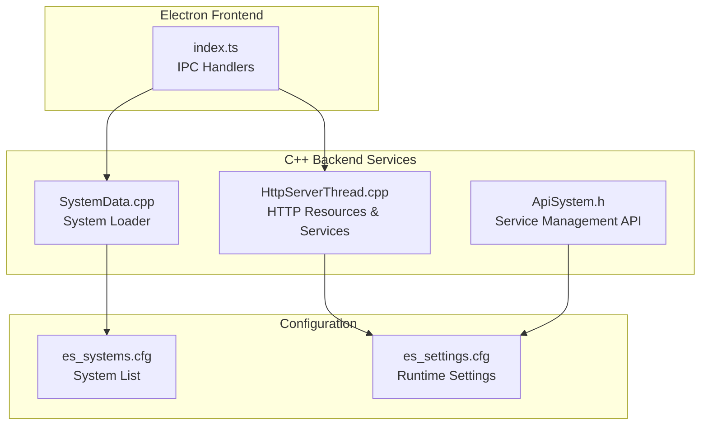
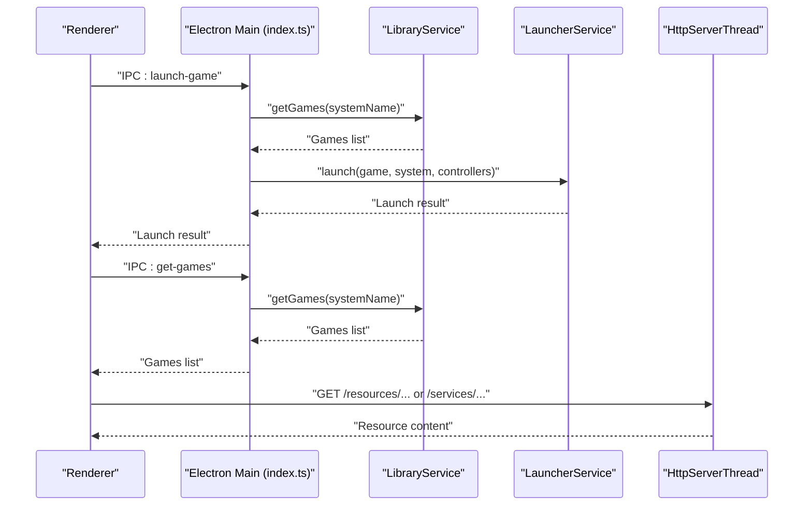
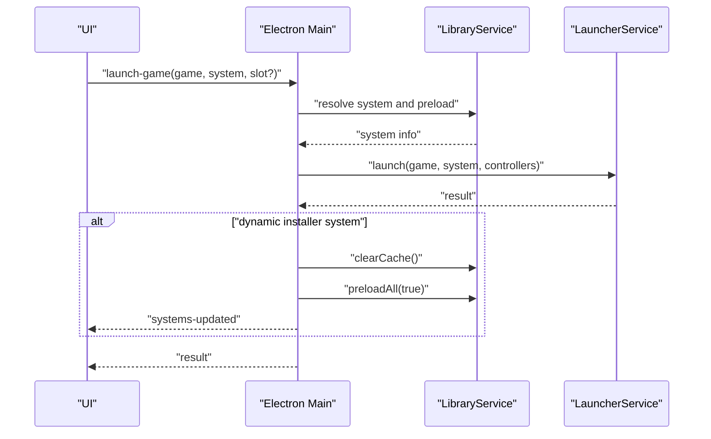
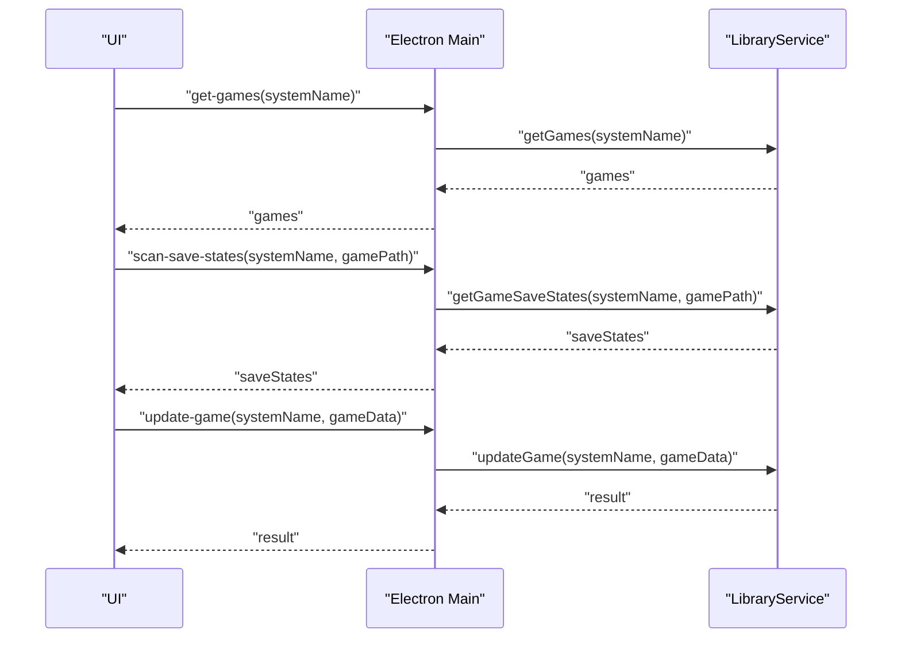
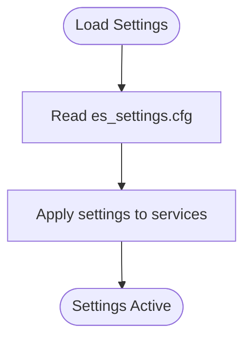
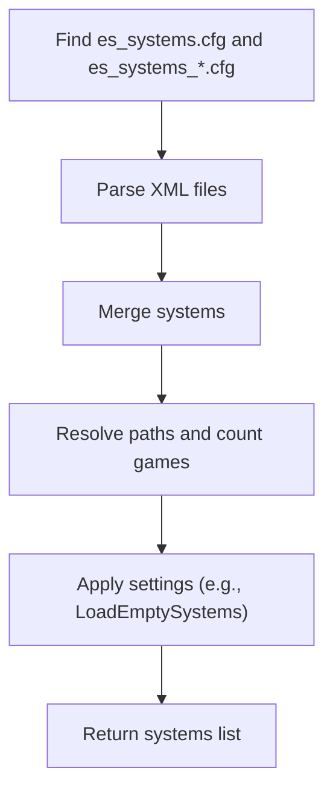
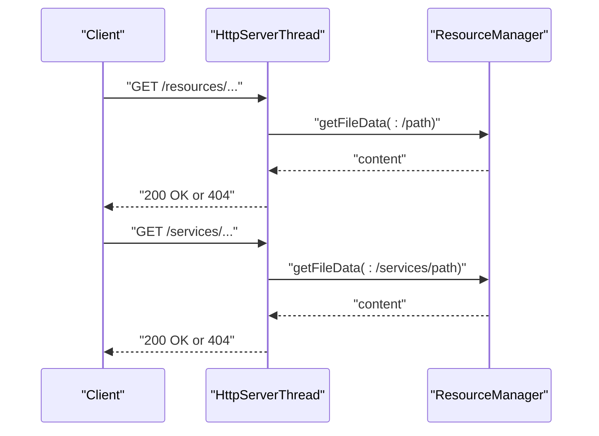
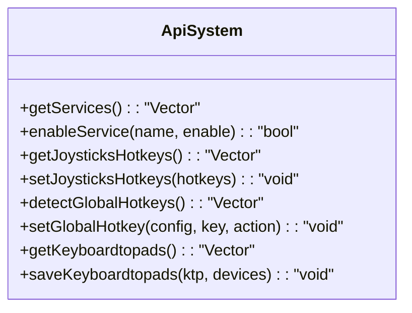
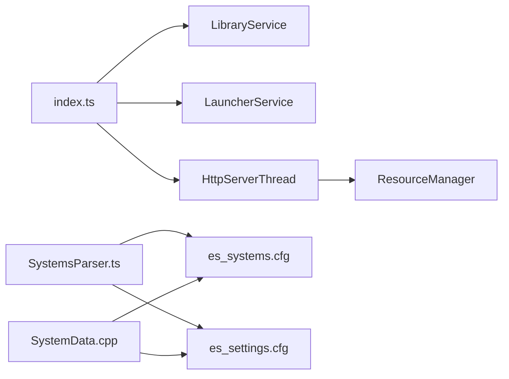

# Integration Guidelines

<cite>
**Referenced Files in This Document**
- [SystemsParser.ts](file://emulationstation/.riescade/src/src/main/parsers/SystemsParser.ts)
- [SystemData.cpp](file://emulationstation/.riescade/src/docs/es_src/SystemData.cpp)
- [index.ts](file://emulationstation/.riescade/src/src/main/index.ts)
- [HttpServerThread.cpp](file://emulationstation/.riescade/src/docs/es_src/services/HttpServerThread.cpp)
- [ApiSystem.h](file://emulationstation/.riescade/src/docs/es_src/ApiSystem.h)
- [README.md](file://README.md)
- [version.info](file://system/version.info)
- [es_systems.cfg](file://emulationstation/.emulationstation/es_systems.cfg)
- [es_settings.cfg](file://emulationstation/.emulationstation/es_settings.cfg)
</cite>

## Table of Contents
1. [Introduction](#introduction)
2. [Project Structure](#project-structure)
3. [Core Components](#core-components)
4. [Architecture Overview](#architecture-overview)
5. [Detailed Component Analysis](#detailed-component-analysis)
6. [Dependency Analysis](#dependency-analysis)
7. [Performance Considerations](#performance-considerations)
8. [Troubleshooting Guide](#troubleshooting-guide)
9. [Conclusion](#conclusion)
10. [Appendices](#appendices)

## Introduction
This document provides integration guidelines for extending RIESCADE_SYSTEM’s functionality through custom services and modules. It focuses on the plugin architecture patterns, service registration mechanisms, and module loading systems present in the codebase. You will learn how to add new emulators, extend existing services, and implement custom features while integrating with the LauncherService, LibraryService, and SettingsParser APIs. The guide also covers the module development lifecycle, testing strategies, deployment considerations, security, and debugging/monitoring approaches.

## Project Structure
RIESCADE_SYSTEM organizes integration points primarily under:
- Electron-based front-end with IPC handlers for launching and library operations
- C++ backend services exposing APIs and HTTP endpoints
- Configuration-driven system discovery via XML-based system lists
- Settings-driven runtime behavior via settings files

**Diagram sources**
- [index.ts:102-138](file://emulationstation/.riescade/src/src/main/index.ts#L102-L138)
- [HttpServerThread.cpp:769-817](file://emulationstation/.riescade/src/docs/es_src/services/HttpServerThread.cpp#L769-L817)
- [ApiSystem.h:357-385](file://emulationstation/.riescade/src/docs/es_src/ApiSystem.h#L357-L385)
- [SystemData.cpp:778-1088](file://emulationstation/.riescade/src/docs/es_src/SystemData.cpp#L778-L1088)
- [es_systems.cfg](file://emulationstation/.emulationstation/es_systems.cfg)
- [es_settings.cfg](file://emulationstation/.emulationstation/es_settings.cfg)

**Section sources**
- [README.md](file://README.md)
- [version.info](file://system/version.info)

## Core Components
- LauncherService integration via IPC: The Electron main process exposes handlers for launching games and scanning save states. These handlers delegate to backend services and notify the UI upon completion.
- LibraryService integration via IPC: The Electron main process exposes handlers for retrieving games, scanning save states, and updating game metadata. It also triggers library refreshes for dynamic content (e.g., Windows installers).
- SettingsParser integration: Settings are loaded from configuration files and influence behavior such as system loading and web access.
- System discovery: Systems are parsed from XML configuration files and merged across multiple sources. Additional system configurations can be loaded from user-specific files.

Key integration touchpoints:
- IPC channels for launching and library operations
- HTTP server serving internal resources and services
- Service management API for enabling/disabling services
- System loader merging multiple system configuration sources

**Section sources**
- [index.ts:102-138](file://emulationstation/.riescade/src/src/main/index.ts#L102-L138)
- [HttpServerThread.cpp:769-817](file://emulationstation/.riescade/src/docs/es_src/services/HttpServerThread.cpp#L769-L817)
- [ApiSystem.h:357-385](file://emulationstation/.riescade/src/docs/es_src/ApiSystem.h#L357-L385)
- [SystemsParser.ts:27-84](file://emulationstation/.riescade/src/src/main/parsers/SystemsParser.ts#L27-L84)
- [SystemData.cpp:778-1088](file://emulationstation/.riescade/src/docs/es_src/SystemData.cpp#L778-L1088)

## Architecture Overview
The integration architecture centers around:
- Electron main process orchestrating IPC-based communication with the renderer
- Backend services exposing APIs and HTTP endpoints for internal resources
- Configuration-driven system discovery and settings management

**Diagram sources**
- [index.ts:102-138](file://emulationstation/.riescade/src/src/main/index.ts#L102-L138)
- [HttpServerThread.cpp:769-817](file://emulationstation/.riescade/src/docs/es_src/services/HttpServerThread.cpp#L769-L817)

## Detailed Component Analysis

### LauncherService Integration
- Purpose: Launch games and handle post-launch actions (e.g., refreshing library for dynamic installers).
- Integration pattern:
  - Renderer invokes IPC channel to request launching.
  - Main process resolves the target system and delegates to the launcher service.
  - On specific system types, the main process clears caches and notifies windows to update the UI.

**Diagram sources**
- [index.ts:102-138](file://emulationstation/.riescade/src/src/main/index.ts#L102-L138)

**Section sources**
- [index.ts:102-138](file://emulationstation/.riescade/src/src/main/index.ts#L102-L138)

### LibraryService Integration
- Purpose: Provide game listings, save-state scanning, and game metadata updates.
- Integration pattern:
  - Renderer requests games or save states via IPC.
  - Main process delegates to the library service and returns results.
  - For dynamic content, the main process triggers library preloading and UI updates.

**Diagram sources**
- [index.ts:102-138](file://emulationstation/.riescade/src/src/main/index.ts#L102-L138)

**Section sources**
- [index.ts:102-138](file://emulationstation/.riescade/src/src/main/index.ts#L102-L138)

### SettingsParser Integration
- Purpose: Load runtime settings that influence system loading and service behavior.
- Integration pattern:
  - Settings are read from configuration files and consumed by parsers and services.
  - Example influences include toggling empty system visibility and web access mode.

**Section sources**
- [SystemsParser.ts:55-57](file://emulationstation/.riescade/src/src/main/parsers/SystemsParser.ts#L55-L57)

### System Discovery and Loading
- Purpose: Discover and merge system configurations from multiple sources.
- Integration pattern:
  - Parse primary and additional system configuration files.
  - Merge systems and compute game counts per system.
  - Optionally filter systems based on settings.

**Diagram sources**
- [SystemsParser.ts:27-84](file://emulationstation/.riescade/src/src/main/parsers/SystemsParser.ts#L27-L84)
- [SystemData.cpp:778-1088](file://emulationstation/.riescade/src/docs/es_src/SystemData.cpp#L778-L1088)

**Section sources**
- [SystemsParser.ts:27-84](file://emulationstation/.riescade/src/src/main/parsers/SystemsParser.ts#L27-L84)
- [SystemData.cpp:778-1088](file://emulationstation/.riescade/src/docs/es_src/SystemData.cpp#L778-L1088)

### HTTP Resource and Service Serving
- Purpose: Serve internal resources and services via HTTP endpoints.
- Integration pattern:
  - Routes for resources and services are registered.
  - Access control checks can be applied before serving content.
  - Public web access can be enabled via settings.

**Diagram sources**
- [HttpServerThread.cpp:769-817](file://emulationstation/.riescade/src/docs/es_src/services/HttpServerThread.cpp#L769-L817)

**Section sources**
- [HttpServerThread.cpp:769-817](file://emulationstation/.riescade/src/docs/es_src/services/HttpServerThread.cpp#L769-L817)

### Service Management API
- Purpose: Enable/disable services and manage hotkeys and devices.
- Integration pattern:
  - Expose service enumeration and toggling.
  - Manage joystick and keyboard-to-pad mappings and global hotkeys.

**Diagram sources**
- [ApiSystem.h:357-385](file://emulationstation/.riescade/src/docs/es_src/ApiSystem.h#L357-L385)

**Section sources**
- [ApiSystem.h:357-385](file://emulationstation/.riescade/src/docs/es_src/ApiSystem.h#L357-L385)

## Dependency Analysis
- Electron main process depends on:
  - LibraryService for game data operations
  - LauncherService for launching titles
  - SettingsParser for runtime configuration
  - HttpServerThread for internal resource serving
- Backend services depend on:
  - Configuration files for system and settings
  - Resource manager for serving bundled assets

**Diagram sources**
- [index.ts:102-138](file://emulationstation/.riescade/src/src/main/index.ts#L102-L138)
- [SystemsParser.ts:27-84](file://emulationstation/.riescade/src/src/main/parsers/SystemsParser.ts#L27-L84)
- [SystemData.cpp:778-1088](file://emulationstation/.riescade/src/docs/es_src/SystemData.cpp#L778-L1088)
- [HttpServerThread.cpp:769-817](file://emulationstation/.riescade/src/docs/es_src/services/HttpServerThread.cpp#L769-L817)

**Section sources**
- [index.ts:102-138](file://emulationstation/.riescade/src/src/main/index.ts#L102-L138)
- [SystemsParser.ts:27-84](file://emulationstation/.riescade/src/src/main/parsers/SystemsParser.ts#L27-L84)
- [SystemData.cpp:778-1088](file://emulationstation/.riescade/src/docs/es_src/SystemData.cpp#L778-L1088)
- [HttpServerThread.cpp:769-817](file://emulationstation/.riescade/src/docs/es_src/services/HttpServerThread.cpp#L769-L817)

## Performance Considerations
- Threading: System loading supports threaded operations when hardware concurrency allows, reducing startup latency.
- Progress reporting: System resolution sends progress updates to the UI during path resolution and counting.
- Caching: Parsers maintain caches to avoid repeated parsing and reduce overhead.
- Resource serving: HTTP server serves bundled resources efficiently; consider enabling public access only when necessary.

[No sources needed since this section provides general guidance]

## Troubleshooting Guide
- System loading failures:
  - Verify presence and validity of system configuration files.
  - Check for missing system list tags and malformed entries.
- IPC communication issues:
  - Ensure IPC channels are registered and invoked correctly.
  - Confirm that the main window exists before sending progress notifications.
- HTTP resource serving:
  - Validate route patterns and access control checks.
  - Confirm resource paths match the resource manager keys.
- Settings-driven behavior:
  - Review settings affecting system loading and web access modes.

**Section sources**
- [SystemData.cpp:778-1088](file://emulationstation/.riescade/src/docs/es_src/SystemData.cpp#L778-L1088)
- [index.ts:102-138](file://emulationstation/.riescade/src/src/main/index.ts#L102-L138)
- [HttpServerThread.cpp:769-817](file://emulationstation/.riescade/src/docs/es_src/services/HttpServerThread.cpp#L769-L817)

## Conclusion
RIESCADE_SYSTEM provides a robust foundation for extensions through its IPC-based LauncherService and LibraryService integrations, configuration-driven system discovery, and HTTP-based resource serving. By following the integration patterns outlined here—registering IPC handlers, leveraging settings, and adhering to service management APIs—you can develop custom services and modules that integrate seamlessly with the existing architecture.

[No sources needed since this section summarizes without analyzing specific files]

## Appendices

### A. Adding a New Emulator
- Steps:
  - Define system configuration entries in the appropriate system configuration file.
  - Ensure the system list tag is present and entries are valid.
  - Optionally provide additional configuration files prefixed with the system identifier.
  - Confirm that the system appears after reload and that game counts are computed.

**Section sources**
- [SystemData.cpp:778-1088](file://emulationstation/.riescade/src/docs/es_src/SystemData.cpp#L778-L1088)
- [SystemsParser.ts:27-84](file://emulationstation/.riescade/src/src/main/parsers/SystemsParser.ts#L27-L84)

### B. Extending Existing Services
- LauncherService:
  - Add IPC handlers for new commands.
  - Delegate to backend services and propagate results to the UI.
- LibraryService:
  - Implement new retrieval/update operations via IPC.
  - Trigger UI refreshes when dynamic content changes.
- SettingsParser:
  - Introduce new settings and gate behavior accordingly.

**Section sources**
- [index.ts:102-138](file://emulationstation/.riescade/src/src/main/index.ts#L102-L138)
- [SystemsParser.ts:55-57](file://emulationstation/.riescade/src/src/main/parsers/SystemsParser.ts#L55-L57)

### C. Module Development Lifecycle
- Plan: Identify integration points (IPC, HTTP, settings).
- Develop: Implement handlers and service logic.
- Test: Validate IPC flows, HTTP routes, and configuration effects.
- Deploy: Package and distribute modules; update configuration as needed.
- Monitor: Observe logs and UI feedback for errors or performance issues.

[No sources needed since this section provides general guidance]

### D. Security Considerations
- Sandboxing:
  - Restrict IPC access to trusted channels.
  - Validate and sanitize inputs received via IPC.
- Resource access:
  - Enforce access control in HTTP handlers.
  - Avoid exposing sensitive paths via resource serving.
- Settings:
  - Harden settings files against tampering.
  - Limit public web access to trusted environments.

[No sources needed since this section provides general guidance]

### E. Debugging and Monitoring
- Logging:
  - Use backend logging facilities for configuration parsing and system loading.
- UI feedback:
  - Send progress updates during long-running operations.
- HTTP diagnostics:
  - Verify route patterns and response codes.
- Settings verification:
  - Confirm that settings changes take effect as expected.

**Section sources**
- [SystemData.cpp:778-1088](file://emulationstation/.riescade/src/docs/es_src/SystemData.cpp#L778-L1088)
- [index.ts:102-138](file://emulationstation/.riescade/src/src/main/index.ts#L102-L138)
- [HttpServerThread.cpp:769-817](file://emulationstation/.riescade/src/docs/es_src/services/HttpServerThread.cpp#L769-L817)