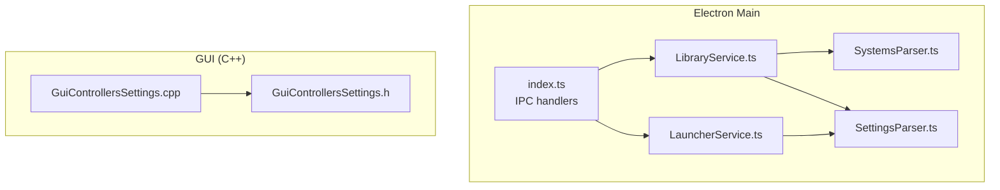
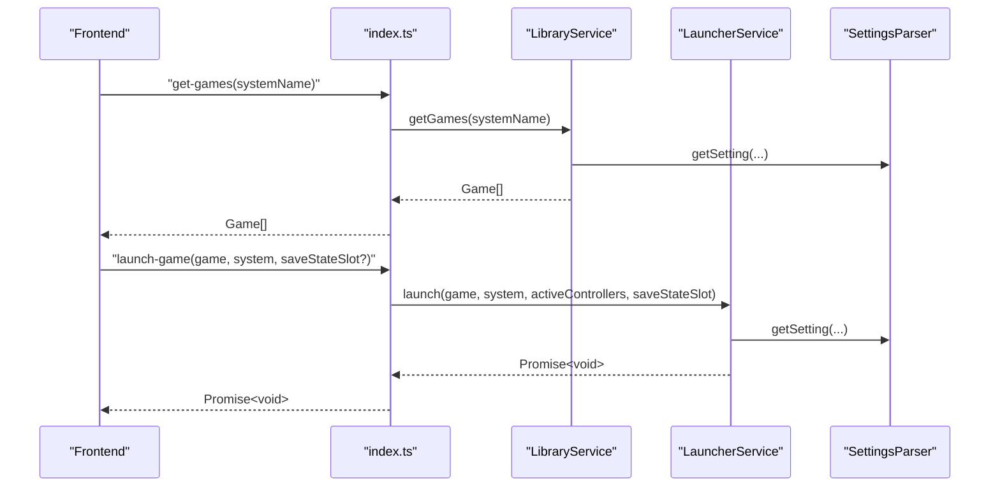
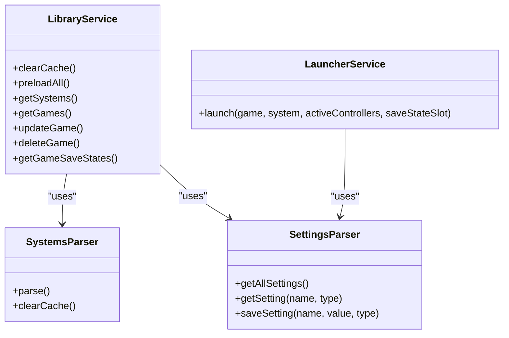

# Service APIs

<cite>
**Referenced Files in This Document**
- [LibraryService.ts](file://emulationstation/.riescade/src/src/main/services/LibraryService.ts)
- [LauncherService.ts](file://emulationstation/.riescade/src/src/main/services/LauncherService.ts)
- [SettingsParser.ts](file://emulationstation/.riescade/src/src/main/parsers/SettingsParser.ts)
- [SystemsParser.ts](file://emulationstation/.riescade/src/src/main/parsers/SystemsParser.ts)
- [GuiControllersSettings.h](file://emulationstation/.riescade/src/docs/es_src/guis/GuiControllersSettings.h)
- [GuiControllersSettings.cpp](file://emulationstation/.riescade/src/docs/es_src/guis/GuiControllersSettings.cpp)
- [index.ts](file://emulationstation/.riescade/src/src/main/index.ts)
</cite>

## Table of Contents
1. [Introduction](#introduction)
2. [Project Structure](#project-structure)
3. [Core Components](#core-components)
4. [Architecture Overview](#architecture-overview)
5. [Detailed Component Analysis](#detailed-component-analysis)
6. [Dependency Analysis](#dependency-analysis)
7. [Performance Considerations](#performance-considerations)
8. [Troubleshooting Guide](#troubleshooting-guide)
9. [Conclusion](#conclusion)

## Introduction
This document provides comprehensive API documentation for RIESCADE_SYSTEM’s core service interfaces. It covers:
- LibraryService: game discovery, metadata enrichment, collection management, and library indexing operations
- LauncherService: emulator launching, process management, and game execution coordination
- SettingsParser: configuration file processing, validation, and settings management
- GuiControllersSettings: input device configuration and hotkey management

It also documents initialization sequences, dependency injection patterns, lifecycle management, performance characteristics, caching strategies, and concurrent access handling.

## Project Structure
The services are implemented in TypeScript for the Electron main process and integrate with C++ GUI components for input configuration. The primary entrypoint wires IPC handlers to these services.

**Diagram sources**
- [index.ts:102-138](file://emulationstation/.riescade/src/src/main/index.ts#L102-L138)
- [LibraryService.ts:21-28](file://emulationstation/.riescade/src/src/main/services/LibraryService.ts#L21-L28)
- [LauncherService.ts:18-25](file://emulationstation/.riescade/src/src/main/services/LauncherService.ts#L18-L25)
- [SettingsParser.ts:6-29](file://emulationstation/.riescade/src/src/main/parsers/SettingsParser.ts#L6-L29)
- [SystemsParser.ts:8-25](file://emulationstation/.riescade/src/src/main/parsers/SystemsParser.ts#L8-L25)
- [GuiControllersSettings.h:23-44](file://emulationstation/.riescade/src/docs/es_src/guis/GuiControllersSettings.h#L23-L44)
- [GuiControllersSettings.cpp:385-522](file://emulationstation/.riescade/src/docs/es_src/guis/GuiControllersSettings.cpp#L385-L522)

**Section sources**
- [index.ts:102-138](file://emulationstation/.riescade/src/src/main/index.ts#L102-L138)
- [LibraryService.ts:21-28](file://emulationstation/.riescade/src/src/main/services/LibraryService.ts#L21-L28)
- [LauncherService.ts:18-25](file://emulationstation/.riescade/src/src/main/services/LauncherService.ts#L18-L25)
- [SettingsParser.ts:6-29](file://emulationstation/.riescade/src/src/main/parsers/SettingsParser.ts#L6-L29)
- [SystemsParser.ts:8-25](file://emulationstation/.riescade/src/src/main/parsers/SystemsParser.ts#L8-L25)
- [GuiControllersSettings.h:23-44](file://emulationstation/.riescade/src/docs/es_src/guis/GuiControllersSettings.h#L23-L44)
- [GuiControllersSettings.cpp:385-522](file://emulationstation/.riescade/src/docs/es_src/guis/GuiControllersSettings.cpp#L385-L522)

## Core Components
- LibraryService: central library manager handling system discovery, game scanning, metadata enrichment, auto-collections, and gamelist persistence
- LauncherService: orchestrates emulator execution, resolves emulator/core selection, prepares controller arguments, and manages save-state slots
- SettingsParser: reads/writes es_settings.cfg/es_settings.xml, exposes typed getters, and clears caches on relevant changes
- GuiControllersSettings: GUI module for input device configuration, hotkeys, and keyboard-to-pad mapping

**Section sources**
- [LibraryService.ts:21-28](file://emulationstation/.riescade/src/src/main/services/LibraryService.ts#L21-L28)
- [LauncherService.ts:18-25](file://emulationstation/.riescade/src/src/main/services/LauncherService.ts#L18-L25)
- [SettingsParser.ts:37-77](file://emulationstation/.riescade/src/src/main/parsers/SettingsParser.ts#L37-L77)
- [GuiControllersSettings.h:23-44](file://emulationstation/.riescade/src/docs/es_src/guis/GuiControllersSettings.h#L23-L44)

## Architecture Overview
High-level flow:
- Frontend triggers IPC handlers to request library data or launch a game
- index.ts routes requests to LibraryService or LauncherService
- LibraryService coordinates SystemsParser and SettingsParser for discovery and configuration
- LauncherService constructs emulator arguments and spawns emulatorLauncher.exe

**Diagram sources**
- [index.ts:102-138](file://emulationstation/.riescade/src/src/main/index.ts#L102-L138)
- [LibraryService.ts:713-759](file://emulationstation/.riescade/src/src/main/services/LibraryService.ts#L713-L759)
- [LauncherService.ts:19-209](file://emulationstation/.riescade/src/src/main/services/LauncherService.ts#L19-L209)
- [SettingsParser.ts:74-77](file://emulationstation/.riescade/src/src/main/parsers/SettingsParser.ts#L74-L77)

## Detailed Component Analysis

### LibraryService API
Responsibilities:
- System discovery and filtering (visible, hidden, grouped)
- Game discovery via gamelists and filesystem scanning
- Metadata enrichment and normalization
- Auto-collections (favorites, recent, neverplayed, 2/4-player, RetroAchievements, control-type, genre/manufacturer)
- Custom collections management
- Gamelist persistence and cleanup
- Save-state enumeration

Key methods and signatures:
- clearCache(): void
  - Clears in-memory caches and related parsers’ caches
  - Side effects: invalidates genre map, control-type data, quick counts, and parser caches
- preloadAll(forcePhysicalScan?: boolean): Promise<void>
  - Preloads library for all systems with progress events
- preloadSystem(systemName: string, forcePhysicalScan?: boolean): Promise<void>
  - Preloads a single system and updates auto-collections
- preloadAllSync(forcePhysicalScan?: boolean): void
  - Synchronous preload variant
- getSystems(): System[]
  - Returns systems with computed gamecounts and virtual “collections” system
- getDisplayedSystems(): System[]
  - Applies VisibleSystems, HiddenSystems, SystemsGrouped filters
- getGamesFromDisplayedSystems(): Game[]
  - Aggregates games from displayed systems with caching
- getGames(systemName: string): Game[]
  - Returns games for a system, resolving auto-collections and caching
- getGamesRaw(systemName: string, forcePhysicalScan?: boolean, xmlOnly?: boolean): Game[]
  - Scans filesystem and merges with gamelist metadata
- getCustomCollections(): string[]
  - Lists custom collections
- getCollectionGames(collectionName: string): Game[]
  - Resolves collection entries to actual games
- updateGame(systemName: string, gameData: Game): void
  - Updates gamelist and in-memory cache, rebuilds auto-collections
- deleteGame(systemName: string, gamePath: string, deletePhysical: boolean): void
  - Removes game from gamelists, custom collections, cache; optionally deletes physical file
- getCollectionsForGame(systemName: string, gamePath: string): string[]
  - Lists collections containing a game
- toggleGameInCollection(collectionName: string, systemName: string, gamePath: string, action: 'add' | 'remove'): boolean
  - Adds or removes a game from a custom collection
- cleanGamelists(): void
  - Removes missing media references from gamelists
- resetGamelistUsage(): void
  - Resets playcount and related fields
- resetFileExtensions(): void
  - Clears per-system hidden extension settings
- clearCaches(): void
  - Clears temp directories
- getGameSaveStates(systemName: string, gamePath: string): any[]
  - Enumerates save states and screenshots for a game

Parameters and return types:
- Methods accept and return strongly typed domain objects (System, Game) defined in shared types
- SettingsParser is used for configuration queries (e.g., VisibleSystems, HiddenSystems, CollectionSystemsAuto, etc.)

Error handling:
- Methods catch and log errors during file operations and XML parsing
- Some operations return empty results gracefully when resources are missing

Usage examples:
- Fetch all games for a system: getGames(systemName)
- Launch a game: IPC handler invokes LauncherService.launch(game, system, activeControllers, saveStateSlot)
- Update a game’s metadata: updateGame(systemName, gameData)

Lifecycle and initialization:
- LibraryService constructs SystemsParser and GamelistParser internally
- Preloading is triggered implicitly by getSystems/getDisplayedSystems and explicitly via preloadAll/preloadSystem
- Settings changes that affect system visibility/collections trigger cache clearing

Concurrency and caching:
- Thread-local caches keyed by system name and auto-collection keys
- Quick auto-counts cached for fast UI rendering
- Genre map and control-type data cached for repeated lookups

**Section sources**
- [LibraryService.ts:43-54](file://emulationstation/.riescade/src/src/main/services/LibraryService.ts#L43-L54)
- [LibraryService.ts:471-496](file://emulationstation/.riescade/src/src/main/services/LibraryService.ts#L471-L496)
- [LibraryService.ts:498-542](file://emulationstation/.riescade/src/src/main/services/LibraryService.ts#L498-L542)
- [LibraryService.ts:544-549](file://emulationstation/.riescade/src/src/main/services/LibraryService.ts#L544-L549)
- [LibraryService.ts:551-649](file://emulationstation/.riescade/src/src/main/services/LibraryService.ts#L551-L649)
- [LibraryService.ts:651-693](file://emulationstation/.riescade/src/src/main/services/LibraryService.ts#L651-L693)
- [LibraryService.ts:695-711](file://emulationstation/.riescade/src/src/main/services/LibraryService.ts#L695-L711)
- [LibraryService.ts:713-759](file://emulationstation/.riescade/src/src/main/services/LibraryService.ts#L713-L759)
- [LibraryService.ts:761-886](file://emulationstation/.riescade/src/src/main/services/LibraryService.ts#L761-L886)
- [LibraryService.ts:1106-1124](file://emulationstation/.riescade/src/src/main/services/LibraryService.ts#L1106-L1124)
- [LibraryService.ts:1126-1190](file://emulationstation/.riescade/src/src/main/services/LibraryService.ts#L1126-L1190)
- [LibraryService.ts:1192-1253](file://emulationstation/.riescade/src/src/main/services/LibraryService.ts#L1192-L1253)
- [LibraryService.ts:1255-1323](file://emulationstation/.riescade/src/src/main/services/LibraryService.ts#L1255-L1323)
- [LibraryService.ts:1325-1359](file://emulationstation/.riescade/src/src/main/services/LibraryService.ts#L1325-L1359)
- [LibraryService.ts:1361-1382](file://emulationstation/.riescade/src/src/main/services/LibraryService.ts#L1361-L1382)
- [LibraryService.ts:1384-1420](file://emulationstation/.riescade/src/src/main/services/LibraryService.ts#L1384-L1420)
- [LibraryService.ts:1422-1500](file://emulationstation/.riescade/src/src/main/services/LibraryService.ts#L1422-L1500)
- [LibraryService.ts:1502-1509](file://emulationstation/.riescade/src/src/main/services/LibraryService.ts#L1502-L1509)
- [LibraryService.ts:1511-1539](file://emulationstation/.riescade/src/src/main/services/LibraryService.ts#L1511-L1539)
- [LibraryService.ts:1541-1640](file://emulationstation/.riescade/src/src/main/services/LibraryService.ts#L1541-L1640)

### LauncherService API
Responsibilities:
- Resolve emulator and core selection based on game/system overrides and settings
- Prepare controller mapping arguments for emulatorLauncher.exe
- Manage save-state slot arguments and autosave behavior
- Support launching .menu shortcuts by parsing emulator commands
- Spawn emulatorLauncher.exe with constructed arguments

Key methods and signatures:
- launch(game: Game, system: System, activeControllers: ControllerInfo[] = [], saveStateSlot?: number): Promise<void>
  - Orchestrates launch preparation and execution
  - Returns a Promise that resolves when the process exits

Parameters and return types:
- ControllerInfo: name, guid, path?, buttons, axes, hats
- Returns Promise<void>; errors are logged and the promise resolves

Error handling:
- Logs warnings when emulatorLauncher.exe exits with non-zero code
- Gracefully handles .menu file parsing failures

Usage examples:
- Launch a game with controllers and save-state slot: launch(game, system, activeControllers, saveStateSlot)

Lifecycle and initialization:
- No explicit constructor; relies on injected paths and settings resolution

Concurrency and caching:
- No persistent caches; performs argument construction per invocation

**Section sources**
- [LauncherService.ts:18-25](file://emulationstation/.riescade/src/src/main/services/LauncherService.ts#L18-L25)
- [LauncherService.ts:19-209](file://emulationstation/.riescade/src/src/main/services/LauncherService.ts#L19-L209)

### SettingsParser API
Responsibilities:
- Parse es_settings.cfg or es_settings.xml into a typed settings map
- Provide typed getters (string, bool, int, float)
- Persist settings back to disk with XMLBuilder
- Clear caches when settings affecting system configuration change

Key methods and signatures:
- getAllSettings(): any
  - Parses and returns all settings
- getSetting(settingName: string, type: 'string' | 'bool' | 'int' | 'float'): any
  - Returns the value of a setting or null if not found
- saveSetting(name: string, value: any, type: 'string' | 'bool' | 'int' | 'float'): void
  - Writes settings to disk and clears caches when relevant
- getSelectedTheme(): string
  - Convenience getter for theme selection

Parameters and return types:
- Setting values are stored with their declared type
- Returns typed values or null for missing settings

Error handling:
- Catches and logs errors during parsing and writing
- Clears caches when specific settings change (e.g., VisibleSystems, HiddenSystems)

Usage examples:
- Read a boolean setting: getSetting('ShowHidden', 'bool')
- Save a string setting: saveSetting('RIESCADE.ThemeSet', 'default', 'string')

Lifecycle and initialization:
- Uses fast-xml-parser for parsing and building XML

**Section sources**
- [SettingsParser.ts:37-68](file://emulationstation/.riescade/src/src/main/parsers/SettingsParser.ts#L37-L68)
- [SettingsParser.ts:74-77](file://emulationstation/.riescade/src/src/main/parsers/SettingsParser.ts#L74-L77)
- [SettingsParser.ts:79-153](file://emulationstation/.riescade/src/src/main/parsers/SettingsParser.ts#L79-L153)

### GuiControllersSettings API
Responsibilities:
- Manage input device configuration and hotkeys
- Open controller-specific settings windows
- Manage global hotkeys and keyboard-to-pad mappings
- Persist controller selections and hotkey configurations

Key methods and signatures:
- openControllersSettings(wnd: Window*, autoSel?: number): void
- openControllersHotkeys(): void
- openGlobalHotkeys(): void
- openKeyboardtopads(): void
- getControllersSettingsLabel(): string

Internal helpers:
- initializeGlobalHotkeys(window: Window*, s: GuiSettings*): void
- declareGlobalHotkey(window: Window*, s: GuiSettings*): void
- clearLoadedInput(): void

Usage examples:
- Open controller hotkeys configuration: openControllersHotkeys()
- Open global hotkeys configuration: openGlobalHotkeys()

Lifecycle and initialization:
- Constructed with a Window pointer and optional auto-selection index
- Persists changes to Settings via ApiSystem calls

**Section sources**
- [GuiControllersSettings.h:25-44](file://emulationstation/.riescade/src/docs/es_src/guis/GuiControllersSettings.h#L25-L44)
- [GuiControllersSettings.cpp:385-522](file://emulationstation/.riescade/src/docs/es_src/guis/GuiControllersSettings.cpp#L385-L522)

## Dependency Analysis
- LibraryService depends on SystemsParser and SettingsParser for discovery and configuration
- LauncherService depends on SettingsParser for emulator/core selection and on OS-level child process execution
- index.ts wires IPC handlers to route requests to LibraryService and LauncherService
- GuiControllersSettings is a C++ GUI component that persists settings via ApiSystem

**Diagram sources**
- [LibraryService.ts:21-28](file://emulationstation/.riescade/src/src/main/services/LibraryService.ts#L21-L28)
- [LauncherService.ts:18-25](file://emulationstation/.riescade/src/src/main/services/LauncherService.ts#L18-L25)
- [SettingsParser.ts:6-29](file://emulationstation/.riescade/src/src/main/parsers/SettingsParser.ts#L6-L29)
- [SystemsParser.ts:8-25](file://emulationstation/.riescade/src/src/main/parsers/SystemsParser.ts#L8-L25)

**Section sources**
- [LibraryService.ts:21-28](file://emulationstation/.riescade/src/src/main/services/LibraryService.ts#L21-L28)
- [LauncherService.ts:18-25](file://emulationstation/.riescade/src/src/main/services/LauncherService.ts#L18-L25)
- [SettingsParser.ts:6-29](file://emulationstation/.riescade/src/src/main/parsers/SettingsParser.ts#L6-L29)
- [SystemsParser.ts:8-25](file://emulationstation/.riescade/src/src/main/parsers/SystemsParser.ts#L8-L25)

## Performance Considerations
- Caching
  - LibraryService caches games per system and auto-collections to avoid repeated scans
  - Quick auto-counts cache reduces UI latency for collection sizes
  - Genre map and control-type data are cached after initial computation
- Scanning limits
  - Filesystem scanning recurses up to depth 2 to prevent hangs on large directories
  - Arcade BIOS/device assets are filtered out for arcade/neogeo systems
- XML parsing
  - fast-xml-parser configured with reasonable expansion limits for large configs
- Asynchronous loading
  - Preloading sends progress updates via IPC to keep UI responsive
- Save-state enumeration
  - Limited recursion depth and regex-based filtering for efficient discovery

[No sources needed since this section provides general guidance]

## Troubleshooting Guide
Common issues and resolutions:
- Settings not applied
  - Verify es_settings.cfg/es_settings.xml exists and is readable
  - Use saveSetting to persist changes; ensure type matches expected
- Games not appearing
  - Check VisibleSystems, HiddenSystems, SystemsGrouped settings
  - Run cleanGamelists to remove missing media references
  - Use resetGamelistUsage to reset playcounts
- Launcher errors
  - Confirm emulatorLauncher.exe path and arguments
  - Validate emulator/core selection logic and controller GUID/path mapping
- Controller hotkeys not working
  - Re-open controller hotkeys and global hotkeys dialogs
  - Ensure device paths are discoverable via PowerShell enumeration

**Section sources**
- [SettingsParser.ts:79-153](file://emulationstation/.riescade/src/src/main/parsers/SettingsParser.ts#L79-L153)
- [LibraryService.ts:1422-1500](file://emulationstation/.riescade/src/src/main/services/LibraryService.ts#L1422-L1500)
- [LauncherService.ts:19-209](file://emulationstation/.riescade/src/src/main/services/LauncherService.ts#L19-L209)
- [GuiControllersSettings.cpp:385-522](file://emulationstation/.riescade/src/docs/es_src/guis/GuiControllersSettings.cpp#L385-L522)

## Conclusion
RIESCADE_SYSTEM’s service APIs provide a robust foundation for library management, emulator launching, and configuration handling. LibraryService offers comprehensive discovery and caching, LauncherService encapsulates emulator orchestration, SettingsParser ensures reliable configuration persistence, and GuiControllersSettings enables flexible input device management. Together, they support responsive UI interactions and scalable performance through strategic caching and controlled filesystem access.