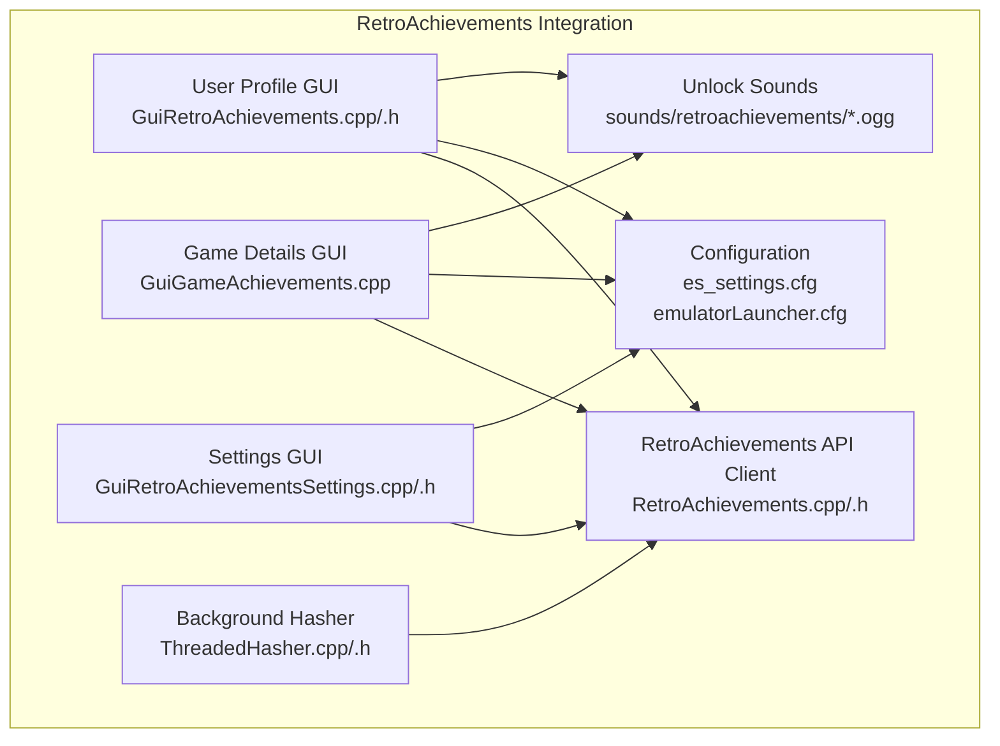
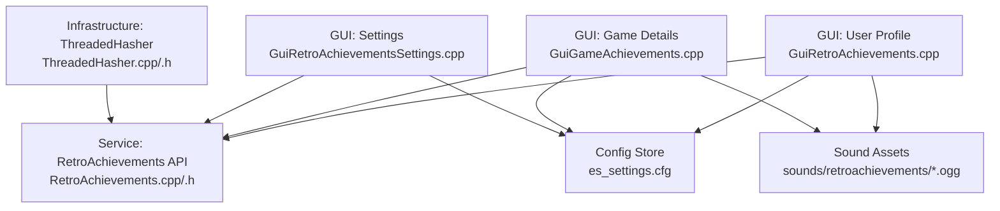
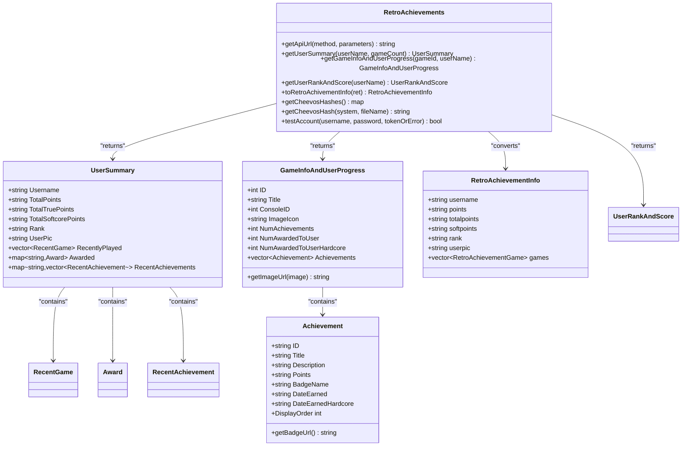
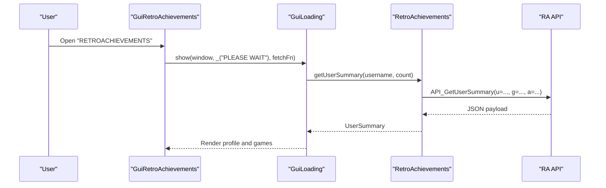
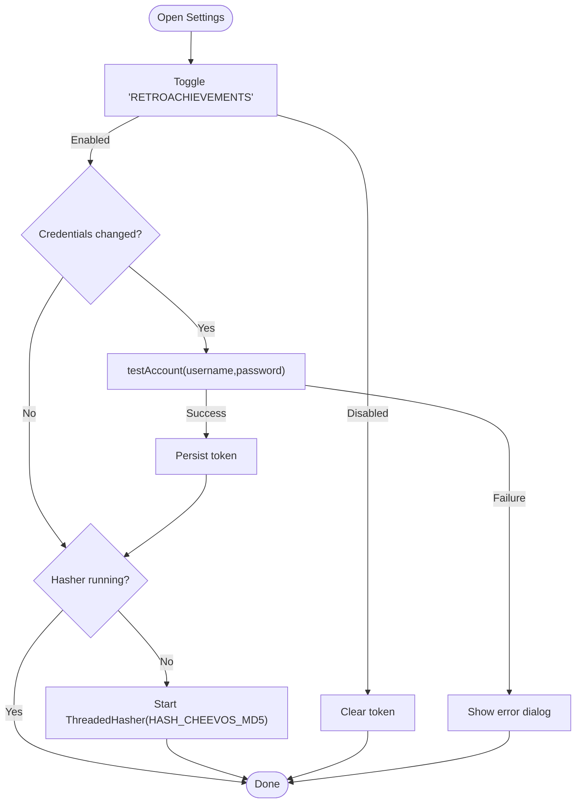
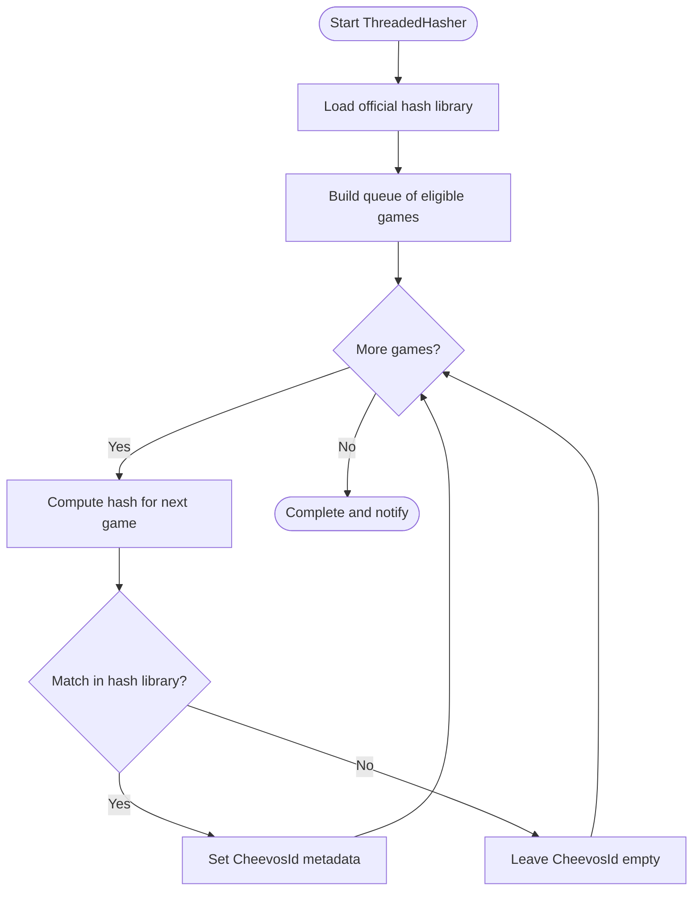
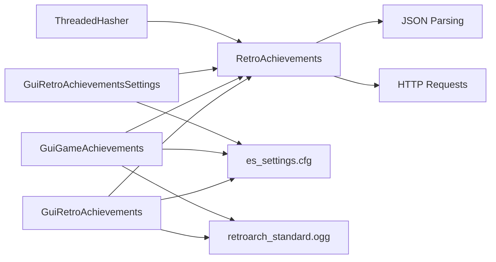

# Achievement Management

<cite>
**Referenced Files in This Document**
- [RetroAchievements.h](file://emulationstation/.riescade/src/docs/es_src/RetroAchievements.h)
- [RetroAchievements.cpp](file://emulationstation/.riescade/src/docs/es_src/RetroAchievements.cpp)
- [GuiRetroAchievements.h](file://emulationstation/.riescade/src/docs/es_src/guis/GuiRetroAchievements.h)
- [GuiRetroAchievements.cpp](file://emulationstation/.riescade/src/docs/es_src/guis/GuiRetroAchievements.cpp)
- [GuiGameAchievements.cpp](file://emulationstation/.riescade/src/docs/es_src/guis/GuiGameAchievements.cpp)
- [GuiRetroAchievementsSettings.cpp](file://emulationstation/.riescade/src/docs/es_src/guis/GuiRetroAchievementsSettings.cpp)
- [GuiRetroAchievementsSettings.h](file://emulationstation/.riescade/src/docs/es_src/guis/GuiRetroAchievementsSettings.h)
- [ThreadedHasher.h](file://emulationstation/.riescade/src/docs/es_src/ThreadedHasher.h)
- [ThreadedHasher.cpp](file://emulationstation/.riescade/src/docs/es_src/ThreadedHasher.cpp)
- [es_settings.cfg](file://emulationstation/.emulationstation/es_settings.cfg)
- [emulatorLauncher.cfg](file://emulationstation/emulatorLauncher.cfg)
- [retroarch_standard.ogg](file://sounds/retroachievements/retroarch_standard.ogg)
- [retroarch_standard.ogg](file://system/templates/retroarch/assets/sounds/retroachievements/retroarch_standard.ogg)
</cite>

## Table of Contents
1. [Introduction](#introduction)
2. [Project Structure](#project-structure)
3. [Core Components](#core-components)
4. [Architecture Overview](#architecture-overview)
5. [Detailed Component Analysis](#detailed-component-analysis)
6. [Dependency Analysis](#dependency-analysis)
7. [Performance Considerations](#performance-considerations)
8. [Troubleshooting Guide](#troubleshooting-guide)
9. [Conclusion](#conclusion)
10. [Appendices](#appendices)

## Introduction
This document explains the RetroAchievements integration in RIESCADE_SYSTEM. It covers how achievements are tracked, synchronized, and displayed within the emulation environment, the service implementation and API integration, authentication mechanisms, and the relationship between achievements and game metadata. It also documents configuration options, notification preferences, and sync behavior, along with troubleshooting guidance and performance considerations.

## Project Structure
The RetroAchievements feature spans several modules:
- RetroAchievements API client and data models
- GUI components for browsing user profiles, per-game details, and settings
- Background hashing indexer to associate ROMs with achievement IDs
- Configuration and localization entries
- Sound assets for unlock notifications

**Diagram sources**
- [RetroAchievements.cpp:142-150](file://emulationstation/.riescade/src/docs/es_src/RetroAchievements.cpp#L142-L150)
- [GuiRetroAchievements.cpp:282-330](file://emulationstation/.riescade/src/docs/es_src/guis/GuiRetroAchievements.cpp#L282-L330)
- [GuiGameAchievements.cpp:21-37](file://emulationstation/.riescade/src/docs/es_src/guis/GuiGameAchievements.cpp#L21-L37)
- [GuiRetroAchievementsSettings.cpp:12-100](file://emulationstation/.riescade/src/docs/es_src/guis/GuiRetroAchievementsSettings.cpp#L12-L100)
- [ThreadedHasher.cpp:175-219](file://emulationstation/.riescade/src/docs/es_src/ThreadedHasher.cpp#L175-L219)
- [es_settings.cfg:161-162](file://emulationstation/.emulationstation/es_settings.cfg#L161-L162)
- [emulatorLauncher.cfg:11-11](file://emulationstation/emulatorLauncher.cfg#L11-L11)
- [retroarch_standard.ogg:1-1](file://sounds/retroachievements/retroarch_standard.ogg#L1-L1)

**Section sources**
- [RetroAchievements.h:1-228](file://emulationstation/.riescade/src/docs/es_src/RetroAchievements.h#L1-L228)
- [RetroAchievements.cpp:1-697](file://emulationstation/.riescade/src/docs/es_src/RetroAchievements.cpp#L1-L697)
- [GuiRetroAchievements.h:1-38](file://emulationstation/.riescade/src/docs/es_src/guis/GuiRetroAchievements.h#L1-L38)
- [GuiRetroAchievements.cpp:282-330](file://emulationstation/.riescade/src/docs/es_src/guis/GuiRetroAchievements.cpp#L282-L330)
- [GuiGameAchievements.cpp:21-37](file://emulationstation/.riescade/src/docs/es_src/guis/GuiGameAchievements.cpp#L21-L37)
- [GuiRetroAchievementsSettings.cpp:12-100](file://emulationstation/.riescade/src/docs/es_src/guis/GuiRetroAchievementsSettings.cpp#L12-L100)
- [ThreadedHasher.h:1-58](file://emulationstation/.riescade/src/docs/es_src/ThreadedHasher.h#L1-L58)
- [ThreadedHasher.cpp:1-219](file://emulationstation/.riescade/src/docs/es_src/ThreadedHasher.cpp#L1-L219)
- [es_settings.cfg:161-162](file://emulationstation/.emulationstation/es_settings.cfg#L161-L162)
- [emulatorLauncher.cfg:11-11](file://emulationstation/emulatorLauncher.cfg#L11-L11)

## Core Components
- RetroAchievements API client
  - Provides methods to fetch user summaries, game info with user progress, user rank and score, and to test accounts.
  - Implements MD5 and console-specific hashing for ROM identification.
  - Exposes helper methods to convert user summary data into UI-friendly structures and to fetch official hashes.
- GUI components
  - User profile view displays points, rank, and recently played games with achievement stats.
  - Game details view lists achievements, completion status, points, and progress bars.
  - Settings view toggles RetroAchievements features and manages credentials and tokens.
- Background hasher
  - Indexes ROMs to compute hashes and match them against official RetroAchievements databases to set Cheevos IDs on games.
- Configuration and localization
  - Global keys enable RetroAchievements, store username/password/token, and control feature flags.
  - Localization entries support UI strings for Hardcore mode, icons, and activation messages.
- Sound assets
  - Unlock notification sound is configurable via system settings.

**Section sources**
- [RetroAchievements.h:210-227](file://emulationstation/.riescade/src/docs/es_src/RetroAchievements.h#L210-L227)
- [RetroAchievements.cpp:291-430](file://emulationstation/.riescade/src/docs/es_src/RetroAchievements.cpp#L291-L430)
- [GuiRetroAchievements.cpp:282-330](file://emulationstation/.riescade/src/docs/es_src/guis/GuiRetroAchievements.cpp#L282-L330)
- [GuiGameAchievements.cpp:21-37](file://emulationstation/.riescade/src/docs/es_src/guis/GuiGameAchievements.cpp#L21-L37)
- [GuiRetroAchievementsSettings.cpp:12-100](file://emulationstation/.riescade/src/docs/es_src/guis/GuiRetroAchievementsSettings.cpp#L12-L100)
- [ThreadedHasher.cpp:175-219](file://emulationstation/.riescade/src/docs/es_src/ThreadedHasher.cpp#L175-L219)
- [es_settings.cfg:161-162](file://emulationstation/.emulationstation/es_settings.cfg#L161-L162)
- [emulatorLauncher.cfg:11-11](file://emulationstation/emulatorLauncher.cfg#L11-L11)

## Architecture Overview
The integration consists of three layers:
- Presentation layer: GUIs for profile, game details, and settings.
- Service layer: RetroAchievements API client encapsulating HTTP requests and JSON parsing.
- Infrastructure layer: Background hashing indexer and configuration storage.

**Diagram sources**
- [GuiRetroAchievements.cpp:282-330](file://emulationstation/.riescade/src/docs/es_src/guis/GuiRetroAchievements.cpp#L282-L330)
- [GuiGameAchievements.cpp:21-37](file://emulationstation/.riescade/src/docs/es_src/guis/GuiGameAchievements.cpp#L21-L37)
- [GuiRetroAchievementsSettings.cpp:12-100](file://emulationstation/.riescade/src/docs/es_src/guis/GuiRetroAchievementsSettings.cpp#L12-L100)
- [RetroAchievements.cpp:142-150](file://emulationstation/.riescade/src/docs/es_src/RetroAchievements.cpp#L142-L150)
- [ThreadedHasher.cpp:175-219](file://emulationstation/.riescade/src/docs/es_src/ThreadedHasher.cpp#L175-L219)
- [es_settings.cfg:161-162](file://emulationstation/.emulationstation/es_settings.cfg#L161-L162)
- [retroarch_standard.ogg:1-1](file://sounds/retroachievements/retroarch_standard.ogg#L1-L1)

## Detailed Component Analysis

### RetroAchievements API Client
Responsibilities:
- Build API URLs and handle optional dev login parameters.
- Fetch user summary, game info with user progress, and user rank/score.
- Convert JSON responses into strongly typed structures for UI consumption.
- Compute hashes for ROMs and match against official hash libraries.
- Test account credentials and persist tokens.

Key behaviors:
- API endpoint construction supports a development login token embedded in the user agent.
- JSON parsing uses helper functions to safely extract integers and strings.
- Sorting logic ensures unlocked achievements appear before locked ones and respect display order.
- Hashing logic selects MD5 vs console-specific hashing depending on platform and archive extraction settings.

**Diagram sources**
- [RetroAchievements.h:14-227](file://emulationstation/.riescade/src/docs/es_src/RetroAchievements.h#L14-L227)
- [RetroAchievements.cpp:291-430](file://emulationstation/.riescade/src/docs/es_src/RetroAchievements.cpp#L291-L430)

**Section sources**
- [RetroAchievements.cpp:142-150](file://emulationstation/.riescade/src/docs/es_src/RetroAchievements.cpp#L142-L150)
- [RetroAchievements.cpp:212-289](file://emulationstation/.riescade/src/docs/es_src/RetroAchievements.cpp#L212-L289)
- [RetroAchievements.cpp:291-401](file://emulationstation/.riescade/src/docs/es_src/RetroAchievements.cpp#L291-L401)
- [RetroAchievements.cpp:403-430](file://emulationstation/.riescade/src/docs/es_src/RetroAchievements.cpp#L403-L430)
- [RetroAchievements.cpp:432-492](file://emulationstation/.riescade/src/docs/es_src/RetroAchievements.cpp#L432-L492)
- [RetroAchievements.cpp:494-572](file://emulationstation/.riescade/src/docs/es_src/RetroAchievements.cpp#L494-L572)
- [RetroAchievements.cpp:574-648](file://emulationstation/.riescade/src/docs/es_src/RetroAchievements.cpp#L574-L648)
- [RetroAchievements.cpp:650-696](file://emulationstation/.riescade/src/docs/es_src/RetroAchievements.cpp#L650-L696)

### GUI: User Profile and Game Details
Responsibilities:
- Load and display user summary, points, rank, and recently played games.
- Show per-game achievement statistics and progress.
- Allow navigation to detailed game achievement views.

Key behaviors:
- Uses asynchronous loading to fetch data and present a loading screen.
- Sorts achievements for display and computes totals and percentages.
- Renders progress bars and images from the RetroAchievements CDN.

**Diagram sources**
- [GuiRetroAchievements.cpp:282-330](file://emulationstation/.riescade/src/docs/es_src/guis/GuiRetroAchievements.cpp#L282-L330)
- [RetroAchievements.cpp:291-401](file://emulationstation/.riescade/src/docs/es_src/RetroAchievements.cpp#L291-L401)

**Section sources**
- [GuiRetroAchievements.cpp:282-330](file://emulationstation/.riescade/src/docs/es_src/guis/GuiRetroAchievements.cpp#L282-L330)
- [GuiGameAchievements.cpp:21-37](file://emulationstation/.riescade/src/docs/es_src/guis/GuiGameAchievements.cpp#L21-L37)

### GUI: Settings
Responsibilities:
- Toggle RetroAchievements on/off.
- Set username, password, and persist token after validation.
- Control feature flags: Hardcore mode, leaderboards, verbose mode, rich presence, encore, automatic screenshot, challenge indicators, unofficial achievements.
- Manage unlock sound selection.

Key behaviors:
- Validates credentials and stores token on successful login.
- Starts background hashing when enabling features.

**Diagram sources**
- [GuiRetroAchievementsSettings.cpp:70-99](file://emulationstation/.riescade/src/docs/es_src/guis/GuiRetroAchievementsSettings.cpp#L70-L99)
- [ThreadedHasher.cpp:175-219](file://emulationstation/.riescade/src/docs/es_src/ThreadedHasher.cpp#L175-L219)
- [RetroAchievements.cpp:650-696](file://emulationstation/.riescade/src/docs/es_src/RetroAchievements.cpp#L650-L696)

**Section sources**
- [GuiRetroAchievementsSettings.cpp:12-100](file://emulationstation/.riescade/src/docs/es_src/guis/GuiRetroAchievementsSettings.cpp#L12-L100)
- [ThreadedHasher.cpp:175-219](file://emulationstation/.riescade/src/docs/es_src/ThreadedHasher.cpp#L175-L219)

### Background Hasher (ThreadedHasher)
Responsibilities:
- Compute hashes for eligible ROMs across supported systems.
- Match hashes against official RetroAchievements database to set Cheevos IDs.
- Update game metadata and notify progress asynchronously.

Key behaviors:
- Runs multiple threads to accelerate hashing.
- Skips unsupported formats (e.g., certain archives).
- Associates matched hashes with game metadata IDs.

**Diagram sources**
- [ThreadedHasher.cpp:175-219](file://emulationstation/.riescade/src/docs/es_src/ThreadedHasher.cpp#L175-L219)
- [ThreadedHasher.cpp:93-158](file://emulationstation/.riescade/src/docs/es_src/ThreadedHasher.cpp#L93-L158)
- [RetroAchievements.cpp:494-572](file://emulationstation/.riescade/src/docs/es_src/RetroAchievements.cpp#L494-L572)

**Section sources**
- [ThreadedHasher.h:10-58](file://emulationstation/.riescade/src/docs/es_src/ThreadedHasher.h#L10-L58)
- [ThreadedHasher.cpp:175-219](file://emulationstation/.riescade/src/docs/es_src/ThreadedHasher.cpp#L175-L219)
- [RetroAchievements.cpp:494-572](file://emulationstation/.riescade/src/docs/es_src/RetroAchievements.cpp#L494-L572)

## Dependency Analysis
- GUIs depend on RetroAchievements service for data retrieval.
- ThreadedHasher depends on RetroAchievements for hash libraries and on SystemData/Game metadata for ROM identification.
- Configuration keys under global.retroachievements.* control feature availability and behavior.
- Sound assets are referenced by configuration and used for unlock notifications.

**Diagram sources**
- [GuiRetroAchievements.cpp:282-330](file://emulationstation/.riescade/src/docs/es_src/guis/GuiRetroAchievements.cpp#L282-L330)
- [GuiGameAchievements.cpp:21-37](file://emulationstation/.riescade/src/docs/es_src/guis/GuiGameAchievements.cpp#L21-L37)
- [GuiRetroAchievementsSettings.cpp:12-100](file://emulationstation/.riescade/src/docs/es_src/guis/GuiRetroAchievementsSettings.cpp#L12-L100)
- [ThreadedHasher.cpp:175-219](file://emulationstation/.riescade/src/docs/es_src/ThreadedHasher.cpp#L175-L219)
- [RetroAchievements.cpp:291-401](file://emulationstation/.riescade/src/docs/es_src/RetroAchievements.cpp#L291-L401)
- [es_settings.cfg:161-162](file://emulationstation/.emulationstation/es_settings.cfg#L161-L162)
- [retroarch_standard.ogg:1-1](file://sounds/retroachievements/retroarch_standard.ogg#L1-L1)

**Section sources**
- [GuiRetroAchievements.cpp:282-330](file://emulationstation/.riescade/src/docs/es_src/guis/GuiRetroAchievements.cpp#L282-L330)
- [GuiGameAchievements.cpp:21-37](file://emulationstation/.riescade/src/docs/es_src/guis/GuiGameAchievements.cpp#L21-L37)
- [GuiRetroAchievementsSettings.cpp:12-100](file://emulationstation/.riescade/src/docs/es_src/guis/GuiRetroAchievementsSettings.cpp#L12-L100)
- [ThreadedHasher.cpp:175-219](file://emulationstation/.riescade/src/docs/es_src/ThreadedHasher.cpp#L175-L219)
- [RetroAchievements.cpp:291-401](file://emulationstation/.riescade/src/docs/es_src/RetroAchievements.cpp#L291-L401)
- [es_settings.cfg:161-162](file://emulationstation/.emulationstation/es_settings.cfg#L161-L162)
- [retroarch_standard.ogg:1-1](file://sounds/retroachievements/retroarch_standard.ogg#L1-L1)

## Performance Considerations
- Parallel hashing: ThreadedHasher spawns multiple worker threads to process ROMs concurrently, reducing indexing time.
- Conditional hashing: Only eligible systems and missing hashes are processed, avoiding redundant work.
- Network efficiency: API responses are parsed once and mapped into structured models to minimize repeated IO.
- UI responsiveness: Asynchronous loading prevents blocking the interface during network calls.
- Memory hygiene: Temporary directories for archive extraction are cleaned up after hashing.

Best practices:
- Keep the hash library updated by re-running the background indexer when new official games are added.
- Limit Hardcore mode usage if performance is constrained; it disables save states and rewinds.
- Use verbose mode judiciously to avoid excessive logging during gameplay.

[No sources needed since this section provides general guidance]

## Troubleshooting Guide
Common issues and resolutions:
- API connectivity failures
  - Symptoms: Error messages when fetching user summary or game info.
  - Actions: Verify network connectivity, retry later, and check for API rate limits or maintenance notices.
  - Related code: Error handling in API request methods and JSON parsing.
- Account activation failures
  - Symptoms: Error dialogs indicating inability to activate RetroAchievements.
  - Actions: Confirm username/password correctness, ensure a valid account exists, and re-enter credentials in settings.
  - Related code: Credential testing and token persistence.
- Achievement synchronization delays
  - Symptoms: Games show no Cheevos ID or incomplete progress.
  - Actions: Run the background hasher to compute and match hashes; ensure ROM formats are supported.
  - Related code: Hash computation and metadata assignment.
- Sound notifications not playing
  - Symptoms: No unlock sound despite enabling notifications.
  - Actions: Verify the configured sound asset path and ensure the sound file exists.
  - Related code: Settings for unlock sound and configuration reference.

**Section sources**
- [RetroAchievements.cpp:291-401](file://emulationstation/.riescade/src/docs/es_src/RetroAchievements.cpp#L291-L401)
- [GuiRetroAchievementsSettings.cpp:70-99](file://emulationstation/.riescade/src/docs/es_src/guis/GuiRetroAchievementsSettings.cpp#L70-L99)
- [ThreadedHasher.cpp:175-219](file://emulationstation/.riescade/src/docs/es_src/ThreadedHasher.cpp#L175-L219)
- [emulatorLauncher.cfg:11-11](file://emulationstation/emulatorLauncher.cfg#L11-L11)

## Conclusion
RIESCADE_SYSTEM integrates RetroAchievements through a robust API client, responsive GUIs, and a background hashing indexer. Users can manage credentials, configure features, and track progress seamlessly. Proper configuration and periodic hashing ensure accurate achievement association and display across emulator platforms.

[No sources needed since this section summarizes without analyzing specific files]

## Appendices

### Configuration Options
- Enable/disable RetroAchievements globally
  - Key: global.retroachievements
  - Type: boolean
- Username and password
  - Keys: global.retroachievements.username, global.retroachievements.password
  - Type: string
- Token (persisted after successful login)
  - Key: global.retroachievements.token
  - Type: string
- Feature flags
  - global.retroachievements.hardcore: disable loading states, rewind, and cheats
  - global.retroachievements.leaderboards: compete in leaderboards (requires hardcore)
  - global.retroachievements.verbose: show achievement progression and notifications
  - global.retroachievements.richpresence: enable rich presence
  - global.retroachievements.encore: unlocked achievements can be earned again
  - global.retroachievements.screenshot: auto-screenshot on unlock
  - global.retroachievements.challenge_indicators: show eligibility indicators
  - global.retroachievements.unofficial: enable unofficial achievements
- Unlock sound selection
  - Key: global.retroachievements.sound
  - Type: string
- RetroAchievements sounds path
  - Key: retroachievementsounds
  - Value: path to sounds directory

**Section sources**
- [GuiRetroAchievementsSettings.cpp:12-100](file://emulationstation/.riescade/src/docs/es_src/guis/GuiRetroAchievementsSettings.cpp#L12-L100)
- [emulatorLauncher.cfg:11-11](file://emulationstation/emulatorLauncher.cfg#L11-L11)
- [es_settings.cfg:161-162](file://emulationstation/.emulationstation/es_settings.cfg#L161-L162)

### Achievement Triggers and Progress Tracking
- Triggering unlocks
  - Achievements are tracked server-side; local triggers are computed via hashing and matched against official sets.
- Progress tracking
  - Per-game progress shows counts and percentages for softcore and hardcore modes.
- Notifications
  - Unlock notifications can be enabled with optional screenshots and sounds.

**Section sources**
- [GuiGameAchievements.cpp:136-173](file://emulationstation/.riescade/src/docs/es_src/guis/GuiGameAchievements.cpp#L136-L173)
- [GuiRetroAchievementsSettings.cpp:31-39](file://emulationstation/.riescade/src/docs/es_src/guis/GuiRetroAchievementsSettings.cpp#L31-L39)
- [retroarch_standard.ogg:1-1](file://sounds/retroachievements/retroarch_standard.ogg#L1-L1)

### Relationship Between Achievements and Game Metadata
- ROM-to-game mapping
  - Hashes are computed for ROMs and matched against official hash libraries to set Cheevos IDs on games.
- System configurations
  - Supported systems and platform IDs are mapped to RetroAchievements console IDs to select appropriate hashing strategies.

**Section sources**
- [ThreadedHasher.cpp:175-219](file://emulationstation/.riescade/src/docs/es_src/ThreadedHasher.cpp#L175-L219)
- [RetroAchievements.cpp:592-648](file://emulationstation/.riescade/src/docs/es_src/RetroAchievements.cpp#L592-L648)
- [RetroAchievements.cpp:494-572](file://emulationstation/.riescade/src/docs/es_src/RetroAchievements.cpp#L494-L572)