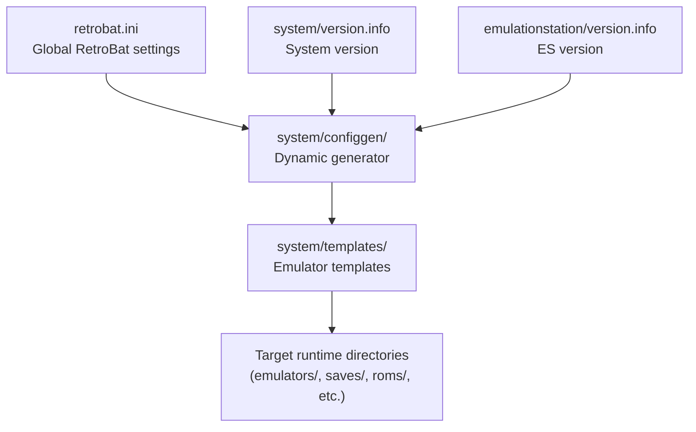
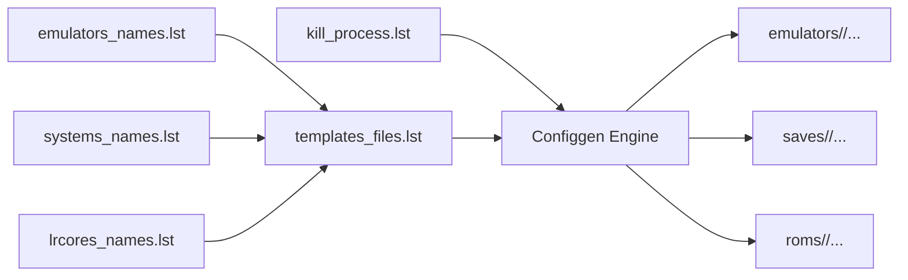
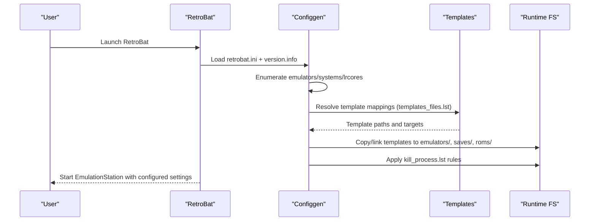
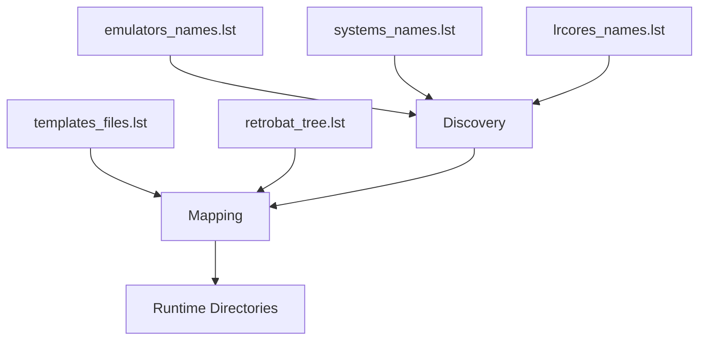

# Advanced Configuration

<cite>
**Referenced Files in This Document**
- [retrobat.ini](file://retrobat.ini)
- [system\version.info](file://system\version.info)
- [emulationstation\version.info](file://emulationstation\version.info)
- [system\configgen\emulators_names.lst](file://system\configgen\emulators_names.lst)
- [system\configgen\systems_names.lst](file://system\configgen\systems_names.lst)
- [system\configgen\templates_files.lst](file://system\configgen\templates_files.lst)
- [system\configgen\kill_process.lst](file://system\configgen\kill_process.lst)
- [system\configgen\lrcores_names.lst](file://system\configgen\lrcores_names.lst)
- [system\configgen\retrobat_tree.lst](file://system\configgen\retrobat_tree.lst)
- [system\templates\retroarch\retroarch.cfg](file://system\templates\retroarch\retroarch.cfg)
- [system\templates\dolphin-emu\User\Config\Dolphin.ini](file://system\templates\dolphin-emu\User\Config\Dolphin.ini)
- [system\templates\mame\ini\fmtownsux.ini](file://system\templates\mame\ini\fmtownsux.ini)
- [system\templates\pcsx2\portable.ini](file://system\templates\pcsx2\portable.ini)
- [system\templates\ppsspp\SYSTEM\ppsspp.ini](file://system\templates\ppsspp\SYSTEM\ppsspp.ini)
</cite>

## Table of Contents
1. [Introduction](#introduction)
2. [Project Structure](#project-structure)
3. [Core Components](#core-components)
4. [Architecture Overview](#architecture-overview)
5. [Detailed Component Analysis](#detailed-component-analysis)
6. [Dependency Analysis](#dependency-analysis)
7. [Performance Considerations](#performance-considerations)
8. [Troubleshooting Guide](#troubleshooting-guide)
9. [Conclusion](#conclusion)
10. [Appendices](#appendices)

## Introduction
This document explains the advanced configuration system in RIESCADE_SYSTEM, focusing on:
- Global configuration via retrobat.ini
- Version management through version.info
- Dynamic configuration generation via the configgen system
- Emulator integration, performance optimization, and system customization
- Configuration file formats, parameter options, and their behavioral impact
- Examples for multi-system setups, custom emulator paths, and specialized hardware configurations
- Backup and restoration, version compatibility, and migration guidance
- Advanced troubleshooting, performance tuning, and precedence rules for global vs per-system overrides

## Project Structure
RIESCADE_SYSTEM organizes configuration under a layered approach:
- Global RetroBat configuration (retrobat.ini)
- Version metadata (system/version.info, emulationstation/version.info)
- Configgen subsystem for dynamic generation and templating
- Emulator-specific templates and configuration files
- Per-emulator and per-system directories for saves, configs, and ROMs

**Diagram sources**
- [retrobat.ini:1-94](file://retrobat.ini#L1-L94)
- [system\version.info:1-1](file://system\version.info#L1-L1)
- [emulationstation\version.info:1-1](file://emulationstation\version.info#L1-L1)
- [system\configgen\templates_files.lst:1-215](file://system\configgen\templates_files.lst#L1-L215)

**Section sources**
- [retrobat.ini:1-94](file://retrobat.ini#L1-L94)
- [system\version.info:1-1](file://system\version.info#L1-L1)
- [emulationstation\version.info:1-1](file://emulationstation\version.info#L1-L1)

## Core Components
- Global configuration (retrobat.ini): Controls RetroBat behavior, splash/video, EmulationStation launch, and frontend rendering.
- Version info: Defines current system and EmulationStation versions for compatibility checks and migrations.
- Configgen lists: Define supported emulators, systems, template mappings, process kill list, libretro cores, and filesystem tree layout.
- Emulator templates: Provide default configurations and paths for each emulator.

Key responsibilities:
- retrobat.ini: Startup behavior, splash screen, frontend windowing, VSync, framerate overlay, theme randomization.
- version.info: Version strings for system and ES to guide updates and compatibility.
- configgen lists: Drive dynamic provisioning of emulator configs, saves, and ROMs.
- Templates: Establish baseline emulator settings and paths.

**Section sources**
- [retrobat.ini:1-94](file://retrobat.ini#L1-L94)
- [system\version.info:1-1](file://system\version.info#L1-L1)
- [emulationstation\version.info:1-1](file://emulationstation\version.info#L1-L1)
- [system\configgen\emulators_names.lst:1-130](file://system\configgen\emulators_names.lst#L1-L130)
- [system\configgen\systems_names.lst:1-241](file://system\configgen\systems_names.lst#L1-L241)
- [system\configgen\templates_files.lst:1-215](file://system\configgen\templates_files.lst#L1-L215)
- [system\configgen\kill_process.lst:1-91](file://system\configgen\kill_process.lst#L1-L91)
- [system\configgen\lrcores_names.lst:1-156](file://system\configgen\lrcores_names.lst#L1-L156)
- [system\configgen\retrobat_tree.lst:1-501](file://system\configgen\retrobat_tree.lst#L1-L501)

## Architecture Overview
The configgen pipeline transforms template definitions into runtime-ready configurations:
- Lists enumerate emulators, systems, template mappings, and kill targets.
- Templates define default settings and paths for emulators.
- Target runtime directories mirror a normalized tree layout for saves, configs, and ROMs.

**Diagram sources**
- [system\configgen\emulators_names.lst:1-130](file://system\configgen\emulators_names.lst#L1-L130)
- [system\configgen\systems_names.lst:1-241](file://system\configgen\systems_names.lst#L1-L241)
- [system\configgen\lrcores_names.lst:1-156](file://system\configgen\lrcores_names.lst#L1-L156)
- [system\configgen\kill_process.lst:1-91](file://system\configgen\kill_process.lst#L1-L91)
- [system\configgen\templates_files.lst:1-215](file://system\configgen\templates_files.lst#L1-L215)

## Detailed Component Analysis

### Global Configuration: retrobat.ini
retrobat.ini controls RetroBat’s startup, splash, and EmulationStation behavior:
- Language detection and autostart modes
- Splash/video playback behavior and delays
- EmulationStation fullscreen/windowed, borderless, forced resolution, focus delay
- Game list parsing mode, interface mode (normal/kiosk/kid), monitor selection
- VSync toggle, exit menu visibility, OpenGL fallback, window size, framerate overlay
- Theme randomization

Impact:
- Startup behavior is centralized here; splash/video timing affects UX.
- Frontend rendering and focus policies are tuned for stability and performance.
- Interface modes enable restricted environments suitable for public kiosks or children.

**Section sources**
- [retrobat.ini:1-94](file://retrobat.ini#L1-L94)

### Version Management: version.info
Two version files define current system and EmulationStation versions:
- system/version.info: System version string for update/migration logic.
- emulationstation/version.info: ES version string for compatibility checks.

Guidance:
- Compare these strings during upgrades to determine migration steps.
- Keep both synchronized when updating to avoid compatibility mismatches.

**Section sources**
- [system\version.info:1-1](file://system\version.info#L1-L1)
- [emulationstation\version.info:1-1](file://emulationstation\version.info#L1-L1)

### Configgen Lists and Template Mapping
- emulators_names.lst: Supported emulators for dynamic provisioning.
- systems_names.lst: Systems recognized by the configgen engine.
- lrcores_names.lst: Libretro core names used by RetroArch.
- kill_process.lst: Processes to terminate before launching emulators.
- templates_files.lst: Maps template files to target runtime locations.
- retrobat_tree.lst: Normalized filesystem layout for saves, configs, and ROMs.

Usage:
- templates_files.lst defines where template files are copied or linked.
- retrobat_tree.lst ensures consistent directory placement across systems.

**Section sources**
- [system\configgen\emulators_names.lst:1-130](file://system\configgen\emulators_names.lst#L1-L130)
- [system\configgen\systems_names.lst:1-241](file://system\configgen\systems_names.lst#L1-L241)
- [system\configgen\lrcores_names.lst:1-156](file://system\configgen\lrcores_names.lst#L1-L156)
- [system\configgen\kill_process.lst:1-91](file://system\configgen\kill_process.lst#L1-L91)
- [system\configgen\templates_files.lst:1-215](file://system\configgen\templates_files.lst#L1-L215)
- [system\configgen\retrobat_tree.lst:1-501](file://system\configgen\retrobat_tree.lst#L1-L501)

### Emulator Integration: Templates and Defaults
Templates provide baseline configurations and paths for emulators. Representative examples:
- RetroArch: retroarch.cfg sets input drivers, overlays, shaders, autosave intervals, and core options.
- Dolphin: Dolphin.ini centralizes paths for ISOs, NAND, dumps, and GC/Wii memory cards.
- MAME: fmtownsux.ini defines search paths, output directories, performance, render, sound, input, and post-processing options.
- PCSX2: portable.ini toggles initial wizard.
- PPSSPP: ppsspp.ini controls UI, graphics backend, frame skipping, texture scaling, VR, and logging.

These templates establish defaults and paths; they can be overridden by per-system or per-user preferences later.

**Section sources**
- [system\templates\retroarch\retroarch.cfg:1-800](file://system\templates\retroarch\retroarch.cfg#L1-L800)
- [system\templates\dolphin-emu\User\Config\Dolphin.ini:1-58](file://system\templates\dolphin-emu\User\Config\Dolphin.ini#L1-L58)
- [system\templates\mame\ini\fmtownsux.ini:1-486](file://system\templates\mame\ini\fmtownsux.ini#L1-L486)
- [system\templates\pcsx2\portable.ini:1-2](file://system\templates\pcsx2\portable.ini#L1-L2)
- [system\templates\ppsspp\SYSTEM\ppsspp.ini:1-825](file://system\templates\ppsspp\SYSTEM\ppsspp.ini#L1-L825)

### Dynamic Configuration Generation Workflow

**Diagram sources**
- [retrobat.ini:1-94](file://retrobat.ini#L1-L94)
- [system\version.info:1-1](file://system\version.info#L1-L1)
- [system\configgen\templates_files.lst:1-215](file://system\configgen\templates_files.lst#L1-L215)
- [system\configgen\kill_process.lst:1-91](file://system\configgen\kill_process.lst#L1-L91)

## Dependency Analysis
Configgen depends on:
- Lists for discovery and mapping
- Templates for defaults
- Runtime tree for placement

**Diagram sources**
- [system\configgen\emulators_names.lst:1-130](file://system\configgen\emulators_names.lst#L1-L130)
- [system\configgen\systems_names.lst:1-241](file://system\configgen\systems_names.lst#L1-L241)
- [system\configgen\lrcores_names.lst:1-156](file://system\configgen\lrcores_names.lst#L1-L156)
- [system\configgen\templates_files.lst:1-215](file://system\configgen\templates_files.lst#L1-L215)
- [system\configgen\retrobat_tree.lst:1-501](file://system\configgen\retrobat_tree.lst#L1-L501)

**Section sources**
- [system\configgen\templates_files.lst:1-215](file://system\configgen\templates_files.lst#L1-L215)
- [system\configgen\retrobat_tree.lst:1-501](file://system\configgen\retrobat_tree.lst#L1-L501)

## Performance Considerations
- RetroArch
  - Audio latency and resampler quality influence responsiveness and CPU usage.
  - Frame skipping and fast-forward frameskip can reduce stutter on weak GPUs.
  - Shader chains and post-processing increase GPU load; adjust for target hardware.
  - Autosave interval impacts save frequency and disk IO.
- Dolphin
  - Backend selection (e.g., Vulkan) and renderer settings affect performance.
  - Path configuration for ISOs and NAND impacts IO locality.
- MAME
  - Frameskip and throttle settings balance smoothness and accuracy.
  - Video backend and filters affect CPU/GPU utilization.
- PPSSPP
  - Graphics backend selection and texture scaling level directly impact FPS.
  - Frame skipping and vertical sync can stabilize performance.

[No sources needed since this section provides general guidance]

## Troubleshooting Guide
Common configuration-related issues and remedies:
- RetroArch input not recognized
  - Verify input driver and device selections in retroarch.cfg.
  - Confirm per-player device assignments and hotkey device merge settings.
- Dolphin crash or missing memory cards
  - Ensure paths for ISOs, NAND, dumps, and GC/Wii memory cards are valid and writable.
- MAME performance problems
  - Adjust frameskip/throttle/speed; review video backend and filters.
- PPSSPP rendering artifacts
  - Switch graphics backend; lower texture scaling level; disable problematic shader chains.
- Emulator conflicts at startup
  - Review kill_process.lst to ensure conflicting processes are terminated before launch.

**Section sources**
- [system\templates\retroarch\retroarch.cfg:1-800](file://system\templates\retroarch\retroarch.cfg#L1-L800)
- [system\templates\dolphin-emu\User\Config\Dolphin.ini:1-58](file://system\templates\dolphin-emu\User\Config\Dolphin.ini#L1-L58)
- [system\templates\mame\ini\fmtownsux.ini:1-486](file://system\templates\mame\ini\fmtownsux.ini#L1-L486)
- [system\templates\ppsspp\SYSTEM\ppsspp.ini:1-825](file://system\templates\ppsspp\SYSTEM\ppsspp.ini#L1-L825)
- [system\configgen\kill_process.lst:1-91](file://system\configgen\kill_process.lst#L1-L91)

## Conclusion
RIESCADE_SYSTEM’s advanced configuration combines a global retrobat.ini, version metadata, and a robust configgen subsystem. The configgen leverages curated lists and templates to provision emulator-specific configurations and runtime directories. Understanding these components enables:
- Multi-system setups with consistent per-emulator defaults
- Custom emulator paths and specialized hardware configurations
- Performance tuning aligned with hardware capabilities
- Reliable backup, restoration, and migration across versions

[No sources needed since this section summarizes without analyzing specific files]

## Appendices

### Advanced Configuration Scenarios

- Multi-system setups
  - Use templates_files.lst to map system-specific ROMs and save directories.
  - Ensure retrobat_tree.lst reflects the intended layout for saves and configs.

- Custom emulator paths
  - Override default paths in emulator templates (e.g., Dolphin.ini, MAME ini, PPSSPP ini).
  - Validate write permissions and disk locality for optimal IO performance.

- Specialized hardware configurations
  - Select appropriate graphics backends and shader chains in emulator configs.
  - Tune audio latency and resampler quality for low-latency input.

- Backup and restoration
  - Archive emulators/<emu>, saves/<system>, and roms/<system> directories.
  - Preserve retrobat.ini and version.info for compatibility.

- Migration between versions
  - Compare system/version.info and emulationstation/version.info before and after updates.
  - Re-run configgen to re-provision templates and resolve path changes.

**Section sources**
- [system\configgen\templates_files.lst:1-215](file://system\configgen\templates_files.lst#L1-L215)
- [system\configgen\retrobat_tree.lst:1-501](file://system\configgen\retrobat_tree.lst#L1-L501)
- [system\version.info:1-1](file://system\version.info#L1-L1)
- [emulationstation\version.info:1-1](file://emulationstation\version.info#L1-L1)

### Relationship Between Global and Per-System Overrides
- Global overrides
  - retrobat.ini governs splash, frontend behavior, and general system startup.
- Per-emulator overrides
  - Emulator templates provide baseline settings; users can edit emulators/<emu>/... directly.
- Precedence and conflict resolution
  - Runtime edits supersede template defaults.
  - Configgen provisions templates on each run; manual edits persist across runs.
  - Conflicts between emulators are resolved by ensuring unique process names in kill_process.lst and distinct runtime directories.

**Section sources**
- [retrobat.ini:1-94](file://retrobat.ini#L1-L94)
- [system\templates\retroarch\retroarch.cfg:1-800](file://system\templates\retroarch\retroarch.cfg#L1-L800)
- [system\templates\dolphin-emu\User\Config\Dolphin.ini:1-58](file://system\templates\dolphin-emu\User\Config\Dolphin.ini#L1-L58)
- [system\templates\mame\ini\fmtownsux.ini:1-486](file://system\templates\mame\ini\fmtownsux.ini#L1-L486)
- [system\templates\ppsspp\SYSTEM\ppsspp.ini:1-825](file://system\templates\ppsspp\SYSTEM\ppsspp.ini#L1-L825)
- [system\configgen\kill_process.lst:1-91](file://system\configgen\kill_process.lst#L1-L91)