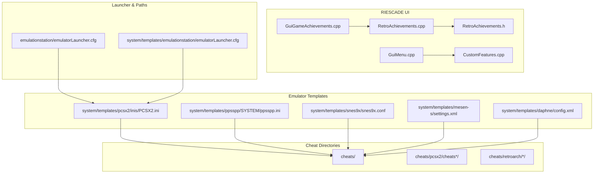
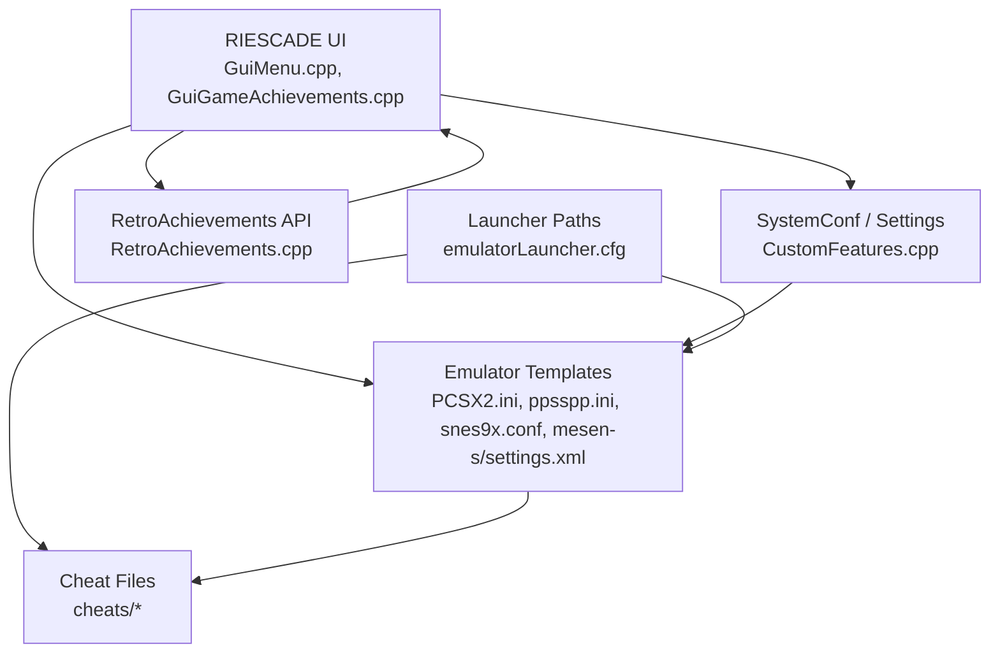
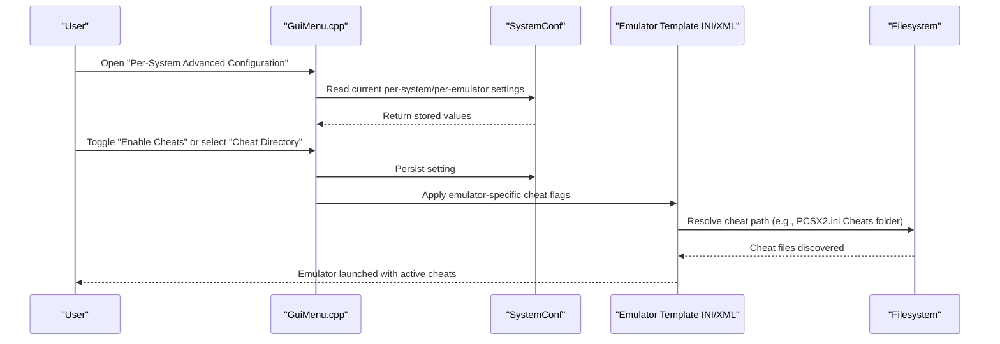
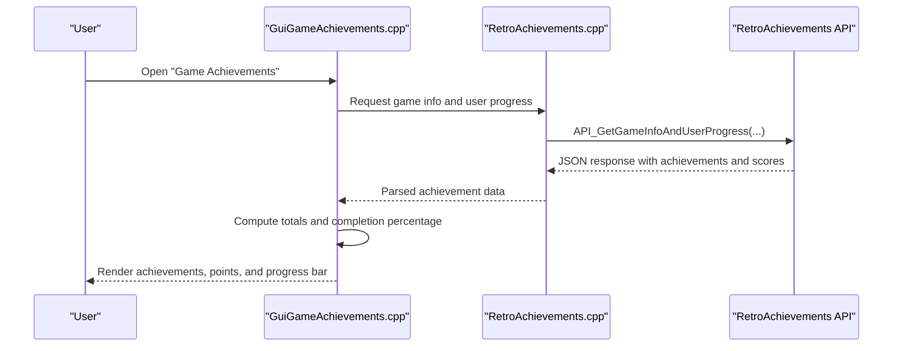
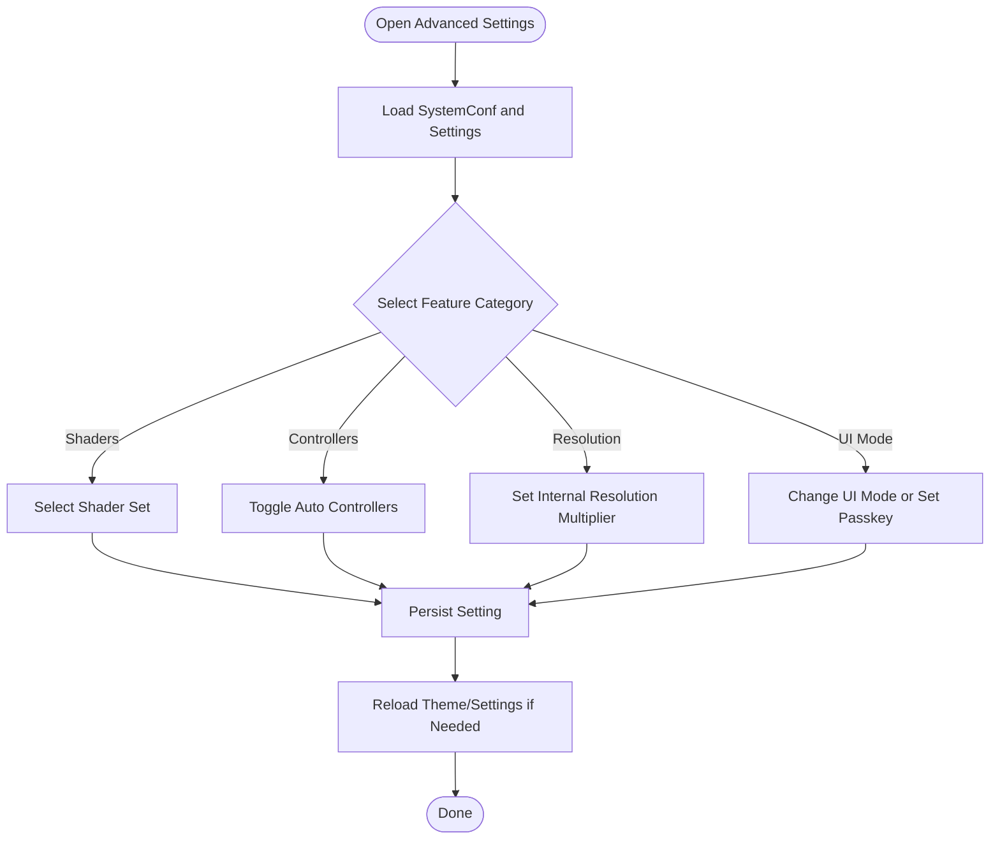
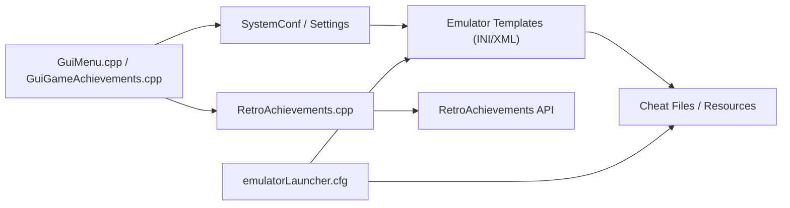

# Advanced Features

<cite>
**Referenced Files in This Document**
- [README.md](file://README.md)
- [emulatorLauncher.cfg](file://emulationstation/emulatorLauncher.cfg)
- [emulatorLauncher.cfg](file://system/templates/emulationstation/emulatorLauncher.cfg)
- [RetroAchievements.cpp](file://emulationstation/.riescade/src/docs/es_src/RetroAchievements.cpp)
- [RetroAchievements.h](file://emulationstation/.riescade/src/docs/es_src/RetroAchievements.h)
- [GuiGameAchievements.cpp](file://emulationstation/.riescade/src/docs/es_src/guis/GuiGameAchievements.cpp)
- [GuiMenu.cpp](file://emulationstation/.riescade/src/docs/es_src/guis/GuiMenu.cpp)
- [CustomFeatures.cpp](file://emulationstation/.riescade/src/docs/es_src/CustomFeatures.cpp)
- [PCSX2.ini](file://system/templates/pcsx2/inis/PCSX2.ini)
- [ppsspp.ini](file://system/templates/ppsspp/SYSTEM/ppsspp.ini)
- [snes9x.conf](file://system/templates/snes9x/snes9x.conf)
- [mesen-s/settings.xml](file://system/templates/mesen-s/settings.xml)
- [libretro_cap32.json](file://system/resources/inputmapping/libretro_cap32.json)
- [pcsx2.menu](file://system/es_menu/pcsx2.menu)
- [pcsx2-16.menu](file://system/es_menu/pcsx2-16.menu)
- [config.xml](file://system/templates/daphne/config.xml)
- [es_features.locale template](file://emulationstation/es_features.locale/template)
</cite>

## Table of Contents
1. [Introduction](#introduction)
2. [Project Structure](#project-structure)
3. [Core Components](#core-components)
4. [Architecture Overview](#architecture-overview)
5. [Detailed Component Analysis](#detailed-component-analysis)
6. [Dependency Analysis](#dependency-analysis)
7. [Performance Considerations](#performance-considerations)
8. [Troubleshooting Guide](#troubleshooting-guide)
9. [Conclusion](#conclusion)
10. [Appendices](#appendices)

## Introduction
This document explains the advanced features of RIESCADE_SYSTEM with a focus on:
- Cheat system integration across emulators and per-game cheat code activation
- Achievement system via RetroAchievements integration and user progress tracking
- User customization features for per-system/per-game/per-emulator settings and theme/UI controls

It documents implementation details, configuration options, and practical usage scenarios drawn from the repository’s cheat directories, emulator templates, and the RIESCADE UI code. It also covers relationships with emulator configurations, game library systems, and tools for maintenance and optimization.

## Project Structure
RIESCADE_SYSTEM organizes advanced features across several areas:
- Cheats: per-emulator cheat directories under cheats/
- Emulator templates: per-system configuration files under system/templates/
- RetroAchievements integration: UI and backend logic under emulationstation/.riescade/src/docs/es_src/
- User customization: per-system settings, input mapping, and theme options under emulationstation/.riescade/src/docs/es_src/guis/ and related system paths
- EmulatorLauncher configuration: shared paths for saves/bios/shaders under emulationstation/emulatorLauncher.cfg and system/templates/emulationstation/emulatorLauncher.cfg

**Diagram sources**
- [RetroAchievements.cpp:1-24](file://emulationstation/.riescade/src/docs/es_src/RetroAchievements.cpp#L1-L24)
- [RetroAchievements.h:80-142](file://emulationstation/.riescade/src/docs/es_src/RetroAchievements.h#L80-L142)
- [GuiMenu.cpp:3030-3040](file://emulationstation/.riescade/src/docs/es_src/guis/GuiMenu.cpp#L3030-L3040)
- [GuiGameAchievements.cpp:134-173](file://emulationstation/.riescade/src/docs/es_src/guis/GuiGameAchievements.cpp#L134-L173)
- [CustomFeatures.cpp:93-101](file://emulationstation/.riescade/src/docs/es_src/CustomFeatures.cpp#L93-L101)
- [PCSX2.ini:20-51](file://system/templates/pcsx2/inis/PCSX2.ini#L20-L51)
- [ppsspp.ini:1-58](file://system/templates/ppsspp/SYSTEM/ppsspp.ini#L1-L58)
- [snes9x.conf:1-23](file://system/templates/snes9x/snes9x.conf#L1-L23)
- [mesen-s/settings.xml:1362-1372](file://system/templates/mesen-s/settings.xml#L1362-L1372)
- [config.xml:488-534](file://system/templates/daphne/config.xml#L488-L534)
- [emulatorLauncher.cfg:1-12](file://emulationstation/emulatorLauncher.cfg#L1-L12)
- [emulatorLauncher.cfg:1-12](file://system/templates/emulationstation/emulatorLauncher.cfg#L1-L12)

**Section sources**
- [README.md:1-44](file://README.md#L1-L44)
- [emulatorLauncher.cfg:1-12](file://emulationstation/emulatorLauncher.cfg#L1-L12)
- [emulatorLauncher.cfg:1-12](file://system/templates/emulationstation/emulatorLauncher.cfg#L1-L12)

## Core Components
- RetroAchievements integration: Provides user rank/score, game progress, and recent achievements via API calls and UI presentation.
- Cheat system: Integrates with multiple emulators through per-system templates and external cheat directories, enabling per-game activation and toggles.
- User customization: Offers per-system/per-emulator/per-game settings, UI modes, shader presets, and controller autoconfiguration.

**Section sources**
- [RetroAchievements.cpp:209-457](file://emulationstation/.riescade/src/docs/es_src/RetroAchievements.cpp#L209-L457)
- [RetroAchievements.h:100-142](file://emulationstation/.riescade/src/docs/es_src/RetroAchievements.h#L100-L142)
- [GuiGameAchievements.cpp:134-173](file://emulationstation/.riescade/src/docs/es_src/guis/GuiGameAchievements.cpp#L134-L173)
- [GuiMenu.cpp:3627-3639](file://emulationstation/.riescade/src/docs/es_src/guis/GuiMenu.cpp#L3627-L3639)
- [PCSX2.ini:20-51](file://system/templates/pcsx2/inis/PCSX2.ini#L20-L51)
- [ppsspp.ini:1-58](file://system/templates/ppsspp/SYSTEM/ppsspp.ini#L1-L58)
- [snes9x.conf:1-23](file://system/templates/snes9x/snes9x.conf#L1-L23)
- [mesen-s/settings.xml:1362-1372](file://system/templates/mesen-s/settings.xml#L1362-L1372)

## Architecture Overview
RIESCADE advanced features are layered:
- UI layer: Menus and settings screens manage user preferences and per-system overrides.
- Configuration layer: SystemConf and Settings persist user choices and emulator-specific toggles.
- Integration layer: RetroAchievements API and emulator templates define runtime behavior.
- File system layer: Cheat directories and emulatorLauncher.cfg define paths and locations.

**Diagram sources**
- [GuiMenu.cpp:3030-3040](file://emulationstation/.riescade/src/docs/es_src/guis/GuiMenu.cpp#L3030-L3040)
- [GuiGameAchievements.cpp:134-173](file://emulationstation/.riescade/src/docs/es_src/guis/GuiGameAchievements.cpp#L134-L173)
- [CustomFeatures.cpp:93-101](file://emulationstation/.riescade/src/docs/es_src/CustomFeatures.cpp#L93-L101)
- [RetroAchievements.cpp:209-457](file://emulationstation/.riescade/src/docs/es_src/RetroAchievements.cpp#L209-L457)
- [PCSX2.ini:20-51](file://system/templates/pcsx2/inis/PCSX2.ini#L20-L51)
- [ppsspp.ini:1-58](file://system/templates/ppsspp/SYSTEM/ppsspp.ini#L1-L58)
- [snes9x.conf:1-23](file://system/templates/snes9x/snes9x.conf#L1-L23)
- [mesen-s/settings.xml:1362-1372](file://system/templates/mesen-s/settings.xml#L1362-L1372)
- [emulatorLauncher.cfg:1-12](file://system/templates/emulationstation/emulatorLauncher.cfg#L1-L12)

## Detailed Component Analysis

### Cheat System Integration
RIESCADE supports cheat activation across multiple emulators through:
- Emulator templates that define cheat directories and toggles
- External cheat directories organized by emulator/system
- Launcher paths that resolve saves/bios/cheats locations

Key implementation points:
- PCSX2 cheat directory and toggle are defined in its INI template.
- PPSSPP, Snes9x, Mesen-S, and Daphne templates include cheat-related settings and command-line arguments for enabling/disabling cheats and applying game options.

**Diagram sources**
- [GuiMenu.cpp:3030-3040](file://emulationstation/.riescade/src/docs/es_src/guis/GuiMenu.cpp#L3030-L3040)
- [PCSX2.ini:20-51](file://system/templates/pcsx2/inis/PCSX2.ini#L20-L51)
- [ppsspp.ini:1-58](file://system/templates/ppsspp/SYSTEM/ppsspp.ini#L1-L58)
- [snes9x.conf:1-23](file://system/templates/snes9x/snes9x.conf#L1-L23)
- [mesen-s/settings.xml:1362-1372](file://system/templates/mesen-s/settings.xml#L1362-L1372)
- [config.xml:488-534](file://system/templates/daphne/config.xml#L488-L534)

Practical usage scenarios:
- Enable PCSX2 cheats globally and per-game by pointing the emulator to the cheats directory and toggling the cheat engine.
- For PPSSPP, enable cheat support and configure the cheat refresh rate; ensure the cheat file exists in the emulator’s expected location.
- For Snes9x, enable RetroAchievements and cheats in the same configuration block.
- For Mesen-S, disable all cheats globally via the configuration to enforce strict emulation.

**Section sources**
- [PCSX2.ini:20-51](file://system/templates/pcsx2/inis/PCSX2.ini#L20-L51)
- [ppsspp.ini:1-58](file://system/templates/ppsspp/SYSTEM/ppsspp.ini#L1-L58)
- [snes9x.conf:1-23](file://system/templates/snes9x/snes9x.conf#L1-L23)
- [mesen-s/settings.xml:1362-1372](file://system/templates/mesen-s/settings.xml#L1362-L1372)
- [config.xml:488-534](file://system/templates/daphne/config.xml#L488-L534)

### Achievement System via RetroAchievements
RIESCADE integrates with RetroAchievements to:
- Fetch user rank/score and progress per game
- Display recent achievements and completion percentages
- Provide UI controls to show/hide achievement icons per system

Implementation highlights:
- RetroAchievements API calls for user summary, game info, and recent achievements
- UI components to render progress and statistics
- Global and per-system toggles for showing RetroAchievements icons

**Diagram sources**
- [GuiGameAchievements.cpp:134-173](file://emulationstation/.riescade/src/docs/es_src/guis/GuiGameAchievements.cpp#L134-L173)
- [RetroAchievements.cpp:209-457](file://emulationstation/.riescade/src/docs/es_src/RetroAchievements.cpp#L209-L457)
- [RetroAchievements.h:100-142](file://emulationstation/.riescade/src/docs/es_src/RetroAchievements.h#L100-L142)

Configuration and UI controls:
- Show/hide RetroAchievements icon per system via theme settings
- Global UI mode controls and passkey for restricted environments

**Section sources**
- [GuiGameAchievements.cpp:134-173](file://emulationstation/.riescade/src/docs/es_src/guis/GuiGameAchievements.cpp#L134-L173)
- [GuiMenu.cpp:3627-3639](file://emulationstation/.riescade/src/docs/es_src/guis/GuiMenu.cpp#L3627-L3639)
- [RetroAchievements.cpp:209-457](file://emulationstation/.riescade/src/docs/es_src/RetroAchievements.cpp#L209-L457)
- [RetroAchievements.h:100-142](file://emulationstation/.riescade/src/docs/es_src/RetroAchievements.h#L100-L142)

### User Customization Features
RIESCADE exposes extensive customization:
- Per-system/per-emulator/per-game settings via CustomFeatures and GuiMenu
- Shader sets, internal resolution, autoconfigure controllers, and save-state behavior
- UI modes and passkeys for restricted environments

**Diagram sources**
- [GuiMenu.cpp:3030-3040](file://emulationstation/.riescade/src/docs/es_src/guis/GuiMenu.cpp#L3030-L3040)
- [GuiMenu.cpp:4723-4730](file://emulationstation/.riescade/src/docs/es_src/guis/GuiMenu.cpp#L4723-L4730)
- [GuiMenu.cpp:5053-5071](file://emulationstation/.riescade/src/docs/es_src/guis/GuiMenu.cpp#L5053-L5071)
- [GuiMenu.cpp:1502-1522](file://emulationstation/.riescade/src/docs/es_src/guis/GuiMenu.cpp#L1502-L1522)
- [CustomFeatures.cpp:93-101](file://emulationstation/.riescade/src/docs/es_src/CustomFeatures.cpp#L93-L101)

**Section sources**
- [GuiMenu.cpp:3030-3040](file://emulationstation/.riescade/src/docs/es_src/guis/GuiMenu.cpp#L3030-L3040)
- [GuiMenu.cpp:4723-4730](file://emulationstation/.riescade/src/docs/es_src/guis/GuiMenu.cpp#L4723-L4730)
- [GuiMenu.cpp:5053-5071](file://emulationstation/.riescade/src/docs/es_src/guis/GuiMenu.cpp#L5053-L5071)
- [GuiMenu.cpp:1502-1522](file://emulationstation/.riescade/src/docs/es_src/guis/GuiMenu.cpp#L1502-L1522)
- [CustomFeatures.cpp:93-101](file://emulationstation/.riescade/src/docs/es_src/CustomFeatures.cpp#L93-L101)

### Relationship with Emulator Configurations and Game Library Systems
- EmulatorLauncher.cfg defines shared paths for bios, saves, shaders, and RetroAchievements sounds, ensuring consistent resource discovery across emulators.
- Emulator templates (INI/XML) define per-emulator behavior, including cheat engines, shader sets, and achievement toggles.
- Game library systems integrate with these configurations to launch titles with the correct settings and resources.

**Section sources**
- [emulatorLauncher.cfg:1-12](file://emulationstation/emulatorLauncher.cfg#L1-L12)
- [emulatorLauncher.cfg:1-12](file://system/templates/emulationstation/emulatorLauncher.cfg#L1-L12)
- [PCSX2.ini:20-51](file://system/templates/pcsx2/inis/PCSX2.ini#L20-L51)
- [pcsx2.menu:1-1](file://system/es_menu/pcsx2.menu#L1-L1)
- [pcsx2-16.menu:1-1](file://system/es_menu/pcsx2-16.menu#L1-L1)

## Dependency Analysis
RIESCADE’s advanced features depend on:
- UI components for exposing settings and achievements
- System configuration for persisting user choices
- Emulator templates for runtime behavior
- Launcher paths for resource resolution

**Diagram sources**
- [GuiMenu.cpp:3030-3040](file://emulationstation/.riescade/src/docs/es_src/guis/GuiMenu.cpp#L3030-L3040)
- [GuiGameAchievements.cpp:134-173](file://emulationstation/.riescade/src/docs/es_src/guis/GuiGameAchievements.cpp#L134-L173)
- [RetroAchievements.cpp:209-457](file://emulationstation/.riescade/src/docs/es_src/RetroAchievements.cpp#L209-L457)
- [PCSX2.ini:20-51](file://system/templates/pcsx2/inis/PCSX2.ini#L20-L51)
- [emulatorLauncher.cfg:1-12](file://system/templates/emulationstation/emulatorLauncher.cfg#L1-L12)

**Section sources**
- [GuiMenu.cpp:3030-3040](file://emulationstation/.riescade/src/docs/es_src/guis/GuiMenu.cpp#L3030-L3040)
- [RetroAchievements.cpp:209-457](file://emulationstation/.riescade/src/docs/es_src/RetroAchievements.cpp#L209-L457)
- [PCSX2.ini:20-51](file://system/templates/pcsx2/inis/PCSX2.ini#L20-L51)
- [emulatorLauncher.cfg:1-12](file://system/templates/emulationstation/emulatorLauncher.cfg#L1-L12)

## Performance Considerations
- RetroAchievements API calls should be cached or rate-limited to avoid repeated network overhead.
- Shader set switching and internal resolution changes can impact performance; choose presets appropriate to hardware.
- Enabling cheats and patches increases emulation overhead; disable where not needed for optimal performance.

[No sources needed since this section provides general guidance]

## Troubleshooting Guide
Common advanced feature issues and resolutions:
- Cheat compatibility
  - Verify emulator template cheat toggles match the emulator’s expected configuration keys.
  - Ensure cheat files are placed in the correct directory as defined by the emulator template and launcher paths.
  - Example references: [PCSX2.ini:20-51](file://system/templates/pcsx2/inis/PCSX2.ini#L20-L51), [emulatorLauncher.cfg:1-12](file://system/templates/emulationstation/emulatorLauncher.cfg#L1-L12)

- Achievement synchronization
  - Confirm RetroAchievements username is configured and API responses are parsed successfully.
  - Review UI achievement rendering and error messages returned by RetroAchievements API.
  - Example references: [RetroAchievements.cpp:209-457](file://emulationstation/.riescade/src/docs/es_src/RetroAchievements.cpp#L209-L457), [GuiGameAchievements.cpp:134-173](file://emulationstation/.riescade/src/docs/es_src/guis/GuiGameAchievements.cpp#L134-L173)

- User data management
  - Use UI modes and passkeys to lock down settings for guest users.
  - Persist per-system/per-emulator/per-game settings via SystemConf and reload themes when needed.
  - Example references: [GuiMenu.cpp:1502-1522](file://emulationstation/.riescade/src/docs/es_src/guis/GuiMenu.cpp#L1502-L1522), [GuiMenu.cpp:3030-3040](file://emulationstation/.riescade/src/docs/es_src/guis/GuiMenu.cpp#L3030-L3040)

**Section sources**
- [PCSX2.ini:20-51](file://system/templates/pcsx2/inis/PCSX2.ini#L20-L51)
- [emulatorLauncher.cfg:1-12](file://system/templates/emulationstation/emulatorLauncher.cfg#L1-L12)
- [RetroAchievements.cpp:209-457](file://emulationstation/.riescade/src/docs/es_src/RetroAchievements.cpp#L209-L457)
- [GuiGameAchievements.cpp:134-173](file://emulationstation/.riescade/src/docs/es_src/guis/GuiGameAchievements.cpp#L134-L173)
- [GuiMenu.cpp:1502-1522](file://emulationstation/.riescade/src/docs/es_src/guis/GuiMenu.cpp#L1502-L1522)
- [GuiMenu.cpp:3030-3040](file://emulationstation/.riescade/src/docs/es_src/guis/GuiMenu.cpp#L3030-L3040)

## Conclusion
RIESCADE_SYSTEM delivers a robust foundation for advanced emulation features:
- Cheats are integrated via emulator templates and external cheat directories, with clear configuration points for each emulator.
- RetroAchievements integration provides comprehensive user progress tracking and UI presentation.
- Extensive user customization allows fine-grained control over UI, shaders, controllers, and per-system settings.

By leveraging the documented configuration options and templates, power users can tailor the system to their needs while developers can extend functionality with minimal friction.

[No sources needed since this section summarizes without analyzing specific files]

## Appendices

### Configuration Options Index
- RetroAchievements
  - Username and API integration handled by RetroAchievements module
  - UI toggles for showing achievement icons per system
  - References: [RetroAchievements.cpp:209-457](file://emulationstation/.riescade/src/docs/es_src/RetroAchievements.cpp#L209-L457), [GuiGameAchievements.cpp:134-173](file://emulationstation/.riescade/src/docs/es_src/guis/GuiGameAchievements.cpp#L134-L173), [GuiMenu.cpp:3627-3639](file://emulationstation/.riescade/src/docs/es_src/guis/GuiMenu.cpp#L3627-L3639)

- Cheat Activation
  - PCSX2: Cheats folder and enable flag
  - PPSSPP: Enable cheats and related settings
  - Snes9x: RetroAchievements and cheat enablement
  - Mesen-S: Disable all cheats option
  - Daphne: Cheat toggles and game options
  - References: [PCSX2.ini:20-51](file://system/templates/pcsx2/inis/PCSX2.ini#L20-L51), [ppsspp.ini:1-58](file://system/templates/ppsspp/SYSTEM/ppsspp.ini#L1-L58), [snes9x.conf:1-23](file://system/templates/snes9x/snes9x.conf#L1-L23), [mesen-s/settings.xml:1362-1372](file://system/templates/mesen-s/settings.xml#L1362-L1372), [config.xml:488-534](file://system/templates/daphne/config.xml#L488-L534)

- User Preferences
  - Shader sets, internal resolution, auto controllers, UI modes, passkeys
  - References: [GuiMenu.cpp:4723-4730](file://emulationstation/.riescade/src/docs/es_src/guis/GuiMenu.cpp#L4723-L4730), [GuiMenu.cpp:5053-5071](file://emulationstation/.riescade/src/docs/es_src/guis/GuiMenu.cpp#L5053-L5071), [GuiMenu.cpp:1502-1522](file://emulationstation/.riescade/src/docs/es_src/guis/GuiMenu.cpp#L1502-L1522)

- Emulator Launcher Paths
  - Bios, saves, shaders, RetroAchievements sounds
  - References: [emulatorLauncher.cfg:1-12](file://system/templates/emulationstation/emulatorLauncher.cfg#L1-L12), [emulatorLauncher.cfg:1-12](file://emulationstation/emulatorLauncher.cfg#L1-L12)

- Tools and Utilities
  - Controller mapping and input templates
  - References: [libretro_cap32.json:2096-2131](file://system/resources/inputmapping/libretro_cap32.json#L2096-L2131), [es_features.locale template](file://emulationstation/es_features.locale/template)