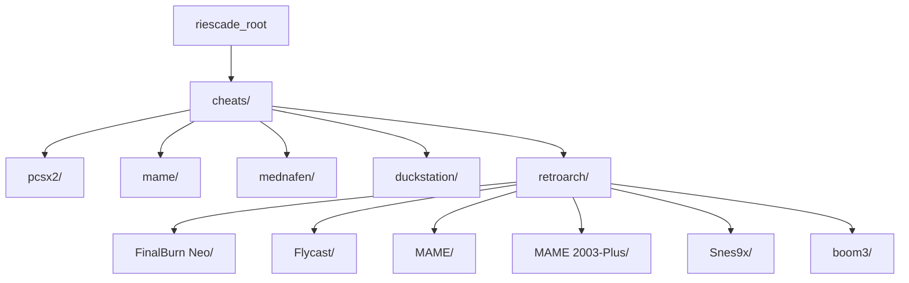
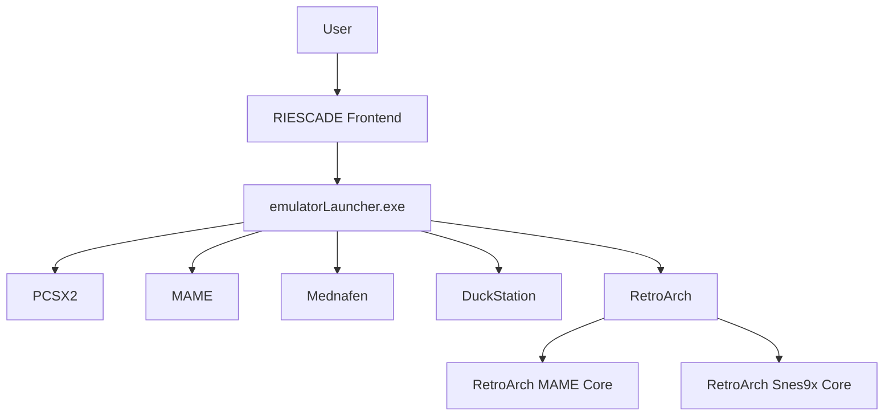
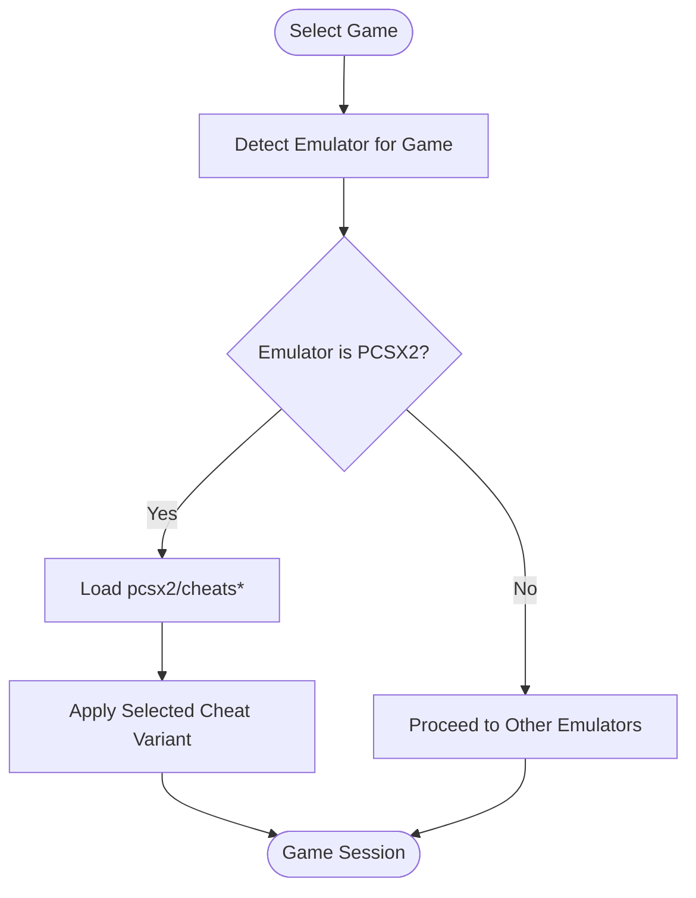
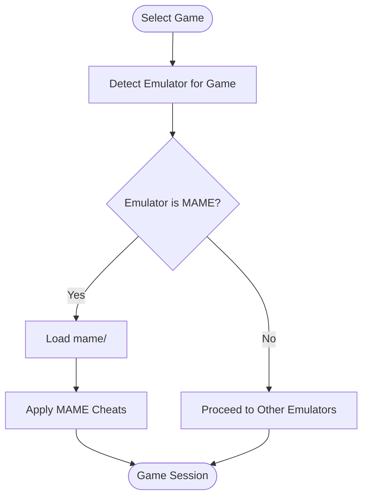
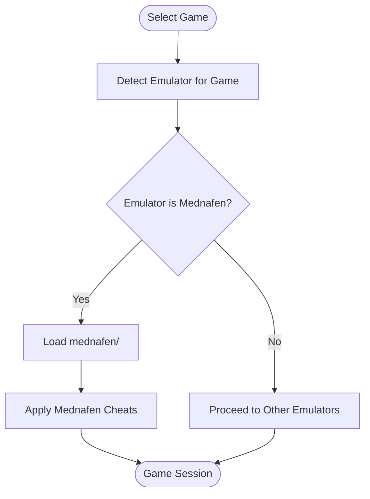
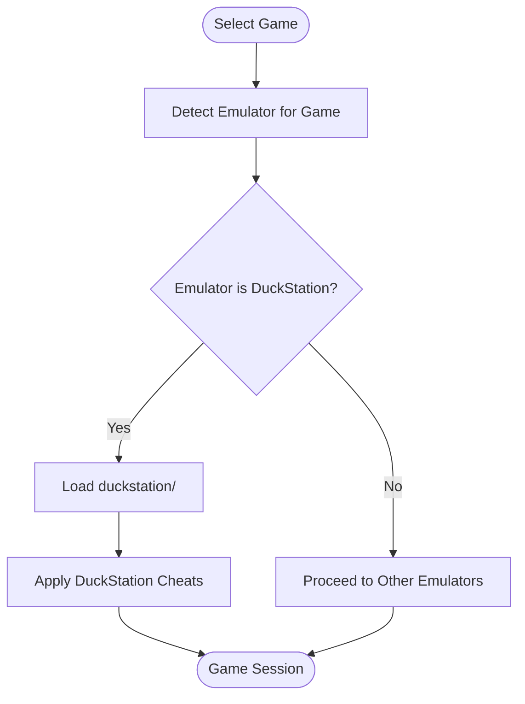
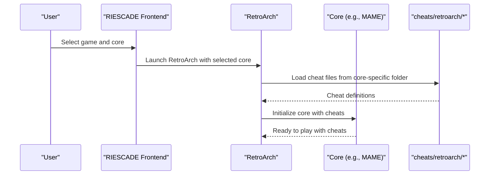
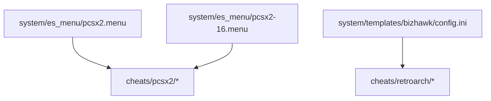
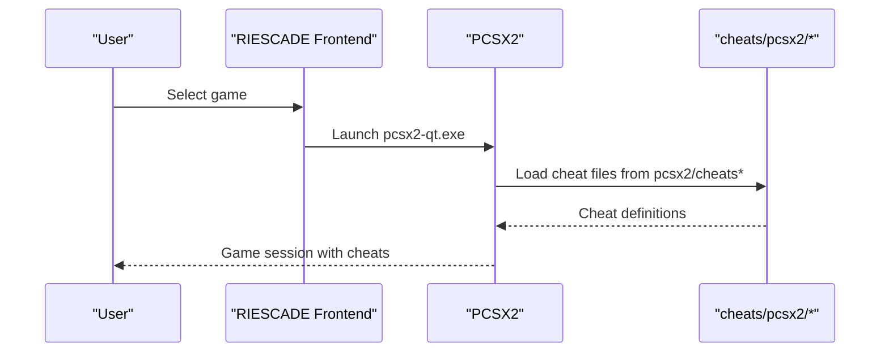

# Cheat System

<cite>
**Referenced Files in This Document**
- [README.md](file://README.md)
- [RetroAchievements.h](file://emulationstation/.riescade/src/docs/es_src/RetroAchievements.h)
- [RetroAchievements.cpp](file://emulationstation/.riescade/src/docs/es_src/RetroAchievements.cpp)
- [GuiRetroAchievements.cpp](file://emulationstation/.riescade/src/docs/es_src/guis/GuiRetroAchievements.cpp)
- [SystemData.cpp](file://emulationstation/.riescade/src/docs/es_src/SystemData.cpp)
- [pcsx2.menu](file://system/es_menu/pcsx2.menu)
- [pcsx2-16.menu](file://system/es_menu/pcsx2-16.menu)
- [bizhawk config.ini](file://system/templates/bizhawk/config.ini)
</cite>

## Table of Contents
1. [Introduction](#introduction)
2. [Project Structure](#project-structure)
3. [Core Components](#core-components)
4. [Architecture Overview](#architecture-overview)
5. [Detailed Component Analysis](#detailed-component-analysis)
6. [Dependency Analysis](#dependency-analysis)
7. [Performance Considerations](#performance-considerations)
8. [Troubleshooting Guide](#troubleshooting-guide)
9. [Conclusion](#conclusion)
10. [Appendices](#appendices)

## Introduction
This document explains the RIESCADE_SYSTEM cheat system and how it integrates with the broader emulation framework. It focuses on the cheat file organization by emulator and game system under the cheats/ folder, supported cheat formats for PCSX2, MAME, Mednafen, DuckStation, and RetroArch, and how cheat codes are discovered and applied during gameplay. It also covers metadata relationships, automatic detection of applicable cheats, and practical guidance for troubleshooting common issues.

## Project Structure
The cheat system is primarily organized under the cheats/ directory, with per-emulator subfolders. The repository snapshot indicates the following top-level cheat directories:
- pcsx2 (with subfolders: cheats, cheats_ni, cheats_ws)
- mame
- mednafen
- duckstation
- retroarch (with subfolders: FinalBurn Neo, Flycast, MAME, MAME 2003-Plus, Snes9x, boom3)
- Additional systems: capriceforever, melonds, psxmame

These directories serve as the primary storage locations for cheat files associated with each emulator or core. The exact contents of pcsx2/cheats and similar directories were not readable in the current snapshot; however, the presence of subfolders indicates a structured layout for different cheat variants or categories.

**Diagram sources**
- [README.md:1-44](file://README.md#L1-L44)

**Section sources**
- [README.md:1-44](file://README.md#L1-L44)

## Core Components
- Emulator-specific cheat directories: The cheats/ folder organizes files by emulator/system (e.g., pcsx2/, mame/, mednafen/, duckstation/, retroarch/*/).
- PCSX2 cheat variants: The pcsx2/ directory contains three subfolders indicating distinct cheat categories or formats (cheats, cheats_ni, cheats_ws).
- RetroArch cores: RetroArch cheat sets are grouped under retroarch/ with subfolders named after specific cores (e.g., MAME, Snes9x, MAME 2003-Plus).
- Metadata-driven integration: The system supports RetroAchievements integration, which demonstrates how metadata (e.g., Cheevos ID) is used to connect content with external services. While focused on achievements, this pattern mirrors how cheat metadata could be leveraged for cheat selection and application.

Key implementation references:
- PCSX2 menu entries indicate the executables used to launch the emulator.
- BizHawk’s template configuration explicitly defines a “Cheats” path type for certain systems, illustrating a standardized approach to cheat file discovery.

**Section sources**
- [pcsx2.menu:1-1](file://system/es_menu/pcsx2.menu#L1-L1)
- [pcsx2-16.menu:1-1](file://system/es_menu/pcsx2-16.menu#L1-L1)
- [bizhawk config.ini:1032-1065](file://system/templates/bizhawk/config.ini#L1032-L1065)

## Architecture Overview
The cheat system architecture centers on:
- Directory-based organization: Emulators and cores discover cheat files from predefined paths under cheats/.
- Emulator-side loading: Each emulator reads its respective cheat files from the organized directories.
- Metadata linkage: While primarily demonstrated for RetroAchievements, the same metadata-driven approach can guide cheat selection and application.

[No sources needed since this diagram shows conceptual workflow, not actual code structure]

## Detailed Component Analysis

### PCSX2 Cheat Organization and Loading
PCSX2 cheat files are organized under the pcsx2/ directory with three subfolders:
- cheats/
- cheats_ni
- cheats_ws

These subfolders likely represent different cheat formats or categories (e.g., standard, No-Intercepts, Web Services). The exact file formats and syntax are not specified in the repository snapshot; however, the presence of multiple subfolders indicates a structured approach to categorizing cheat variants.

Practical usage:
- Place PCSX2-compatible cheat files in the appropriate subfolder based on desired variant.
- Launch PCSX2 via the frontend; the emulator should load the relevant cheat set from the configured path.

**Section sources**
- [pcsx2.menu:1-1](file://system/es_menu/pcsx2.menu#L1-L1)
- [pcsx2-16.menu:1-1](file://system/es_menu/pcsx2-16.menu#L1-L1)

### MAME Cheat Organization and Loading
MAME cheat files are stored under the mame/ directory. The repository snapshot does not reveal the internal structure of this directory, but the presence of a dedicated folder indicates organized storage for MAME-specific cheat files.

Practical usage:
- Place MAME-compatible cheat files in the mame/ directory.
- Launch MAME via the frontend; the emulator should load the appropriate cheat set from the configured path.

**Section sources**
- [README.md:1-44](file://README.md#L1-L44)

### Mednafen Cheat Organization and Loading
Mednafen cheat files are stored under the mednafen/ directory. Similar to MAME, the internal structure is not visible in the snapshot, but the dedicated folder signals organized storage for Mednafen cheat files.

Practical usage:
- Place Mednafen-compatible cheat files in the mednafen/ directory.
- Launch Mednafen via the frontend; the emulator should load the appropriate cheat set from the configured path.

**Section sources**
- [README.md:1-44](file://README.md#L1-L44)

### DuckStation Cheat Organization and Loading
DuckStation cheat files are stored under the duckstation/ directory. The internal structure is not visible in the snapshot, but the dedicated folder indicates organized storage for DuckStation cheat files.

Practical usage:
- Place DuckStation-compatible cheat files in the duckstation/ directory.
- Launch DuckStation via the frontend; the emulator should load the appropriate cheat set from the configured path.

**Section sources**
- [README.md:1-44](file://README.md#L1-L44)

### RetroArch Cheat Organization and Loading
RetroArch cheat files are organized under retroarch/ with subfolders for specific cores:
- FinalBurn Neo
- Flycast
- MAME
- MAME 2003-Plus
- Snes9x
- boom3

Each core’s subfolder holds the appropriate cheat files for that core. The frontend launches RetroArch with the selected core, which then loads the corresponding cheat set from the configured path.

**Section sources**
- [README.md:1-44](file://README.md#L1-L44)

### BizHawk Cheat Path Reference
BizHawk’s template configuration explicitly defines a “Cheats” path type for certain systems, demonstrating a standardized approach to locating cheat files. This pattern aligns with the directory-based organization used by RIESCADE_SYSTEM.

**Section sources**
- [bizhawk config.ini:1032-1065](file://system/templates/bizhawk/config.ini#L1032-L1065)

## Dependency Analysis
The cheat system relies on:
- Emulator executables and menu entries to launch the correct emulator for a given game.
- Directory-based organization to locate cheat files.
- Metadata-driven integrations (e.g., RetroAchievements) as a precedent for how metadata can drive content selection and application.

**Diagram sources**
- [pcsx2.menu:1-1](file://system/es_menu/pcsx2.menu#L1-L1)
- [pcsx2-16.menu:1-1](file://system/es_menu/pcsx2-16.menu#L1-L1)
- [bizhawk config.ini:1032-1065](file://system/templates/bizhawk/config.ini#L1032-L1065)

**Section sources**
- [pcsx2.menu:1-1](file://system/es_menu/pcsx2.menu#L1-L1)
- [pcsx2-16.menu:1-1](file://system/es_menu/pcsx2-16.menu#L1-L1)
- [bizhawk config.ini:1032-1065](file://system/templates/bizhawk/config.ini#L1032-L1065)

## Performance Considerations
- Directory traversal: Large cheat directories can increase startup time when emulators scan for cheat files. Keep cheat folders lean and organized.
- Format compatibility: Using incompatible formats can cause parsing overhead or failures. Ensure cheat files match the target emulator’s expected format.
- Core selection: RetroArch core selection affects which cheat files are loaded; selecting the wrong core can lead to missed or ineffective cheats.

[No sources needed since this section provides general guidance]

## Troubleshooting Guide
Common issues and resolutions:
- Missing or ineffective cheat codes
  - Verify the correct emulator is launched for the selected game.
  - Confirm cheat files are placed in the appropriate directory (e.g., pcsx2/, mame/, mednafen/, duckstation/, retroarch/*/).
  - Ensure the cheat format matches the emulator’s expectations.
- Incorrect core selection in RetroArch
  - Select the correct core for the game; otherwise, cheats may not load from the intended folder.
- Metadata mismatch
  - If relying on metadata-based selection (similar to RetroAchievements patterns), confirm metadata is present and accurate.

**Section sources**
- [README.md:1-44](file://README.md#L1-L44)

## Conclusion
RIESCADE_SYSTEM organizes cheat files by emulator and core under the cheats/ directory, enabling straightforward discovery and application during gameplay. The system leverages emulator-specific directories and menu entries to ensure the correct cheat sets are loaded. While detailed format specifications are not included in the repository snapshot, the established directory structure and patterns (e.g., BizHawk’s “Cheats” path type) provide a clear roadmap for integrating and troubleshooting cheat files across PCSX2, MAME, Mednafen, DuckStation, and RetroArch.

[No sources needed since this section summarizes without analyzing specific files]

## Appendices

### Appendix A: Cheat File Locations and Naming Conventions
- PCSX2
  - Location: cheats/pcsx2/
  - Variants: cheats/, cheats_ni, cheats_ws
- MAME
  - Location: cheats/mame/
- Mednafen
  - Location: cheats/mednafen/
- DuckStation
  - Location: cheats/duckstation/
- RetroArch
  - Location: cheats/retroarch/*
  - Examples: FinalBurn Neo/, Flycast/, MAME/, MAME 2003-Plus/, Snes9x/, boom3/

**Section sources**
- [README.md:1-44](file://README.md#L1-L44)

### Appendix B: Example Launch Flow (PCSX2)

**Diagram sources**
- [pcsx2.menu:1-1](file://system/es_menu/pcsx2.menu#L1-L1)
- [pcsx2-16.menu:1-1](file://system/es_menu/pcsx2-16.menu#L1-L1)