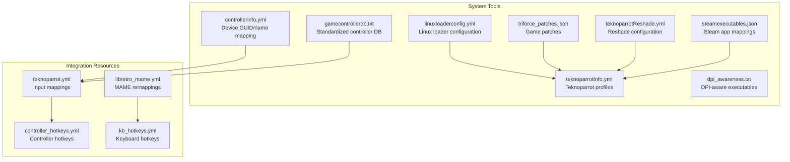
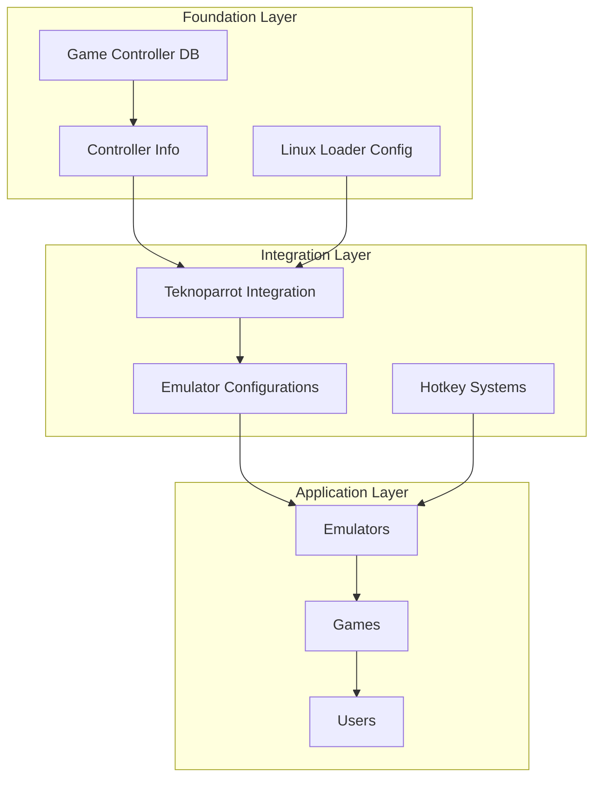
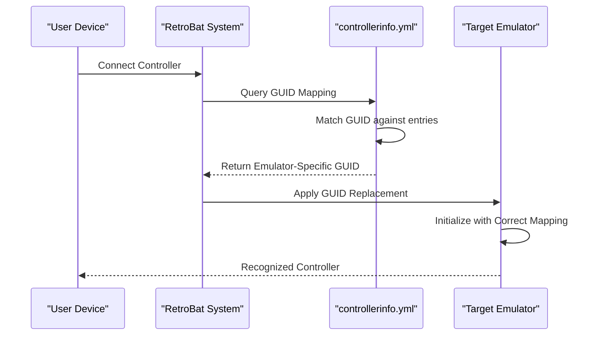
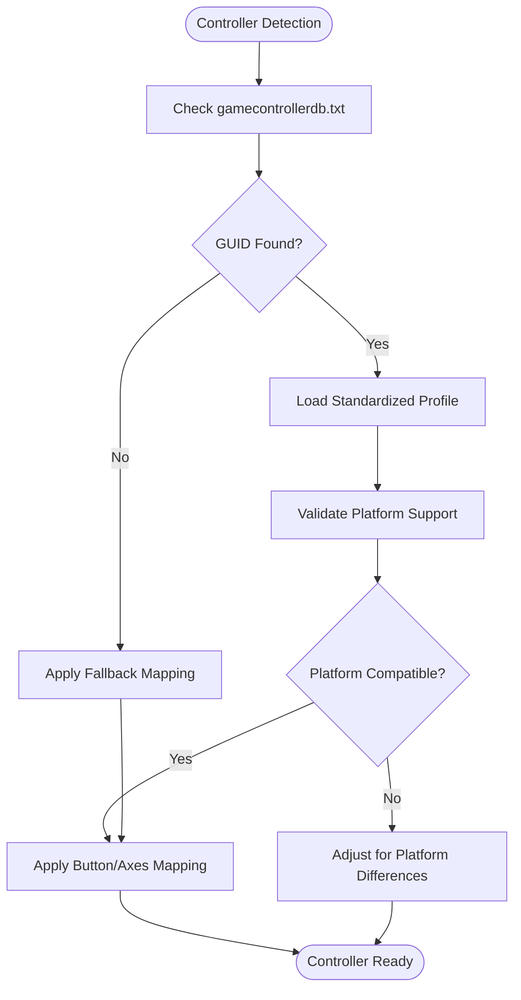
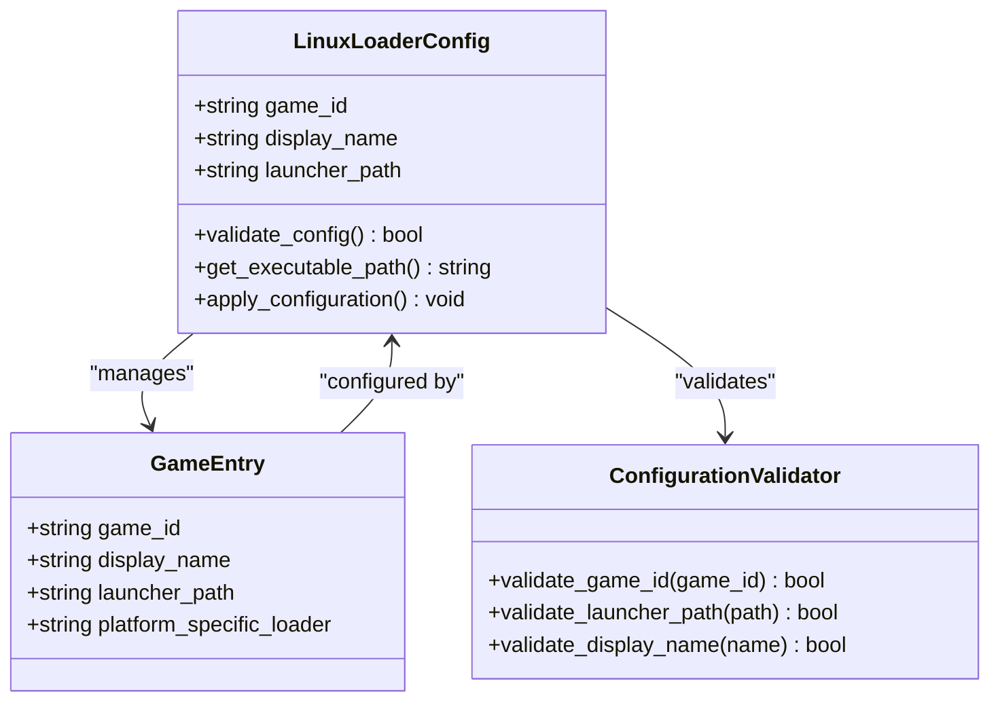
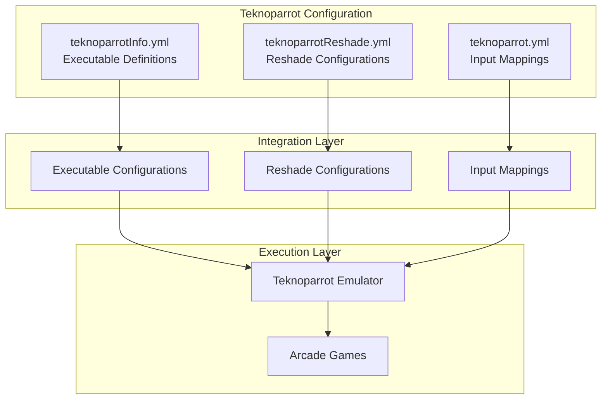
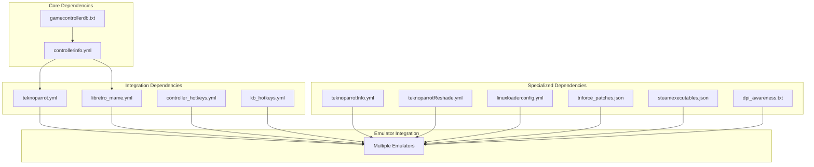

# System Tools and Utilities

<cite>
**Referenced Files in This Document**
- [controllerinfo.yml](file://system/tools/controllerinfo.yml)
- [gamecontrollerdb.txt](file://system/tools/gamecontrollerdb.txt)
- [linuxloaderconfig.yml](file://system/tools/linuxloaderconfig.yml)
- [teknoparrotInfo.yml](file://system/tools/teknoparrotInfo.yml)
- [teknoparrotReshade.yml](file://system/tools/teknoparrotReshade.yml)
- [dpi_awareness.txt](file://system/tools/dpi_awareness.txt)
- [steamexecutables.json](file://system/tools/steamexecutables.json)
- [triforce_patches.json](file://system/tools/triforce_patches.json)
- [teknoparrot.yml](file://system/resources/inputmapping/teknoparrot.yml)
- [libretro_mame.yml](file://system/resources/inputmapping/libretro_mame.yml)
- [controller_hotkeys.yml](file://system/resources/inputmapping/controller_hotkeys.yml)
- [kb_hotkeys.yml](file://system/resources/inputmapping/kb_hotkeys.yml)
</cite>

## Table of Contents
1. [Introduction](#introduction)
2. [Project Structure](#project-structure)
3. [Core Components](#core-components)
4. [Architecture Overview](#architecture-overview)
5. [Detailed Component Analysis](#detailed-component-analysis)
6. [Dependency Analysis](#dependency-analysis)
7. [Performance Considerations](#performance-considerations)
8. [Troubleshooting Guide](#troubleshooting-guide)
9. [Conclusion](#conclusion)

## Introduction
RIESCADE_SYSTEM provides a comprehensive suite of system tools and utilities designed to enhance device compatibility, streamline setup processes, and optimize performance across diverse hardware configurations. These tools focus on three primary areas:
- Controller information management for precise device recognition and mapping
- Standardized gamepad database integration for cross-platform compatibility
- Linux loader configuration for seamless system integration

The utilities collectively ensure that controllers, emulators, and gaming systems work harmoniously regardless of hardware differences, while maintaining system integrity and performance.

## Project Structure
The system tools are organized under the system/tools directory, with complementary configuration files distributed across system/resources/inputmapping for broader integration with emulators and input systems.

**Diagram sources**
- [controllerinfo.yml:1-119](file://system/tools/controllerinfo.yml#L1-L119)
- [gamecontrollerdb.txt:1-865](file://system/tools/gamecontrollerdb.txt#L1-L865)
- [linuxloaderconfig.yml:1-116](file://system/tools/linuxloaderconfig.yml#L1-L116)
- [teknoparrotInfo.yml:1-28](file://system/tools/teknoparrotInfo.yml#L1-L28)
- [teknoparrotReshade.yml:1-215](file://system/tools/teknoparrotReshade.yml#L1-L215)
- [triforce_patches.json:1-226](file://system/tools/triforce_patches.json#L1-L226)

**Section sources**
- [controllerinfo.yml:1-119](file://system/tools/controllerinfo.yml#L1-L119)
- [gamecontrollerdb.txt:1-865](file://system/tools/gamecontrollerdb.txt#L1-L865)
- [linuxloaderconfig.yml:1-116](file://system/tools/linuxloaderconfig.yml#L1-L116)
- [teknoparrotInfo.yml:1-28](file://system/tools/teknoparrotInfo.yml#L1-L28)
- [teknoparrotReshade.yml:1-215](file://system/tools/teknoparrotReshade.yml#L1-L215)
- [dpi_awareness.txt:1-5](file://system/tools/dpi_awareness.txt#L1-L5)
- [steamexecutables.json:1-196](file://system/tools/steamexecutables.json#L1-L196)
- [triforce_patches.json:1-226](file://system/tools/triforce_patches.json#L1-L226)

## Core Components

### Controller Information Management (controllerinfo.yml)
The controllerinfo.yml file serves as a comprehensive device mapping system that enables precise controller identification and emulation-specific customization. It maintains a hierarchical structure where each top-level entry represents a controller's RetroBat GUID, with nested configurations for specific emulator requirements.

Key capabilities include:
- GUID replacement for multiple emulators (Azahar, BigPEmu, Cemu, Citra, Citron, Dolphin, Eden, Lime3DS, Mandarine, Mednafen, Mupen64, Ryujinx, Simple64, Sudachi, SuYu, Teknoparrot, Yuzu)
- Name replacement for emulators requiring specific naming conventions (Dolphin, Mupen64, Simple64)
- Community-contributed device mappings for enhanced compatibility
- Platform-specific controller support (Sony PlayStation, Nintendo Switch Pro)

The file employs YAML indentation with two-space increments and follows a structured format where each GUID entry contains:
- A human-readable name field
- Nested emulator-specific configurations with GUID replacements
- Support for both GUID and name modifications depending on emulator requirements

**Section sources**
- [controllerinfo.yml:1-119](file://system/tools/controllerinfo.yml#L1-L119)

### Standardized Gamepad Database Integration (gamecontrollerdb.txt)
The gamecontrollerdb.txt file provides a standardized controller database compatible with SDL 2.0.16, specifically adapted for RetroBat environments. This database ensures consistent controller recognition and mapping across different platforms and emulators.

Database characteristics include:
- Comprehensive controller entries with standardized GUID formats
- Platform-specific categorization (Windows, WindowsGun, WindowsWheel)
- Extensive controller support covering various gaming peripherals
- Enhanced wheel and lightgun support for specialized gaming equipment
- Platform-agnostic controller definitions for cross-emulator compatibility

The database format follows SDL Game Controller DB standards with entries containing:
- Unique controller identifiers (GUID)
- Manufacturer and product information
- Button and axis mappings
- Platform-specific attributes
- Specialized support for racing wheels and lightguns

**Section sources**
- [gamecontrollerdb.txt:1-865](file://system/tools/gamecontrollerdb.txt#L1-L865)

### Linux Loader Configuration (linuxloaderconfig.yml)
The linuxloaderconfig.yml file manages Linux-specific loader configurations for various arcade and racing games. This configuration system enables proper execution and compatibility of Linux-based gaming applications within the RIESCADE ecosystem.

Configuration structure includes:
- Game-specific loader paths and executables
- Display name customization for improved user experience
- Platform-specific loader selection (elf, vsg_l, Jennifer, prog)
- Support for multiple game variants and special editions
- Flexible configuration allowing custom loader paths

Each game entry consists of:
- Game identifier as the primary key
- Optional display_name field for user-friendly identification
- Required launcher_path field specifying the execution method
- Support for empty launcher paths when no special loader is needed

**Section sources**
- [linuxloaderconfig.yml:1-116](file://system/tools/linuxloaderconfig.yml#L1-L116)

### Teknoparrot Integration Utilities
RIESCADE_SYSTEM provides comprehensive Teknoparrot integration through multiple specialized configuration files that enable advanced arcade gaming capabilities.

#### Teknoparrot Profiles (teknoparrotInfo.yml)
The teknoparrotInfo.yml file defines executable configurations for various Teknoparrot-supported games, enabling proper initialization and operation of arcade-style games within the emulation environment.

Key features include:
- Game-specific executable definitions
- Profile-based configurations for complex games
- Support for multiple game variants and versions
- Flexible path specification for game executables

#### Reshade Configuration (teknoparrotReshade.yml)
The teknoparrotReshade.yml file enables advanced graphics enhancement through Reshade integration, particularly beneficial for lightgun games requiring specialized visual effects.

Configuration capabilities encompass:
- Platform-specific executable targeting (x86, x64)
- Graphics API selection (OpenGL, D3D9, D3D10, D3D11, DXGI)
- Specialized loader configurations (tp_budgie, elf_budgie)
- Game-specific shader and effect configurations

**Section sources**
- [teknoparrotInfo.yml:1-28](file://system/tools/teknoparrotInfo.yml#L1-L28)
- [teknoparrotReshade.yml:1-215](file://system/tools/teknoparrotReshade.yml#L1-L215)

### Additional System Utilities

#### DPI Awareness Management (dpi_awareness.txt)
The dpi_awareness.txt file identifies specific emulator executables that require DPI awareness configuration for proper display scaling and resolution handling across different monitor setups.

Supported emulators include:
- GSPlus
- Raine
- RetroArch
- SuperModel
- ZiNc

#### Steam Integration (steamexecutables.json)
The steamexecutables.json file provides Steam application ID mappings to game directories, enabling seamless integration with Steam-based gaming workflows and automated game detection.

#### Game Patch Management (triforce_patches.json)
The triforce_patches.json file contains specialized patch definitions for TriForce-based games, enabling compatibility fixes and performance optimizations through targeted memory modifications.

**Section sources**
- [dpi_awareness.txt:1-5](file://system/tools/dpi_awareness.txt#L1-L5)
- [steamexecutables.json:1-196](file://system/tools/steamexecutables.json#L1-L196)
- [triforce_patches.json:1-226](file://system/tools/triforce_patches.json#L1-L226)

## Architecture Overview
RIESCADE_SYSTEM implements a layered architecture where system tools provide foundational device and configuration management, while integration resources enable seamless emulator compatibility and user customization.

**Diagram sources**
- [controllerinfo.yml:1-119](file://system/tools/controllerinfo.yml#L1-L119)
- [gamecontrollerdb.txt:1-865](file://system/tools/gamecontrollerdb.txt#L1-L865)
- [linuxloaderconfig.yml:1-116](file://system/tools/linuxloaderconfig.yml#L1-L116)
- [teknoparrot.yml:1-800](file://system/resources/inputmapping/teknoparrot.yml#L1-L800)
- [controller_hotkeys.yml:1-38](file://system/resources/inputmapping/controller_hotkeys.yml#L1-L38)
- [kb_hotkeys.yml:1-34](file://system/resources/inputmapping/kb_hotkeys.yml#L1-L34)

## Detailed Component Analysis

### Controller Information Management System
The controller information management system operates through a sophisticated mapping mechanism that addresses the challenge of controller recognition across diverse emulator ecosystems.

**Diagram sources**
- [controllerinfo.yml:24-31](file://system/tools/controllerinfo.yml#L24-L31)

The system handles multiple mapping scenarios:
- GUID replacement for emulators requiring specific GUID formats
- Name replacement for emulators with strict naming requirements
- Platform-specific controller support for PlayStation and Nintendo devices
- Community-driven updates for expanded device compatibility

**Section sources**
- [controllerinfo.yml:1-119](file://system/tools/controllerinfo.yml#L1-L119)

### Gamepad Database Integration Workflow
The gamepad database integration ensures consistent controller recognition through standardized SDL-compatible entries that work across multiple emulators and platforms.

**Diagram sources**
- [gamecontrollerdb.txt:1-865](file://system/tools/gamecontrollerdb.txt#L1-L865)

The database provides comprehensive coverage including:
- Standardized button and axis mappings
- Platform-specific attributes and capabilities
- Specialized support for racing wheels and lightguns
- Cross-emulator compatibility through SDL standards

**Section sources**
- [gamecontrollerdb.txt:1-865](file://system/tools/gamecontrollerdb.txt#L1-L865)

### Linux Loader Configuration Management
The Linux loader configuration system provides flexible execution management for Linux-based gaming applications through configurable loader paths and executable specifications.

**Diagram sources**
- [linuxloaderconfig.yml:1-116](file://system/tools/linuxloaderconfig.yml#L1-L116)

**Section sources**
- [linuxloaderconfig.yml:1-116](file://system/tools/linuxloaderconfig.yml#L1-L116)

### Teknoparrot Integration Architecture
RIESCADE_SYSTEM's Teknoparrot integration combines multiple configuration files to provide comprehensive arcade gaming support with specialized graphics enhancements.

**Diagram sources**
- [teknoparrotInfo.yml:1-28](file://system/tools/teknoparrotInfo.yml#L1-L28)
- [teknoparrotReshade.yml:1-215](file://system/tools/teknoparrotReshade.yml#L1-L215)
- [teknoparrot.yml:1-800](file://system/resources/inputmapping/teknoparrot.yml#L1-L800)

**Section sources**
- [teknoparrotInfo.yml:1-28](file://system/tools/teknoparrotInfo.yml#L1-L28)
- [teknoparrotReshade.yml:1-215](file://system/tools/teknoparrotReshade.yml#L1-L215)
- [teknoparrot.yml:1-800](file://system/resources/inputmapping/teknoparrot.yml#L1-L800)

## Dependency Analysis
The system tools exhibit a well-structured dependency hierarchy where foundational components provide essential services to higher-level integrations.

**Diagram sources**
- [controllerinfo.yml:1-119](file://system/tools/controllerinfo.yml#L1-L119)
- [gamecontrollerdb.txt:1-865](file://system/tools/gamecontrollerdb.txt#L1-L865)
- [teknoparrot.yml:1-800](file://system/resources/inputmapping/teknoparrot.yml#L1-L800)
- [libretro_mame.yml:1-800](file://system/resources/inputmapping/libretro_mame.yml#L1-L800)
- [controller_hotkeys.yml:1-38](file://system/resources/inputmapping/controller_hotkeys.yml#L1-L38)
- [kb_hotkeys.yml:1-34](file://system/resources/inputmapping/kb_hotkeys.yml#L1-L34)
- [teknoparrotInfo.yml:1-28](file://system/tools/teknoparrotInfo.yml#L1-L28)
- [teknoparrotReshade.yml:1-215](file://system/tools/teknoparrotReshade.yml#L1-L215)
- [linuxloaderconfig.yml:1-116](file://system/tools/linuxloaderconfig.yml#L1-L116)
- [triforce_patches.json:1-226](file://system/tools/triforce_patches.json#L1-L226)
- [steamexecutables.json:1-196](file://system/tools/steamexecutables.json#L1-L196)
- [dpi_awareness.txt:1-5](file://system/tools/dpi_awareness.txt#L1-L5)

**Section sources**
- [controllerinfo.yml:1-119](file://system/tools/controllerinfo.yml#L1-L119)
- [gamecontrollerdb.txt:1-865](file://system/tools/gamecontrollerdb.txt#L1-L865)
- [teknoparrot.yml:1-800](file://system/resources/inputmapping/teknoparrot.yml#L1-L800)
- [libretro_mame.yml:1-800](file://system/resources/inputmapping/libretro_mame.yml#L1-L800)
- [controller_hotkeys.yml:1-38](file://system/resources/inputmapping/controller_hotkeys.yml#L1-L38)
- [kb_hotkeys.yml:1-34](file://system/resources/inputmapping/kb_hotkeys.yml#L1-L34)

## Performance Considerations
RIESCADE_SYSTEM's tools are designed with performance optimization in mind, focusing on efficient resource utilization and minimal overhead during runtime operations.

### Memory Efficiency
- YAML-based configuration files minimize parsing overhead through structured data representation
- JSON-based mappings provide fast lookup operations for Steam integration
- Database-driven approaches reduce redundant configuration storage

### Runtime Performance
- Controller mapping resolution occurs during initialization, reducing runtime overhead
- Platform-specific optimizations ensure minimal performance impact across different hardware configurations
- Caching mechanisms prevent repeated database queries for frequently accessed configurations

### Scalability Factors
- Hierarchical configuration structure allows for easy expansion without performance degradation
- Modular design enables selective loading of configuration components
- Standardized formats facilitate efficient processing across different system architectures

## Troubleshooting Guide

### Controller Recognition Issues
Common problems and solutions:
- **GUID Mismatch**: Verify controller GUID in controllerinfo.yml matches detected device
- **Emulator Compatibility**: Check supported emulators list in controllerinfo.yml for specific GUID replacement requirements
- **Platform Conflicts**: Ensure platform-specific controller entries are properly configured

### Gamepad Database Problems
Troubleshooting steps:
- **Missing Controllers**: Verify GUID exists in gamecontrollerdb.txt with correct platform designation
- **Button Mapping Issues**: Check for platform-specific button differences in database entries
- **Specialized Equipment**: Confirm wheel and lightgun entries are properly categorized

### Linux Loader Configuration Errors
Resolution strategies:
- **Invalid Paths**: Verify launcher_path values correspond to actual executable locations
- **Display Name Issues**: Ensure display_name entries don't exceed platform limitations
- **Game Variants**: Check for correct handling of special edition and variant configurations

### Teknoparrot Integration Problems
Diagnostic procedures:
- **Executable Not Found**: Verify teknoparrotInfo.yml executable paths exist and are accessible
- **Reshade Configuration**: Check teknoparrotReshade.yml platform and API compatibility
- **Input Mapping Conflicts**: Review teknoparrot.yml for conflicting button assignments

### Performance Optimization
Best practices:
- Regular cleanup of unused configuration entries
- Validation of database completeness for optimal recognition
- Monitoring of system resource usage during configuration loading

**Section sources**
- [controllerinfo.yml:1-119](file://system/tools/controllerinfo.yml#L1-L119)
- [gamecontrollerdb.txt:1-865](file://system/tools/gamecontrollerdb.txt#L1-L865)
- [linuxloaderconfig.yml:1-116](file://system/tools/linuxloaderconfig.yml#L1-L116)
- [teknoparrotInfo.yml:1-28](file://system/tools/teknoparrotInfo.yml#L1-L28)
- [teknoparrotReshade.yml:1-215](file://system/tools/teknoparrotReshade.yml#L1-L215)

## Conclusion
RIESCADE_SYSTEM's comprehensive suite of system tools and utilities provides a robust foundation for device compatibility, cross-platform integration, and performance optimization. Through strategic use of controller information management, standardized gamepad databases, Linux loader configurations, and specialized integration utilities, the system ensures reliable operation across diverse hardware configurations while maintaining system integrity and optimal performance.

The modular architecture enables selective deployment of tools based on specific requirements, while the standardized formats facilitate easy maintenance and community contributions. These utilities collectively address the challenges of controller recognition, emulator compatibility, and system optimization, providing users with a streamlined setup process and enhanced gaming experience across multiple platforms and hardware configurations.