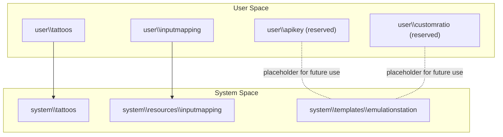
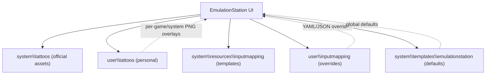
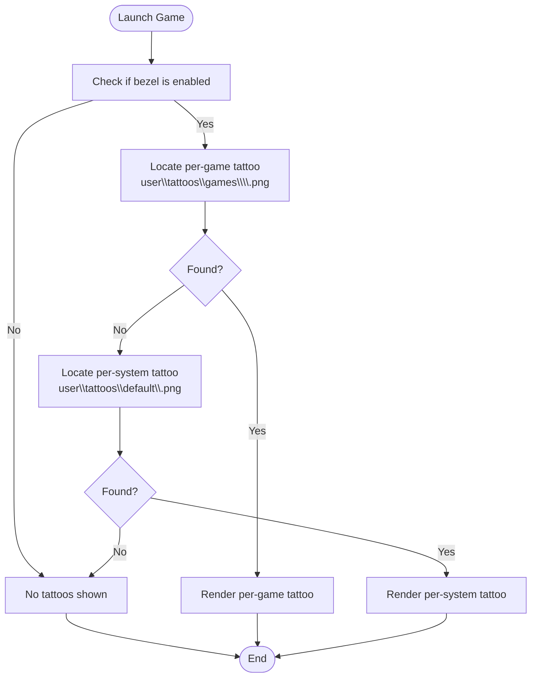
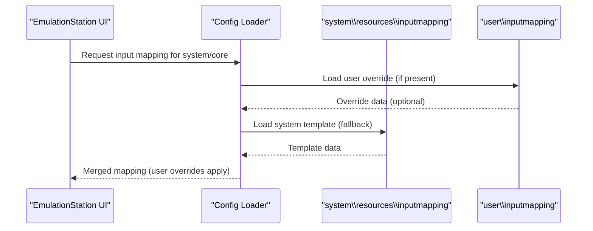
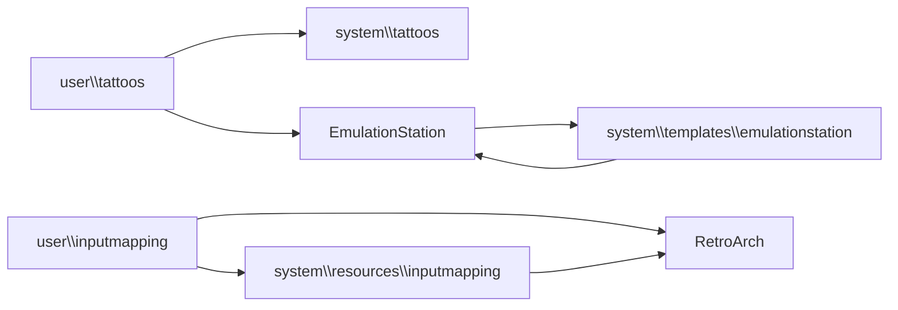

# User Customization

<cite>
**Referenced Files in This Document**
- [user\tattoos\README.md](file://user\tattoos\README.md)
- [system\tattoos\README.md](file://system\tattoos\README.md)
- [user\inputmapping\README.txt](file://user\inputmapping\README.txt)
- [system\resources\inputmapping\retroarch_controller_hotkeys.yml](file://system\resources\inputmapping\retroarch_controller_hotkeys.yml)
- [system\resources\inputmapping\retroarch_kb_hotkeys.yml](file://system\resources\inputmapping\retroarch_kb_hotkeys.yml)
- [system\resources\inputmapping\retroarch_controller.json](file://system\resources\inputmapping\retroarch_controller.json)
- [system\templates\emulationstation\es_settings.cfg](file://system\templates\emulationstation\es_settings.cfg)
- [system\templates\emulationstation\es_systems.cfg](file://system\templates\emulationstation\es_systems.cfg)
</cite>

## Table of Contents
1. [Introduction](#introduction)
2. [Project Structure](#project-structure)
3. [Core Components](#core-components)
4. [Architecture Overview](#architecture-overview)
5. [Detailed Component Analysis](#detailed-component-analysis)
6. [Dependency Analysis](#dependency-analysis)
7. [Performance Considerations](#performance-considerations)
8. [Troubleshooting Guide](#troubleshooting-guide)
9. [Conclusion](#conclusion)
10. [Appendices](#appendices)

## Introduction
This document explains the user customization features in RIESCADE_SYSTEM with a focus on:
- User-specific configuration overrides for input mappings
- Tattoo system for game decorations
- Global vs user preference precedence
- Practical examples for custom input mappings, aspect ratios, and tattoo placement
- Backup, restore, and migration guidance
- Security considerations for sensitive data

It consolidates the repository’s user-facing customization directories and the authoritative system templates to provide a clear, actionable guide for personalizing the platform while understanding how user changes interact with system defaults.

## Project Structure
RIESCADE_SYSTEM organizes user customization under dedicated directories:
- user\tattoos: Personalized tattoo overlays for games and systems
- user\inputmapping: Overrides for controller and keyboard mappings
- user\apikey and user\customratio: Reserved areas for API keys and custom aspect ratios (not present in current snapshot; see Precedence Rules below)
- system\tattoos: Official tattoo assets bundled with the installation
- system\resources\inputmapping: Authoritative mapping templates shipped with the system
- system\templates\emulationstation: Global configuration templates for EmulationStation

**Diagram sources**
- [user\tattoos\README.md:1-11](file://user\tattoos\README.md#L1-L11)
- [system\tattoos\README.md:1-7](file://system\tattoos\README.md#L1-L7)
- [user\inputmapping\README.txt:1-31](file://user\inputmapping\README.txt#L1-L31)
- [system\resources\inputmapping\retroarch_controller_hotkeys.yml:1-38](file://system\resources\inputmapping\retroarch_controller_hotkeys.yml#L1-L38)
- [system\resources\inputmapping\retroarch_kb_hotkeys.yml:1-21](file://system\resources\inputmapping\retroarch_kb_hotkeys.yml#L1-L21)
- [system\resources\inputmapping\retroarch_controller.json:1-362](file://system\resources\inputmapping\retroarch_controller.json#L1-L362)
- [system\templates\emulationstation\es_settings.cfg:1-51](file://system\templates\emulationstation\es_settings.cfg#L1-L51)
- [system\templates\emulationstation\es_systems.cfg:1-800](file://system\templates\emulationstation\es_systems.cfg#L1-L800)

**Section sources**
- [user\tattoos\README.md:1-11](file://user\tattoos\README.md#L1-L11)
- [system\tattoos\README.md:1-7](file://system\tattoos\README.md#L1-L7)
- [user\inputmapping\README.txt:1-31](file://user\inputmapping\README.txt#L1-L31)
- [system\templates\emulationstation\es_settings.cfg:1-51](file://system\templates\emulationstation\es_settings.cfg#L1-L51)
- [system\templates\emulationstation\es_systems.cfg:1-800](file://system\templates\emulationstation\es_systems.cfg#L1-L800)

## Core Components
- Tattoo system
  - Purpose: Add personalized overlays to decorated games via PNG images.
  - Placement:
    - Per-game tattoos: user\tattoos\games\<system>\<rom_name>.png
    - Generic per-system tattoos: user\tattoos\default\<system>.png
  - Visibility: Tattoos are shown only when bezels are enabled.

- Input mapping system
  - Purpose: Override controller and keyboard hotkeys and device mappings for RetroArch and select emulators.
  - Supported files include YAML and JSON templates for controllers, hotkeys, and core-specific mappings.
  - Overrides are applied from user\inputmapping and take precedence over system-provided templates.

- Global EmulationStation settings
  - Templates define default behaviors such as grouping, scraping, bezel selection, and screen saver options.
  - Users can adjust these via the UI; system templates act as authoritative defaults.

**Section sources**
- [user\tattoos\README.md:1-11](file://user\tattoos\README.md#L1-L11)
- [system\tattoos\README.md:1-7](file://system\tattoos\README.md#L1-L7)
- [user\inputmapping\README.txt:1-31](file://user\inputmapping\README.txt#L1-L31)
- [system\resources\inputmapping\retroarch_controller_hotkeys.yml:1-38](file://system\resources\inputmapping\retroarch_controller_hotkeys.yml#L1-L38)
- [system\resources\inputmapping\retroarch_kb_hotkeys.yml:1-21](file://system\resources\inputmapping\retroarch_kb_hotkeys.yml#L1-L21)
- [system\resources\inputmapping\retroarch_controller.json:1-362](file://system\resources\inputmapping\retroarch_controller.json#L1-L362)
- [system\templates\emulationstation\es_settings.cfg:1-51](file://system\templates\emulationstation\es_settings.cfg#L1-L51)

## Architecture Overview
The customization architecture separates user-authored content from system-provided defaults. User directories are designed to be additive and override-only, ensuring updates to the system do not erase personal changes.

**Diagram sources**
- [system\tattoos\README.md:1-7](file://system\tattoos\README.md#L1-L7)
- [user\tattoos\README.md:1-11](file://user\tattoos\README.md#L1-L11)
- [user\inputmapping\README.txt:1-31](file://user\inputmapping\README.txt#L1-L31)
- [system\resources\inputmapping\retroarch_controller_hotkeys.yml:1-38](file://system\resources\inputmapping\retroarch_controller_hotkeys.yml#L1-L38)
- [system\resources\inputmapping\retroarch_kb_hotkeys.yml:1-21](file://system\resources\inputmapping\retroarch_kb_hotkeys.yml#L1-L21)
- [system\resources\inputmapping\retroarch_controller.json:1-362](file://system\resources\inputmapping\retroarch_controller.json#L1-L362)
- [system\templates\emulationstation\es_settings.cfg:1-51](file://system\templates\emulationstation\es_settings.cfg#L1-L51)

## Detailed Component Analysis

### Tattoo System
- Functionality
  - Users can place PNG overlays for games and systems to personalize visuals.
  - Tattoos are only visible when bezels are enabled in the UI.

- Directory layout
  - Per-game: user\tattoos\games\<system>\<rom_name>.png
  - Per-system: user\tattoos\default\<system>.png
  - Official tattoos are provided under system\tattoos for selection in the UI.

- Behavior
  - User tattoos take precedence over system defaults for matching targets.
  - If a per-game tattoo does not exist, the system falls back to the per-system tattoo or none at all.

**Diagram sources**
- [user\tattoos\README.md:1-11](file://user\tattoos\README.md#L1-L11)
- [system\tattoos\README.md:1-7](file://system\tattoos\README.md#L1-L7)

**Section sources**
- [user\tattoos\README.md:1-11](file://user\tattoos\README.md#L1-L11)
- [system\tattoos\README.md:1-7](file://system\tattoos\README.md#L1-L7)

### Input Mapping System
- Scope
  - Override controller hotkeys, keyboard hotkeys, and device mappings for RetroArch and specific emulators.
  - Supported formats include YAML and JSON templates.

- Supported files and locations
  - RetroArch controller hotkeys: YAML templates
  - RetroArch keyboard hotkeys: YAML template
  - Controller device mappings: JSON templates
  - Core-specific and game-specific mappings: YAML templates
  - Originals are maintained under system\resources\inputmapping; user overrides live under user\inputmapping.

- Precedence
  - User overrides supersede system templates for the same target file.
  - Originals are overwritten during system updates; user files are preserved.

**Diagram sources**
- [user\inputmapping\README.txt:1-31](file://user\inputmapping\README.txt#L1-L31)
- [system\resources\inputmapping\retroarch_controller_hotkeys.yml:1-38](file://system\resources\inputmapping\retroarch_controller_hotkeys.yml#L1-L38)
- [system\resources\inputmapping\retroarch_kb_hotkeys.yml:1-21](file://system\resources\inputmapping\retroarch_kb_hotkeys.yml#L1-L21)
- [system\resources\inputmapping\retroarch_controller.json:1-362](file://system\resources\inputmapping\retroarch_controller.json#L1-L362)

**Section sources**
- [user\inputmapping\README.txt:1-31](file://user\inputmapping\README.txt#L1-L31)
- [system\resources\inputmapping\retroarch_controller_hotkeys.yml:1-38](file://system\resources\inputmapping\retroarch_controller_hotkeys.yml#L1-L38)
- [system\resources\inputmapping\retroarch_kb_hotkeys.yml:1-21](file://system\resources\inputmapping\retroarch_kb_hotkeys.yml#L1-L21)
- [system\resources\inputmapping\retroarch_controller.json:1-362](file://system\resources\inputmapping\retroarch_controller.json#L1-L362)

### Aspect Ratio and Display Setup
- Current state
  - The user\customratio directory is reserved for custom aspect ratio settings.
  - No active configuration files were found in the current snapshot; therefore, ratio adjustments are not yet configurable via this path.

- Guidance
  - When implemented, custom ratios will likely be stored under user\customratio and merged with system defaults.
  - Until then, use the EmulationStation UI to configure display and bezel-related settings.

**Section sources**
- [user\inputmapping\README.txt:1-31](file://user\inputmapping\README.txt#L1-L31)

### API Key Management
- Current state
  - The user\apikey directory is reserved for API keys.
  - No active configuration files were found in the current snapshot.

- Guidance
  - When implemented, API keys will be stored under user\apikey and merged with system defaults.
  - Treat API keys as sensitive data; avoid committing them to shared repositories.
  - Prefer environment-based or encrypted storage mechanisms when available.

**Section sources**
- [user\inputmapping\README.txt:1-31](file://user\inputmapping\README.txt#L1-L31)

## Dependency Analysis
- Tattoo dependencies
  - user\tattoos depends on system\tattoos for official assets and EmulationStation’s bezel rendering pipeline.
  - Tattoo visibility is controlled by EmulationStation settings.

- Input mapping dependencies
  - user\inputmapping depends on system\resources\inputmapping for baseline templates.
  - RetroArch consumes merged mappings at runtime.

- Global settings dependencies
  - EmulationStation reads system\templates\emulationstation defaults and applies user selections via the UI.

**Diagram sources**
- [user\tattoos\README.md:1-11](file://user\tattoos\README.md#L1-L11)
- [system\tattoos\README.md:1-7](file://system\tattoos\README.md#L1-L7)
- [user\inputmapping\README.txt:1-31](file://user\inputmapping\README.txt#L1-L31)
- [system\resources\inputmapping\retroarch_controller_hotkeys.yml:1-38](file://system\resources\inputmapping\retroarch_controller_hotkeys.yml#L1-L38)
- [system\resources\inputmapping\retroarch_kb_hotkeys.yml:1-21](file://system\resources\inputmapping\retroarch_kb_hotkeys.yml#L1-L21)
- [system\resources\inputmapping\retroarch_controller.json:1-362](file://system\resources\inputmapping\retroarch_controller.json#L1-L362)
- [system\templates\emulationstation\es_settings.cfg:1-51](file://system\templates\emulationstation\es_settings.cfg#L1-L51)

**Section sources**
- [system\templates\emulationstation\es_settings.cfg:1-51](file://system\templates\emulationstation\es_settings.cfg#L1-L51)
- [system\templates\emulationstation\es_systems.cfg:1-800](file://system\templates\emulationstation\es_systems.cfg#L1-L800)

## Performance Considerations
- Tattoo rendering
  - PNG overlays are composited onto the bezel; keep image sizes reasonable to minimize GPU overhead.
  - Prefer system-provided optimized assets where available.

- Input mapping
  - Large or numerous YAML/JSON overrides can increase startup parsing time.
  - Keep overrides minimal and targeted to reduce merge complexity.

- Global settings
  - Excessive scraping or media processing can impact UI responsiveness; tune settings accordingly.

[No sources needed since this section provides general guidance]

## Troubleshooting Guide
- Tattoos not showing
  - Verify that bezels are enabled in the EmulationStation UI.
  - Confirm the correct file naming and path: user\tattoos\games\<system>\<rom>.png or user\tattoos\default\<system>.png.

- Input mappings not applied
  - Ensure the override file name matches the system-provided template.
  - Confirm the user override is placed under user\inputmapping and not deleted by system updates.

- Global settings reset after update
  - System updates replace system templates; user changes made via the UI persist separately.
  - Re-apply UI-level preferences after updates.

**Section sources**
- [user\tattoos\README.md:1-11](file://user\tattoos\README.md#L1-L11)
- [system\tattoos\README.md:1-7](file://system\tattoos\README.md#L1-L7)
- [user\inputmapping\README.txt:1-31](file://user\inputmapping\README.txt#L1-L31)
- [system\templates\emulationstation\es_settings.cfg:1-51](file://system\templates\emulationstation\es_settings.cfg#L1-L51)

## Conclusion
RIESCADE_SYSTEM provides a robust, layered customization model:
- user\tattoos enables personalized game and system decorations with clear precedence over system assets.
- user\inputmapping allows precise control over input behavior by overriding system templates.
- system templates serve as authoritative defaults, while user changes remain safe across updates.
Future placeholders (user\apikey, user\customratio) indicate planned enhancements for secure API key management and advanced display tuning.

[No sources needed since this section summarizes without analyzing specific files]

## Appendices

### Precedence Rules and Inheritance Patterns
- Tattoo precedence
  - Per-game user tattoo > Per-system user tattoo > System official tattoo > None

- Input mapping precedence
  - user\inputmapping overrides > system\resources\inputmapping fallback

- Global settings
  - EmulationStation UI selections override system templates for user-visible behavior

**Section sources**
- [user\tattoos\README.md:1-11](file://user\tattoos\README.md#L1-L11)
- [system\tattoos\README.md:1-7](file://system\tattoos\README.md#L1-L7)
- [user\inputmapping\README.txt:1-31](file://user\inputmapping\README.txt#L1-L31)
- [system\templates\emulationstation\es_settings.cfg:1-51](file://system\templates\emulationstation\es_settings.cfg#L1-L51)

### Backup and Restore Guidance
- Backup
  - Archive user\tattoos and user\inputmapping to preserve customizations.
  - Back up EmulationStation UI preferences externally if applicable to your deployment.

- Restore
  - Recreate the same directory structure under the new installation.
  - Verify that user overrides are recognized after restart.

- Migration
  - Copy user\tattoos and user\inputmapping between installations.
  - After system updates, re-apply UI-level preferences as needed.

[No sources needed since this section provides general guidance]

### Security Considerations
- Treat API keys as sensitive data; store them outside shared repositories.
- Prefer environment-based or encrypted storage when available.
- Limit exposure of user-specific configuration files in public contexts.

[No sources needed since this section provides general guidance]