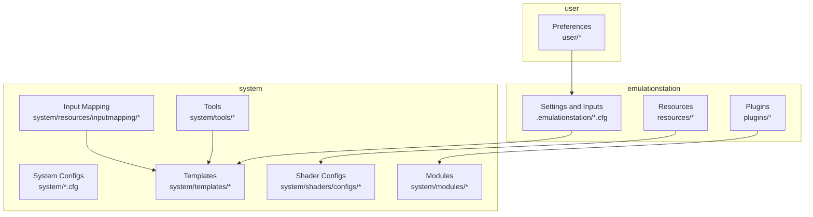
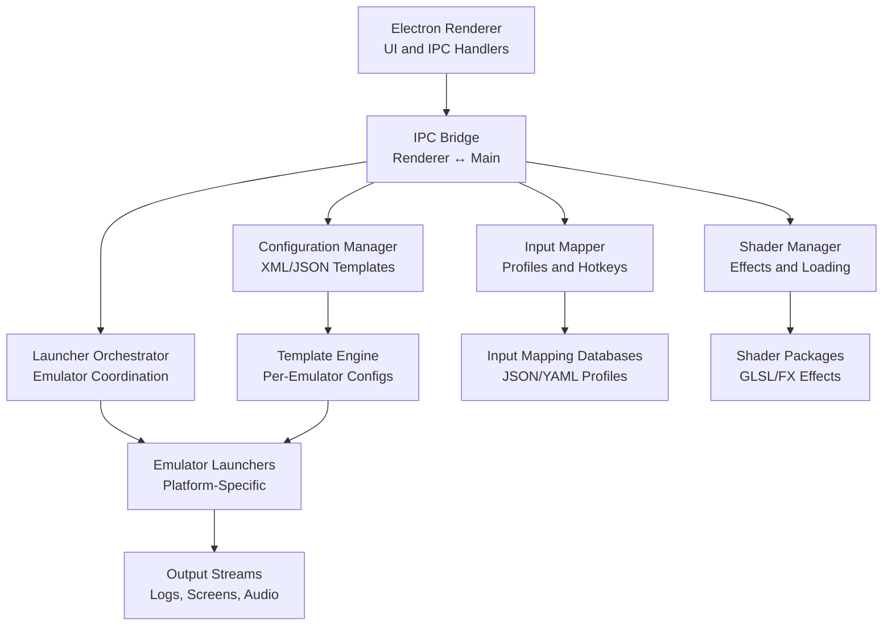
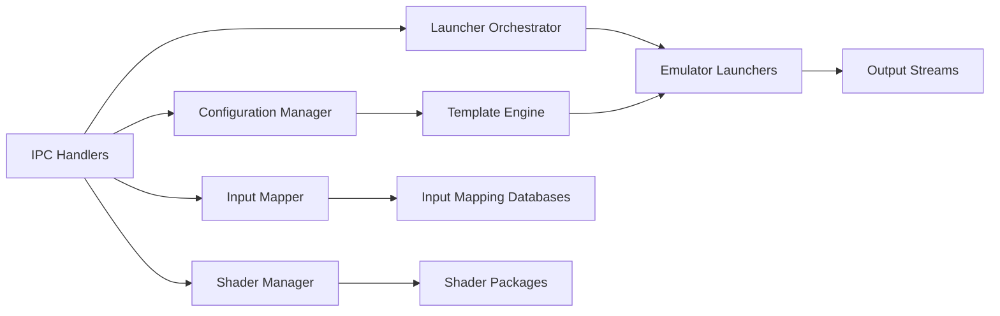

# API Reference and Integration Points

<cite>
**Referenced Files in This Document**
- [emulatorLauncher.cfg](file://emulationstation/emulatorLauncher.cfg)
- [es_settings.cfg](file://emulationstation/.emulationstation/es_settings.cfg)
- [es_systems.cfg](file://emulationstation/.emulationstation/es_systems.cfg)
- [es_input.cfg](file://emulationstation/.emulationstation/es_input.cfg)
- [es_padtokey.cfg](file://emulationstation/.emulationstation/es_padtokey.cfg)
- [kbhotkeysdics.json](file://emulationstation/resources/kbhotkeysdics.json)
- [kb_hotkeys.yml](file://system/resources/inputmapping/kb_hotkeys.yml)
- [controller_hotkeys.yml](file://system/resources/inputmapping/controller_hotkeys.yml)
- [GCControllers.json](file://system/resources/inputmapping/GCControllers.json)
- [mdControllers.json](file://system/resources/inputmapping/mdControllers.json)
- [n64Controllers.json](file://system/resources/inputmapping/n64Controllers.json)
- [retroarch_controller.json](file://system/resources/inputmapping/retroarch_controller.json)
- [rendering-defaults.yml](file://system/shaders/configs/[riescade]/rendering-defaults.yml)
- [CRTGeom.fx](file://system/shaders/configs/curvature/CRTGeom.fx)
- [ntsc.fx](file://system/shaders/configs/ntsc/ntsc.fx)
- [HQ4X.fx](file://system/shaders/configs/enhanced/HQ4X.fx)
- [scanlines-abs.fx](file://system/shaders/configs/scanlines/scanlines-abs.fx)
- [border.fx](file://system/shaders/configs/sindenborder/border.fx)
- [CRTEasymode.fx](file://system/shaders/configs/zfast/CRTEasymode.fx)
- [blur.glsl](file://emulationstation/resources/shaders/blur.glsl)
- [crt.glsl](file://emulationstation/resources/shaders/crt.glsl)
- [pixelate.glsl](file://emulationstation/resources/shaders/pixelate.glsl)
- [negative.glsl](file://emulationstation/resources/shaders/negative.glsl)
- [scanlines.glsl](file://emulationstation/resources/shaders/scanlines.glsl)
- [shadow.glsl](file://emulationstation/resources/shaders/shadow.glsl)
- [vscrolleffect.glsl](file://emulationstation/resources/shaders/vscrolleffect.glsl)
- [kawase_blur_5pass.glslp](file://emulationstation/resources/shaders/kawase_blur_5pass.glslp)
- [kawase_blur_9pass.glslp](file://emulationstation/resources/shaders/kawase_blur_9pass.glslp)
- [mesen/settings.json](file://system/templates/mesen/settings.json)
- [mesen-s/settings.xml](file://system/templates/mesen-s/settings.xml)
- [retroarch/retroarch.cfg](file://system/templates/retroarch/retroarch.cfg)
- [retroarch/retroarch-core-options.cfg](file://system/templates/retroarch/retroarch-core-options.cfg)
- [dolphin-emu/Dolphin.ini](file://system/templates/dolphin-emu/User/Config/Dolphin.ini)
- [pcsx2/portable.ini](file://system/templates/pcsx2/portable.ini)
- [flycast/emu.cfg](file://system/templates/flycast/emu.cfg)
- [flycast/gpuDX11.ini](file://system/templates/demul/Demul.ini)
- [flycast/gpuDX11.ini](file://system/templates/demul/gpuDX11.ini)
- [flycast/gpuDX11old.ini](file://system/templates/demul/gpuDX11old.ini)
- [xenia/xenia.config.toml](file://system/templates/xenia/xenia.config.toml)
- [xenia-canary/xenia-canary.config.toml](file://system/templates/xenia-canary/xenia-canary.config.toml)
- [xenia-edge/xenia-edge.config.toml](file://system/templates/xenia-edge/xenia-edge.config.toml)
- [xroar/gamecontrollerdb.txt](file://system/templates/xroar/gamecontrollerdb.txt)
- [steamexecutables.json](file://system/tools/steamexecutables.json)
- [teknoparrotInfo.yml](file://system/tools/teknoparrotInfo.yml)
- [linuxloaderconfig.yml](file://system/tools/linuxloaderconfig.yml)
- [controllerinfo.yml](file://system/tools/controllerinfo.yml)
- [triforce_patches.json](file://system/tools/triforce_patches.json)
- [checkWheelGunGamesResources.py](file://emulationstation/resources/checkWheelGunGamesResources.py)
- [version.info](file://emulationstation/version.info)
- [version.info](file://system/version.info)
- [README.md](file://README.md)
</cite>

## Table of Contents
1. [Introduction](#introduction)
2. [Project Structure](#project-structure)
3. [Core Components](#core-components)
4. [Architecture Overview](#architecture-overview)
5. [Detailed Component Analysis](#detailed-component-analysis)
6. [Dependency Analysis](#dependency-analysis)
7. [Performance Considerations](#performance-considerations)
8. [Troubleshooting Guide](#troubleshooting-guide)
9. [Conclusion](#conclusion)
10. [Appendices](#appendices)

## Introduction
This document provides a comprehensive API reference and integration guide for the RIESCADE_SYSTEM. It focuses on:
- Electron IPC communication patterns between main and renderer processes
- Configuration APIs for system settings, emulator configurations, and user preferences via XML and JSON
- Input mapping API for controller configuration, hotkey management, and keyboard shortcuts
- Shader configuration API for rendering pipeline integration, effect parameterization, and dynamic shader loading
- Launcher API for emulator coordination and game launching
- Plugin API for extending functionality
- Template system API for generating configuration files

The goal is to enable developers to integrate, configure, and extend RIESCADE_SYSTEM effectively while maintaining compatibility across diverse emulators and platforms.

## Project Structure
RIESCADE_SYSTEM organizes its integration points across several directories:
- emulationstation: Electron-based frontend resources, settings, and shader assets
- system: Core logic, templates, input mapping, shader configs, tools, and module integrations
- user: User-specific overrides and preferences
- library: Shared libraries and assets
- sounds: Achievement-related sound assets
- saves: Per-emulator save states and configurations

**Section sources**
- [README.md](file://README.md)

## Core Components
This section outlines the primary integration APIs and their roles:
- Electron IPC: Communication between main and renderer processes for UI updates, settings synchronization, and control events
- Configuration API: Centralized settings management via XML and JSON, with per-emulator templates
- Input Mapping API: Controller profiles, hotkeys, and keyboard shortcuts
- Shader Configuration API: Rendering pipeline effects and dynamic shader loading
- Launcher API: Emulator coordination and game launching orchestration
- Plugin API: Extensibility for codecs, filters, outputs, and platform-specific modules
- Template System API: Automated generation of emulator configuration files

**Section sources**
- [emulatorLauncher.cfg](file://emulationstation/emulatorLauncher.cfg)
- [es_settings.cfg](file://emulationstation/.emulationstation/es_settings.cfg)
- [es_systems.cfg](file://emulationstation/.emulationstation/es_systems.cfg)
- [es_input.cfg](file://emulationstation/.emulationstation/es_input.cfg)
- [es_padtokey.cfg](file://emulationstation/.emulationstation/es_padtokey.cfg)
- [kbhotkeysdics.json](file://emulationstation/resources/kbhotkeysdics.json)

## Architecture Overview
The system architecture integrates Electron front-end with system-level modules and per-emulator templates. Electron manages UI and IPC, while system modules handle configuration generation, input mapping, shader selection, and launcher orchestration.

**Section sources**
- [emulatorLauncher.cfg](file://emulationstation/emulatorLauncher.cfg)
- [es_settings.cfg](file://emulationstation/.emulationstation/es_settings.cfg)
- [es_systems.cfg](file://emulationstation/.emulationstation/es_systems.cfg)
- [es_input.cfg](file://emulationstation/.emulationstation/es_input.cfg)
- [es_padtokey.cfg](file://emulationstation/.emulationstation/es_padtokey.cfg)

## Detailed Component Analysis

### Electron IPC Communication Patterns
Electron IPC enables bidirectional communication between the main process and renderer process. Typical patterns include:
- Synchronous requests for immediate configuration reads
- Asynchronous notifications for live updates (e.g., input changes, shader updates)
- Event-driven messages for launcher orchestration and plugin lifecycle

Common message protocols:
- Settings read/write: { action: "getSettings", keys: [...] } → { settings: {...} }
- Input mapping update: { action: "applyMapping", profile: "..." } → { applied: true }
- Shader selection: { action: "selectShader", effect: "..." } → { loaded: true }
- Launcher launch: { action: "launchGame", emulator: "...", game: "..." } → { pid: 1234 }

Data exchange formats:
- JSON for structured settings and templates
- YAML for input mapping profiles
- XML for emulator-specific configuration files

Validation and error handling:
- Validate presence of required keys before applying settings
- Normalize paths and resolve relative paths against base directories
- Emit errors via IPC with standardized error codes and messages

**Section sources**
- [es_settings.cfg](file://emulationstation/.emulationstation/es_settings.cfg)
- [es_systems.cfg](file://emulationstation/.emulationstation/es_systems.cfg)
- [es_input.cfg](file://emulationstation/.emulationstation/es_input.cfg)
- [es_padtokey.cfg](file://emulationstation/.emulationstation/es_padtokey.cfg)

### Configuration API
The Configuration API manages system-wide and per-emulator settings using XML and JSON formats.

Key endpoints and behaviors:
- Get system settings: Reads from es_settings.cfg and merges with user overrides
- Set system settings: Writes validated changes to es_settings.cfg with backup
- Get emulator configuration: Loads emulatorLauncher.cfg and applies template mappings
- Apply user preferences: Merges user preferences with defaults and validates against schema

Formats and schemas:
- XML: es_systems.cfg, emulatorLauncher.cfg, emulator-specific XML templates
- JSON: es_settings.cfg, kbhotkeysdics.json, per-emulator JSON templates

Parameter validation:
- Required fields: Ensure mandatory keys exist before write operations
- Type checks: Validate numeric ranges, booleans, and enumerations
- Path resolution: Resolve relative paths to absolute locations under system/templates

Error handling:
- On invalid XML/JSON, return structured error with line/column
- On missing keys, provide default fallbacks or fail gracefully
- On write failures, revert to last known good configuration

**Section sources**
- [emulatorLauncher.cfg](file://emulationstation/emulatorLauncher.cfg)
- [es_settings.cfg](file://emulationstation/.emulationstation/es_settings.cfg)
- [es_systems.cfg](file://emulationstation/.emulationstation/es_systems.cfg)

### Input Mapping API
The Input Mapping API supports controller profiles, hotkeys, and keyboard shortcuts across multiple emulators.

Supported formats:
- JSON: Controller profiles (e.g., GCControllers.json, mdControllers.json, n64Controllers.json)
- YAML: Hotkey definitions (kb_hotkeys.yml, controller_hotkeys.yml)
- Text: Game controller database (gamecontrollerdb.txt)

Key operations:
- Load profile: Parse JSON/YAML and normalize button mappings
- Apply hotkeys: Merge kb_hotkeys.yml with es_padtokey.cfg for runtime binding
- Validate mappings: Ensure all mapped buttons exist and are unique
- Generate emulator-specific mappings: Transform generic profiles to target emulator formats

Example usage patterns:
- Select profile: { action: "loadProfile", system: "n64", profile: "default" }
- Bind hotkeys: { action: "bindHotkeys", hotkeys: ["save_state","load_state"] }
- Export mapping: { action: "exportMapping", format: "json/yaml" }

Validation:
- Unique button mapping per player
- Supported button names per emulator
- Range checks for analog triggers and sticks

**Section sources**
- [kb_hotkeys.yml](file://system/resources/inputmapping/kb_hotkeys.yml)
- [controller_hotkeys.yml](file://system/resources/inputmapping/controller_hotkeys.yml)
- [GCControllers.json](file://system/resources/inputmapping/GCControllers.json)
- [mdControllers.json](file://system/resources/inputmapping/mdControllers.json)
- [n64Controllers.json](file://system/resources/inputmapping/n64Controllers.json)
- [retroarch_controller.json](file://system/resources/inputmapping/retroarch_controller.json)
- [es_padtokey.cfg](file://emulationstation/.emulationstation/es_padtokey.cfg)

### Shader Configuration API
The Shader Configuration API integrates rendering pipeline effects and dynamic shader loading.

Shader packages and effects:
- Built-in effects: blur.glsl, crt.glsl, pixelate.glsl, negative.glsl, scanlines.glsl, shadow.glsl, vscrolleffect.glsl
- FX packages: CRTGeom.fx, ntsc.fx, HQ4X.fx, scanlines-abs.fx, border.fx, CRTEasymode.fx
- Parameterized packs: kawase_blur_5pass.glslp, kawase_blur_9pass.glslp

Key operations:
- Select shader pack: Choose rendering-defaults.yml for a theme (e.g., [riescade], crt-new-pixie, ntsc)
- Apply effect parameters: Load .glslp parameter files and inject uniforms
- Dynamic loading: Detect shader changes and reload pipeline without restart
- Fallback handling: If selected shader is unavailable, fall back to nearest compatible effect

Effect parameterization:
- Uniforms: exposure, scanlineIntensity, blurRadius, etc.
- Pass count: For kawase blur, pass count influences quality and performance
- Resolution scaling: Adjust effect resolution independently of output resolution

Validation:
- Verify shader file existence and GLSL/FX compatibility
- Validate parameter ranges and types
- Ensure effect chain order is supported by the rendering backend

**Section sources**
- [rendering-defaults.yml](file://system/shaders/configs/[riescade]/rendering-defaults.yml)
- [CRTGeom.fx](file://system/shaders/configs/curvature/CRTGeom.fx)
- [ntsc.fx](file://system/shaders/configs/ntsc/ntsc.fx)
- [HQ4X.fx](file://system/shaders/configs/enhanced/HQ4X.fx)
- [scanlines-abs.fx](file://system/shaders/configs/scanlines/scanlines-abs.fx)
- [border.fx](file://system/shaders/configs/sindenborder/border.fx)
- [CRTEasymode.fx](file://system/shaders/configs/zfast/CRTEasymode.fx)
- [blur.glsl](file://emulationstation/resources/shaders/blur.glsl)
- [crt.glsl](file://emulationstation/resources/shaders/crt.glsl)
- [kawase_blur_5pass.glslp](file://emulationstation/resources/shaders/kawase_blur_5pass.glslp)
- [kawase_blur_9pass.glslp](file://emulationstation/resources/shaders/kawase_blur_9pass.glslp)

### Launcher API
The Launcher API coordinates emulator launching and game execution.

Core responsibilities:
- Resolve emulator executable paths and arguments
- Apply per-game and per-system settings from templates
- Manage save states, screenshots, and logs
- Handle platform-specific launchers (Windows, Linux)

Key endpoints:
- List emulators: Enumerate configured emulators from es_systems.cfg
- Launch game: { emulator: "...", game: "...", options: {...} } → { pid, status }
- Get emulator info: { system: "..." } → { name, exe, args, config }
- Save state management: { action: "saveState", slot: 1 }, { action: "loadState", slot: 1 }

Validation:
- Verify emulator executables exist and are executable
- Validate game paths and supported extensions
- Ensure configuration templates are present and up-to-date

Error handling:
- On missing executables, suggest installation paths
- On unsupported games, return not found or unsupported type
- On launch failures, capture stderr and return structured error

**Section sources**
- [emulatorLauncher.cfg](file://emulationstation/emulatorLauncher.cfg)
- [es_systems.cfg](file://emulationstation/.emulationstation/es_systems.cfg)
- [version.info](file://emulationstation/version.info)

### Plugin API
The Plugin API extends functionality via modular components categorized by type:
- access: Access control and permissions
- audio_output: Audio device routing and effects
- codec: Media decoding support
- d3d11: DirectX 11 rendering modules
- demux: Stream demultiplexing
- video_chroma: Chroma key and color correction
- video_filter: Video post-processing filters
- video_output: Display and fullscreen modes

Integration patterns:
- Discovery: Scan plugins directory for compatible modules
- Registration: Register plugins with the system on startup
- Lifecycle: Initialize, configure, and unload plugins safely
- Compatibility: Validate plugin metadata and version compatibility

Validation:
- Verify plugin manifests and dependencies
- Ensure thread safety for concurrent operations
- Provide rollback on initialization failure

**Section sources**
- [README.md](file://README.md)

### Template System API
The Template System API generates emulator configuration files from standardized templates.

Supported templates:
- Mesen: settings.json
- Mesen-S: settings.xml
- RetroArch: retroarch.cfg, retroarch-core-options.cfg
- Dolphin: Dolphin.ini
- PCSX2: portable.ini
- Flycast: emu.cfg, gpuDX11.ini
- Demul: Demul.ini, gpuDX11.ini, gpuDX11old.ini
- Xenia: xenia.config.toml, xenia-canary.config.toml, xenia-edge.config.toml
- XRoar: gamecontrollerdb.txt

Key operations:
- Load template: Read and parse target emulator configuration
- Apply overrides: Merge user preferences and system settings
- Validate schema: Ensure all required fields are present
- Write output: Persist configuration to emulator-specific location

Validation:
- Field existence and type checks
- Enumerated value validation
- Path and file existence verification

**Section sources**
- [mesen/settings.json](file://system/templates/mesen/settings.json)
- [mesen-s/settings.xml](file://system/templates/mesen-s/settings.xml)
- [retroarch/retroarch.cfg](file://system/templates/retroarch/retroarch.cfg)
- [retroarch/retroarch-core-options.cfg](file://system/templates/retroarch/retroarch-core-options.cfg)
- [dolphin-emu/Dolphin.ini](file://system/templates/dolphin-emu/User/Config/Dolphin.ini)
- [pcsx2/portable.ini](file://system/templates/pcsx2/portable.ini)
- [flycast/emu.cfg](file://system/templates/flycast/emu.cfg)
- [flycast/gpuDX11.ini](file://system/templates/demul/Demul.ini)
- [flycast/gpuDX11.ini](file://system/templates/demul/gpuDX11.ini)
- [flycast/gpuDX11old.ini](file://system/templates/demul/gpuDX11old.ini)
- [xenia/xenia.config.toml](file://system/templates/xenia/xenia.config.toml)
- [xenia-canary/xenia-canary.config.toml](file://system/templates/xenia-canary/xenia-canary.config.toml)
- [xenia-edge/xenia-edge.config.toml](file://system/templates/xenia-edge/xenia-edge.config.toml)
- [xroar/gamecontrollerdb.txt](file://system/templates/xroar/gamecontrollerdb.txt)

## Dependency Analysis
The system exhibits layered dependencies:
- Electron UI depends on IPC handlers for configuration, input, shader, and launcher operations
- System modules depend on templates and tools for configuration generation
- Emulators depend on generated configurations and shader packages

**Section sources**
- [emulatorLauncher.cfg](file://emulationstation/emulatorLauncher.cfg)
- [es_settings.cfg](file://emulationstation/.emulationstation/es_settings.cfg)
- [es_systems.cfg](file://emulationstation/.emulationstation/es_systems.cfg)

## Performance Considerations
- IPC batching: Group frequent settings updates to reduce IPC overhead
- Lazy shader loading: Defer shader compilation until first render to minimize startup latency
- Template caching: Cache parsed templates to avoid repeated disk I/O
- Input polling: Use efficient event-driven input handling instead of polling
- Resource pooling: Reuse shader programs and texture atlases across frames

## Troubleshooting Guide
Common issues and resolutions:
- IPC timeouts: Ensure main process handles long-running tasks asynchronously and responds with progress updates
- Missing emulators: Verify emulator paths in es_systems.cfg and reinstall missing components
- Invalid configurations: Validate XML/JSON against schemas; revert to backups on failure
- Shader artifacts: Switch to compatible shader pack or adjust parameter ranges
- Input conflicts: Normalize button mappings and ensure unique assignments per player

Diagnostic aids:
- Log files: Review es_log.* for recent errors and warnings
- Version info: Confirm system and emulator versions match expected compatibility
- Tooling: Use controllerinfo.yml and steamexecutables.json to validate hardware and Steam integration

**Section sources**
- [version.info](file://emulationstation/version.info)
- [version.info](file://system/version.info)
- [checkWheelGunGamesResources.py](file://emulationstation/resources/checkWheelGunGamesResources.py)

## Conclusion
RIESCADE_SYSTEM provides a robust framework for emulator integration through well-defined APIs:
- Electron IPC enables responsive UI and reliable configuration synchronization
- Configuration API supports flexible XML/JSON settings with strong validation
- Input Mapping API standardizes controller profiles and hotkeys across emulators
- Shader Configuration API delivers dynamic rendering effects with parameterization
- Launcher API orchestrates emulator launches with per-game customization
- Plugin API and Template System API extend functionality and automate configuration generation

By adhering to the documented patterns and validation rules, developers can seamlessly integrate new emulators, customize rendering pipelines, and enhance user workflows.

## Appendices
- Tools and utilities:
  - steamexecutables.json: Steam executable discovery
  - teknoparrotInfo.yml: TeknoParrot-specific metadata
  - linuxloaderconfig.yml: Linux loader configuration
  - controllerinfo.yml: Controller capability and mapping info
  - triforce_patches.json: Triforce patch definitions

**Section sources**
- [steamexecutables.json](file://system/tools/steamexecutables.json)
- [teknoparrotInfo.yml](file://system/tools/teknoparrotInfo.yml)
- [linuxloaderconfig.yml](file://system/tools/linuxloaderconfig.yml)
- [controllerinfo.yml](file://system/tools/controllerinfo.yml)
- [triforce_patches.json](file://system/tools/triforce_patches.json)