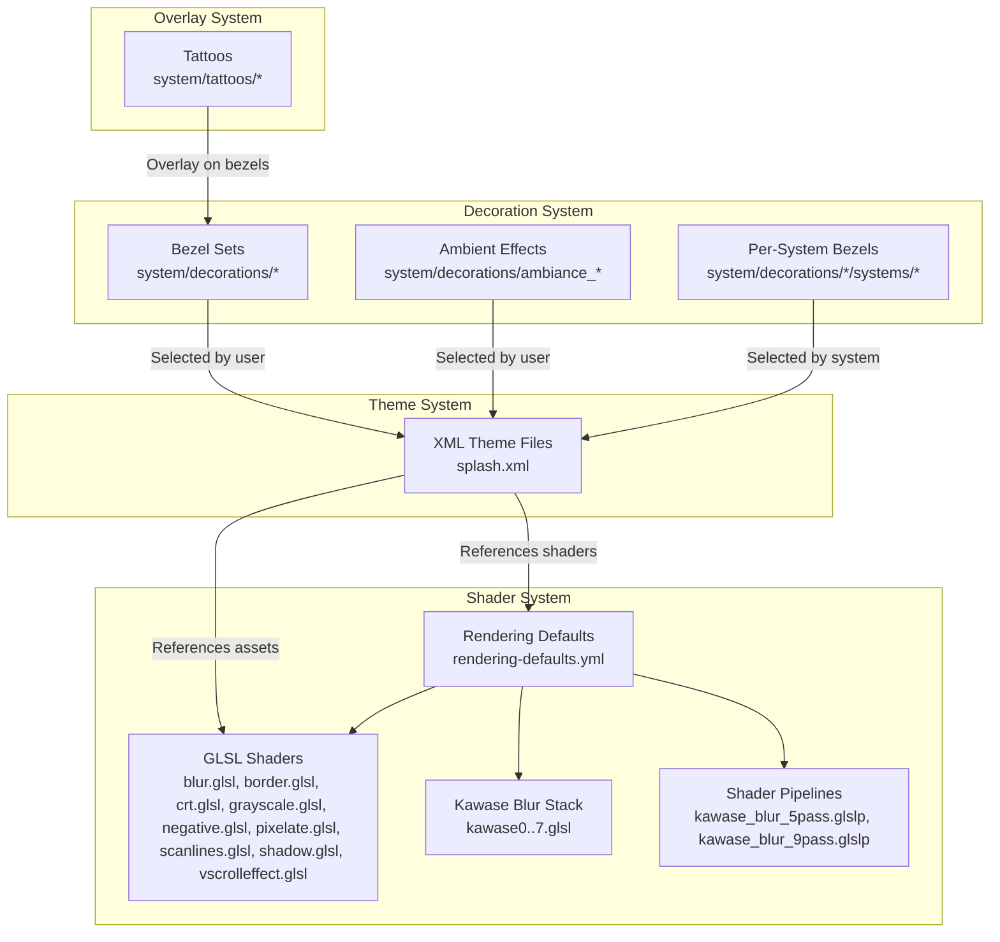
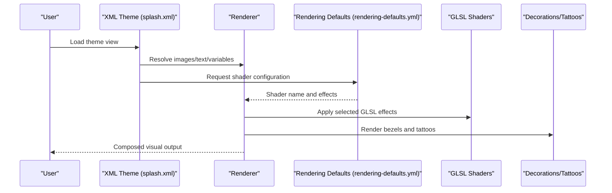
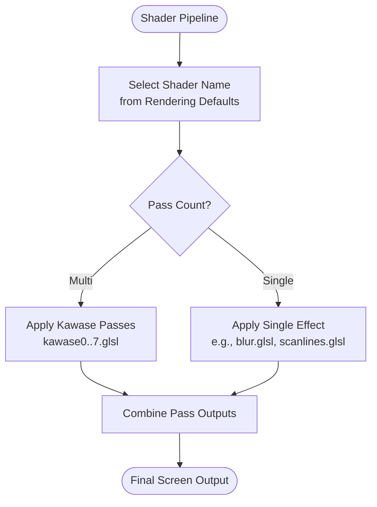
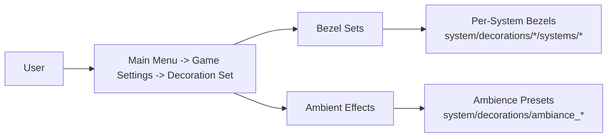
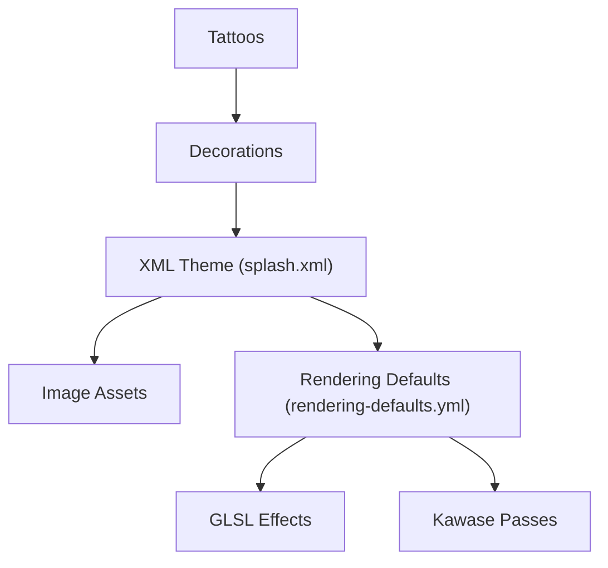

# Custom Theme and Visual Development

<cite>
**Referenced Files in This Document**
- [README.md](file://README.md)
- [splash.xml](file://emulationstation/resources/splash.xml)
- [rendering-defaults.yml](file://system/shaders/configs/[riescade]/rendering-defaults.yml)
- [README.md](file://system/decorations/README.md)
- [README.md](file://system/tattoos/README.md)
- [blur.glsl](file://emulationstation/resources/shaders/blur.glsl)
- [border.glsl](file://emulationstation/resources/shaders/border.glsl)
- [crt.glsl](file://emulationstation/resources/shaders/crt.glsl)
- [grayscale.glsl](file://emulationstation/resources/shaders/grayscale.glsl)
- [negative.glsl](file://emulationstation/resources/shaders/negative.glsl)
- [pixelate.glsl](file://emulationstation/resources/shaders/pixelate.glsl)
- [scanlines.glsl](file://emulationstation/resources/shaders/scanlines.glsl)
- [shadow.glsl](file://emulationstation/resources/shaders/shadow.glsl)
- [vscrolleffect.glsl](file://emulationstation/resources/shaders/vscrolleffect.glsl)
- [kawase0.glsl](file://emulationstation/resources/shaders/kawase/kawase0.glsl)
- [kawase1.glsl](file://emulationstation/resources/shaders/kawase/kawase1.glsl)
- [kawase2.glsl](file://emulationstation/resources/shaders/kawase/kawase2.glsl)
- [kawase3.glsl](file://emulationstation/resources/shaders/kawase/kawase3.glsl)
- [kawase4.glsl](file://emulationstation/resources/shaders/kawase/kawase4.glsl)
- [kawase5.glsl](file://emulationstation/resources/shaders/kawase/kawase5.glsl)
- [kawase6.glsl](file://emulationstation/resources/shaders/kawase/kawase6.glsl)
- [kawase7.glsl](file://emulationstation/resources/shaders/kawase/kawase7.glsl)
- [kawase_blur_5pass.glslp](file://emulationstation/resources/shaders/kawase_blur_5pass.glslp)
- [kawase_blur_9pass.glslp](file://emulationstation/resources/shaders/kawase_blur_9pass.glslp)
</cite>

## Table of Contents
1. [Introduction](#introduction)
2. [Project Structure](#project-structure)
3. [Core Components](#core-components)
4. [Architecture Overview](#architecture-overview)
5. [Detailed Component Analysis](#detailed-component-analysis)
6. [Dependency Analysis](#dependency-analysis)
7. [Performance Considerations](#performance-considerations)
8. [Troubleshooting Guide](#troubleshooting-guide)
9. [Conclusion](#conclusion)
10. [Appendices](#appendices)

## Introduction
This document explains how to develop custom themes and visuals for RIESCADE_SYSTEM. It covers the XML-based theme definition system, shader configurations, visual asset management, the decoration system for bezels and ambient effects, and the tattoo overlay system. It also provides practical workflows for creating, modifying, and distributing themes and shaders, along with performance guidance and compatibility considerations across display configurations.

## Project Structure
RIESCADE_SYSTEM organizes visual assets and configurations across several directories:
- Themes and splash screens: defined via XML theme files under the emulationstation resources.
- Shader effects: GLSL shader files and shader pipeline configurations under the emulationstation shaders and system shader configs.
- Decorations: Bezels and ambient effects organized per-system under system decorations.
- Tattoos: Controller overlay tattoos integrated with bezels.

**Diagram sources**
- [splash.xml:1-53](file://emulationstation/resources/splash.xml#L1-L53)
- [rendering-defaults.yml:1-7](file://system/shaders/configs/[riescade]/rendering-defaults.yml#L1-L7)
- [blur.glsl](file://emulationstation/resources/shaders/blur.glsl)
- [border.glsl](file://emulationstation/resources/shaders/border.glsl)
- [crt.glsl](file://emulationstation/resources/shaders/crt.glsl)
- [grayscale.glsl](file://emulationstation/resources/shaders/grayscale.glsl)
- [negative.glsl](file://emulationstation/resources/shaders/negative.glsl)
- [pixelate.glsl](file://emulationstation/resources/shaders/pixelate.glsl)
- [scanlines.glsl](file://emulationstation/resources/shaders/scanlines.glsl)
- [shadow.glsl](file://emulationstation/resources/shaders/shadow.glsl)
- [vscrolleffect.glsl](file://emulationstation/resources/shaders/vscrolleffect.glsl)
- [kawase0.glsl](file://emulationstation/resources/shaders/kawase/kawase0.glsl)
- [kawase1.glsl](file://emulationstation/resources/shaders/kawase/kawase1.glsl)
- [kawase2.glsl](file://emulationstation/resources/shaders/kawase/kawase2.glsl)
- [kawase3.glsl](file://emulationstation/resources/shaders/kawase/kawase3.glsl)
- [kawase4.glsl](file://emulationstation/resources/shaders/kawase/kawase4.glsl)
- [kawase5.glsl](file://emulationstation/resources/shaders/kawase/kawase5.glsl)
- [kawase6.glsl](file://emulationstation/resources/shaders/kawase/kawase6.glsl)
- [kawase7.glsl](file://emulationstation/resources/shaders/kawase/kawase7.glsl)
- [kawase_blur_5pass.glslp](file://emulationstation/resources/shaders/kawase_blur_5pass.glslp)
- [kawase_blur_9pass.glslp](file://emulationstation/resources/shaders/kawase_blur_9pass.glslp)

**Section sources**
- [README.md:1-44](file://README.md#L1-L44)

## Core Components
- XML Theme System: Defines views, images, text, and visual layers for splash screens and UI. Variables enable color and gradient customization.
- Shader System: Provides individual GLSL effects and configurable shader pipelines. Rendering defaults bind shaders and effects to systems.
- Decoration System: Offers bezel sets and ambient effects selectable by the user and system-specific fallbacks.
- Tattoo System: Overlay tattoos rendered atop bezels for controller visualization.

Key implementation references:
- Theme definition and variable usage: [splash.xml:1-53](file://emulationstation/resources/splash.xml#L1-L53)
- Shader pipeline configuration: [rendering-defaults.yml:1-7](file://system/shaders/configs/[riescade]/rendering-defaults.yml#L1-L7)
- Decorations selection guide: [README.md:1-10](file://system/decorations/README.md#L1-L10)
- Tattoos selection guide: [README.md:1-7](file://system/tattoos/README.md#L1-L7)

**Section sources**
- [splash.xml:1-53](file://emulationstation/resources/splash.xml#L1-L53)
- [rendering-defaults.yml:1-7](file://system/shaders/configs/[riescade]/rendering-defaults.yml#L1-L7)
- [README.md:1-10](file://system/decorations/README.md#L1-L10)
- [README.md:1-7](file://system/tattoos/README.md#L1-L7)

## Architecture Overview
The visual stack integrates theme XML, shader configurations, and assets to render themed UI and effects.

**Diagram sources**
- [splash.xml:1-53](file://emulationstation/resources/splash.xml#L1-L53)
- [rendering-defaults.yml:1-7](file://system/shaders/configs/[riescade]/rendering-defaults.yml#L1-L7)

## Detailed Component Analysis

### XML Theme System
The XML theme system defines views, image layers, gradients, and text with variables for dynamic theming. It supports tiling, positioning, origins, and zIndex stacking for compositing.

Implementation highlights:
- Variables for colors and gradients enable consistent theming across assets.
- Image layers support tiling, sizing, and color gradients.
- Text elements support alignment, glow, and font configuration.
- The splash theme demonstrates layered composition with background, logo, progress bar, and label.

Example references:
- Variable definitions and gradient usage: [splash.xml:4-17](file://emulationstation/resources/splash.xml#L4-L17)
- Background image and logo placement: [splash.xml:18-26](file://emulationstation/resources/splash.xml#L18-L26)
- Progress bar and active progress styling: [splash.xml:27-42](file://emulationstation/resources/splash.xml#L27-L42)
- Text styling and glow: [splash.xml:43-50](file://emulationstation/resources/splash.xml#L43-L50)

**Section sources**
- [splash.xml:1-53](file://emulationstation/resources/splash.xml#L1-L53)

### Shader System
The shader system comprises individual GLSL effects and configurable shader pipelines. Rendering defaults bind shader names and toggles to systems.

Effects overview:
- Basic effects: blur, border, grayscale, negative, pixelate, scanlines, shadow, CRT simulation, vertical scroll effect.
- Kawase blur stack: modular pass shaders (kawase0..7) and pipeline configurations (5-pass and 9-pass).

Pipeline configuration:
- Rendering defaults specify shader names and toggles for scanlines and similar effects.

Example references:
- Individual effects: [blur.glsl](file://emulationstation/resources/shaders/blur.glsl), [border.glsl](file://emulationstation/resources/shaders/border.glsl), [crt.glsl](file://emulationstation/resources/shaders/crt.glsl), [grayscale.glsl](file://emulationstation/resources/shaders/grayscale.glsl), [negative.glsl](file://emulationstation/resources/shaders/negative.glsl), [pixelate.glsl](file://emulationstation/resources/shaders/pixelate.glsl), [scanlines.glsl](file://emulationstation/resources/shaders/scanlines.glsl), [shadow.glsl](file://emulationstation/resources/shaders/shadow.glsl), [vscrolleffect.glsl](file://emulationstation/resources/shaders/vscrolleffect.glsl)
- Kawase blur passes: [kawase0.glsl](file://emulationstation/resources/shaders/kawase/kawase0.glsl), [kawase1.glsl](file://emulationstation/resources/shaders/kawase/kawase1.glsl), [kawase2.glsl](file://emulationstation/resources/shaders/kawase/kawase2.glsl), [kawase3.glsl](file://emulationstation/resources/shaders/kawase/kawase3.glsl), [kawase4.glsl](file://emulationstation/resources/shaders/kawase/kawase4.glsl), [kawase5.glsl](file://emulationstation/resources/shaders/kawase/kawase5.glsl), [kawase6.glsl](file://emulationstation/resources/shaders/kawase/kawase6.glsl), [kawase7.glsl](file://emulationstation/resources/shaders/kawase/kawase7.glsl)
- Pipeline configurations: [kawase_blur_5pass.glslp](file://emulationstation/resources/shaders/kawase_blur_5pass.glslp), [kawase_blur_9pass.glslp](file://emulationstation/resources/shaders/kawase_blur_9pass.glslp)
- Rendering defaults binding: [rendering-defaults.yml:1-7](file://system/shaders/configs/[riescade]/rendering-defaults.yml#L1-L7)

**Diagram sources**
- [rendering-defaults.yml:1-7](file://system/shaders/configs/[riescade]/rendering-defaults.yml#L1-L7)
- [kawase0.glsl](file://emulationstation/resources/shaders/kawase/kawase0.glsl)
- [kawase_blur_5pass.glslp](file://emulationstation/resources/shaders/kawase_blur_5pass.glslp)
- [kawase_blur_9pass.glslp](file://emulationstation/resources/shaders/kawase_blur_9pass.glslp)

**Section sources**
- [rendering-defaults.yml:1-7](file://system/shaders/configs/[riescade]/rendering-defaults.yml#L1-L7)
- [blur.glsl](file://emulationstation/resources/shaders/blur.glsl)
- [border.glsl](file://emulationstation/resources/shaders/border.glsl)
- [crt.glsl](file://emulationstation/resources/shaders/crt.glsl)
- [grayscale.glsl](file://emulationstation/resources/shaders/grayscale.glsl)
- [negative.glsl](file://emulationstation/resources/shaders/negative.glsl)
- [pixelate.glsl](file://emulationstation/resources/shaders/pixelate.glsl)
- [scanlines.glsl](file://emulationstation/resources/shaders/scanlines.glsl)
- [shadow.glsl](file://emulationstation/resources/shaders/shadow.glsl)
- [vscrolleffect.glsl](file://emulationstation/resources/shaders/vscrolleffect.glsl)
- [kawase0.glsl](file://emulationstation/resources/shaders/kawase/kawase0.glsl)
- [kawase1.glsl](file://emulationstation/resources/shaders/kawase/kawase1.glsl)
- [kawase2.glsl](file://emulationstation/resources/shaders/kawase/kawase2.glsl)
- [kawase3.glsl](file://emulationstation/resources/shaders/kawase/kawase3.glsl)
- [kawase4.glsl](file://emulationstation/resources/shaders/kawase/kawase4.glsl)
- [kawase5.glsl](file://emulationstation/resources/shaders/kawase/kawase5.glsl)
- [kawase6.glsl](file://emulationstation/resources/shaders/kawase/kawase6.glsl)
- [kawase7.glsl](file://emulationstation/resources/shaders/kawase/kawase7.glsl)
- [kawase_blur_5pass.glslp](file://emulationstation/resources/shaders/kawase_blur_5pass.glslp)
- [kawase_blur_9pass.glslp](file://emulationstation/resources/shaders/kawase_blur_9pass.glslp)

### Decoration System
The decoration system provides bezel sets and ambient effects. Users select these from the main menu, and per-system fallbacks ensure coverage.

Highlights:
- Official bezel sets and ambient effects are bundled and selectable.
- Per-system bezels override global fallbacks.
- The “default_unglazed” set provides unique bezels per system.

Example references:
- Selection instructions and structure: [README.md:1-10](file://system/decorations/README.md#L1-L10)

**Diagram sources**
- [README.md:1-10](file://system/decorations/README.md#L1-L10)

**Section sources**
- [README.md:1-10](file://system/decorations/README.md#L1-L10)

### Tattoo System
Tattoos are controller button overlays that appear when bezels are enabled. They are part of the decoration ecosystem and enhance the visual feedback of input mapping.

Example references:
- Selection instructions: [README.md:1-7](file://system/tattoos/README.md#L1-L7)

**Section sources**
- [README.md:1-7](file://system/tattoos/README.md#L1-L7)

## Dependency Analysis
Theme XML depends on:
- Visual assets referenced by image paths.
- Shader configurations for rendering effects.
- Decoration and tattoo assets for overlays.

Shader pipelines depend on:
- Rendering defaults for shader names and toggles.
- Individual GLSL effects and pass stacks.

**Diagram sources**
- [splash.xml:1-53](file://emulationstation/resources/splash.xml#L1-L53)
- [rendering-defaults.yml:1-7](file://system/shaders/configs/[riescade]/rendering-defaults.yml#L1-L7)

**Section sources**
- [splash.xml:1-53](file://emulationstation/resources/splash.xml#L1-L53)
- [rendering-defaults.yml:1-7](file://system/shaders/configs/[riescade]/rendering-defaults.yml#L1-L7)

## Performance Considerations
- Prefer single-pass effects for high refresh rates; use multi-pass pipelines judiciously.
- Limit texture sizes and tile regions to reduce memory bandwidth.
- Use scanline toggles and similar flags to balance fidelity and performance.
- Test shader pipelines across target resolutions and GPU generations.
- Minimize overlapping translucent layers to reduce blending overhead.

## Troubleshooting Guide
- Theme assets not appearing:
  - Verify image paths and ensure assets are present alongside the theme XML.
  - Confirm variable substitution is correct in the theme file.
- Shader artifacts or incorrect effects:
  - Check rendering defaults for correct shader names and toggles.
  - Validate GLSL syntax and uniform usage in effect files.
- Decorations not visible:
  - Ensure the selected decoration set is enabled in the main menu.
  - Confirm per-system overrides exist or fallback bezels are acceptable.
- Tattoos not showing:
  - Tattoos appear only when bezels are enabled.

## Conclusion
RIESCADE_SYSTEM’s theme and visual system combines XML-based theme definitions, modular GLSL effects, configurable shader pipelines, and an extensive decoration and tattoo framework. By following the workflows below, developers can create compelling, performant themes and effects tailored to diverse displays and systems.

## Appendices

### Theme Development Workflow
- Create or modify an XML theme file to define views, images, text, and variables.
- Reference local assets and ensure paths resolve correctly.
- Use variables for consistent theming across colors and gradients.
- Integrate with rendering defaults to apply shader effects.

Example references:
- Theme structure and variables: [splash.xml:1-53](file://emulationstation/resources/splash.xml#L1-L53)

**Section sources**
- [splash.xml:1-53](file://emulationstation/resources/splash.xml#L1-L53)

### Shader Development Workflow
- Implement GLSL effects as standalone shaders or pass stages.
- Use pipeline configurations to chain passes (e.g., Kawase blur).
- Bind shader names and toggles via rendering defaults for system integration.
- Profile performance across resolutions and hardware.

Example references:
- Individual effects: [blur.glsl](file://emulationstation/resources/shaders/blur.glsl), [scanlines.glsl](file://emulationstation/resources/shaders/scanlines.glsl), [crt.glsl](file://emulationstation/resources/shaders/crt.glsl)
- Pass stack and pipeline: [kawase0.glsl](file://emulationstation/resources/shaders/kawase/kawase0.glsl), [kawase_blur_5pass.glslp](file://emulationstation/resources/shaders/kawase_blur_5pass.glslp)
- Binding configuration: [rendering-defaults.yml:1-7](file://system/shaders/configs/[riescade]/rendering-defaults.yml#L1-L7)

**Section sources**
- [blur.glsl](file://emulationstation/resources/shaders/blur.glsl)
- [scanlines.glsl](file://emulationstation/resources/shaders/scanlines.glsl)
- [crt.glsl](file://emulationstation/resources/shaders/crt.glsl)
- [kawase0.glsl](file://emulationstation/resources/shaders/kawase/kawase0.glsl)
- [kawase_blur_5pass.glslp](file://emulationstation/resources/shaders/kawase_blur_5pass.glslp)
- [rendering-defaults.yml:1-7](file://system/shaders/configs/[riescade]/rendering-defaults.yml#L1-L7)

### Decoration and Tattoo Integration
- Place per-system bezels under the appropriate system folders.
- Use the README guidelines to maintain fallbacks and naming conventions.
- Enable tattoos when bezels are active for controller feedback.

Example references:
- Decoration selection and structure: [README.md:1-10](file://system/decorations/README.md#L1-L10)
- Tattoo selection and behavior: [README.md:1-7](file://system/tattoos/README.md#L1-L7)

**Section sources**
- [README.md:1-10](file://system/decorations/README.md#L1-L10)
- [README.md:1-7](file://system/tattoos/README.md#L1-L7)