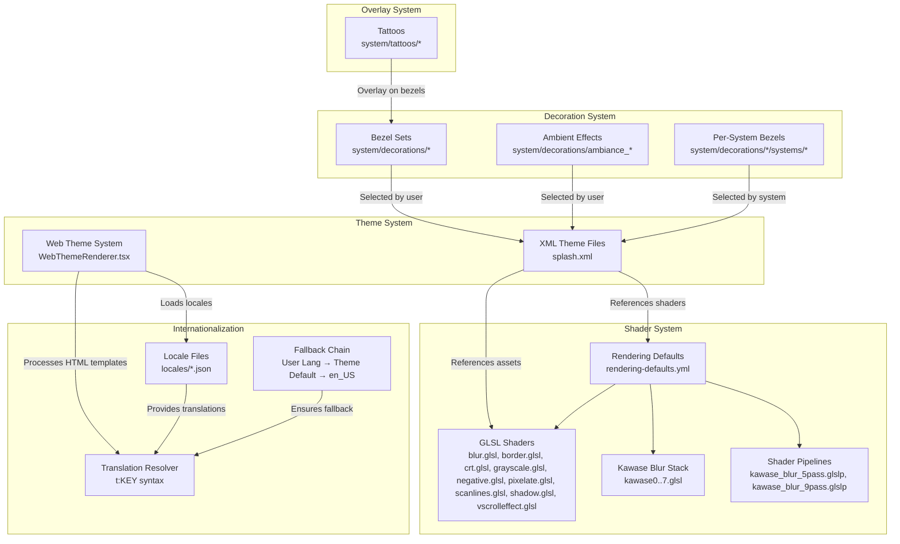
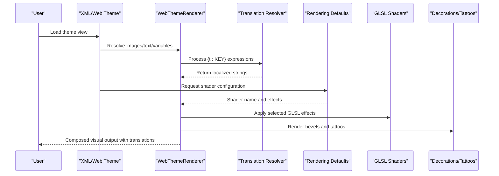
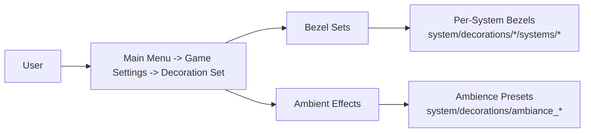
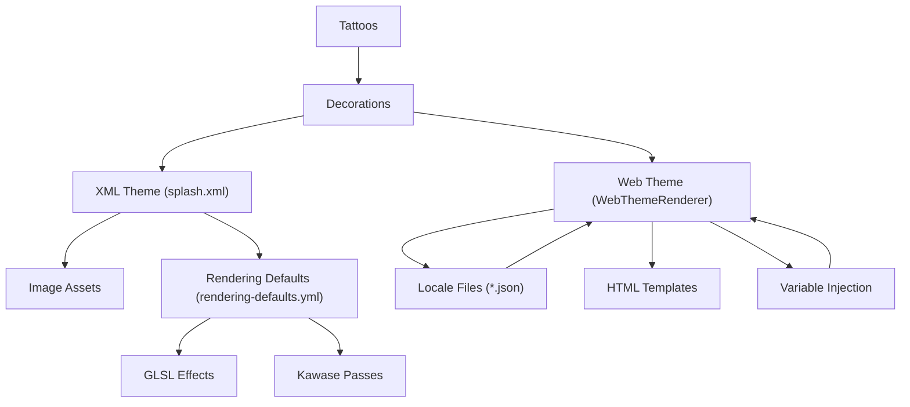

# Custom Theme and Visual Development

<cite>
**Referenced Files in This Document**
- [README.md](file://README.md)
- [splash.xml](file://emulationstation/resources/splash.xml)
- [rendering-defaults.yml](file://system/shaders/configs/[riescade]/rendering-defaults.yml)
- [README.md](file://system/decorations/README.md)
- [README.md](file://system/tattoos/README.md)
- [blur.glsl](file://emulationstation/resources/shaders/blur.glsl)
- [border.glsl](file://emulationstation/resources/shaders/border.glsl)
- [crt.glsl](file://emulationstation/resources/shaders/crt.glsl)
- [grayscale.glsl](file://emulationstation/resources/shaders/grayscale.glsl)
- [negative.glsl](file://emulationstation/resources/shaders/negative.glsl)
- [pixelate.glsl](file://emulationstation/resources/shaders/pixelate.glsl)
- [scanlines.glsl](file://emulationstation/resources/shaders/scanlines.glsl)
- [shadow.glsl](file://emulationstation/resources/shaders/shadow.glsl)
- [vscrolleffect.glsl](file://emulationstation/resources/shaders/vscrolleffect.glsl)
- [kawase0.glsl](file://emulationstation/resources/shaders/kawase/kawase0.glsl)
- [kawase1.glsl](file://emulationstation/resources/shaders/kawase/kawase1.glsl)
- [kawase2.glsl](file://emulationstation/resources/shaders/kawase/kawase2.glsl)
- [kawase3.glsl](file://emulationstation/resources/shaders/kawase/kawase3.glsl)
- [kawase4.glsl](file://emulationstation/resources/shaders/kawase/kawase4.glsl)
- [kawase5.glsl](file://emulationstation/resources/shaders/kawase/kawase5.glsl)
- [kawase6.glsl](file://emulationstation/resources/shaders/kawase/kawase6.glsl)
- [kawase7.glsl](file://emulationstation/resources/shaders/kawase/kawase7.glsl)
- [kawase_blur_5pass.glslp](file://emulationstation/resources/shaders/kawase_blur_5pass.glslp)
- [kawase_blur_9pass.glslp](file://emulationstation/resources/shaders/kawase_blur_9pass.glslp)
- [WebThemeRenderer.tsx](file://emulationstation/.riescade/src/src/renderer/src/components/theme/WebThemeRenderer.tsx)
- [ThemeService.ts](file://emulationstation/.riescade/src/src/main/services/ThemeService.ts)
- [Menu.tsx](file://emulationstation/.riescade/src/src/renderer/src/components/Menu.tsx)
- [THEME.md](file://emulationstation/.riescade/src/docs/THEME.md)
- [translate.py](file://emulationstation/.riescade/src/scratch/translate.py)
- [LangParser.cpp](file://emulationstation/.riescade/src/docs/es_src/LangParser.cpp)
- [GuiMenu.cpp](file://emulationstation/.riescade/src/docs/es_src/guis/GuiMenu.cpp)
</cite>

## Update Summary
**Changes Made**
- Added comprehensive internationalization documentation for theme authors
- Updated WebThemeRenderer.tsx with translation resolver for 't:' prefix expressions
- Enhanced HTML templates with {t:KEY} syntax for localized strings
- Added detailed coverage of locale file setup, translation syntax usage, fallback mechanisms, and supported language coverage
- Integrated translation service with theme loading and locale management

## Table of Contents
1. [Introduction](#introduction)
2. [Project Structure](#project-structure)
3. [Core Components](#core-components)
4. [Architecture Overview](#architecture-overview)
5. [Detailed Component Analysis](#detailed-component-analysis)
6. [Internationalization System](#internationalization-system)
7. [Dependency Analysis](#dependency-analysis)
8. [Performance Considerations](#performance-considerations)
9. [Troubleshooting Guide](#troubleshooting-guide)
10. [Conclusion](#conclusion)
11. [Appendices](#appendices)

## Introduction
This document explains how to develop custom themes and visuals for RIESCADE_SYSTEM. It covers the XML-based theme definition system, shader configurations, visual asset management, the decoration system for bezels and ambient effects, the tattoo overlay system, and the comprehensive internationalization system for multi-language support. It also provides practical workflows for creating, modifying, and distributing themes and shaders, along with performance guidance and compatibility considerations across display configurations.

## Project Structure
RIESCADE_SYSTEM organizes visual assets and configurations across several directories:
- Themes and splash screens: defined via XML theme files under the emulationstation resources.
- Shader effects: GLSL shader files and shader pipeline configurations under the emulationstation shaders and system shader configs.
- Decorations: Bezels and ambient effects organized per-system under system decorations.
- Tattoos: Controller overlay tattoos integrated with bezels.
- Internationalization: Translation system with locale files and fallback mechanisms.



**Diagram sources**
- [splash.xml:1-53](file://emulationstation/resources/splash.xml#L1-L53)
- [WebThemeRenderer.tsx:195-200](file://emulationstation/.riescade/src/src/renderer/src/components/theme/WebThemeRenderer.tsx#L195-L200)
- [rendering-defaults.yml:1-7](file://system/shaders/configs/[riescade]/rendering-defaults.yml#L1-L7)
- [blur.glsl](file://emulationstation/resources/shaders/blur.glsl)
- [border.glsl](file://emulationstation/resources/shaders/border.glsl)
- [crt.glsl](file://emulationstation/resources/shaders/crt.glsl)
- [grayscale.glsl](file://emulationstation/resources/shaders/grayscale.glsl)
- [negative.glsl](file://emulationstation/resources/shaders/negative.glsl)
- [pixelate.glsl](file://emulationstation/resources/shaders/pixelate.glsl)
- [scanlines.glsl](file://emulationstation/resources/shaders/scanlines.glsl)
- [shadow.glsl](file://emulationstation/resources/shaders/shadow.glsl)
- [vscrolleffect.glsl](file://emulationstation/resources/shaders/vscrolleffect.glsl)
- [kawase0.glsl](file://emulationstation/resources/shaders/kawase/kawase0.glsl)
- [kawase1.glsl](file://emulationstation/resources/shaders/kawase/kawase1.glsl)
- [kawase2.glsl](file://emulationstation/resources/shaders/kawase/kawase2.glsl)
- [kawase3.glsl](file://emulationstation/resources/shaders/kawase/kawase3.glsl)
- [kawase4.glsl](file://emulationstation/resources/shaders/kawase/kawase4.glsl)
- [kawase5.glsl](file://emulationstation/resources/shaders/kawase/kawase5.glsl)
- [kawase6.glsl](file://emulationstation/resources/shaders/kawase/kawase6.glsl)
- [kawase7.glsl](file://emulationstation/resources/shaders/kawase/kawase7.glsl)
- [kawase_blur_5pass.glslp](file://emulationstation/resources/shaders/kawase_blur_5pass.glslp)
- [kawase_blur_9pass.glslp](file://emulationstation/resources/shaders/kawase_blur_9pass.glslp)

**Section sources**
- [README.md:1-44](file://README.md#L1-L44)

## Core Components
- XML Theme System: Defines views, images, text, and visual layers for splash screens and UI. Variables enable color and gradient customization.
- Web Theme System: Modern React-based theme engine with HTML/CSS/SCSS templating and dynamic variable injection.
- Shader System: Provides individual GLSL effects and configurable shader pipelines. Rendering defaults bind shaders and effects to systems.
- Decoration System: Offers bezel sets and ambient effects selectable by the user and system-specific fallbacks.
- Tattoo System: Overlay tattoos rendered atop bezels for controller visualization.
- Internationalization System: Comprehensive translation framework supporting multiple languages with fallback chains.

Key implementation references:
- Theme definition and variable usage: [splash.xml:1-53](file://emulationstation/resources/splash.xml#L1-L53)
- Web theme renderer with translation support: [WebThemeRenderer.tsx:195-200](file://emulationstation/.riescade/src/src/renderer/src/components/theme/WebThemeRenderer.tsx#L195-L200)
- Shader pipeline configuration: [rendering-defaults.yml:1-7](file://system/shaders/configs/[riescade]/rendering-defaults.yml#L1-L7)
- Locale file management: [ThemeService.ts:122-139](file://emulationstation/.riescade/src/src/main/services/ThemeService.ts#L122-L139)
- Decorations selection guide: [README.md:1-10](file://system/decorations/README.md#L1-L10)
- Tattoos selection guide: [README.md:1-7](file://system/tattoos/README.md#L1-L7)

**Section sources**
- [splash.xml:1-53](file://emulationstation/resources/splash.xml#L1-L53)
- [WebThemeRenderer.tsx:195-200](file://emulationstation/.riescade/src/src/renderer/src/components/theme/WebThemeRenderer.tsx#L195-L200)
- [rendering-defaults.yml:1-7](file://system/shaders/configs/[riescade]/rendering-defaults.yml#L1-L7)
- [ThemeService.ts:122-139](file://emulationstation/.riescade/src/src/main/services/ThemeService.ts#L122-L139)
- [README.md:1-10](file://system/decorations/README.md#L1-L10)
- [README.md:1-7](file://system/tattoos/README.md#L1-L7)

## Architecture Overview
The visual stack integrates theme XML, web theme system, shader configurations, and assets to render themed UI and effects with full internationalization support.



**Diagram sources**
- [splash.xml:1-53](file://emulationstation/resources/splash.xml#L1-L53)
- [WebThemeRenderer.tsx:195-200](file://emulationstation/.riescade/src/src/renderer/src/components/theme/WebThemeRenderer.tsx#L195-L200)
- [rendering-defaults.yml:1-7](file://system/shaders/configs/[riescade]/rendering-defaults.yml#L1-L7)

## Detailed Component Analysis

### XML Theme System
The XML theme system defines views, image layers, gradients, and text with variables for dynamic theming. It supports tiling, positioning, origins, and zIndex stacking for compositing.

Implementation highlights:
- Variables for colors and gradients enable consistent theming across assets.
- Image layers support tiling, sizing, and color gradients.
- Text elements support alignment, glow, and font configuration.
- The splash theme demonstrates layered composition with background, logo, progress bar, and label.

Example references:
- Variable definitions and gradient usage: [splash.xml:4-17](file://emulationstation/resources/splash.xml#L4-L17)
- Background image and logo placement: [splash.xml:18-26](file://emulationstation/resources/splash.xml#L18-L26)
- Progress bar and active progress styling: [splash.xml:27-42](file://emulationstation/resources/splash.xml#L27-L42)
- Text styling and glow: [splash.xml:43-50](file://emulationstation/resources/splash.xml#L43-L50)

**Section sources**
- [splash.xml:1-53](file://emulationstation/resources/splash.xml#L1-L53)

### Web Theme System
The modern web theme system provides HTML/CSS/SCSS templating with dynamic variable injection and translation support. It processes HTML templates, resolves expressions, and renders React components.

Key features:
- HTML template processing with variable injection
- Translation resolver for {t:KEY} syntax
- Expression evaluation with ternary operators and comparisons
- Dynamic CSS resolution and caching
- Custom HTML elements integration

Example references:
- Translation resolver implementation: [WebThemeRenderer.tsx:195-200](file://emulationstation/.riescade/src/src/renderer/src/components/theme/WebThemeRenderer.tsx#L195-L200)
- Variable injection system: [WebThemeRenderer.tsx:108-136](file://emulationstation/.riescade/src/src/renderer/src/components/theme/WebThemeRenderer.tsx#L108-L136)
- Expression processing: [WebThemeRenderer.tsx:138-193](file://emulationstation/.riescade/src/src/renderer/src/components/theme/WebThemeRenderer.tsx#L138-L193)

**Section sources**
- [WebThemeRenderer.tsx:195-200](file://emulationstation/.riescade/src/src/renderer/src/components/theme/WebThemeRenderer.tsx#L195-L200)
- [WebThemeRenderer.tsx:108-136](file://emulationstation/.riescade/src/src/renderer/src/components/theme/WebThemeRenderer.tsx#L108-L136)
- [WebThemeRenderer.tsx:138-193](file://emulationstation/.riescade/src/src/renderer/src/components/theme/WebThemeRenderer.tsx#L138-L193)

### Shader System
The shader system comprises individual GLSL effects and configurable shader pipelines. Rendering defaults bind shader names and toggles to systems.

Effects overview:
- Basic effects: blur, border, grayscale, negative, pixelate, scanlines, shadow, CRT simulation, vertical scroll effect.
- Kawase blur stack: modular pass shaders (kawase0..7) and pipeline configurations (5-pass and 9-pass).

Pipeline configuration:
- Rendering defaults specify shader names and toggles for scanlines and similar effects.

Example references:
- Individual effects: [blur.glsl](file://emulationstation/resources/shaders/blur.glsl), [border.glsl](file://emulationstation/resources/shaders/border.glsl), [crt.glsl](file://emulationstation/resources/shaders/crt.glsl), [grayscale.glsl](file://emulationstation/resources/shaders/grayscale.glsl), [negative.glsl](file://emulationstation/resources/shaders/negative.glsl), [pixelate.glsl](file://emulationstation/resources/shaders/pixelate.glsl), [scanlines.glsl](file://emulationstation/resources/shaders/scanlines.glsl), [shadow.glsl](file://emulationstation/resources/shaders/shadow.glsl), [vscrolleffect.glsl](file://emulationstation/resources/shaders/vscrolleffect.glsl)
- Kawase blur passes: [kawase0.glsl](file://emulationstation/resources/shaders/kawase/kawase0.glsl), [kawase1.glsl](file://emulationstation/resources/shaders/kawase/kawase1.glsl), [kawase2.glsl](file://emulationstation/resources/shaders/kawase/kawase2.glsl), [kawase3.glsl](file://emulationstation/resources/shaders/kawase/kawase3.glsl), [kawase4.glsl](file://emulationstation/resources/shaders/kawase/kawase4.glsl), [kawase5.glsl](file://emulationstation/resources/shaders/kawase/kawase5.glsl), [kawase6.glsl](file://emulationstation/resources/shaders/kawase/kawase6.glsl), [kawase7.glsl](file://emulationstation/resources/shaders/kawase/kawase7.glsl)
- Pipeline configurations: [kawase_blur_5pass.glslp](file://emulationstation/resources/shaders/kawase_blur_5pass.glslp), [kawase_blur_9pass.glslp](file://emulationstation/resources/shaders/kawase_blur_9pass.glslp)
- Rendering defaults binding: [rendering-defaults.yml:1-7](file://system/shaders/configs/[riescade]/rendering-defaults.yml#L1-L7)


**Diagram sources**
- [rendering-defaults.yml:1-7](file://system/shaders/configs/[riescade]/rendering-defaults.yml#L1-L7)
- [kawase0.glsl](file://emulationstation/resources/shaders/kawase/kawase0.glsl)
- [kawase_blur_5pass.glslp](file://emulationstation/resources/shaders/kawase_blur_5pass.glslp)
- [kawase_blur_9pass.glslp](file://emulationstation/resources/shaders/kawase_blur_9pass.glslp)

**Section sources**
- [rendering-defaults.yml:1-7](file://system/shaders/configs/[riescade]/rendering-defaults.yml#L1-L7)
- [blur.glsl](file://emulationstation/resources/shaders/blur.glsl)
- [border.glsl](file://emulationstation/resources/shaders/border.glsl)
- [crt.glsl](file://emulationstation/resources/shaders/crt.glsl)
- [grayscale.glsl](file://emulationstation/resources/shaders/grayscale.glsl)
- [negative.glsl](file://emulationstation/resources/shaders/negative.glsl)
- [pixelate.glsl](file://emulationstation/resources/shaders/pixelate.glsl)
- [scanlines.glsl](file://emulationstation/resources/shaders/scanlines.glsl)
- [shadow.glsl](file://emulationstation/resources/shaders/shadow.glsl)
- [vscrolleffect.glsl](file://emulationstation/resources/shaders/vscrolleffect.glsl)
- [kawase0.glsl](file://emulationstation/resources/shaders/kawase/kawase0.glsl)
- [kawase1.glsl](file://emulationstation/resources/shaders/kawase/kawase1.glsl)
- [kawase2.glsl](file://emulationstation/resources/shaders/kawase/kawase2.glsl)
- [kawase3.glsl](file://emulationstation/resources/shaders/kawase/kawase3.glsl)
- [kawase4.glsl](file://emulationstation/resources/shaders/kawase/kawase4.glsl)
- [kawase5.glsl](file://emulationstation/resources/shaders/kawase/kawase5.glsl)
- [kawase6.glsl](file://emulationstation/resources/shaders/kawase/kawase6.glsl)
- [kawase7.glsl](file://emulationstation/resources/shaders/kawase/kawase7.glsl)
- [kawase_blur_5pass.glslp](file://emulationstation/resources/shaders/kawase_blur_5pass.glslp)
- [kawase_blur_9pass.glslp](file://emulationstation/resources/shaders/kawase_blur_9pass.glslp)

### Decoration System
The decoration system provides bezel sets and ambient effects. Users select these from the main menu, and per-system fallbacks ensure coverage.

Highlights:
- Official bezel sets and ambient effects are bundled and selectable.
- Per-system bezels override global fallbacks.
- The "default_unglazed" set provides unique bezels per system.

Example references:
- Selection instructions and structure: [README.md:1-10](file://system/decorations/README.md#L1-L10)



**Diagram sources**
- [README.md:1-10](file://system/decorations/README.md#L1-L10)

**Section sources**
- [README.md:1-10](file://system/decorations/README.md#L1-L10)

### Tattoo System
Tattoos are controller button overlays that appear when bezels are enabled. They are part of the decoration ecosystem and enhance the visual feedback of input mapping.

Example references:
- Selection instructions: [README.md:1-7](file://system/tattoos/README.md#L1-L7)

**Section sources**
- [README.md:1-7](file://system/tattoos/README.md#L1-L7)

## Internationalization System

**Updated** Added comprehensive internationalization system for multi-language theme support

The internationalization system provides full multi-language support for themes through JSON locale files and a robust translation resolver.

### Locale File Management
Theme authors can create locale files in the `locales/` directory within their theme folder. Each locale file contains key-value pairs of translated strings.

Setup process:
1. Create a `locales/` folder in your theme directory
2. Add JSON files named with locale codes (e.g., `en_US.json`, `pt_BR.json`, `fr_FR.json`)
3. Define translation key-value pairs for each supported language

Example locale files:
- [locales/en_US.json:91-101](file://emulationstation/.riescade/src/docs/THEME.md#L91-L101)
- [locales/pt_BR.json:103-113](file://emulationstation/.riescade/src/docs/THEME.md#L103-L113)

### Translation Syntax
Use the `{t:KEY}` syntax anywhere in HTML templates to insert localized strings:

```html
<p>{t:EMPTY_GAMELIST}</p>
<span class="loading-text">{t:LOADING}</span>
<h1>{t:ALL_GAMES}</h1>
```

The translation resolver processes these expressions and returns the appropriate localized string based on the user's current language setting.

### Fallback Chain
When resolving a `{t:KEY}` placeholder, the engine follows this priority chain:

1. **User's current language** (e.g., `fr_FR.json` if the user selected French)
2. **Theme's defaultLocale** (defined in `theme.json`)
3. **`en_US.json`** (universal fallback)
4. **Raw key name** (e.g., `EMPTY_GAMELIST`) if no translation is found

This ensures graceful degradation when translations are missing.

### Supported Languages
The system supports 38 languages identical to the main application:

`ar`, `ca`, `cs_CZ`, `cy_GB`, `de`, `el`, `en_GB`, `en_US`, `es`, `es_ES`, `es_MX`, `eu_ES`, `fi_FI`, `fr`, `fr_FR`, `gl_ES`, `he`, `hu`, `id_ID`, `it`, `ja_JP`, `ko`, `nb_NO`, `nl`, `nn_NO`, `oc_FR`, `pl`, `pt_BR`, `pt_PT`, `ro_RO`, `ru_RU`, `sk_SK`, `sv_SE`, `tr`, `uk_UA`, `vi_VN`, `zh_CN`, `zh_TW`

### Theme Configuration
Themes can specify a default locale in their `theme.json` file:

```json
{
  "name": "My Epic Theme",
  "defaultLocale": "en_US"
}
```

### Implementation Details
The translation system is implemented in the WebThemeRenderer with the following key components:

- **Translation Resolver**: Processes `{t:KEY}` expressions using the fallback chain
- **Locale Loading**: ThemeService loads locale files from the theme directory
- **Integration**: Seamless integration with HTML template processing

**Section sources**
- [THEME.md:79-141](file://emulationstation/.riescade/src/docs/THEME.md#L79-L141)
- [WebThemeRenderer.tsx:195-200](file://emulationstation/.riescade/src/src/renderer/src/components/theme/WebThemeRenderer.tsx#L195-L200)
- [ThemeService.ts:122-139](file://emulationstation/.riescade/src/src/main/services/ThemeService.ts#L122-L139)

## Dependency Analysis
Theme XML depends on:
- Visual assets referenced by image paths.
- Shader configurations for rendering effects.
- Decoration and tattoo assets for overlays.
- Locale files for internationalization.

Web theme system depends on:
- HTML templates with variable injection.
- Translation resolver for localized strings.
- CSS/SCSS compilation for styling.
- Custom HTML elements for enhanced functionality.

Shader pipelines depend on:
- Rendering defaults for shader names and toggles.
- Individual GLSL effects and pass stacks.



**Diagram sources**
- [splash.xml:1-53](file://emulationstation/resources/splash.xml#L1-L53)
- [WebThemeRenderer.tsx:195-200](file://emulationstation/.riescade/src/src/renderer/src/components/theme/WebThemeRenderer.tsx#L195-L200)
- [rendering-defaults.yml:1-7](file://system/shaders/configs/[riescade]/rendering-defaults.yml#L1-L7)

**Section sources**
- [splash.xml:1-53](file://emulationstation/resources/splash.xml#L1-L53)
- [WebThemeRenderer.tsx:195-200](file://emulationstation/.riescade/src/src/renderer/src/components/theme/WebThemeRenderer.tsx#L195-L200)
- [rendering-defaults.yml:1-7](file://system/shaders/configs/[riescade]/rendering-defaults.yml#L1-L7)

## Performance Considerations
- Prefer single-pass effects for high refresh rates; use multi-pass pipelines judiciously.
- Limit texture sizes and tile regions to reduce memory bandwidth.
- Use scanline toggles and similar flags to balance fidelity and performance.
- Test shader pipelines across target resolutions and GPU generations.
- Minimize overlapping translucent layers to reduce blending overhead.
- Optimize translation lookups by using efficient key naming conventions.
- Cache frequently accessed locale strings to reduce lookup overhead.
- Use lazy loading for large locale files to improve startup performance.

## Troubleshooting Guide
- Theme assets not appearing:
  - Verify image paths and ensure assets are present alongside the theme XML.
  - Confirm variable substitution is correct in the theme file.
- Shader artifacts or incorrect effects:
  - Check rendering defaults for correct shader names and toggles.
  - Validate GLSL syntax and uniform usage in effect files.
- Decorations not visible:
  - Ensure the selected decoration set is enabled in the main menu.
  - Confirm per-system overrides exist or fallback bezels are acceptable.
- Tattoos not showing:
  - Tattoos appear only when bezels are enabled.
- Translation issues:
  - Verify locale files are properly formatted JSON.
  - Check that translation keys exist in the locale files.
  - Ensure the fallback chain is working correctly.
  - Confirm theme.json defaultLocale is set appropriately.

## Conclusion
RIESCADE_SYSTEM's theme and visual system combines XML-based theme definitions, modern web theme engine with internationalization support, modular GLSL effects, configurable shader pipelines, and an extensive decoration and tattoo framework. The addition of comprehensive internationalization capabilities enables theme authors to create truly global experiences. By following the workflows below, developers can create compelling, performant themes and effects tailored to diverse displays, languages, and systems.

## Appendices

### Theme Development Workflow
- Create or modify an XML theme file to define views, images, text, and variables.
- Reference local assets and ensure paths resolve correctly.
- Use variables for consistent theming across colors and gradients.
- Integrate with rendering defaults to apply shader effects.
- Implement internationalization using {t:KEY} syntax in HTML templates.
- Manage locale files with proper fallback chains.

Example references:
- Theme structure and variables: [splash.xml:1-53](file://emulationstation/resources/splash.xml#L1-L53)
- Translation implementation: [WebThemeRenderer.tsx:195-200](file://emulationstation/.riescade/src/src/renderer/src/components/theme/WebThemeRenderer.tsx#L195-L200)

**Section sources**
- [splash.xml:1-53](file://emulationstation/resources/splash.xml#L1-L53)
- [WebThemeRenderer.tsx:195-200](file://emulationstation/.riescade/src/src/renderer/src/components/theme/WebThemeRenderer.tsx#L195-L200)

### Web Theme Development Workflow
- Implement HTML templates with variable injection and translation support.
- Use the WebThemeRenderer for processing and rendering.
- Leverage custom HTML elements for enhanced functionality.
- Manage CSS/SCSS compilation and hot reloading.
- Test internationalization across different languages and locales.

Example references:
- Template processing: [WebThemeRenderer.tsx:108-136](file://emulationstation/.riescade/src/src/renderer/src/components/theme/WebThemeRenderer.tsx#L108-L136)
- Expression evaluation: [WebThemeRenderer.tsx:138-193](file://emulationstation/.riescade/src/src/renderer/src/components/theme/WebThemeRenderer.tsx#L138-L193)
- Custom elements: [WebThemeRenderer.tsx:403-429](file://emulationstation/.riescade/src/src/renderer/src/components/theme/WebThemeRenderer.tsx#L403-L429)

**Section sources**
- [WebThemeRenderer.tsx:108-136](file://emulationstation/.riescade/src/src/renderer/src/components/theme/WebThemeRenderer.tsx#L108-L136)
- [WebThemeRenderer.tsx:138-193](file://emulationstation/.riescade/src/src/renderer/src/components/theme/WebThemeRenderer.tsx#L138-L193)
- [WebThemeRenderer.tsx:403-429](file://emulationstation/.riescade/src/src/renderer/src/components/theme/WebThemeRenderer.tsx#L403-L429)

### Shader Development Workflow
- Implement GLSL effects as standalone shaders or pass stages.
- Use pipeline configurations to chain passes (e.g., Kawase blur).
- Bind shader names and toggles via rendering defaults for system integration.
- Profile performance across resolutions and hardware.

Example references:
- Individual effects: [blur.glsl](file://emulationstation/resources/shaders/blur.glsl), [scanlines.glsl](file://emulationstation/resources/shaders/scanlines.glsl), [crt.glsl](file://emulationstation/resources/shaders/crt.glsl)
- Pass stack and pipeline: [kawase0.glsl](file://emulationstation/resources/shaders/kawase/kawase0.glsl), [kawase_blur_5pass.glslp](file://emulationstation/resources/shaders/kawase_blur_5pass.glslp)
- Binding configuration: [rendering-defaults.yml:1-7](file://system/shaders/configs/[riescade]/rendering-defaults.yml#L1-L7)

**Section sources**
- [blur.glsl](file://emulationstation/resources/shaders/blur.glsl)
- [scanlines.glsl](file://emulationstation/resources/shaders/scanlines.glsl)
- [crt.glsl](file://emulationstation/resources/shaders/crt.glsl)
- [kawase0.glsl](file://emulationstation/resources/shaders/kawase/kawase0.glsl)
- [kawase_blur_5pass.glslp](file://emulationstation/resources/shaders/kawase_blur_5pass.glslp)
- [rendering-defaults.yml:1-7](file://system/shaders/configs/[riescade]/rendering-defaults.yml#L1-L7)

### Internationalization Workflow
- Create locale files in the `locales/` directory with proper JSON formatting.
- Use {t:KEY} syntax in HTML templates for all user-facing strings.
- Implement fallback chains using theme.json defaultLocale.
- Test translations across all supported languages.
- Use the translation resolver for dynamic content generation.

Example references:
- Locale file setup: [THEME.md:83-87](file://emulationstation/.riescade/src/docs/THEME.md#L83-L87)
- Translation syntax: [THEME.md:117-123](file://emulationstation/.riescade/src/docs/THEME.md#L117-L123)
- Fallback mechanism: [THEME.md:127-132](file://emulationstation/.riescade/src/docs/THEME.md#L127-L132)
- Supported languages: [THEME.md:136-138](file://emulationstation/.riescade/src/docs/THEME.md#L136-L138)

**Section sources**
- [THEME.md:83-87](file://emulationstation/.riescade/src/docs/THEME.md#L83-L87)
- [THEME.md:117-123](file://emulationstation/.riescade/src/docs/THEME.md#L117-L123)
- [THEME.md:127-132](file://emulationstation/.riescade/src/docs/THEME.md#L127-L132)
- [THEME.md:136-138](file://emulationstation/.riescade/src/docs/THEME.md#L136-L138)

### Decoration and Tattoo Integration
- Place per-system bezels under the appropriate system folders.
- Use the README guidelines to maintain fallbacks and naming conventions.
- Enable tattoos when bezels are active for controller feedback.

Example references:
- Decoration selection and structure: [README.md:1-10](file://system/decorations/README.md#L1-L10)
- Tattoo selection and behavior: [README.md:1-7](file://system/tattoos/README.md#L1-L7)

**Section sources**
- [README.md:1-10](file://system/decorations/README.md#L1-L10)
- [README.md:1-7](file://system/tattoos/README.md#L1-L7)