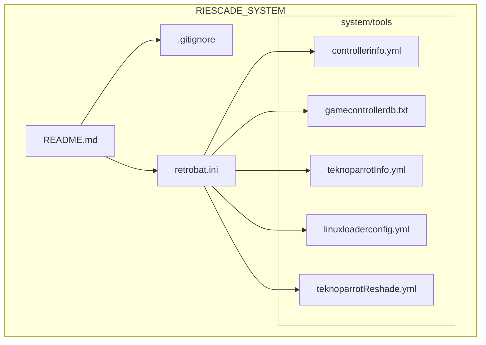
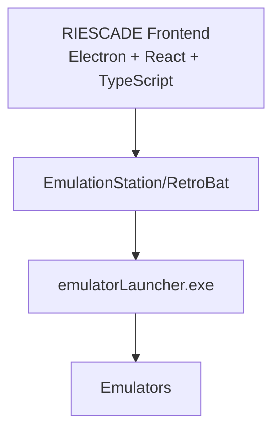
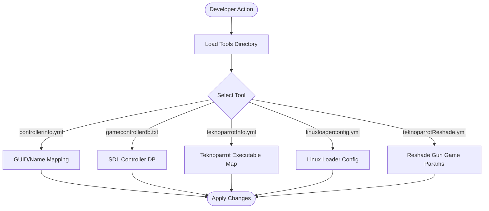
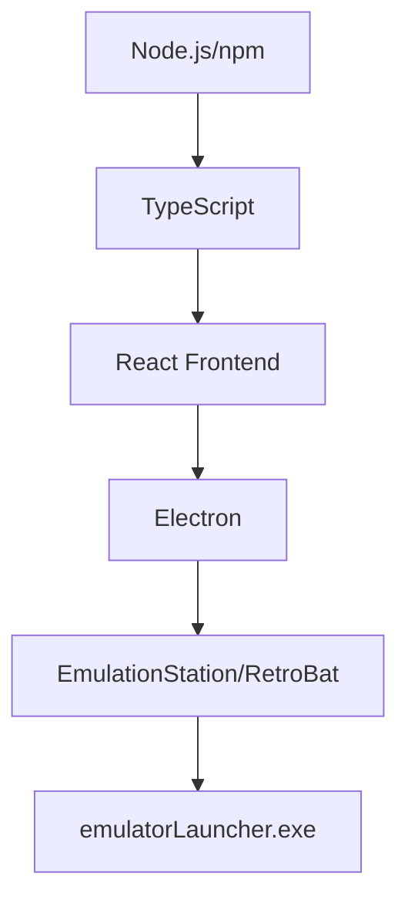

# Development Environment Setup

<cite>
**Referenced Files in This Document**
- [README.md](file://README.md)
- [.gitignore](file://.gitignore)
- [retrobat.ini](file://retrobat.ini)
- [system/tools/controllerinfo.yml](file://system/tools/controllerinfo.yml)
- [system/tools/gamecontrollerdb.txt](file://system/tools/gamecontrollerdb.txt)
- [system/tools/teknoparrotInfo.yml](file://system/tools/teknoparrotInfo.yml)
- [system/tools/linuxloaderconfig.yml](file://system/tools/linuxloaderconfig.yml)
- [system/tools/teknoparrotReshade.yml](file://system/tools/teknoparrotReshade.yml)
</cite>

## Table of Contents
1. [Introduction](#introduction)
2. [Project Structure](#project-structure)
3. [Core Components](#core-components)
4. [Architecture Overview](#architecture-overview)
5. [Detailed Component Analysis](#detailed-component-analysis)
6. [Dependency Analysis](#dependency-analysis)
7. [Performance Considerations](#performance-considerations)
8. [Troubleshooting Guide](#troubleshooting-guide)
9. [Conclusion](#conclusion)
10. [Appendices](#appendices)

## Introduction
This document provides a comprehensive guide to set up a development environment for contributors to RIESCADE_SYSTEM. It covers required tools, project dependencies, build system expectations, IDE recommendations, and the development workflow. It also documents the tools directory contents relevant to development, including controller mapping and Teknoparrot configuration files.

RIESCADE_SYSTEM is a modern frontend for EmulationStation/RetroBat built with Electron, React, and TypeScript. The project emphasizes compatibility with RetroBat/ES configuration and gamelists, and integrates with emulatorLauncher.exe.

## Project Structure
RIESCADE_SYSTEM follows a modular structure with Electron main/renderer separation and shared utilities. The repository includes:
- Electron main process, renderer UI, shared types, and preload bridge
- System tools for controller mapping, Teknoparrot configuration, and related utilities
- Templates and configuration files for various emulators
- RetroBat configuration and global settings

**Diagram sources**
- [README.md:1-44](file://README.md#L1-L44)
- [.gitignore:1-41](file://.gitignore#L1-L41)
- [retrobat.ini:1-94](file://retrobat.ini#L1-L94)
- [system/tools/controllerinfo.yml:1-119](file://system/tools/controllerinfo.yml#L1-L119)
- [system/tools/gamecontrollerdb.txt:1-364](file://system/tools/gamecontrollerdb.txt#L1-L364)
- [system/tools/teknoparrotInfo.yml:1-28](file://system/tools/teknoparrotInfo.yml#L1-L28)
- [system/tools/linuxloaderconfig.yml:1-116](file://system/tools/linuxloaderconfig.yml#L1-L116)
- [system/tools/teknoparrotReshade.yml:1-215](file://system/tools/teknoparrotReshade.yml#L1-L215)

**Section sources**
- [README.md:34-44](file://README.md#L34-L44)

## Core Components
- Electron main/renderer architecture with TypeScript and React
- Shared utilities and preload bridge for IPC
- System tools for controller mapping and emulator integration
- RetroBat configuration and global settings

Key development commands:
- Install dependencies using npm via Command Prompt
- Run in development mode
- Build for production deployment

**Section sources**
- [README.md:12-32](file://README.md#L12-L32)

## Architecture Overview
RIESCADE_SYSTEM integrates with EmulationStation/RetroBat and emulatorLauncher.exe. The frontend is designed to be placed under the EmulationStation folder of a RetroBat installation and resolves paths relative to its location.

**Diagram sources**
- [README.md:36-44](file://README.md#L36-L44)

**Section sources**
- [README.md:36-44](file://README.md#L36-L44)

## Detailed Component Analysis

### Development Tools and Prerequisites
- Node.js and npm: Required to manage dependencies and run the development server.
- TypeScript: Used for type-safe development in both main and renderer processes.
- Electron: Provides the desktop application framework.
- IDE: Visual Studio Code recommended for its excellent TypeScript and Electron tooling support.

Verification steps:
- Confirm Node.js and npm are installed and accessible from Command Prompt.
- Verify TypeScript compiler availability.
- Ensure Electron is available for development builds.

**Section sources**
- [README.md:12-32](file://README.md#L12-L32)

### Project Dependencies and Build System
Dependencies are managed via npm. The repository includes a .gitignore that excludes node_modules and build artifacts, ensuring clean development and CI/CD workflows.

Recommended actions:
- Use Command Prompt to install dependencies as advised in the repository.
- Keep dependencies updated regularly.
- Respect build artifact exclusions in .gitignore.

**Section sources**
- [README.md:14-20](file://README.md#L14-L20)
- [.gitignore:1-41](file://.gitignore#L1-L41)

### IDE Configuration Recommendations
- Use Visual Studio Code for its strong TypeScript and Electron debugging capabilities.
- Enable ESLint and Prettier integrations for consistent code quality.
- Configure launch configurations for Electron main and renderer processes if needed.

[No sources needed since this section provides general guidance]

### Development Workflow
Step-by-step instructions:
1. Clone the repository to your local machine.
2. Open Command Prompt in the repository root.
3. Install dependencies using the npm install command.
4. Start the development server using the npm run dev command.
5. Build for production using the npm run deploy command.

Notes:
- PowerShell execution policies may restrict script execution; use Command Prompt for dependency installation.
- The project expects to be placed under the EmulationStation folder of a RetroBat installation for runtime compatibility.

**Section sources**
- [README.md:12-32](file://README.md#L12-L32)

### Tools Directory Contents for Development
The tools directory contains several YAML and text files used for controller mapping, emulator-specific configurations, and Teknoparrot setups. These are essential for development and testing across different emulators and hardware.

- controllerinfo.yml
  - Purpose: Provides GUID/name replacements for specific emulators to ensure correct controller mapping.
  - Typical usage: Map RetroBat controller GUIDs to emulator-specific identifiers.
  - Example keys: GUID containers, emulator-specific GUID/name overrides.

- gamecontrollerdb.txt
  - Purpose: SDL-based controller database for Windows, extended for wheels and light guns.
  - Typical usage: Ensure accurate input mapping for racing wheels, flight sticks, and gun peripherals.

- teknoparrotInfo.yml
  - Purpose: Maps game names to their executables for Teknoparrot integration.
  - Typical usage: Define executable paths per game to streamline launching.

- linuxloaderconfig.yml
  - Purpose: Defines launcher paths for Linux-based loader configurations.
  - Typical usage: Configure loader paths for specific arcade games.

- teknoparrotReshade.yml
  - Purpose: Sets Reshade parameters for Teknoparrot to enable Sinden Border for gun games.
  - Typical usage: Configure platform and render type per executable.

**Diagram sources**
- [system/tools/controllerinfo.yml:1-119](file://system/tools/controllerinfo.yml#L1-L119)
- [system/tools/gamecontrollerdb.txt:1-364](file://system/tools/gamecontrollerdb.txt#L1-L364)
- [system/tools/teknoparrotInfo.yml:1-28](file://system/tools/teknoparrotInfo.yml#L1-L28)
- [system/tools/linuxloaderconfig.yml:1-116](file://system/tools/linuxloaderconfig.yml#L1-L116)
- [system/tools/teknoparrotReshade.yml:1-215](file://system/tools/teknoparrotReshade.yml#L1-L215)

**Section sources**
- [system/tools/controllerinfo.yml:1-119](file://system/tools/controllerinfo.yml#L1-L119)
- [system/tools/gamecontrollerdb.txt:1-364](file://system/tools/gamecontrollerdb.txt#L1-L364)
- [system/tools/teknoparrotInfo.yml:1-28](file://system/tools/teknoparrotInfo.yml#L1-L28)
- [system/tools/linuxloaderconfig.yml:1-116](file://system/tools/linuxloaderconfig.yml#L1-L116)
- [system/tools/teknoparrotReshade.yml:1-215](file://system/tools/teknoparrotReshade.yml#L1-L215)

### Windows-Specific Setup Notes
- Place the application under the EmulationStation folder of your RetroBat installation to leverage relative path resolution for ROMs and configurations.
- RetroBat configuration is managed via retrobat.ini, which controls language detection, autostart, splash screen, fullscreen behavior, and other interface modes.

**Section sources**
- [README.md:41-44](file://README.md#L41-L44)
- [retrobat.ini:1-94](file://retrobat.ini#L1-L94)

## Dependency Analysis
RIESCADE_SYSTEM relies on:
- Electron for desktop application framework
- React and TypeScript for the UI layer
- npm for dependency management
- RetroBat/EmulationStation for runtime integration

**Diagram sources**
- [README.md:3-11](file://README.md#L3-L11)
- [README.md:36-44](file://README.md#L36-L44)

**Section sources**
- [README.md:3-11](file://README.md#L3-L11)
- [README.md:36-44](file://README.md#L36-L44)

## Performance Considerations
- Keep dependencies updated to benefit from performance improvements and bug fixes.
- Use production builds for performance-sensitive scenarios.
- Monitor build artifacts and avoid committing unnecessary files to maintain repository health.

[No sources needed since this section provides general guidance]

## Troubleshooting Guide
Common setup issues and resolutions:
- PowerShell execution policy restrictions:
  - Use Command Prompt for npm install and other npm commands as advised in the repository.
- Dependency installation failures:
  - Ensure Node.js and npm are installed and accessible.
  - Clear npm cache if persistent errors occur.
- Build artifacts and IDE clutter:
  - Respect .gitignore exclusions for node_modules, dist, out, and IDE folders.
- Path resolution in RetroBat:
  - Place the application under the EmulationStation folder of your RetroBat installation to ensure proper relative path resolution.

Verification steps:
- Confirm npm install completes without errors.
- Verify development server launches with npm run dev.
- Check that emulatorLauncher.exe is accessible and configured in RetroBat.

**Section sources**
- [README.md:14-26](file://README.md#L14-L26)
- [.gitignore:1-41](file://.gitignore#L1-L41)

## Conclusion
RIESCADE_SYSTEM provides a modern, Electron-based frontend for EmulationStation/RetroBat with strong TypeScript and React support. Contributors should focus on Node.js/npm tooling, Electron development, and leveraging the tools directory for controller and emulator integration. Following the documented workflow and troubleshooting steps ensures a smooth development experience.

[No sources needed since this section summarizes without analyzing specific files]

## Appendices

### Appendix A: Quick Reference Commands
- Install dependencies: cmd /c npm install
- Run in development: cmd /c npm run dev
- Deploy for production: cmd /c npm run deploy

**Section sources**
- [README.md:14-32](file://README.md#L14-L32)