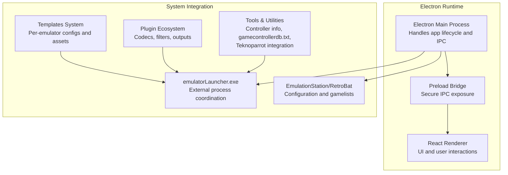
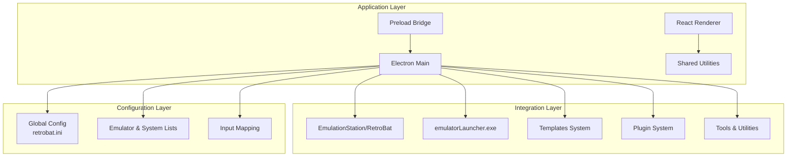

# Development Guide

<cite>
**Referenced Files in This Document**
- [README.md](file://README.md)
- [retrobat.ini](file://retrobat.ini)
- [emulators_names.lst](file://system/configgen/emulators_names.lst)
- [systems_names.lst](file://system/configgen/systems_names.lst)
- [templates_files.lst](file://system/configgen/templates_files.lst)
- [controllerinfo.yml](file://system/tools/controllerinfo.yml)
- [gamecontrollerdb.txt](file://system/tools/gamecontrollerdb.txt)
- [teknoparrotInfo.yml](file://system/tools/teknoparrotInfo.yml)
- [controller_hotkeys.yml](file://system/resources/inputmapping/controller_hotkeys.yml)
- [teknoparrot.yml](file://system/resources/inputmapping/teknoparrot.yml)
- [xenia.menu](file://system/es_menu/xenia.menu)
- [xenia-canary.menu](file://system/es_menu/xenia-canary.menu)
- [xenia-edge.menu](file://system/es_menu/xenia-edge.menu)
- [xroar.menu](file://system/es_menu/xroar.menu)
- [tekno_menu](file://system/es_menu/teknoparrot.menu)
- [retroarch.menu](file://system/es_menu/retroarch.menu)
- [emulationstation.menu](file://system/es_menu/emulationstation.menu)
- [version.info](file://system/version.info)
- [version.info](file://emulationstation/version.info)
</cite>

## Table of Contents
1. [Introduction](#introduction)
2. [Project Structure](#project-structure)
3. [Core Components](#core-components)
4. [Architecture Overview](#architecture-overview)
5. [Detailed Component Analysis](#detailed-component-analysis)
6. [Dependency Analysis](#dependency-analysis)
7. [Performance Considerations](#performance-considerations)
8. [Troubleshooting Guide](#troubleshooting-guide)
9. [Conclusion](#conclusion)
10. [Appendices](#appendices)

## Introduction
RIESCADE_SYSTEM is a modern, feature-rich frontend for EmulationStation/RetroBat built with Electron, React, and TypeScript. It emphasizes compatibility with RetroBat/ES configuration and gamelists, high-performance UI with smooth animations, SQLite-ready architecture for fast game indexing, and seamless integration with emulatorLauncher.exe. The project is organized around a clear separation of concerns with dedicated areas for the Electron main process, React renderer, shared utilities, and preload bridge.

Key development goals:
- Maintain compatibility with upstream EmulationStation/RetroBat changes
- Provide extensibility via plugins and templates
- Support advanced input mapping and controller configuration
- Offer robust tooling for emulator integration and theming

## Project Structure
The repository follows a modular layout optimized for contributor workflows and system integration:

- Root-level documentation and configuration files
- emulationstation: Core EmulationStation/RetroBat integration, themes, scripts, and resources
- system: Centralized configuration generation, templates, tools, and system-specific assets
- user: User-customizable content such as tattoos and input mapping overrides
- library, sounds, decorations: Optional assets and enhancements

Development environment highlights:
- Electron main process logic resides under emulationstation/.riescade/src (as referenced in the project structure)
- React frontend components are located under emulationstation/.riescade/src (as referenced in the project structure)
- Shared utilities and types are under emulationstation/.riescade/src (as referenced in the project structure)
- Preload scripts bridge the Electron main and renderer processes

Build and deployment:
- Development: npm run dev
- Production: npm run deploy
- Dependencies are installed via npm install

Relative path resolution:
- The application expects to be placed in the /emulationstation folder of a RetroBat installation and resolves paths relative to its location to locate ROMs and configurations.

**Section sources**
- [README.md:12-44](file://README.md#L12-L44)

## Core Components
RIESCADE_SYSTEM’s core components enable a cohesive development and runtime experience:

- Electron Main Process: Orchestrates application lifecycle, manages IPC, and coordinates with emulatorLauncher.exe
- React Renderer: Provides the UI layer with state management and component composition
- Shared Utilities: Defines common types, constants, and helpers used across main and renderer
- Preload Bridge: Exposes secure IPC channels to the renderer while maintaining isolation

Plugin and template systems:
- Plugins: Modular extensions for codecs, filters, outputs, and platform-specific features
- Templates: System-specific configuration files and assets deployed into emulator directories
- Tools: Utilities for controller information, gamecontrollerdb.txt management, and Teknoparrot integration

**Section sources**
- [README.md:34-44](file://README.md#L34-L44)

## Architecture Overview
The system architecture integrates Electron, React, and RetroBat/ES ecosystems:

**Diagram sources**
- [README.md:34-44](file://README.md#L34-L44)

## Detailed Component Analysis

### Development Environment Setup
- Prerequisites: Node.js/npm and a compatible Windows environment
- Installation: Use cmd to run npm install due to PowerShell execution policy restrictions
- Development server: npm run dev launches the Electron app with hot reload
- Production build: npm run deploy packages the application for distribution

Path assumptions:
- Place the application in the /emulationstation folder of your RetroBat installation
- The app resolves relative paths to locate ROMs and configurations automatically

**Section sources**
- [README.md:12-32](file://README.md#L12-L32)
- [README.md:41-44](file://README.md#L41-L44)

### Build Processes and Deployment
- Development workflow: npm run dev enables live reloading and debugging
- Production packaging: npm run deploy prepares artifacts for distribution
- Versioning: version.info files in both system and emulationstation directories track build metadata

Release procedure:
- Verify compatibility with RetroBat/ES configurations
- Update version.info with release details
- Package and distribute via npm run deploy

**Section sources**
- [README.md:22-32](file://README.md#L22-L32)
- [version.info](file://system/version.info)
- [version.info](file://emulationstation/version.info)

### Plugin Development System
RIESCADE_SYSTEM supports a flexible plugin ecosystem for extending functionality:

- Plugin categories:
  - Access: Filesystem and resource access controls
  - Audio Output: Audio pipeline extensions
  - Codec: Media decoding capabilities
  - D3D11: DirectX 11 rendering hooks
  - Demux: Media demultiplexing
  - Video Chroma: Color correction and chroma keying
  - Video Filter: Image post-processing filters
  - Video Output: Rendering pipeline extensions

- Adding a new plugin:
  - Create a new directory under emulationstation/plugins/<category>
  - Implement the required interfaces and export plugin metadata
  - Register the plugin with the system loader during initialization
  - Ensure compatibility with upstream EmulationStation/RetroBat changes

- Maintaining compatibility:
  - Monitor upstream changes to plugin APIs
  - Update plugin signatures and dependencies accordingly
  - Test against multiple RetroBat/ES versions

**Section sources**
- [README.md:34-39](file://README.md#L34-L39)

### Template Modification and System Integration
Template management centralizes per-emulator configuration deployment:

- Template catalog:
  - Located under system/templates with subfolders for each emulator
  - Includes configuration files, assets, and batch scripts
  - Supports complex nested structures (e.g., user/config, saves, roms)

- Template deployment:
  - templates_files.lst defines mapping rules from system/templates to emulator directories
  - Automated copying ensures proper placement of configs and assets
  - Handles special cases like zip archives and directory extraction

- Extending templates:
  - Add new emulator folders under system/templates
  - Update templates_files.lst with appropriate mapping rules
  - Validate paths and permissions for deployed assets

**Section sources**
- [templates_files.lst:1-215](file://system/configgen/templates_files.lst#L1-L215)

### Controller Information Tools and Input Mapping
RIESCADE_SYSTEM provides comprehensive tools for controller configuration and input mapping:

- Controller information:
  - controllerinfo.yml maps RetroBat controller GUIDs/names to emulator-specific identifiers
  - Supports GUID replacement for emulators like citron, sudachi, suyu, etc.
  - Enables name replacement for emulators requiring specific controller names

- Input mapping:
  - controller_hotkeys.yml defines global controller hotkeys
  - teknoparrot.yml provides specialized mapping for Teknoparrot devices
  - Multiple input mapping profiles exist for different controller families (guitars, wheels, kbpads)

- gamecontrollerdb.txt management:
  - Centralized database for controller mappings
  - Updated dynamically based on controllerinfo.yml and user preferences
  - Ensures compatibility across diverse controller hardware

- Teknoparrot integration:
  - teknoparrotInfo.yml contains device-specific configuration
  - Supports lightgun and specialized input devices
  - Integrates with controller mapping system for seamless operation

**Section sources**
- [controllerinfo.yml:1-119](file://system/tools/controllerinfo.yml#L1-L119)
- [controller_hotkeys.yml](file://system/resources/inputmapping/controller_hotkeys.yml)
- [teknoparrot.yml](file://system/resources/inputmapping/teknoparrot.yml)
- [gamecontrollerdb.txt](file://system/tools/gamecontrollerdb.txt)
- [teknoparrotInfo.yml](file://system/tools/teknoparrotInfo.yml)

### Theme Creation and Customization
RIESCADE_SYSTEM supports extensive theming capabilities:

- Theme locations:
  - emulationstation/.riescade/themes for application themes
  - emulationstation/.emulationstation/themes for ES-compatible themes
  - system/decorations for system-specific decorations

- Theme structure:
  - XML-based theme definitions
  - Asset catalogs for backgrounds, overlays, and animations
  - Localization support through .po files

- Custom theme development:
  - Start from existing themes as templates
  - Define UI components and layouts using supported XML syntax
  - Integrate with system decoration packs for ambient effects

### System Menu Integration
RIESCADE_SYSTEM integrates with ES menus for emulator selection and configuration:

- Menu files:
  - xenia.menu, xenia-canary.menu, xenia-edge.menu for Xenia variants
  - xroar.menu for XRoar
  - teknoparrot.menu for Teknoparrot
  - retroarch.menu for RetroArch
  - emulationstation.menu for ES core features

- Menu customization:
  - Modify menu entries to reflect system-specific configurations
  - Add custom launch commands and parameters
  - Integrate with template system for per-emulator settings

**Section sources**
- [xenia.menu](file://system/es_menu/xenia.menu)
- [xenia-canary.menu](file://system/es_menu/xenia-canary.menu)
- [xenia-edge.menu](file://system/es_menu/xenia-edge.menu)
- [xroar.menu](file://system/es_menu/xroar.menu)
- [tekno_menu](file://system/es_menu/teknoparrot.menu)
- [retroarch.menu](file://system/es_menu/retroarch.menu)
- [emulationstation.menu](file://system/es_menu/emulationstation.menu)

### Configuration Management
RIESCADE_SYSTEM leverages centralized configuration files for system-wide settings:

- Global configuration:
  - retrobat.ini controls frontend behavior, splash screen, and ES integration
  - Manages fullscreen/windowed modes, VSync, and monitor selection

- Emulator lists:
  - emulators_names.lst enumerates supported emulators
  - systems_names.lst defines available gaming systems
  - Used for dynamic feature detection and menu generation

- Template management:
  - templates_files.lst governs deployment of template assets
  - Ensures proper placement of configs and saves across emulator directories

**Section sources**
- [retrobat.ini:1-94](file://retrobat.ini#L1-L94)
- [emulators_names.lst:1-130](file://system/configgen/emulators_names.lst#L1-L130)
- [systems_names.lst:1-241](file://system/configgen/systems_names.lst#L1-L241)
- [templates_files.lst:1-215](file://system/configgen/templates_files.lst#L1-L215)

## Dependency Analysis
RIESCADE_SYSTEM exhibits a well-organized dependency structure:

**Diagram sources**
- [README.md:34-44](file://README.md#L34-L44)
- [retrobat.ini:1-94](file://retrobat.ini#L1-L94)
- [emulators_names.lst:1-130](file://system/configgen/emulators_names.lst#L1-L130)
- [systems_names.lst:1-241](file://system/configgen/systems_names.lst#L1-L241)

## Performance Considerations
RIESCADE_SYSTEM incorporates several performance optimizations:

- High-performance UI:
  - Framer Motion animations for smooth transitions
  - Efficient component rendering and state management
  - Optimized asset loading and caching

- Database integration:
  - SQLite-ready architecture for fast game indexing
  - Efficient query patterns and indexing strategies

- Resource management:
  - Lazy loading of heavy assets
  - Background processing for template deployment
  - Memory-efficient input mapping and controller handling

Best practices:
- Minimize unnecessary re-renders in React components
- Use efficient data structures for game lists and metadata
- Cache frequently accessed configuration data
- Profile memory usage with Electron DevTools

## Troubleshooting Guide
Common development and runtime issues:

- Build failures:
  - Ensure npm install completes successfully
  - Check Node.js version compatibility
  - Verify PowerShell execution policy settings

- Path resolution errors:
  - Confirm application is placed in /emulationstation
  - Validate relative path assumptions
  - Check file permissions for template deployment

- Plugin compatibility:
  - Monitor upstream API changes
  - Test plugins across multiple RetroBat/ES versions
  - Validate plugin signatures and dependencies

- Controller mapping issues:
  - Verify controllerinfo.yml entries
  - Check gamecontrollerdb.txt updates
  - Test with multiple controller models

- Template deployment problems:
  - Review templates_files.lst mappings
  - Validate destination paths and permissions
  - Ensure zip archives extract correctly

Debugging techniques:
- Use Electron DevTools for main/renderer debugging
- Enable verbose logging in emulatorLauncher.exe
- Monitor ES logs for configuration errors
- Utilize browser developer tools for UI debugging

**Section sources**
- [README.md:12-32](file://README.md#L12-L32)
- [controllerinfo.yml:1-119](file://system/tools/controllerinfo.yml#L1-L119)
- [templates_files.lst:1-215](file://system/configgen/templates_files.lst#L1-L215)

## Conclusion
RIESCADE_SYSTEM provides a robust foundation for developing modern, feature-rich frontend experiences for EmulationStation/RetroBat. Its modular architecture, comprehensive plugin system, and extensive tooling enable contributors to extend functionality while maintaining compatibility with upstream changes. The project's emphasis on performance, configurability, and user experience makes it an ideal platform for both development and production environments.

Key takeaways for contributors:
- Follow the established project structure and naming conventions
- Maintain compatibility with upstream EmulationStation/RetroBat changes
- Leverage the plugin and template systems for extensibility
- Utilize the provided tools for controller and input mapping management
- Adhere to the documented development workflow and release procedures

## Appendices

### Development Workflow Checklist
- Set up development environment with Node.js/npm
- Install dependencies using npm install
- Launch development server with npm run dev
- Test plugin and template modifications
- Validate compatibility with target RetroBat/ES versions
- Package for production using npm run deploy

### Contribution Guidelines
- Submit pull requests with clear descriptions
- Include tests for new functionality
- Update documentation for significant changes
- Follow established code organization principles
- Maintain backward compatibility where possible