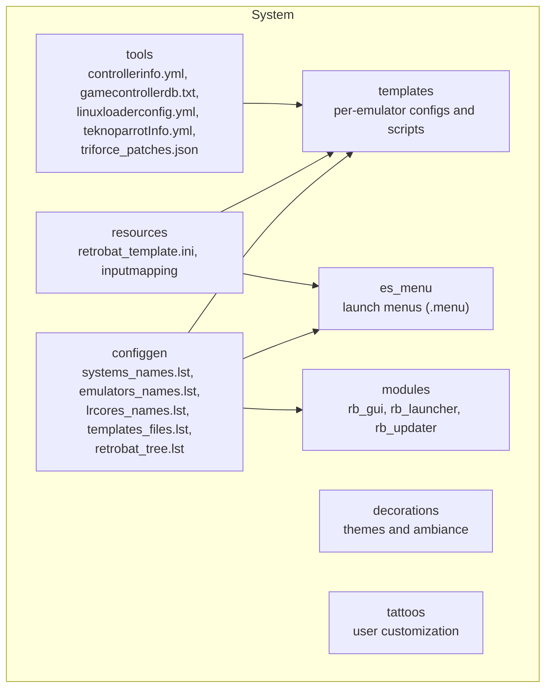
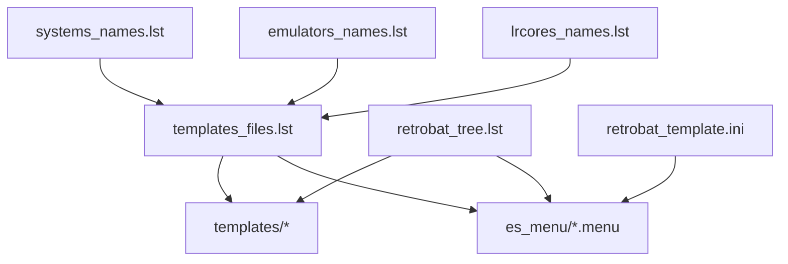
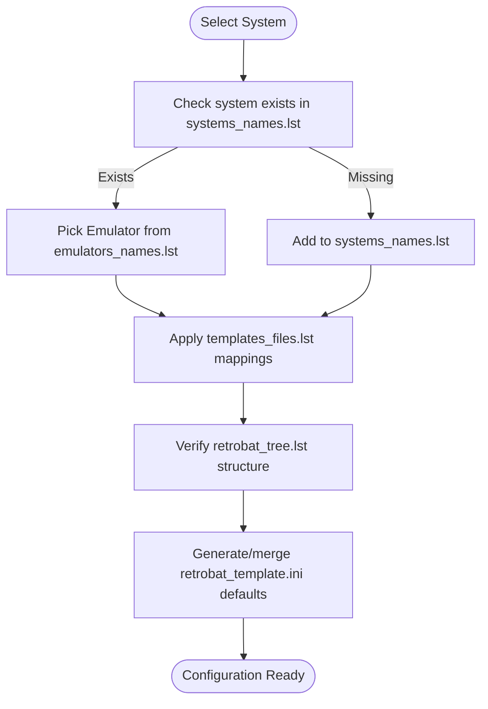
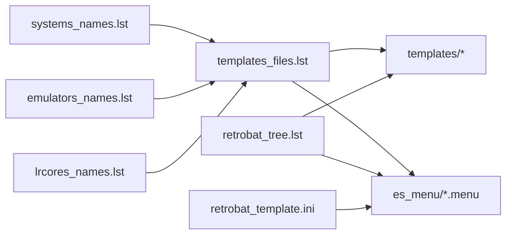

# Plugin and Extension Development

<cite>
**Referenced Files in This Document**
- [README.md](file://README.md)
- [retrobat.ini](file://retrobat.ini)
- [system/configgen/systems_names.lst](file://system/configgen/systems_names.lst)
- [system/configgen/emulators_names.lst](file://system/configgen/emulators_names.lst)
- [system/configgen/lrcores_names.lst](file://system/configgen/lrcores_names.lst)
- [system/configgen/templates_files.lst](file://system/configgen/templates_files.lst)
- [system/configgen/retrobat_tree.lst](file://system/configgen/retrobat_tree.lst)
- [system/resources/retrobat_template.ini](file://system/resources/retrobat_template.ini)
- [system/templates/altirra/Altirra.ini](file://system/templates/altirra/Altirra.ini)
- [system/templates/altirra/Configure altirra.bat](file://system/templates/altirra/Configure altirra.bat)
- [system/templates/dolphin-emu/User\Config\Dolphin.ini](file://system/templates/dolphin-emu/User\Config\Dolphin.ini)
- [system/templates/dolphin-emu\User\Config\GFX.ini](file://system/templates/dolphin-emu\User\Config\GFX.ini)
- [system/templates/dolphin-emu\User\Config\GCPadNew.ini](file://system/templates/dolphin-emu\User\Config\GFX.ini)
- [system/templates/dolphin-emu\User\Config\Hotkeys.ini](file://system/templates/dolphin-emu\User\Config\Hotkeys.ini)
- [system/templates/retroarch/retroarch.cfg](file://system/templates/retroarch/retroarch.cfg)
- [system/templates/retroarch/retroarch-core-options.cfg](file://system/templates/retroarch/retroarch-core-options.cfg)
- [system/templates/mame/ctrlr\X-Arcade.cfg](file://system/templates/mame/ctrlr\X-Arcade.cfg)
- [system/templates/mame\nvram.zip](file://system/templates/mame\nvram.zip)
- [system/templates/ppsspp\SYSTEM\ppsspp.ini](file://system/templates/ppsspp\SYSTEM\ppsspp.ini)
- [system/templates/pcsx2\inis\PCSX2.ini](file://system/templates/pcsx2\inis\PCSX2.ini)
- [system/templates/pcsx2-16\inis\PCSX2_ui.ini](file://system/templates/pcsx2-16\inis\PCSX2_ui.ini)
- [system/templates/pcsx2-16\portable.ini](file://system/templates/pcsx2-16\portable.ini)
- [system/templates/xenia\xenia.config.toml](file://system/templates/xenia\xenia.config.toml)
- [system/templates/xenia-canary\xenia-canary.config.toml](file://system/templates/xenia-canary\xenia-canary.config.toml)
- [system/templates/xenia-edge\xenia-edge.config.toml](file://system/templates/xenia-edge\xenia-edge.config.toml)
- [system/templates/yuzu\user\config\qt-config.ini](file://system/templates/yuzu\user\config\qt-config.ini)
- [system/templates/citron\user\config\qt-config.ini](file://system/templates/citron\user\config\qt-config.ini)
- [system/templates/ryujinx\Configure Ryujinx.bat](file://system/templates/ryujinx\Configure Ryujinx.bat)
- [system/templates/ryujinx\portable\Config.json](file://system/templates/ryujinx\portable\Config.json)
- [system/es_menu/retroarch.menu](file://system/es_menu/retroarch.menu)
- [system/es_menu/mame.menu](file://system/es_menu/mame.menu)
- [system/es_menu/dolphin-emu.menu](file://system/es_menu/dolphin-emu.menu)
- [system/es_menu/pcsx2.menu](file://system/es_menu/pcsx2.menu)
- [system/es_menu/xenia.menu](file://system/es_menu/xenia.menu)
- [system/es_menu/yuzu.menu](file://system/es_menu/yuzu.menu)
- [system/modules/rb_gui/allValue.xcc](file://system/modules/rb_gui/allValue.xcc)
- [system/modules/rb_gui/bios_local.json](file://system/modules/rb_gui/bios_local.json)
- [system/modules/rb_launcher](file://system/modules/rb_launcher)
- [system/modules/rb_updater](file://system/modules/rb_updater)
- [system/decorations/README.md](file://system/decorations/README.md)
- [system/tattoos/README.md](file://system/tattoos/README.md)
- [system/tattoos/games/README.md](file://system/tattoos/games/README.md)
- [system/tools/controllerinfo.yml](file://system/tools/controllerinfo.yml)
- [system/tools/gamecontrollerdb.txt](file://system/tools/gamecontrollerdb.txt)
- [system/tools/linuxloaderconfig.yml](file://system/tools/linuxloaderconfig.yml)
- [system/tools/teknoparrotInfo.yml](file://system/tools/teknoparrotInfo.yml)
- [system/tools/triforce_patches.json](file://system/tools/triforce_patches.json)
</cite>

## Table of Contents
1. [Introduction](#introduction)
2. [Project Structure](#project-structure)
3. [Core Components](#core-components)
4. [Architecture Overview](#architecture-overview)
5. [Detailed Component Analysis](#detailed-component-analysis)
6. [Dependency Analysis](#dependency-analysis)
7. [Performance Considerations](#performance-considerations)
8. [Troubleshooting Guide](#troubleshooting-guide)
9. [Conclusion](#conclusion)
10. [Appendices](#appendices)

## Introduction
This document explains how to develop plugins and extensions for RIESCADE_SYSTEM, focusing on:
- Template-based emulator integrations
- System templates and configuration generators
- Emulator launch scripts
- Module system architecture for custom functionality
- Adding new gaming systems and creating system-specific templates
- Generating configurations via compatibility lists
- Testing and integration practices

The system leverages a structured template and configuration generator approach, with dedicated lists for systems, emulators, libretro cores, and file mappings. It also includes a menu system for launching emulators and a module system for GUI, launcher, and updater functionality.

## Project Structure
RIESCADE_SYSTEM organizes plugin-related assets under the system directory:
- configgen: Compatibility matrices and mapping lists
- templates: Per-emulator configuration files and launch scripts
- es_menu: Emulator launch menus for EmulationStation
- modules: GUI, launcher, and updater modules
- decorations and tattoos: Theming and customization assets
- resources: Global configuration templates and shared resources
- tools: Utility files for controllers, patches, and loader configs

**Diagram sources**
- [system/configgen/systems_names.lst:1-241](file://system/configgen/systems_names.lst#L1-L241)
- [system/configgen/emulators_names.lst:1-130](file://system/configgen/emulators_names.lst#L1-L130)
- [system/configgen/lrcores_names.lst:1-156](file://system/configgen/lrcores_names.lst#L1-L156)
- [system/configgen/templates_files.lst:1-215](file://system/configgen/templates_files.lst#L1-L215)
- [system/configgen/retrobat_tree.lst:1-501](file://system/configgen/retrobat_tree.lst#L1-L501)
- [system/resources/retrobat_template.ini:1-91](file://system/resources/retrobat_template.ini#L1-L91)

**Section sources**
- [README.md:34-44](file://README.md#L34-L44)

## Core Components
- Systems catalog: Defines supported gaming systems for template selection and compatibility checks.
- Emulators catalog: Lists available emulators and their aliases for launch and configuration.
- Libretro cores catalog: Names of libretro cores used by RetroArch.
- Templates mapping: File mapping rules to copy or symlink template files into emulator-specific locations.
- Tree layout: Defines the expected directory structure for bios, saves, roms, emulators, and emulationstation.
- Global configuration template: Provides default RetroBat and EmulationStation settings.

Key files:
- [systems_names.lst:1-241](file://system/configgen/systems_names.lst#L1-L241)
- [emulators_names.lst:1-130](file://system/configgen/emulators_names.lst#L1-L130)
- [lrcores_names.lst:1-156](file://system/configgen/lrcores_names.lst#L1-L156)
- [templates_files.lst:1-215](file://system/configgen/templates_files.lst#L1-L215)
- [retrobat_tree.lst:1-501](file://system/configgen/retrobat_tree.lst#L1-L501)
- [retrobat_template.ini:1-91](file://system/resources/retrobat_template.ini#L1-L91)

**Section sources**
- [system/configgen/systems_names.lst:1-241](file://system/configgen/systems_names.lst#L1-L241)
- [system/configgen/emulators_names.lst:1-130](file://system/configgen/emulators_names.lst#L1-L130)
- [system/configgen/lrcores_names.lst:1-156](file://system/configgen/lrcores_names.lst#L1-L156)
- [system/configgen/templates_files.lst:1-215](file://system/configgen/templates_files.lst#L1-L215)
- [system/configgen/retrobat_tree.lst:1-501](file://system/configgen/retrobat_tree.lst#L1-L501)
- [system/resources/retrobat_template.ini:1-91](file://system/resources/retrobat_template.ini#L1-L91)

## Architecture Overview
The plugin and extension architecture centers around:
- Catalog-driven selection: systems_names.lst and emulators_names.lst drive template availability and launch options.
- Template-based configuration: templates_files.lst maps template files to emulator directories.
- Menu-driven launch: es_menu provides per-system launch entries that integrate with EmulationStation.
- Modules for extended functionality: rb_gui, rb_launcher, and rb_updater encapsulate custom features.
- Global defaults: retrobat_template.ini sets baseline EmulationStation and RetroBat behavior.

**Diagram sources**
- [system/configgen/systems_names.lst:1-241](file://system/configgen/systems_names.lst#L1-L241)
- [system/configgen/emulators_names.lst:1-130](file://system/configgen/emulators_names.lst#L1-L130)
- [system/configgen/lrcores_names.lst:1-156](file://system/configgen/lrcores_names.lst#L1-L156)
- [system/configgen/templates_files.lst:1-215](file://system/configgen/templates_files.lst#L1-L215)
- [system/configgen/retrobat_tree.lst:1-501](file://system/configgen/retrobat_tree.lst#L1-L501)
- [system/resources/retrobat_template.ini:1-91](file://system/resources/retrobat_template.ini#L1-L91)

## Detailed Component Analysis

### Template-Based Emulator Integrations
Templates define emulator-specific configuration files and optional launch scripts. They are organized by emulator name under system/templates/<emulator>.

Examples of template assets:
- [Altirra.ini](file://system/templates/altirra/Altirra.ini)
- [Configure altirra.bat](file://system/templates/altirra/Configure altirra.bat)
- [Dolphin.ini](file://system/templates/dolphin-emu/User\Config\Dolphin.ini)
- [GFX.ini](file://system/templates/dolphin-emu\User\Config\GFX.ini)
- [GCPadNew.ini](file://system/templates/dolphin-emu\User\Config\GCPadNew.ini)
- [Hotkeys.ini](file://system/templates/dolphin-emu\User\Config\Hotkeys.ini)
- [retroarch.cfg](file://system/templates/retroarch/retroarch.cfg)
- [retroarch-core-options.cfg](file://system/templates/retroarch/retroarch-core-options.cfg)
- [mame X-Arcade.cfg](file://system/templates/mame/ctrlr\X-Arcade.cfg)
- [mame nvram.zip](file://system/templates/mame\nvram.zip)
- [ppsspp.ini](file://system/templates/ppsspp\SYSTEM\ppsspp.ini)
- [pcsx2.ini](file://system/templates/pcsx2\inis\PCSX2.ini)
- [pcsx2-16 PCSX2_ui.ini](file://system/templates/pcsx2-16\inis\PCSX2_ui.ini)
- [pcsx2-16 portable.ini](file://system/templates/pcsx2-16\portable.ini)
- [xenia config.toml](file://system/templates/xenia\xenia.config.toml)
- [xenia-canary config.toml](file://system/templates/xenia-canary\xenia-canary.config.toml)
- [xenia-edge config.toml](file://system/templates/xenia-edge\xenia-edge.config.toml)
- [yuzu qt-config.ini](file://system/templates/yuzu\user\config\qt-config.ini)
- [citron qt-config.ini](file://system/templates/citron\user\config\qt-config.ini)
- [ryujinx.bat](file://system/templates/ryujinx\Configure Ryujinx.bat)
- [ryujinx Config.json](file://system/templates/ryujinx\portable\Config.json)

Template mapping rules:
- [templates_files.lst:1-215](file://system/configgen/templates_files.lst#L1-L215) defines source-to-destination mappings for template files and archives.

Best practices:
- Keep template files minimal and focused on emulator defaults.
- Use archive entries (e.g., nvram.zip) to pre-seed save/data directories.
- Provide optional launch scripts for one-click setup.

**Section sources**
- [system/configgen/templates_files.lst:1-215](file://system/configgen/templates_files.lst#L1-L215)
- [system/templates/altirra/Altirra.ini](file://system/templates/altirra/Altirra.ini)
- [system/templates/altirra/Configure altirra.bat](file://system/templates/altirra/Configure altirra.bat)
- [system/templates/dolphin-emu/User\Config\Dolphin.ini](file://system/templates/dolphin-emu/User\Config\Dolphin.ini)
- [system/templates/dolphin-emu\User\Config\GFX.ini](file://system/templates/dolphin-emu\User\Config\GFX.ini)
- [system/templates/dolphin-emu\User\Config\GCPadNew.ini](file://system/templates/dolphin-emu\User\Config\GCPadNew.ini)
- [system/templates/dolphin-emu\User\Config\Hotkeys.ini](file://system/templates/dolphin-emu\User\Config\Hotkeys.ini)
- [system/templates/retroarch/retroarch.cfg](file://system/templates/retroarch/retroarch.cfg)
- [system/templates/retroarch/retroarch-core-options.cfg](file://system/templates/retroarch/retroarch-core-options.cfg)
- [system/templates/mame/ctrlr\X-Arcade.cfg](file://system/templates/mame/ctrlr\X-Arcade.cfg)
- [system/templates/mame\nvram.zip](file://system/templates/mame\nvram.zip)
- [system/templates/ppsspp\SYSTEM\ppsspp.ini](file://system/templates/ppsspp\SYSTEM\ppsspp.ini)
- [system/templates/pcsx2\inis\PCSX2.ini](file://system/templates/pcsx2\inis\PCSX2.ini)
- [system/templates/pcsx2-16\inis\PCSX2_ui.ini](file://system/templates/pcsx2-16\inis\PCSX2_ui.ini)
- [system/templates/pcsx2-16\portable.ini](file://system/templates/pcsx2-16\portable.ini)
- [system/templates/xenia\xenia.config.toml](file://system/templates/xenia\xenia.config.toml)
- [system/templates/xenia-canary\xenia-canary.config.toml](file://system/templates/xenia-canary\xenia-canary.config.toml)
- [system/templates/xenia-edge\xenia-edge.config.toml](file://system/templates/xenia-edge\xenia-edge.config.toml)
- [system/templates/yuzu\user\config\qt-config.ini](file://system/templates/yuzu\user\config\qt-config.ini)
- [system/templates/citron\user\config\qt-config.ini](file://system/templates/citron\user\config\qt-config.ini)
- [system/templates/ryujinx\Configure Ryujinx.bat](file://system/templates/ryujinx\Configure Ryujinx.bat)
- [system/templates/ryujinx\portable\Config.json](file://system/templates/ryujinx\portable\Config.json)

### System Templates and Configuration Generators
System templates are used to configure emulator behavior per gaming system. The catalogs guide which systems and emulators are supported and how files are mapped.

- Systems catalog: [systems_names.lst:1-241](file://system/configgen/systems_names.lst#L1-L241)
- Emulators catalog: [emulators_names.lst:1-130](file://system/configgen/emulators_names.lst#L1-L130)
- Libretro cores catalog: [lrcores_names.lst:1-156](file://system/configgen/lrcores_names.lst#L1-L156)
- File mapping catalog: [templates_files.lst:1-215](file://system/configgen/templates_files.lst#L1-L215)
- Directory tree layout: [retrobat_tree.lst:1-501](file://system/configgen/retrobat_tree.lst#L1-L501)

Configuration generation flow:
1. Select a system from systems_names.lst.
2. Choose an emulator from emulators_names.lst.
3. Apply template mappings from templates_files.lst to populate emulator directories.
4. Use retrobat_template.ini as the global baseline for EmulationStation and RetroBat settings.

**Diagram sources**
- [system/configgen/systems_names.lst:1-241](file://system/configgen/systems_names.lst#L1-L241)
- [system/configgen/emulators_names.lst:1-130](file://system/configgen/emulators_names.lst#L1-L130)
- [system/configgen/templates_files.lst:1-215](file://system/configgen/templates_files.lst#L1-L215)
- [system/configgen/retrobat_tree.lst:1-501](file://system/configgen/retrobat_tree.lst#L1-L501)
- [system/resources/retrobat_template.ini:1-91](file://system/resources/retrobat_template.ini#L1-L91)

**Section sources**
- [system/configgen/systems_names.lst:1-241](file://system/configgen/systems_names.lst#L1-L241)
- [system/configgen/emulators_names.lst:1-130](file://system/configgen/emulators_names.lst#L1-L130)
- [system/configgen/lrcores_names.lst:1-156](file://system/configgen/lrcores_names.lst#L1-L156)
- [system/configgen/templates_files.lst:1-215](file://system/configgen/templates_files.lst#L1-L215)
- [system/configgen/retrobat_tree.lst:1-501](file://system/configgen/retrobat_tree.lst#L1-L501)
- [system/resources/retrobat_template.ini:1-91](file://system/resources/retrobat_template.ini#L1-L91)

### Emulator Launch Scripts
Launch scripts enable quick setup for certain emulators. Examples:
- [Altirra Configure script](file://system/templates/altirra/Configure altirra.bat)
- [Ryujinx Configure script](file://system/templates/ryujinx\Configure Ryujinx.bat)

These scripts typically:
- Copy or extract template files into emulator directories
- Prepare save/data folders
- Optionally adjust permissions or registry entries

Integration:
- Launch scripts are invoked from EmulationStation via es_menu entries or custom actions.

**Section sources**
- [system/templates/altirra/Configure altirra.bat](file://system/templates/altirra/Configure altirra.bat)
- [system/templates/ryujinx/Configure Ryujinx.bat](file://system/templates/ryujinx/Configure Ryujinx.bat)

### Module System Architecture
Modules provide custom functionality:
- rb_gui: GUI enhancements, caching, and localization assets
- rb_launcher: Launcher utilities
- rb_updater: Updater logic

Example module assets:
- [allValue.xcc](file://system/modules/rb_gui/allValue.xcc)
- [bios_local.json](file://system/modules/rb_gui/bios_local.json)
- [rb_launcher](file://system/modules/rb_launcher)
- [rb_updater](file://system/modules/rb_updater)

Module best practices:
- Encapsulate features behind clear entry points
- Use configuration files to expose toggles and options
- Keep module dependencies explicit and documented

**Section sources**
- [system/modules/rb_gui/allValue.xcc](file://system/modules/rb_gui/allValue.xcc)
- [system/modules/rb_gui/bios_local.json](file://system/modules/rb_gui/bios_local.json)
- [system/modules/rb_launcher](file://system/modules/rb_launcher)
- [system/modules/rb_updater](file://system/modules/rb_updater)

### Creating New Emulators and Integrations
Step-by-step guide:
1. Add emulator name to [emulators_names.lst:1-130](file://system/configgen/emulators_names.lst#L1-L130).
2. Create a template directory under [system/templates/<emulator>](file://system/templates).
3. Populate emulator-specific configuration files (e.g., ini, cfg, toml, json).
4. Define mappings in [templates_files.lst:1-215](file://system/configgen/templates_files.lst#L1-L215) to place files into emulator directories.
5. If applicable, add launch script(s) under [system/templates/<emulator>](file://system/templates).
6. Update [retrobat_tree.lst:1-501](file://system/configgen/retrobat_tree.lst#L1-L501) to reflect new directories if needed.
7. Add or update [es_menu/<emulator>.menu](file://system/es_menu) entries for EmulationStation launch integration.

Testing tips:
- Verify file placement using templates_files.lst mappings
- Confirm emulator launches with generated configs
- Validate save/data directories are created/updated

**Section sources**
- [system/configgen/emulators_names.lst:1-130](file://system/configgen/emulators_names.lst#L1-L130)
- [system/configgen/templates_files.lst:1-215](file://system/configgen/templates_files.lst#L1-L215)
- [system/configgen/retrobat_tree.lst:1-501](file://system/configgen/retrobat_tree.lst#L1-L501)
- [system/es_menu/retroarch.menu](file://system/es_menu/retroarch.menu)
- [system/es_menu/mame.menu](file://system/es_menu/mame.menu)
- [system/es_menu/dolphin-emu.menu](file://system/es_menu/dolphin-emu.menu)
- [system/es_menu/pcsx2.menu](file://system/es_menu/pcsx2.menu)
- [system/es_menu/xenia.menu](file://system/es_menu/xenia.menu)
- [system/es_menu/yuzu.menu](file://system/es_menu/yuzu.menu)

### Integrating Libretro Cores
Libretro core names are managed in [lrcores_names.lst:1-156](file://system/configgen/lrcores_names.lst#L1-L156). To integrate a new core:
1. Add core name to lrcores_names.lst.
2. Place core binary in the appropriate emulator directory.
3. Configure RetroArch options using [retroarch-core-options.cfg](file://system/templates/retroarch/retroarch-core-options.cfg) and [retroarch.cfg](file://system/templates/retroarch/retroarch.cfg).

Validation:
- Ensure core name matches the libretro identifier used by RetroArch.
- Test core loading and performance in RetroArch.

**Section sources**
- [system/configgen/lrcores_names.lst:1-156](file://system/configgen/lrcores_names.lst#L1-L156)
- [system/templates/retroarch/retroarch.cfg](file://system/templates/retroarch/retroarch.cfg)
- [system/templates/retroarch/retroarch-core-options.cfg](file://system/templates/retroarch/retroarch-core-options.cfg)

### Developing Custom Themes and Decorations
Themes and decorations are located under:
- [system/decorations](file://system/decorations)
- [system/tattoos](file://system/tattoos)

Guidelines:
- Use the provided README files as references for structure and naming.
- Place theme assets in appropriate subdirectories.
- Ensure compatibility with EmulationStation’s theme engine.

**Section sources**
- [system/decorations/README.md](file://system/decorations/README.md)
- [system/tattoos/README.md](file://system/tattoos/README.md)
- [system/tattoos/games/README.md](file://system/tattoos/games/README.md)

### Input Mapping and Tools
Input mapping and controller support are provided via:
- [controllerinfo.yml](file://system/tools/controllerinfo.yml)
- [gamecontrollerdb.txt](file://system/tools/gamecontrollerdb.txt)
- [linuxloaderconfig.yml](file://system/tools/linuxloaderconfig.yml)
- [teknoparrotInfo.yml](file://system/tools/teknoparrotInfo.yml)
- [triforce_patches.json](file://system/tools/triforce_patches.json)

Best practices:
- Maintain accurate controller mappings for each emulator.
- Use standardized naming conventions for input profiles.
- Keep patch and configuration files synchronized with emulator updates.

**Section sources**
- [system/tools/controllerinfo.yml](file://system/tools/controllerinfo.yml)
- [system/tools/gamecontrollerdb.txt](file://system/tools/gamecontrollerdb.txt)
- [system/tools/linuxloaderconfig.yml](file://system/tools/linuxloaderconfig.yml)
- [system/tools/teknoparrotInfo.yml](file://system/tools/teknoparrotInfo.yml)
- [system/tools/triforce_patches.json](file://system/tools/triforce_patches.json)

## Dependency Analysis
The following diagram shows how catalogs and templates depend on each other to produce a working emulator configuration.

**Diagram sources**
- [system/configgen/systems_names.lst:1-241](file://system/configgen/systems_names.lst#L1-L241)
- [system/configgen/emulators_names.lst:1-130](file://system/configgen/emulators_names.lst#L1-L130)
- [system/configgen/lrcores_names.lst:1-156](file://system/configgen/lrcores_names.lst#L1-L156)
- [system/configgen/templates_files.lst:1-215](file://system/configgen/templates_files.lst#L1-L215)
- [system/configgen/retrobat_tree.lst:1-501](file://system/configgen/retrobat_tree.lst#L1-L501)
- [system/resources/retrobat_template.ini:1-91](file://system/resources/retrobat_template.ini#L1-L91)

**Section sources**
- [system/configgen/systems_names.lst:1-241](file://system/configgen/systems_names.lst#L1-L241)
- [system/configgen/emulators_names.lst:1-130](file://system/configgen/emulators_names.lst#L1-L130)
- [system/configgen/lrcores_names.lst:1-156](file://system/configgen/lrcores_names.lst#L1-L156)
- [system/configgen/templates_files.lst:1-215](file://system/configgen/templates_files.lst#L1-L215)
- [system/configgen/retrobat_tree.lst:1-501](file://system/configgen/retrobat_tree.lst#L1-L501)
- [system/resources/retrobat_template.ini:1-91](file://system/resources/retrobat_template.ini#L1-L91)

## Performance Considerations
- Minimize redundant file copies by leveraging archive mappings (e.g., nvram.zip) where appropriate.
- Keep template files lean; defer heavy initialization to emulator defaults.
- Use RetroBat’s global template to avoid per-emulator duplication of common settings.

## Troubleshooting Guide
Common issues and resolutions:
- Emulator fails to launch:
  - Verify [emulators_names.lst:1-130](file://system/configgen/emulators_names.lst#L1-L130) contains the emulator name.
  - Confirm [templates_files.lst:1-215](file://system/configgen/templates_files.lst#L1-L215) maps required files.
  - Check [retrobat_tree.lst:1-501](file://system/configgen/retrobat_tree.lst#L1-L501) for missing directories.
- Incorrect controller mapping:
  - Review [controllerinfo.yml](file://system/tools/controllerinfo.yml) and [gamecontrollerdb.txt](file://system/tools/gamecontrollerdb.txt).
- RetroArch core not found:
  - Ensure the core name exists in [lrcores_names.lst:1-156](file://system/configgen/lrcores_names.lst#L1-L156).
  - Validate [retroarch.cfg](file://system/templates/retroarch/retroarch.cfg) and [retroarch-core-options.cfg](file://system/templates/retroarch/retroarch-core-options.cfg).
- Theme or decoration not applied:
  - Confirm asset placement under [system/decorations](file://system/decorations) or [system/tattoos](file://system/tattoos).
  - Check [system/decorations/README.md](file://system/decorations/README.md) and [system/tattoos/README.md](file://system/tattoos/README.md) for structure.

**Section sources**
- [system/configgen/emulators_names.lst:1-130](file://system/configgen/emulators_names.lst#L1-L130)
- [system/configgen/templates_files.lst:1-215](file://system/configgen/templates_files.lst#L1-L215)
- [system/configgen/retrobat_tree.lst:1-501](file://system/configgen/retrobat_tree.lst#L1-L501)
- [system/tools/controllerinfo.yml](file://system/tools/controllerinfo.yml)
- [system/tools/gamecontrollerdb.txt](file://system/tools/gamecontrollerdb.txt)
- [system/configgen/lrcores_names.lst:1-156](file://system/configgen/lrcores_names.lst#L1-L156)
- [system/templates/retroarch/retroarch.cfg](file://system/templates/retroarch/retroarch.cfg)
- [system/templates/retroarch/retroarch-core-options.cfg](file://system/templates/retroarch/retroarch-core-options.cfg)
- [system/decorations/README.md](file://system/decorations/README.md)
- [system/tattoos/README.md](file://system/tattoos/README.md)

## Conclusion
RIESCADE_SYSTEM’s plugin and extension framework relies on catalogs, templates, and mapping lists to deliver a scalable and maintainable emulator integration system. By following the steps outlined here—catalog updates, template creation, mapping definitions, and module integration—you can add new emulators, systems, and features while preserving compatibility and ease of maintenance.

## Appendices

### Step-by-Step: Adding a New Gaming System
1. Add system alias to [systems_names.lst:1-241](file://system/configgen/systems_names.lst#L1-L241).
2. Create a new template directory under [system/templates/<system>](file://system/templates).
3. Add system-specific configuration files and assets.
4. Update [templates_files.lst:1-215](file://system/configgen/templates_files.lst#L1-L215) with mappings.
5. Add or update [es_menu/<system>.menu](file://system/es_menu) entries.
6. Validate with [retrobat_tree.lst:1-501](file://system/configgen/retrobat_tree.lst#L1-L501).

**Section sources**
- [system/configgen/systems_names.lst:1-241](file://system/configgen/systems_names.lst#L1-L241)
- [system/configgen/templates_files.lst:1-215](file://system/configgen/templates_files.lst#L1-L215)
- [system/configgen/retrobat_tree.lst:1-501](file://system/configgen/retrobat_tree.lst#L1-L501)
- [system/es_menu/retroarch.menu](file://system/es_menu/retroarch.menu)
- [system/es_menu/mame.menu](file://system/es_menu/mame.menu)

### Example References
- [Altirra.ini](file://system/templates/altirra/Altirra.ini)
- [Configure altirra.bat](file://system/templates/altirra/Configure altirra.bat)
- [Dolphin.ini](file://system/templates/dolphin-emu/User\Config\Dolphin.ini)
- [GFX.ini](file://system/templates/dolphin-emu\User\Config\GFX.ini)
- [GCPadNew.ini](file://system/templates/dolphin-emu\User\Config\GCPadNew.ini)
- [Hotkeys.ini](file://system/templates/dolphin-emu\User\Config\Hotkeys.ini)
- [retroarch.cfg](file://system/templates/retroarch/retroarch.cfg)
- [retroarch-core-options.cfg](file://system/templates/retroarch/retroarch-core-options.cfg)
- [mame X-Arcade.cfg](file://system/templates/mame/ctrlr\X-Arcade.cfg)
- [mame nvram.zip](file://system/templates/mame\nvram.zip)
- [ppsspp.ini](file://system/templates/ppsspp\SYSTEM\ppsspp.ini)
- [pcsx2.ini](file://system/templates/pcsx2\inis\PCSX2.ini)
- [pcsx2-16 PCSX2_ui.ini](file://system/templates/pcsx2-16\inis\PCSX2_ui.ini)
- [pcsx2-16 portable.ini](file://system/templates/pcsx2-16\portable.ini)
- [xenia config.toml](file://system/templates/xenia\xenia.config.toml)
- [xenia-canary config.toml](file://system/templates/xenia-canary\xenia-canary.config.toml)
- [xenia-edge config.toml](file://system/templates/xenia-edge\xenia-edge.config.toml)
- [yuzu qt-config.ini](file://system/templates/yuzu\user\config\qt-config.ini)
- [citron qt-config.ini](file://system/templates/citron\user\config\qt-config.ini)
- [ryujinx.bat](file://system/templates/ryujinx\Configure Ryujinx.bat)
- [ryujinx Config.json](file://system/templates/ryujinx\portable\Config.json)