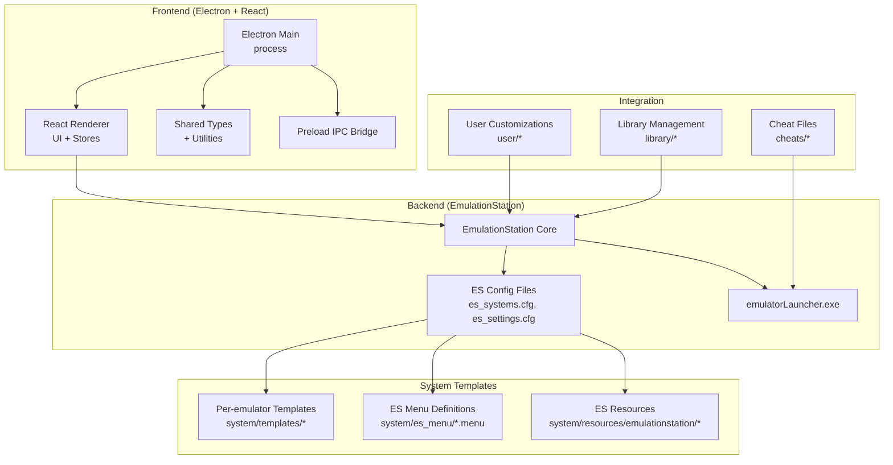
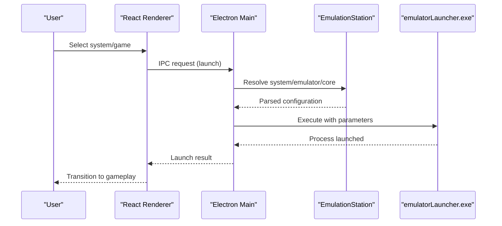
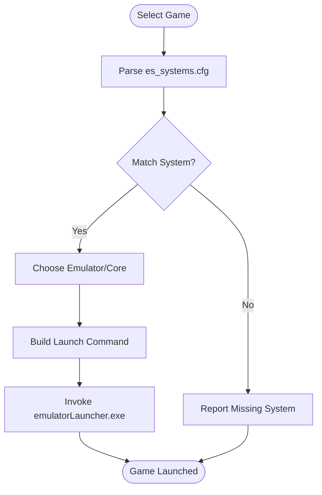
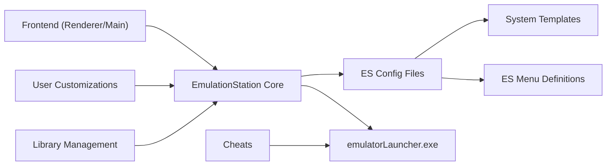

# Project Structure and Architecture

<cite>
**Referenced Files in This Document**
- [README.md](file://README.md)
- [retrobat.ini](file://retrobat.ini)
- [license.txt](file://license.txt)
- [system/resources/retrobat_template.ini](file://system/resources/retrobat_template.ini)
- [system/templates/emulationstation/es_systems.cfg](file://system/templates/emulationstation/es_systems.cfg)
- [system/templates/emulationstation/es_settings.cfg](file://system/templates/emulationstation/es_settings.cfg)
- [system/configgen/systems_names.lst](file://system/configgen/systems_names.lst)
- [system/configgen/emulators_names.lst](file://system/configgen/emulators_names.lst)
</cite>

## Table of Contents
1. [Introduction](#introduction)
2. [Project Structure](#project-structure)
3. [Core Components](#core-components)
4. [Architecture Overview](#architecture-overview)
5. [Detailed Component Analysis](#detailed-component-analysis)
6. [Dependency Analysis](#dependency-analysis)
7. [Performance Considerations](#performance-considerations)
8. [Troubleshooting Guide](#troubleshooting-guide)
9. [Conclusion](#conclusion)

## Introduction
RIESCADE_SYSTEM is a modern retro gaming frontend integrating an Electron/React Electron renderer with a C++ EmulationStation-based core. It is designed to be deployed alongside EmulationStation/RetroBat installations, leveraging upstream configuration files and gamelists while adding RIESCADE-specific enhancements. The project emphasizes:
- Compatibility with RetroBat/ES configuration and gamelists
- A high-performance UI powered by React and TypeScript
- SQLite-ready architecture for fast game indexing
- Direct integration with emulatorLauncher.exe for launching cores and emulators

The repository is organized into distinct areas:
- emulationstation/: Contains the ES frontend and Electron-related assets
- system/: Core templates, configurations, input mapping, shaders, and system integration
- library/: Game library management
- user/: User-specific customizations and personal tattoos
- cheats/: Game cheat files organized per system

This document explains the modular architecture, the relationship between frontend and backend, and how RIESCADE maintains compatibility with upstream while preserving its own customizations.

## Project Structure
RIESCADE_SYSTEM follows a layered, modular layout:
- Frontend (Electron + React): Located under emulationstation/.riescade/src, with main process, renderer, shared utilities, and preload IPC bridge
- Backend (EmulationStation + Launcher): Uses upstream ES configuration files and emulatorLauncher.exe to launch emulators and cores
- System Templates: Centralized under system/templates for emulator configurations and under system/es_menu for menu definitions
- Resources and Tools: Under system/resources and system/tools for input mapping, shaders, and auxiliary utilities
- User and Library: User-specific customizations under user/, and library management under library/
- Cheats: Per-system cheat files under cheats/

**Diagram sources**
- [README.md:34-43](file://README.md#L34-L43)
- [system/templates/emulationstation/es_systems.cfg:1-50](file://system/templates/emulationstation/es_systems.cfg#L1-L50)
- [system/templates/emulationstation/es_settings.cfg:1-51](file://system/templates/emulationstation/es_settings.cfg#L1-L51)

**Section sources**
- [README.md:1-44](file://README.md#L1-L44)
- [retrobat.ini:1-94](file://retrobat.ini#L1-L94)

## Core Components
RIESCADE’s core components are organized around three pillars:
- Electron/React Frontend: Provides the UI, state management, and IPC bridge to the main process
- EmulationStation Backend: Manages system definitions, settings, and launches emulators via emulatorLauncher.exe
- System Templates and Tools: Provide per-emulator configurations, input mapping, shader presets, and auxiliary utilities

Key responsibilities:
- Frontend: Renders the UI, handles user interactions, and communicates with the main process
- Backend: Parses ES configuration files, selects emulators and cores, and invokes emulatorLauncher.exe
- System Templates: Define per-system commands, emulators, cores, and theme mappings

**Section sources**
- [README.md:34-43](file://README.md#L34-L43)
- [system/templates/emulationstation/es_systems.cfg:1-50](file://system/templates/emulationstation/es_systems.cfg#L1-L50)
- [system/templates/emulationstation/es_settings.cfg:1-51](file://system/templates/emulationstation/es_settings.cfg#L1-L51)

## Architecture Overview
RIESCADE employs a hybrid architecture:
- Dual-layer UI: Electron main process orchestrates the app lifecycle; React renderer renders the UI and interacts with shared utilities
- Backend orchestration: EmulationStation parses system definitions and settings, then delegates launching to emulatorLauncher.exe
- Template-driven configuration: Per-emulator templates and ES menu definitions centralize system-specific behavior

**Diagram sources**
- [README.md:34-43](file://README.md#L34-L43)
- [system/templates/emulationstation/es_systems.cfg:10-19](file://system/templates/emulationstation/es_systems.cfg#L10-L19)

## Detailed Component Analysis

### Frontend Layer (Electron + React)
- Electron Main: Manages app lifecycle, window creation, and IPC communication
- React Renderer: Implements UI components, state stores, and user interactions
- Shared Utilities: Defines common types and helpers used across main and renderer
- Preload Bridge: Exposes safe APIs to the renderer for IPC

File organization rationale:
- Separation of concerns: Main process handles OS-level tasks; renderer focuses on UI
- Security: Preload isolates IPC channels and prevents direct Node.js access from renderer
- Reusability: Shared utilities reduce duplication and improve maintainability

**Section sources**
- [README.md:34-43](file://README.md#L34-L43)

### Backend Layer (EmulationStation + emulatorLauncher.exe)
- ES Configuration: es_systems.cfg defines systems, emulators, cores, and command templates
- ES Settings: es_settings.cfg controls features like grouping, scraping, and bezels
- Launcher Integration: Commands in es_systems.cfg invoke emulatorLauncher.exe with standardized parameters

**Diagram sources**
- [system/templates/emulationstation/es_systems.cfg:10-19](file://system/templates/emulationstation/es_systems.cfg#L10-L19)

**Section sources**
- [system/templates/emulationstation/es_systems.cfg:1-50](file://system/templates/emulationstation/es_systems.cfg#L1-L50)
- [system/templates/emulationstation/es_settings.cfg:1-51](file://system/templates/emulationstation/es_settings.cfg#L1-L51)

### System Templates and Tools
- Per-emulator templates: Provide default configurations for emulators and cores
- ES menu definitions: Define menu entries and actions for each system
- Input mapping and controllers: Centralized JSON/YAML files for controller layouts
- Shaders and decorations: Preset rendering configurations and ambient themes

Naming conventions:
- System folders mirror emulator names (e.g., system/templates/dosbox/)
- Configuration files use standard names (e.g., settings.json, es_settings.cfg)
- Input mapping files use platform-specific identifiers (e.g., GCControllers.json)

**Section sources**
- [system/configgen/systems_names.lst:1-241](file://system/configgen/systems_names.lst#L1-L241)
- [system/configgen/emulators_names.lst:1-130](file://system/configgen/emulators_names.lst#L1-L130)

### User and Library Areas
- user/: Personal customizations, input mapping overrides, and tattoo selections
- library/: Game library management and metadata handling

Integration:
- User preferences override defaults where applicable
- Library management coordinates with ES gamelists and system templates

**Section sources**
- [README.md:41-44](file://README.md#L41-L44)

### Cheats Directory
- Organized by system (e.g., cheats/pcsx2/, cheats/retroarch/)
- Supports multiple cheat formats per emulator family

**Section sources**
- [README.md:41-44](file://README.md#L41-L44)

## Dependency Analysis
RIESCADE’s dependencies form a layered graph:
- Frontend depends on backend for system definitions and launch commands
- Backend depends on ES configuration files and emulatorLauncher.exe
- System templates provide the authoritative source for per-emulator behavior
- User customizations depend on system templates and ES settings

**Diagram sources**
- [README.md:34-43](file://README.md#L34-L43)
- [system/templates/emulationstation/es_systems.cfg:1-50](file://system/templates/emulationstation/es_systems.cfg#L1-L50)

**Section sources**
- [README.md:34-43](file://README.md#L34-L43)
- [system/templates/emulationstation/es_systems.cfg:1-50](file://system/templates/emulationstation/es_systems.cfg#L1-L50)

## Performance Considerations
- UI responsiveness: Keep renderer logic lightweight; delegate heavy tasks to main process
- Configuration parsing: Cache parsed ES configs to avoid repeated file reads
- Launch latency: Minimize template resolution overhead; precompute common paths
- Rendering: Use shader presets judiciously; enable only when beneficial

## Troubleshooting Guide
Common issues and resolutions:
- Missing system definitions: Verify es_systems.cfg entries match systems_names.lst and emulators_names.lst
- Launch failures: Confirm emulatorLauncher.exe is present and executable; check command templates
- Configuration conflicts: Prefer system/resources/retrobat_template.ini for global settings; user overrides should be minimal
- License compliance: Ensure adherence to LGPL v3 and CC BY-NC-SA 4.0 as outlined in license.txt

**Section sources**
- [system/resources/retrobat_template.ini:1-91](file://system/resources/retrobat_template.ini#L1-L91)
- [license.txt:1-19](file://license.txt#L1-L19)

## Conclusion
RIESCADE_SYSTEM combines a modern Electron/React frontend with a robust EmulationStation backend to deliver a powerful, customizable retro gaming experience. Its modular structure—front-end, back-end, and system templates—ensures maintainability, scalability, and compatibility with upstream EmulationStation/RetroBat while enabling RIESCADE-specific enhancements. By organizing assets into clear directories and leveraging standardized configuration files, the project supports efficient development, deployment, and customization.