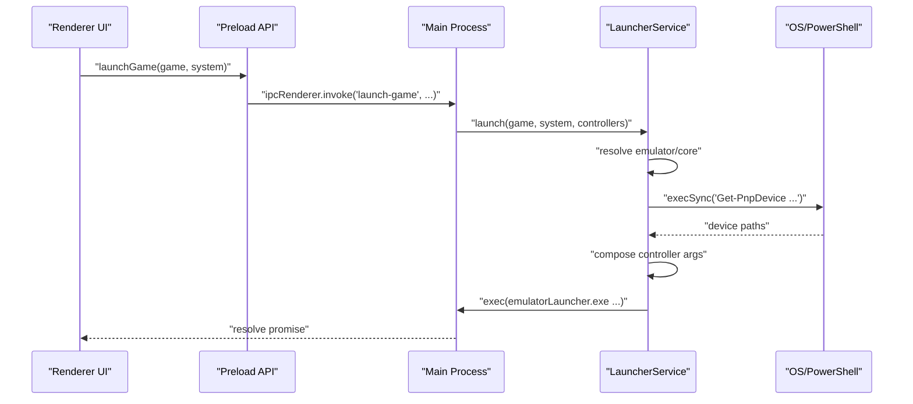
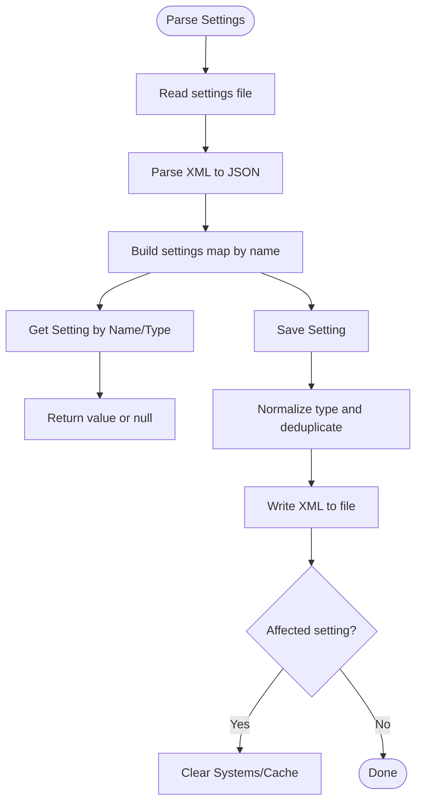
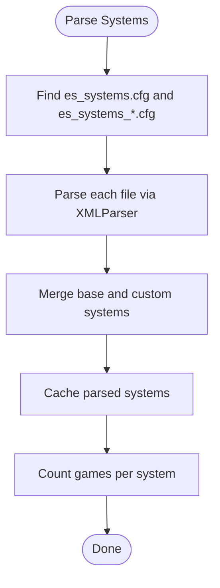
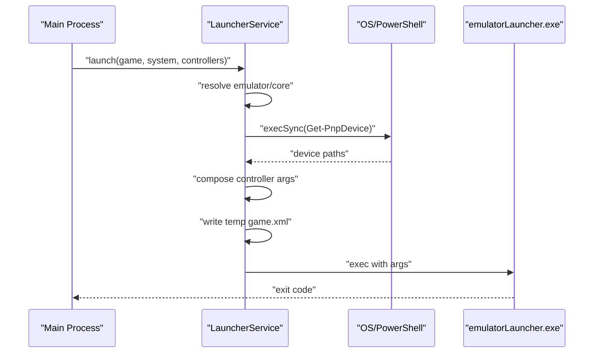
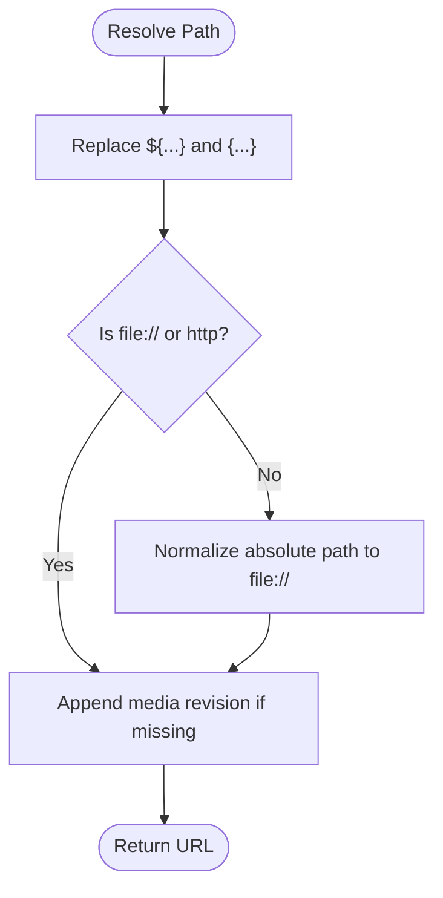
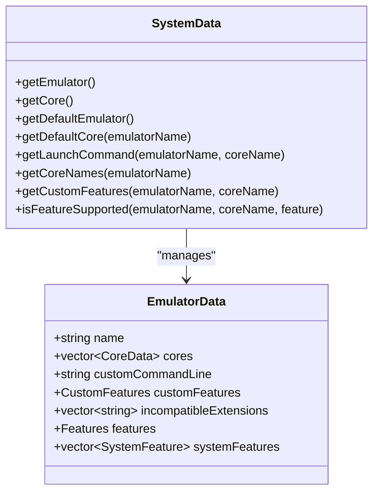
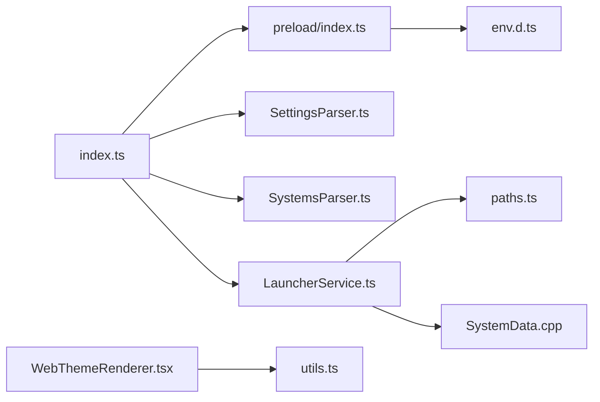

# Testing and Debugging Guide

<cite>
**Referenced Files in This Document**
- [SettingsParser.ts](file://emulationstation/.riescade/src/src/main/parsers/SettingsParser.ts)
- [SystemsParser.ts](file://emulationstation/.riescade/src/src/main/parsers/SystemsParser.ts)
- [LauncherService.ts](file://emulationstation/.riescade/src/src/main/services/LauncherService.ts)
- [index.ts](file://emulationstation/.riescade/src/src/main/index.ts)
- [paths.ts](file://emulationstation/.riescade/src/src/main/utils/paths.ts)
- [controllerinfo.yml](file://system/tools/controllerinfo.yml)
- [dpi_awareness.txt](file://system/tools/dpi_awareness.txt)
- [linuxloaderconfig.yml](file://system/tools/linuxloaderconfig.yml)
- [es_log.txt](file://emulationstation/.emulationstation/es_log.txt)
- [Diagnostics.py](file://emulationstation/.emulationstation/themes/RIESCADE_ORIGINS/resources/_scripts/Diagnostics.py)
- [WebThemeRenderer.tsx](file://emulationstation/.riescade/src/src/renderer/src/components/theme/WebThemeRenderer.tsx)
- [utils.ts](file://emulationstation/.riescade/src/src/renderer/src/components/theme/utils.ts)
- [env.d.ts](file://emulationstation/.riescade/src/src/renderer/src/env.d.ts)
- [electron.vite.config.ts](file://emulationstation/.riescade/src/electron.vite.config.ts)
- [SystemData.cpp](file://emulationstation/.riescade/src/docs/es_src/SystemData.cpp)
- [CustomFeatures.h](file://emulationstation/.riescade/src/docs/es_src/CustomFeatures.h)
- [ApiSystem.cpp](file://emulationstation/.riescade/src/docs/es_src/ApiSystem.cpp)
- [Win32ApiSystem.h](file://emulationstation/.riescade/src/docs/es_src/Win32ApiSystem.h)
- [retroarch.cfg](file://system/templates/retroarch/retroarch.cfg)
- [config.yml](file://system/templates/eka2l1/config.yml)
- [qt-config.ini](file://system/templates/citra/user/config/qt-config.ini)
- [qt-config.ini (eden)](file://system/templates/eden/user/config/qt-config.ini)
- [qt-config.ini (citron)](file://system/templates/citron/user/config/qt-config.ini)
- [qt-config.ini (suyu)](file://system/templates/suyu/user/config/qt-config.ini)
- [qt-config.ini (yuzu)](file://system/templates/yuzu/user/config/qt-config.ini)
- [config.yml (vita3k)](file://system/templates/vita3k/config.yml)
- [dosbox-staging.conf](file://system/templates/dosbox-staging/dosbox-staging.conf)
- [config.yml (rpcs3)](file://system/templates/rpcs3/config.yml)
- [settings.json (mesen)](file://system/templates/mesen/settings.json)
</cite>

## Table of Contents
1. [Introduction](#introduction)
2. [Project Structure](#project-structure)
3. [Core Components](#core-components)
4. [Architecture Overview](#architecture-overview)
5. [Detailed Component Analysis](#detailed-component-analysis)
6. [Dependency Analysis](#dependency-analysis)
7. [Performance Considerations](#performance-considerations)
8. [Troubleshooting Guide](#troubleshooting-guide)
9. [Conclusion](#conclusion)
10. [Appendices](#appendices)

## Introduction
This guide documents comprehensive testing and debugging practices for the RIESCADE_SYSTEM development and maintenance lifecycle. It covers unit testing for configuration parsers, integration testing for emulator launches, and UI testing for Electron components. It also explains debugging techniques for emulator configuration problems, input mapping conflicts, and theme rendering errors, along with the logging system and interpretation of es_log.txt. Performance profiling, memory monitoring, and optimization strategies are included, alongside practical debugging workflows for development, testing, and production. Tools and utilities such as controller mapping overrides, DPI awareness configuration, and Linux loader configuration are documented, with special attention to the hybrid Electron/C++ architecture.

## Project Structure
RIESCADE_SYSTEM is organized around an Electron-based frontend and a native backend. The Electron app resides under emulationstation/.riescade/src and communicates with native components and external emulators via a launcher service. Configuration files and templates are centralized under system/, emulationstation/.emulationstation, and user-specific locations. Themes and UI rendering logic are implemented in React/TypeScript within the Electron renderer.

```mermaid
graph TB
subgraph "Electron Frontend"
MAIN["Main Process<br/>index.ts"]
PRELOAD["Preload API<br/>preload/index.ts"]
RENDERER["Renderer (React)<br/>env.d.ts"]
end
subgraph "Parsers"
SETTINGS_PARSER["SettingsParser.ts"]
SYSTEMS_PARSER["SystemsParser.ts"]
end
subgraph "Services"
LAUNCHER["LauncherService.ts"]
end
subgraph "Native Backend"
PATHS["paths.ts"]
SYSTEMDATA["SystemData.cpp"]
CUSTOMFEATURES["CustomFeatures.h"]
APISYSTEM["ApiSystem.cpp"]
WIN32API["Win32ApiSystem.h"]
end
subgraph "Configuration & Templates"
CONTROLLERINFO["controllerinfo.yml"]
DPI["dpi_awareness.txt"]
LINUXLOADER["linuxloaderconfig.yml"]
RETROARCH_CFG["retroarch.cfg"]
EKA2L1_CFG["config.yml (eka2l1)"]
CITRA_QT["qt-config.ini (citra)"]
EDEN_QT["qt-config.ini (eden)"]
CITRON_QT["qt-config.ini (citron)"]
SUYU_QT["qt-config.ini (suyu)"]
YUZU_QT["qt-config.ini (yuzu)"]
VITA3K_CFG["config.yml (vita3k)"]
DOSBOX_CONF["dosbox-staging.conf"]
RPCS3_CFG["config.yml (rpcs3)"]
MEBEN_SET["settings.json (mesen)"]
end
MAIN --> PRELOAD
PRELOAD --> RENDERER
MAIN --> SETTINGS_PARSER
MAIN --> SYSTEMS_PARSER
MAIN --> LAUNCHER
LAUNCHER --> PATHS
LAUNCHER --> SYSTEMDATA
SYSTEMDATA --> CUSTOMFEATURES
APISYSTEM --> WIN32API
RENDERER --> WEBTHEME["WebThemeRenderer.tsx"]
RENDERER --> THEMEUTILS["utils.ts"]
CONTROLLERINFO -.-> LAUNCHER
DPI -.-> LAUNCHER
LINUXLOADER -.-> LAUNCHER
RETROARCH_CFG -.-> LAUNCHER
EKA2L1_CFG -.-> LAUNCHER
CITRA_QT -.-> LAUNCHER
EDEN_QT -.-> LAUNCHER
CITRON_QT -.-> LAUNCHER
SUYU_QT -.-> LAUNCHER
YUZU_QT -.-> LAUNCHER
VITA3K_CFG -.-> LAUNCHER
DOSBOX_CONF -.-> LAUNCHER
RPCS3_CFG -.-> LAUNCHER
MEBEN_SET -.-> LAUNCHER
```

**Diagram sources**
- [index.ts:27-71](file://emulationstation/.riescade/src/src/main/index.ts#L27-L71)
- [SettingsParser.ts:1-155](file://emulationstation/.riescade/src/src/main/parsers/SettingsParser.ts#L1-L155)
- [SystemsParser.ts:1-269](file://emulationstation/.riescade/src/src/main/parsers/SystemsParser.ts#L1-L269)
- [LauncherService.ts:1-211](file://emulationstation/.riescade/src/src/main/services/LauncherService.ts#L1-L211)
- [paths.ts:1-59](file://emulationstation/.riescade/src/src/main/utils/paths.ts#L1-L59)
- [WebThemeRenderer.tsx:182-205](file://emulationstation/.riescade/src/src/renderer/src/components/theme/WebThemeRenderer.tsx#L182-L205)
- [utils.ts:1-49](file://emulationstation/.riescade/src/src/renderer/src/components/theme/utils.ts#L1-L49)
- [env.d.ts:1-28](file://emulationstation/.riescade/src/src/renderer/src/env.d.ts#L1-L28)
- [electron.vite.config.ts:1-20](file://emulationstation/.riescade/src/electron.vite.config.ts#L1-L20)
- [SystemData.cpp:1180-1964](file://emulationstation/.riescade/src/docs/es_src/SystemData.cpp#L1180-L1964)
- [CustomFeatures.h:133-157](file://emulationstation/.riescade/src/docs/es_src/CustomFeatures.h#L133-L157)
- [ApiSystem.cpp:79-129](file://emulationstation/.riescade/src/docs/es_src/ApiSystem.cpp#L79-L129)
- [Win32ApiSystem.h:40-69](file://emulationstation/.riescade/src/docs/es_src/Win32ApiSystem.h#L40-L69)
- [controllerinfo.yml:1-119](file://system/tools/controllerinfo.yml#L1-L119)
- [dpi_awareness.txt:1-5](file://system/tools/dpi_awareness.txt#L1-L5)
- [linuxloaderconfig.yml:1-116](file://system/tools/linuxloaderconfig.yml#L1-L116)
- [retroarch.cfg:1-800](file://system/templates/retroarch/retroarch.cfg#L1-L800)
- [config.yml:1-55](file://system/templates/eka2l1/config.yml#L1-L55)
- [qt-config.ini:249-320](file://system/templates/citra/user/config/qt-config.ini#L249-L320)
- [qt-config.ini (eden):965-1014](file://system/templates/eden/user/config/qt-config.ini#L965-L1014)
- [qt-config.ini (citron):992-1039](file://system/templates/citron/user/config/qt-config.ini#L992-L1039)
- [qt-config.ini (suyu):921-970](file://system/templates/suyu/user/config/qt-config.ini#L921-L970)
- [qt-config.ini (yuzu):1068-1110](file://system/templates/yuzu/user/config/qt-config.ini#L1068-L1110)
- [config.yml (vita3k):131-181](file://system/templates/vita3k/config.yml#L131-L181)
- [dosbox-staging.conf:507-520](file://system/templates/dosbox-staging/dosbox-staging.conf#L507-L520)
- [config.yml (rpcs3):1-45](file://system/templates/rpcs3/config.yml#L1-L45)
- [settings.json (mesen):9672-9741](file://system/templates/mesen/settings.json#L9672-L9741)

**Section sources**
- [index.ts:27-71](file://emulationstation/.riescade/src/src/main/index.ts#L27-L71)
- [electron.vite.config.ts:1-20](file://emulationstation/.riescade/src/electron.vite.config.ts#L1-L20)

## Core Components
- SettingsParser: Parses and saves es_settings.cfg/es_settings.xml, supports typed settings retrieval and cache invalidation triggers.
- SystemsParser: Loads and merges es_systems.cfg and es_systems_*.cfg files, caches parsed systems, and counts games per system.
- LauncherService: Orchestrates emulator launching, resolves emulator/core selection, injects controller arguments, and writes temporary game metadata.
- Theme Rendering Utilities: Path resolution helpers and theme expression evaluation for Electron-rendered UI.
- Native Backend: SystemData and CustomFeatures define emulator/core capabilities and defaults; ApiSystem/Win32ApiSystem expose OS/system services.

**Section sources**
- [SettingsParser.ts:1-155](file://emulationstation/.riescade/src/src/main/parsers/SettingsParser.ts#L1-L155)
- [SystemsParser.ts:1-269](file://emulationstation/.riescade/src/src/main/parsers/SystemsParser.ts#L1-L269)
- [LauncherService.ts:1-211](file://emulationstation/.riescade/src/src/main/services/LauncherService.ts#L1-L211)
- [WebThemeRenderer.tsx:182-205](file://emulationstation/.riescade/src/src/renderer/src/components/theme/WebThemeRenderer.tsx#L182-L205)
- [utils.ts:1-49](file://emulationstation/.riescade/src/src/renderer/src/components/theme/utils.ts#L1-L49)
- [SystemData.cpp:1180-1964](file://emulationstation/.riescade/src/docs/es_src/SystemData.cpp#L1180-L1964)
- [CustomFeatures.h:133-157](file://emulationstation/.riescade/src/docs/es_src/CustomFeatures.h#L133-L157)
- [ApiSystem.cpp:79-129](file://emulationstation/.riescade/src/docs/es_src/ApiSystem.cpp#L79-L129)
- [Win32ApiSystem.h:40-69](file://emulationstation/.riescade/src/docs/es_src/Win32ApiSystem.h#L40-L69)

## Architecture Overview
The Electron app initializes the main window, exposes a preload API, and loads either a dev server or a production HTML. The main process handles IPC requests, including version retrieval, controller enumeration, and launching games. The launcher composes arguments for emulatorLauncher.exe, including controller mappings derived from device discovery and user-provided overrides.

**Diagram sources**
- [index.ts:27-71](file://emulationstation/.riescade/src/src/main/index.ts#L27-L71)
- [LauncherService.ts:1-211](file://emulationstation/.riescade/src/src/main/services/LauncherService.ts#L1-L211)

## Detailed Component Analysis

### Configuration Parsing: SettingsParser
- Parses es_settings.cfg/es_settings.xml with XMLBuilder/XMLParser.
- Retrieves settings by name and type, supports auto-type inference.
- Saves settings with type normalization and removes duplicates.
- Clears caches when specific settings change (e.g., VisibleSystems, HiddenSystems).

**Diagram sources**
- [SettingsParser.ts:1-155](file://emulationstation/.riescade/src/src/main/parsers/SettingsParser.ts#L1-L155)

**Section sources**
- [SettingsParser.ts:1-155](file://emulationstation/.riescade/src/src/main/parsers/SettingsParser.ts#L1-L155)

### Configuration Parsing: SystemsParser
- Scans for es_systems.cfg and es_systems_*.cfg files.
- Parses emulators and cores, merges base and custom systems.
- Counts games per system with early exit optimization.

**Diagram sources**
- [SystemsParser.ts:1-269](file://emulationstation/.riescade/src/src/main/parsers/SystemsParser.ts#L1-L269)

**Section sources**
- [SystemsParser.ts:1-269](file://emulationstation/.riescade/src/src/main/parsers/SystemsParser.ts#L1-L269)

### Emulator Launch Orchestration: LauncherService
- Resolves emulator and core preferences from game/system settings.
- Generates controller arguments using device discovery and GUID/path matching.
- Writes a temporary game XML for the launcher and executes emulatorLauncher.exe.

**Diagram sources**
- [LauncherService.ts:1-211](file://emulationstation/.riescade/src/src/main/services/LauncherService.ts#L1-L211)

**Section sources**
- [LauncherService.ts:1-211](file://emulationstation/.riescade/src/src/main/services/LauncherService.ts#L1-L211)

### Theme Rendering Utilities
- Path resolution supports variables, dynamic bindings, and file URLs.
- Renderer evaluates expressions and formats dates/time for theme rendering.

**Diagram sources**
- [utils.ts:1-49](file://emulationstation/.riescade/src/src/renderer/src/components/theme/utils.ts#L1-L49)
- [WebThemeRenderer.tsx:182-205](file://emulationstation/.riescade/src/src/renderer/src/components/theme/WebThemeRenderer.tsx#L182-L205)

**Section sources**
- [utils.ts:1-49](file://emulationstation/.riescade/src/src/renderer/src/components/theme/utils.ts#L1-L49)
- [WebThemeRenderer.tsx:182-205](file://emulationstation/.riescade/src/src/renderer/src/components/theme/WebThemeRenderer.tsx#L182-L205)

### Native Backend: SystemData and Features
- Defines emulator/core features and default selection logic.
- Supports custom features and feature checks for compatibility.

**Diagram sources**
- [SystemData.cpp:1180-1964](file://emulationstation/.riescade/src/docs/es_src/SystemData.cpp#L1180-L1964)
- [CustomFeatures.h:133-157](file://emulationstation/.riescade/src/docs/es_src/CustomFeatures.h#L133-L157)

**Section sources**
- [SystemData.cpp:1180-1964](file://emulationstation/.riescade/src/docs/es_src/SystemData.cpp#L1180-L1964)
- [CustomFeatures.h:133-157](file://emulationstation/.riescade/src/docs/es_src/CustomFeatures.h#L133-L157)

## Dependency Analysis
- Electron app depends on preload APIs and renderer components.
- Main process depends on parsers and services for configuration and launching.
- LauncherService depends on OS device queries and configuration templates.
- Theme utilities depend on renderer environment and theme data.

**Diagram sources**
- [index.ts:27-71](file://emulationstation/.riescade/src/src/main/index.ts#L27-L71)
- [env.d.ts:1-28](file://emulationstation/.riescade/src/src/renderer/src/env.d.ts#L1-L28)
- [SettingsParser.ts:1-155](file://emulationstation/.riescade/src/src/main/parsers/SettingsParser.ts#L1-L155)
- [SystemsParser.ts:1-269](file://emulationstation/.riescade/src/src/main/parsers/SystemsParser.ts#L1-L269)
- [LauncherService.ts:1-211](file://emulationstation/.riescade/src/src/main/services/LauncherService.ts#L1-L211)
- [paths.ts:1-59](file://emulationstation/.riescade/src/src/main/utils/paths.ts#L1-L59)
- [SystemData.cpp:1180-1964](file://emulationstation/.riescade/src/docs/es_src/SystemData.cpp#L1180-L1964)
- [WebThemeRenderer.tsx:182-205](file://emulationstation/.riescade/src/src/renderer/src/components/theme/WebThemeRenderer.tsx#L182-L205)
- [utils.ts:1-49](file://emulationstation/.riescade/src/src/renderer/src/components/theme/utils.ts#L1-L49)

**Section sources**
- [index.ts:27-71](file://emulationstation/.riescade/src/src/main/index.ts#L27-L71)
- [env.d.ts:1-28](file://emulationstation/.riescade/src/src/renderer/src/env.d.ts#L1-L28)

## Performance Considerations
- XML parsing and caching: SystemsParser caches parsed systems; SettingsParser clears caches on relevant changes to avoid stale configurations.
- Controller argument composition: LauncherService performs device discovery via PowerShell; batch device queries minimize repeated calls.
- Theme rendering: Path resolution and expression evaluation are optimized with early exits and minimal allocations.
- Logging overhead: Excessive logging can impact performance; tune log levels in emulator configs (e.g., retroarch.cfg, vit3000 config.yml).

[No sources needed since this section provides general guidance]

## Troubleshooting Guide

### Testing Approaches
- Unit tests for configuration parsers:
  - Verify SettingsParser reads/writes settings correctly, handles missing files, and normalizes types.
  - Verify SystemsParser merges multiple es_systems_*.cfg files and counts games accurately.
- Integration tests for emulator launches:
  - Mock device discovery and controller GUID matching; simulate emulatorLauncher.exe invocation.
  - Validate temporary game XML generation and argument composition.
- UI tests for Electron components:
  - Test theme path resolution and expression evaluation in WebThemeRenderer.
  - Validate preload API exposure and IPC handlers.

**Section sources**
- [SettingsParser.ts:1-155](file://emulationstation/.riescade/src/src/main/parsers/SettingsParser.ts#L1-L155)
- [SystemsParser.ts:1-269](file://emulationstation/.riescade/src/src/main/parsers/SystemsParser.ts#L1-L269)
- [LauncherService.ts:1-211](file://emulationstation/.riescade/src/src/main/services/LauncherService.ts#L1-L211)
- [WebThemeRenderer.tsx:182-205](file://emulationstation/.riescade/src/src/renderer/src/components/theme/WebThemeRenderer.tsx#L182-L205)
- [env.d.ts:1-28](file://emulationstation/.riescade/src/src/renderer/src/env.d.ts#L1-L28)

### Debugging Techniques

- Emulator configuration problems:
  - Confirm emulator/core selection logic in SystemData and LauncherService.
  - Validate emulator command-line templates and custom commands.
  - Check emulator-specific configuration files (e.g., retroarch.cfg, eka2l1 config.yml, vit3000 config.yml).

- Input mapping conflicts:
  - Use controllerinfo.yml to override GUIDs and names for specific emulators.
  - Inspect device discovery and GUID/path matching in LauncherService.
  - Validate input driver settings (e.g., retroarch.cfg input_driver, input_joypad_driver).

- Theme rendering errors:
  - Verify path resolution in utils.ts and expression evaluation in WebThemeRenderer.tsx.
  - Ensure media revision parameters are appended correctly for cache busting.

- Logging and diagnostics:
  - es_log.txt contains file creation errors and connection failures; review timestamps and error messages.
  - Use Diagnostics.py to run comprehensive system diagnostics and capture console output to a log file.

**Section sources**
- [LauncherService.ts:1-211](file://emulationstation/.riescade/src/src/main/services/LauncherService.ts#L1-L211)
- [controllerinfo.yml:1-119](file://system/tools/controllerinfo.yml#L1-L119)
- [utils.ts:1-49](file://emulationstation/.riescade/src/src/renderer/src/components/theme/utils.ts#L1-L49)
- [WebThemeRenderer.tsx:182-205](file://emulationstation/.riescade/src/src/renderer/src/components/theme/WebThemeRenderer.tsx#L182-L205)
- [es_log.txt:1-475](file://emulationstation/.emulationstation/es_log.txt#L1-L475)
- [Diagnostics.py:1-35](file://emulationstation/.emulationstation/themes/RIESCADE_ORIGINS/resources/_scripts/Diagnostics.py#L1-L35)

### Interpreting es_log.txt
Common categories:
- FileData creation failures: Indicates missing ROMs or unsupported archive formats.
- System definition issues: Missing name, extension, or command in system configuration.
- Network/connection errors: HTTP request failures during scraping or updates.

Actionable steps:
- Verify ROM paths and file extensions against system definitions.
- Ensure system entries include required attributes and commands.
- Check network connectivity and proxy settings if connection errors occur.

**Section sources**
- [es_log.txt:1-475](file://emulationstation/.emulationstation/es_log.txt#L1-L475)

### Performance Profiling and Memory Monitoring
- Emulator profiling:
  - Enable profiling in Mesen settings.json windows.
  - Use emulator-specific debug modes (e.g., citra qt-config.ini debug settings).
- System-level monitoring:
  - Use ApiSystem methods to gather free space and system information.
  - On Windows, leverage Win32ApiSystem capabilities for device and script execution.

**Section sources**
- [settings.json (mesen):9672-9741](file://system/templates/mesen/settings.json#L9672-L9741)
- [qt-config.ini:249-320](file://system/templates/citra/user/config/qt-config.ini#L249-L320)
- [ApiSystem.cpp:79-129](file://emulationstation/.riescade/src/docs/es_src/ApiSystem.cpp#L79-L129)
- [Win32ApiSystem.h:40-69](file://emulationstation/.riescade/src/docs/es_src/Win32ApiSystem.h#L40-L69)

### Debugging Workflows

- Development builds:
  - Use Vite dev server URL via ELECTRON_RENDERER_URL for hot module reload.
  - Access preload APIs through window.api in renderer.

- Testing environments:
  - Run Diagnostics.py to collect environment and configuration diagnostics.
  - Temporarily increase emulator log verbosity (e.g., retroarch.cfg frontend_log_level).

- Production troubleshooting:
  - Review es_log.txt for persistent errors.
  - Validate emulator configs and controller overrides.
  - Confirm DPI awareness and Linux loader settings if applicable.

**Section sources**
- [electron.vite.config.ts:1-20](file://emulationstation/.riescade/src/electron.vite.config.ts#L1-L20)
- [index.ts:27-71](file://emulationstation/.riescade/src/src/main/index.ts#L27-L71)
- [Diagnostics.py:1-35](file://emulationstation/.emulationstation/themes/RIESCADE_ORIGINS/resources/_scripts/Diagnostics.py#L1-L35)

### Tools and Utilities

- Controller testing and overrides:
  - controllerinfo.yml maps RetroBat GUIDs to emulator-specific GUIDs/names.
  - LauncherService discovers HID devices and constructs controller arguments.

- DPI awareness configuration:
  - dpi_awareness.txt lists executables requiring DPI awareness adjustments.

- Linux loader configuration:
  - linuxloaderconfig.yml defines per-game loader paths for specific titles.

**Section sources**
- [controllerinfo.yml:1-119](file://system/tools/controllerinfo.yml#L1-L119)
- [LauncherService.ts:1-211](file://emulationstation/.riescade/src/src/main/services/LauncherService.ts#L1-L211)
- [dpi_awareness.txt:1-5](file://system/tools/dpi_awareness.txt#L1-L5)
- [linuxloaderconfig.yml:1-116](file://system/tools/linuxloaderconfig.yml#L1-L116)

### Hybrid Electron/C++ Architecture Considerations
- IPC boundaries: Ensure settings and system data are accessed via preload APIs and main-process handlers.
- Path resolution: Use paths.ts to resolve configuration and theme paths consistently across packaged and development environments.
- Feature detection: Use SystemData and CustomFeatures to gate features and avoid unsupported configurations.

**Section sources**
- [paths.ts:1-59](file://emulationstation/.riescade/src/src/main/utils/paths.ts#L1-L59)
- [SystemData.cpp:1180-1964](file://emulationstation/.riescade/src/docs/es_src/SystemData.cpp#L1180-L1964)
- [CustomFeatures.h:133-157](file://emulationstation/.riescade/src/docs/es_src/CustomFeatures.h#L133-L157)

## Conclusion
This guide provides a structured approach to testing and debugging RIESCADE_SYSTEM across configuration parsing, emulator orchestration, and UI rendering. By leveraging unit/integration tests, robust logging, and targeted diagnostics, developers can efficiently troubleshoot emulator configuration issues, input mapping conflicts, and theme rendering errors. The documented workflows and tools streamline development, testing, and production troubleshooting for the hybrid Electron/C++ architecture.

## Appendices

### Quick Reference: Key Configuration Files and Their Roles
- SettingsParser.ts: Reads/writes es_settings.cfg/xml; centralizes settings access.
- SystemsParser.ts: Aggregates system definitions from multiple cfg files.
- LauncherService.ts: Composes and executes emulator launches with controller mapping.
- controllerinfo.yml: Overrides controller GUIDs/names for specific emulators.
- dpi_awareness.txt: Lists executables requiring DPI awareness.
- linuxloaderconfig.yml: Defines per-game loader paths for Linux titles.
- es_log.txt: Application/system logs for diagnostics.
- Diagnostics.py: Automated diagnostics script for environment checks.

**Section sources**
- [SettingsParser.ts:1-155](file://emulationstation/.riescade/src/src/main/parsers/SettingsParser.ts#L1-L155)
- [SystemsParser.ts:1-269](file://emulationstation/.riescade/src/src/main/parsers/SystemsParser.ts#L1-L269)
- [LauncherService.ts:1-211](file://emulationstation/.riescade/src/src/main/services/LauncherService.ts#L1-L211)
- [controllerinfo.yml:1-119](file://system/tools/controllerinfo.yml#L1-L119)
- [dpi_awareness.txt:1-5](file://system/tools/dpi_awareness.txt#L1-L5)
- [linuxloaderconfig.yml:1-116](file://system/tools/linuxloaderconfig.yml#L1-L116)
- [es_log.txt:1-475](file://emulationstation/.emulationstation/es_log.txt#L1-L475)
- [Diagnostics.py:1-35](file://emulationstation/.emulationstation/themes/RIESCADE_ORIGINS/resources/_scripts/Diagnostics.py#L1-L35)