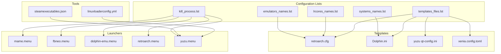
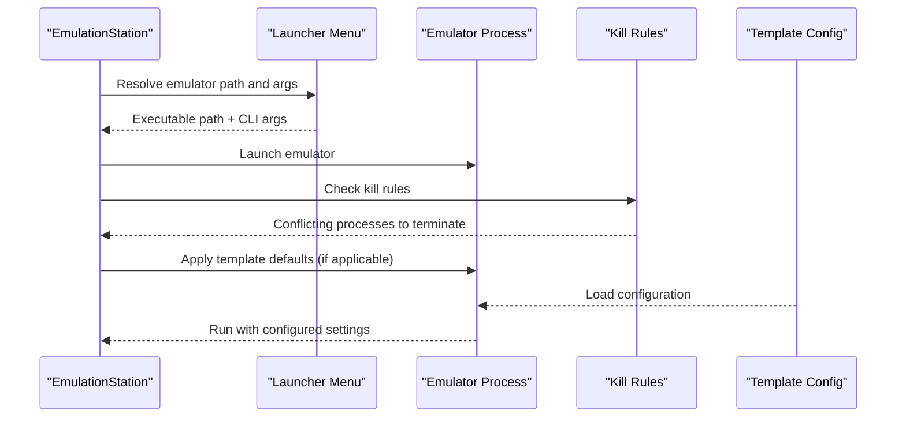
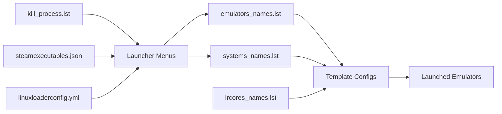

# Compatibility Matrix

<cite>
**Referenced Files in This Document**
- [kill_process.lst](file://system/configgen/kill_process.lst)
- [linuxloaderconfig.yml](file://system/tools/linuxloaderconfig.yml)
- [steamexecutables.json](file://system/tools/steamexecutables.json)
- [emulators_names.lst](file://system/configgen/emulators_names.lst)
- [systems_names.lst](file://system/configgen/systems_names.lst)
- [lrcores_names.lst](file://system/configgen/lrcores_names.lst)
- [templates_files.lst](file://system/configgen/templates_files.lst)
- [retroarch.cfg](file://system/templates/retroarch/retroarch.cfg)
- [Dolphin.ini](file://system/templates/dolphin-emu/User\Config/Dolphin.ini)
- [yuzu qt-config.ini](file://system/templates/yuzu/user/config/qt-config.ini)
- [xenia.config.toml](file://system/templates/xenia/xenia.config.toml)
- [mame.menu](file://system/es_menu/mame.menu)
- [fbneo.menu](file://system/es_menu/fbneo.menu)
- [dolphin-emu.menu](file://system/es_menu/dolphin-emu.menu)
- [retroarch.menu](file://system/es_menu/retroarch.menu)
- [yuzu.menu](file://system/es_menu/yuzu.menu)
</cite>

## Table of Contents
1. [Introduction](#introduction)
2. [Project Structure](#project-structure)
3. [Core Components](#core-components)
4. [Architecture Overview](#architecture-overview)
5. [Detailed Component Analysis](#detailed-component-analysis)
6. [Dependency Analysis](#dependency-analysis)
7. [Performance Considerations](#performance-considerations)
8. [Troubleshooting Guide](#troubleshooting-guide)
9. [Conclusion](#conclusion)
10. [Appendices](#appendices)

## Introduction
This document presents a comprehensive emulator compatibility matrix derived from the repository’s configuration and templates. It covers:
- Compatibility relationships among emulators, cores, and gaming platforms
- The kill process system to prevent conflicts between overlapping emulators
- Steam executable integration and Linux loader configurations
- Platform-specific compatibility requirements, file format support, and feature limitations
- Known compatibility issues, workarounds, and recommended emulator combinations
- System architecture considerations (32-bit vs 64-bit) and their impact on compatibility

## Project Structure
The repository organizes compatibility-related data across configuration lists, template files, and launcher menu entries:
- Lists define supported emulators, systems, and libretro cores
- Templates provide default configurations for emulators and platforms
- Menu files define how EmulationStation launches emulators and pass arguments
- Tools define kill process rules and Steam integration metadata

**Diagram sources**
- [emulators_names.lst:1-130](file://system/configgen/emulators_names.lst#L1-L130)
- [systems_names.lst:1-241](file://system/configgen/systems_names.lst#L1-L241)
- [lrcores_names.lst:1-156](file://system/configgen/lrcores_names.lst#L1-L156)
- [kill_process.lst:1-91](file://system/configgen/kill_process.lst#L1-L91)
- [templates_files.lst:1-215](file://system/configgen/templates_files.lst#L1-L215)
- [retroarch.cfg:1-800](file://system/templates/retroarch/retroarch.cfg#L1-L800)
- [Dolphin.ini:1-58](file://system/templates/dolphin-emu/User/Config/Dolphin.ini#L1-L58)
- [yuzu qt-config.ini:1-800](file://system/templates/yuzu/user/config/qt-config.ini#L1-L800)
- [xenia.config.toml:1-374](file://system/templates/xenia/xenia.config.toml#L1-L374)
- [mame.menu:1-2](file://system/es_menu/mame.menu#L1-L2)
- [fbneo.menu:1-1](file://system/es_menu/fbneo.menu#L1-L1)
- [dolphin-emu.menu:1-1](file://system/es_menu/dolphin-emu.menu#L1-L1)
- [retroarch.menu:1-1](file://system/es_menu/retroarch.menu#L1-L1)
- [yuzu.menu:1-1](file://system/es_menu/yuzu.menu#L1-L1)
- [steamexecutables.json:1-196](file://system/tools/steamexecutables.json#L1-L196)
- [linuxloaderconfig.yml:1-116](file://system/tools/linuxloaderconfig.yml#L1-L116)

**Section sources**
- [emulators_names.lst:1-130](file://system/configgen/emulators_names.lst#L1-L130)
- [systems_names.lst:1-241](file://system/configgen/systems_names.lst#L1-L241)
- [lrcores_names.lst:1-156](file://system/configgen/lrcores_names.lst#L1-L156)
- [kill_process.lst:1-91](file://system/configgen/kill_process.lst#L1-L91)
- [templates_files.lst:1-215](file://system/configgen/templates_files.lst#L1-L215)
- [retroarch.cfg:1-800](file://system/templates/retroarch/retroarch.cfg#L1-L800)
- [Dolphin.ini:1-58](file://system/templates/dolphin-emu/User/Config/Dolphin.ini#L1-L58)
- [yuzu qt-config.ini:1-800](file://system/templates/yuzu/user/config/qt-config.ini#L1-L800)
- [xenia.config.toml:1-374](file://system/templates/xenia/xenia.config.toml#L1-L374)
- [mame.menu:1-2](file://system/es_menu/mame.menu#L1-L2)
- [fbneo.menu:1-1](file://system/es_menu/fbneo.menu#L1-L1)
- [dolphin-emu.menu:1-1](file://system/es_menu/dolphin-emu.menu#L1-L1)
- [retroarch.menu:1-1](file://system/es_menu/retroarch.menu#L1-L1)
- [yuzu.menu:1-1](file://system/es_menu/yuzu.menu#L1-L1)
- [steamexecutables.json:1-196](file://system/tools/steamexecutables.json#L1-L196)
- [linuxloaderconfig.yml:1-116](file://system/tools/linuxloaderconfig.yml#L1-L116)

## Core Components
- Emulator registry: Lists supported emulators and their aliases
- Platform registry: Lists supported gaming platforms and subsystems
- Libretro core registry: Lists available cores for RetroArch
- Kill process rules: Prevents overlapping emulator instances
- Template configurations: Provide baseline settings for emulators and platforms
- Launcher menus: Define executable paths and command-line arguments
- Tools: Steam integration and Linux loader configurations

**Section sources**
- [emulators_names.lst:1-130](file://system/configgen/emulators_names.lst#L1-L130)
- [systems_names.lst:1-241](file://system/configgen/systems_names.lst#L1-L241)
- [lrcores_names.lst:1-156](file://system/configgen/lrcores_names.lst#L1-L156)
- [kill_process.lst:1-91](file://system/configgen/kill_process.lst#L1-L91)
- [templates_files.lst:1-215](file://system/configgen/templates_files.lst#L1-L215)

## Architecture Overview
The compatibility matrix is driven by:
- Emulator selection and argument passing via launcher menus
- Template-driven configuration applied to each emulator
- Kill process rules to avoid concurrent instances of conflicting emulators
- Platform-specific configuration defaults (e.g., Dolphin, yuzu, Xenia)

**Diagram sources**
- [mame.menu:1-2](file://system/es_menu/mame.menu#L1-L2)
- [fbneo.menu:1-1](file://system/es_menu/fbneo.menu#L1-L1)
- [dolphin-emu.menu:1-1](file://system/es_menu/dolphin-emu.menu#L1-L1)
- [retroarch.menu:1-1](file://system/es_menu/retroarch.menu#L1-L1)
- [yuzu.menu:1-1](file://system/es_menu/yuzu.menu#L1-L1)
- [kill_process.lst:1-91](file://system/configgen/kill_process.lst#L1-L91)
- [retroarch.cfg:1-800](file://system/templates/retroarch/retroarch.cfg#L1-L800)
- [Dolphin.ini:1-58](file://system/templates/dolphin-emu/User/Config/Dolphin.ini#L1-L58)
- [yuzu qt-config.ini:1-800](file://system/templates/yuzu/user/config/qt-config.ini#L1-L800)
- [xenia.config.toml:1-374](file://system/templates/xenia/xenia.config.toml#L1-L374)

## Detailed Component Analysis

### Kill Process System
Purpose: Prevent conflicts by terminating overlapping emulator processes before launching a new session.

- Maintained in kill_process.lst with executable names
- Used by EmulationStation to detect and stop conflicting emulators prior to launch
- Covers desktop Windows executables for emulators such as MAME, Dolphin, PCSX2, RetroArch, Xenia, yuzu, and others

Recommended usage:
- Keep kill_process.lst updated with all emulator binaries used in the environment
- Ensure EmulationStation invokes kill rules before launching a selected emulator

**Section sources**
- [kill_process.lst:1-91](file://system/configgen/kill_process.lst#L1-L91)

### Steam Executable Integration
Purpose: Map Steam app IDs to executable names for unified integration and potential conflict resolution.

- steamexecutables.json maps numeric Steam app IDs to executable names
- Useful for avoiding conflicts between Steam-based and standalone emulators for the same titles
- Integrates with launcher logic to coordinate process lifecycle

Operational notes:
- Verify app IDs align with installed Steam games
- Use this mapping to harmonize launch sequences and kill rules

**Section sources**
- [steamexecutables.json:1-196](file://system/tools/steamexecutables.json#L1-L196)

### Linux Loader Configurations
Purpose: Provide per-game launcher paths for Linux-based arcade loaders.

- linuxloaderconfig.yml defines launcher_path per game code
- Supports display_name overrides for better user experience
- Enables flexible routing of games to appropriate loaders

Usage:
- Map game identifiers to loader executables or wrapper scripts
- Use display_name for consistent UI labeling

**Section sources**
- [linuxloaderconfig.yml:1-116](file://system/tools/linuxloaderconfig.yml#L1-L116)

### Emulator and Platform Registry
Purpose: Define supported emulators, platforms, and libretro cores.

- emulators_names.lst enumerates emulators (e.g., MAME, Dolphin, PCSX2, RetroArch, yuzu)
- systems_names.lst enumerates platforms (e.g., NES, SNES, Genesis, PlayStation, Switch)
- lrcores_names.lst enumerates libretro cores (e.g., MAME variants, Genesis Plus GX, SNES9x)

Implications:
- RetroArch compatibility depends on availability of cores listed in lrcores_names.lst
- Platform support is constrained by entries in systems_names.lst
- Emulator availability determines which platforms can be launched

**Section sources**
- [emulators_names.lst:1-130](file://system/configgen/emulators_names.lst#L1-L130)
- [systems_names.lst:1-241](file://system/configgen/systems_names.lst#L1-L241)
- [lrcores_names.lst:1-156](file://system/configgen/lrcores_names.lst#L1-L156)

### Template-Based Configuration
Purpose: Provide baseline settings for emulators and platforms to ensure consistent behavior.

- retroarch.cfg: Global RetroArch settings, input bindings, and core options
- Dolphin.ini: GameCube/Wii emulator defaults (paths, graphics, input)
- yuzu qt-config.ini: Nintendo Switch emulator controls and UI defaults
- xenia.config.toml: Xbox 360 emulator settings (graphics, audio, input)

Recommendations:
- Apply templates before launching to minimize per-title configuration drift
- Use platform-specific templates to enforce best-practice defaults

**Section sources**
- [retroarch.cfg:1-800](file://system/templates/retroarch/retroarch.cfg#L1-L800)
- [Dolphin.ini:1-58](file://system/templates/dolphin-emu/User/Config/Dolphin.ini#L1-L58)
- [yuzu qt-config.ini:1-800](file://system/templates/yuzu/user/config/qt-config.ini#L1-L800)
- [xenia.config.toml:1-374](file://system/templates/xenia/xenia.config.toml#L1-L374)

### Launcher Menus and Arguments
Purpose: Define how EmulationStation launches emulators and passes arguments.

- mame.menu: Launches MAME with standardized ROM and BIOS paths, snapshots, configs, and controller mappings
- fbneo.menu: Launches FinalBurn Neo
- dolphin-emu.menu: Launches Dolphin
- retroarch.menu: Launches RetroArch
- yuzu.menu: Launches yuzu

Notes:
- Menu entries specify executable paths and optional arguments
- Arguments often mirror template defaults (e.g., paths to ROMs, saves, and configs)

**Section sources**
- [mame.menu:1-2](file://system/es_menu/mame.menu#L1-L2)
- [fbneo.menu:1-1](file://system/es_menu/fbneo.menu#L1-L1)
- [dolphin-emu.menu:1-1](file://system/es_menu/dolphin-emu.menu#L1-L1)
- [retroarch.menu:1-1](file://system/es_menu/retroarch.menu#L1-L1)
- [yuzu.menu:1-1](file://system/es_menu/yuzu.menu#L1-L1)

### Compatibility Tables

#### Emulators and Platforms
- MAME/FBNeo: Primarily arcade and console platforms; rely on systems_names.lst entries for supported systems
- Dolphin: GameCube/Wii; configured via Dolphin.ini defaults
- PCSX2: PlayStation 2; requires BIOS and game directories aligned with template paths
- RetroArch: Broad platform support via lrcores_names.lst; core availability dictates compatibility
- yuzu/Ryujinx: Nintendo Switch; controlled by yuzu qt-config.ini and related templates
- Xenia: Xbox 360; configured via xenia.config.toml

#### Recommended Emulator Combinations
- Arcade: MAME or FBNeo for MAME-based systems; RetroArch for libretro cores
- Sony consoles: PCSX2 for PS2; Mednafen/SNES9x for older Sony platforms
- Nintendo: Dolphin for GameCube/Wii; yuzu/Ryujinx for Switch
- Microsoft: Xenia for Xbox 360
- Handhelds: melonds for DS; mGBA for GB/GBC

Note: Availability depends on presence of emulators in emulators_names.lst and corresponding templates in templates_files.lst.

**Section sources**
- [systems_names.lst:1-241](file://system/configgen/systems_names.lst#L1-L241)
- [emulators_names.lst:1-130](file://system/configgen/emulators_names.lst#L1-L130)
- [lrcores_names.lst:1-156](file://system/configgen/lrcores_names.lst#L1-L156)
- [templates_files.lst:1-215](file://system/configgen/templates_files.lst#L1-L215)

### Known Compatibility Issues and Workarounds
- Overlapping emulators: Use kill_process.lst to terminate conflicting processes before launching a new emulator
- Path mismatches: Ensure ROMs, BIOS, and save directories align with template defaults (e.g., Dolphin.ini ISO paths, yuzu sdmc/nand directories)
- Input conflicts: RetroArch input bindings and platform-specific controller configs (e.g., yuzu qt-config.ini) should be reviewed and customized as needed
- Core availability: RetroArch compatibility depends on lrcores_names.lst; install missing cores if needed

**Section sources**
- [kill_process.lst:1-91](file://system/configgen/kill_process.lst#L1-L91)
- [Dolphin.ini:1-58](file://system/templates/dolphin-emu/User/Config/Dolphin.ini#L1-L58)
- [yuzu qt-config.ini:1-800](file://system/templates/yuzu/user/config/qt-config.ini#L1-L800)
- [lrcores_names.lst:1-156](file://system/configgen/lrcores_names.lst#L1-L156)

### Platform-Specific Compatibility Requirements
- GameCube/Wii (Dolphin): Requires ISO paths and NAND directories; ensure permissions and recursive ISO scanning are configured
- Switch (yuzu): Requires SD card and NAND directories; controller mapping and docking mode are configurable
- Xbox 360 (Xenia): Graphics backend, shader caching, and input mapping are configurable via xenia.config.toml
- MAME/FBNeo: Requires ROM sets, BIOS files, and controller mappings; menu arguments provide standardized paths

**Section sources**
- [Dolphin.ini:1-58](file://system/templates/dolphin-emu/User/Config/Dolphin.ini#L1-L58)
- [yuzu qt-config.ini:1-800](file://system/templates/yuzu/user/config/qt-config.ini#L1-L800)
- [xenia.config.toml:1-374](file://system/templates/xenia/xenia.config.toml#L1-L374)
- [mame.menu:1-2](file://system/es_menu/mame.menu#L1-L2)

### File Format Support and Feature Limitations
- MAME/FBNeo: Supports arcade formats and BIOS-dependent systems; dependent on systems_names.lst entries
- RetroArch: Extensive core support via lrcores_names.lst; limitations depend on core availability and configuration
- Dolphin: Supports GameCube/Wii ISO formats and save states
- yuzu: Supports Switch game formats and SD/NAND virtualization
- Xenia: Supports Xbox 360 formats and XEX modules

**Section sources**
- [systems_names.lst:1-241](file://system/configgen/systems_names.lst#L1-L241)
- [lrcores_names.lst:1-156](file://system/configgen/lrcores_names.lst#L1-L156)
- [templates_files.lst:1-215](file://system/configgen/templates_files.lst#L1-L215)

### System Architecture Considerations (32-bit vs 64-bit)
- Many emulators include both 32-bit and 64-bit variants (e.g., PCSX2, Xenia); choose the appropriate binary for your system
- Ensure that the selected emulator matches the architecture of the ROMs and BIOS files
- Some tools and loaders may require 64-bit environments for optimal performance

**Section sources**
- [kill_process.lst:1-91](file://system/configgen/kill_process.lst#L1-L91)
- [xenia.config.toml:1-374](file://system/templates/xenia/xenia.config.toml#L1-L374)

## Dependency Analysis
The compatibility matrix emerges from the interplay between:
- Emulator availability (emulators_names.lst)
- Platform support (systems_names.lst)
- Core availability (lrcores_names.lst)
- Template defaults (retroarch.cfg, Dolphin.ini, yuzu qt-config.ini, xenia.config.toml)
- Launcher arguments (mame.menu, fbneo.menu, dolphin-emu.menu, retroarch.menu, yuzu.menu)
- Conflict prevention (kill_process.lst)
- Integration metadata (steamexecutables.json, linuxloaderconfig.yml)

**Diagram sources**
- [emulators_names.lst:1-130](file://system/configgen/emulators_names.lst#L1-L130)
- [systems_names.lst:1-241](file://system/configgen/systems_names.lst#L1-L241)
- [lrcores_names.lst:1-156](file://system/configgen/lrcores_names.lst#L1-L156)
- [templates_files.lst:1-215](file://system/configgen/templates_files.lst#L1-L215)
- [mame.menu:1-2](file://system/es_menu/mame.menu#L1-L2)
- [fbneo.menu:1-1](file://system/es_menu/fbneo.menu#L1-L1)
- [dolphin-emu.menu:1-1](file://system/es_menu/dolphin-emu.menu#L1-L1)
- [retroarch.menu:1-1](file://system/es_menu/retroarch.menu#L1-L1)
- [yuzu.menu:1-1](file://system/es_menu/yuzu.menu#L1-L1)
- [kill_process.lst:1-91](file://system/configgen/kill_process.lst#L1-L91)
- [steamexecutables.json:1-196](file://system/tools/steamexecutables.json#L1-L196)
- [linuxloaderconfig.yml:1-116](file://system/tools/linuxloaderconfig.yml#L1-L116)

**Section sources**
- [emulators_names.lst:1-130](file://system/configgen/emulators_names.lst#L1-L130)
- [systems_names.lst:1-241](file://system/configgen/systems_names.lst#L1-L241)
- [lrcores_names.lst:1-156](file://system/configgen/lrcores_names.lst#L1-L156)
- [templates_files.lst:1-215](file://system/configgen/templates_files.lst#L1-L215)
- [mame.menu:1-2](file://system/es_menu/mame.menu#L1-L2)
- [fbneo.menu:1-1](file://system/es_menu/fbneo.menu#L1-L1)
- [dolphin-emu.menu:1-1](file://system/es_menu/dolphin-emu.menu#L1-L1)
- [retroarch.menu:1-1](file://system/es_menu/retroarch.menu#L1-L1)
- [yuzu.menu:1-1](file://system/es_menu/yuzu.menu#L1-L1)
- [kill_process.lst:1-91](file://system/configgen/kill_process.lst#L1-L91)
- [steamexecutables.json:1-196](file://system/tools/steamexecutables.json#L1-L196)
- [linuxloaderconfig.yml:1-116](file://system/tools/linuxloaderconfig.yml#L1-L116)

## Performance Considerations
- Prefer 64-bit emulators where available for better performance and memory handling
- Use template defaults to avoid per-title tuning overhead
- Limit concurrent emulators to reduce resource contention
- Ensure graphics backends (e.g., Vulkan, D3D12) are configured appropriately for your hardware

[No sources needed since this section provides general guidance]

## Troubleshooting Guide
Common issues and resolutions:
- Emulator conflicts: Verify kill_process.lst includes the relevant executables; ensure EmulationStation applies kill rules before launch
- Missing cores in RetroArch: Confirm lrcores_names.lst entries and install missing cores via RetroArch core updater
- Incorrect paths: Align ROMs, BIOS, and save directories with template defaults (e.g., Dolphin.ini, yuzu qt-config.ini, xenia.config.toml)
- Input mapping problems: Review platform-specific input configs and adjust bindings as needed

**Section sources**
- [kill_process.lst:1-91](file://system/configgen/kill_process.lst#L1-L91)
- [lrcores_names.lst:1-156](file://system/configgen/lrcores_names.lst#L1-L156)
- [Dolphin.ini:1-58](file://system/templates/dolphin-emu/User/Config/Dolphin.ini#L1-L58)
- [yuzu qt-config.ini:1-800](file://system/templates/yuzu/user/config/qt-config.ini#L1-L800)
- [xenia.config.toml:1-374](file://system/templates/xenia/xenia.config.toml#L1-L374)

## Conclusion
The repository’s compatibility matrix is built on a combination of:
- A curated list of supported emulators, platforms, and cores
- Template-driven configuration defaults
- Launcher menus that standardize arguments and paths
- Kill process rules to prevent conflicts
- Integration metadata for Steam and Linux loaders

By leveraging these components consistently, users can achieve reliable, repeatable emulation across diverse platforms and systems.

[No sources needed since this section summarizes without analyzing specific files]

## Appendices

### Appendix A: Launcher Argument Reference
- MAME: Standardized ROM, BIOS, snapshot, config, and controller paths
- FBNeo: Direct executable launch
- Dolphin: Executable launch
- RetroArch: Executable launch
- yuzu: Executable launch

**Section sources**
- [mame.menu:1-2](file://system/es_menu/mame.menu#L1-L2)
- [fbneo.menu:1-1](file://system/es_menu/fbneo.menu#L1-L1)
- [dolphin-emu.menu:1-1](file://system/es_menu/dolphin-emu.menu#L1-L1)
- [retroarch.menu:1-1](file://system/es_menu/retroarch.menu#L1-L1)
- [yuzu.menu:1-1](file://system/es_menu/yuzu.menu#L1-L1)