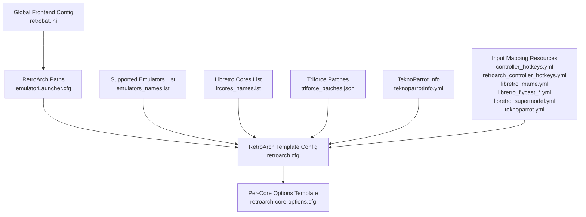
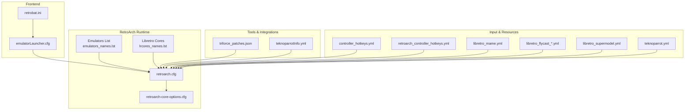
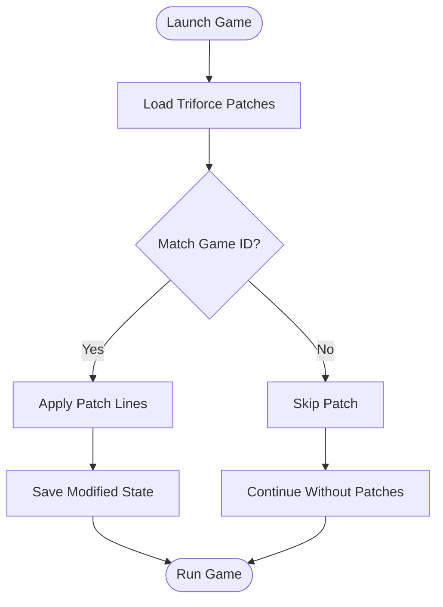
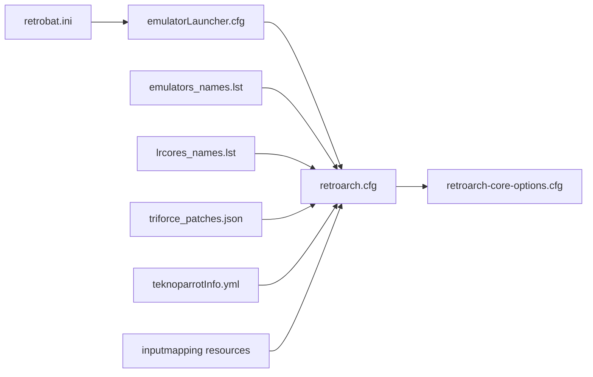

# Core Management

<cite>
**Referenced Files in This Document**
- [retrobat.ini](file://retrobat.ini)
- [emulatorLauncher.cfg](file://emulationstation/emulatorLauncher.cfg)
- [emulators_names.lst](file://system/configgen/emulators_names.lst)
- [lrcores_names.lst](file://system/configgen/lrcores_names.lst)
- [retroarch.cfg](file://system/templates/retroarch/retroarch.cfg)
- [retroarch-core-options.cfg](file://system/templates/retroarch/retroarch-core-options.cfg)
- [triforce_patches.json](file://system/tools/triforce_patches.json)
- [teknoparrotInfo.yml](file://system/tools/teknoparrotInfo.yml)
- [controller_hotkeys.yml](file://system/resources/inputmapping/controller_hotkeys.yml)
- [retroarch_controller_hotkeys.yml](file://system/resources/inputmapping/retroarch_controller_hotkeys.yml)
- [libretro_mame.yml](file://system/resources/inputmapping/libretro_mame.yml)
- [libretro_flycast_atomiswave.yml](file://system/resources/inputmapping/libretro_flycast_atomiswave.yml)
- [libretro_flycast_naomi.yml](file://system/resources/inputmapping/libretro_flycast_naomi.yml)
- [libretro_flycast_naomi2.yml](file://system/resources/inputmapping/libretro_flycast_naomi2.yml)
- [libretro_supermodel.yml](file://system/resources/inputmapping/libretro_supermodel.yml)
- [teknoparrot.yml](file://system/resources/inputmapping/teknoparrot.yml)
- [kb_hotkeys.yml](file://system/resources/inputmapping/kb_hotkeys.yml)
- [retroarch.cfg (partial)](file://system/templates/retroarch/retroarch.cfg)
- [retroarch-core-options.cfg (partial)](file://system/templates/retroarch/retroarch-core-options.cfg)
</cite>

## Table of Contents
1. [Introduction](#introduction)
2. [Project Structure](#project-structure)
3. [Core Components](#core-components)
4. [Architecture Overview](#architecture-overview)
5. [Detailed Component Analysis](#detailed-component-analysis)
6. [Dependency Analysis](#dependency-analysis)
7. [Performance Considerations](#performance-considerations)
8. [Troubleshooting Guide](#troubleshooting-guide)
9. [Conclusion](#conclusion)
10. [Appendices](#appendices)

## Introduction
This document explains core management within the emulator system, focusing on Libretro core integration for RetroArch. It covers core installation, selection, configuration, naming conventions, version management, compatibility considerations, platform-specific cores, custom cores, third-party repositories, configuration examples, shader associations, performance settings, core patching (Triforce patches, TeknoParrot integrations), troubleshooting, and the relationship between cores and emulator performance, compatibility, and feature availability.

## Project Structure
The core management system centers around:
- Global configuration for the frontend and RetroArch
- Centralized lists of supported emulators and Libretro cores
- RetroArch global and per-core configuration templates
- Tools for core patching and third-party integrations
- Input mapping resources for controllers and peripherals

**Diagram sources**
- [retrobat.ini:1-94](file://retrobat.ini#L1-L94)
- [emulatorLauncher.cfg:1-12](file://emulationstation/emulatorLauncher.cfg#L1-L12)
- [retroarch.cfg:1-800](file://system/templates/retroarch/retroarch.cfg#L1-L800)
- [retroarch-core-options.cfg:1-800](file://system/templates/retroarch/retroarch-core-options.cfg#L1-L800)
- [emulators_names.lst:1-130](file://system/configgen/emulators_names.lst#L1-L130)
- [lrcores_names.lst:1-156](file://system/configgen/lrcores_names.lst#L1-L156)
- [triforce_patches.json:1-226](file://system/tools/triforce_patches.json#L1-L226)
- [teknoparrotInfo.yml:1-28](file://system/tools/teknoparrotInfo.yml#L1-L28)
- [controller_hotkeys.yml](file://system/resources/inputmapping/controller_hotkeys.yml)
- [retroarch_controller_hotkeys.yml](file://system/resources/inputmapping/retroarch_controller_hotkeys.yml)
- [libretro_mame.yml](file://system/resources/inputmapping/libretro_mame.yml)
- [libretro_flycast_atomiswave.yml](file://system/resources/inputmapping/libretro_flycast_atomiswave.yml)
- [libretro_flycast_naomi.yml](file://system/resources/inputmapping/libretro_flycast_naomi.yml)
- [libretro_flycast_naomi2.yml](file://system/resources/inputmapping/libretro_flycast_naomi2.yml)
- [libretro_supermodel.yml](file://system/resources/inputmapping/libretro_supermodel.yml)
- [teknoparrot.yml](file://system/resources/inputmapping/teknoparrot.yml)

**Section sources**
- [retrobat.ini:1-94](file://retrobat.ini#L1-L94)
- [emulatorLauncher.cfg:1-12](file://emulationstation/emulatorLauncher.cfg#L1-L12)
- [emulators_names.lst:1-130](file://system/configgen/emulators_names.lst#L1-L130)
- [lrcores_names.lst:1-156](file://system/configgen/lrcores_names.lst#L1-L156)

## Core Components
- Global frontend configuration controls splash screen, interface mode, and display settings.
- RetroArch path configuration defines locations for BIOS, saves, shaders, filters, decorations, and achievements sounds.
- Supported emulator and Libretro core lists enumerate available integrations.
- RetroArch template configuration provides defaults for audio, input, overlays, core updates, and content history.
- Per-core options template centralizes core-specific tuning (e.g., video filters, CPU/GPU overclocking, memory card modes).
- Patching and third-party integration tools enable specialized game modifications and hardware support.

**Section sources**
- [retrobat.ini:1-94](file://retrobat.ini#L1-L94)
- [emulatorLauncher.cfg:1-12](file://emulationstation/emulatorLauncher.cfg#L1-L12)
- [emulators_names.lst:1-130](file://system/configgen/emulators_names.lst#L1-L130)
- [lrcores_names.lst:1-156](file://system/configgen/lrcores_names.lst#L1-L156)
- [retroarch.cfg:1-800](file://system/templates/retroarch/retroarch.cfg#L1-L800)
- [retroarch-core-options.cfg:1-800](file://system/templates/retroarch/retroarch-core-options.cfg#L1-L800)
- [triforce_patches.json:1-226](file://system/tools/triforce_patches.json#L1-L226)
- [teknoparrotInfo.yml:1-28](file://system/tools/teknoparrotInfo.yml#L1-L28)

## Architecture Overview
The core management architecture ties together frontend configuration, RetroArch runtime, and per-system resources. The frontend sets environment and paths; RetroArch consumes templates and per-game overrides; input mapping and patching tools enhance compatibility and usability.

**Diagram sources**
- [retrobat.ini:1-94](file://retrobat.ini#L1-L94)
- [emulatorLauncher.cfg:1-12](file://emulationstation/emulatorLauncher.cfg#L1-L12)
- [retroarch.cfg:1-800](file://system/templates/retroarch/retroarch.cfg#L1-L800)
- [retroarch-core-options.cfg:1-800](file://system/templates/retroarch/retroarch-core-options.cfg#L1-L800)
- [lrcores_names.lst:1-156](file://system/configgen/lrcores_names.lst#L1-L156)
- [emulators_names.lst:1-130](file://system/configgen/emulators_names.lst#L1-L130)
- [triforce_patches.json:1-226](file://system/tools/triforce_patches.json#L1-L226)
- [teknoparrotInfo.yml:1-28](file://system/tools/teknoparrotInfo.yml#L1-L28)
- [controller_hotkeys.yml](file://system/resources/inputmapping/controller_hotkeys.yml)
- [retroarch_controller_hotkeys.yml](file://system/resources/inputmapping/retroarch_controller_hotkeys.yml)
- [libretro_mame.yml](file://system/resources/inputmapping/libretro_mame.yml)
- [libretro_flycast_atomiswave.yml](file://system/resources/inputmapping/libretro_flycast_atomiswave.yml)
- [libretro_flycast_naomi.yml](file://system/resources/inputmapping/libretro_flycast_naomi.yml)
- [libretro_flycast_naomi2.yml](file://system/resources/inputmapping/libretro_flycast_naomi2.yml)
- [libretro_supermodel.yml](file://system/resources/inputmapping/libretro_supermodel.yml)
- [teknoparrot.yml](file://system/resources/inputmapping/teknoparrot.yml)

## Detailed Component Analysis

### Libretro Core Integration and Selection
- Supported emulators and Libretro cores are enumerated in dedicated lists. These lists inform discovery and selection within the frontend and RetroArch.
- RetroArch template configuration establishes default behaviors for core updates, content history, and core options persistence.

Key configuration anchors:
- Emulator enumeration: [emulators_names.lst](file://system/configgen/emulators_names.lst)
- Libretro core enumeration: [lrcores_names.lst](file://system/configgen/lrcores_names.lst)
- RetroArch defaults: [retroarch.cfg](file://system/templates/retroarch/retroarch.cfg)

Selection flow:
- The frontend resolves emulator/system mappings using the emulators list.
- RetroArch selects cores based on the lrcores list and per-game content.
- Core options are applied from the per-core options template.

**Section sources**
- [emulators_names.lst:1-130](file://system/configgen/emulators_names.lst#L1-L130)
- [lrcores_names.lst:1-156](file://system/configgen/lrcores_names.lst#L1-L156)
- [retroarch.cfg:1-800](file://system/templates/retroarch/retroarch.cfg#L1-L800)

### Core Installation and Third-Party Repositories
- RetroArch’s core updater URLs are configured in the template. Nightly builds and assets are fetched from buildbot endpoints.
- Auto-backup and extraction settings control how cores are managed during updates.

Relevant settings:
- Buildbot cores URL: [retroarch.cfg:140-142](file://system/templates/retroarch/retroarch.cfg#L140-L142)
- Auto-backup and extract: [retroarch.cfg:137-139](file://system/templates/retroarch/retroarch.cfg#L137-L139)

Operational flow:
- On update triggers, RetroArch downloads cores from the configured buildbot URL.
- Extracted archives are placed under the configured core assets directory.
- Backups preserve previous core versions when updating.

**Section sources**
- [retroarch.cfg:137-142](file://system/templates/retroarch/retroarch.cfg#L137-L142)

### Core Naming Conventions and Version Management
- Core names in the lrcores list reflect Libretro naming. These names are used by RetroArch to identify and load cores.
- Version management is handled by the core updater and auto-backup mechanisms.

Naming and versioning anchors:
- Core list: [lrcores_names.lst:1-156](file://system/configgen/lrcores_names.lst#L1-L156)
- Core updater settings: [retroarch.cfg:137-142](file://system/templates/retroarch/retroarch.cfg#L137-L142)

Compatibility matrix concept:
- The lrcores list acts as a compatibility matrix for supported cores.
- Per-core options define tunable parameters for each core, enabling fine-grained compatibility and performance control.

**Section sources**
- [lrcores_names.lst:1-156](file://system/configgen/lrcores_names.lst#L1-L156)
- [retroarch.cfg:137-142](file://system/templates/retroarch/retroarch.cfg#L137-L142)

### Platform-Specific Cores and Custom Cores
- Platform-specific cores are represented by their Libretro identifiers in the lrcores list.
- Custom cores can be integrated by placing them in the core assets directory and ensuring they match the expected Libretro naming convention.

Integration anchors:
- Core assets directory: [retroarch.cfg:130](file://system/templates/retroarch/retroarch.cfg#L130)
- Core info cache: [retroarch.cfg:131](file://system/templates/retroarch/retroarch.cfg#L131)

**Section sources**
- [retroarch.cfg:130-131](file://system/templates/retroarch/retroarch.cfg#L130-L131)

### Core Configuration Files and Shader Associations
- RetroArch template configuration defines default paths for assets, database, content history, and core assets.
- Shader associations are controlled via RetroArch’s shader pipeline and can be toggled globally or per-core.

Configuration anchors:
- Paths and directories: [emulatorLauncher.cfg:4-12](file://emulationstation/emulatorLauncher.cfg#L4-L12)
- Content history and favorites: [retroarch.cfg:101-127](file://system/templates/retroarch/retroarch.cfg#L101-L127)
- Shader enable flag: [retroarch.cfg:48](file://system/templates/retroarch/retroarch.cfg#L48)

Practical example references:
- RetroArch template (global): [retroarch.cfg:1-800](file://system/templates/retroarch/retroarch.cfg#L1-L800)
- Per-core options (example entries): [retroarch-core-options.cfg:1-800](file://system/templates/retroarch/retroarch-core-options.cfg#L1-L800)

**Section sources**
- [emulatorLauncher.cfg:4-12](file://emulationstation/emulatorLauncher.cfg#L4-L12)
- [retroarch.cfg:48](file://system/templates/retroarch/retroarch.cfg#L48)
- [retroarch.cfg:101-127](file://system/templates/retroarch/retroarch.cfg#L101-L127)
- [retroarch.cfg:130-131](file://system/templates/retroarch/retroarch.cfg#L130-L131)

### Performance Settings and Tuning
- Performance-related settings include audio latency, rate control, resampler quality, fastforward frameskip, and autosave intervals.
- Per-core options include GPU/CPU overclocking, internal resolution scaling, and renderer choices.

Performance anchors:
- Audio and timing: [retroarch.cfg:17-44](file://system/templates/retroarch/retroarch.cfg#L17-L44)
- Fastforward and frameskip: [retroarch.cfg:167-168](file://system/templates/retroarch/retroarch.cfg#L167-L168)
- Autosave interval: [retroarch.cfg:49](file://system/templates/retroarch/retroarch.cfg#L49)
- Per-core examples (GPU/CPU): [retroarch-core-options.cfg:88-147](file://system/templates/retroarch/retroarch-core-options.cfg#L88-L147)

**Section sources**
- [retroarch.cfg:17-44](file://system/templates/retroarch/retroarch.cfg#L17-L44)
- [retroarch.cfg:167-168](file://system/templates/retroarch/retroarch.cfg#L167-L168)
- [retroarch.cfg:49](file://system/templates/retroarch/retroarch.cfg#L49)
- [retroarch-core-options.cfg:88-147](file://system/templates/retroarch/retroarch-core-options.cfg#L88-L147)

### Core Patching System (Triforce Patches)
- Triforce patches define game-specific modifications for titles like F-Zero AX, Mario Kart GP, and VS4 variants.
- Patches are structured with identifiers, patch features, names, and instruction lines.

Patch anchors:
- Patches JSON: [triforce_patches.json:1-226](file://system/tools/triforce_patches.json#L1-L226)

**Diagram sources**
- [triforce_patches.json:1-226](file://system/tools/triforce_patches.json#L1-L226)

**Section sources**
- [triforce_patches.json:1-226](file://system/tools/triforce_patches.json#L1-L226)

### TeknoParrot Integration
- TeknoParrot profiles specify executable names and optional launch profiles for arcade hardware integrations.
- Input mapping resources support wheel and gun peripherals for compatible arcade cores.

Integration anchors:
- Executable mappings: [teknoparrotInfo.yml:1-28](file://system/tools/teknoparrotInfo.yml#L1-L28)
- Wheel and gun mappings: [libretro_flycast_atomiswave.yml](file://system/resources/inputmapping/libretro_flycast_atomiswave.yml), [libretro_flycast_naomi.yml](file://system/resources/inputmapping/libretro_flycast_naomi.yml), [libretro_flycast_naomi2.yml](file://system/resources/inputmapping/libretro_flycast_naomi2.yml), [teknoparrot.yml](file://system/resources/inputmapping/teknoparrot.yml)

**Section sources**
- [teknoparrotInfo.yml:1-28](file://system/tools/teknoparrotInfo.yml#L1-L28)
- [libretro_flycast_atomiswave.yml](file://system/resources/inputmapping/libretro_flycast_atomiswave.yml)
- [libretro_flycast_naomi.yml](file://system/resources/inputmapping/libretro_flycast_naomi.yml)
- [libretro_flycast_naomi2.yml](file://system/resources/inputmapping/libretro_flycast_naomi2.yml)
- [teknoparrot.yml](file://system/resources/inputmapping/teknoparrot.yml)

### Input Mapping and Hotkeys
- RetroArch hotkeys and controller mappings are defined in YAML resources for various systems and peripherals.
- Keyboard and controller hotkeys are centralized for consistent behavior across cores.

Mapping anchors:
- Controller hotkeys: [retroarch_controller_hotkeys.yml](file://system/resources/inputmapping/retroarch_controller_hotkeys.yml)
- General controller hotkeys: [controller_hotkeys.yml](file://system/resources/inputmapping/controller_hotkeys.yml)
- Keyboard hotkeys: [kb_hotkeys.yml](file://system/resources/inputmapping/kb_hotkeys.yml)
- MAME-specific mappings: [libretro_mame.yml](file://system/resources/inputmapping/libretro_mame.yml)
- Supermodel mappings: [libretro_supermodel.yml](file://system/resources/inputmapping/libretro_supermodel.yml)

**Section sources**
- [retroarch_controller_hotkeys.yml](file://system/resources/inputmapping/retroarch_controller_hotkeys.yml)
- [controller_hotkeys.yml](file://system/resources/inputmapping/controller_hotkeys.yml)
- [kb_hotkeys.yml](file://system/resources/inputmapping/kb_hotkeys.yml)
- [libretro_mame.yml](file://system/resources/inputmapping/libretro_mame.yml)
- [libretro_supermodel.yml](file://system/resources/inputmapping/libretro_supermodel.yml)

## Dependency Analysis
The core management system exhibits low coupling between components:
- Frontend configuration depends on RetroArch path definitions.
- RetroArch depends on core lists and templates for discovery and behavior.
- Tools and integrations augment functionality without altering core templates.

**Diagram sources**
- [retrobat.ini:1-94](file://retrobat.ini#L1-L94)
- [emulatorLauncher.cfg:1-12](file://emulationstation/emulatorLauncher.cfg#L1-L12)
- [retroarch.cfg:1-800](file://system/templates/retroarch/retroarch.cfg#L1-L800)
- [retroarch-core-options.cfg:1-800](file://system/templates/retroarch/retroarch-core-options.cfg#L1-L800)
- [emulators_names.lst:1-130](file://system/configgen/emulators_names.lst#L1-L130)
- [lrcores_names.lst:1-156](file://system/configgen/lrcores_names.lst#L1-L156)
- [triforce_patches.json:1-226](file://system/tools/triforce_patches.json#L1-L226)
- [teknoparrotInfo.yml:1-28](file://system/tools/teknoparrotInfo.yml#L1-L28)

**Section sources**
- [retrobat.ini:1-94](file://retrobat.ini#L1-L94)
- [emulatorLauncher.cfg:1-12](file://emulationstation/emulatorLauncher.cfg#L1-L12)
- [retroarch.cfg:1-800](file://system/templates/retroarch/retroarch.cfg#L1-L800)
- [retroarch-core-options.cfg:1-800](file://system/templates/retroarch/retroarch-core-options.cfg#L1-L800)
- [emulators_names.lst:1-130](file://system/configgen/emulators_names.lst#L1-L130)
- [lrcores_names.lst:1-156](file://system/configgen/lrcores_names.lst#L1-L156)
- [triforce_patches.json:1-226](file://system/tools/triforce_patches.json#L1-L226)
- [teknoparrotInfo.yml:1-28](file://system/tools/teknoparrotInfo.yml#L1-L28)

## Performance Considerations
- Audio latency and resampler quality impact responsiveness and sound fidelity.
- Frameskip and fastforward settings affect frame pacing and input lag.
- Per-core overclocking and internal resolution scaling can improve visual quality but may increase CPU/GPU load.
- Autosave intervals balance safety against disk I/O overhead.

Recommendations anchored in templates:
- Audio and resampler: [retroarch.cfg:17-44](file://system/templates/retroarch/retroarch.cfg#L17-L44)
- Frameskip/fastforward: [retroarch.cfg:167-168](file://system/templates/retroarch/retroarch.cfg#L167-L168)
- Per-core GPU/CPU tuning: [retroarch-core-options.cfg:88-147](file://system/templates/retroarch/retroarch-core-options.cfg#L88-L147)

**Section sources**
- [retroarch.cfg:17-44](file://system/templates/retroarch/retroarch.cfg#L17-L44)
- [retroarch.cfg:167-168](file://system/templates/retroarch/retroarch.cfg#L167-L168)
- [retroarch-core-options.cfg:88-147](file://system/templates/retroarch/retroarch-core-options.cfg#L88-L147)

## Troubleshooting Guide
Common issues and resolutions:
- Missing cores
  - Verify core list and updater settings. Ensure the buildbot URL is reachable and extraction is enabled.
  - References: [lrcores_names.lst:1-156](file://system/configgen/lrcores_names.lst#L1-L156), [retroarch.cfg:137-142](file://system/templates/retroarch/retroarch.cfg#L137-L142)

- Core update failures
  - Check auto-backup and extract settings. Confirm core assets directory permissions.
  - References: [retroarch.cfg:137-139](file://system/templates/retroarch/retroarch.cfg#L137-L139), [retroarch.cfg:130](file://system/templates/retroarch/retroarch.cfg#L130)

- Shader or overlay issues
  - Toggle shader enable flag and verify shader directory paths.
  - References: [retroarch.cfg:48](file://system/templates/retroarch/retroarch.cfg#L48), [emulatorLauncher.cfg:8](file://emulationstation/emulatorLauncher.cfg#L8)

- Input mapping conflicts
  - Review controller hotkeys and system-specific mappings; adjust bindings to avoid conflicts.
  - References: [retroarch_controller_hotkeys.yml](file://system/resources/inputmapping/retroarch_controller_hotkeys.yml), [libretro_mame.yml](file://system/resources/inputmapping/libretro_mame.yml)

**Section sources**
- [lrcores_names.lst:1-156](file://system/configgen/lrcores_names.lst#L1-L156)
- [retroarch.cfg:137-142](file://system/templates/retroarch/retroarch.cfg#L137-L142)
- [retroarch.cfg:137-139](file://system/templates/retroarch/retroarch.cfg#L137-L139)
- [retroarch.cfg:130](file://system/templates/retroarch/retroarch.cfg#L130)
- [retroarch.cfg:48](file://system/templates/retroarch/retroarch.cfg#L48)
- [emulatorLauncher.cfg:8](file://emulationstation/emulatorLauncher.cfg#L8)
- [retroarch_controller_hotkeys.yml](file://system/resources/inputmapping/retroarch_controller_hotkeys.yml)
- [libretro_mame.yml](file://system/resources/inputmapping/libretro_mame.yml)

## Conclusion
Core management in this system relies on a robust template-driven configuration for RetroArch, precise core enumeration, and complementary tools for patching and peripheral integration. By leveraging the provided configuration anchors and resources, operators can reliably install, select, configure, and troubleshoot cores while optimizing performance and compatibility across diverse platforms and games.

## Appendices

### Practical Examples (by file reference)
- RetroArch global configuration: [retroarch.cfg:1-800](file://system/templates/retroarch/retroarch.cfg#L1-L800)
- Per-core options (selected): [retroarch-core-options.cfg:1-800](file://system/templates/retroarch/retroarch-core-options.cfg#L1-L800)
- Triforce patches: [triforce_patches.json:1-226](file://system/tools/triforce_patches.json#L1-L226)
- TeknoParrot mappings: [teknoparrotInfo.yml:1-28](file://system/tools/teknoparrotInfo.yml#L1-L28)
- Input mapping resources:
  - [controller_hotkeys.yml](file://system/resources/inputmapping/controller_hotkeys.yml)
  - [retroarch_controller_hotkeys.yml](file://system/resources/inputmapping/retroarch_controller_hotkeys.yml)
  - [libretro_mame.yml](file://system/resources/inputmapping/libretro_mame.yml)
  - [libretro_flycast_atomiswave.yml](file://system/resources/inputmapping/libretro_flycast_atomiswave.yml)
  - [libretro_flycast_naomi.yml](file://system/resources/inputmapping/libretro_flycast_naomi.yml)
  - [libretro_flycast_naomi2.yml](file://system/resources/inputmapping/libretro_flycast_naomi2.yml)
  - [libretro_supermodel.yml](file://system/resources/inputmapping/libretro_supermodel.yml)
  - [teknoparrot.yml](file://system/resources/inputmapping/teknoparrot.yml)