# Emulator Management

<cite>
**Referenced Files in This Document**
- [emulatorLauncher.cfg](file://emulationstation/emulatorLauncher.cfg)
- [templates_files.lst](file://system/configgen/templates_files.lst)
- [emulators_names.lst](file://system/configgen/emulators_names.lst)
- [systems_names.lst](file://system/configgen/systems_names.lst)
- [lrcores_names.lst](file://system/configgen/lrcores_names.lst)
- [retroarch.cfg](file://system/templates/retroarch/retroarch.cfg)
- [retroarch-core-options.cfg](file://system/templates/retroarch/retroarch-core-options.cfg)
- [fmtownsux.ini](file://system/templates/mame/ini/fmtownsux.ini)
- [Dolphin.ini](file://system/templates/dolphin-emu/User\Config\Dolphin.ini)
- [qt-config.ini](file://system/templates/citra/user\config\qt-config.ini)
- [portable.ini](file://system/templates/pcsx2/portable.ini)
- [PCSX2.ini](file://system/templates/pcsx2/inis\PCSX2.ini)
- [X-Arcade.cfg](file://system/templates/mame/ctrlr/X-Arcade.cfg)
- [retroarch_controller.json](file://system/resources/inputmapping/retroarch_controller.json)
- [controller_hotkeys.yml](file://system/resources/inputmapping/controller_hotkeys.yml)
</cite>

## Table of Contents
1. [Introduction](#introduction)
2. [Project Structure](#project-structure)
3. [Core Components](#core-components)
4. [Architecture Overview](#architecture-overview)
5. [Detailed Component Analysis](#detailed-component-analysis)
6. [Dependency Analysis](#dependency-analysis)
7. [Performance Considerations](#performance-considerations)
8. [Troubleshooting Guide](#troubleshooting-guide)
9. [Conclusion](#conclusion)
10. [Appendices](#appendices)

## Introduction
This document explains the emulator management system that powers a template-based configuration framework for more than 200 emulators across 240+ gaming platforms. It covers how the system discovers emulators and platforms, how it deploys configuration templates, and how it coordinates launching emulators via emulatorLauncher.exe. It also documents configuration options per emulator category, core selection for RetroArch, input mapping integration, and practical guidance for common setup issues on Windows.

## Project Structure
The emulator management system centers around:
- A central configuration registry that enumerates emulators, platforms, and RetroArch cores
- A template catalog that maps source configuration files to target locations
- Emulator-specific configuration files and directories
- Input mapping resources for controllers and hotkeys
- A launcher configuration that defines shared paths for BIOS, saves, screenshots, shaders, and decorations

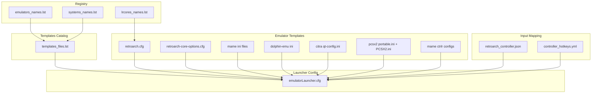

**Diagram sources**
- [emulators_names.lst:1-130](file://system/configgen/emulators_names.lst#L1-L130)
- [systems_names.lst:1-241](file://system/configgen/systems_names.lst#L1-L241)
- [lrcores_names.lst:1-156](file://system/configgen/lrcores_names.lst#L1-L156)
- [templates_files.lst:1-215](file://system/configgen/templates_files.lst#L1-L215)
- [emulatorLauncher.cfg:1-12](file://emulationstation/emulatorLauncher.cfg#L1-L12)
- [retroarch.cfg:1-800](file://system/templates/retroarch/retroarch.cfg#L1-L800)
- [retroarch-core-options.cfg:1-200](file://system/templates/retroarch/retroarch-core-options.cfg#L1-L200)
- [fmtownsux.ini:1-486](file://system/templates/mame/ini/fmtownsux.ini#L1-L486)
- [Dolphin.ini:1-58](file://system/templates/dolphin-emu/User\Config\Dolphin.ini#L1-L58)
- [qt-config.ini:1-648](file://system/templates/citra/user\config\qt-config.ini#L1-L648)
- [portable.ini:1-2](file://system/templates/pcsx2/portable.ini#L1-L2)
- [PCSX2.ini:1-200](file://system/templates/pcsx2/inis\PCSX2.ini#L1-L200)
- [X-Arcade.cfg:1-184](file://system/templates/mame/ctrlr/X-Arcade.cfg#L1-L184)
- [retroarch_controller.json:1-362](file://system/resources/inputmapping/retroarch_controller.json#L1-L362)
- [controller_hotkeys.yml:1-38](file://system/resources/inputmapping/controller_hotkeys.yml#L1-L38)

**Section sources**
- [emulators_names.lst:1-130](file://system/configgen/emulators_names.lst#L1-L130)
- [systems_names.lst:1-241](file://system/configgen/systems_names.lst#L1-L241)
- [lrcores_names.lst:1-156](file://system/configgen/lrcores_names.lst#L1-L156)
- [templates_files.lst:1-215](file://system/configgen/templates_files.lst#L1-L215)
- [emulatorLauncher.cfg:1-12](file://emulationstation/emulatorLauncher.cfg#L1-L12)

## Core Components
- Emulator registry: Lists supported emulators (e.g., retroarch, pcsx2, citra, dolphin-emu, mame).
- Platform registry: Lists supported platforms (e.g., nes, snes, n64, psx, switch).
- Core registry: Lists RetroArch core names used for core selection and options.
- Template catalog: Maps source template files to destination locations for installation.
- Launcher configuration: Defines shared paths for BIOS, saves, screenshots, shaders, decorations.
- Emulator templates: Per-emulator configuration files and directories.
- Input mapping: JSON and YAML resources for controller mappings and hotkeys.

**Section sources**
- [emulators_names.lst:1-130](file://system/configgen/emulators_names.lst#L1-L130)
- [systems_names.lst:1-241](file://system/configgen/systems_names.lst#L1-L241)
- [lrcores_names.lst:1-156](file://system/configgen/lrcores_names.lst#L1-L156)
- [templates_files.lst:1-215](file://system/configgen/templates_files.lst#L1-L215)
- [emulatorLauncher.cfg:1-12](file://emulationstation/emulatorLauncher.cfg#L1-L12)

## Architecture Overview
The system orchestrates three primary flows:
- Discovery: Reads registries to build the set of available emulators, platforms, and cores.
- Installation: Uses the template catalog to copy or extract template files to target locations.
- Launch Coordination: Applies platform-specific and emulator-specific configuration, selects cores, and starts the emulator process.

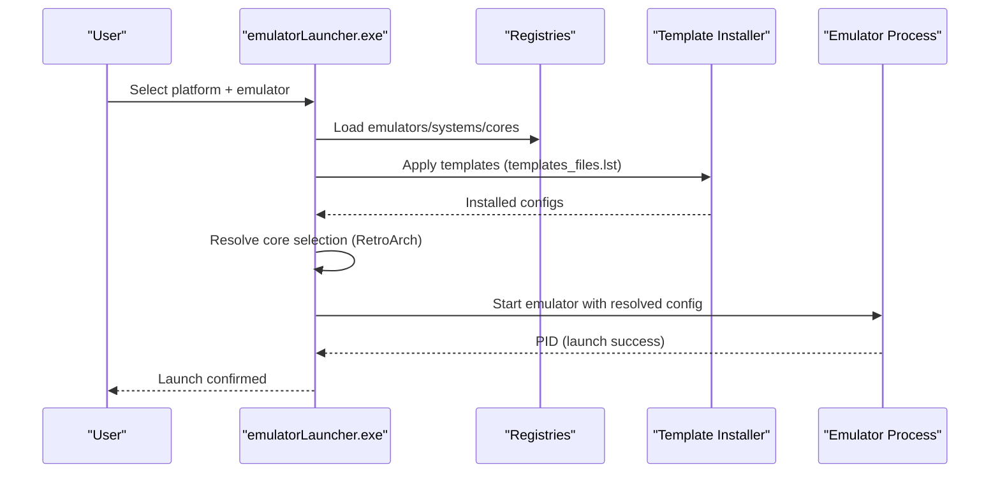

**Diagram sources**
- [templates_files.lst:1-215](file://system/configgen/templates_files.lst#L1-L215)
- [emulatorLauncher.cfg:1-12](file://emulationstation/emulatorLauncher.cfg#L1-L12)
- [retroarch.cfg:1-800](file://system/templates/retroarch/retroarch.cfg#L1-L800)
- [retroarch-core-options.cfg:1-200](file://system/templates/retroarch/retroarch-core-options.cfg#L1-L200)

## Detailed Component Analysis

### Template-Based Installation System
The template catalog defines how source files are deployed to target locations. It supports:
- Single-file deployments (e.g., config.ini to emulator directory)
- Directory extraction (e.g., zip archives expanded to target folders)
- Cross-platform path normalization and relative paths

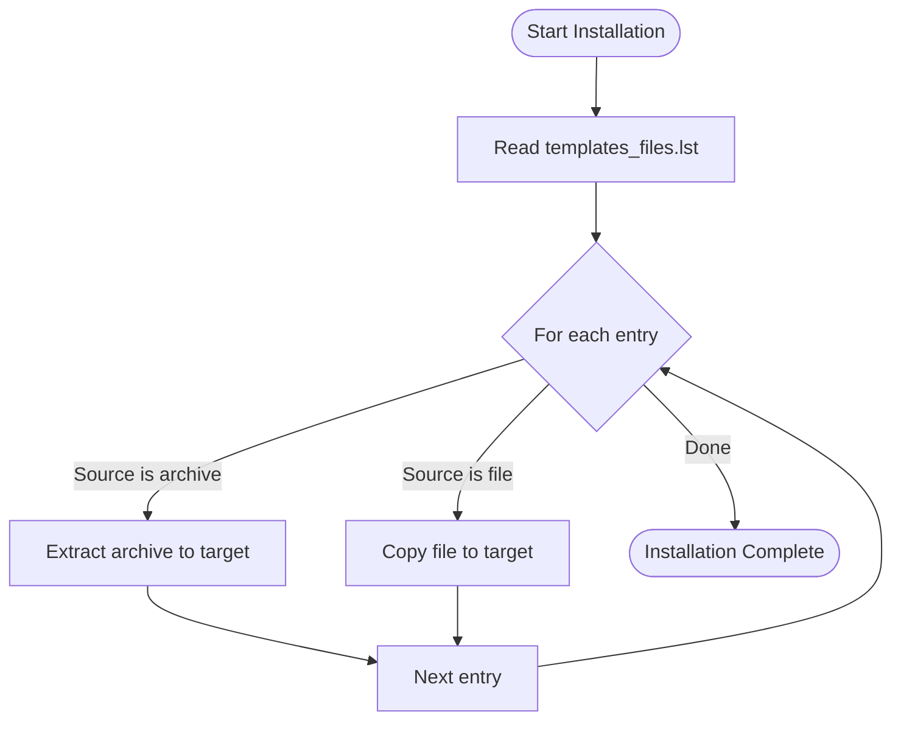

**Diagram sources**
- [templates_files.lst:1-215](file://system/configgen/templates_files.lst#L1-L215)

**Section sources**
- [templates_files.lst:1-215](file://system/configgen/templates_files.lst#L1-L215)

### Emulator Categories and Configuration Options

#### RetroArch
- Core selection: Choose a core from lrcores_names.lst and apply core-specific options from retroarch-core-options.cfg.
- Global configuration: retroarch.cfg controls input drivers, overlays, shaders, assets, and runtime behavior.
- Cores and options: The core options file enumerates per-core settings (e.g., beetle_psx_hw_*).

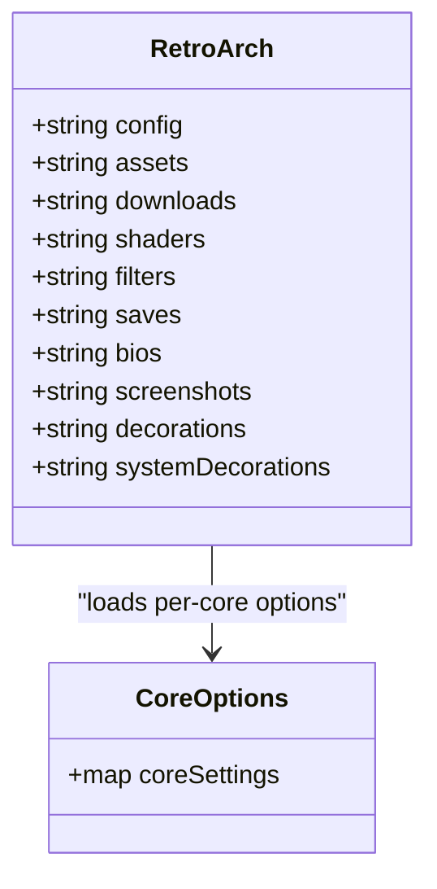

**Diagram sources**
- [retroarch.cfg:1-800](file://system/templates/retroarch/retroarch.cfg#L1-L800)
- [retroarch-core-options.cfg:1-200](file://system/templates/retroarch/retroarch-core-options.cfg#L1-L200)

**Section sources**
- [retroarch.cfg:1-800](file://system/templates/retroarch/retroarch.cfg#L1-L800)
- [retroarch-core-options.cfg:1-200](file://system/templates/retroarch/retroarch-core-options.cfg#L1-L200)
- [lrcores_names.lst:1-156](file://system/configgen/lrcores_names.lst#L1-L156)

#### MAME
- Paths and directories: fmtownsux.ini sets ROM, NVram, snapshots, and plugin paths.
- Input remapping: X-Arcade.cfg remaps keypad and joystick sequences to player ports.
- Save and state management: Controls autosave, rewind, and state directories.

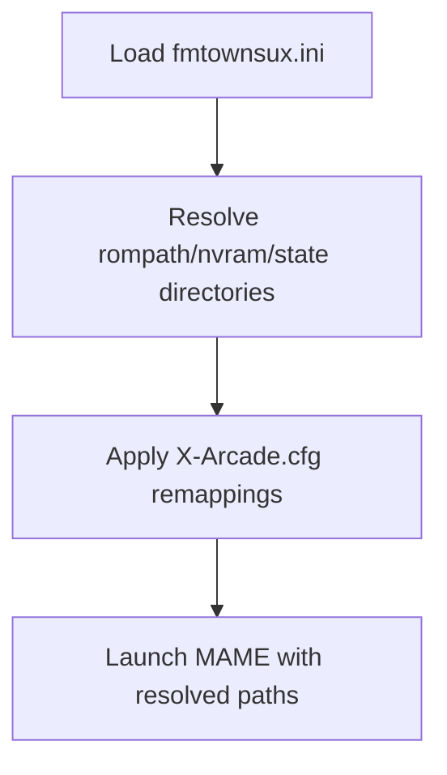

**Diagram sources**
- [fmtownsux.ini:1-486](file://system/templates/mame/ini/fmtownsux.ini#L1-L486)
- [X-Arcade.cfg:1-184](file://system/templates/mame/ctrlr/X-Arcade.cfg#L1-L184)

**Section sources**
- [fmtownsux.ini:1-486](file://system/templates/mame/ini/fmtownsux.ini#L1-L486)
- [X-Arcade.cfg:1-184](file://system/templates/mame/ctrlr/X-Arcade.cfg#L1-L184)

#### Dolphin (GameCube/Wii)
- Paths: Dolphin.ini defines ISO paths, NAND roots, dump/load paths, and resource packs.
- Behavior: Core options include CPU threading, fast boot, Wiimote scanning, and graphics backend.

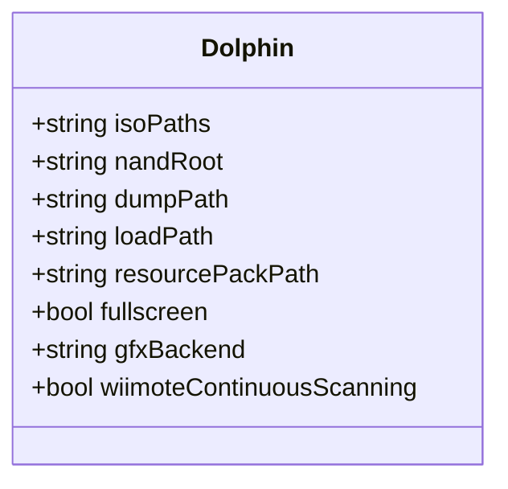

**Diagram sources**
- [Dolphin.ini:1-58](file://system/templates/dolphin-emu/User\Config\Dolphin.ini#L1-L58)

**Section sources**
- [Dolphin.ini:1-58](file://system/templates/dolphin-emu/User\Config\Dolphin.ini#L1-L58)

#### Citra (Nintendo 3DS)
- Controls: qt-config.ini maps keys and analog sticks to buttons and touch devices.
- Rendering: Renderer settings enable hardware acceleration, shader JIT, vsync, and resolution factor.
- Storage: NAND and SD card directories under saves.

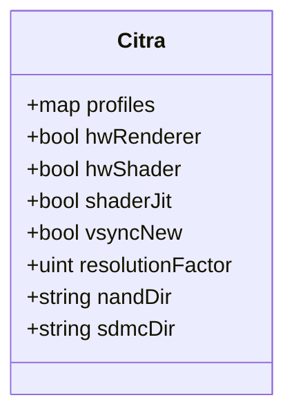

**Diagram sources**
- [qt-config.ini:1-648](file://system/templates/citra/user\config\qt-config.ini#L1-L648)

**Section sources**
- [qt-config.ini:1-648](file://system/templates/citra/user\config\qt-config.ini#L1-L648)

#### PCSX2
- UI and folders: portable.ini disables wizard; PCSX2.ini defines BIOS, savestates, memory cards, logs, and textures.
- Graphics and speed hacks: Extensive GS options and speedhack toggles.

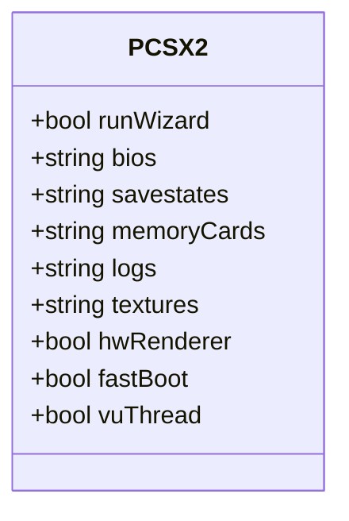

**Diagram sources**
- [portable.ini:1-2](file://system/templates/pcsx2/portable.ini#L1-L2)
- [PCSX2.ini:1-200](file://system/templates/pcsx2/inis\PCSX2.ini#L1-L200)

**Section sources**
- [portable.ini:1-2](file://system/templates/pcsx2/portable.ini#L1-L2)
- [PCSX2.ini:1-200](file://system/templates/pcsx2/inis\PCSX2.ini#L1-L200)

### Input Mapping and Hotkeys
- Controller mappings: retroarch_controller.json provides driver-specific mappings for libretro controllers and hotkeys.
- Hotkey overrides: controller_hotkeys.yml allows per-emulator and per-core hotkey rewrites for RetroArch.

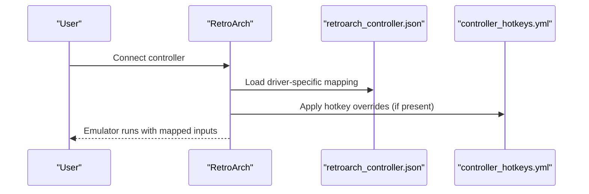

**Diagram sources**
- [retroarch_controller.json:1-362](file://system/resources/inputmapping/retroarch_controller.json#L1-L362)
- [controller_hotkeys.yml:1-38](file://system/resources/inputmapping/controller_hotkeys.yml#L1-L38)

**Section sources**
- [retroarch_controller.json:1-362](file://system/resources/inputmapping/retroarch_controller.json#L1-L362)
- [controller_hotkeys.yml:1-38](file://system/resources/inputmapping/controller_hotkeys.yml#L1-L38)

### Launch Coordination Workflow
The launcher resolves:
- Platform and emulator selection
- Template installation from templates_files.lst
- Core selection for RetroArch using lrcores_names.lst
- Input mapping and hotkeys
- Shared paths from emulatorLauncher.cfg

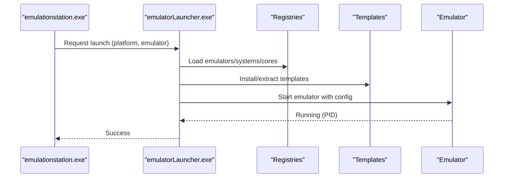

**Diagram sources**
- [emulatorLauncher.cfg:1-12](file://emulationstation/emulatorLauncher.cfg#L1-L12)
- [templates_files.lst:1-215](file://system/configgen/templates_files.lst#L1-L215)
- [emulators_names.lst:1-130](file://system/configgen/emulators_names.lst#L1-L130)
- [systems_names.lst:1-241](file://system/configgen/systems_names.lst#L1-L241)
- [lrcores_names.lst:1-156](file://system/configgen/lrcores_names.lst#L1-L156)

**Section sources**
- [emulatorLauncher.cfg:1-12](file://emulationstation/emulatorLauncher.cfg#L1-L12)

## Dependency Analysis
The system exhibits low coupling between components:
- Registries are independent and consumed by the installer and launcher.
- Templates are decoupled from emulators; installation is driven by the catalog.
- RetroArch depends on core names and core options; platform selection influences template targets.

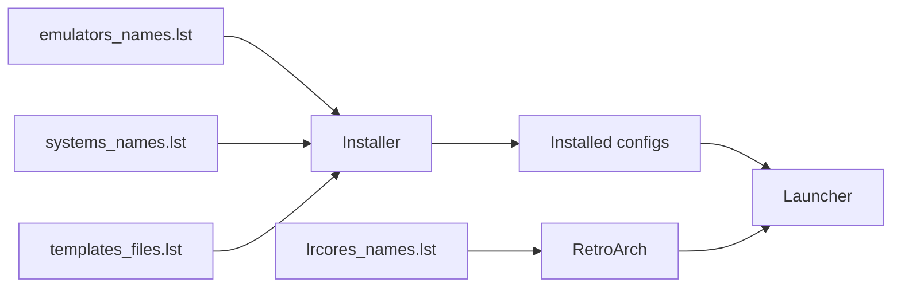

**Diagram sources**
- [emulators_names.lst:1-130](file://system/configgen/emulators_names.lst#L1-L130)
- [systems_names.lst:1-241](file://system/configgen/systems_names.lst#L1-L241)
- [lrcores_names.lst:1-156](file://system/configgen/lrcores_names.lst#L1-L156)
- [templates_files.lst:1-215](file://system/configgen/templates_files.lst#L1-L215)

**Section sources**
- [emulators_names.lst:1-130](file://system/configgen/emulators_names.lst#L1-L130)
- [systems_names.lst:1-241](file://system/configgen/systems_names.lst#L1-L241)
- [lrcores_names.lst:1-156](file://system/configgen/lrcores_names.lst#L1-L156)
- [templates_files.lst:1-215](file://system/configgen/templates_files.lst#L1-L215)

## Performance Considerations
- Template extraction: Prefer pre-extracted directories for large archives to reduce startup latency.
- RetroArch assets: Keep shaders and downloads organized to minimize load times.
- Graphics backends: Choose appropriate GPU backends and disable unnecessary effects for older hardware.
- Emulator-specific caches: Enable disk shader cache and texture caches where supported (e.g., Citra, PCSX2).

## Troubleshooting Guide
Common issues and resolutions:
- Missing BIOS or assets
  - Verify paths in emulatorLauncher.cfg and emulator-specific ini files.
  - Ensure templates were installed per templates_files.lst.
- RetroArch core not found
  - Confirm core name exists in lrcores_names.lst and retroarch.cfg references a valid core.
- Input not recognized
  - Check retroarch_controller.json for driver-specific mappings.
  - Review controller_hotkeys.yml for hotkey conflicts.
- MAME input confusion
  - Validate X-Arcade.cfg remappings and ensure keypad/joystick sequences match hardware.
- Dolphin paths invalid
  - Confirm ISO paths and NAND roots in Dolphin.ini exist and are writable.
- Citra rendering artifacts
  - Toggle hardware renderer, shader JIT, and vsync in qt-config.ini.
- PCSX2 performance
  - Adjust GS options, speedhacks, and enable fast boot in PCSX2.ini.

**Section sources**
- [emulatorLauncher.cfg:1-12](file://emulationstation/emulatorLauncher.cfg#L1-L12)
- [retroarch.cfg:1-800](file://system/templates/retroarch/retroarch.cfg#L1-L800)
- [retroarch-core-options.cfg:1-200](file://system/templates/retroarch/retroarch-core-options.cfg#L1-L200)
- [fmtownsux.ini:1-486](file://system/templates/mame/ini/fmtownsux.ini#L1-L486)
- [X-Arcade.cfg:1-184](file://system/templates/mame/ctrlr/X-Arcade.cfg#L1-L184)
- [Dolphin.ini:1-58](file://system/templates/dolphin-emu/User\Config\Dolphin.ini#L1-L58)
- [qt-config.ini:1-648](file://system/templates/citra/user\config\qt-config.ini#L1-L648)
- [PCSX2.ini:1-200](file://system/templates/pcsx2/inis\PCSX2.ini#L1-L200)
- [retroarch_controller.json:1-362](file://system/resources/inputmapping/retroarch_controller.json#L1-L362)
- [controller_hotkeys.yml:1-38](file://system/resources/inputmapping/controller_hotkeys.yml#L1-L38)

## Conclusion
The emulator management system leverages a robust template-based configuration framework to support a broad ecosystem of emulators and platforms. By centralizing discovery, installation, and launch coordination, it enables consistent and scalable emulator setups across Windows environments. RetroArch integration is first-class, with explicit core selection and per-core options. Emulator-specific configurations and input mapping resources ensure reliable operation and customization for diverse hardware and preferences.

## Appendices

### Appendix A: Example Template Entries
- RetroArch global and core options
  - [retroarch.cfg:1-800](file://system/templates/retroarch/retroarch.cfg#L1-L800)
  - [retroarch-core-options.cfg:1-200](file://system/templates/retroarch/retroarch-core-options.cfg#L1-L200)
- MAME configuration and input
  - [fmtownsux.ini:1-486](file://system/templates/mame/ini/fmtownsux.ini#L1-L486)
  - [X-Arcade.cfg:1-184](file://system/templates/mame/ctrlr/X-Arcade.cfg#L1-L184)
- Dolphin configuration
  - [Dolphin.ini:1-58](file://system/templates/dolphin-emu/User\Config\Dolphin.ini#L1-L58)
- Citra configuration
  - [qt-config.ini:1-648](file://system/templates/citra/user\config\qt-config.ini#L1-L648)
- PCSX2 configuration
  - [portable.ini:1-2](file://system/templates/pcsx2/portable.ini#L1-L2)
  - [PCSX2.ini:1-200](file://system/templates/pcsx2/inis\PCSX2.ini#L1-L200)

### Appendix B: Return Values and Success Indicators
- Successful launch is indicated by the emulator process starting and returning a valid process identifier (PID) to the launcher.
- Post-launch verification can include checking that expected save directories and logs exist according to the emulator’s configuration.