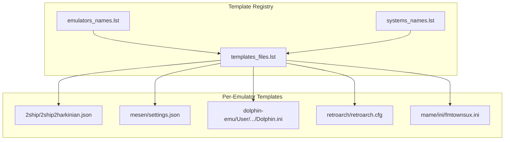
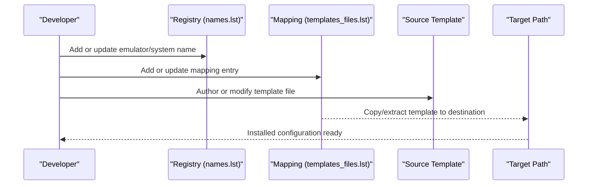
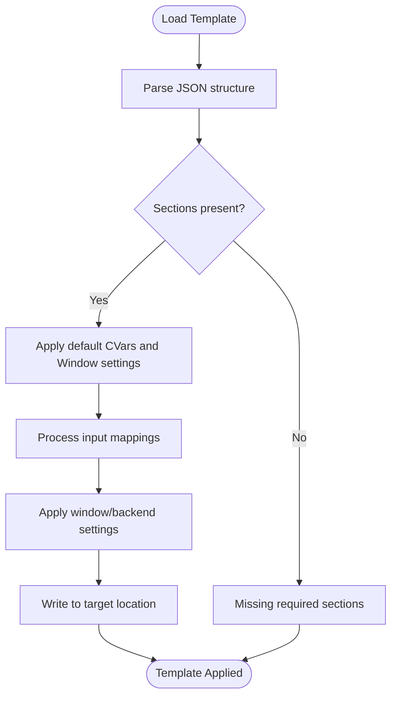
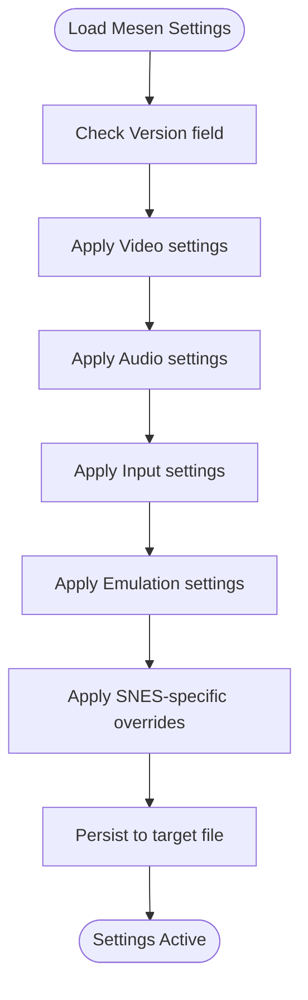
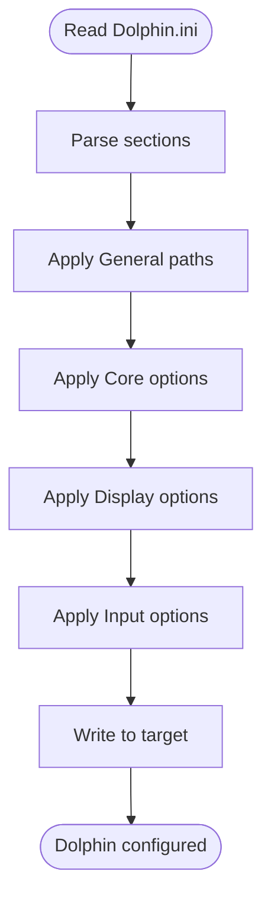
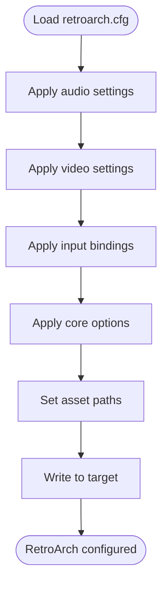
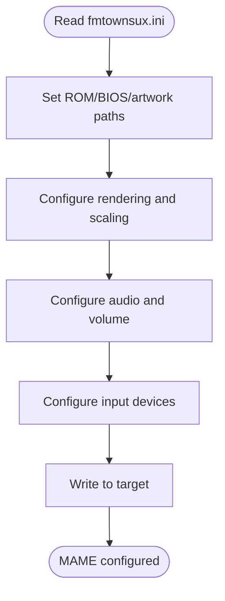
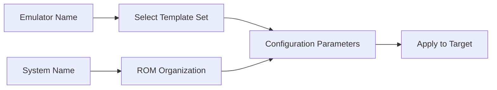
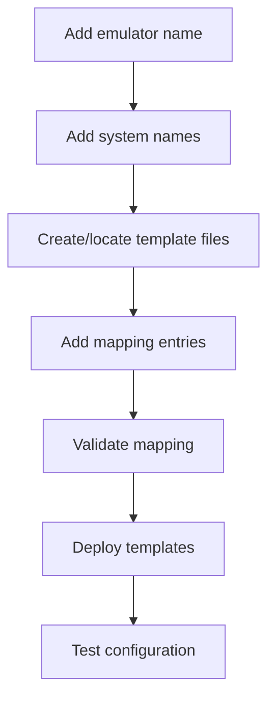
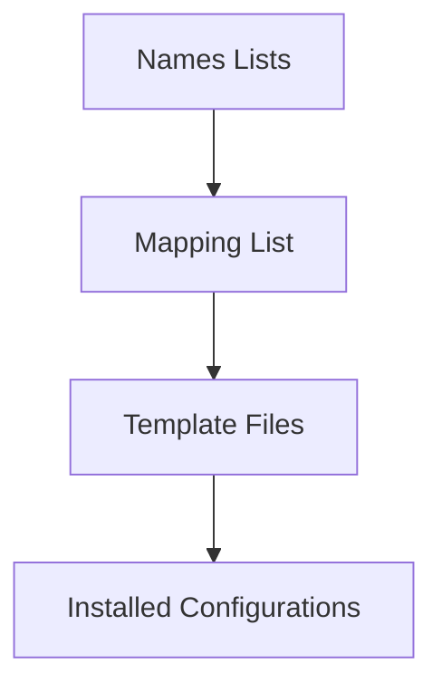

# Emulator Templates and Configuration

<cite>
**Referenced Files in This Document**
- [templates_files.lst](file://system/configgen/templates_files.lst)
- [emulators_names.lst](file://system/configgen/emulators_names.lst)
- [systems_names.lst](file://system/configgen/systems_names.lst)
- [retrobat_template.ini](file://system/resources/retrobat_template.ini)
- [2ship2harkinian.json](file://system/templates/2ship/2ship2harkinian.json)
- [settings.json](file://system/templates/mesen/settings.json)
- [Dolphin.ini](file://system/templates/dolphin-emu/User\Config/Dolphin.ini)
- [retroarch.cfg](file://system/templates/retroarch/retroarch.cfg)
- [fmtownsux.ini](file://system/templates/mame/ini/fmtownsux.ini)
</cite>

## Table of Contents
1. [Introduction](#introduction)
2. [Project Structure](#project-structure)
3. [Core Components](#core-components)
4. [Architecture Overview](#architecture-overview)
5. [Detailed Component Analysis](#detailed-component-analysis)
6. [Dependency Analysis](#dependency-analysis)
7. [Performance Considerations](#performance-considerations)
8. [Troubleshooting Guide](#troubleshooting-guide)
9. [Conclusion](#conclusion)
10. [Appendices](#appendices)

## Introduction
This document explains the emulator template system used to configure and deploy 200+ emulators across 240+ gaming platforms. It describes the template structure, how emulators and systems are represented, and how configuration files are mapped and applied. It also covers template inheritance, defaults, overrides, validation, registration of new emulators, and versioning/migration strategies.

## Project Structure
The template system centers around three primary lists and a large collection of per-emulator configuration files:
- A registry of emulator identifiers
- A registry of platform/system identifiers
- A mapping of template files to target locations
- Per-emulator template files (INI, JSON, TOML, YAML, etc.)

**Diagram sources**
- [templates_files.lst](file://system/configgen/templates_files.lst)
- [emulators_names.lst](file://system/configgen/emulators_names.lst)
- [systems_names.lst](file://system/configgen/systems_names.lst)
- [2ship2harkinian.json](file://system/templates/2ship/2ship2harkinian.json)
- [settings.json](file://system/templates/mesen/settings.json)
- [Dolphin.ini](file://system/templates/dolphin-emu/User\Config\Dolphin.ini)
- [retroarch.cfg](file://system/templates/retroarch/retroarch.cfg)
- [fmtownsux.ini](file://system/templates/mame/ini/fmtownsux.ini)

**Section sources**
- [templates_files.lst](file://system/configgen/templates_files.lst)
- [emulators_names.lst](file://system/configgen/emulators_names.lst)
- [systems_names.lst](file://system/configgen/systems_names.lst)

## Core Components
- Emulator registry: Defines supported emulators and their canonical names.
- System/platform registry: Defines supported platforms and their canonical names.
- Template mapping: Declares which template files to install and where to place them.
- Template files: Per-emulator configuration files (JSON, INI, CFG, TOML, YAML) that encode defaults and preferences.

Key responsibilities:
- Normalize emulator and system names across the system.
- Provide a single source of truth for which templates apply to which emulators/platforms.
- Enable consistent installation of configuration files across environments.

**Section sources**
- [emulators_names.lst](file://system/configgen/emulators_names.lst)
- [systems_names.lst](file://system/configgen/systems_names.lst)
- [templates_files.lst](file://system/configgen/templates_files.lst)

## Architecture Overview
The template architecture follows a declarative mapping approach:
- Emulator names are declared and validated against the emulator registry.
- System names are declared and validated against the system registry.
- Template mapping declares source template files and destination paths.
- During deployment, the system copies or extracts template files to their destinations, applying defaults and preserving user overrides.

[No sources needed since this diagram shows conceptual workflow, not actual code structure]

## Detailed Component Analysis

### Template Mapping and Registration
The mapping file enumerates all template files and their installation targets. Each line defines a source path and a destination path. This enables:
- Centralized control over which files are deployed
- Consistent installation across environments
- Easy addition/removal of emulators and their configs

Practical implications:
- To register a new emulator, add entries mapping its template files to appropriate destinations.
- To remove an emulator, remove its mapping entries.
- To change defaults, edit the source template file and re-run deployment.

**Section sources**
- [templates_files.lst](file://system/configgen/templates_files.lst)

### Emulator Names and Systems Names
These registries define canonical identifiers used throughout the system:
- Emulator identifiers: Used to select which template set applies.
- System identifiers: Used to group ROMs and define platform-specific behavior.

Validation:
- New emulators should be added to the emulator registry.
- New platforms should be added to the system registry.
- Template mapping entries should reference these canonical names.

**Section sources**
- [emulators_names.lst](file://system/configgen/emulators_names.lst)
- [systems_names.lst](file://system/configgen/systems_names.lst)

### Example Template Files

#### JSON-based Template (2ship)
This template encodes UI overlays, input mappings, and window settings for a specific emulator. It demonstrates:
- Hierarchical configuration sections
- Input device mappings
- Window and backend settings

**Diagram sources**
- [2ship2harkinian.json](file://system/templates/2ship/2ship2harkinian.json)

**Section sources**
- [2ship2harkinian.json](file://system/templates/2ship/2ship2harkinian.json)

#### JSON-based Template (Mesen)
This template encodes video, audio, input, emulation, and SNES-specific settings. It demonstrates:
- Versioning metadata
- Nested configuration blocks
- Extensive input and rendering options

**Diagram sources**
- [settings.json](file://system/templates/mesen/settings.json)

**Section sources**
- [settings.json](file://system/templates/mesen/settings.json)

#### INI-based Template (Dolphin)
This template demonstrates:
- INI-style sections and keys
- Paths for ISOs, saves, dumps, and resources
- Core, display, and input options

**Diagram sources**
- [Dolphin.ini](file://system/templates/dolphin-emu/User\Config\Dolphin.ini)

**Section sources**
- [Dolphin.ini](file://system/templates/dolphin-emu/User\Config\Dolphin.ini)

#### INI-based Template (RetroArch)
This template demonstrates:
- Flat key-value pairs
- Input device and driver settings
- Core options and asset paths

**Diagram sources**
- [retroarch.cfg](file://system/templates/retroarch/retroarch.cfg)

**Section sources**
- [retroarch.cfg](file://system/templates/retroarch/retroarch.cfg)

#### INI-based Template (MAME)
This template demonstrates:
- Core configuration options
- Search paths for ROMs, BIOS, and assets
- Rendering, sound, and input device settings

**Diagram sources**
- [fmtownsux.ini](file://system/templates/mame/ini/fmtownsux.ini)

**Section sources**
- [fmtownsux.ini](file://system/templates/mame/ini/fmtownsux.ini)

### Relationship Between Emulator Names, System Templates, and Configuration Parameters
- Emulator names drive which template set is selected.
- System names influence how ROMs are organized and how platform-specific defaults are applied.
- Configuration parameters are encoded in template files and applied during deployment.

[No sources needed since this diagram shows conceptual workflow, not actual code structure]

### Template Inheritance, Defaults, and Overrides
- Defaults are defined in the template files themselves.
- Overrides can be achieved by editing target files post-deployment.
- Some systems support per-game overrides (e.g., auto-remaps, per-core options) that supersede global defaults.

Best practices:
- Keep template files minimal and focused on sensible defaults.
- Encourage users to override selectively via their own files.
- Document which parameters are most commonly overridden.

[No sources needed since this section provides general guidance]

### Validation of Templates and Deployment
- Validate emulator and system names against the registries.
- Verify that mapping entries reference existing template files.
- Ensure destination paths are writable and safe to modify.
- Optionally compare versions of configuration files to detect incompatible changes.

[No sources needed since this section provides general guidance]

### Practical Examples

#### Modifying an Existing Template
Steps:
1. Locate the template file in the templates directory.
2. Edit the desired parameters while preserving structure.
3. Re-run deployment to copy the updated template to its destination.
4. Restart the emulator to pick up changes.

Example targets:
- JSON: adjust overlay/input/window settings
- INI: adjust paths, drivers, or input mappings
- CFG/TOML/YAML: adjust core options or rendering parameters

[No sources needed since this section provides general guidance]

#### Creating a Custom Configuration
Steps:
1. Duplicate an existing template file for the emulator.
2. Modify parameters to match your preferences.
3. Update the mapping to point to your custom template.
4. Deploy and test.

[No sources needed since this section provides general guidance]

### Registration Process for New Emulators
Steps:
1. Add the emulator name to the emulator registry.
2. Add any new system names to the system registry.
3. Create or locate template files under the templates directory.
4. Add mapping entries linking the template files to target destinations.
5. Validate the mapping and deploy.

[No sources needed since this diagram shows conceptual workflow, not actual code structure]

## Dependency Analysis
The template system depends on:
- Canonical names for emulators and systems
- Accurate mapping entries
- Valid template files

[No sources needed since this diagram shows conceptual relationships, not specific code structure]

## Performance Considerations
- Prefer lightweight defaults in templates to minimize startup overhead.
- Avoid excessive per-game overrides that require frequent reloads.
- Use caching and incremental updates where applicable.

[No sources needed since this section provides general guidance]

## Troubleshooting Guide
Common issues and resolutions:
- Missing or invalid emulator/system names: Ensure names exist in the registries and are spelled consistently.
- Incorrect mapping entries: Verify that source paths exist and destination paths are writable.
- Conflicting overrides: Check target files for manual overrides that may conflict with templates.
- Version mismatches: Compare configuration versions and migrate settings as needed.

[No sources needed since this section provides general guidance]

## Conclusion
The template system provides a scalable, declarative way to manage hundreds of emulators and thousands of platform configurations. By centralizing names, mappings, and defaults, it simplifies deployment, maintenance, and customization while enabling consistent behavior across diverse environments.

[No sources needed since this section summarizes without analyzing specific files]

## Appendices

### Appendix A: Template Types and Typical Uses
- JSON: Modern emulators with rich configuration (e.g., overlays, input mappings)
- INI: Classic emulators with structured sections (e.g., Dolphin, MAME)
- CFG: Flat key-value configurations (e.g., RetroArch)
- TOML/YAML: Flexible, human-readable formats (e.g., emulator core options)

[No sources needed since this section provides general guidance]

### Appendix B: Versioning and Migration Strategies
- Track template versions via metadata (e.g., Version fields in JSON).
- Maintain backward-compatible defaults.
- Provide migration scripts to transform older configurations to newer formats.
- Document breaking changes and offer automated upgrade paths.

[No sources needed since this section provides general guidance]