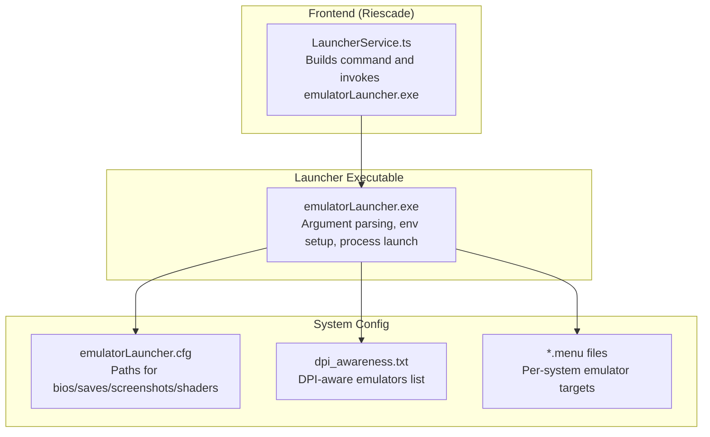
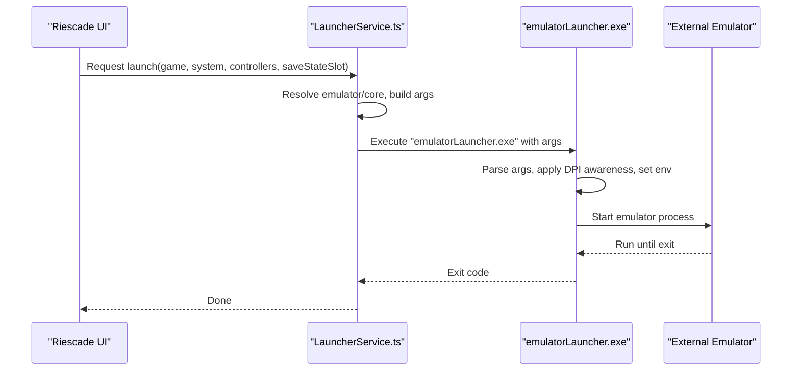
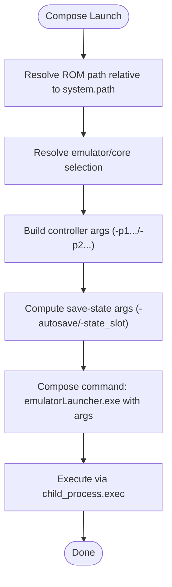
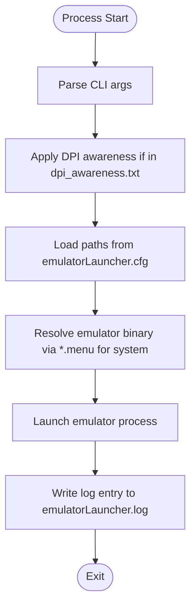
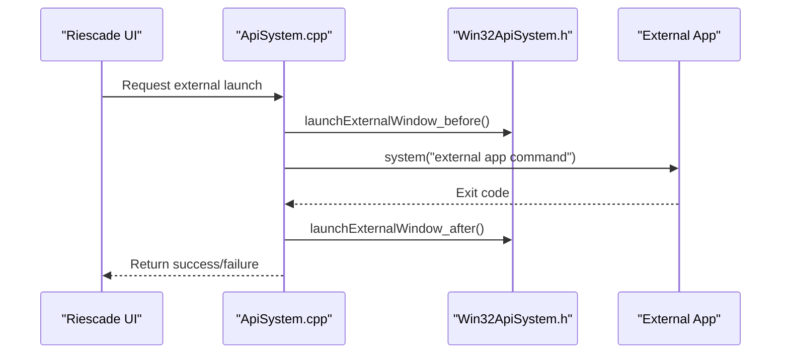
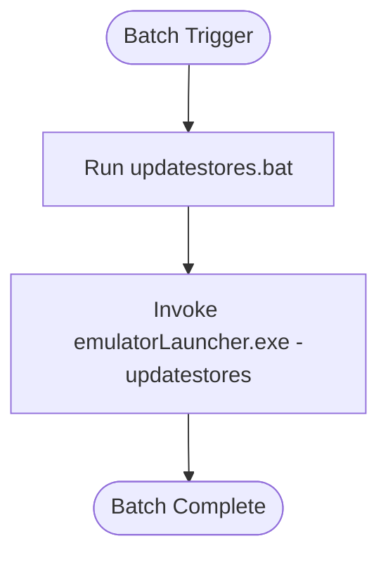
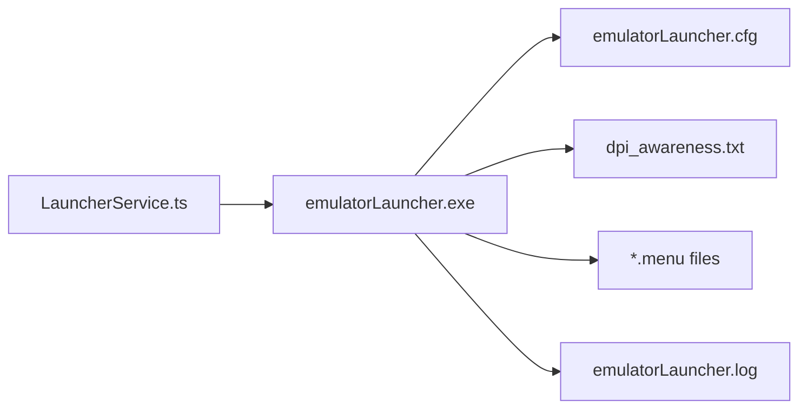

# Launch Coordination and Process Management

<cite>
**Referenced Files in This Document**
- [LauncherService.ts](file://emulationstation/.riescade/src/src/main/services/LauncherService.ts)
- [ApiSystem.cpp](file://emulationstation/.riescade/src/docs/es_src/ApiSystem.cpp)
- [Win32ApiSystem.h](file://emulationstation/.riescade/src/docs/es_src/Win32ApiSystem.h)
- [SystemData.cpp](file://emulationstation/.riescade/src/docs/es_src/SystemData.cpp)
- [emulatorLauncher.cfg](file://emulationstation/emulatorLauncher.cfg)
- [emulatorLauncher.cfg (template)](file://system/templates/emulationstation/emulatorLauncher.cfg)
- [dpi_awareness.txt](file://system/tools/dpi_awareness.txt)
- [updatestores.bat (start)](file://emulationstation/.emulationstation/scripts/start/updatestores.bat)
- [updatestores.bat (update-gamelists)](file://emulationstation/.emulationstation/scripts/update-gamelists/updatestores.bat)
- [emulatorLauncher.log](file://emulationstation/emulatorLauncher.log)
- [m2emulator.menu](file://system/es_menu/m2emulator.menu)
</cite>

## Table of Contents
1. [Introduction](#introduction)
2. [Project Structure](#project-structure)
3. [Core Components](#core-components)
4. [Architecture Overview](#architecture-overview)
5. [Detailed Component Analysis](#detailed-component-analysis)
6. [Dependency Analysis](#dependency-analysis)
7. [Performance Considerations](#performance-considerations)
8. [Troubleshooting Guide](#troubleshooting-guide)
9. [Conclusion](#conclusion)
10. [Appendices](#appendices)

## Introduction
This document explains the emulator launch coordination system centered on emulatorLauncher.exe. It covers how the frontend (Riescade) orchestrates launching, how emulatorLauncher.exe interprets launch arguments, sets up the environment, coordinates input mapping, manages save states and autosave, integrates with achievement sound feedback, and handles process lifecycle. It also documents DPI awareness, window management hooks, fullscreen handling, and batch/automated launch scenarios.

## Project Structure
The launch coordination spans three layers:
- Frontend orchestration: Electron-based Riescade service constructs the launch command and invokes emulatorLauncher.exe.
- Launcher executable: emulatorLauncher.exe parses arguments, resolves emulator/core, prepares environment, and starts the target emulator.
- System configuration: emulatorLauncher.cfg defines shared paths and RetroArch-related directories; dpi_awareness.txt lists DPI-aware emulators; menu files define per-system emulator targets.

**Diagram sources**
- [LauncherService.ts:18-210](file://emulationstation/.riescade/src/src/main/services/LauncherService.ts#L18-L210)
- [emulatorLauncher.cfg:1-12](file://emulationstation/emulatorLauncher.cfg#L1-L12)
- [dpi_awareness.txt:1-5](file://system/tools/dpi_awareness.txt#L1-L5)
- [m2emulator.menu:1-1](file://system/es_menu/m2emulator.menu#L1-L1)

**Section sources**
- [LauncherService.ts:18-210](file://emulationstation/.riescade/src/src/main/services/LauncherService.ts#L18-L210)
- [emulatorLauncher.cfg:1-12](file://emulationstation/emulatorLauncher.cfg#L1-L12)
- [dpi_awareness.txt:1-5](file://system/tools/dpi_awareness.txt#L1-L5)
- [m2emulator.menu:1-1](file://system/es_menu/m2emulator.menu#L1-L1)

## Core Components
- LauncherService (frontend): Resolves emulator and core selection, builds controller arguments, computes save-state flags, and executes emulatorLauncher.exe with a composed argument list.
- emulatorLauncher.exe: Parses arguments, selects emulator/core, applies DPI awareness, sets environment paths, launches the emulator, and coordinates with external tools and logs.
- System configuration: emulatorLauncher.cfg centralizes RetroArch-related paths; dpi_awareness.txt lists emulators requiring DPI awareness; *.menu files define per-system emulator binaries.

Key argument categories passed to emulatorLauncher.exe:
- Game metadata: -gameinfo, -rom
- System/emulator/core: -system, -emulator, -core
- Controllers: -p1index/-p2index, -p1guid/-p2guid, -p1name/-p2name, -p1nbbuttons/-p2nbbuttons, -p1nbaxes/-p2nbaxes, -p1nbhats/-p2nbhats, -p1path/-p2path
- Save state: -autosave, -state_slot
- Batch/automation: -updatestores

**Section sources**
- [LauncherService.ts:18-210](file://emulationstation/.riescade/src/src/main/services/LauncherService.ts#L18-L210)
- [emulatorLauncher.log:1-555](file://emulationstation/emulatorLauncher.log#L1-L555)

## Architecture Overview
The launch flow begins in Riescade’s LauncherService, which composes a command invoking emulatorLauncher.exe with arguments for game, system, emulator, core, controllers, and save-state preferences. emulatorLauncher.exe validates arguments, applies DPI awareness, sets environment variables, and starts the emulator process. The frontend also provides window management hooks around external launches.

**Diagram sources**
- [LauncherService.ts:18-210](file://emulationstation/.riescade/src/src/main/services/LauncherService.ts#L18-L210)
- [ApiSystem.cpp:431-462](file://emulationstation/.riescade/src/docs/es_src/ApiSystem.cpp#L431-L462)
- [Win32ApiSystem.h:40-69](file://emulationstation/.riescade/src/docs/es_src/Win32ApiSystem.h#L40-L69)

## Detailed Component Analysis

### Frontend Orchestration: LauncherService
- Builds the absolute ROM path relative to the system path.
- Resolves emulator and core selection, honoring per-game overrides and system-wide defaults.
- Constructs per-controller arguments (-p1index/-p2index, -p1guid/-p2guid, -p1name/-p2name, -p1nbbuttons/-p2nbbuttons, -p1nbaxes/-p2nbaxes, -p1nbhats/-p2nbhats, -p1path/-p2path).
- Computes save-state arguments: -autosave and -state_slot based on slot value or global setting.
- Composes the final command and executes it via child_process.exec.

**Diagram sources**
- [LauncherService.ts:18-210](file://emulationstation/.riescade/src/src/main/services/LauncherService.ts#L18-L210)

**Section sources**
- [LauncherService.ts:18-210](file://emulationstation/.riescade/src/src/main/services/LauncherService.ts#L18-L210)

### Argument Parsing and Environment Setup in emulatorLauncher.exe
- Argument parsing: Reads -gameinfo, -rom, -system, -emulator, -core, controller flags, and save-state flags.
- DPI awareness: Applies DPI awareness to listed emulators from dpi_awareness.txt.
- Environment paths: Uses emulatorLauncher.cfg to set RetroArch paths (bios, saves, screenshots, shaders, videofilters, decorations, system.decorations, retroachievementsounds).
- Per-system emulator selection: Uses *.menu files to locate the emulator binary for a given system.
- Logging: Writes startup entries to emulatorLauncher.log with parsed arguments.

**Diagram sources**
- [emulatorLauncher.cfg:1-12](file://emulationstation/emulatorLauncher.cfg#L1-L12)
- [dpi_awareness.txt:1-5](file://system/tools/dpi_awareness.txt#L1-L5)
- [m2emulator.menu:1-1](file://system/es_menu/m2emulator.menu#L1-L1)
- [emulatorLauncher.log:1-555](file://emulationstation/emulatorLauncher.log#L1-L555)

**Section sources**
- [emulatorLauncher.cfg:1-12](file://emulationstation/emulatorLauncher.cfg#L1-L12)
- [dpi_awareness.txt:1-5](file://system/tools/dpi_awareness.txt#L1-L5)
- [m2emulator.menu:1-1](file://system/es_menu/m2emulator.menu#L1-L1)
- [emulatorLauncher.log:1-555](file://emulationstation/emulatorLauncher.log#L1-L555)

### Window Management Hooks and External Launches
- The frontend provides window management hooks around external launches (e.g., Kodi, FileManager) to properly restore the UI after external processes exit.
- These hooks demonstrate the expected pattern for coordinating emulator windows and restoring focus.

**Diagram sources**
- [ApiSystem.cpp:431-462](file://emulationstation/.riescade/src/docs/es_src/ApiSystem.cpp#L431-L462)
- [Win32ApiSystem.h:40-69](file://emulationstation/.riescade/src/docs/es_src/Win32ApiSystem.h#L40-L69)

**Section sources**
- [ApiSystem.cpp:431-462](file://emulationstation/.riescade/src/docs/es_src/ApiSystem.cpp#L431-L462)
- [Win32ApiSystem.h:40-69](file://emulationstation/.riescade/src/docs/es_src/Win32ApiSystem.h#L40-L69)

### Save State Management and Autosave
- Save-state flags are computed in the frontend and passed to emulatorLauncher.exe:
  - -autosave 0: Disable autosave
  - -autosave 1: Enable autosave
  - -state_slot N: Load a specific slot and enable autosave
- These flags are logged in emulatorLauncher.log and applied by the target emulator according to its configuration.

**Section sources**
- [LauncherService.ts:173-187](file://emulationstation/.riescade/src/src/main/services/LauncherService.ts#L173-L187)
- [emulatorLauncher.log:1-555](file://emulationstation/emulatorLauncher.log#L1-L555)

### Achievement Sound Feedback Integration
- emulatorLauncher.cfg defines retroachievementsounds path, enabling achievement sound feedback integration for compatible emulators (e.g., RetroArch).
- This path is resolved by emulatorLauncher.exe and passed to the emulator environment.

**Section sources**
- [emulatorLauncher.cfg:1-12](file://emulationstation/emulatorLauncher.cfg#L1-L12)

### Batch Processing and Automated Launch Scenarios
- Batch updates are triggered via scripts that invoke emulatorLauncher.exe with -updatestores.
- These scripts are located under .emulationstation/scripts/start and .emulationstation/scripts/update-gamelists.

**Diagram sources**
- [updatestores.bat (start):1-1](file://emulationstation/.emulationstation/scripts/start/updatestores.bat#L1-L1)
- [updatestores.bat (update-gamelists):1-1](file://emulationstation/.emulationstation/scripts/update-gamelists/updatestores.bat#L1-L1)

**Section sources**
- [updatestores.bat (start):1-1](file://emulationstation/.emulationstation/scripts/start/updatestores.bat#L1-L1)
- [updatestores.bat (update-gamelists):1-1](file://emulationstation/.emulationstation/scripts/update-gamelists/updatestores.bat#L1-L1)

## Dependency Analysis
- LauncherService depends on:
  - Riescade path resolution to locate emulatorLauncher.exe
  - System configuration for emulator/core selection and menu files for per-system emulator binaries
- emulatorLauncher.exe depends on:
  - emulatorLauncher.cfg for environment paths
  - dpi_awareness.txt for DPI-awareness toggles
  - *.menu files for emulator binary resolution
  - emulatorLauncher.log for diagnostics

**Diagram sources**
- [LauncherService.ts:18-210](file://emulationstation/.riescade/src/src/main/services/LauncherService.ts#L18-L210)
- [emulatorLauncher.cfg:1-12](file://emulationstation/emulatorLauncher.cfg#L1-L12)
- [dpi_awareness.txt:1-5](file://system/tools/dpi_awareness.txt#L1-L5)
- [m2emulator.menu:1-1](file://system/es_menu/m2emulator.menu#L1-L1)
- [emulatorLauncher.log:1-555](file://emulationstation/emulatorLauncher.log#L1-L555)

**Section sources**
- [LauncherService.ts:18-210](file://emulationstation/.riescade/src/src/main/services/LauncherService.ts#L18-L210)
- [emulatorLauncher.cfg:1-12](file://emulationstation/emulatorLauncher.cfg#L1-L12)
- [dpi_awareness.txt:1-5](file://system/tools/dpi_awareness.txt#L1-L5)
- [m2emulator.menu:1-1](file://system/es_menu/m2emulator.menu#L1-L1)
- [emulatorLauncher.log:1-555](file://emulationstation/emulatorLauncher.log#L1-L555)

## Performance Considerations
- Minimize argument overhead: Pass only required controller and save-state flags to reduce startup overhead.
- Prefer per-system emulator binaries via *.menu to avoid misconfiguration and redundant probing.
- Use autosave judiciously to balance safety and disk I/O.
- Keep emulatorLauncher.cfg paths aligned with storage layout to avoid slow path resolution.

## Troubleshooting Guide
Common issues and resolutions:
- Missing or invalid ROM path: Ensure the ROM path is resolved relative to the system path and exists.
- Incorrect emulator/core: Verify -emulator and -core values against system configuration and menu files.
- Controller mapping errors: Confirm controller flags (-p1index/-p1guid/-p1name/-p1nbbuttons/-p1nbaxes/-p1nbhats/-p1path) are present and correct.
- Save-state problems: Use -autosave 0/-autosave 1/-state_slot N appropriately; check global autosave setting.
- Achievement sounds not playing: Verify retroachievementsounds path in emulatorLauncher.cfg is accessible.
- DPI scaling issues: Ensure the emulator is listed in dpi_awareness.txt for DPI-aware behavior.
- Batch update failures: Check updatestores.bat invocation and emulatorLauncher.exe availability.

Logs:
- Review emulatorLauncher.log for startup entries and argument traces to diagnose launch failures.

**Section sources**
- [emulatorLauncher.log:1-555](file://emulationstation/emulatorLauncher.log#L1-L555)

## Conclusion
The launch coordination system integrates Riescade’s LauncherService, emulatorLauncher.exe, and system configuration to reliably launch emulators with proper environment setup, DPI awareness, input mapping, save-state control, and achievement sound feedback. Scripts enable batch and automated scenarios. Logs and configuration files provide robust diagnostics and customization.

## Appendices

### Appendix A: Example Launch Arguments
- Basic launch: -gameinfo "<path>" -system "<system>" -emulator "<emulator>" -core "<core>" -rom "<path>"
- With controllers: -p1index 0 -p1guid "<guid>" -p1name "<name>" -p1nbbuttons 17 -p1nbaxes 4 -p1nbhats 1 -p1path "<device path>"
- With save-state: -autosave 1 or -state_slot 0 -autosave 1
- Batch update: -updatestores

**Section sources**
- [LauncherService.ts:189-197](file://emulationstation/.riescade/src/src/main/services/LauncherService.ts#L189-L197)
- [emulatorLauncher.log:1-555](file://emulationstation/emulatorLauncher.log#L1-L555)