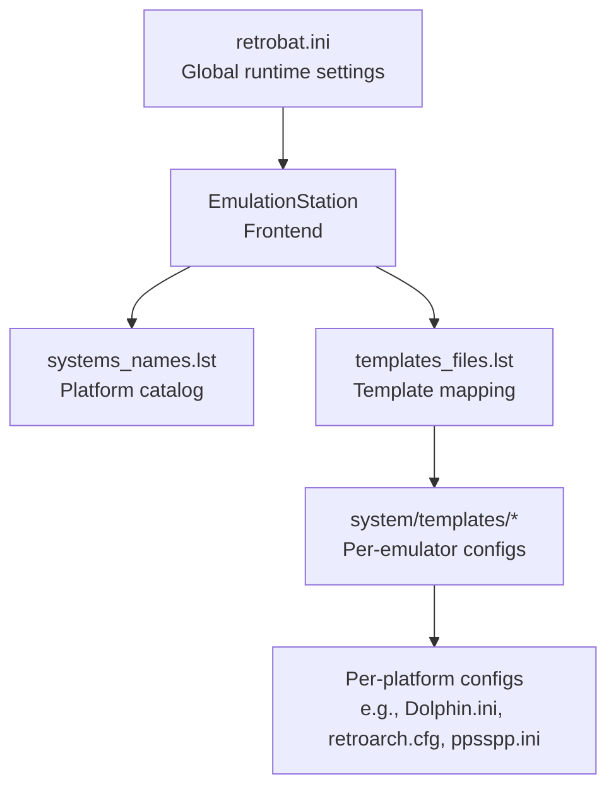
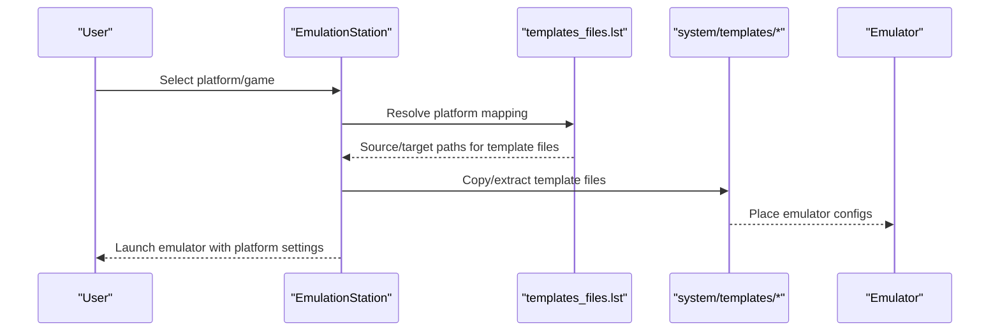
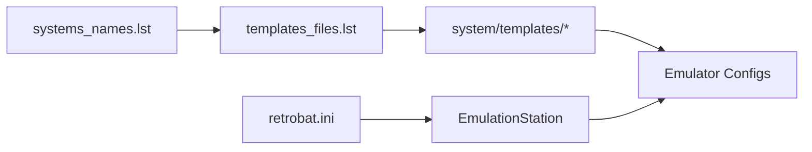

# Platform-Specific Settings

<cite>
**Referenced Files in This Document**
- [retrobat.ini](file://retrobat.ini)
- [systems_names.lst](file://system/configgen/systems_names.lst)
- [templates_files.lst](file://system/configgen/templates_files.lst)
- [gamelist.xml](file://system/es_menu/gamelist.xml)
- [Dolphin.ini](file://system/templates/dolphin-emu/User\Config\Dolphin.ini)
- [retroarch.cfg](file://system/templates/retroarch/retroarch.cfg)
- [fmtownsux.ini](file://system/templates/mame/ini/fmtownsux.ini)
- [ppsspp.ini](file://system/templates/ppsspp/SYSTEM/ppsspp.ini)
</cite>

## Table of Contents
1. [Introduction](#introduction)
2. [Project Structure](#project-structure)
3. [Core Components](#core-components)
4. [Architecture Overview](#architecture-overview)
5. [Detailed Component Analysis](#detailed-component-analysis)
6. [Dependency Analysis](#dependency-analysis)
7. [Performance Considerations](#performance-considerations)
8. [Troubleshooting Guide](#troubleshooting-guide)
9. [Conclusion](#conclusion)

## Introduction
This document explains how platform-specific emulator configurations are organized and applied within the system. It focuses on:
- How platforms are categorized and discovered
- How templates and configuration files are mapped per platform
- How cores, launch parameters, and compatibility settings are selected
- How visual themes, decorations, and input mappings relate to platforms
- Console-specific features such as save states, memory cards, and region settings
- Practical examples and troubleshooting tips for optimizing performance and compatibility

## Project Structure
The repository organizes platform-specific settings via:
- A registry of supported platforms
- A mapping of template files to target emulator configurations
- Emulator-specific configuration templates
- Frontend and global runtime settings

**Diagram sources**
- [retrobat.ini:50-94](file://retrobat.ini#L50-L94)
- [systems_names.lst:1-241](file://system/configgen/systems_names.lst#L1-L241)
- [templates_files.lst:1-215](file://system/configgen/templates_files.lst#L1-L215)

**Section sources**
- [retrobat.ini:50-94](file://retrobat.ini#L50-L94)
- [systems_names.lst:1-241](file://system/configgen/systems_names.lst#L1-L241)
- [templates_files.lst:1-215](file://system/configgen/templates_files.lst#L1-L215)

## Core Components
- Platform catalog: A curated list enumerating supported platforms and subsystems.
- Template mapping: A manifest that copies or symlinks template files into emulator-specific locations.
- Emulator templates: Per-emulator configuration files pre-populated with platform-appropriate defaults.
- Frontend and global settings: Runtime options controlling frontend behavior, display, and splash/video.

Key responsibilities:
- Platform discovery and categorization
- Applying platform-specific cores and launch parameters
- Managing save states, memory cards, and region settings
- Aligning visual themes/decoration and input mappings with platform expectations

**Section sources**
- [systems_names.lst:1-241](file://system/configgen/systems_names.lst#L1-L241)
- [templates_files.lst:1-215](file://system/configgen/templates_files.lst#L1-L215)
- [retrobat.ini:50-94](file://retrobat.ini#L50-L94)

## Architecture Overview
The platform-specific configuration pipeline:

**Diagram sources**
- [templates_files.lst:1-215](file://system/configgen/templates_files.lst#L1-L215)
- [Dolphin.ini:10-18](file://system/templates/dolphin-emu/User\Config\Dolphin.ini#L10-L18)
- [retroarch.cfg:130-131](file://system/templates/retroarch/retroarch.cfg#L130-L131)

## Detailed Component Analysis

### Platform Catalog and Categories
- The platform catalog enumerates systems and subsystems (e.g., Nintendo, Sega, Atari, PC, Arcade).
- These categories inform:
  - Which emulator core to select
  - Where to place ROMs and saves
  - How to configure input and visuals

Practical implications:
- Use the catalog to validate platform names and ensure correct mapping.
- Add new platforms by extending the catalog and providing appropriate templates.

**Section sources**
- [systems_names.lst:1-241](file://system/configgen/systems_names.lst#L1-L241)

### Template Mapping and Launch Parameters
- The template mapping defines how template files are deployed to emulator directories.
- Examples include:
  - Dolphin paths for ISOs, saves, dumps, and resource packs
  - RetroArch asset and core options directories
  - MAME paths for configs, NV RAM, and state directories
  - PPSSPP save state and system configuration

How to use:
- Modify template targets to adjust launch parameters (e.g., ROM paths, save directories).
- Ensure the mapping aligns with the platform’s expected directory layout.

**Section sources**
- [templates_files.lst:10-18](file://system/configgen/templates_files.lst#L10-L18)
- [templates_files.lst:39-45](file://system/configgen/templates_files.lst#L39-L45)
- [templates_files.lst:137-140](file://system/configgen/templates_files.lst#L137-L140)
- [templates_files.lst:173-174](file://system/configgen/templates_files.lst#L173-L174)

### Emulator Templates and Platform Defaults

#### Nintendo (e.g., GameCube/Wii)
- Dolphin configuration demonstrates:
  - ISO paths for GameCube and Wii
  - Save paths for NAND, Load, Dump, ResourcePacks, and WFS
  - Memory card and controller device assignments
  - Graphics backend selection and Wiimote options

Example adjustments:
- Change ISO paths to match your ROM structure.
- Point memory card and SRAM paths to platform-specific saves.
- Select graphics backend aligned with your GPU.

**Section sources**
- [Dolphin.ini:10-18](file://system/templates/dolphin-emu/User\Config\Dolphin.ini#L10-L18)
- [Dolphin.ini:47-48](file://system/templates/dolphin-emu/User\Config\Dolphin.ini#L47-L48)

#### Sega (e.g., Dreamcast, Model 2/3)
- Flycast (Dreamcast) and Supermodel (World Grand Prix series) templates indicate:
  - Dedicated save directories for NVRAM and state
  - Platform-specific NV memory archives

Example adjustments:
- Ensure save directories exist and are writable.
- Use platform-specific NV memory archives to preserve progress.

**Section sources**
- [templates_files.lst:63-66](file://system/configgen/templates_files.lst#L63-L66)
- [templates_files.lst:192-193](file://system/configgen/templates_files.lst#L192-L193)

#### Atari, PC, Arcade (e.g., MAME, FBNeo)
- MAME template shows:
  - Search paths for ROMs, BIOS, artwork, and plugins
  - State, snapshot, and input directories
  - Rendering, rotation, and performance options
- RetroArch template shows:
  - Asset and shader directories
  - Core options and save state management
  - Input device and overlay settings

Example adjustments:
- Configure MAME paths to match your ROM and BIOS structure.
- Enable or tune shaders and filters for CRT aesthetics.
- Adjust aspect ratio and viewport for correct display.

**Section sources**
- [fmtownsux.ini:10-22](file://system/templates/mame/ini/fmtownsux.ini#L10-L22)
- [fmtownsux.ini:27-33](file://system/templates/mame/ini/fmtownsux.ini#L27-L33)
- [retroarch.cfg:130-131](file://system/templates/retroarch/retroarch.cfg#L130-L131)
- [retroarch.cfg:147-151](file://system/templates/retroarch/retroarch.cfg#L147-L151)

#### PlayStation (e.g., PSP)
- PPSSPP configuration demonstrates:
  - Save state slots and autosave behavior
  - System parameters for region, firmware, and memory stick
  - Graphics and display layout for landscape/portrait

Example adjustments:
- Increase save state slots for convenience.
- Set region and firmware to match the game’s requirements.
- Configure display layout and scaling for handheld or TV.

**Section sources**
- [ppsspp.ini:8-11](file://system/templates/ppsspp/SYSTEM/ppsspp.ini#L8-L11)
- [ppsspp.ini:364-380](file://system/templates/ppsspp/SYSTEM/ppsspp.ini#L364-L380)
- [ppsspp.ini:314-345](file://system/templates/ppsspp/SYSTEM/ppsspp.ini#L314-L345)

### Relationship Between Platform Settings and Visual Themes, Decorations, and Input Mappings
- Visual themes and decorations:
  - Platform-specific decoration sets can be selected per system to match the aesthetic of the era or hardware.
  - Shader and CRT filter choices are often configured in emulator templates (e.g., RetroArch).
- Input mappings:
  - Controller profiles and hotkeys are maintained per platform in dedicated mapping files.
  - Frontend input dictionaries support keyboard and controller hotkeys.

Practical guidance:
- Pair CRT shaders with classic consoles for authentic visuals.
- Use platform-specific controller layouts to reduce remapping overhead.
- Keep input dictionaries synchronized with your controller hardware.

**Section sources**
- [retroarch.cfg:147-151](file://system/templates/retroarch/retroarch.cfg#L147-L151)
- [retrobat.ini:50-94](file://retrobat.ini#L50-L94)

### Console-Specific Features: Save States, Memory Cards, Region Settings
- Save states:
  - Managed by emulator templates (e.g., RetroArch core options, MAME state directories).
- Memory cards and persistent storage:
  - Dolphin memory card and SRAM paths; PPSSPP memstick and save states.
- Region and firmware:
  - PPSSPP system parameters for language, firmware, and model.
  - Dolphin language selection and region-specific devices.

Best practices:
- Back up save directories regularly.
- Match firmware and region settings to avoid compatibility issues.
- Use platform-specific NV memory archives for arcade systems.

**Section sources**
- [Dolphin.ini:35-38](file://system/templates/dolphin-emu/User\Config\Dolphin.ini#L35-L38)
- [Dolphin.ini:47-48](file://system/templates/dolphin-emu/User\Config\Dolphin.ini#L47-L48)
- [ppsspp.ini:364-380](file://system/templates/ppsspp/SYSTEM/ppsspp.ini#L364-L380)
- [fmtownsux.ini:27-33](file://system/templates/mame/ini/fmtownsux.ini#L27-L33)

### Display Orientation and Screen Ratio
- Landscape vs portrait:
  - PPSSPP supports separate display layouts for landscape and portrait modes.
- Aspect ratio and viewport:
  - RetroArch allows setting aspect ratio index and custom viewport offsets.
  - MAME templates include aspect and resolution options per screen.

Recommendations:
- Choose orientation that matches your hardware and viewing preferences.
- Calibrate aspect ratio and viewport to eliminate letterboxing or cropping.

**Section sources**
- [ppsspp.ini:314-345](file://system/templates/ppsspp/SYSTEM/ppsspp.ini#L314-L345)
- [retroarch.cfg:13-13](file://system/templates/retroarch/retroarch.cfg#L13-L13)
- [fmtownsux.ini:265-271](file://system/templates/mame/ini/fmtownsux.ini#L265-L271)

## Dependency Analysis
The platform configuration depends on:
- Platform catalog for discovery
- Template mapping for deployment
- Emulator templates for defaults
- Frontend/global settings for runtime behavior

**Diagram sources**
- [systems_names.lst:1-241](file://system/configgen/systems_names.lst#L1-L241)
- [templates_files.lst:1-215](file://system/configgen/templates_files.lst#L1-L215)
- [retrobat.ini:50-94](file://retrobat.ini#L50-L94)

**Section sources**
- [systems_names.lst:1-241](file://system/configgen/systems_names.lst#L1-L241)
- [templates_files.lst:1-215](file://system/configgen/templates_files.lst#L1-L215)
- [retrobat.ini:50-94](file://retrobat.ini#L50-L94)

## Performance Considerations
- Prefer platform-appropriate cores and shaders to balance fidelity and performance.
- Tune frame skip, throttling, and audio latency per emulator template.
- Use save state slots judiciously to minimize disk writes during intensive sessions.
- Match region and firmware settings to reduce runtime compatibility checks.

[No sources needed since this section provides general guidance]

## Troubleshooting Guide
Common issues and resolutions:
- ROMs not detected:
  - Verify emulator template paths for ROMs and BIOS.
  - Confirm template mapping entries for the platform.
- Save states failing:
  - Check state directories and permissions in emulator templates.
  - Ensure platform-specific NV memory archives are present.
- Visual artifacts or incorrect aspect ratio:
  - Adjust CRT/shader settings in emulator templates.
  - Set aspect ratio and viewport in RetroArch or MAME templates.
- Input not recognized:
  - Review input device and overlay settings in emulator templates.
  - Confirm frontend input dictionaries and controller profiles.

**Section sources**
- [fmtownsux.ini:10-22](file://system/templates/mame/ini/fmtownsux.ini#L10-L22)
- [retroarch.cfg:130-131](file://system/templates/retroarch/retroarch.cfg#L130-L131)
- [ppsspp.ini:8-11](file://system/templates/ppsspp/SYSTEM/ppsspp.ini#L8-L11)

## Conclusion
Platform-specific emulator configurations are driven by a combination of platform catalogs, template mappings, and emulator-specific templates. By aligning these components—cores, launch parameters, save management, visual themes, and input mappings—you can achieve reliable, performant, and authentic emulation experiences across diverse platforms.

[No sources needed since this section summarizes without analyzing specific files]