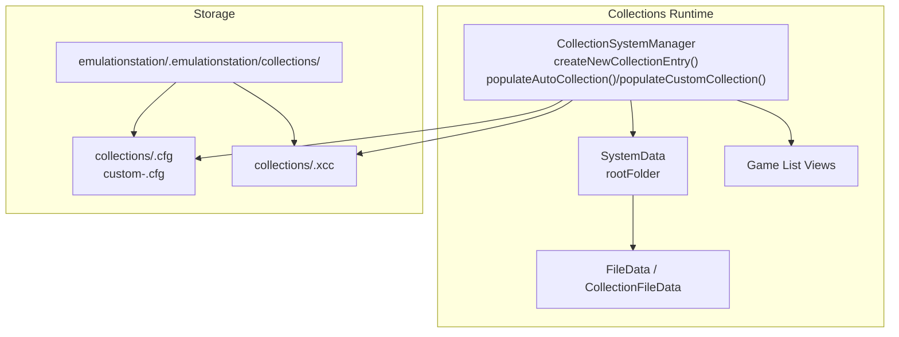
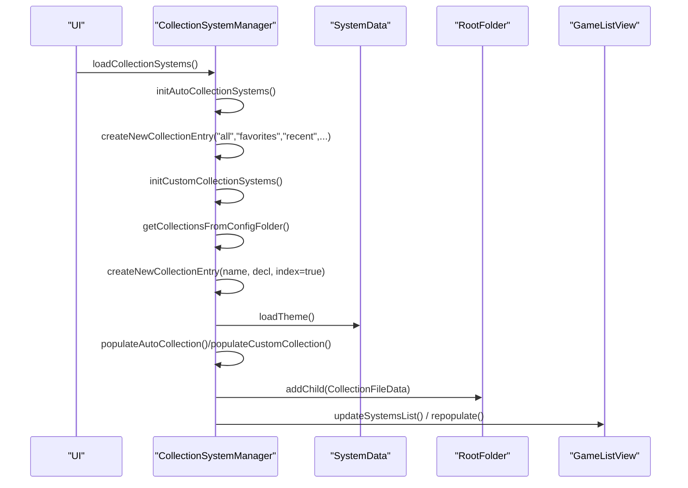
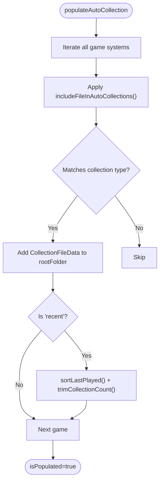
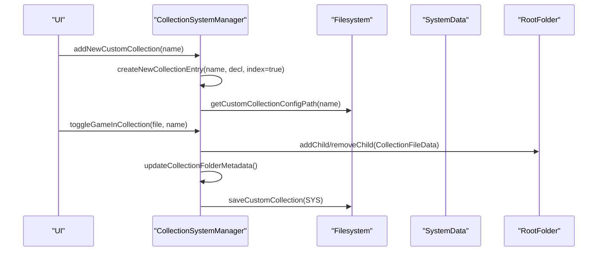
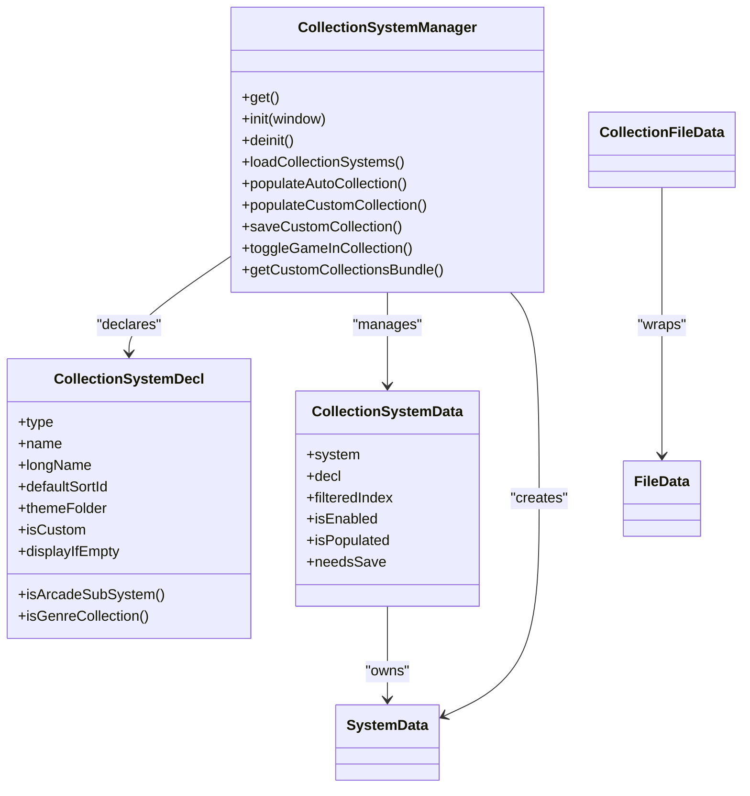
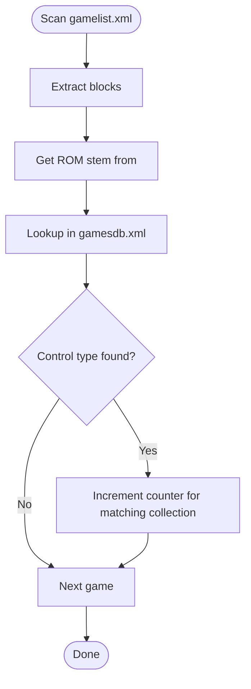

# Collection System

<cite>
**Referenced Files in This Document**
- [CollectionSystemManager.cpp](file://emulationstation/.riescade/src/docs/es_src/CollectionSystemManager.cpp)
- [CollectionSystemManager.h](file://emulationstation/.riescade/src/docs/es_src/CollectionSystemManager.h)
- [FileData.cpp](file://emulationstation/.riescade/src/docs/es_src/FileData.cpp)
- [gamesdb.xml](file://emulationstation/resources/gamesdb.xml)
- [LibraryService.ts](file://emulationstation/.riescade/src/src/main/services/LibraryService.ts)
</cite>

## Table of Contents
1. [Introduction](#introduction)
2. [Project Structure](#project-structure)
3. [Core Components](#core-components)
4. [Architecture Overview](#architecture-overview)
5. [Detailed Component Analysis](#detailed-component-analysis)
6. [Dependency Analysis](#dependency-analysis)
7. [Performance Considerations](#performance-considerations)
8. [Troubleshooting Guide](#troubleshooting-guide)
9. [Conclusion](#conclusion)
10. [Appendices](#appendices)

## Introduction
This document explains the collection management system used by the application. It covers how automatic and manual collections are created and maintained, how collections are persisted, how filtering and sorting work, and how collections integrate with the system view. It also documents collection inheritance, shared/custom collections, and practical strategies for automation, bulk operations, and backups.

## Project Structure
Collections are managed by a dedicated manager that orchestrates automatic and custom collections. Automatic collections include “All”, “Favorites”, “Recently Played”, and genre/system-based views. Custom collections are user-defined lists stored in the emulationstation/.emulationstation/collections/ directory. The manager controls population, persistence, and display.

**Diagram sources**
- [CollectionSystemManager.cpp:929-973](file://emulationstation/.riescade/src/docs/es_src/CollectionSystemManager.cpp#L929-L973)
- [CollectionSystemManager.cpp:1102-1196](file://emulationstation/.riescade/src/docs/es_src/CollectionSystemManager.cpp#L1102-L1196)
- [CollectionSystemManager.cpp:1513-1521](file://emulationstation/.riescade/src/docs/es_src/CollectionSystemManager.cpp#L1513-L1521)

**Section sources**
- [CollectionSystemManager.cpp:118-137](file://emulationstation/.riescade/src/docs/es_src/CollectionSystemManager.cpp#L118-L137)
- [CollectionSystemManager.cpp:1513-1521](file://emulationstation/.riescade/src/docs/es_src/CollectionSystemManager.cpp#L1513-L1521)

## Core Components
- CollectionSystemManager: Central orchestrator for creating, loading, updating, and persisting collections. It maintains separate registries for automatic and custom collections and handles on-demand population.
- CollectionSystemDecl: Declares built-in automatic collections (e.g., favorites, recent, arcade variants) and theme metadata.
- CollectionSystemData: Holds runtime state per collection (enabled, populated, needsSave, filteredIndex).
- CollectionFileData: Lightweight wrapper representing a game entry inside a collection, pointing to the original FileData.
- Storage: Automatic collections are computed on-the-fly; custom collections are persisted to custom-<name>.cfg files. Dynamic filters are saved to <name>.xcc files.

Key responsibilities:
- Initialize automatic and custom collections
- Populate on demand (threaded for custom collections)
- Persist custom collections and filter indices
- Update system view and metadata for collection folders
- Manage “bundle” grouping of custom collections

**Section sources**
- [CollectionSystemManager.h:17-47](file://emulationstation/.riescade/src/docs/es_src/CollectionSystemManager.h#L17-L47)
- [CollectionSystemManager.h:49-58](file://emulationstation/.riescade/src/docs/es_src/CollectionSystemManager.h#L49-L58)
- [CollectionSystemManager.cpp:929-973](file://emulationstation/.riescade/src/docs/es_src/CollectionSystemManager.cpp#L929-L973)
- [CollectionSystemManager.cpp:1102-1196](file://emulationstation/.riescade/src/docs/es_src/CollectionSystemManager.cpp#L1102-L1196)
- [FileData.cpp:969-1003](file://emulationstation/.riescade/src/docs/es_src/FileData.cpp#L969-L1003)

## Architecture Overview
Automatic collections are generated dynamically from the global game list, while custom collections are loaded from disk. The manager decides whether to show each collection as a standalone system or group them under a “Custom Collections Bundle”.

**Diagram sources**
- [CollectionSystemManager.cpp:368-377](file://emulationstation/.riescade/src/docs/es_src/CollectionSystemManager.cpp#L368-L377)
- [CollectionSystemManager.cpp:896-900](file://emulationstation/.riescade/src/docs/es_src/CollectionSystemManager.cpp#L896-L900)
- [CollectionSystemManager.cpp:1102-1196](file://emulationstation/.riescade/src/docs/es_src/CollectionSystemManager.cpp#L1102-L1196)
- [CollectionSystemManager.cpp:1226-1309](file://emulationstation/.riescade/src/docs/es_src/CollectionSystemManager.cpp#L1226-L1309)

## Detailed Component Analysis

### Automatic Collections
Automatic collections are declared and populated on demand:
- Built-ins: all games, favorites, last played, never played, arcade variants (vertical, light gun, wheel, trackball, spinner), retro achievements, and genre-based collections.
- Population logic filters the global game list based on metadata and platform flags.
- Recently played is sorted by last played and trimmed to a fixed count.

**Diagram sources**
- [CollectionSystemManager.cpp:976-1100](file://emulationstation/.riescade/src/docs/es_src/CollectionSystemManager.cpp#L976-L1100)
- [CollectionSystemManager.cpp:1020-1096](file://emulationstation/.riescade/src/docs/es_src/CollectionSystemManager.cpp#L1020-L1096)
- [CollectionSystemManager.cpp:532-562](file://emulationstation/.riescade/src/docs/es_src/CollectionSystemManager.cpp#L532-L562)

**Section sources**
- [CollectionSystemManager.cpp:34-116](file://emulationstation/.riescade/src/docs/es_src/CollectionSystemManager.cpp#L34-L116)
- [CollectionSystemManager.cpp:976-1100](file://emulationstation/.riescade/src/docs/es_src/CollectionSystemManager.cpp#L976-L1100)
- [CollectionSystemManager.cpp:1020-1096](file://emulationstation/.riescade/src/docs/es_src/CollectionSystemManager.cpp#L1020-L1096)
- [CollectionSystemManager.cpp:532-562](file://emulationstation/.riescade/src/docs/es_src/CollectionSystemManager.cpp#L532-L562)

### Custom Collections
Custom collections are user-defined lists persisted to files:
- Persistence: Each custom collection is stored as custom-<name>.cfg with one absolute or portable relative path per line.
- Dynamic filters: If a corresponding <name>.xcc exists, the collection is treated as dynamic and rebuilt from a filter index.
- Creation: New custom collections are validated for naming conflicts and theme folder availability.
- Toggle membership: Adding/removing a game updates indexes and triggers notifications.

**Diagram sources**
- [CollectionSystemManager.cpp:920-927](file://emulationstation/.riescade/src/docs/es_src/CollectionSystemManager.cpp#L920-L927)
- [CollectionSystemManager.cpp:930-973](file://emulationstation/.riescade/src/docs/es_src/CollectionSystemManager.cpp#L930-L973)
- [CollectionSystemManager.cpp:1102-1196](file://emulationstation/.riescade/src/docs/es_src/CollectionSystemManager.cpp#L1102-L1196)
- [CollectionSystemManager.cpp:333-364](file://emulationstation/.riescade/src/docs/es_src/CollectionSystemManager.cpp#L333-L364)
- [CollectionSystemManager.cpp:670-764](file://emulationstation/.riescade/src/docs/es_src/CollectionSystemManager.cpp#L670-L764)

**Section sources**
- [CollectionSystemManager.cpp:1434-1466](file://emulationstation/.riescade/src/docs/es_src/CollectionSystemManager.cpp#L1434-L1466)
- [CollectionSystemManager.cpp:1513-1516](file://emulationstation/.riescade/src/docs/es_src/CollectionSystemManager.cpp#L1513-L1516)
- [CollectionSystemManager.cpp:670-764](file://emulationstation/.riescade/src/docs/es_src/CollectionSystemManager.cpp#L670-L764)
- [CollectionSystemManager.cpp:793-894](file://emulationstation/.riescade/src/docs/es_src/CollectionSystemManager.cpp#L793-L894)

### Collection Storage and Paths
- Automatic collections: No persistent files; generated at runtime.
- Custom collections: custom-<name>.cfg in the collections directory.
- Dynamic filters: <name>.xcc in the collections directory.
- Collections directory: emulationstation/.emulationstation/collections/.

Notes:
- Paths in custom-<name>.cfg are portable relative to the user root.
- The manager validates names and avoids conflicts with existing systems and reserved names.

**Section sources**
- [CollectionSystemManager.cpp:1513-1521](file://emulationstation/.riescade/src/docs/es_src/CollectionSystemManager.cpp#L1513-L1521)
- [CollectionSystemManager.cpp:655-653](file://emulationstation/.riescade/src/docs/es_src/CollectionSystemManager.cpp#L655-L653)

### Filtering, Sorting, and Display
- Automatic sorting:
  - Favorites: filename ascending.
  - Last played: lastplayed descending, trimmed to a fixed maximum.
  - All games: filename ascending.
- Custom collections:
  - Sorted by the owning system’s configured sort order.
  - Dynamic collections (.xcc) rebuild from a filter index.
- Display:
  - Automatic collections without a theme folder may be grouped under a “Custom Collections Bundle”.
  - Enabled collections are added to the system vector; disabled ones are not shown.
  - Metadata for collection folders is auto-generated from child content.

**Section sources**
- [CollectionSystemManager.cpp:38-57](file://emulationstation/.riescade/src/docs/es_src/CollectionSystemManager.cpp#L38-L57)
- [CollectionSystemManager.cpp:532-562](file://emulationstation/.riescade/src/docs/es_src/CollectionSystemManager.cpp#L532-L562)
- [CollectionSystemManager.cpp:1226-1309](file://emulationstation/.riescade/src/docs/es_src/CollectionSystemManager.cpp#L1226-L1309)
- [CollectionSystemManager.cpp:793-894](file://emulationstation/.riescade/src/docs/es_src/CollectionSystemManager.cpp#L793-L894)

### Collection Inheritance, Shared Collections, and Sharing Between Users
- Inheritance:
  - Automatic collections inherit from the global game list and metadata.
  - Custom collections inherit their members from the configured file list.
- Shared collections:
  - Not implemented as a native feature. Sharing would require copying custom-<name>.cfg and <name>.xcc between users’ collections directories.
- Cross-user sharing:
  - Portable relative paths in custom-<name>.cfg enable sharing across machines with similar directory structures.

**Section sources**
- [CollectionSystemManager.cpp:1102-1196](file://emulationstation/.riescade/src/docs/es_src/CollectionSystemManager.cpp#L1102-L1196)
- [CollectionSystemManager.cpp:1513-1516](file://emulationstation/.riescade/src/docs/es_src/CollectionSystemManager.cpp#L1513-L1516)

### Practical Examples

- Create a custom collection:
  - Use the manager to add a new collection by name; it validates uniqueness and theme folder conflicts, then persists an empty custom-<name>.cfg.
  - Add games via toggleGameInCollection; the manager updates indexes and saves the cfg.

- Modify a custom collection:
  - Toggle membership for individual games; the manager updates the root folder and marks the collection for save.
  - Save occurs when needsSave is true and the collection is enabled.

- Delete a custom collection:
  - Remove the custom-<name>.cfg and optional <name>.xcc from the collections directory; the manager will not find them on next load.

- Automation rules:
  - Favorites: toggle favorite flag on a game; the manager adds/removes it from the favorites collection automatically.
  - Recently played: increment play count; the manager adds it to the recent collection and sorts/limits it.

- Bulk operations:
  - Use toggleGameInCollection in a loop to add or remove many games to/from a single collection.
  - Dynamic filters (.xcc) allow rebuilding large custom collections from a filter index.

- Backup strategies:
  - Back up the entire collections directory to preserve custom-<name>.cfg and <name>.xcc files.
  - Since paths are portable, the backup can be restored on another machine with compatible structure.

**Section sources**
- [CollectionSystemManager.cpp:670-764](file://emulationstation/.riescade/src/docs/es_src/CollectionSystemManager.cpp#L670-L764)
- [CollectionSystemManager.cpp:333-364](file://emulationstation/.riescade/src/docs/es_src/CollectionSystemManager.cpp#L333-L364)
- [CollectionSystemManager.cpp:1513-1516](file://emulationstation/.riescade/src/docs/es_src/CollectionSystemManager.cpp#L1513-L1516)

## Dependency Analysis

**Diagram sources**
- [CollectionSystemManager.h:35-58](file://emulationstation/.riescade/src/docs/es_src/CollectionSystemManager.h#L35-L58)
- [CollectionSystemManager.cpp:929-973](file://emulationstation/.riescade/src/docs/es_src/CollectionSystemManager.cpp#L929-L973)
- [FileData.cpp:969-1003](file://emulationstation/.riescade/src/docs/es_src/FileData.cpp#L969-L1003)

**Section sources**
- [CollectionSystemManager.h:17-58](file://emulationstation/.riescade/src/docs/es_src/CollectionSystemManager.h#L17-L58)
- [CollectionSystemManager.cpp:929-973](file://emulationstation/.riescade/src/docs/es_src/CollectionSystemManager.cpp#L929-L973)
- [FileData.cpp:969-1003](file://emulationstation/.riescade/src/docs/es_src/FileData.cpp#L969-L1003)

## Performance Considerations
- On-demand population:
  - Automatic collections are populated when enabled; custom collections support threaded population to improve responsiveness.
- Indexing:
  - Root folders maintain indexes for fast lookup; toggling membership updates indexes and minimizes UI redraws.
- Limiting recent:
  - The recent collection is capped to a fixed size to keep UI responsive.
- Metadata generation:
  - Collection folder metadata aggregates top games’ attributes; this runs when collections are populated or modified.

Recommendations:
- Prefer dynamic filters (.xcc) for very large custom collections to defer heavy computation until needed.
- Keep custom-<name>.cfg minimal and rely on filter indices for complex rules.
- Use threaded loading for many custom collections.

**Section sources**
- [CollectionSystemManager.cpp:1226-1251](file://emulationstation/.riescade/src/docs/es_src/CollectionSystemManager.cpp#L1226-L1251)
- [CollectionSystemManager.cpp:532-562](file://emulationstation/.riescade/src/docs/es_src/CollectionSystemManager.cpp#L532-L562)
- [CollectionSystemManager.cpp:793-894](file://emulationstation/.riescade/src/docs/es_src/CollectionSystemManager.cpp#L793-L894)

## Troubleshooting Guide
- Collection not appearing:
  - Verify the collection is enabled in settings and that its theme folder is available or it is grouped under the custom collections bundle.
- Empty collection:
  - Automatic collections may be empty if no games match the criteria; check includeFileInAutoCollections and hidden system/ext settings.
- Missing games in custom collection:
  - Ensure the path exists and is reachable; custom-<name>.cfg supports portable relative paths resolved against the user root.
- Recently played not updating:
  - Confirm play count metadata is present and that the recent collection is enabled and populated.

**Section sources**
- [CollectionSystemManager.cpp:1226-1309](file://emulationstation/.riescade/src/docs/es_src/CollectionSystemManager.cpp#L1226-L1309)
- [CollectionSystemManager.cpp:1497-1506](file://emulationstation/.riescade/src/docs/es_src/CollectionSystemManager.cpp#L1497-L1506)
- [CollectionSystemManager.cpp:1145-1195](file://emulationstation/.riescade/src/docs/es_src/CollectionSystemManager.cpp#L1145-L1195)

## Conclusion
The collection system provides flexible, on-demand automatic and user-defined collections. Automatic collections are computed from metadata and platform flags, while custom collections are persisted to files and can be dynamically filtered. The manager integrates tightly with the system view and ensures efficient updates and display. For large libraries, dynamic filters and threaded population help maintain performance.

## Appendices

### Collection Types and Behavior
- Automatic:
  - all: includes all eligible games.
  - favorites: includes games marked favorite.
  - recent: includes games with nonzero play count, sorted by last played, limited in size.
  - never played: inverse of recent.
  - arcade variants: vertical, light gun, wheel, trackball, spinner.
  - retro achievements: games with achievements.
  - genre-based: derived from genres.
- Custom:
  - User-defined lists persisted to custom-<name>.cfg.
  - Optional dynamic filters via <name>.xcc.

**Section sources**
- [CollectionSystemManager.cpp:34-116](file://emulationstation/.riescade/src/docs/es_src/CollectionSystemManager.cpp#L34-L116)
- [CollectionSystemManager.cpp:1434-1466](file://emulationstation/.riescade/src/docs/es_src/CollectionSystemManager.cpp#L1434-L1466)

### GamesDB Integration for Control Types
The LibraryService counts control-type collections by scanning gamesdb.xml entries for wheel, gun, trackball, and spinner attributes and matching them against ROM stems extracted from gamelists.

**Diagram sources**
- [LibraryService.ts:370-382](file://emulationstation/.riescade/src/src/main/services/LibraryService.ts#L370-L382)
- [gamesdb.xml:1-200](file://emulationstation/resources/gamesdb.xml#L1-L200)

**Section sources**
- [LibraryService.ts:321-382](file://emulationstation/.riescade/src/src/main/services/LibraryService.ts#L321-L382)
- [gamesdb.xml:1-200](file://emulationstation/resources/gamesdb.xml#L1-L200)