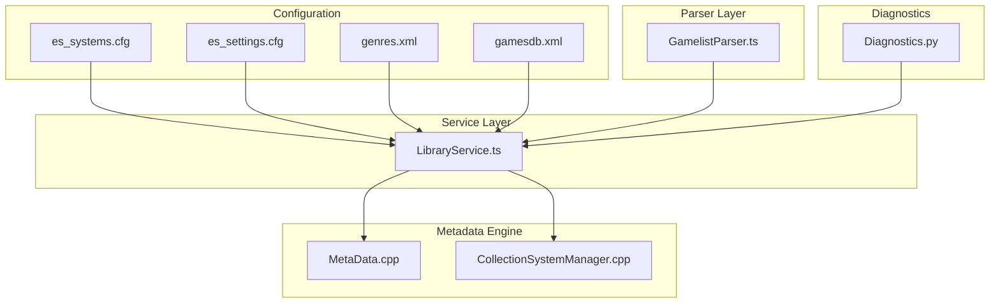
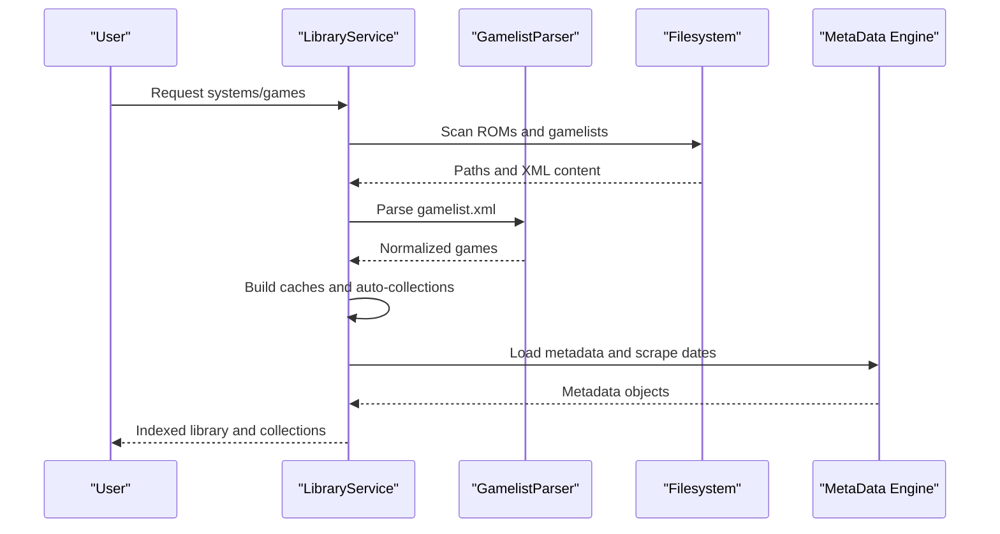
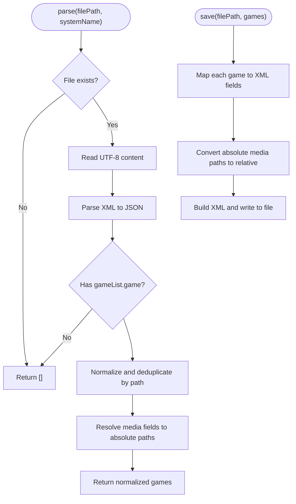
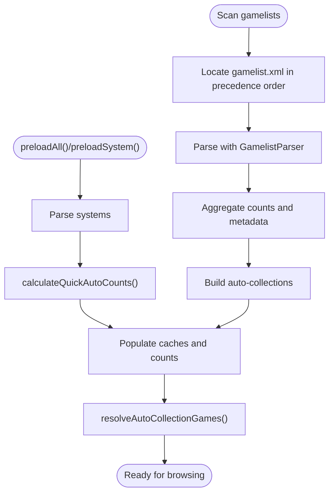
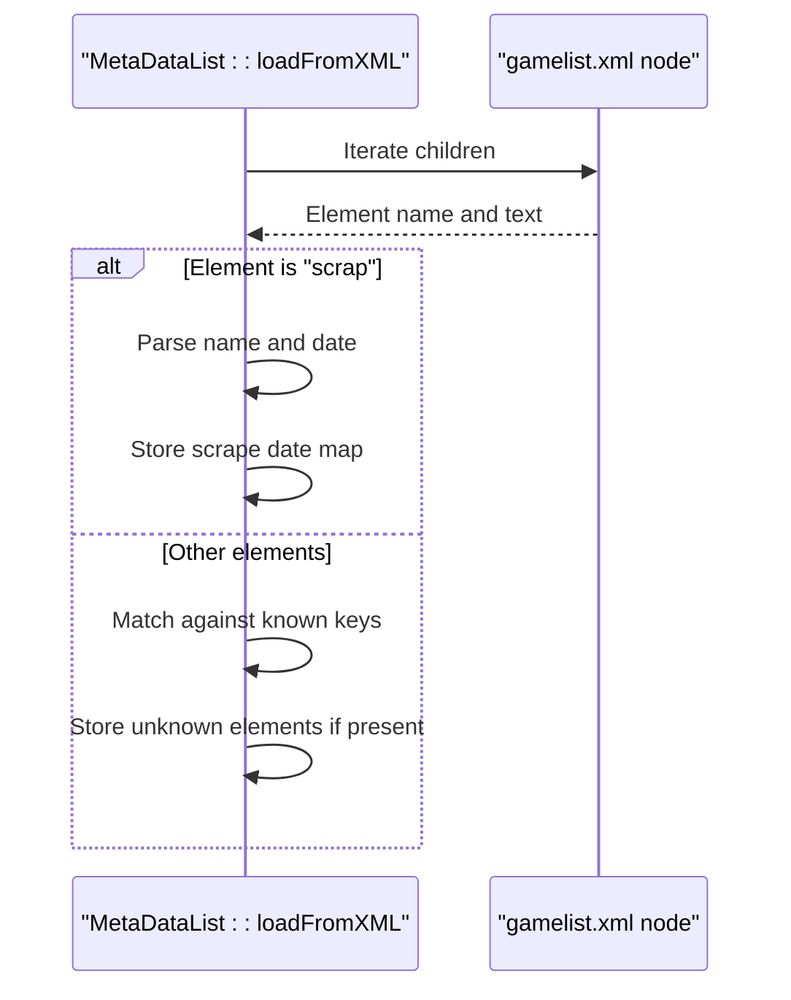
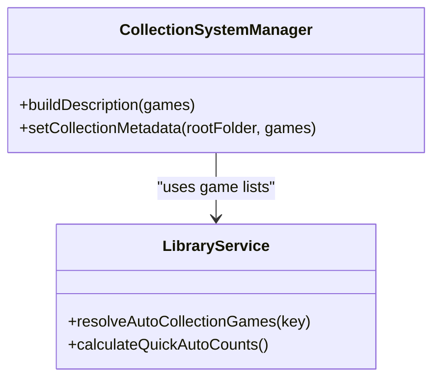
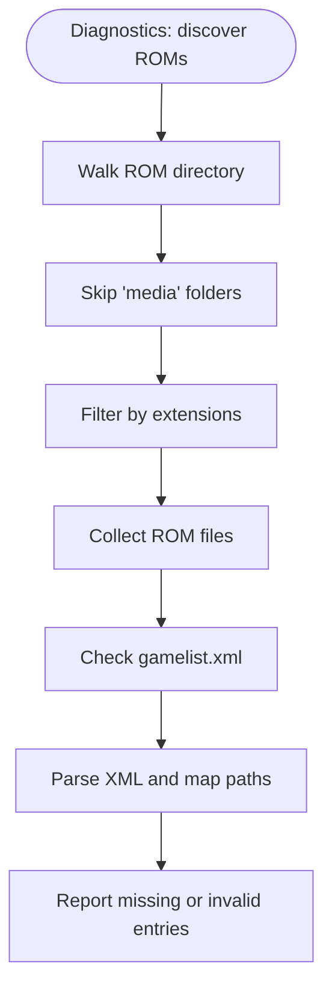
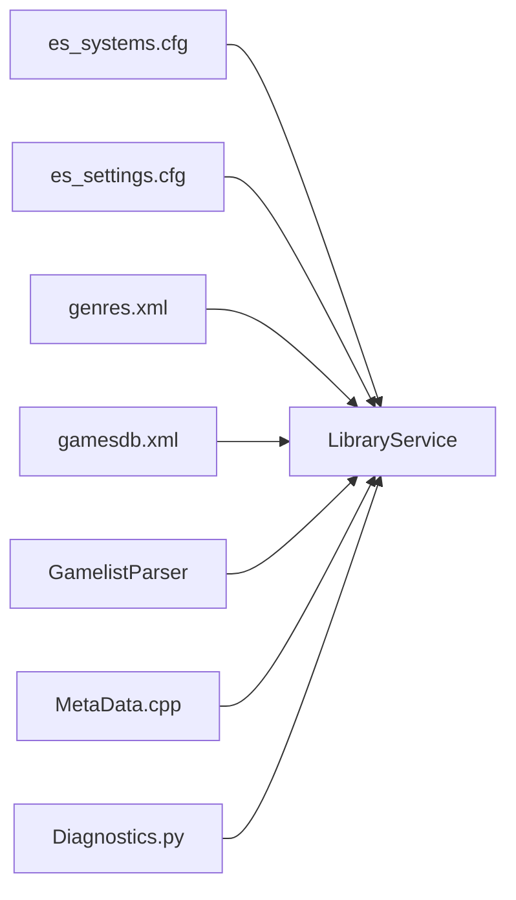

# Game Library Management

<cite>
**Referenced Files in This Document**
- [GamelistParser.ts](file://emulationstation/.riescade/src/src/main/parsers/GamelistParser.ts)
- [LibraryService.ts](file://emulationstation/.riescade/src/src/main/services/LibraryService.ts)
- [es_settings.cfg](file://emulationstation/.emulationstation/es_settings.cfg)
- [es_systems.cfg](file://emulationstation/.emulationstation/es_systems.cfg)
- [gamesdb.xml](file://emulationstation/resources/gamesdb.xml)
- [genres.xml](file://emulationstation/resources/genres.xml)
- [Diagnostics.py](file://emulationstation/.emulationstation/themes/RIESCADE_ORIGINS/resources/_scripts/Diagnostics.py)
- [MetaData.cpp](file://emulationstation/.riescade/src/docs/es_src/MetaData.cpp)
- [CollectionSystemManager.cpp](file://emulationstation/.riescade/src/docs/es_src/CollectionSystemManager.cpp)
</cite>

## Table of Contents
1. [Introduction](#introduction)
2. [Project Structure](#project-structure)
3. [Core Components](#core-components)
4. [Architecture Overview](#architecture-overview)
5. [Detailed Component Analysis](#detailed-component-analysis)
6. [Dependency Analysis](#dependency-analysis)
7. [Performance Considerations](#performance-considerations)
8. [Troubleshooting Guide](#troubleshooting-guide)
9. [Conclusion](#conclusion)
10. [Appendices](#appendices)

## Introduction
This document explains the game library management system used by the project, focusing on ROM discovery, gamelist.xml parsing, metadata extraction, and collection organization. It also covers how ROM files relate to metadata and indexing for fast game browsing, configuration options for scanning and metadata sources, and practical maintenance procedures. The system integrates with input configuration and supports visual customization via themes and shaders.

## Project Structure
The library management spans several areas:
- Parser layer: gamelist.xml parsing and normalization
- Service layer: library orchestration, caching, and auto-collections
- Configuration: system definitions, settings, and metadata sources
- Metadata engine: C++ backend for metadata loading and scraping dates
- Diagnostics: Python utilities for ROM discovery and gamelist validation

**Diagram sources**
- [GamelistParser.ts:1-178](file://emulationstation/.riescade/src/src/main/parsers/GamelistParser.ts#L1-L178)
- [LibraryService.ts:1-800](file://emulationstation/.riescade/src/src/main/services/LibraryService.ts#L1-L800)
- [es_systems.cfg:1-800](file://emulationstation/.emulationstation/es_systems.cfg#L1-L800)
- [es_settings.cfg:1-210](file://emulationstation/.emulationstation/es_settings.cfg#L1-L210)
- [genres.xml:1-200](file://emulationstation/resources/genres.xml#L1-L200)
- [gamesdb.xml:1-200](file://emulationstation/resources/gamesdb.xml#L1-L200)
- [MetaData.cpp:142-200](file://emulationstation/.riescade/src/docs/es_src/MetaData.cpp#L142-L200)
- [CollectionSystemManager.cpp:848-879](file://emulationstation/.riescade/src/docs/es_src/CollectionSystemManager.cpp#L848-L879)
- [Diagnostics.py:152-206](file://emulationstation/.emulationstation/themes/RIESCADE_ORIGINS/resources/_scripts/Diagnostics.py#L152-L206)

**Section sources**
- [GamelistParser.ts:1-178](file://emulationstation/.riescade/src/src/main/parsers/GamelistParser.ts#L1-L178)
- [LibraryService.ts:1-800](file://emulationstation/.riescade/src/src/main/services/LibraryService.ts#L1-L800)
- [es_systems.cfg:1-800](file://emulationstation/.emulationstation/es_systems.cfg#L1-L800)
- [es_settings.cfg:1-210](file://emulationstation/.emulationstation/es_settings.cfg#L1-L210)
- [genres.xml:1-200](file://emulationstation/resources/genres.xml#L1-L200)
- [gamesdb.xml:1-200](file://emulationstation/resources/gamesdb.xml#L1-L200)
- [MetaData.cpp:142-200](file://emulationstation/.riescade/src/docs/es_src/MetaData.cpp#L142-L200)
- [CollectionSystemManager.cpp:848-879](file://emulationstation/.riescade/src/docs/es_src/CollectionSystemManager.cpp#L848-L879)
- [Diagnostics.py:152-206](file://emulationstation/.emulationstation/themes/RIESCADE_ORIGINS/resources/_scripts/Diagnostics.py#L152-L206)

## Core Components
- GamelistParser: Parses gamelist.xml into normalized game objects, resolves media paths, and writes XML back with portable relative paths.
- LibraryService: Central coordinator for system discovery, ROM scanning, metadata aggregation, auto-collections, and caching.
- Configuration: es_systems.cfg defines systems and ROM locations; es_settings.cfg controls scanning behavior and UI preferences.
- Metadata engine: Loads metadata from gamelist.xml and tracks scraper timestamps.
- Diagnostics: Validates gamelist.xml and discovers ROMs recursively while respecting system boundaries.

**Section sources**
- [GamelistParser.ts:20-102](file://emulationstation/.riescade/src/src/main/parsers/GamelistParser.ts#L20-L102)
- [LibraryService.ts:213-440](file://emulationstation/.riescade/src/src/main/services/LibraryService.ts#L213-L440)
- [es_systems.cfg:1-800](file://emulationstation/.emulationstation/es_systems.cfg#L1-L800)
- [es_settings.cfg:126-142](file://emulationstation/.emulationstation/es_settings.cfg#L126-L142)
- [MetaData.cpp:152-200](file://emulationstation/.riescade/src/docs/es_src/MetaData.cpp#L152-L200)
- [Diagnostics.py:152-206](file://emulationstation/.emulationstation/themes/RIESCADE_ORIGINS/resources/_scripts/Diagnostics.py#L152-L206)

## Architecture Overview
The system follows a layered architecture:
- Input: ROM directories and gamelist.xml files
- Parsing: XML normalization and media path resolution
- Indexing: In-memory caches per system and auto-collections
- Organization: Auto-collections by genre, manufacturer, control type, and player counts
- Output: Fast browsing and collection views

**Diagram sources**
- [LibraryService.ts:761-800](file://emulationstation/.riescade/src/src/main/services/LibraryService.ts#L761-L800)
- [GamelistParser.ts:20-102](file://emulationstation/.riescade/src/src/main/parsers/GamelistParser.ts#L20-L102)
- [MetaData.cpp:152-200](file://emulationstation/.riescade/src/docs/es_src/MetaData.cpp#L152-L200)

## Detailed Component Analysis

### GamelistParser: ROM discovery and gamelist.xml parsing
- Parses gamelist.xml into a normalized array of games, deduplicating by normalized path.
- Resolves media fields (image, video, marquee, thumbnail, fanart, titleshot, wheel, mix) to absolute paths for UI, while preserving relative paths for saving.
- Writes gamelist.xml back with portable relative paths and normalized attributes.

**Diagram sources**
- [GamelistParser.ts:20-102](file://emulationstation/.riescade/src/src/main/parsers/GamelistParser.ts#L20-L102)
- [GamelistParser.ts:104-176](file://emulationstation/.riescade/src/src/main/parsers/GamelistParser.ts#L104-L176)

**Section sources**
- [GamelistParser.ts:20-102](file://emulationstation/.riescade/src/src/main/parsers/GamelistParser.ts#L20-L102)
- [GamelistParser.ts:104-176](file://emulationstation/.riescade/src/src/main/parsers/GamelistParser.ts#L104-L176)

### LibraryService: Library indexing and auto-collections
- Builds genre and manufacturer maps from genres.xml and gamesdb.xml to support auto-collections.
- Scans gamelists across multiple locations (roms, config gamelists, system-specific paths) and counts favorites, recent, never-played, achievements, and player counts.
- Maintains caches for quick access and updates auto-collections after system preload.
- Supports control-type collections (wheel, trackball, spinner, lightgun, vertical) using gamesdb.xml.

**Diagram sources**
- [LibraryService.ts:471-496](file://emulationstation/.riescade/src/src/main/services/LibraryService.ts#L471-L496)
- [LibraryService.ts:208-440](file://emulationstation/.riescade/src/src/main/services/LibraryService.ts#L208-L440)
- [LibraryService.ts:761-800](file://emulationstation/.riescade/src/src/main/services/LibraryService.ts#L761-L800)

**Section sources**
- [LibraryService.ts:208-440](file://emulationstation/.riescade/src/src/main/services/LibraryService.ts#L208-L440)
- [LibraryService.ts:761-800](file://emulationstation/.riescade/src/src/main/services/LibraryService.ts#L761-L800)

### Metadata extraction and scraping dates
- The metadata loader reads gamelist.xml nodes and ignores reserved tags like hash and path.
- Scraping timestamps are recorded under a special element with name/date attributes, enabling tracking of when metadata was scraped by specific sources.

**Diagram sources**
- [MetaData.cpp:152-200](file://emulationstation/.riescade/src/docs/es_src/MetaData.cpp#L152-L200)

**Section sources**
- [MetaData.cpp:152-200](file://emulationstation/.riescade/src/docs/es_src/MetaData.cpp#L152-L200)

### Collection organization and auto-collections
- Auto-collections include favorites, recent, never-played, achievements, 2-player, 4-player, arcade, genre-based, manufacturer-based, and control-type collections.
- Collection metadata (description, ratings, media) is synthesized for collection root folders.

**Diagram sources**
- [CollectionSystemManager.cpp:848-879](file://emulationstation/.riescade/src/docs/es_src/CollectionSystemManager.cpp#L848-L879)
- [LibraryService.ts:208-440](file://emulationstation/.riescade/src/src/main/services/LibraryService.ts#L208-L440)

**Section sources**
- [CollectionSystemManager.cpp:848-879](file://emulationstation/.riescade/src/docs/es_src/CollectionSystemManager.cpp#L848-L879)
- [LibraryService.ts:208-440](file://emulationstation/.riescade/src/src/main/services/LibraryService.ts#L208-L440)

### ROM discovery and diagnostics
- Diagnostics script walks ROM directories, skips media folders and system-specific files, and builds a list of ROM candidates based on extensions.
- It validates gamelist.xml presence and extracts relative ROM paths to absolute locations.

**Diagram sources**
- [Diagnostics.py:152-206](file://emulationstation/.emulationstation/themes/RIESCADE_ORIGINS/resources/_scripts/Diagnostics.py#L152-L206)

**Section sources**
- [Diagnostics.py:152-206](file://emulationstation/.emulationstation/themes/RIESCADE_ORIGINS/resources/_scripts/Diagnostics.py#L152-L206)

## Dependency Analysis
- LibraryService depends on:
  - Systems configuration (es_systems.cfg) for system definitions and paths
  - Settings (es_settings.cfg) for scanning behavior and collection filters
  - Metadata sources (genres.xml, gamesdb.xml) for genre and control-type mappings
  - GamelistParser for XML parsing and writing
  - Metadata engine (MetaData.cpp) for metadata loading and scrape dates
  - Diagnostics (Diagnostics.py) for ROM discovery and validation

**Diagram sources**
- [es_systems.cfg:1-800](file://emulationstation/.emulationstation/es_systems.cfg#L1-L800)
- [es_settings.cfg:126-142](file://emulationstation/.emulationstation/es_settings.cfg#L126-L142)
- [genres.xml:1-200](file://emulationstation/resources/genres.xml#L1-L200)
- [gamesdb.xml:1-200](file://emulationstation/resources/gamesdb.xml#L1-L200)
- [GamelistParser.ts:1-178](file://emulationstation/.riescade/src/src/main/parsers/GamelistParser.ts#L1-L178)
- [LibraryService.ts:1-800](file://emulationstation/.riescade/src/src/main/services/LibraryService.ts#L1-L800)
- [MetaData.cpp:142-200](file://emulationstation/.riescade/src/docs/es_src/MetaData.cpp#L142-L200)
- [Diagnostics.py:152-206](file://emulationstation/.emulationstation/themes/RIESCADE_ORIGINS/resources/_scripts/Diagnostics.py#L152-L206)

**Section sources**
- [es_systems.cfg:1-800](file://emulationstation/.emulationstation/es_systems.cfg#L1-L800)
- [es_settings.cfg:126-142](file://emulationstation/.emulationstation/es_settings.cfg#L126-L142)
- [genres.xml:1-200](file://emulationstation/resources/genres.xml#L1-L200)
- [gamesdb.xml:1-200](file://emulationstation/resources/gamesdb.xml#L1-L200)
- [GamelistParser.ts:1-178](file://emulationstation/.riescade/src/src/main/parsers/GamelistParser.ts#L1-L178)
- [LibraryService.ts:1-800](file://emulationstation/.riescade/src/src/main/services/LibraryService.ts#L1-L800)
- [MetaData.cpp:142-200](file://emulationstation/.riescade/src/docs/es_src/MetaData.cpp#L142-L200)
- [Diagnostics.py:152-206](file://emulationstation/.emulationstation/themes/RIESCADE_ORIGINS/resources/_scripts/Diagnostics.py#L152-L206)

## Performance Considerations
- Caching: LibraryService maintains per-system caches and quick auto-counts to avoid repeated filesystem scans.
- Preloading: preloadAll/preloadSystem reduce latency during UI navigation by resolving auto-collections once.
- XML parsing: Deduplication by normalized path prevents redundant processing of the same ROM.
- Media preloading: Controlled by settings to balance memory usage and UI responsiveness.

[No sources needed since this section provides general guidance]

## Troubleshooting Guide
Common issues and resolutions:
- Missing or invalid gamelist.xml
  - Use the diagnostics script to validate paths and report missing entries.
  - Ensure relative paths in gamelist.xml resolve correctly from the gamelist location.
- ROM organization problems
  - Verify system paths in es_systems.cfg and ensure ROM directories are structured per system.
  - Confirm extension filters align with your ROM formats.
- Metadata conflicts
  - Scraper timestamps are tracked; if metadata appears stale, re-run scraping or adjust settings controlling overwrite behavior.
- Performance bottlenecks
  - Enable preload settings and use caching to speed up browsing.
  - Limit visible systems and disable heavy shader effects if needed.

**Section sources**
- [Diagnostics.py:152-206](file://emulationstation/.emulationstation/themes/RIESCADE_ORIGINS/resources/_scripts/Diagnostics.py#L152-L206)
- [es_settings.cfg:126-142](file://emulationstation/.emulationstation/es_settings.cfg#L126-L142)
- [MetaData.cpp:152-200](file://emulationstation/.riescade/src/docs/es_src/MetaData.cpp#L152-L200)

## Conclusion
The library management system combines robust gamelist.xml parsing, intelligent ROM discovery, and efficient caching to deliver fast, organized game browsing. Auto-collections leverage genre and control-type mappings for intuitive navigation, while metadata extraction and scraping timestamps ensure accurate and up-to-date information. Configuration options allow fine-tuning for scanning behavior and visual presentation.

[No sources needed since this section summarizes without analyzing specific files]

## Appendices

### gamelist.xml structure and metadata fields
- Root element groups multiple game entries.
- Each game includes:
  - Path: ROM path (relative to gamelist location)
  - ID: Unique identifier (optional; falls back to path)
  - Favorite, Hidden, KidGame: Boolean flags
  - Playcount, Rating: Numeric metadata
  - Media fields: image, video, marquee, thumbnail, fanart, titleshot, wheel, mix
- Additional metadata may be stored as free-form elements and loaded by the metadata engine.

**Section sources**
- [GamelistParser.ts:20-102](file://emulationstation/.riescade/src/src/main/parsers/GamelistParser.ts#L20-L102)
- [MetaData.cpp:152-200](file://emulationstation/.riescade/src/docs/es_src/MetaData.cpp#L152-L200)

### Configuration options for library scanning and collections
- es_systems.cfg
  - Defines system names, paths, extensions, and commands for launching ROMs.
- es_settings.cfg
  - ParseGamelistOnly: Restrict parsing to gamelist.xml only
  - Scraper settings: Image/thumbnail sources and filter options
  - CollectionSystemsAuto/Custom: Enable/disable and configure auto-collections
  - Theme and shader settings for visual customization

**Section sources**
- [es_systems.cfg:1-800](file://emulationstation/.emulationstation/es_systems.cfg#L1-L800)
- [es_settings.cfg:126-142](file://emulationstation/.emulationstation/es_settings.cfg#L126-L142)

### Practical examples
- Creating a genre-based collection
  - Enable the desired genre key in CollectionSystemsAuto; the system matches against genres.xml and counts games accordingly.
- Building a manufacturer collection
  - Use z-prefix keys (e.g., zcapcom) to match publisher/developer fields in gamelist.xml.
- Control-type collections
  - Use wheel, trackball, spinner, lightgun, vertical keys; data comes from gamesdb.xml.

**Section sources**
- [LibraryService.ts:222-250](file://emulationstation/.riescade/src/src/main/services/LibraryService.ts#L222-L250)
- [genres.xml:1-200](file://emulationstation/resources/genres.xml#L1-L200)
- [gamesdb.xml:1-200](file://emulationstation/resources/gamesdb.xml#L1-L200)

### Library maintenance and backup/restore
- Maintenance
  - Use diagnostics to validate gamelist.xml and detect missing ROMs.
  - Periodically rebuild caches via preloadAll/preloadSystem to refresh auto-collections.
- Backup/restore
  - Back up gamelist.xml files alongside ROMs.
  - Restore by copying gamelist.xml into the appropriate system folder and reloading the library.

**Section sources**
- [Diagnostics.py:152-206](file://emulationstation/.emulationstation/themes/RIESCADE_ORIGINS/resources/_scripts/Diagnostics.py#L152-L206)
- [LibraryService.ts:471-496](file://emulationstation/.riescade/src/src/main/services/LibraryService.ts#L471-L496)