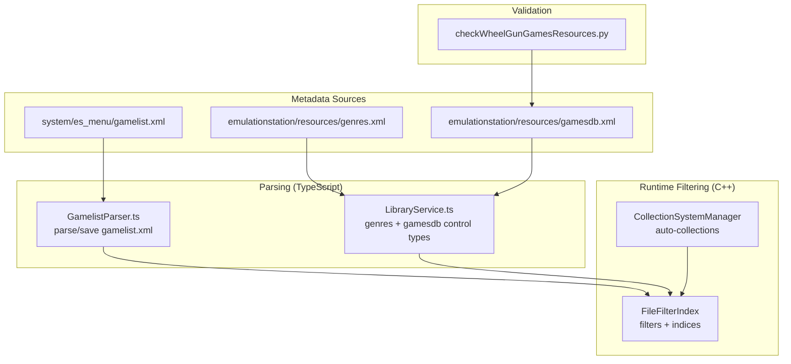
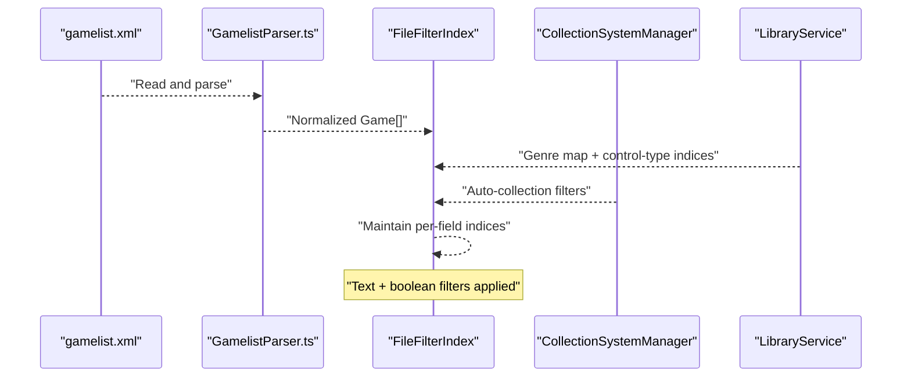
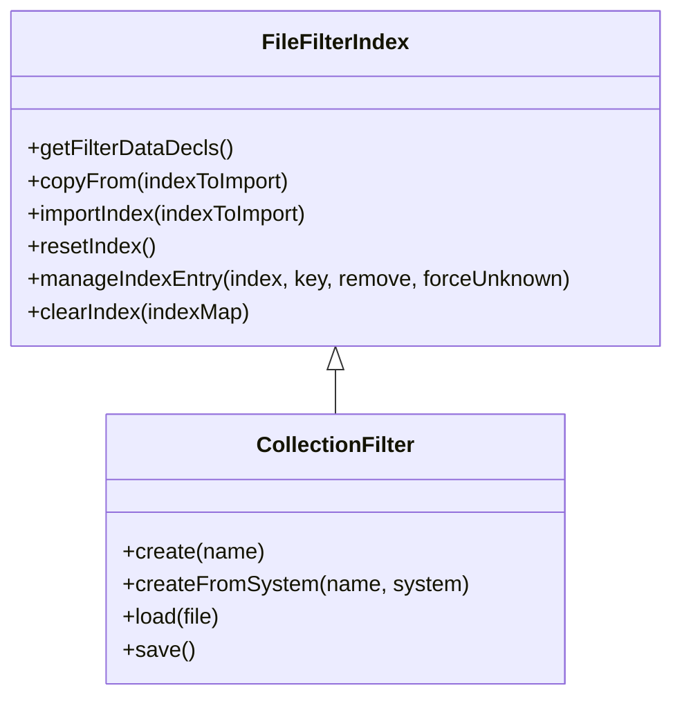
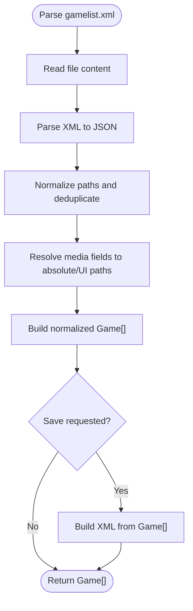
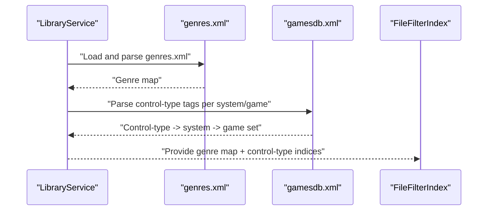
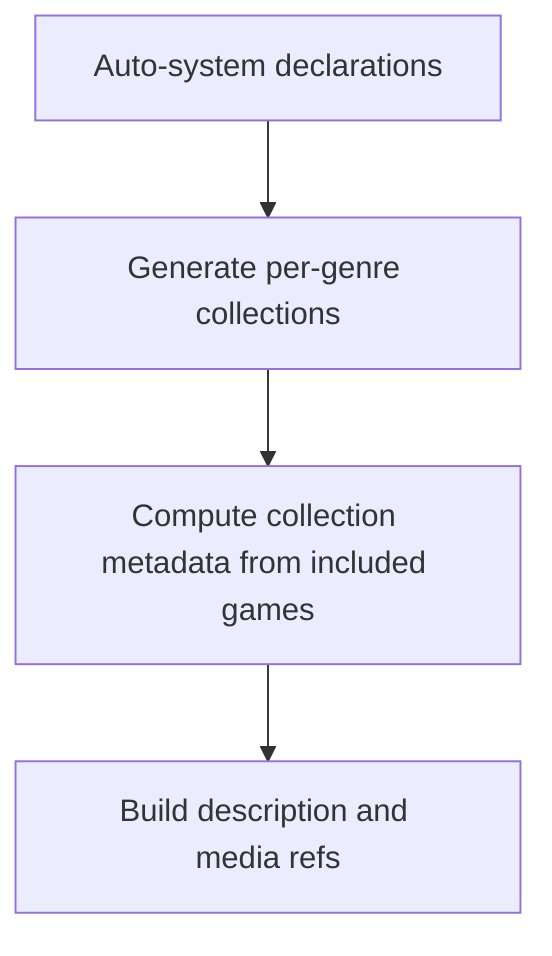
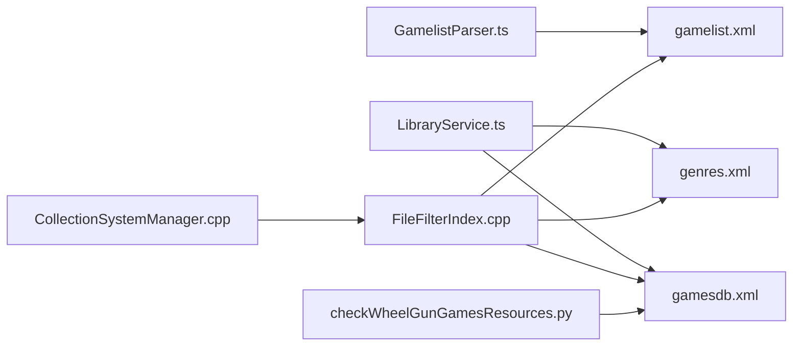

# Library Indexing and Search

<cite>
**Referenced Files in This Document**
- [FileFilterIndex.cpp](file://emulationstation/.riescade/src/docs/es_src/FileFilterIndex.cpp)
- [FileFilterIndex.h](file://emulationstation/.riescade/src/docs/es_src/FileFilterIndex.h)
- [CollectionSystemManager.cpp](file://emulationstation/.riescade/src/docs/es_src/CollectionSystemManager.cpp)
- [GamelistParser.ts](file://emulationstation/.riescade/src/src/main/parsers/GamelistParser.ts)
- [LibraryService.ts](file://emulationstation/.riescade/src/src/main/services/LibraryService.ts)
- [checkWheelGunGamesResources.py](file://emulationstation/resources/checkWheelGunGamesResources.py)
- [gamelist.xml](file://system/es_menu/gamelist.xml)
- [genres.xml](file://emulationstation/resources/genres.xml)
- [gamesdb.xml](file://emulationstation/resources/gamesdb.xml)
</cite>

## Table of Contents
1. [Introduction](#introduction)
2. [Project Structure](#project-structure)
3. [Core Components](#core-components)
4. [Architecture Overview](#architecture-overview)
5. [Detailed Component Analysis](#detailed-component-analysis)
6. [Dependency Analysis](#dependency-analysis)
7. [Performance Considerations](#performance-considerations)
8. [Troubleshooting Guide](#troubleshooting-guide)
9. [Conclusion](#conclusion)
10. [Appendices](#appendices)

## Introduction
This document explains the library indexing and search functionality used by the RIESCADE system. It covers how the game database is modeled, how games are indexed for fast filtering and searching, the parsing pipeline for gamelist.xml, and the runtime filtering/indexing infrastructure. It also documents search algorithms, indexing strategies, query optimization techniques, ranking considerations, fuzzy matching capabilities, and maintenance procedures such as index rebuilding. Practical examples illustrate search queries, filter combinations, sorting options, and troubleshooting slow searches.

## Project Structure
The indexing and search system spans several components:
- Runtime filtering and indexing engine implemented in C++.
- TypeScript-based gamelist parsing and library service logic.
- XML-based metadata sources (gamelist.xml, genres.xml, gamesdb.xml).
- Utility scripts for validating control-type metadata.

**Diagram sources**
- [FileFilterIndex.cpp:52-162](file://emulationstation/.riescade/src/docs/es_src/FileFilterIndex.cpp#L52-L162)
- [CollectionSystemManager.cpp:1-879](file://emulationstation/.riescade/src/docs/es_src/CollectionSystemManager.cpp#L1-L879)
- [GamelistParser.ts:1-113](file://emulationstation/.riescade/src/src/main/parsers/GamelistParser.ts#L1-L113)
- [LibraryService.ts:153-266](file://emulationstation/.riescade/src/src/main/services/LibraryService.ts#L153-L266)
- [checkWheelGunGamesResources.py:1-43](file://emulationstation/resources/checkWheelGunGamesResources.py#L1-L43)
- [gamelist.xml:1-800](file://system/es_menu/gamelist.xml#L1-L800)

**Section sources**
- [FileFilterIndex.cpp:52-162](file://emulationstation/.riescade/src/docs/es_src/FileFilterIndex.cpp#L52-L162)
- [GamelistParser.ts:1-113](file://emulationstation/.riescade/src/src/main/parsers/GamelistParser.ts#L1-L113)
- [LibraryService.ts:153-266](file://emulationstation/.riescade/src/src/main/services/LibraryService.ts#L153-L266)
- [gamelist.xml:1-800](file://system/es_menu/gamelist.xml#L1-L800)

## Core Components
- FileFilterIndex: Maintains per-field indices (genre, publisher/developer, year, language, region, player count, ratings, favorites, kid game flag, played count, vertical games, light gun/wheel/trackball/spinner availability, presence/absence of media assets) and supports importing and merging indices across filters.
- CollectionSystemManager: Creates auto-collections (e.g., arcade, vertical arcade, lightgun, wheel, trackball, spinner) and manages metadata for collection systems.
- GamelistParser: Parses gamelist.xml into normalized Game objects, resolves media paths, and writes back gamelist.xml.
- LibraryService: Builds genre maps and parses gamesdb.xml to extract control-type metadata (wheel, trackball, spinner, light gun) per system and game.

**Section sources**
- [FileFilterIndex.h:150-182](file://emulationstation/.riescade/src/docs/es_src/FileFilterIndex.h#L150-L182)
- [FileFilterIndex.cpp:52-162](file://emulationstation/.riescade/src/docs/es_src/FileFilterIndex.cpp#L52-L162)
- [CollectionSystemManager.cpp:1-879](file://emulationstation/.riescade/src/docs/es_src/CollectionSystemManager.cpp#L1-L879)
- [GamelistParser.ts:1-113](file://emulationstation/.riescade/src/src/main/parsers/GamelistParser.ts#L1-L113)
- [LibraryService.ts:153-266](file://emulationstation/.riescade/src/src/main/services/LibraryService.ts#L153-L266)

## Architecture Overview
The indexing pipeline begins with parsing gamelist.xml into a normalized set of Game objects. Indices are maintained per metadata field and updated incrementally as filters change. Auto-collections are generated from these indices and metadata sources. Queries combine text search and boolean filters to produce filtered sets, optionally ranked by relevance.

**Diagram sources**
- [GamelistParser.ts:1-113](file://emulationstation/.riescade/src/src/main/parsers/GamelistParser.ts#L1-L113)
- [FileFilterIndex.cpp:52-162](file://emulationstation/.riescade/src/docs/es_src/FileFilterIndex.cpp#L52-L162)
- [CollectionSystemManager.cpp:1-879](file://emulationstation/.riescade/src/docs/es_src/CollectionSystemManager.cpp#L1-L879)
- [LibraryService.ts:153-266](file://emulationstation/.riescade/src/src/main/services/LibraryService.ts#L153-L266)

## Detailed Component Analysis

### FileFilterIndex: Indexing and Filtering Engine
- Purpose: Maintain counts and membership for categorical metadata fields and support incremental updates.
- Indices: Tracks counts per key for fields such as genre, family, players, publisher/developer, ratings, favorites, year, language, region, kid game, played, vertical orientation, and control types (light gun, wheel, trackball, spinner), plus presence/absence of media assets.
- Operations:
  - resetIndex: Clears relevance flag, text filter, and all indices.
  - importIndex: Merges counts from another index (useful for combining indices across systems).
  - manageIndexEntry: Adds or decrements counts for a given key.
  - clearIndex: Resets a specific index.
  - copyFrom: Copies filter state and indices from another filter.

**Diagram sources**
- [FileFilterIndex.cpp:52-162](file://emulationstation/.riescade/src/docs/es_src/FileFilterIndex.cpp#L52-L162)
- [FileFilterIndex.h:150-182](file://emulationstation/.riescade/src/docs/es_src/FileFilterIndex.h#L150-L182)

**Section sources**
- [FileFilterIndex.cpp:52-162](file://emulationstation/.riescade/src/docs/es_src/FileFilterIndex.cpp#L52-L162)
- [FileFilterIndex.h:150-182](file://emulationstation/.riescade/src/docs/es_src/FileFilterIndex.h#L150-L182)

### GamelistParser: gamelist.xml Parsing and Normalization
- Parses gamelist.xml into a normalized array of Game objects.
- Resolves media paths (image, video, marquee, thumbnail, fanart, titleshot, wheel, mix) to absolute or UI-friendly forms.
- Ensures uniqueness by normalizing and deduplicating paths.
- Supports writing back gamelist.xml with formatted output.

**Diagram sources**
- [GamelistParser.ts:1-113](file://emulationstation/.riescade/src/src/main/parsers/GamelistParser.ts#L1-L113)

**Section sources**
- [GamelistParser.ts:1-113](file://emulationstation/.riescade/src/src/main/parsers/GamelistParser.ts#L1-L113)

### LibraryService: Genre and Control-Type Metadata
- Builds a genre map from genres.xml for multi-language matching and genre-based collections.
- Parses gamesdb.xml to extract control-type metadata (wheel, trackball, spinner, light gun) per system and game, enabling auto-collections and quick counts.

**Diagram sources**
- [LibraryService.ts:153-266](file://emulationstation/.riescade/src/src/main/services/LibraryService.ts#L153-L266)
- [genres.xml](file://emulationstation/resources/genres.xml)
- [gamesdb.xml](file://emulationstation/resources/gamesdb.xml)

**Section sources**
- [LibraryService.ts:153-266](file://emulationstation/.riescade/src/src/main/services/LibraryService.ts#L153-L266)

### CollectionSystemManager: Auto-Collections and Metadata
- Defines auto-collections such as arcade, vertical arcade, lightgun, wheel, trackball, and spinner.
- Generates collection metadata (description, ratings, players, genre, release date, developer, media assets) based on included games.

**Diagram sources**
- [CollectionSystemManager.cpp:1-879](file://emulationstation/.riescade/src/docs/es_src/CollectionSystemManager.cpp#L1-L879)

**Section sources**
- [CollectionSystemManager.cpp:1-879](file://emulationstation/.riescade/src/docs/es_src/CollectionSystemManager.cpp#L1-L879)

### gamelist.xml Schema and Data Model
- Each game element contains metadata fields such as path, name, description, image, marquee, rating, releasedate, developer, publisher, genre, playcount, lastplayed, gametime, lang, region, and flags (favorite, hidden, kidgame).
- The parser normalizes path entries and resolves media fields, ensuring consistent representation for filtering and display.

**Section sources**
- [gamelist.xml:1-800](file://system/es_menu/gamelist.xml#L1-L800)
- [GamelistParser.ts:1-113](file://emulationstation/.riescade/src/src/main/parsers/GamelistParser.ts#L1-L113)

## Dependency Analysis
- GamelistParser depends on fast-xml-parser for parsing and building XML.
- LibraryService depends on genres.xml and gamesdb.xml for genre and control-type metadata.
- FileFilterIndex maintains indices that are consumed by CollectionSystemManager for auto-collections.
- Validation script checks gamesdb.xml structure and ordering.

**Diagram sources**
- [GamelistParser.ts:1-113](file://emulationstation/.riescade/src/src/main/parsers/GamelistParser.ts#L1-L113)
- [LibraryService.ts:153-266](file://emulationstation/.riescade/src/src/main/services/LibraryService.ts#L153-L266)
- [FileFilterIndex.cpp:52-162](file://emulationstation/.riescade/src/docs/es_src/FileFilterIndex.cpp#L52-L162)
- [CollectionSystemManager.cpp:1-879](file://emulationstation/.riescade/src/docs/es_src/CollectionSystemManager.cpp#L1-L879)
- [checkWheelGunGamesResources.py:1-43](file://emulationstation/resources/checkWheelGunGamesResources.py#L1-L43)

**Section sources**
- [GamelistParser.ts:1-113](file://emulationstation/.riescade/src/src/main/parsers/GamelistParser.ts#L1-L113)
- [LibraryService.ts:153-266](file://emulationstation/.riescade/src/src/main/services/LibraryService.ts#L153-L266)
- [FileFilterIndex.cpp:52-162](file://emulationstation/.riescade/src/docs/es_src/FileFilterIndex.cpp#L52-L162)
- [CollectionSystemManager.cpp:1-879](file://emulationstation/.riescade/src/docs/es_src/CollectionSystemManager.cpp#L1-L879)
- [checkWheelGunGamesResources.py:1-43](file://emulationstation/resources/checkWheelGunGamesResources.py#L1-L43)

## Performance Considerations
- Indexing strategy:
  - Per-field maps store counts per key for O(1) insert/update/remove and O(k) enumeration for a field with k distinct keys.
  - Unordered sets maintain filtered keys for fast intersection and union operations across filters.
- Query optimization:
  - Incremental updates via manageIndexEntry minimize recomputation.
  - importIndex merges counts efficiently across filters.
  - Deduplication during parsing reduces redundant work.
- Memory and CPU trade-offs:
  - Maintaining separate indices per field enables fast filtering but increases memory usage.
  - Relevance scoring can be toggled via mUseRelevency to balance accuracy and cost.
- Bulk operations:
  - Use importIndex to merge indices across systems or collections.
  - resetIndex clears all indices and filters for rebuild scenarios.

[No sources needed since this section provides general guidance]

## Troubleshooting Guide
- Slow searches:
  - Verify indices are populated by checking that resetIndex is not called excessively and that importIndex is used to aggregate counts.
  - Confirm deduplication in parsing is working to avoid inflated counts.
- Incorrect control-type detection:
  - Validate gamesdb.xml structure and ordering using the provided Python checker.
- Missing or misaligned metadata:
  - Ensure gamelist.xml paths are normalized and media fields are resolvable.
  - Confirm genres.xml is present and properly formatted for genre-based matching.

**Section sources**
- [FileFilterIndex.cpp:148-162](file://emulationstation/.riescade/src/docs/es_src/FileFilterIndex.cpp#L148-L162)
- [GamelistParser.ts:1-113](file://emulationstation/.riescade/src/src/main/parsers/GamelistParser.ts#L1-L113)
- [checkWheelGunGamesResources.py:1-43](file://emulationstation/resources/checkWheelGunGamesResources.py#L1-L43)

## Conclusion
The RIESCADE library indexing and search system combines a robust C++ filtering engine with TypeScript-based parsing and metadata enrichment. By maintaining per-field indices and leveraging auto-collections, it delivers fast filtering and dynamic collection generation. Proper maintenance, including index resets and bulk imports, ensures optimal performance. Validation of metadata sources further improves reliability.

[No sources needed since this section summarizes without analyzing specific files]

## Appendices

### Search Algorithms and Ranking
- Text search: Implemented via a text filter string applied across normalized game data.
- Boolean filters: Combine categorical selections (genre, platform, control type, etc.) using set intersections.
- Relevance scoring: Toggleable via mUseRelevency to weight matches (implementation details are internal to the filtering engine).

**Section sources**
- [FileFilterIndex.cpp:52-162](file://emulationstation/.riescade/src/docs/es_src/FileFilterIndex.cpp#L52-L162)

### Index Rebuilding Procedures
- Reset indices: Call resetIndex to clear all indices and filters.
- Re-import indices: Use importIndex to merge counts from external sources or across systems.
- Reparse metadata: Re-run GamelistParser and LibraryService to refresh genre and control-type indices.

**Section sources**
- [FileFilterIndex.cpp:148-162](file://emulationstation/.riescade/src/docs/es_src/FileFilterIndex.cpp#L148-L162)
- [GamelistParser.ts:1-113](file://emulationstation/.riescade/src/src/main/parsers/GamelistParser.ts#L1-L113)
- [LibraryService.ts:153-266](file://emulationstation/.riescade/src/src/main/services/LibraryService.ts#L153-L266)

### Practical Examples

- Example 1: Filter by genre and platform
  - Select genre “Shooter” and system “Nintendo 64.”
  - Intersection of genre and platform indices yields filtered results.

- Example 2: Advanced control-type filtering
  - Enable “Wheel Games” auto-collection to include wheel-enabled games from gamesdb.xml.

- Example 3: Sorting options
  - Sort by filename ascending for consistent ordering across views.

- Example 4: Bulk indexing operations
  - Import indices from multiple systems using importIndex to aggregate counts.

- Example 5: Troubleshooting slow searches
  - Run resetIndex followed by re-import of indices and re-parse of gamelist.xml and genres.xml.

**Section sources**
- [CollectionSystemManager.cpp:1-879](file://emulationstation/.riescade/src/docs/es_src/CollectionSystemManager.cpp#L1-L879)
- [LibraryService.ts:153-266](file://emulationstation/.riescade/src/src/main/services/LibraryService.ts#L153-L266)
- [FileFilterIndex.cpp:99-146](file://emulationstation/.riescade/src/docs/es_src/FileFilterIndex.cpp#L99-L146)
- [GamelistParser.ts:1-113](file://emulationstation/.riescade/src/src/main/parsers/GamelistParser.ts#L1-L113)