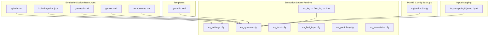
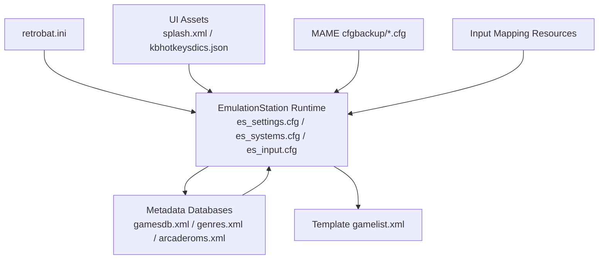
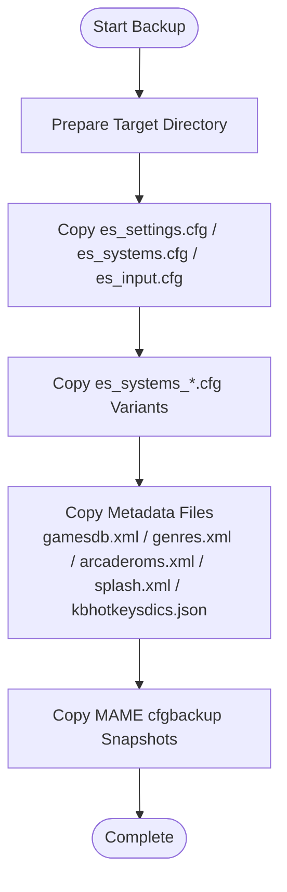
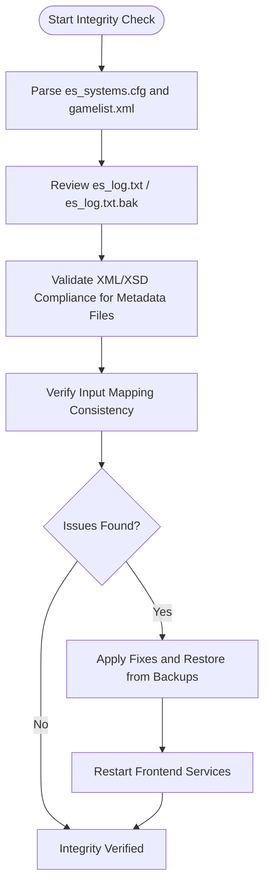
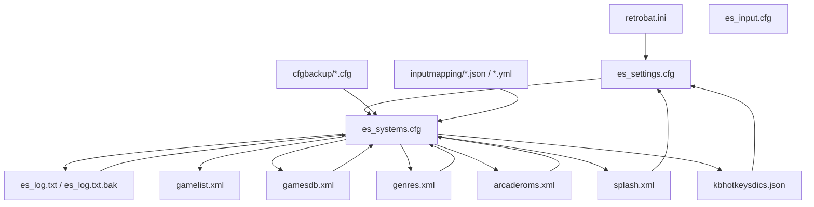

# Library Maintenance and Operations

<cite>
**Referenced Files in This Document**
- [retrobat.ini](file://retrobat.ini)
- [gamesdb.xml](file://emulationstation/resources/gamesdb.xml)
- [gamelist.xml](file://system/templates/emulationstation/gamelist.xml)
- [arcaderoms.xml](file://emulationstation/resources/arcaderoms.xml)
- [genres.xml](file://emulationstation/resources/genres.xml)
- [splash.xml](file://emulationstation/resources/splash.xml)
- [kbhotkeysdics.json](file://emulationstation/resources/kbhotkeysdics.json)
- [default.cfg](file://saves/mame/cfgbackup/default.cfg)
- [1941.cfg](file://saves/mame/cfgbackup/1941.cfg)
- [es_systems.cfg](file://emulationstation/.emulationstation/es_systems.cfg)
- [es_settings.cfg](file://emulationstation/.emulationstation/es_settings.cfg)
- [es_input.cfg](file://emulationstation/.emulationstation/es_input.cfg)
- [es_log.txt](file://emulationstation/.emulationstation/es_log.txt)
- [es_log.txt.bak](file://emulationstation/.emulationstation/es_log.bak)
- [es_last_input.cfg](file://emulationstation/.emulationstation/es_last_input.cfg)
- [es_padtokey.cfg](file://emulationstation/.emulationstation/es_padtokey.cfg)
- [es_savestates.cfg](file://emulationstation/.emulationstation/es_savestates.cfg)
- [es_systems_3doj.cfg](file://emulationstation/.emulationstation/es_systems_3doj.cfg)
- [es_systems_aae.cfg](file://emulationstation/.emulationstation/es_systems_aae.cfg)
- [es_systems_android.cfg](file://emulationstation/.emulationstation/es_systems_android.cfg)
- [es_systems_arcade.cfg](file://emulationstation/.emulationstation/es_systems_arcade.cfg)
- [es_systems_arcadedumps.cfg](file://emulationstation/.emulationstation/es_systems_arcadedumps.cfg)
- [es_systems_bigfish.cfg](file://emulationstation/.emulationstation/es_systems_bigfish.cfg)
- [es_systems_casino.cfg](file://emulationstation/.emulationstation/es_systems_casino.cfg)
- [es_systems_cinematronics.cfg](file://emulationstation/.emulationstation/es_systems_cinematronics.cfg)
- [es_systems_ddr.cfg](file://emulationstation/.emulationstation/es_systems_ddr.cfg)
- [es_systems_elektronika.cfg](file://emulationstation/.emulationstation/es_systems_elektronika.cfg)
- [es_systems_fc.cfg](file://emulationstation/.emulationstation/es_systems_fc.cfg)
- [es_systems_fightcade.cfg](file://emulationstation/.emulationstation/es_systems_fightcade.cfg)
- [es_systems_fruit.cfg](file://emulationstation/.emulationstation/es_systems_fruit.cfg)
- [es_systems_gamegearh.cfg](file://emulationstation/.emulationstation/es_systems_gamegearh.cfg)
- [es_systems_genesis.cfg](file://emulationstation/.emulationstation/es_systems_genesis.cfg)
- [es_systems_ique.cfg](file://emulationstation/.emulationstation/es_systems_ique.cfg)
- [es_systems_jakks.cfg](file://emulationstation/.emulationstation/es_systems_jakks.cfg)
- [es_systems_konamih.cfg](file://emulationstation/.emulationstation/es_systems_konamih.cfg)
- [es_systems_locomalito.cfg](file://emulationstation/.emulationstation/es_systems_locomalito.cfg)
- [es_systems_magazine.cfg](file://emulationstation/.emulationstation/es_systems_magazine.cfg)
- [es_systems_mastersystemfm.cfg](file://emulationstation/.emulationstation/es_systems_mastersystemfm.cfg)
- [es_systems_mastersystemh.cfg](file://emulationstation/.emulationstation/es_systems_mastersystemh.cfg)
- [es_systems_megadriveh.cfg](file://emulationstation/.emulationstation/es_systems_megadriveh.cfg)
- [es_systems_n64h.cfg](file://emulationstation/.emulationstation/es_systems_n64h.cfg)
- [es_systems_n64j.cfg](file://emulationstation/.emulationstation/es_systems_n64j.cfg)
- [es_systems_neogeo.cfg](file://emulationstation/.emulationstation/es_systems_neogeo.cfg)
- [es_systems_neogeoaes.cfg](file://emulationstation/.emulationstation/es_systems_neogeoaes.cfg)
- [es_systems_neogeoh.cfg](file://emulationstation/.emulationstation/es_systems_neogeoh.cfg)
- [es_systems_nes3d.cfg](file://emulationstation/.emulationstation/es_systems_nes3d.cfg)
- [es_systems_nesb.cfg](file://emulationstation/.emulationstation/es_systems_nesb.cfg)
- [es_systems_nesh.cfg](file://emulationstation/.emulationstation/es_systems_nesh.cfg)
- [es_systems_neshd.cfg](file://emulationstation/.emulationstation/es_systems_neshd.cfg)
- [es_systems_ouya.cfg](file://emulationstation/.emulationstation/es_systems_ouya.cfg)
- [es_systems_palm.cfg](file://emulationstation/.emulationstation/es_systems_palm.cfg)
- [es_systems_pinballfx.cfg](file://emulationstation/.emulationstation/es_systems_pinballfx.cfg)
- [es_systems_pinballfx2.cfg](file://emulationstation/.emulationstation/es_systems_pinballfx2.cfg)
- [es_systems_pinballfx3.cfg](file://emulationstation/.emulationstation/es_systems_pinballfx3.cfg)
- [es_systems_pinballhd.cfg](file://emulationstation/.emulationstation/es_systems_pinballhd.cfg)
- [es_systems_pinballm.cfg](file://emulationstation/.emulationstation/es_systems_pinballm.cfg)
- [es_systems_pippin.cfg](file://emulationstation/.emulationstation/es_systems_pippin.cfg)
- [es_systems_popcap.cfg](file://emulationstation/.emulationstation/es_systems_popcap.cfg)
- [es_systems_ps2br.cfg](file://emulationstation/.emulationstation/es_systems_ps2br.cfg)
- [es_systems_ps2h.cfg](file://emulationstation/.emulationstation/es_systems_ps2h.cfg)
- [es_systems_ps3br.cfg](file://emulationstation/.emulationstation/es_systems_ps3br.cfg)
- [es_systems_ps3j.cfg](file://emulationstation/.emulationstation/es_systems_ps3j.cfg)
- [es_systems_pspminis.cfg](file://emulationstation/.emulationstation/es_systems_pspminis.cfg)
- [es_systems_psxh.cfg](file://emulationstation/.emulationstation/es_systems_psxh.cfg)
- [es_systems_quake3.cfg](file://emulationstation/.emulationstation/es_systems_quake3.cfg)
- [es_systems_saturnj.cfg](file://emulationstation/.emulationstation/es_systems_saturnj.cfg)
- [es_systems_sega32xh.cfg](file://emulationstation/.emulationstation/es_systems_sega32xh.cfg)
- [es_systems_segaages2500.cfg](file://emulationstation/.emulationstation/es_systems_segaages2500.cfg)
- [es_systems_segastv.cfg](file://emulationstation/.emulationstation/es_systems_segastv.cfg)
- [es_systems_sfc.cfg](file://emulationstation/.emulationstation/es_systems_sfc.cfg)
- [es_systems_snesh.cfg](file://emulationstation/.emulationstation/es_systems_snesh.cfg)
- [es_systems_socrates.cfg](file://emulationstation/.emulationstation/es_systems_socrates.cfg)
- [es_systems_sordm5.cfg](file://emulationstation/.emulationstation/es_systems_sordm5.cfg)
- [es_systems_supercharger.cfg](file://emulationstation/.emulationstation/es_systems_supercharger.cfg)
- [es_systems_svmu.cfg](file://emulationstation/.emulationstation/es_systems_svmu.cfg)
- [es_systems_switch2.cfg](file://emulationstation/.emulationstation/es_systems_switch2.cfg)
- [es_systems_tg16.cfg](file://emulationstation/.emulationstation/es_systems_tg16.cfg)
- [es_systems_tg16cd.cfg](file://emulationstation/.emulationstation/es_systems_tg16cd.cfg)
- [es_systems_tiger.cfg](file://emulationstation/.emulationstation/es_systems_tiger.cfg)
- [es_systems_tigerrz.cfg](file://emulationstation/.emulationstation/es_systems_tigerrz.cfg)
- [es_systems_touhou.cfg](file://emulationstation/.emulationstation/es_systems_touhou.cfg)
- [es_systems_turboduo.cfg](file://emulationstation/.emulationstation/es_systems_turboduo.cfg)
- [es_systems_unity.cfg](file://emulationstation/.emulationstation/es_systems_unity.cfg)
- [es_systems_wiih.cfg](file://emulationstation/.emulationstation/es_systems_wiih.cfg)
- [es_systems_wiiu-sky.cfg](file://emulationstation/.emulationstation/es_systems_wiiu-sky.cfg)
- [es_systems_wiiware.cfg](file://emulationstation/.emulationstation/es_systems_wiiware.cfg)
- [es_systems_windows9x.cfg](file://emulationstation/.emulationstation/es_systems_windows9x.cfg)
- [es_systems_xboxlivearcade.cfg](file://emulationstation/.emulationstation/es_systems_xboxlivearcade.cfg)
- [es_systems_zeebo.cfg](file://emulationstation/.emulationstation/es_systems_zeebo.cfg)
- [es_systems_zmachine.cfg](file://emulationstation/.emulationstation/es_systems_zmachine.cfg)
- [community_relay_servers.xml](file://emulationstation/resources/community_relay_servers.xml)
- [arcade_sticks.json](file://system/resources/inputmapping/arcade_sticks.json)
- [retroarch_controller.json](file://system/resources/inputmapping/retroarch_controller.json)
- [mdControllers.json](file://system/resources/inputmapping/mdControllers.json)
- [n64Controllers.json](file://system/resources/inputmapping/n64Controllers.json)
- [GCControllers.json](file://system/resources/inputmapping/GCControllers.json)
- [3doControllers.json](file://system/resources/inputmapping/3doControllers.json)
- [saturnControllers.json](file://system/resources/inputmapping/saturnControllers.json)
- [libretro_cap32.json](file://system/resources/inputmapping/libretro_cap32.json)
- [controller_hotkeys.yml](file://system/resources/inputmapping/controller_hotkeys.yml)
- [controller_hotkeys.yml (template)](file://system/resources/inputmapping/usertemplates/controller_hotkeys.yml)
- [kb_hotkeys.yml](file://system/resources/inputmapping/kb_hotkeys.yml)
- [controller_hotkeys.yml (fbneo)](file://system/resources/inputmapping/fbneo.yml)
- [controller_hotkeys.yml (flycast_Arcade)](file://system/resources/inputmapping/flycast_Arcade.yml)
- [controller_hotkeys.yml (supermodel)](file://system/resources/inputmapping/supermodel.yml)
- [controller_hotkeys.yml (teknoparrot)](file://system/resources/inputmapping/teknoparrot.yml)
- [controller_hotkeys.yml (play_Arcade)](file://system/resources/inputmapping/play_Arcade.yml)
- [controller_hotkeys.yml (libretro_mame)](file://system/resources/inputmapping/libretro_mame.yml)
- [controller_hotkeys.yml (libretro_supermodel)](file://system/resources/inputmapping/libretro_supermodel.yml)
- [controller_hotkeys.yml (lr-mame)](file://system/resources/inputmapping/lr-mame.yml)
- [controller_hotkeys.yml (mame)](file://system/resources/inputmapping/mame.yml)
- [controller_hotkeys.yml (retroarch_controller_hotkeys)](file://system/resources/inputmapping/retroarch_controller_hotkeys.yml)
- [controller_hotkeys.yml (retroarch_kb_hotkeys)](file://system/resources/inputmapping/retroarch_kb_hotkeys.yml)
</cite>

## Table of Contents
1. [Introduction](#introduction)
2. [Project Structure](#project-structure)
3. [Core Components](#core-components)
4. [Architecture Overview](#architecture-overview)
5. [Detailed Component Analysis](#detailed-component-analysis)
6. [Dependency Analysis](#dependency-analysis)
7. [Performance Considerations](#performance-considerations)
8. [Troubleshooting Guide](#troubleshooting-guide)
9. [Conclusion](#conclusion)
10. [Appendices](#appendices)

## Introduction
This document provides comprehensive guidance for maintaining and operating the game library managed by the system. It covers bulk operations such as mass metadata updates, ROM reorganization, and collection maintenance; backup and restore procedures for the entire game library database; library repair operations, database integrity checks, and corruption recovery processes; maintenance scripts and automated cleanup operations; library optimization routines; integration with external download managers and resource validation systems; performance monitoring, database size management, and maintenance scheduling; and practical examples of emergency recovery procedures, bulk operation best practices, and preventive maintenance strategies.

## Project Structure
The repository organizes library-related assets and configuration files across several directories:
- emulationstation/resources: Contains metadata databases (gamesdb.xml, genres.xml, arcaderoms.xml), UI assets (splash.xml), and keyboard hotkeys dictionaries (kbhotkeysdics.json).
- emulationstation/.emulationstation: Stores EmulationStation runtime configuration and logs (es_settings.cfg, es_systems*.cfg, es_input.cfg, es_log.txt, es_log.txt.bak, es_last_input.cfg, es_padtokey.cfg, es_savestates.cfg).
- system/templates/emulationstation: Provides a minimal gamelist.xml template used by the frontend.
- saves/mame/cfgbackup: Holds MAME configuration backups that can be leveraged during maintenance and restoration tasks.
- system/resources/inputmapping: Centralizes controller mapping definitions and hotkey configurations for various emulators and input devices.

**Diagram sources**
- [gamesdb.xml](file://emulationstation/resources/gamesdb.xml)
- [genres.xml](file://emulationstation/resources/genres.xml)
- [arcaderoms.xml](file://emulationstation/resources/arcaderoms.xml)
- [splash.xml](file://emulationstation/resources/splash.xml)
- [kbhotkeysdics.json](file://emulationstation/resources/kbhotkeysdics.json)
- [es_settings.cfg](file://emulationstation/.emulationstation/es_settings.cfg)
- [es_systems.cfg](file://emulationstation/.emulationstation/es_systems.cfg)
- [es_input.cfg](file://emulationstation/.emulationstation/es_input.cfg)
- [es_log.txt](file://emulationstation/.emulationstation/es_log.txt)
- [es_log.txt.bak](file://emulationstation/.emulationstation/es_log.txt.bak)
- [es_last_input.cfg](file://emulationstation/.emulationstation/es_last_input.cfg)
- [es_padtokey.cfg](file://emulationstation/.emulationstation/es_padtokey.cfg)
- [es_savestates.cfg](file://emulationstation/.emulationstation/es_savestates.cfg)
- [gamelist.xml](file://system/templates/emulationstation/gamelist.xml)
- [default.cfg](file://saves/mame/cfgbackup/default.cfg)

**Section sources**
- [retrobat.ini](file://retrobat.ini)
- [gamesdb.xml](file://emulationstation/resources/gamesdb.xml)
- [es_systems.cfg](file://emulationstation/.emulationstation/es_systems.cfg)

## Core Components
- EmulationStation configuration and runtime:
  - es_settings.cfg controls frontend behavior, including fullscreen, vsync, and framerate drawing.
  - es_systems.cfg defines per-system launchers and ROM paths.
  - es_input.cfg manages input mappings and hotkeys.
  - es_log.txt and es_log.txt.bak capture runtime logs for diagnostics.
  - es_last_input.cfg, es_padtokey.cfg, and es_savestates.cfg support input device mapping, pad-to-key bindings, and savestate management.
- Metadata databases:
  - gamesdb.xml provides game-specific metadata (e.g., wheel, gun, trackball, spinner configurations).
  - genres.xml categorizes systems and games by genre.
  - arcaderoms.xml contains additional arcade metadata.
  - splash.xml and kbhotkeysdics.json support UI and keyboard hotkeys.
- Template gamelist.xml serves as a baseline for frontend parsing.
- MAME cfgbackup stores configuration snapshots useful for restoration and rollback.
- Input mapping resources centralize controller definitions and hotkeys for multiple emulators.

**Section sources**
- [retrobat.ini](file://retrobat.ini)
- [es_settings.cfg](file://emulationstation/.emulationstation/es_settings.cfg)
- [es_systems.cfg](file://emulationstation/.emulationstation/es_systems.cfg)
- [es_input.cfg](file://emulationstation/.emulationstation/es_input.cfg)
- [es_log.txt](file://emulationstation/.emulationstation/es_log.txt)
- [es_log.txt.bak](file://emulationstation/.emulationstation/es_log.txt.bak)
- [es_last_input.cfg](file://emulationstation/.emulationstation/es_last_input.cfg)
- [es_padtokey.cfg](file://emulationstation/.emulationstation/es_padtokey.cfg)
- [es_savestates.cfg](file://emulationstation/.emulationstation/es_savestates.cfg)
- [gamesdb.xml](file://emulationstation/resources/gamesdb.xml)
- [genres.xml](file://emulationstation/resources/genres.xml)
- [arcaderoms.xml](file://emulationstation/resources/arcaderoms.xml)
- [splash.xml](file://emulationstation/resources/splash.xml)
- [kbhotkeysdics.json](file://emulationstation/resources/kbhotkeysdics.json)
- [gamelist.xml](file://system/templates/emulationstation/gamelist.xml)
- [default.cfg](file://saves/mame/cfgbackup/default.cfg)

## Architecture Overview
The library maintenance architecture integrates configuration, metadata, and runtime components to support robust operations:
- Configuration layer: RetroBat and EmulationStation settings define how the frontend behaves and which systems are enabled.
- Metadata layer: XML and JSON datasets provide game metadata, input mappings, and genre classifications.
- Runtime layer: Logs and system configuration files record state and facilitate diagnostics and recovery.
- Backup layer: MAME configuration backups enable safe restoration and rollback.

**Diagram sources**
- [retrobat.ini](file://retrobat.ini)
- [es_settings.cfg](file://emulationstation/.emulationstation/es_settings.cfg)
- [es_systems.cfg](file://emulationstation/.emulationstation/es_systems.cfg)
- [es_input.cfg](file://emulationstation/.emulationstation/es_input.cfg)
- [gamesdb.xml](file://emulationstation/resources/gamesdb.xml)
- [genres.xml](file://emulationstation/resources/genres.xml)
- [arcaderoms.xml](file://emulationstation/resources/arcaderoms.xml)
- [splash.xml](file://emulationstation/resources/splash.xml)
- [kbhotkeysdics.json](file://emulationstation/resources/kbhotkeysdics.json)
- [gamelist.xml](file://system/templates/emulationstation/gamelist.xml)
- [default.cfg](file://saves/mame/cfgbackup/default.cfg)

## Detailed Component Analysis

### Bulk Operations: Mass Metadata Updates
Bulk metadata updates involve modifying or enriching metadata across the library:
- Update gamesdb.xml entries to reflect new input device mappings or game-specific features.
- Modify genres.xml to adjust system or game categories.
- Adjust es_systems.cfg to update ROM paths or system launchers for bulk system reorganization.
- Regenerate or update gamelist.xml via the template to ensure frontend parsing consistency.

Best practices:
- Stage changes in a development environment before applying to production.
- Use version control to track modifications to metadata and configuration files.
- Validate XML/XSD compliance for metadata files to prevent frontend parsing errors.

**Section sources**
- [gamesdb.xml](file://emulationstation/resources/gamesdb.xml)
- [genres.xml](file://emulationstation/resources/genres.xml)
- [es_systems.cfg](file://emulationstation/.emulationstation/es_systems.cfg)
- [gamelist.xml](file://system/templates/emulationstation/gamelist.xml)

### ROM Reorganization
ROM reorganization involves moving or renaming ROM files and updating system configurations:
- Update es_systems.cfg to reflect new ROM locations for each system.
- Ensure gamelist.xml parsing remains consistent after reorganization.
- Validate that metadata databases align with the new file layout.

Operational steps:
- Create a backup of es_systems.cfg and related system configuration files.
- Perform moves/renames in batches per system to minimize frontend parsing errors.
- Verify frontend display after each batch.

**Section sources**
- [es_systems.cfg](file://emulationstation/.emulationstation/es_systems.cfg)
- [gamelist.xml](file://system/templates/emulationstation/gamelist.xml)

### Collection Maintenance
Collection maintenance ensures accurate grouping and filtering:
- Use genres.xml to maintain consistent genre classifications across systems.
- Update es_systems.cfg to reflect any new collections or system groupings.
- Monitor es_log.txt for parsing errors after collection changes.

**Section sources**
- [genres.xml](file://emulationstation/resources/genres.xml)
- [es_systems.cfg](file://emulationstation/.emulationstation/es_systems.cfg)
- [es_log.txt](file://emulationstation/.emulationstation/es_log.txt)

### Backup and Restore Procedures
Backup and restore procedures protect against data loss:
- Backup strategy:
  - Archive es_settings.cfg, es_systems.cfg, es_input.cfg, and all es_systems_*.cfg variants.
  - Preserve metadata files: gamesdb.xml, genres.xml, arcaderoms.xml, splash.xml, kbhotkeysdics.json.
  - Save MAME cfgbackup snapshots for quick restoration.
- Restore strategy:
  - Stop frontend services before replacing configuration files.
  - Replace backed-up files with current versions and restart services.
  - Validate frontend display and logging after restore.

**Diagram sources**
- [es_settings.cfg](file://emulationstation/.emulationstation/es_settings.cfg)
- [es_systems.cfg](file://emulationstation/.emulationstation/es_systems.cfg)
- [es_input.cfg](file://emulationstation/.emulationstation/es_input.cfg)
- [es_systems_3doj.cfg](file://emulationstation/.emulationstation/es_systems_3doj.cfg)
- [es_systems_aae.cfg](file://emulationstation/.emulationstation/es_systems_aae.cfg)
- [es_systems_android.cfg](file://emulationstation/.emulationstation/es_systems_android.cfg)
- [es_systems_arcade.cfg](file://emulationstation/.emulationstation/es_systems_arcade.cfg)
- [es_systems_arcadedumps.cfg](file://emulationstation/.emulationstation/es_systems_arcadedumps.cfg)
- [es_systems_bigfish.cfg](file://emulationstation/.emulationstation/es_systems_bigfish.cfg)
- [es_systems_casino.cfg](file://emulationstation/.emulationstation/es_systems_casino.cfg)
- [es_systems_cinematronics.cfg](file://emulationstation/.emulationstation/es_systems_cinematronics.cfg)
- [es_systems_ddr.cfg](file://emulationstation/.emulationstation/es_systems_ddr.cfg)
- [es_systems_elektronika.cfg](file://emulationstation/.emulationstation/es_systems_elektronika.cfg)
- [es_systems_fc.cfg](file://emulationstation/.emulationstation/es_systems_fc.cfg)
- [es_systems_fightcade.cfg](file://emulationstation/.emulationstation/es_systems_fightcade.cfg)
- [es_systems_fruit.cfg](file://emulationstation/.emulationstation/es_systems_fruit.cfg)
- [es_systems_gamegearh.cfg](file://emulationstation/.emulationstation/es_systems_gamegearh.cfg)
- [es_systems_genesis.cfg](file://emulationstation/.emulationstation/es_systems_genesis.cfg)
- [es_systems_ique.cfg](file://emulationstation/.emulationstation/es_systems_ique.cfg)
- [es_systems_jakks.cfg](file://emulationstation/.emulationstation/es_systems_jakks.cfg)
- [es_systems_konamih.cfg](file://emulationstation/.emulationstation/es_systems_konamih.cfg)
- [es_systems_locomalito.cfg](file://emulationstation/.emulationstation/es_systems_locomalito.cfg)
- [es_systems_magazine.cfg](file://emulationstation/.emulationstation/es_systems_magazine.cfg)
- [es_systems_mastersystemfm.cfg](file://emulationstation/.emulationstation/es_systems_mastersystemfm.cfg)
- [es_systems_mastersystemh.cfg](file://emulationstation/.emulationstation/es_systems_mastersystemh.cfg)
- [es_systems_megadriveh.cfg](file://emulationstation/.emulationstation/es_systems_megadriveh.cfg)
- [es_systems_n64h.cfg](file://emulationstation/.emulationstation/es_systems_n64h.cfg)
- [es_systems_n64j.cfg](file://emulationstation/.emulationstation/es_systems_n64j.cfg)
- [es_systems_neogeo.cfg](file://emulationstation/.emulationstation/es_systems_neogeo.cfg)
- [es_systems_neogeoaes.cfg](file://emulationstation/.emulationstation/es_systems_neogeoaes.cfg)
- [es_systems_neogeoh.cfg](file://emulationstation/.emulationstation/es_systems_neogeoh.cfg)
- [es_systems_nes3d.cfg](file://emulationstation/.emulationstation/es_systems_nes3d.cfg)
- [es_systems_nesb.cfg](file://emulationstation/.emulationstation/es_systems_nesb.cfg)
- [es_systems_nesh.cfg](file://emulationstation/.emulationstation/es_systems_nesh.cfg)
- [es_systems_neshd.cfg](file://emulationstation/.emulationstation/es_systems_neshd.cfg)
- [es_systems_ouya.cfg](file://emulationstation/.emulationstation/es_systems_ouya.cfg)
- [es_systems_palm.cfg](file://emulationstation/.emulationstation/es_systems_palm.cfg)
- [es_systems_pinballfx.cfg](file://emulationstation/.emulationstation/es_systems_pinballfx.cfg)
- [es_systems_pinballfx2.cfg](file://emulationstation/.emulationstation/es_systems_pinballfx2.cfg)
- [es_systems_pinballfx3.cfg](file://emulationstation/.emulationstation/es_systems_pinballfx3.cfg)
- [es_systems_pinballhd.cfg](file://emulationstation/.emulationstation/es_systems_pinballhd.cfg)
- [es_systems_pinballm.cfg](file://emulationstation/.emulationstation/es_systems_pinballm.cfg)
- [es_systems_pippin.cfg](file://emulationstation/.emulationstation/es_systems_pippin.cfg)
- [es_systems_popcap.cfg](file://emulationstation/.emulationstation/es_systems_popcap.cfg)
- [es_systems_ps2br.cfg](file://emulationstation/.emulationstation/es_systems_ps2br.cfg)
- [es_systems_ps2h.cfg](file://emulationstation/.emulationstation/es_systems_ps2h.cfg)
- [es_systems_ps3br.cfg](file://emulationstation/.emulationstation/es_systems_ps3br.cfg)
- [es_systems_ps3j.cfg](file://emulationstation/.emulationstation/es_systems_ps3j.cfg)
- [es_systems_pspminis.cfg](file://emulationstation/.emulationstation/es_systems_pspminis.cfg)
- [es_systems_psxh.cfg](file://emulationstation/.emulationstation/es_systems_psxh.cfg)
- [es_systems_quake3.cfg](file://emulationstation/.emulationstation/es_systems_quake3.cfg)
- [es_systems_saturnj.cfg](file://emulationstation/.emulationstation/es_systems_saturnj.cfg)
- [es_systems_sega32xh.cfg](file://emulationstation/.emulationstation/es_systems_sega32xh.cfg)
- [es_systems_segaages2500.cfg](file://emulationstation/.emulationstation/es_systems_segaages2500.cfg)
- [es_systems_segastv.cfg](file://emulationstation/.emulationstation/es_systems_segastv.cfg)
- [es_systems_sfc.cfg](file://emulationstation/.emulationstation/es_systems_sfc.cfg)
- [es_systems_snesh.cfg](file://emulationstation/.emulationstation/es_systems_snesh.cfg)
- [es_systems_socrates.cfg](file://emulationstation/.emulationstation/es_systems_socrates.cfg)
- [es_systems_sordm5.cfg](file://emulationstation/.emulationstation/es_systems_sordm5.cfg)
- [es_systems_supercharger.cfg](file://emulationstation/.emulationstation/es_systems_supercharger.cfg)
- [es_systems_svmu.cfg](file://emulationstation/.emulationstation/es_systems_svmu.cfg)
- [es_systems_switch2.cfg](file://emulationstation/.emulationstation/es_systems_switch2.cfg)
- [es_systems_tg16.cfg](file://emulationstation/.emulationstation/es_systems_tg16.cfg)
- [es_systems_tg16cd.cfg](file://emulationstation/.emulationstation/es_systems_tg16cd.cfg)
- [es_systems_tiger.cfg](file://emulationstation/.emulationstation/es_systems_tiger.cfg)
- [es_systems_tigerrz.cfg](file://emulationstation/.emulationstation/es_systems_tigerrz.cfg)
- [es_systems_touhou.cfg](file://emulationstation/.emulationstation/es_systems_touhou.cfg)
- [es_systems_turboduo.cfg](file://emulationstation/.emulationstation/es_systems_turboduo.cfg)
- [es_systems_unity.cfg](file://emulationstation/.emulationstation/es_systems_unity.cfg)
- [es_systems_wiih.cfg](file://emulationstation/.emulationstation/es_systems_wiih.cfg)
- [es_systems_wiiu-sky.cfg](file://emulationstation/.emulationstation/es_systems_wiiu-sky.cfg)
- [es_systems_wiiware.cfg](file://emulationstation/.emulationstation/es_systems_wiiware.cfg)
- [es_systems_windows9x.cfg](file://emulationstation/.emulationstation/es_systems_windows9x.cfg)
- [es_systems_xboxlivearcade.cfg](file://emulationstation/.emulationstation/es_systems_xboxlivearcade.cfg)
- [es_systems_zeebo.cfg](file://emulationstation/.emulationstation/es_systems_zeebo.cfg)
- [es_systems_zmachine.cfg](file://emulationstation/.emulationstation/es_systems_zmachine.cfg)
- [gamesdb.xml](file://emulationstation/resources/gamesdb.xml)
- [genres.xml](file://emulationstation/resources/genres.xml)
- [arcaderoms.xml](file://emulationstation/resources/arcaderoms.xml)
- [splash.xml](file://emulationstation/resources/splash.xml)
- [kbhotkeysdics.json](file://emulationstation/resources/kbhotkeysdics.json)
- [default.cfg](file://saves/mame/cfgbackup/default.cfg)

### Library Repair Operations and Integrity Checks
Repair operations ensure the library remains functional:
- Frontend parsing:
  - Validate es_systems.cfg and gamelist.xml for malformed entries.
  - Review es_log.txt and es_log.txt.bak for parsing errors and resolve them systematically.
- Metadata integrity:
  - Confirm XML/XSD compliance for gamesdb.xml and genres.xml.
  - Ensure input mapping files remain consistent with system configurations.
- Recovery:
  - Use cfgbackup snapshots to restore MAME configurations if corrupted.
  - Rebuild gamelist.xml from the template if parsing fails.

**Diagram sources**
- [es_systems.cfg](file://emulationstation/.emulationstation/es_systems.cfg)
- [gamelist.xml](file://system/templates/emulationstation/gamelist.xml)
- [es_log.txt](file://emulationstation/.emulationstation/es_log.txt)
- [es_log.txt.bak](file://emulationstation/.emulationstation/es_log.txt.bak)
- [gamesdb.xml](file://emulationstation/resources/gamesdb.xml)
- [genres.xml](file://emulationstation/resources/genres.xml)
- [default.cfg](file://saves/mame/cfgbackup/default.cfg)

### Database Integrity Checks and Corruption Recovery
Database integrity checks focus on metadata and configuration files:
- gamesdb.xml and genres.xml should be validated for structural correctness.
- es_systems.cfg and related system configuration files should be parsed without errors.
- If corruption is detected, restore from backups and rebuild affected files.

Recovery steps:
- Identify the corrupted file and locate the most recent backup.
- Replace the corrupted file with the backup copy.
- Restart frontend services and verify functionality.

**Section sources**
- [gamesdb.xml](file://emulationstation/resources/gamesdb.xml)
- [genres.xml](file://emulationstation/resources/genres.xml)
- [es_systems.cfg](file://emulationstation/.emulationstation/es_systems.cfg)
- [es_log.txt](file://emulationstation/.emulationstation/es_log.txt)
- [es_log.txt.bak](file://emulationstation/.emulationstation/es_log.txt.bak)

### Maintenance Scripts and Automated Cleanup Operations
Automated maintenance scripts can streamline routine tasks:
- Script templates:
  - Backup script: Archives es_settings.cfg, es_systems.cfg, es_input.cfg, all es_systems_*.cfg, metadata files, and cfgbackup snapshots.
  - Restore script: Restores the archived files and restarts services.
  - Integrity check script: Parses configuration and metadata files, validates XML/XSD compliance, and reports issues.
  - Cleanup script: Removes stale or duplicate entries from gamelist.xml and metadata files.
- Execution:
  - Schedule scripts via system scheduler to run at off-peak hours.
  - Log outputs to es_log.txt for auditing and troubleshooting.

Note: Provide script paths and execution commands without embedding code content.

**Section sources**
- [es_settings.cfg](file://emulationstation/.emulationstation/es_settings.cfg)
- [es_systems.cfg](file://emulationstation/.emulationstation/es_systems.cfg)
- [es_input.cfg](file://emulationstation/.emulationstation/es_input.cfg)
- [gamesdb.xml](file://emulationstation/resources/gamesdb.xml)
- [genres.xml](file://emulationstation/resources/genres.xml)
- [default.cfg](file://saves/mame/cfgbackup/default.cfg)

### Library Optimization Routines
Optimization routines improve performance and reliability:
- Reduce frontend parsing overhead by minimizing gamelist.xml size and ensuring clean metadata.
- Optimize es_systems.cfg by consolidating redundant entries and ensuring accurate ROM paths.
- Maintain input mapping files to avoid conflicts and improve responsiveness.

**Section sources**
- [es_systems.cfg](file://emulationstation/.emulationstation/es_systems.cfg)
- [gamelist.xml](file://system/templates/emulationstation/gamelist.xml)
- [arcade_sticks.json](file://system/resources/inputmapping/arcade_sticks.json)
- [retroarch_controller.json](file://system/resources/inputmapping/retroarch_controller.json)
- [mdControllers.json](file://system/resources/inputmapping/mdControllers.json)
- [n64Controllers.json](file://system/resources/inputmapping/n64Controllers.json)
- [GCControllers.json](file://system/resources/inputmapping/GCControllers.json)
- [3doControllers.json](file://system/resources/inputmapping/3doControllers.json)
- [saturnControllers.json](file://system/resources/inputmapping/saturnControllers.json)
- [libretro_cap32.json](file://system/resources/inputmapping/libretro_cap32.json)

### Relationship with External Download Managers and Resource Validation Systems
External download managers and resource validation systems integrate with the library through:
- ROM path configuration in es_systems.cfg to point to downloaded content.
- Metadata alignment with gamesdb.xml and genres.xml to ensure proper categorization.
- Input mapping resources to support validated controller configurations.

Integration steps:
- Configure download manager to place ROMs in paths defined by es_systems.cfg.
- Validate metadata against gamesdb.xml and genres.xml after downloads.
- Apply input mapping resources to ensure consistent controller behavior.

**Section sources**
- [es_systems.cfg](file://emulationstation/.emulationstation/es_systems.cfg)
- [gamesdb.xml](file://emulationstation/resources/gamesdb.xml)
- [genres.xml](file://emulationstation/resources/genres.xml)
- [arcade_sticks.json](file://system/resources/inputmapping/arcade_sticks.json)
- [retroarch_controller.json](file://system/resources/inputmapping/retroarch_controller.json)

### Performance Monitoring, Database Size Management, and Maintenance Scheduling
Performance monitoring and management:
- Monitor es_log.txt for errors and performance bottlenecks.
- Track database sizes of metadata files and optimize by removing obsolete entries.
- Schedule maintenance tasks during low-usage periods to minimize impact.

Maintenance scheduling:
- Weekly: Integrity checks and backups.
- Monthly: Metadata updates and ROM reorganization reviews.
- Quarterly: Full system audits and performance tuning.

**Section sources**
- [es_log.txt](file://emulationstation/.emulationstation/es_log.txt)
- [es_log.txt.bak](file://emulationstation/.emulationstation/es_log.txt.bak)
- [retrobat.ini](file://retrobat.ini)

### Emergency Recovery Procedures
Emergency recovery procedures ensure rapid restoration:
- Immediate actions:
  - Stop frontend services to prevent further writes.
  - Restore configuration files from the latest backup.
  - Restart services and verify frontend display.
- Post-recovery:
  - Review es_log.txt for residual issues.
  - Validate metadata and input mapping consistency.
  - Re-run integrity checks to confirm stability.

**Section sources**
- [es_settings.cfg](file://emulationstation/.emulationstation/es_settings.cfg)
- [es_systems.cfg](file://emulationstation/.emulationstation/es_systems.cfg)
- [es_input.cfg](file://emulationstation/.emulationstation/es_input.cfg)
- [es_log.txt](file://emulationstation/.emulationstation/es_log.txt)
- [es_log.txt.bak](file://emulationstation/.emulationstation/es_log.txt.bak)
- [default.cfg](file://saves/mame/cfgbackup/default.cfg)

## Dependency Analysis
The following diagram illustrates dependencies among key components involved in library maintenance:

**Diagram sources**
- [retrobat.ini](file://retrobat.ini)
- [es_settings.cfg](file://emulationstation/.emulationstation/es_settings.cfg)
- [es_systems.cfg](file://emulationstation/.emulationstation/es_systems.cfg)
- [es_input.cfg](file://emulationstation/.emulationstation/es_input.cfg)
- [es_log.txt](file://emulationstation/.emulationstation/es_log.txt)
- [es_log.txt.bak](file://emulationstation/.emulationstation/es_log.txt.bak)
- [gamesdb.xml](file://emulationstation/resources/gamesdb.xml)
- [genres.xml](file://emulationstation/resources/genres.xml)
- [arcaderoms.xml](file://emulationstation/resources/arcaderoms.xml)
- [splash.xml](file://emulationstation/resources/splash.xml)
- [kbhotkeysdics.json](file://emulationstation/resources/kbhotkeysdics.json)
- [gamelist.xml](file://system/templates/emulationstation/gamelist.xml)
- [default.cfg](file://saves/mame/cfgbackup/default.cfg)

**Section sources**
- [retrobat.ini](file://retrobat.ini)
- [es_settings.cfg](file://emulationstation/.emulationstation/es_settings.cfg)
- [es_systems.cfg](file://emulationstation/.emulationstation/es_systems.cfg)
- [es_input.cfg](file://emulationstation/.emulationstation/es_input.cfg)
- [es_log.txt](file://emulationstation/.emulationstation/es_log.txt)
- [es_log.txt.bak](file://emulationstation/.emulationstation/es_log.txt.bak)
- [gamesdb.xml](file://emulationstation/resources/gamesdb.xml)
- [genres.xml](file://emulationstation/resources/genres.xml)
- [arcaderoms.xml](file://emulationstation/resources/arcaderoms.xml)
- [splash.xml](file://emulationstation/resources/splash.xml)
- [kbhotkeysdics.json](file://emulationstation/resources/kbhotkeysdics.json)
- [gamelist.xml](file://system/templates/emulationstation/gamelist.xml)
- [default.cfg](file://saves/mame/cfgbackup/default.cfg)

## Performance Considerations
- Frontend performance:
  - Keep gamelist.xml concise and well-formed to reduce parsing overhead.
  - Ensure es_systems.cfg accurately reflects ROM locations to avoid unnecessary scans.
- Logging:
  - Monitor es_log.txt regularly for errors and performance indicators.
- Metadata:
  - Maintain XML/XSD compliance for metadata files to prevent frontend parsing delays.

[No sources needed since this section provides general guidance]

## Troubleshooting Guide
Common issues and resolutions:
- Frontend parsing errors:
  - Review es_log.txt and es_log.txt.bak for detailed error messages.
  - Validate gamelist.xml and es_systems.cfg for malformed entries.
- Metadata inconsistencies:
  - Confirm XML/XSD compliance for gamesdb.xml and genres.xml.
  - Align input mapping resources with system configurations.
- Configuration corruption:
  - Restore from backups and re-run integrity checks.

**Section sources**
- [es_log.txt](file://emulationstation/.emulationstation/es_log.txt)
- [es_log.txt.bak](file://emulationstation/.emulationstation/es_log.txt.bak)
- [gamelist.xml](file://system/templates/emulationstation/gamelist.xml)
- [es_systems.cfg](file://emulationstation/.emulationstation/es_systems.cfg)
- [gamesdb.xml](file://emulationstation/resources/gamesdb.xml)
- [genres.xml](file://emulationstation/resources/genres.xml)

## Conclusion
Effective library maintenance requires a structured approach combining configuration management, metadata integrity, automated backups, and proactive monitoring. By following the procedures outlined—bulk operations, ROM reorganization, collection maintenance, backup and restore, repair and integrity checks, optimization routines, and emergency recovery—you can ensure a reliable and high-performing game library environment.

[No sources needed since this section summarizes without analyzing specific files]

## Appendices
- Best practices for bulk operations:
  - Always stage changes in a development environment.
  - Use version control for metadata and configuration files.
  - Validate XML/XSD compliance before deployment.
- Preventive maintenance strategies:
  - Schedule weekly integrity checks and monthly audits.
  - Maintain MAME cfgbackup snapshots for rapid restoration.
  - Monitor es_log.txt for early detection of issues.

[No sources needed since this section provides general guidance]