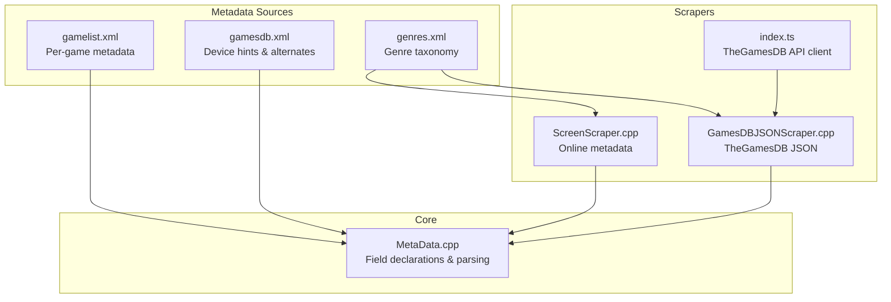
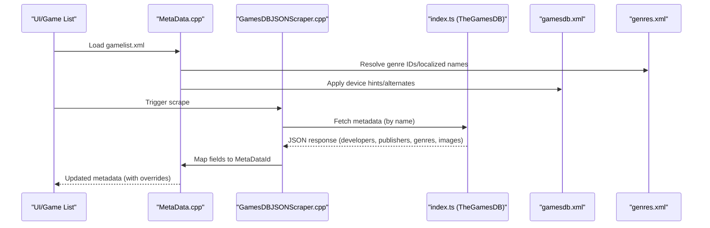
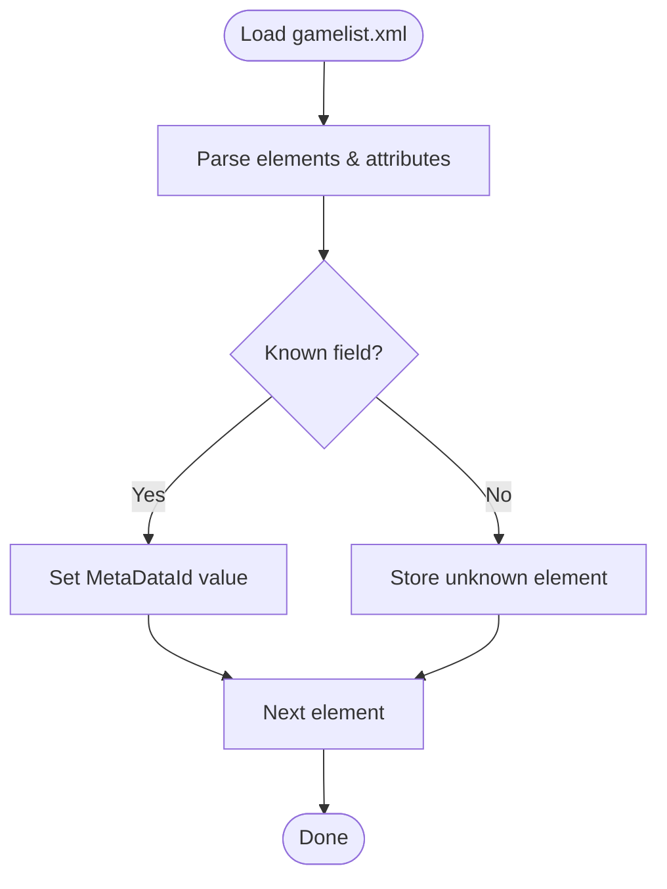
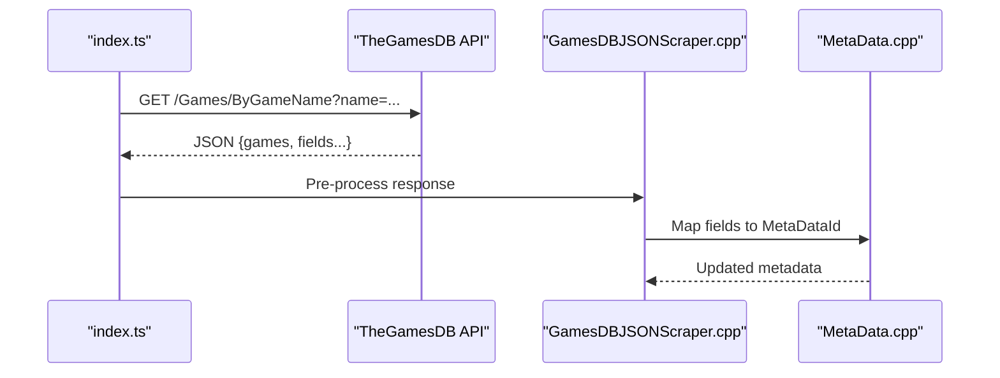
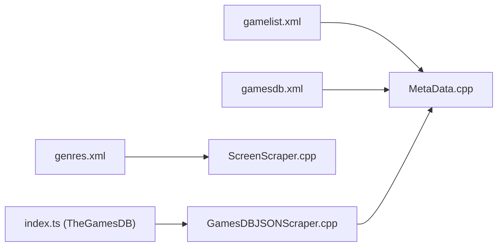

# Metadata Management

<cite>
**Referenced Files in This Document**
- [gamesdb.xml](file://emulationstation/resources/gamesdb.xml)
- [genres.xml](file://emulationstation/resources/genres.xml)
- [gamesdb.xsd](file://emulationstation/resources/gamesdb.xsd)
- [checkWheelGunGamesResources.py](file://emulationstation/resources/checkWheelGunGamesResources.py)
- [gamelist.xml (system/es_menu)](file://system/es_menu/gamelist.xml)
- [gamelist.xml (system/templates/emulationstation)](file://system/templates/emulationstation/gamelist.xml)
- [MetaData.cpp](file://emulationstation/.riescade/src/docs/es_src/MetaData.cpp)
- [ScreenScraper.cpp](file://emulationstation/.riescade/src/docs/es_src/scrapers/ScreenScraper.cpp)
- [GamesDBJSONScraper.cpp](file://emulationstation/.riescade/src/docs/es_src/scrapers/GamesDBJSONScraper.cpp)
- [index.ts](file://emulationstation/.riescade/src/src/main/index.ts)
</cite>

## Table of Contents
1. [Introduction](#introduction)
2. [Project Structure](#project-structure)
3. [Core Components](#core-components)
4. [Architecture Overview](#architecture-overview)
5. [Detailed Component Analysis](#detailed-component-analysis)
6. [Dependency Analysis](#dependency-analysis)
7. [Performance Considerations](#performance-considerations)
8. [Troubleshooting Guide](#troubleshooting-guide)
9. [Conclusion](#conclusion)
10. [Appendices](#appendices)

## Introduction
This document describes the metadata management system used by the project’s emulation front-end. It covers:
- The gamelist.xml structure and supported metadata fields (title, developer, publisher, year, genre, rating, description, and more).
- How metadata is extracted from ROMs, online databases (TheGamesDB, ScreenScraper, MobyGames via legacy paths), and manual edits.
- Integration with gamesdb.xml for device-specific hints (e.g., steering wheel, gun, spinner, trackball) and genres.xml for genre classification.
- Practical guidance for validation, conflict resolution, duplicates, manual overrides, batch editing, bulk updates, and backup/restore.

## Project Structure
The metadata system spans several XML resources and source files:
- gamelist.xml defines per-game metadata for the UI and scraping pipeline.
- gamesdb.xml provides device hints and optional alternate names per system/game.
- genres.xml defines hierarchical genre taxonomy used for classification.
- Scrapers and core metadata logic are implemented in C++ and TypeScript.

**Diagram sources**
- [gamelist.xml (system/es_menu):1-800](file://system/es_menu/gamelist.xml#L1-L800)
- [gamesdb.xml:1-800](file://emulationstation/resources/gamesdb.xml#L1-L800)
- [genres.xml:1-800](file://emulationstation/resources/genres.xml#L1-L800)
- [ScreenScraper.cpp:513-692](file://emulationstation/.riescade/src/docs/es_src/scrapers/ScreenScraper.cpp#L513-L692)
- [GamesDBJSONScraper.cpp:518-561](file://emulationstation/.riescade/src/docs/es_src/scrapers/GamesDBJSONScraper.cpp#L518-L561)
- [index.ts:854-881](file://emulationstation/.riescade/src/src/main/index.ts#L854-L881)
- [MetaData.cpp:28-130](file://emulationstation/.riescade/src/docs/es_src/MetaData.cpp#L28-L130)

**Section sources**
- [gamelist.xml (system/es_menu):1-800](file://system/es_menu/gamelist.xml#L1-L800)
- [gamesdb.xml:1-800](file://emulationstation/resources/gamesdb.xml#L1-L800)
- [genres.xml:1-800](file://emulationstation/resources/genres.xml#L1-L800)
- [MetaData.cpp:28-130](file://emulationstation/.riescade/src/docs/es_src/MetaData.cpp#L28-L130)

## Core Components
- gamelist.xml: Defines per-game metadata fields such as name/title, description, developer, publisher, genre, rating, release date, image, marquee, and more. It also supports scraper timestamps and unknown elements.
- gamesdb.xml: Provides device hints (wheel, gun, spinner, trackball) and alternate names for games/systems, validated by a Python checker.
- genres.xml: Hierarchical taxonomy of genres with localized names and parent-child relationships.
- Scrapers: Retrieve metadata from online sources and map to internal metadata fields.
- Core metadata engine: Declares supported fields, parses gamelist.xml, and manages overrides and unknown elements.

**Section sources**
- [gamelist.xml (system/es_menu):1-800](file://system/es_menu/gamelist.xml#L1-L800)
- [MetaData.cpp:28-130](file://emulationstation/.riescade/src/docs/es_src/MetaData.cpp#L28-L130)
- [ScreenScraper.cpp:513-692](file://emulationstation/.riescade/src/docs/es_src/scrapers/ScreenScraper.cpp#L513-L692)
- [GamesDBJSONScraper.cpp:518-561](file://emulationstation/.riescade/src/docs/es_src/scrapers/GamesDBJSONScraper.cpp#L518-L561)
- [gamesdb.xml:1-800](file://emulationstation/resources/gamesdb.xml#L1-L800)
- [genres.xml:1-800](file://emulationstation/resources/genres.xml#L1-L800)

## Architecture Overview
The metadata pipeline integrates local gamelist.xml with online sources and device hints:

**Diagram sources**
- [MetaData.cpp:152-251](file://emulationstation/.riescade/src/docs/es_src/MetaData.cpp#L152-L251)
- [GamesDBJSONScraper.cpp:518-561](file://emulationstation/.riescade/src/docs/es_src/scrapers/GamesDBJSONScraper.cpp#L518-L561)
- [index.ts:854-881](file://emulationstation/.riescade/src/src/main/index.ts#L854-L881)
- [gamesdb.xml:1-800](file://emulationstation/resources/gamesdb.xml#L1-L800)
- [genres.xml:1-800](file://emulationstation/resources/genres.xml#L1-L800)

## Detailed Component Analysis

### gamelist.xml Structure and Supported Fields
- Root element: gameList
- Per-game element: game with child fields
- Key fields observed in the repository’s gamelist.xml include:
  - path: ROM/menu path
  - name: display title
  - desc: description
  - image: box art thumbnail
  - marquee: logo/marquee image
  - rating: numeric rating
  - releasedate: release date
  - developer: developer
  - publisher: publisher
  - genre: genre
  - playcount, lastplayed, gametime: statistics
  - lang, region: localization hints
- Unknown elements are preserved and reported by the parser.

Validation and parsing behavior:
- The parser reads both child elements and attributes, skipping reserved keys (e.g., hash, path) and unknown elements with values.
- Scraper timestamps are recorded under a dedicated scrap element.

Practical example references:
- Example game block: [gamelist.xml (system/es_menu): lines 3–19:3-19](file://system/es_menu/gamelist.xml#L3-L19)
- Another example: [gamelist.xml (system/es_menu): lines 20–36:20-36](file://system/es_menu/gamelist.xml#L20-L36)

**Section sources**
- [gamelist.xml (system/es_menu):1-800](file://system/es_menu/gamelist.xml#L1-L800)
- [MetaData.cpp:152-251](file://emulationstation/.riescade/src/docs/es_src/MetaData.cpp#L152-L251)

### Field Declarations and Mapping
- The core declares metadata fields and their types, including name, description, genre, rating, players, kidGame, and more.
- Field keys map to internal identifiers used by the scraper and parser.

Example references:
- Field declarations: [MetaData.cpp: lines 30–102:30-102](file://emulationstation/.riescade/src/docs/es_src/MetaData.cpp#L30-L102)
- Type and key mapping: [MetaData.cpp: lines 132-L145:132-145](file://emulationstation/.riescade/src/docs/es_src/MetaData.cpp#L132-L145)

**Section sources**
- [MetaData.cpp:28-130](file://emulationstation/.riescade/src/docs/es_src/MetaData.cpp#L28-L130)

### Metadata Extraction from ROMs, Online Databases, and Manual Entry
- ROM-based extraction: The system primarily relies on gamelist.xml and online scrapers. ROM parsing is not shown in the referenced files.
- Online databases:
  - TheGamesDB: Accessed via a TypeScript client that queries the API and merges developer/publisher/genre maps from local JSON files.
  - ScreenScraper: Scrapes synopsis, genres, ratings, and media; resolves genre IDs and localized names.
  - MobyGames: Present as a known scraper in the metadata engine; no implementation referenced in the current files.
- Manual entry: Users edit gamelist.xml directly; unknown elements are preserved and can be accessed programmatically.

Example references:
- TheGamesDB API call: [index.ts: lines 854–881:854-881](file://emulationstation/.riescade/src/src/main/index.ts#L854-L881)
- GamesDB JSON scraper mapping: [GamesDBJSONScraper.cpp: lines 518–561:518-561](file://emulationstation/.riescade/src/docs/es_src/scrapers/GamesDBJSONScraper.cpp#L518-L561)
- ScreenScraper mapping: [ScreenScraper.cpp: lines 513–692:513-692](file://emulationstation/.riescade/src/docs/es_src/scrapers/ScreenScraper.cpp#L513-L692)

**Section sources**
- [index.ts:854-881](file://emulationstation/.riescade/src/src/main/index.ts#L854-L881)
- [GamesDBJSONScraper.cpp:518-561](file://emulationstation/.riescade/src/docs/es_src/scrapers/GamesDBJSONScraper.cpp#L518-L561)
- [ScreenScraper.cpp:513-692](file://emulationstation/.riescade/src/docs/es_src/scrapers/ScreenScraper.cpp#L513-L692)
- [MetaData.cpp:28-130](file://emulationstation/.riescade/src/docs/es_src/MetaData.cpp#L28-L130)

### Integration with gamesdb.xml and genres.xml
- gamesdb.xml:
  - Provides device hints (wheel, gun, spinner, trackball) and optional alternate names per system/game.
  - A validator script checks uniqueness and ordering of game IDs per system.
- genres.xml:
  - Defines hierarchical genres with localized names and parent-child relationships.
  - Scrapers resolve genre names to internal IDs and can prune redundant children.

Example references:
- Device hints: [gamesdb.xml: lines 1-L800:1-800](file://emulationstation/resources/gamesdb.xml#L1-L800)
- Validator: [checkWheelGunGamesResources.py: lines 6–32:6-32](file://emulationstation/resources/checkWheelGunGamesResources.py#L6-L32)
- Genre taxonomy: [genres.xml: lines 1-L800:1-800](file://emulationstation/resources/genres.xml#L1-L800)
- Genre resolution in ScreenScraper: [ScreenScraper.cpp: lines 519-L595:519-595](file://emulationstation/.riescade/src/docs/es_src/scrapers/ScreenScraper.cpp#L519-L595)

**Section sources**
- [gamesdb.xml:1-800](file://emulationstation/resources/gamesdb.xml#L1-L800)
- [checkWheelGunGamesResources.py:1-44](file://emulationstation/resources/checkWheelGunGamesResources.py#L1-L44)
- [genres.xml:1-800](file://emulationstation/resources/genres.xml#L1-L800)
- [ScreenScraper.cpp:519-595](file://emulationstation/.riescade/src/docs/es_src/scrapers/ScreenScraper.cpp#L519-L595)

### Validation Rules and Field Mapping
- Validation:
  - gamesdb.xml uniqueness and ordering enforced by the Python checker.
  - gamelist.xml parsing ignores reserved keys and unknown elements with values; unknowns are stored for later inspection.
- Field mapping:
  - gamelist.xml child elements map to MetaDataId via declared keys.
  - Scraper outputs map to MetaDataId (e.g., description, genre IDs, rating).
  - Genre normalization uses genres.xml to convert names to IDs and prune children when parents exist.

Example references:
- gamesdb.xml validation: [checkWheelGunGamesResources.py: lines 20–32:20-32](file://emulationstation/resources/checkWheelGunGamesResources.py#L20-L32)
- gamelist parsing: [MetaData.cpp: lines 167-L232:167-232](file://emulationstation/.riescade/src/docs/es_src/MetaData.cpp#L167-L232)
- Genre mapping: [ScreenScraper.cpp: lines 529-L595:529-595](file://emulationstation/.riescade/src/docs/es_src/scrapers/ScreenScraper.cpp#L529-L595)

**Section sources**
- [checkWheelGunGamesResources.py:1-44](file://emulationstation/resources/checkWheelGunGamesResources.py#L1-L44)
- [MetaData.cpp:152-251](file://emulationstation/.riescade/src/docs/es_src/MetaData.cpp#L152-L251)
- [ScreenScraper.cpp:519-595](file://emulationstation/.riescade/src/docs/es_src/scrapers/ScreenScraper.cpp#L519-L595)

### Metadata Conflict Resolution, Duplicates, and Manual Overrides
- Conflicts:
  - Unknown elements are preserved; the parser stores them separately for inspection.
  - Scraper timestamps are recorded; subsequent scrapes can overwrite or augment metadata depending on implementation.
- Duplicates:
  - gamesdb.xml enforces unique system IDs and ordered game lists per system.
- Manual overrides:
  - Direct edits to gamelist.xml take precedence over scraper-provided values for mapped fields.

Example references:
- Unknown elements handling: [MetaData.cpp: lines 190-L200:190-200](file://emulationstation/.riescade/src/docs/es_src/MetaData.cpp#L190-L200)
- gamesdb.xml duplicate detection: [checkWheelGunGamesResources.py: lines 13-L28:13-28](file://emulationstation/resources/checkWheelGunGamesResources.py#L13-L28)

**Section sources**
- [MetaData.cpp:152-251](file://emulationstation/.riescade/src/docs/es_src/MetaData.cpp#L152-L251)
- [checkWheelGunGamesResources.py:1-44](file://emulationstation/resources/checkWheelGunGamesResources.py#L1-L44)

### Practical Examples

#### gamelist.xml Syntax Examples
- Minimal template: [gamelist.xml (system/templates/emulationstation): lines 1-L4:1-4](file://system/templates/emulationstation/gamelist.xml#L1-L4)
- Full game example: [gamelist.xml (system/es_menu): lines 3-L19:3-19](file://system/es_menu/gamelist.xml#L3-L19)

#### Metadata Validation Flow

**Diagram sources**
- [MetaData.cpp:152-251](file://emulationstation/.riescade/src/docs/es_src/MetaData.cpp#L152-L251)

#### TheGamesDB Integration Flow

**Diagram sources**
- [index.ts:854-881](file://emulationstation/.riescade/src/src/main/index.ts#L854-L881)
- [GamesDBJSONScraper.cpp:553-561](file://emulationstation/.riescade/src/docs/es_src/scrapers/GamesDBJSONScraper.cpp#L553-L561)
- [MetaData.cpp:28-130](file://emulationstation/.riescade/src/docs/es_src/MetaData.cpp#L28-L130)

### Conceptual Overview
- Local-first workflow: Users edit gamelist.xml; scrapers enrich missing fields.
- Device-aware hints: gamesdb.xml informs controller/video preferences per game/system.
- Genre taxonomy: genres.xml ensures consistent classification across languages.

[No sources needed since this section doesn't analyze specific files]

## Dependency Analysis
- gamelist.xml depends on MetaData.cpp for field mapping and parsing.
- gamesdb.xml is consumed by the metadata engine and validated by a Python script.
- genres.xml is used by scrapers to normalize genres.
- TheGamesDB API is consumed by index.ts and processed by GamesDBJSONScraper.cpp.

**Diagram sources**
- [MetaData.cpp:28-130](file://emulationstation/.riescade/src/docs/es_src/MetaData.cpp#L28-L130)
- [gamesdb.xml:1-800](file://emulationstation/resources/gamesdb.xml#L1-L800)
- [genres.xml:1-800](file://emulationstation/resources/genres.xml#L1-L800)
- [ScreenScraper.cpp:513-692](file://emulationstation/.riescade/src/docs/es_src/scrapers/ScreenScraper.cpp#L513-L692)
- [GamesDBJSONScraper.cpp:518-561](file://emulationstation/.riescade/src/docs/es_src/scrapers/GamesDBJSONScraper.cpp#L518-L561)
- [index.ts:854-881](file://emulationstation/.riescade/src/src/main/index.ts#L854-L881)

**Section sources**
- [MetaData.cpp:28-130](file://emulationstation/.riescade/src/docs/es_src/MetaData.cpp#L28-L130)
- [gamesdb.xml:1-800](file://emulationstation/resources/gamesdb.xml#L1-L800)
- [genres.xml:1-800](file://emulationstation/resources/genres.xml#L1-L800)
- [ScreenScraper.cpp:513-692](file://emulationstation/.riescade/src/docs/es_src/scrapers/ScreenScraper.cpp#L513-L692)
- [GamesDBJSONScraper.cpp:518-561](file://emulationstation/.riescade/src/docs/es_src/scrapers/GamesDBJSONScraper.cpp#L518-L561)
- [index.ts:854-881](file://emulationstation/.riescade/src/src/main/index.ts#L854-L881)

## Performance Considerations
- Preloading media: The parser conditionally preloads media only when enabled and not restricted by parsing modes.
- Genre resolution: Resolving genre IDs and pruning children reduces downstream processing overhead.
- Scraper caching: Scraper timestamps enable incremental updates; consider reusing cached results to avoid repeated network calls.

[No sources needed since this section provides general guidance]

## Troubleshooting Guide
- Duplicate or misordered entries in gamesdb.xml:
  - Use the provided validator to detect duplicates and ordering issues.
  - Correct the file and rerun validation.
- Unknown elements in gamelist.xml:
  - Inspect stored unknown elements via the parser’s unknown list.
  - Remove or rename conflicting elements.
- Scraper failures:
  - Verify API keys and network connectivity.
  - Check scraper settings (e.g., region, ratings, media preferences).
- Genre mismatches:
  - Ensure genre names match genres.xml; the scraper normalizes names to IDs.

**Section sources**
- [checkWheelGunGamesResources.py:1-44](file://emulationstation/resources/checkWheelGunGamesResources.py#L1-L44)
- [MetaData.cpp:152-251](file://emulationstation/.riescade/src/docs/es_src/MetaData.cpp#L152-L251)
- [ScreenScraper.cpp:519-595](file://emulationstation/.riescade/src/docs/es_src/scrapers/ScreenScraper.cpp#L519-L595)

## Conclusion
The metadata management system centers on gamelist.xml for local metadata, gamesdb.xml for device hints, and genres.xml for consistent genre classification. Scrapers (notably TheGamesDB and ScreenScraper) enrich metadata, while the core engine validates and maps fields. The provided tools and patterns support robust validation, conflict resolution, manual overrides, and scalable maintenance.

[No sources needed since this section summarizes without analyzing specific files]

## Appendices

### Appendix A: Example References
- Template gamelist: [gamelist.xml (system/templates/emulationstation): lines 1-L4:1-4](file://system/templates/emulationstation/gamelist.xml#L1-L4)
- Example game block: [gamelist.xml (system/es_menu): lines 3-L19:3-19](file://system/es_menu/gamelist.xml#L3-L19)
- Field declarations: [MetaData.cpp: lines 30–102:30-102](file://emulationstation/.riescade/src/docs/es_src/MetaData.cpp#L30-L102)
- TheGamesDB API call: [index.ts: lines 854–881:854-881](file://emulationstation/.riescade/src/src/main/index.ts#L854-L881)
- GamesDB JSON scraper mapping: [GamesDBJSONScraper.cpp: lines 518–561:518-561](file://emulationstation/.riescade/src/docs/es_src/scrapers/GamesDBJSONScraper.cpp#L518-L561)
- ScreenScraper mapping: [ScreenScraper.cpp: lines 513–692:513-692](file://emulationstation/.riescade/src/docs/es_src/scrapers/ScreenScraper.cpp#L513-L692)
- gamesdb.xml validation: [checkWheelGunGamesResources.py: lines 20–32:20-32](file://emulationstation/resources/checkWheelGunGamesResources.py#L20-L32)