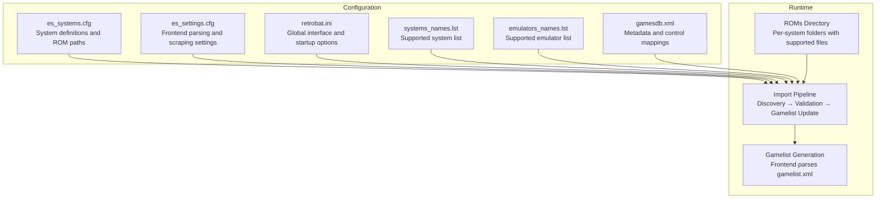
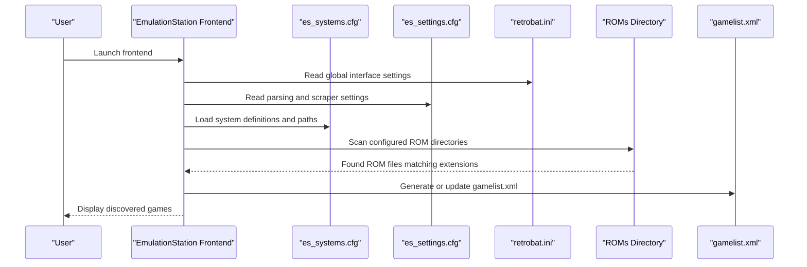
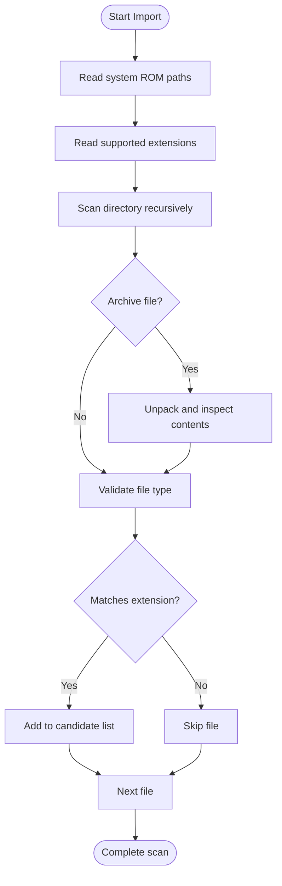
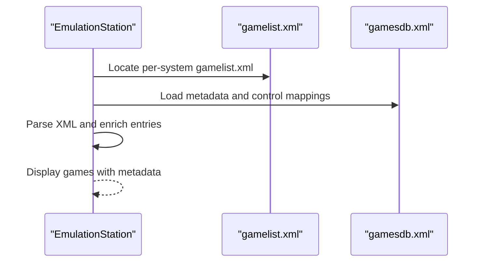
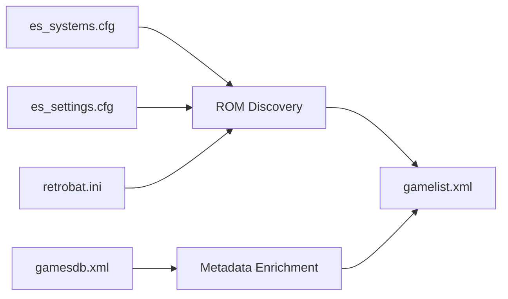

# ROM Discovery and Import

<cite>
**Referenced Files in This Document**
- [retrobat.ini](file://retrobat.ini)
- [es_settings.cfg](file://emulationstation/.emulationstation/es_settings.cfg)
- [es_systems.cfg](file://emulationstation/.emulationstation/es_systems.cfg)
- [systems_names.lst](file://system/configgen/systems_names.lst)
- [emulators_names.lst](file://system/configgen/emulators_names.lst)
- [gamesdb.xml](file://emulationstation/resources/gamesdb.xml)
- [gamelist.xml](file://system/es_menu/gamelist.xml)
</cite>

## Table of Contents
1. [Introduction](#introduction)
2. [Project Structure](#project-structure)
3. [Core Components](#core-components)
4. [Architecture Overview](#architecture-overview)
5. [Detailed Component Analysis](#detailed-component-analysis)
6. [Dependency Analysis](#dependency-analysis)
7. [Performance Considerations](#performance-considerations)
8. [Troubleshooting Guide](#troubleshooting-guide)
9. [Conclusion](#conclusion)

## Introduction
This document explains the ROM discovery and import mechanism used by the system. It covers how the frontend discovers ROMs across 240+ gaming systems, how supported formats are identified, how gamelists are generated, and how metadata is associated with ROMs. It also documents configuration options for ROM paths, system-specific directories, and import filters, along with practical guidance for organizing ROMs, bulk importing, and resolving common import issues.

## Project Structure
The ROM discovery and import pipeline centers around:
- System configuration that defines ROM directories, supported file extensions, and emulators per system
- Frontend settings that control parsing and display behavior
- Global RetroBat configuration for interface and startup behavior
- Metadata database for device/game controls and scraping preferences
- System gamelist template used by the frontend

**Diagram sources**
- [es_systems.cfg:1-800](file://emulationstation/.emulationstation/es_systems.cfg#L1-L800)
- [es_settings.cfg:1-210](file://emulationstation/.emulationstation/es_settings.cfg#L1-L210)
- [retrobat.ini:1-94](file://retrobat.ini#L1-L94)
- [systems_names.lst:1-241](file://system/configgen/systems_names.lst#L1-L241)
- [emulators_names.lst:1-130](file://system/configgen/emulators_names.lst#L1-L130)
- [gamesdb.xml:1-800](file://emulationstation/resources/gamesdb.xml#L1-L800)

**Section sources**
- [es_systems.cfg:1-800](file://emulationstation/.emulationstation/es_systems.cfg#L1-L800)
- [es_settings.cfg:1-210](file://emulationstation/.emulationstation/es_settings.cfg#L1-L210)
- [retrobat.ini:1-94](file://retrobat.ini#L1-L94)
- [systems_names.lst:1-241](file://system/configgen/systems_names.lst#L1-L241)
- [emulators_names.lst:1-130](file://system/configgen/emulators_names.lst#L1-L130)
- [gamesdb.xml:1-800](file://emulationstation/resources/gamesdb.xml#L1-L800)

## Core Components
- System definitions and ROM discovery
  - Each system entry specifies a ROM path and supported file extensions. The frontend scans these directories recursively for files matching the configured extensions.
  - Example: Arcade systems define multiple extensions including archives (.zip, .7z) and disc images (.iso, .cue, .chd).
- Frontend parsing and display
  - The frontend reads gamelist.xml files located under ROM directories and displays games accordingly. Parsing behavior is controlled by settings such as ParseGamelistOnly and Scraper settings.
- Global configuration
  - RetroBat settings control interface behavior, startup delays, fullscreen modes, and whether to wait for videos before launching the frontend.
- Supported systems and emulators
  - A curated list of supported systems and emulators ensures compatibility and proper core selection during import and launch.

**Section sources**
- [es_systems.cfg:1-800](file://emulationstation/.emulationstation/es_systems.cfg#L1-L800)
- [es_settings.cfg:120-170](file://emulationstation/.emulationstation/es_settings.cfg#L120-L170)
- [retrobat.ini:50-94](file://retrobat.ini#L50-L94)
- [systems_names.lst:1-241](file://system/configgen/systems_names.lst#L1-L241)
- [emulators_names.lst:1-130](file://system/configgen/emulators_names.lst#L1-L130)

## Architecture Overview
The ROM import pipeline integrates system configuration, frontend parsing, and metadata association.

**Diagram sources**
- [es_systems.cfg:1-800](file://emulationstation/.emulationstation/es_systems.cfg#L1-L800)
- [es_settings.cfg:120-170](file://emulationstation/.emulationstation/es_settings.cfg#L120-L170)
- [retrobat.ini:50-94](file://retrobat.ini#L50-L94)
- [gamelist.xml](file://system/es_menu/gamelist.xml)

## Detailed Component Analysis

### ROM Discovery and Directory Organization
- Per-system ROM directories
  - Each system defines a path relative to the ROMs folder. Examples include dedicated folders for arcade variants, consoles, and handhelds.
- Supported file extensions
  - Extensions are defined per system. Common patterns include:
    - Archive-based: .zip, .7z
    - Disc images: .iso, .cue, .chd, .cso, .m3u
    - Binary/ROM: .bin, .smd, .smd, .gen, .md, .gg, .sms, .wad
    - Emulator-specific: .neo, .wad, .daphne, .hypseus, .xbe, .game
- Archive handling
  - Archives are supported for many systems. The frontend scans archive contents to locate ROM files without requiring manual extraction.
- Naming conventions and organization
  - Keep filenames clean and consistent. Avoid special characters that could cause issues on certain platforms.
  - Prefer lowercase filenames and replace spaces with underscores or hyphens for reliability.
  - Place ROMs in the system-specific directory defined by the system configuration.

**Diagram sources**
- [es_systems.cfg:1-800](file://emulationstation/.emulationstation/es_systems.cfg#L1-L800)

**Section sources**
- [es_systems.cfg:1-800](file://emulationstation/.emulationstation/es_systems.cfg#L1-L800)

### Gamelist Generation and Metadata Extraction
- Gamelist location and parsing
  - The frontend parses gamelist.xml files located under ROM directories. The parsing behavior is governed by settings such as ParseGamelistOnly and Scraper settings.
- Metadata association
  - Metadata such as control mappings and scraping preferences are defined in the metadata database. These influence how game entries are enriched and displayed.
- Template gamelist
  - A system gamelist template is available and can be used as a baseline for generating per-ROM gamelist entries.

**Diagram sources**
- [es_settings.cfg:120-170](file://emulationstation/.emulationstation/es_settings.cfg#L120-L170)
- [gamesdb.xml:1-800](file://emulationstation/resources/gamesdb.xml#L1-L800)
- [gamelist.xml](file://system/es_menu/gamelist.xml)

**Section sources**
- [es_settings.cfg:120-170](file://emulationstation/.emulationstation/es_settings.cfg#L120-L170)
- [gamesdb.xml:1-800](file://emulationstation/resources/gamesdb.xml#L1-L800)
- [gamelist.xml](file://system/es_menu/gamelist.xml)

### Configuration Options for ROM Paths, Systems, and Filters
- ROM paths and extensions
  - Defined per system in the system configuration. Paths are relative to the ROMs directory and include supported extensions for each system.
- Frontend parsing and scraping
  - Settings control whether to parse gamelists only, enable/disable scraping, and configure scraper sources and filters.
- Global RetroBat options
  - Interface mode, fullscreen/windowed mode, startup delays, and video behavior are configurable via the global configuration.

**Section sources**
- [es_systems.cfg:1-800](file://emulationstation/.emulationstation/es_systems.cfg#L1-L800)
- [es_settings.cfg:120-170](file://emulationstation/.emulationstation/es_settings.cfg#L120-L170)
- [retrobat.ini:50-94](file://retrobat.ini#L50-L94)

### Practical Examples of Supported Formats and Archives
- Arcade systems commonly support:
  - Archives: .zip, .7z
  - Disc images: .iso, .cue, .chd, .cso, .m3u
  - Emulators: .fba, .bin, .dat
- Console systems commonly support:
  - Binary/ROM: .bin, .smd, .gen, .md, .gg, .sms
  - Archives: .zip, .7z
  - Disc images: .iso, .cue
- Handheld and computer systems:
  - .gba, .nds, .3ds, .pocket, .dsk, .tap, .m3u, .swf, .jar

Note: The exact extensions vary by system. Consult the system configuration for each system’s supported extensions.

**Section sources**
- [es_systems.cfg:1-800](file://emulationstation/.emulationstation/es_systems.cfg#L1-L800)

### Bulk ROM Import and Directory Organization Best Practices
- Bulk import
  - Place ROMs into the appropriate per-system directories as defined by the system configuration. The frontend will discover and parse them automatically.
- Directory organization
  - Maintain a flat or simple nested structure under each system directory to improve scanning performance.
  - Use consistent naming and avoid deeply nested subfolders that could complicate discovery.
- Archive handling
  - Prefer placing ROMs in archives only when necessary. Some systems require archives; others work best with extracted files.

[No sources needed since this section provides general guidance]

### Troubleshooting Import Failures
- Unsupported formats
  - Verify the file extension is included in the system’s supported extensions list.
- Corrupted or invalid ROMs
  - Remove or repair files that fail validation during import.
- Naming conflicts
  - Rename conflicting files to ensure unique basenames within a system directory.
- Parsing issues
  - Ensure gamelist.xml is valid and readable. Adjust frontend parsing settings if necessary.
- Scraper and metadata
  - Confirm scraper settings and metadata database entries are correctly configured.

**Section sources**
- [es_settings.cfg:120-170](file://emulationstation/.emulationstation/es_settings.cfg#L120-L170)
- [gamesdb.xml:1-800](file://emulationstation/resources/gamesdb.xml#L1-L800)

## Dependency Analysis
The ROM discovery and import pipeline depends on:
- System configuration for ROM paths and extensions
- Frontend settings for parsing and scraping
- Global configuration for interface behavior
- Metadata database for control mappings and scraping preferences
- System gamelist template for per-ROM entries

**Diagram sources**
- [es_systems.cfg:1-800](file://emulationstation/.emulationstation/es_systems.cfg#L1-L800)
- [es_settings.cfg:120-170](file://emulationstation/.emulationstation/es_settings.cfg#L120-L170)
- [retrobat.ini:50-94](file://retrobat.ini#L50-L94)
- [gamesdb.xml:1-800](file://emulationstation/resources/gamesdb.xml#L1-L800)
- [gamelist.xml](file://system/es_menu/gamelist.xml)

**Section sources**
- [es_systems.cfg:1-800](file://emulationstation/.emulationstation/es_systems.cfg#L1-L800)
- [es_settings.cfg:120-170](file://emulationstation/.emulationstation/es_settings.cfg#L120-L170)
- [retrobat.ini:50-94](file://retrobat.ini#L50-L94)
- [gamesdb.xml:1-800](file://emulationstation/resources/gamesdb.xml#L1-L800)
- [gamelist.xml](file://system/es_menu/gamelist.xml)

## Performance Considerations
- Keep ROM directories organized and avoid excessive nesting to speed up scanning.
- Limit the number of supported extensions per system to reduce false positives.
- Use archives judiciously; while convenient, they add overhead during discovery.

[No sources needed since this section provides general guidance]

## Troubleshooting Guide
- ROMs not appearing
  - Check that the ROM path exists and contains files matching the system’s extensions.
  - Verify parsing settings and ensure gamelist.xml is present and valid.
- Scraper not working
  - Confirm scraper settings and credentials in the frontend configuration.
- Interface startup delays
  - Adjust RetroBat startup delay and video behavior settings as needed.

**Section sources**
- [es_systems.cfg:1-800](file://emulationstation/.emulationstation/es_systems.cfg#L1-L800)
- [es_settings.cfg:120-170](file://emulationstation/.emulationstation/es_settings.cfg#L120-L170)
- [retrobat.ini:50-94](file://retrobat.ini#L50-L94)

## Conclusion
The ROM discovery and import pipeline leverages system-defined paths and extensions, frontend parsing settings, and metadata enrichment to deliver a robust and scalable solution for managing 240+ gaming systems. By organizing ROMs according to system directories, ensuring supported formats, and configuring parsing and scraping settings appropriately, users can achieve reliable and efficient bulk import and ongoing maintenance of their libraries.