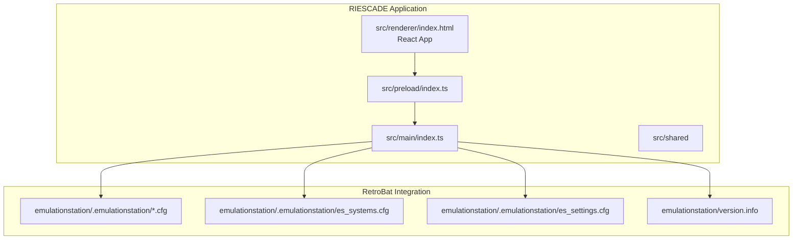
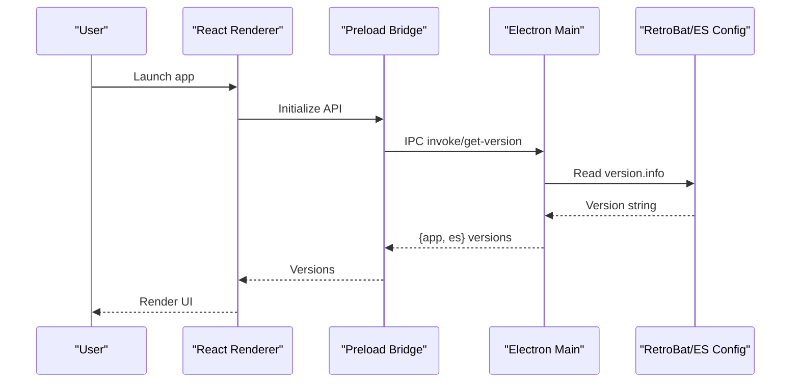
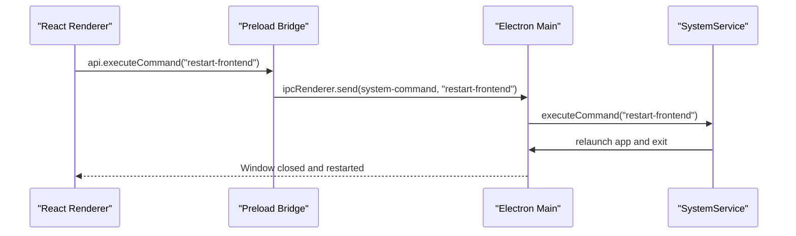
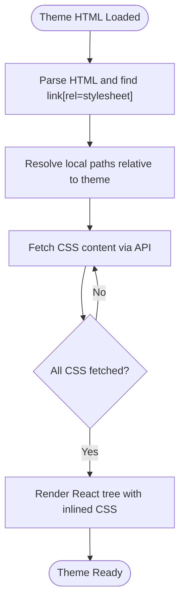
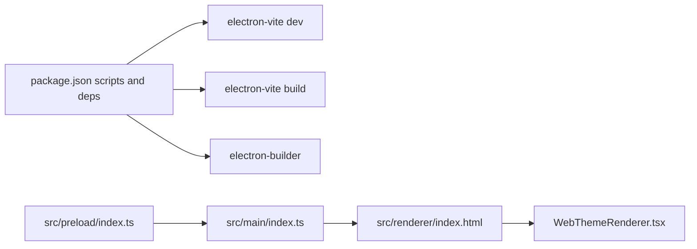

# Getting Started

<cite>
**Referenced Files in This Document**
- [README.md](file://README.md)
- [package.json](file://emulationstation/.riescade/src/package.json)
- [index.html](file://emulationstation/.riescade/src/src/renderer/index.html)
- [index.ts (Electron main)](file://emulationstation/.riescade/src/src/main/index.ts)
- [index.ts (Preload)](file://emulationstation/.riescade/src/src/preload/index.ts)
- [SystemService.ts](file://emulationstation/.riescade/src/src/main/services/SystemService.ts)
- [WebThemeRenderer.tsx](file://emulationstation/.riescade/src/src/renderer/src/components/theme/WebThemeRenderer.tsx)
- [es_input.cfg](file://emulationstation/.emulationstation/es_input.cfg)
- [es_settings.cfg](file://emulationstation/.emulationstation/es_settings.cfg)
- [es_systems.cfg](file://emulationstation/.emulationstation/es_systems.cfg)
- [version.info](file://emulationstation/version.info)
</cite>

## Table of Contents
1. [Introduction](#introduction)
2. [Project Structure](#project-structure)
3. [Core Components](#core-components)
4. [Architecture Overview](#architecture-overview)
5. [Detailed Component Analysis](#detailed-component-analysis)
6. [Dependency Analysis](#dependency-analysis)
7. [Performance Considerations](#performance-considerations)
8. [Troubleshooting Guide](#troubleshooting-guide)
9. [Conclusion](#conclusion)
10. [Appendices](#appendices)

## Introduction
RIESCADE is a modern, high-performance frontend for EmulationStation and RetroBat environments. It integrates tightly with existing RetroBat/EmulationStation setups, offering a contemporary UI while preserving compatibility with existing configurations, gamelists, and themes. This guide walks you through installing dependencies, setting up the development environment, building for production, and integrating RIESCADE into your RetroBat installation.

## Project Structure
RIESCADE is organized into clear, distinct areas for the Electron main process, React renderer, shared types, and the preload bridge for secure IPC. The repository also includes extensive RetroBat-related assets and templates.

- src/main: Electron main process (window lifecycle, IPC handlers, system commands, and integrations)
- src/renderer: React frontend (UI, stores, components, and theme rendering)
- src/shared: Shared types and utilities
- src/preload: Secure IPC bridge exposing a minimal API surface to the renderer

**Diagram sources**
- [index.html:1-15](file://emulationstation/.riescade/src/src/renderer/index.html#L1-L15)
- [index.ts (Electron main):32-62](file://emulationstation/.riescade/src/src/main/index.ts#L32-L62)
- [index.ts (Preload):1-77](file://emulationstation/.riescade/src/src/preload/index.ts#L1-L77)
- [es_input.cfg](file://emulationstation/.emulationstation/es_input.cfg)
- [es_systems.cfg](file://emulationstation/.emulationstation/es_systems.cfg)
- [es_settings.cfg](file://emulationstation/.emulationstation/es_settings.cfg)
- [version.info](file://emulationstation/version.info)

**Section sources**
- [README.md:34-43](file://README.md#L34-L43)

## Core Components
- Electron main process: Creates the browser window, sets up IPC channels, loads renderer via dev server or built HTML, and handles system commands.
- Preload bridge: Exposes a controlled subset of IPC APIs to the renderer, including library operations, scraping, media downloads, and system commands.
- React renderer: Loads the React app and renders themes, with a specialized renderer for RetroBat-compatible themes.
- Shared types: Located under src/shared for common interfaces and utilities.

Key behaviors:
- Window creation and dev/prod loading paths are handled in the main process.
- The preload bridge defines the contract for renderer-to-main communication.
- The renderer loads a CSP-compliant HTML page and mounts the React app.

**Section sources**
- [index.html:1-15](file://emulationstation/.riescade/src/src/renderer/index.html#L1-L15)
- [index.ts (Electron main):32-62](file://emulationstation/.riescade/src/src/main/index.ts#L32-L62)
- [index.ts (Preload):1-77](file://emulationstation/.riescade/src/src/preload/index.ts#L1-L77)

## Architecture Overview
RIESCADE runs as an Electron app that integrates with RetroBat/EmulationStation. The main process manages the application lifecycle and system interactions, the preload bridge mediates safe IPC, and the renderer hosts the React UI and theme rendering.

**Diagram sources**
- [index.ts (Electron main):373-392](file://emulationstation/.riescade/src/src/main/index.ts#L373-L392)
- [index.ts (Preload):47-55](file://emulationstation/.riescade/src/src/preload/index.ts#L47-L55)
- [version.info](file://emulationstation/version.info)

**Section sources**
- [index.ts (Electron main):373-392](file://emulationstation/.riescade/src/src/main/index.ts#L373-L392)
- [index.ts (Preload):47-55](file://emulationstation/.riescade/src/src/preload/index.ts#L47-L55)

## Detailed Component Analysis

### Installation and Environment Setup
- System requirements
  - Windows with PowerShell and Node.js/npm support
  - Existing RetroBat/EmulationStation installation for configuration compatibility
- Dependency installation
  - Use CMD to install dependencies due to PowerShell execution policy restrictions
  - Command: npm install
- Development environment
  - Start the dev server: npm run dev
  - The renderer loads from the Vite dev server in development mode
- Production build and deployment
  - Build the app: npm run build
  - Package for distribution: npm run dist
  - Deploy to target RetroBat installation: npm run deploy

Notes:
- The project uses electron-vite for dev/build and electron-builder for packaging.
- The build configuration targets a directory output suitable for RetroBat integration.

**Section sources**
- [README.md:12-33](file://README.md#L12-L33)
- [package.json:7-12](file://emulationstation/.riescade/src/package.json#L7-L12)

### First-Time Setup and Configuration Placement
- Place RIESCADE in the emulationstation folder of your RetroBat installation
- The app automatically resolves paths relative to its location to locate ROMs and configurations
- Ensure RetroBat configuration files are present and readable:
  - emulationstation/.emulationstation/es_input.cfg
  - emulationstation/.emulationstation/es_settings.cfg
  - emulationstation/.emulationstation/es_systems.cfg
  - emulationstation/version.info

Integration highlights:
- The main process reads version.info to report versions
- Input configuration is managed via IPC to the main process
- Themes and assets are resolved relative to the app’s location

**Section sources**
- [README.md:41-43](file://README.md#L41-L43)
- [index.ts (Electron main):373-392](file://emulationstation/.riescade/src/src/main/index.ts#L373-L392)
- [es_input.cfg](file://emulationstation/.emulationstation/es_input.cfg)
- [es_settings.cfg](file://emulationstation/.emulationstation/es_settings.cfg)
- [es_systems.cfg](file://emulationstation/.emulationstation/es_systems.cfg)
- [version.info](file://emulationstation/version.info)

### IPC and System Commands
The preload bridge exposes a concise API to the renderer, including:
- Library operations: preloadLibrary, getSystems, getGames, updateGame, deleteGame, launchGame, scanSaveStates
- Collections: getCustomCollections, getCollectionGames, getCollectionsForGame, toggleGameInCollection
- Media and scraping: startScrape, cancelScrape, searchGameMedia, downloadGameMedia, downloadTempMedia
- Controllers: getConfiguredControllers, saveInputConfig, getBluetoothDevices
- System: executeCommand, getVersion, getMusicFiles, getMusicPath, on (event listener)

The main process registers IPC handlers and delegates actions to services (e.g., SystemService). Example commands include reboot, shutdown, restart-frontend, reload-frontend, exit-frontend, and update-gamelists.

**Diagram sources**
- [index.ts (Preload):47-47](file://emulationstation/.riescade/src/src/preload/index.ts#L47-L47)
- [index.ts (Electron main):234-245](file://emulationstation/.riescade/src/src/main/index.ts#L234-L245)
- [SystemService.ts:12-37](file://emulationstation/.riescade/src/src/main/services/SystemService.ts#L12-L37)

**Section sources**
- [index.ts (Preload):1-77](file://emulationstation/.riescade/src/src/preload/index.ts#L1-L77)
- [index.ts (Electron main):234-245](file://emulationstation/.riescade/src/src/main/index.ts#L234-L245)
- [SystemService.ts:12-55](file://emulationstation/.riescade/src/src/main/services/SystemService.ts#L12-L55)

### Theme Rendering and Relative Path Resolution
The renderer includes a theme renderer that converts RetroBat-style HTML/CSS into React components. It resolves local paths and inlines styles during the launching view to avoid flash-of-unstyled-content.

Key behaviors:
- CSS files linked in theme HTML are prefetched and inlined synchronously during launch
- Local file paths are resolved relative to the theme path
- The renderer waits for all CSS to load before rendering

**Diagram sources**
- [WebThemeRenderer.tsx:80-106](file://emulationstation/.riescade/src/src/renderer/src/components/theme/WebThemeRenderer.tsx#L80-L106)
- [WebThemeRenderer.tsx:425-440](file://emulationstation/.riescade/src/src/renderer/src/components/theme/WebThemeRenderer.tsx#L425-L440)

**Section sources**
- [WebThemeRenderer.tsx:35-106](file://emulationstation/.riescade/src/src/renderer/src/components/theme/WebThemeRenderer.tsx#L35-L106)
- [WebThemeRenderer.tsx:425-440](file://emulationstation/.riescade/src/src/renderer/src/components/theme/WebThemeRenderer.tsx#L425-L440)

## Dependency Analysis
RIESCADE uses Electron with a React renderer and TypeScript. The build pipeline leverages electron-vite and electron-builder. The preload bridge minimizes the exposed API surface to reduce security risk.

**Diagram sources**
- [package.json:7-38](file://emulationstation/.riescade/src/package.json#L7-L38)
- [index.ts (Preload):1-77](file://emulationstation/.riescade/src/src/preload/index.ts#L1-L77)
- [index.ts (Electron main):32-62](file://emulationstation/.riescade/src/src/main/index.ts#L32-L62)
- [index.html:1-15](file://emulationstation/.riescade/src/src/renderer/index.html#L1-L15)
- [WebThemeRenderer.tsx:1-458](file://emulationstation/.riescade/src/src/renderer/src/components/theme/WebThemeRenderer.tsx#L1-L458)

**Section sources**
- [package.json:1-57](file://emulationstation/.riescade/src/package.json#L1-L57)
- [index.ts (Preload):1-77](file://emulationstation/.riescade/src/src/preload/index.ts#L1-L77)
- [index.ts (Electron main):32-62](file://emulationstation/.riescade/src/src/main/index.ts#L32-L62)
- [index.html:1-15](file://emulationstation/.riescade/src/src/renderer/index.html#L1-L15)

## Performance Considerations
- Theme rendering prefetches and inlines CSS during launch to minimize layout shifts and improve perceived performance.
- The main process clears caches and reloads windows when updating gamelists to keep the UI current.
- Using a single CSP-compliant HTML page reduces network overhead and improves startup reliability.

[No sources needed since this section provides general guidance]

## Troubleshooting Guide
Common issues and resolutions:
- PowerShell execution policy blocks installs
  - Use CMD to run npm install as documented
- Dev server not starting
  - Ensure Node.js and npm are installed and accessible
  - Run npm run dev from the project root
- Production build fails
  - Verify electron-vite and electron-builder are installed
  - Run npm run build and npm run dist
- Theme assets not loading
  - Confirm theme paths are correct and relative to the app location
  - Check that CSS files referenced by the theme are present
- Input configuration not applied
  - Use the preload API to save input configs; ensure IPC handlers are registered in the main process
- Version reporting missing
  - Ensure version.info exists in the emulationstation directory

**Section sources**
- [README.md:12-33](file://README.md#L12-L33)
- [index.ts (Electron main):373-392](file://emulationstation/.riescade/src/src/main/index.ts#L373-L392)
- [WebThemeRenderer.tsx:80-106](file://emulationstation/.riescade/src/src/renderer/src/components/theme/WebThemeRenderer.tsx#L80-L106)
- [version.info](file://emulationstation/version.info)

## Conclusion
RIESCADE provides a modern, efficient interface for RetroBat/EmulationStation with seamless integration through shared configuration files and relative path resolution. By following the installation and setup steps, you can quickly develop, build, and deploy RIESCADE alongside your existing RetroBat environment.

[No sources needed since this section summarizes without analyzing specific files]

## Appendices

### Appendix A: Quick Commands
- Install dependencies: cmd /c npm install
- Run in development: cmd /c npm run dev
- Build for production: cmd /c npm run build
- Package for distribution: cmd /c npm run dist
- Deploy to RetroBat: cmd /c npm run deploy

**Section sources**
- [README.md:14-32](file://README.md#L14-L32)
- [package.json:7-12](file://emulationstation/.riescade/src/package.json#L7-L12)