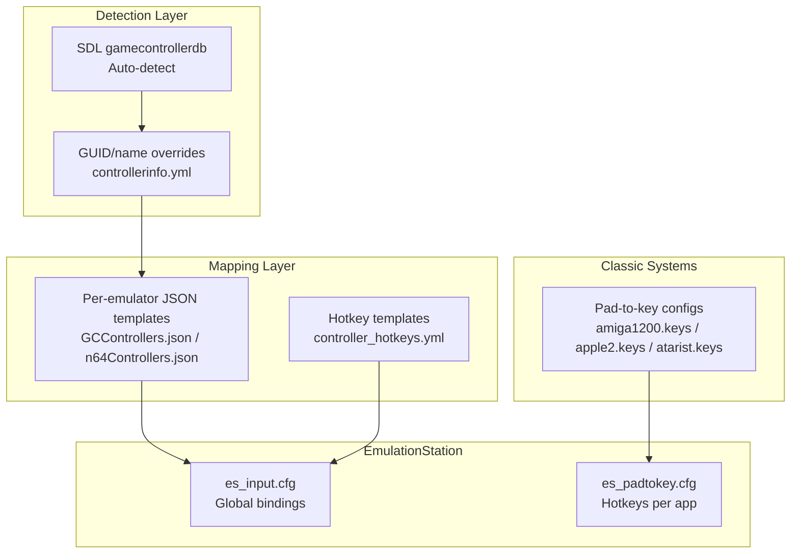
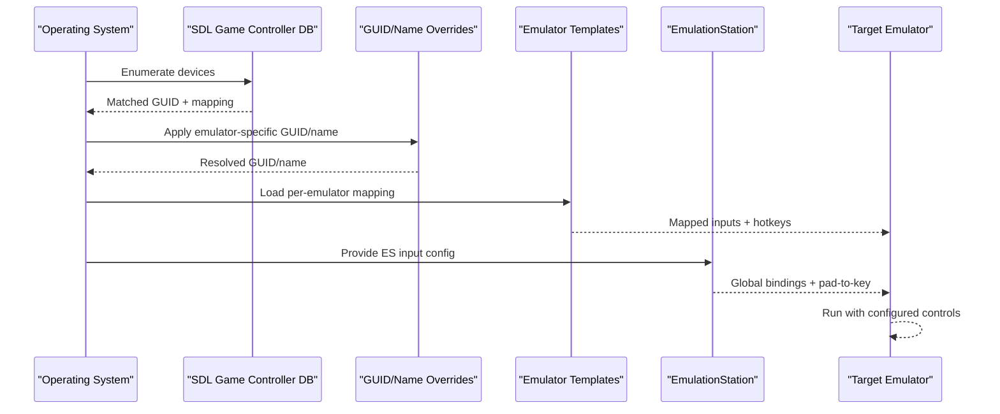
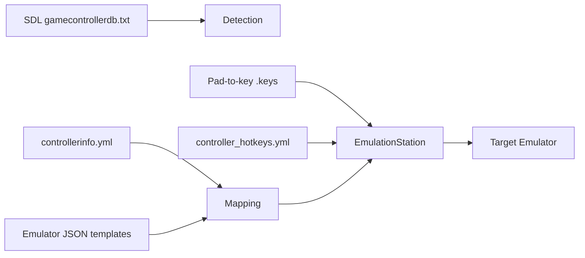

# Controller Setup and Detection

<cite>
**Referenced Files in This Document**
- [gamecontrollerdb.txt](file://system/tools/gamecontrollerdb.txt)
- [es_input.cfg](file://emulationstation/.emulationstation/es_input.cfg)
- [es_padtokey.cfg](file://emulationstation/.emulationstation/es_padtokey.cfg)
- [controller_hotkeys.yml](file://system/resources/inputmapping/controller_hotkeys.yml)
- [controllerinfo.yml](file://system/tools/controllerinfo.yml)
- [GCControllers.json](file://system/resources/inputmapping/GCControllers.json)
- [n64Controllers.json](file://system/resources/inputmapping/n64Controllers.json)
- [amiga1200.keys](file://system/padtokey/amiga1200.keys)
- [apple2.keys](file://system/padtokey/apple2.keys)
- [atarist.keys](file://system/padtokey/atarist.keys)
- [xenial_gamecontrollerdb.txt](file://system/templates/xenia/gamecontrollerdb.txt)
- [xbox_gamecontrollerdb.txt](file://system/templates/xbox/gamecontrollerdb.txt)
- [xroar_gamecontrollerdb.txt](file://system/templates/xroar/gamecontrollerdb.txt)
- [bigpemu_gamecontrollerdb.txt](file://system/templates/bigpemu/gamecontrollerdb.txt)
</cite>

## Table of Contents
1. [Introduction](#introduction)
2. [Project Structure](#project-structure)
3. [Core Components](#core-components)
4. [Architecture Overview](#architecture-overview)
5. [Detailed Component Analysis](#detailed-component-analysis)
6. [Dependency Analysis](#dependency-analysis)
7. [Performance Considerations](#performance-considerations)
8. [Troubleshooting Guide](#troubleshooting-guide)
9. [Conclusion](#conclusion)
10. [Appendices](#appendices)

## Introduction
This document explains how the system detects and configures controllers, translates inputs to keyboard events for classic systems, and manages compatibility across platforms. It covers:
- Auto-detection via SDL’s gamecontrollerdb and GUID matching
- DirectInput/XInput integration and driver selection
- Platform-specific device enumeration and mapping
- Pad-to-key translation for Amiga, Apple II, Atari ST, and others
- Controller database structure, VID/PID matching, and compatibility matrices
- Multi-controller support, hotplug detection, and fallback mechanisms
- Step-by-step setup for Xbox controllers, PlayStation adapters, and classic console controllers

## Project Structure
The controller stack spans several configuration layers:
- Global SDL database for automatic mapping
- Emulator-specific GUID/name overrides
- Per-emulator input mapping templates
- Pad-to-key configuration for classic systems
- Hotkey templates for RetroArch and other emulators

**Diagram sources**
- [gamecontrollerdb.txt](file://system/tools/gamecontrollerdb.txt)
- [controllerinfo.yml](file://system/tools/controllerinfo.yml)
- [GCControllers.json](file://system/resources/inputmapping/GCControllers.json)
- [n64Controllers.json](file://system/resources/inputmapping/n64Controllers.json)
- [controller_hotkeys.yml](file://system/resources/inputmapping/controller_hotkeys.yml)
- [es_input.cfg](file://emulationstation/.emulationstation/es_input.cfg)
- [es_padtokey.cfg](file://emulationstation/.emulationstation/es_padtokey.cfg)
- [amiga1200.keys](file://system/padtokey/amiga1200.keys)
- [apple2.keys](file://system/padtokey/apple2.keys)
- [atarist.keys](file://system/padtokey/atarist.keys)

**Section sources**
- [gamecontrollerdb.txt](file://system/tools/gamecontrollerdb.txt)
- [controllerinfo.yml](file://system/tools/controllerinfo.yml)
- [GCControllers.json](file://system/resources/inputmapping/GCControllers.json)
- [n64Controllers.json](file://system/resources/inputmapping/n64Controllers.json)
- [controller_hotkeys.yml](file://system/resources/inputmapping/controller_hotkeys.yml)
- [es_input.cfg](file://emulationstation/.emulationstation/es_input.cfg)
- [es_padtokey.cfg](file://emulationstation/.emulationstation/es_padtokey.cfg)
- [amiga1200.keys](file://system/padtokey/amiga1200.keys)
- [apple2.keys](file://system/padtokey/apple2.keys)
- [atarist.keys](file://system/padtokey/atarist.keys)

## Core Components
- SDL gamecontrollerdb: Provides automatic mapping for thousands of controllers using vendor/product identifiers and platform hints.
- GUID/name overrides: Allows replacing detected GUIDs or device names for specific emulators (e.g., Citra, Yuzu, Dolphin).
- Emulator templates: JSON files define per-emulator mappings and hotkeys for specific controllers.
- Pad-to-key configs: JSON files translate controller inputs to keyboard/mouse events for classic systems.
- ES global and per-app hotkeys: XML and YAML define emulator-specific hotkeys and pad-to-key behavior.

**Section sources**
- [gamecontrollerdb.txt](file://system/tools/gamecontrollerdb.txt)
- [controllerinfo.yml](file://system/tools/controllerinfo.yml)
- [GCControllers.json](file://system/resources/inputmapping/GCControllers.json)
- [n64Controllers.json](file://system/resources/inputmapping/n64Controllers.json)
- [es_padtokey.cfg](file://emulationstation/.emulationstation/es_padtokey.cfg)
- [controller_hotkeys.yml](file://system/resources/inputmapping/controller_hotkeys.yml)

## Architecture Overview
The controller pipeline:
1. SDL enumerates devices and matches them against gamecontrollerdb entries.
2. If a match is found, the system applies the mapping; otherwise, it falls back to generic mappings or user templates.
3. Emulator-specific overrides (GUID/name) refine the mapping for target emulators.
4. Per-emulator JSON templates further tune axes/buttons and hotkeys.
5. For classic systems, pad-to-key configs translate controller inputs to keyboard/mouse events.
6. ES hotkeys and RetroArch hotkey templates provide global and per-core hotkeys.

**Diagram sources**
- [gamecontrollerdb.txt](file://system/tools/gamecontrollerdb.txt)
- [controllerinfo.yml](file://system/tools/controllerinfo.yml)
- [GCControllers.json](file://system/resources/inputmapping/GCControllers.json)
- [n64Controllers.json](file://system/resources/inputmapping/n64Controllers.json)
- [es_input.cfg](file://emulationstation/.emulationstation/es_input.cfg)
- [es_padtokey.cfg](file://emulationstation/.emulationstation/es_padtokey.cfg)

## Detailed Component Analysis

### Auto-Detection Using gamecontrollerdb.txt
- The global database defines thousands of entries with vendor/product identifiers, platform hints, and button/axis mappings.
- Entries include Xbox, PlayStation, and classic adapters, ensuring broad compatibility.
- Platform-specific entries (e.g., WindowsWheel, WindowsGun) enable specialized mappings.

Implementation highlights:
- Vendor/product ID parsing and platform filtering
- Button/axis remapping for common layouts
- Platform hints guide driver selection (Windows, Linux, macOS)

**Section sources**
- [gamecontrollerdb.txt](file://system/tools/gamecontrollerdb.txt)

### DirectInput/XInput Integration and Driver Selection
- Some controllers specify drivers (e.g., DInput, SDL, XInput) in templates.
- Driver selection affects axis/button interpretation and hotkeys.
- Examples include GameCube adapters and N64 controllers with multiple driver variants.

**Section sources**
- [GCControllers.json](file://system/resources/inputmapping/GCControllers.json)
- [n64Controllers.json](file://system/resources/inputmapping/n64Controllers.json)

### Platform-Specific Device Enumeration
- GUID/name overrides allow targeting specific emulators that require exact device identification.
- Supported emulators include Citra, Yuzu, Lime3DS, Dolphin, and others.

**Section sources**
- [controllerinfo.yml](file://system/tools/controllerinfo.yml)

### Controller Database Structure and Compatibility Matrices
- Controllers are grouped by emulator and device name.
- Each entry includes GUID(s), driver, mapping, hotkeys, and calibration data.
- Compatibility matrices enumerate supported emulators and driver combinations.

Example structures:
- GUID/name overrides: map a RetroBat GUID to an emulator-specific GUID/name
- Emulator templates: define mapping keys and hotkeys for each controller

**Section sources**
- [GCControllers.json](file://system/resources/inputmapping/GCControllers.json)
- [n64Controllers.json](file://system/resources/inputmapping/n64Controllers.json)
- [controllerinfo.yml](file://system/tools/controllerinfo.yml)

### Pad-to-Key Translation for Classic Systems
Pad-to-key converts controller inputs to keyboard/mouse events for systems like Amiga, Apple II, and Atari ST.

Key files:
- Amiga: [amiga1200.keys](file://system/padtokey/amiga1200.keys)
- Apple II: [apple2.keys](file://system/padtokey/apple2.keys)
- Atari ST: [atarist.keys](file://system/padtokey/atarist.keys)

Typical mappings:
- Action buttons to keyboard keys
- D-pad/joystick to numeric keypad or mouse movement
- L3/R3 mapped to mouse buttons or special keys

**Section sources**
- [amiga1200.keys](file://system/padtokey/amiga1200.keys)
- [apple2.keys](file://system/padtokey/apple2.keys)
- [atarist.keys](file://system/padtokey/atarist.keys)
- [es_padtokey.cfg](file://emulationstation/.emulationstation/es_padtokey.cfg)

### EmulationStation Global and Per-App Hotkeys
- Global bindings: [es_input.cfg](file://emulationstation/.emulationstation/es_input.cfg)
- Per-app hotkeys: [es_padtokey.cfg](file://emulationstation/.emulationstation/es_padtokey.cfg)
- RetroArch hotkeys: [controller_hotkeys.yml](file://system/resources/inputmapping/controller_hotkeys.yml)

These files define emulator-specific hotkeys and pad-to-key behavior.

**Section sources**
- [es_input.cfg](file://emulationstation/.emulationstation/es_input.cfg)
- [es_padtokey.cfg](file://emulationstation/.emulationstation/es_padtokey.cfg)
- [controller_hotkeys.yml](file://system/resources/inputmapping/controller_hotkeys.yml)

### Multi-Controller Support and Hotplug Detection
- The system supports multiple controllers by device GUID and per-device input configs.
- Hotplug detection relies on SDL enumeration and template loading.
- Fallbacks occur when a device does not match a specific template.

**Section sources**
- [es_input.cfg](file://emulationstation/.emulationstation/es_input.cfg)
- [GCControllers.json](file://system/resources/inputmapping/GCControllers.json)
- [n64Controllers.json](file://system/resources/inputmapping/n64Controllers.json)

### Practical Setup Guides

#### Xbox Controllers (Wireless and Wired)
Steps:
1. Plug in the controller; SDL auto-detects via gamecontrollerdb.
2. Confirm GUID/name in [es_input.cfg](file://emulationstation/.emulationstation/es_input.cfg).
3. Adjust per-app hotkeys in [es_padtokey.cfg](file://emulationstation/.emulationstation/es_padtokey.cfg) if needed.
4. For emulator-specific needs, verify GUID overrides in [controllerinfo.yml](file://system/tools/controllerinfo.yml).

**Section sources**
- [es_input.cfg](file://emulationstation/.emulationstation/es_input.cfg)
- [es_padtokey.cfg](file://emulationstation/.emulationstation/es_padtokey.cfg)
- [controllerinfo.yml](file://system/tools/controllerinfo.yml)

#### PlayStation Adapters and Controllers
Steps:
1. Ensure the adapter or controller is recognized by SDL (check [gamecontrollerdb.txt](file://system/tools/gamecontrollerdb.txt)).
2. If needed, apply GUID/name overrides in [controllerinfo.yml](file://system/tools/controllerinfo.yml).
3. Load emulator-specific mappings from [GCControllers.json](file://system/resources/inputmapping/GCControllers.json) or [n64Controllers.json](file://system/resources/inputmapping/n64Controllers.json).
4. Verify hotkeys in [controller_hotkeys.yml](file://system/resources/inputmapping/controller_hotkeys.yml).

**Section sources**
- [gamecontrollerdb.txt](file://system/tools/gamecontrollerdb.txt)
- [controllerinfo.yml](file://system/tools/controllerinfo.yml)
- [GCControllers.json](file://system/resources/inputmapping/GCControllers.json)
- [n64Controllers.json](file://system/resources/inputmapping/n64Controllers.json)
- [controller_hotkeys.yml](file://system/resources/inputmapping/controller_hotkeys.yml)

#### Classic Console Controllers (e.g., GameCube, N64 Adapters)
Steps:
1. Connect the adapter/controller; SDL matches via [gamecontrollerdb.txt](file://system/tools/gamecontrollerdb.txt).
2. Apply emulator-specific overrides in [controllerinfo.yml](file://system/tools/controllerinfo.yml).
3. Load per-emulator mappings from [GCControllers.json](file://system/resources/inputmapping/GCControllers.json) or [n64Controllers.json](file://system/resources/inputmapping/n64Controllers.json).
4. Calibrate triggers and sticks if required by the template.

**Section sources**
- [gamecontrollerdb.txt](file://system/tools/gamecontrollerdb.txt)
- [controllerinfo.yml](file://system/tools/controllerinfo.yml)
- [GCControllers.json](file://system/resources/inputmapping/GCControllers.json)
- [n64Controllers.json](file://system/resources/inputmapping/n64Controllers.json)

#### Pad-to-Key for Amiga, Apple II, Atari ST
Steps:
1. Place the appropriate .keys file in the padtokey directory:
   - [amiga1200.keys](file://system/padtokey/amiga1200.keys)
   - [apple2.keys](file://system/padtokey/apple2.keys)
   - [atarist.keys](file://system/padtokey/atarist.keys)
2. Configure EmulationStation hotkeys in [es_padtokey.cfg](file://emulationstation/.emulationstation/es_padtokey.cfg) to use the pad-to-key system.

**Section sources**
- [amiga1200.keys](file://system/padtokey/amiga1200.keys)
- [apple2.keys](file://system/padtokey/apple2.keys)
- [atarist.keys](file://system/padtokey/atarist.keys)
- [es_padtokey.cfg](file://emulationstation/.emulationstation/es_padtokey.cfg)

## Dependency Analysis
The controller stack depends on:
- SDL database for initial detection and mapping
- GUID/name overrides for emulator-specific targeting
- Emulator templates for precise button/axis mapping and hotkeys
- Pad-to-key configs for classic systems
- ES configuration for global bindings and per-app hotkeys

**Diagram sources**
- [gamecontrollerdb.txt](file://system/tools/gamecontrollerdb.txt)
- [controllerinfo.yml](file://system/tools/controllerinfo.yml)
- [GCControllers.json](file://system/resources/inputmapping/GCControllers.json)
- [n64Controllers.json](file://system/resources/inputmapping/n64Controllers.json)
- [es_padtokey.cfg](file://emulationstation/.emulationstation/es_padtokey.cfg)
- [controller_hotkeys.yml](file://system/resources/inputmapping/controller_hotkeys.yml)

**Section sources**
- [gamecontrollerdb.txt](file://system/tools/gamecontrollerdb.txt)
- [controllerinfo.yml](file://system/tools/controllerinfo.yml)
- [GCControllers.json](file://system/resources/inputmapping/GCControllers.json)
- [n64Controllers.json](file://system/resources/inputmapping/n64Controllers.json)
- [es_padtokey.cfg](file://emulationstation/.emulationstation/es_padtokey.cfg)
- [controller_hotkeys.yml](file://system/resources/inputmapping/controller_hotkeys.yml)

## Performance Considerations
- Prefer SDL-based mappings to minimize per-emulator overhead.
- Use GUID/name overrides sparingly to avoid excessive template lookups.
- Keep pad-to-key mappings minimal to reduce event translation latency.
- Calibrate triggers/sticks in templates to prevent accidental input drift.

## Troubleshooting Guide
Common issues and resolutions:
- Driver conflicts (DInput vs XInput): Select the correct driver in the emulator template and confirm in [GCControllers.json](file://system/resources/inputmapping/GCControllers.json) or [n64Controllers.json](file://system/resources/inputmapping/n64Controllers.json).
- Device recognition failures: Verify GUID/name overrides in [controllerinfo.yml](file://system/tools/controllerinfo.yml) and ensure the device appears in [es_input.cfg](file://emulationstation/.emulationstation/es_input.cfg).
- Unsupported devices: Add or adjust entries in [gamecontrollerdb.txt](file://system/tools/gamecontrollerdb.txt) or use emulator-specific templates.
- Hotplug detection: Ensure SDL enumeration is active and templates reload on device change.
- Classic system controls not responding: Confirm the correct .keys file is present and referenced in [es_padtokey.cfg](file://emulationstation/.emulationstation/es_padtokey.cfg).

**Section sources**
- [controllerinfo.yml](file://system/tools/controllerinfo.yml)
- [es_input.cfg](file://emulationstation/.emulationstation/es_input.cfg)
- [GCControllers.json](file://system/resources/inputmapping/GCControllers.json)
- [n64Controllers.json](file://system/resources/inputmapping/n64Controllers.json)
- [es_padtokey.cfg](file://emulationstation/.emulationstation/es_padtokey.cfg)

## Conclusion
The system combines SDL auto-detection, GUID/name overrides, per-emulator templates, and pad-to-key translation to deliver robust controller support across modern and classic gaming systems. By leveraging these components and following the practical setup guides, users can achieve reliable multi-controller operation, hotplug detection, and accurate input mapping with fallback mechanisms for unsupported devices.

## Appendices

### Appendix A: Platform-Specific SDL Databases
- Xenia: [xenial_gamecontrollerdb.txt](file://system/templates/xenia/gamecontrollerdb.txt)
- Xbox: [xbox_gamecontrollerdb.txt](file://system/templates/xbox/gamecontrollerdb.txt)
- XRoar: [xroar_gamecontrollerdb.txt](file://system/templates/xroar/gamecontrollerdb.txt)
- BigPEmu: [bigpemu_gamecontrollerdb.txt](file://system/templates/bigpemu/gamecontrollerdb.txt)

**Section sources**
- [xenial_gamecontrollerdb.txt](file://system/templates/xenia/gamecontrollerdb.txt)
- [xbox_gamecontrollerdb.txt](file://system/templates/xbox/gamecontrollerdb.txt)
- [xroar_gamecontrollerdb.txt](file://system/templates/xroar/gamecontrollerdb.txt)
- [bigpemu_gamecontrollerdb.txt](file://system/templates/bigpemu/gamecontrollerdb.txt)