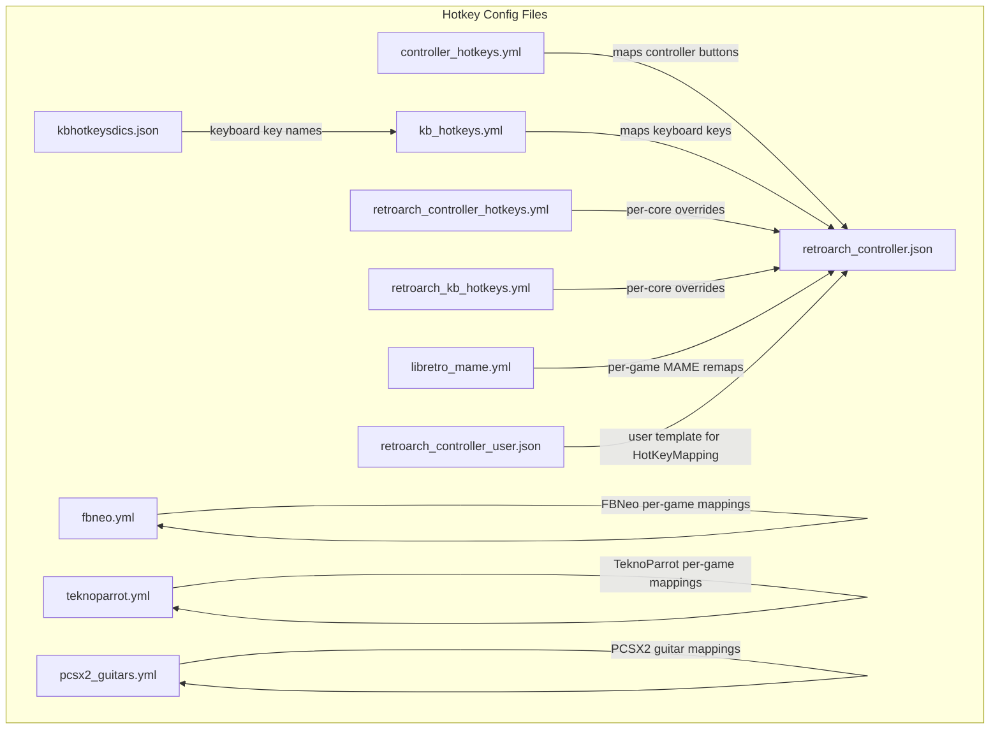
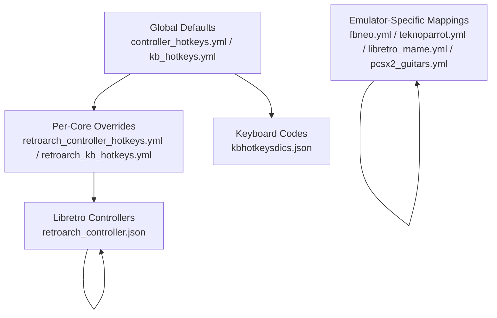
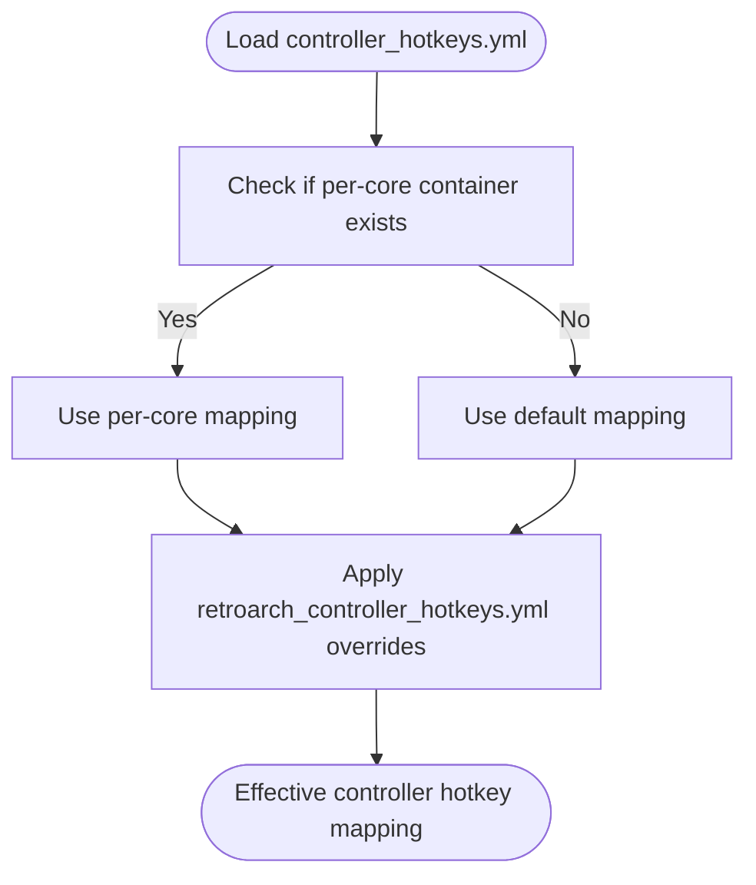
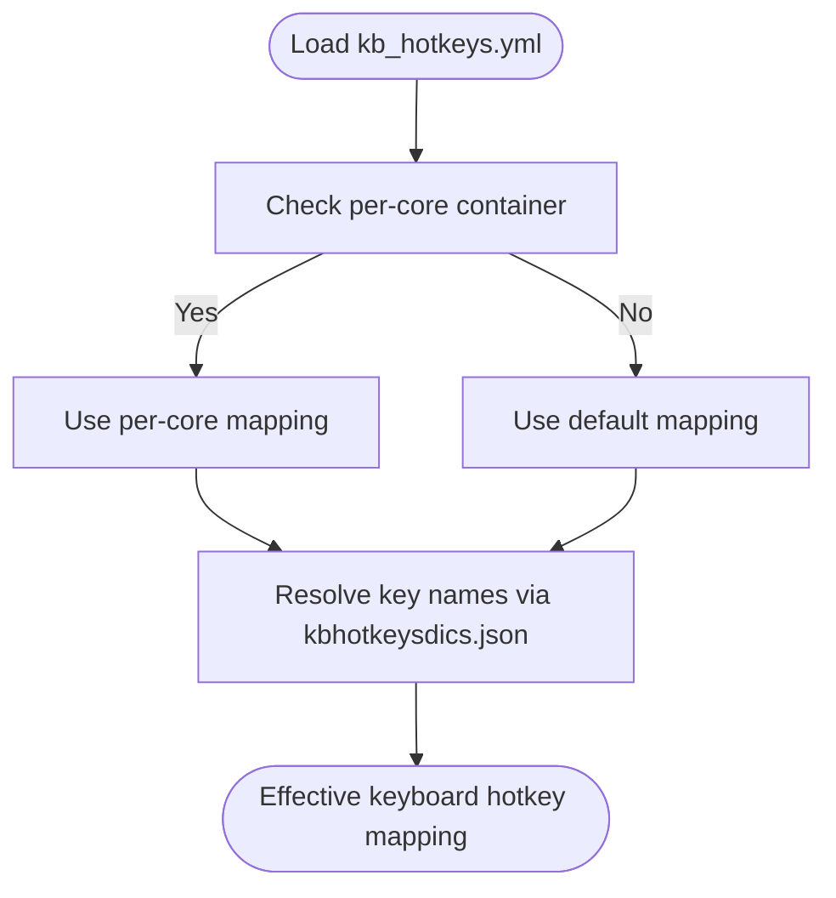
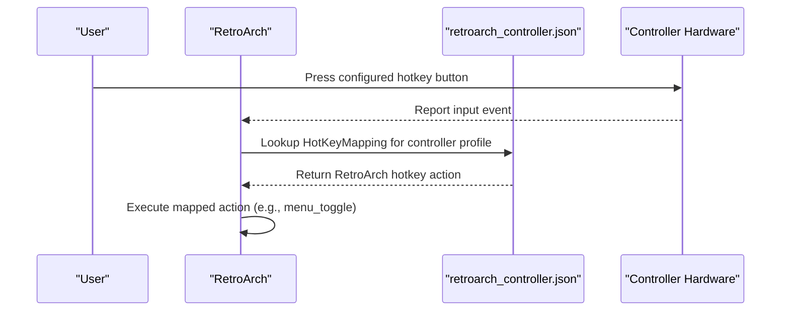
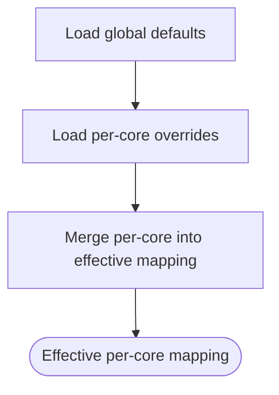
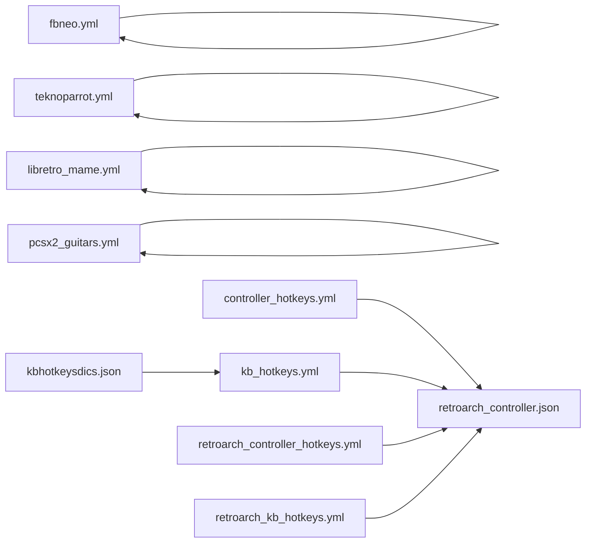

# Hotkey Configuration

<cite>
**Referenced Files in This Document**
- [controller_hotkeys.yml](file://system/resources/inputmapping/controller_hotkeys.yml)
- [kb_hotkeys.yml](file://system/resources/inputmapping/kb_hotkeys.yml)
- [retroarch_controller.json](file://system/resources/inputmapping/retroarch_controller.json)
- [retroarch_controller_hotkeys.yml](file://system/resources/inputmapping/retroarch_controller_hotkeys.yml)
- [retroarch_kb_hotkeys.yml](file://system/resources/inputmapping/retroarch_kb_hotkeys.yml)
- [libretro_mame.yml](file://system/resources/inputmapping/libretro_mame.yml)
- [fbneo.yml](file://system/resources/inputmapping/fbneo.yml)
- [teknoparrot.yml](file://system/resources/inputmapping/teknoparrot.yml)
- [pcsx2_guitars.yml](file://system/resources/inputmapping/guitars/pcsx2_guitars.yml)
- [kbhotkeysdics.json](file://emulationstation/resources/kbhotkeysdics.json)
- [retroarch_controller_user.json](file://system/resources/inputmapping/usertemplates/retroarch_controller.json)
</cite>

## Table of Contents
1. [Introduction](#introduction)
2. [Project Structure](#project-structure)
3. [Core Components](#core-components)
4. [Architecture Overview](#architecture-overview)
5. [Detailed Component Analysis](#detailed-component-analysis)
6. [Dependency Analysis](#dependency-analysis)
7. [Performance Considerations](#performance-considerations)
8. [Troubleshooting Guide](#troubleshooting-guide)
9. [Conclusion](#conclusion)

## Introduction
This document explains the hotkey configuration system used across RetroBat’s supported emulators and tools. It covers:
- Controller hotkey mapping for RetroArch and standalone emulators
- Keyboard hotkey mapping for RetroArch and standalone emulators
- Libretro core integration via JSON controller definitions
- Single-button “noHotkey” mode for simplified shortcuts
- Conflict resolution, priorities, and platform-specific key mappings
- Advanced features such as modifier keys, chords, and custom bindings
- Practical examples for PCSX2, RetroArch cores, and standalone arcade emulators
- Troubleshooting steps for detection, validation, and emulator-specific limitations

## Project Structure
Hotkey configuration is organized into YAML and JSON files under system/resources/inputmapping. The most relevant files for hotkeys are:
- controller_hotkeys.yml: default controller-to-action mapping for multiple emulators
- kb_hotkeys.yml: default keyboard-to-RetroArch action mapping for multiple emulators
- retroarch_controller.json: libretro controller definitions with HotKeyMapping
- retroarch_controller_hotkeys.yml: per-core controller hotkey overrides
- retroarch_kb_hotkeys.yml: per-core keyboard hotkey overrides
- libretro_mame.yml: per-game MAME input remaps for RetroArch
- fbneo.yml: per-game arcade input mappings for FBNeo
- teknoparrot.yml: per-game input mappings for TeknoParrot
- pcsx2_guitars.yml: per-guitar type mappings for PCSX2
- kbhotkeysdics.json: per-emulator keyboard key name to internal code mappings
- retroarch_controller_user.json: user template for libretro controller HotKeyMapping

**Diagram sources**
- [controller_hotkeys.yml](file://system/resources/inputmapping/controller_hotkeys.yml)
- [kb_hotkeys.yml](file://system/resources/inputmapping/kb_hotkeys.yml)
- [retroarch_controller.json](file://system/resources/inputmapping/retroarch_controller.json)
- [retroarch_controller_hotkeys.yml](file://system/resources/inputmapping/retroarch_controller_hotkeys.yml)
- [retroarch_kb_hotkeys.yml](file://system/resources/inputmapping/retroarch_kb_hotkeys.yml)
- [libretro_mame.yml](file://system/resources/inputmapping/libretro_mame.yml)
- [fbneo.yml](file://system/resources/inputmapping/fbneo.yml)
- [teknoparrot.yml](file://system/resources/inputmapping/teknoparrot.yml)
- [pcsx2_guitars.yml](file://system/resources/inputmapping/guitars/pcsx2_guitars.yml)
- [kbhotkeysdics.json](file://emulationstation/resources/kbhotkeysdics.json)
- [retroarch_controller_user.json](file://system/resources/inputmapping/usertemplates/retroarch_controller.json)

**Section sources**
- [controller_hotkeys.yml](file://system/resources/inputmapping/controller_hotkeys.yml)
- [kb_hotkeys.yml](file://system/resources/inputmapping/kb_hotkeys.yml)
- [retroarch_controller.json](file://system/resources/inputmapping/retroarch_controller.json)
- [retroarch_controller_hotkeys.yml](file://system/resources/inputmapping/retroarch_controller_hotkeys.yml)
- [retroarch_kb_hotkeys.yml](file://system/resources/inputmapping/retroarch_kb_hotkeys.yml)
- [libretro_mame.yml](file://system/resources/inputmapping/libretro_mame.yml)
- [fbneo.yml](file://system/resources/inputmapping/fbneo.yml)
- [teknoparrot.yml](file://system/resources/inputmapping/teknoparrot.yml)
- [pcsx2_guitars.yml](file://system/resources/inputmapping/guitars/pcsx2_guitars.yml)
- [kbhotkeysdics.json](file://emulationstation/resources/kbhotkeysdics.json)
- [retroarch_controller_user.json](file://system/resources/inputmapping/usertemplates/retroarch_controller.json)

## Core Components
- Controller hotkey mapping (controller_hotkeys.yml)
  - Provides default controller-to-action mappings for multiple emulators
  - Supports per-core containers and a global default container
  - Includes optional single-button mode via noHotkey: true
- Keyboard hotkey mapping (kb_hotkeys.yml)
  - Provides default keyboard-to-RetroArch action mappings for multiple emulators
  - Uses RetroArch config option names as keys
- Libretro controller integration (retroarch_controller.json)
  - Defines controller mappings and HotKeyMapping for libretro cores
  - Supports multiple drivers and per-controller HotKeyMapping
- Per-core overrides
  - retroarch_controller_hotkeys.yml: per-core controller hotkey overrides
  - retroarch_kb_hotkeys.yml: per-core keyboard hotkey overrides
- Emulator-specific mappings
  - libretro_mame.yml: per-game MAME input remaps for RetroArch
  - fbneo.yml: per-game arcade mappings for FBNeo
  - teknoparrot.yml: per-game mappings for TeknoParrot
  - pcsx2_guitars.yml: per-guitar type mappings for PCSX2
- Platform-specific keyboard dictionaries (kbhotkeysdics.json)
  - Maps human-readable key names to emulator-specific internal codes

**Section sources**
- [controller_hotkeys.yml](file://system/resources/inputmapping/controller_hotkeys.yml)
- [kb_hotkeys.yml](file://system/resources/inputmapping/kb_hotkeys.yml)
- [retroarch_controller.json](file://system/resources/inputmapping/retroarch_controller.json)
- [retroarch_controller_hotkeys.yml](file://system/resources/inputmapping/retroarch_controller_hotkeys.yml)
- [retroarch_kb_hotkeys.yml](file://system/resources/inputmapping/retroarch_kb_hotkeys.yml)
- [libretro_mame.yml](file://system/resources/inputmapping/libretro_mame.yml)
- [fbneo.yml](file://system/resources/inputmapping/fbneo.yml)
- [teknoparrot.yml](file://system/resources/inputmapping/teknoparrot.yml)
- [pcsx2_guitars.yml](file://system/resources/inputmapping/guitars/pcsx2_guitars.yml)
- [kbhotkeysdics.json](file://emulationstation/resources/kbhotkeysdics.json)

## Architecture Overview
The hotkey system composes multiple layers:
- Global defaults: controller_hotkeys.yml and kb_hotkeys.yml define baseline mappings
- Per-core overrides: retroarch_controller_hotkeys.yml and retroarch_kb_hotkeys.yml refine mappings for specific cores
- Libretro integration: retroarch_controller.json binds controller hardware to RetroArch actions via HotKeyMapping
- Emulator-specific mappings: fbneo.yml, teknoparrot.yml, libretro_mame.yml, and pcsx2_guitars.yml tailor inputs for standalone emulators
- Platform-specific keyboard codes: kbhotkeysdics.json translates key names to internal codes for each emulator

**Diagram sources**
- [controller_hotkeys.yml](file://system/resources/inputmapping/controller_hotkeys.yml)
- [kb_hotkeys.yml](file://system/resources/inputmapping/kb_hotkeys.yml)
- [retroarch_controller_hotkeys.yml](file://system/resources/inputmapping/retroarch_controller_hotkeys.yml)
- [retroarch_kb_hotkeys.yml](file://system/resources/inputmapping/retroarch_kb_hotkeys.yml)
- [retroarch_controller.json](file://system/resources/inputmapping/retroarch_controller.json)
- [fbneo.yml](file://system/resources/inputmapping/fbneo.yml)
- [teknoparrot.yml](file://system/resources/inputmapping/teknoparrot.yml)
- [libretro_mame.yml](file://system/resources/inputmapping/libretro_mame.yml)
- [pcsx2_guitars.yml](file://system/resources/inputmapping/guitars/pcsx2_guitars.yml)
- [kbhotkeysdics.json](file://emulationstation/resources/kbhotkeysdics.json)

## Detailed Component Analysis

### Controller Hotkey Mapping (controller_hotkeys.yml)
- Purpose: Define default controller-to-emulator action mappings for multiple emulators
- Structure:
  - Container names: emulator names or "default"
  - Keys: controller input identifiers (e.g., a, b, y, x, pageup, pagedown)
  - Values: emulator actions (converted internally to RetroArch-compatible names)
  - Optional: noHotkey: true to enable single-button shortcuts
- Priority:
  - If a per-core container exists, it overrides the default container
  - RetroArch-specific overrides apply via retroarch_controller_hotkeys.yml

**Diagram sources**
- [controller_hotkeys.yml](file://system/resources/inputmapping/controller_hotkeys.yml)
- [retroarch_controller_hotkeys.yml](file://system/resources/inputmapping/retroarch_controller_hotkeys.yml)

**Section sources**
- [controller_hotkeys.yml](file://system/resources/inputmapping/controller_hotkeys.yml)
- [retroarch_controller_hotkeys.yml](file://system/resources/inputmapping/retroarch_controller_hotkeys.yml)

### Keyboard Hotkey Mapping (kb_hotkeys.yml)
- Purpose: Define default keyboard-to-RetroArch action mappings for multiple emulators
- Structure:
  - Container names: emulator names or "default"
  - Keys: RetroArch config option names (e.g., input_menu_toggle)
  - Values: keyboard keys (e.g., f1)
- Priority:
  - Per-core overrides via retroarch_kb_hotkeys.yml
  - Platform-specific key names resolved via kbhotkeysdics.json

**Diagram sources**
- [kb_hotkeys.yml](file://system/resources/inputmapping/kb_hotkeys.yml)
- [retroarch_kb_hotkeys.yml](file://system/resources/inputmapping/retroarch_kb_hotkeys.yml)
- [kbhotkeysdics.json](file://emulationstation/resources/kbhotkeysdics.json)

**Section sources**
- [kb_hotkeys.yml](file://system/resources/inputmapping/kb_hotkeys.yml)
- [retroarch_kb_hotkeys.yml](file://system/resources/inputmapping/retroarch_kb_hotkeys.yml)
- [kbhotkeysdics.json](file://emulationstation/resources/kbhotkeysdics.json)

### Libretro Controller Integration (retroarch_controller.json)
- Purpose: Bind controller hardware to RetroArch actions via HotKeyMapping
- Structure:
  - Controllers array with entries for each controller profile
  - Mapping: maps physical buttons/axes to RetroArch input IDs
  - HotKeyMapping: maps controller inputs to RetroArch hotkey actions
  - ControllerInfo: driver and platform-specific flags (e.g., ignoreSystemSpecificMapping)
- Usage:
  - RetroArch reads HotKeyMapping to trigger emulator actions
  - Multiple drivers (xinput, dinput, sdl2) supported per controller
  - User templates available in retroarch_controller_user.json

**Diagram sources**
- [retroarch_controller.json](file://system/resources/inputmapping/retroarch_controller.json)

**Section sources**
- [retroarch_controller.json](file://system/resources/inputmapping/retroarch_controller.json)
- [retroarch_controller_user.json](file://system/resources/inputmapping/usertemplates/retroarch_controller.json)

### Per-Core Overrides (retroarch_controller_hotkeys.yml and retroarch_kb_hotkeys.yml)
- Purpose: Override global defaults for specific RetroArch cores
- Structure:
  - Container names: core names (e.g., fceumm)
  - Keys: controller input identifiers or RetroArch config options
  - Values: actions or keys
  - Optional: noHotkey: true for single-button mode
- Priority:
  - Per-core overrides take precedence over global defaults
  - Applied after controller_hotkeys.yml and kb_hotkeys.yml

**Diagram sources**
- [retroarch_controller_hotkeys.yml](file://system/resources/inputmapping/retroarch_controller_hotkeys.yml)
- [retroarch_kb_hotkeys.yml](file://system/resources/inputmapping/retroarch_kb_hotkeys.yml)

**Section sources**
- [retroarch_controller_hotkeys.yml](file://system/resources/inputmapping/retroarch_controller_hotkeys.yml)
- [retroarch_kb_hotkeys.yml](file://system/resources/inputmapping/retroarch_kb_hotkeys.yml)

### Emulator-Specific Mappings

#### MAME (libretro_mame.yml)
- Purpose: Per-game MAME input remaps for RetroArch
- Structure:
  - Container names: ROM filenames (without extension)
  - Keys: controller button codes (a, b, x, y, pageup, pagedown)
  - Values: original system/game button IDs or -1 to unmap
  - Multiple layouts supported (default, modern8, alternatives)
- Notes:
  - Use default layout unless a specific game requires an alternative
  - Unmapping via -1 can resolve conflicts or simplify controls

**Section sources**
- [libretro_mame.yml](file://system/resources/inputmapping/libretro_mame.yml)

#### FBNeo (fbneo.yml)
- Purpose: Per-game arcade input mappings for FBNeo
- Structure:
  - Container names: ROM filenames (lowercase, without extension)
  - Keys: FBNeo arcade button names
  - Values: dinput button names (e.g., a, b, x, y, dpup, dpdown)
  - Special keys: players, noplayer, noplayer_ values for multi-player variants
- Notes:
  - Use players to specify number of players
  - Use noplayer_ to avoid prepending player index in config

**Section sources**
- [fbneo.yml](file://system/resources/inputmapping/fbneo.yml)

#### TeknoParrot (teknoparrot.yml)
- Purpose: Per-game input mappings for TeknoParrot
- Structure:
  - Container names: game profile names (lowercase, without extension)
  - Keys: InputMapping values in TeknoParrot XML
  - Values: gamepad buttons (e.g., south, east, west, north, triggers, sticks)
  - Lightgun support: mouseleft, mousemiddle, mouseright, kb_x for keyboard buttons
- Notes:
  - Lightgun mappings often require mouse buttons or keyboard keys
  - Use analog axes for steering and gun positioning

**Section sources**
- [teknoparrot.yml](file://system/resources/inputmapping/teknoparrot.yml)

#### PCSX2 Guitars (pcsx2_guitars.yml)
- Purpose: Per-guitar type mappings for PCSX2
- Structure:
  - Container names: guitar type names (e.g., CRKD_Guitar_XP)
  - Keys: PCSX2 input names (e.g., Up, Down, Green, Red)
  - Values: internal input identifiers (e.g., DPadUp, A, B, Y, X, LeftShoulder, +RightX, -RightY)
- Notes:
  - Add new guitar types by extending the file with appropriate mappings

**Section sources**
- [pcsx2_guitars.yml](file://system/resources/inputmapping/guitars/pcsx2_guitars.yml)

### Platform-Specific Key Mappings (kbhotkeysdics.json)
- Purpose: Translate human-readable key names to emulator-specific internal codes
- Structure:
  - Top-level keys: emulator names (e.g., ares, bigpemu, bizhawk)
  - Nested keys: key names (e.g., escape, f1, a, shift)
  - Values: internal key codes used by each emulator
- Usage:
  - RetroArch keyboard hotkeys are validated against RetroArch config option names
  - Standalone emulators use internal codes from kbhotkeysdics.json

**Section sources**
- [kbhotkeysdics.json](file://emulationstation/resources/kbhotkeysdics.json)

## Dependency Analysis
Hotkey configuration depends on:
- Global defaults (controller_hotkeys.yml, kb_hotkeys.yml)
- Per-core overrides (retroarch_controller_hotkeys.yml, retroarch_kb_hotkeys.yml)
- Libretro controller definitions (retroarch_controller.json)
- Emulator-specific mappings (fbneo.yml, teknoparrot.yml, libretro_mame.yml, pcsx2_guitars.yml)
- Platform-specific keyboard codes (kbhotkeysdics.json)

**Diagram sources**
- [controller_hotkeys.yml](file://system/resources/inputmapping/controller_hotkeys.yml)
- [kb_hotkeys.yml](file://system/resources/inputmapping/kb_hotkeys.yml)
- [retroarch_controller_hotkeys.yml](file://system/resources/inputmapping/retroarch_controller_hotkeys.yml)
- [retroarch_kb_hotkeys.yml](file://system/resources/inputmapping/retroarch_kb_hotkeys.yml)
- [retroarch_controller.json](file://system/resources/inputmapping/retroarch_controller.json)
- [fbneo.yml](file://system/resources/inputmapping/fbneo.yml)
- [teknoparrot.yml](file://system/resources/inputmapping/teknoparrot.yml)
- [libretro_mame.yml](file://system/resources/inputmapping/libretro_mame.yml)
- [pcsx2_guitars.yml](file://system/resources/inputmapping/guitars/pcsx2_guitars.yml)
- [kbhotkeysdics.json](file://emulationstation/resources/kbhotkeysdics.json)

**Section sources**
- [controller_hotkeys.yml](file://system/resources/inputmapping/controller_hotkeys.yml)
- [kb_hotkeys.yml](file://system/resources/inputmapping/kb_hotkeys.yml)
- [retroarch_controller_hotkeys.yml](file://system/resources/inputmapping/retroarch_controller_hotkeys.yml)
- [retroarch_kb_hotkeys.yml](file://system/resources/inputmapping/retroarch_kb_hotkeys.yml)
- [retroarch_controller.json](file://system/resources/inputmapping/retroarch_controller.json)
- [fbneo.yml](file://system/resources/inputmapping/fbneo.yml)
- [teknoparrot.yml](file://system/resources/inputmapping/teknoparrot.yml)
- [libretro_mame.yml](file://system/resources/inputmapping/libretro_mame.yml)
- [pcsx2_guitars.yml](file://system/resources/inputmapping/guitars/pcsx2_guitars.yml)
- [kbhotkeysdics.json](file://emulationstation/resources/kbhotkeysdics.json)

## Performance Considerations
- Minimize redundant mappings: consolidate per-core overrides to reduce merge complexity
- Prefer single-button shortcuts (noHotkey: true) for frequently used actions to reduce input complexity
- Limit per-game mappings to essential remaps to avoid excessive configuration overhead
- Use platform-specific key dictionaries to prevent repeated key name translations

## Troubleshooting Guide
Common issues and resolutions:
- Hotkey not detected
  - Verify controller profile exists in retroarch_controller.json and matches the connected controller
  - Confirm HotKeyMapping entries use valid button/axis identifiers for the selected driver
  - Check per-core overrides in retroarch_controller_hotkeys.yml for conflicting assignments
- Action not triggered
  - Ensure the mapped RetroArch action name is valid and supported by the current core
  - Validate keyboard mappings against kb_hotkeys.yml and kbhotkeysdics.json
  - For standalone emulators, confirm the emulator supports the requested action
- Conflicting hotkeys
  - Reassign one of the conflicting mappings in the appropriate override file
  - Use per-core containers to isolate conflicts to specific cores
- Single-button shortcuts not working
  - Add noHotkey: true in the relevant container (controller or retroarch_controller_hotkeys.yml)
  - Ensure the controller input identifier corresponds to a valid hotkey button in the profile
- Emulator-specific limitations
  - Some emulators may not expose all RetroArch actions; adjust mappings accordingly
  - For FBNeo and TeknoParrot, verify that the game profile and input names match the configuration files

**Section sources**
- [controller_hotkeys.yml](file://system/resources/inputmapping/controller_hotkeys.yml)
- [kb_hotkeys.yml](file://system/resources/inputmapping/kb_hotkeys.yml)
- [retroarch_controller.json](file://system/resources/inputmapping/retroarch_controller.json)
- [retroarch_controller_hotkeys.yml](file://system/resources/inputmapping/retroarch_controller_hotkeys.yml)
- [retroarch_kb_hotkeys.yml](file://system/resources/inputmapping/retroarch_kb_hotkeys.yml)
- [fbneo.yml](file://system/resources/inputmapping/fbneo.yml)
- [teknoparrot.yml](file://system/resources/inputmapping/teknoparrot.yml)

## Conclusion
The hotkey configuration system combines global defaults, per-core overrides, and emulator-specific mappings to deliver flexible and portable control schemes across RetroArch and standalone emulators. By leveraging libretro controller definitions, platform-specific key dictionaries, and targeted per-game remaps, users can tailor controls to their hardware and preferences while maintaining compatibility and resolving conflicts efficiently.