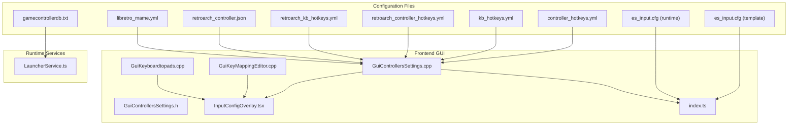
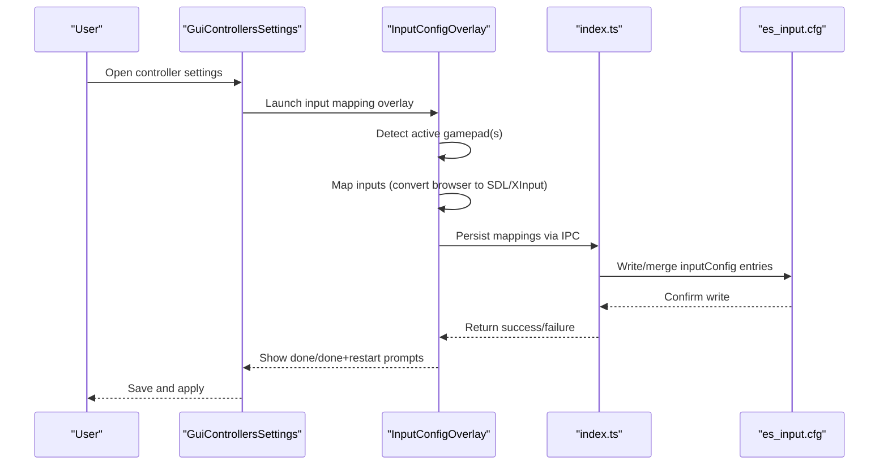
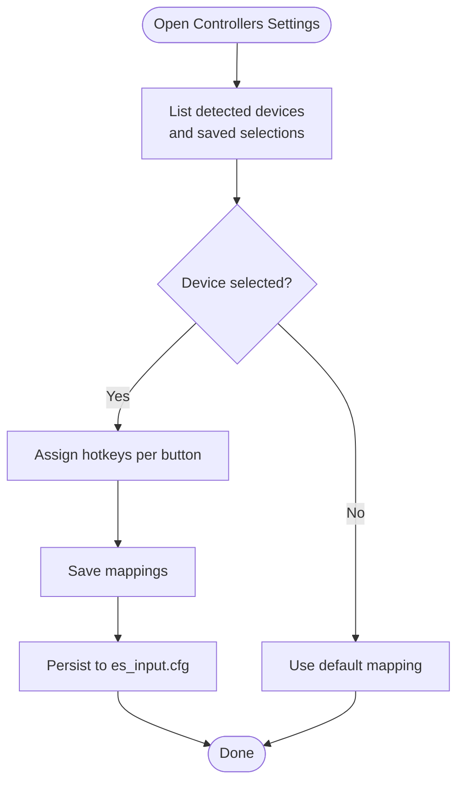
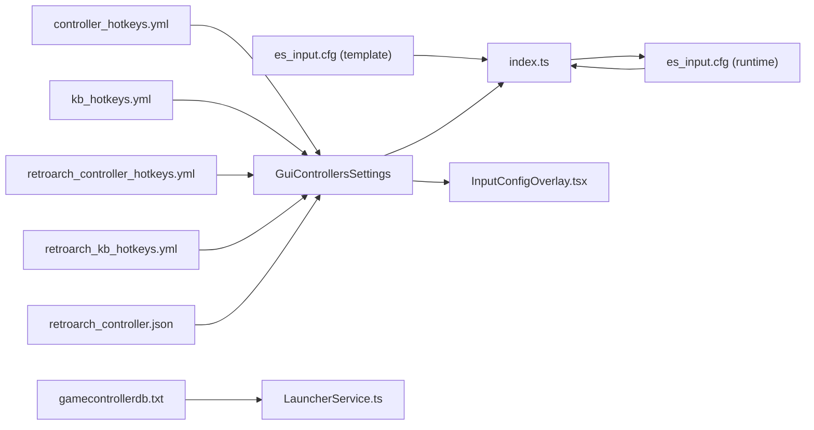

# Input Configuration

<cite>
**Referenced Files in This Document**
- [controller_hotkeys.yml](file://system/resources/inputmapping/controller_hotkeys.yml)
- [kb_hotkeys.yml](file://system/resources/inputmapping/kb_hotkeys.yml)
- [retroarch_controller.json](file://system/resources/inputmapping/retroarch_controller.json)
- [retroarch_controller_hotkeys.yml](file://system/resources/inputmapping/retroarch_controller_hotkeys.yml)
- [retroarch_kb_hotkeys.yml](file://system/resources/inputmapping/retroarch_kb_hotkeys.yml)
- [es_input.cfg](file://emulationstation/.emulationstation/es_input.cfg)
- [es_input.cfg (template)](file://system/templates/emulationstation/es_input.cfg)
- [libretro_mame.yml](file://system/resources/inputmapping/libretro_mame.yml)
- [gamecontrollerdb.txt](file://system/tools/gamecontrollerdb.txt)
- [GuiControllersSettings.cpp](file://emulationstation/.riescade/src/docs/es_src/guis/GuiControllersSettings.cpp)
- [GuiControllersSettings.h](file://emulationstation/.riescade/src/docs/es_src/guis/GuiControllersSettings.h)
- [GuiKeyMappingEditor.cpp](file://emulationstation/.riescade/src/docs/es_src/guis/GuiKeyMappingEditor.cpp)
- [GuiKeyboardtopads.cpp](file://emulationstation/.riescade/src/docs/es_src/guis/GuiKeyboardtopads.cpp)
- [InputConfigOverlay.tsx](file://emulationstation/.riescade/src/src/renderer/src/components/InputConfigOverlay.tsx)
- [index.ts](file://emulationstation/.riescade/src/src/main/index.ts)
- [LauncherService.ts](file://emulationstation/.riescade/src/src/main/services/LauncherService.ts)
</cite>

## Table of Contents
1. [Introduction](#introduction)
2. [Project Structure](#project-structure)
3. [Core Components](#core-components)
4. [Architecture Overview](#architecture-overview)
5. [Detailed Component Analysis](#detailed-component-analysis)
6. [Dependency Analysis](#dependency-analysis)
7. [Performance Considerations](#performance-considerations)
8. [Troubleshooting Guide](#troubleshooting-guide)
9. [Conclusion](#conclusion)
10. [Appendices](#appendices)

## Introduction
This document explains the input configuration system used by the RetroArch-based frontend. It covers controller setup and mapping for multiple input devices (gamepads, keyboards, and specialized controllers), hotkey configuration, keyboard shortcuts, and multi-device support. It also documents configuration options for different controller types, parameters for custom hotkeys, return values for successful mappings, and relationships with emulator configurations and game library filtering. Platform-specific input handling for Windows environments and integration with DirectInput/XInput APIs are included, with examples drawn from the repository’s YAML and JSON configuration files.

## Project Structure
The input configuration system spans several configuration formats and runtime components:
- YAML-based input mapping files define controller and keyboard hotkeys for RetroArch and emulators.
- JSON-based controller mapping files provide driver-specific mappings and hotkeys for RetroArch.
- Frontend GUI components allow interactive controller detection, mapping, and hotkey assignment.
- Template and runtime XML configuration files store per-device mappings for the frontend.
- Tools integrate with SDL/GameControllerDB for Windows device identification and mapping.

**Diagram sources**
- [controller_hotkeys.yml:1-38](file://system/resources/inputmapping/controller_hotkeys.yml#L1-L38)
- [kb_hotkeys.yml:1-34](file://system/resources/inputmapping/kb_hotkeys.yml#L1-L34)
- [retroarch_controller_hotkeys.yml:1-38](file://system/resources/inputmapping/retroarch_controller_hotkeys.yml#L1-L38)
- [retroarch_kb_hotkeys.yml:1-21](file://system/resources/inputmapping/retroarch_kb_hotkeys.yml#L1-L21)
- [retroarch_controller.json:1-362](file://system/resources/inputmapping/retroarch_controller.json#L1-L362)
- [es_input.cfg (template):1-92](file://system/templates/emulationstation/es_input.cfg#L1-L92)
- [es_input.cfg:1-161](file://emulationstation/.emulationstation/es_input.cfg#L1-L161)
- [libretro_mame.yml:1-800](file://system/resources/inputmapping/libretro_mame.yml#L1-L800)
- [gamecontrollerdb.txt:1-364](file://system/tools/gamecontrollerdb.txt#L1-L364)
- [GuiControllersSettings.cpp:187-545](file://emulationstation/.riescade/src/docs/es_src/guis/GuiControllersSettings.cpp#L187-L545)
- [GuiControllersSettings.h:1-44](file://emulationstation/.riescade/src/docs/es_src/guis/GuiControllersSettings.h#L1-L44)
- [GuiKeyMappingEditor.cpp:379-432](file://emulationstation/.riescade/src/docs/es_src/guis/GuiKeyMappingEditor.cpp#L379-L432)
- [GuiKeyboardtopads.cpp:182-205](file://emulationstation/.riescade/src/docs/es_src/guis/GuiKeyboardtopads.cpp#L182-L205)
- [InputConfigOverlay.tsx:46-73](file://emulationstation/.riescade/src/src/renderer/src/components/InputConfigOverlay.tsx#L46-L73)
- [index.ts:251-346](file://emulationstation/.riescade/src/src/main/index.ts#L251-L346)
- [LauncherService.ts:133-159](file://emulationstation/.riescade/src/src/main/services/LauncherService.ts#L133-L159)

**Section sources**
- [controller_hotkeys.yml:1-38](file://system/resources/inputmapping/controller_hotkeys.yml#L1-L38)
- [kb_hotkeys.yml:1-34](file://system/resources/inputmapping/kb_hotkeys.yml#L1-L34)
- [retroarch_controller_hotkeys.yml:1-38](file://system/resources/inputmapping/retroarch_controller_hotkeys.yml#L1-L38)
- [retroarch_kb_hotkeys.yml:1-21](file://system/resources/inputmapping/retroarch_kb_hotkeys.yml#L1-L21)
- [retroarch_controller.json:1-362](file://system/resources/inputmapping/retroarch_controller.json#L1-L362)
- [es_input.cfg:1-161](file://emulationstation/.emulationstation/es_input.cfg#L1-L161)
- [es_input.cfg (template):1-92](file://system/templates/emulationstation/es_input.cfg#L1-L92)
- [libretro_mame.yml:1-800](file://system/resources/inputmapping/libretro_mame.yml#L1-L800)
- [gamecontrollerdb.txt:1-364](file://system/tools/gamecontrollerdb.txt#L1-L364)
- [GuiControllersSettings.cpp:187-545](file://emulationstation/.riescade/src/docs/es_src/guis/GuiControllersSettings.cpp#L187-L545)
- [GuiControllersSettings.h:1-44](file://emulationstation/.riescade/src/docs/es_src/guis/GuiControllersSettings.h#L1-L44)
- [GuiKeyMappingEditor.cpp:379-432](file://emulationstation/.riescade/src/docs/es_src/guis/GuiKeyMappingEditor.cpp#L379-L432)
- [GuiKeyboardtopads.cpp:182-205](file://emulationstation/.riescade/src/docs/es_src/guis/GuiKeyboardtopads.cpp#L182-L205)
- [InputConfigOverlay.tsx:46-73](file://emulationstation/.riescade/src/src/renderer/src/components/InputConfigOverlay.tsx#L46-L73)
- [index.ts:251-346](file://emulationstation/.riescade/src/src/main/index.ts#L251-L346)
- [LauncherService.ts:133-159](file://emulationstation/.riescade/src/src/main/services/LauncherService.ts#L133-L159)

## Core Components
- Controller hotkey mapping (YAML): Defines per-emulator and per-core hotkeys for gamepad buttons (e.g., a, b, x, y, start, select, triggers, D-pad).
- Keyboard hotkey mapping (YAML): Maps RetroArch input actions to keyboard keys for global hotkeys.
- RetroArch controller mapping (JSON): Provides driver-specific mappings (e.g., dinput, xinput, sdl2) and hotkeys for controllers.
- Frontend controller configuration (XML): Stores per-device mappings for the frontend, including keyboard and joystick configurations.
- Specialized mappings (YAML/JSON): Includes MAME remaps and wheel/gun configurations.
- Runtime services: Detect and persist controller mappings, convert browser gamepad events, and integrate with SDL/GameControllerDB.

Key configuration options and parameters:
- Container naming: Emulator/core-specific containers (e.g., default, core name) to scope mappings.
- Driver targeting: Driver field in JSON to target dinput/xinput/sdl2 mappings.
- Hotkey toggles: Flags to enable/disable combined hotkeys and single-button shortcuts.
- Return values: Successful mapping writes return true/false depending on persistence logic.

**Section sources**
- [controller_hotkeys.yml:1-38](file://system/resources/inputmapping/controller_hotkeys.yml#L1-L38)
- [kb_hotkeys.yml:1-34](file://system/resources/inputmapping/kb_hotkeys.yml#L1-L34)
- [retroarch_controller_hotkeys.yml:1-38](file://system/resources/inputmapping/retroarch_controller_hotkeys.yml#L1-L38)
- [retroarch_kb_hotkeys.yml:1-21](file://system/resources/inputmapping/retroarch_kb_hotkeys.yml#L1-L21)
- [retroarch_controller.json:1-362](file://system/resources/inputmapping/retroarch_controller.json#L1-L362)
- [es_input.cfg:1-161](file://emulationstation/.emulationstation/es_input.cfg#L1-L161)
- [es_input.cfg (template):1-92](file://system/templates/emulationstation/es_input.cfg#L1-L92)
- [libretro_mame.yml:1-800](file://system/resources/inputmapping/libretro_mame.yml#L1-L800)
- [index.ts:251-346](file://emulationstation/.riescade/src/src/main/index.ts#L251-L346)

## Architecture Overview
The input configuration pipeline integrates frontend GUI, runtime services, and configuration files:

**Diagram sources**
- [GuiControllersSettings.cpp:385-522](file://emulationstation/.riescade/src/docs/es_src/guis/GuiControllersSettings.cpp#L385-L522)
- [InputConfigOverlay.tsx:46-73](file://emulationstation/.riescade/src/src/renderer/src/components/InputConfigOverlay.tsx#L46-L73)
- [index.ts:251-346](file://emulationstation/.riescade/src/src/main/index.ts#L251-L346)

## Detailed Component Analysis

### Controller Hotkey Configuration (YAML)
- Purpose: Override default hotkeys per emulator or per core.
- Containers: default applies to all cores; core-specific containers (e.g., fceumm) override defaults.
- Keys: Gamepad button identifiers (a, b, x, y, start, select, up, down, left, right, pageup, pagedown, l2, r2, l3, r3).
- Values: RetroArch action names or emulator-specific actions.
- Options: noHotkey flag enables single-button hotkeys.

Examples:
- Default container defines global hotkeys for exit, menu toggle, load/save state, rewind, fast-forward, and state slot navigation.
- Core-specific container demonstrates per-core overrides for a subset of buttons.

Return values:
- Applying hotkeys updates emulator settings; success depends on backend acceptance.

**Section sources**
- [controller_hotkeys.yml:1-38](file://system/resources/inputmapping/controller_hotkeys.yml#L1-L38)
- [retroarch_controller_hotkeys.yml:1-38](file://system/resources/inputmapping/retroarch_controller_hotkeys.yml#L1-L38)

### Keyboard Hotkey Configuration (YAML)
- Purpose: Map RetroArch input actions to keyboard keys for global hotkeys.
- Containers: default applies to all cores; core-specific containers override defaults.
- Keys: RetroArch action names (e.g., input_menu_toggle, input_save_state, input_load_state).
- Values: Keyboard key identifiers (e.g., f1, f2, backspace, space).

Return values:
- Applying keyboard hotkeys updates emulator settings; success depends on backend acceptance.

**Section sources**
- [kb_hotkeys.yml:1-34](file://system/resources/inputmapping/kb_hotkeys.yml#L1-L34)
- [retroarch_kb_hotkeys.yml:1-21](file://system/resources/inputmapping/retroarch_kb_hotkeys.yml#L1-L21)

### RetroArch Controller Mapping (JSON)
- Purpose: Provide driver-specific mappings and hotkeys for controllers.
- Fields:
  - Emulator: libretro
  - Name: Human-readable controller name
  - Guid: Device GUID (SDL2 format)
  - Driver: dinput, xinput, sdl2, or empty
  - Mapping: Button/axis mappings for RetroArch
  - HotKeyMapping: Hotkeys bound to controller inputs
  - ControllerInfo: Flags like ignoreSystemSpecificMapping and sensitivity settings
- Examples:
  - 8BitDo N64 controller with dinput/xinput/sdl2 variants and distinct HotKeyMapping sets.
  - Nintendo Switch Online N64/SNES controllers with driver-specific mappings and optional trigger sensitivity.
  - DualSense Edge with analog dpad mode and hotkeys.

Return values:
- Successful mapping writes return true/false depending on persistence logic.

**Section sources**
- [retroarch_controller.json:1-362](file://system/resources/inputmapping/retroarch_controller.json#L1-L362)

### Frontend Controller Setup and Mapping
- Controller selection: Users choose per-player controllers from detected devices, including GUID/path fallbacks.
- Hotkey configuration: Dedicated UI to assign actions to gamepad buttons (e.g., a, b, x, y, triggers, D-pad).
- Keyboard-to-pad mapping: Support for external keyboard-to-gamepad adapters (e.g., JAMMASD/IPAC).
- Input mapping editor: Interactive mapping with duplicate detection and hotkey exclusions.

**Diagram sources**
- [GuiControllersSettings.cpp:224-358](file://emulationstation/.riescade/src/docs/es_src/guis/GuiControllersSettings.cpp#L224-L358)
- [GuiControllersSettings.cpp:385-522](file://emulationstation/.riescade/src/docs/es_src/guis/GuiControllersSettings.cpp#L385-L522)
- [GuiKeyboardtopads.cpp:182-205](file://emulationstation/.riescade/src/docs/es_src/guis/GuiKeyboardtopads.cpp#L182-L205)
- [GuiKeyMappingEditor.cpp:406-432](file://emulationstation/.riescade/src/docs/es_src/guis/GuiKeyMappingEditor.cpp#L406-L432)

**Section sources**
- [GuiControllersSettings.cpp:187-545](file://emulationstation/.riescade/src/docs/es_src/guis/GuiControllersSettings.cpp#L187-L545)
- [GuiControllersSettings.h:1-44](file://emulationstation/.riescade/src/docs/es_src/guis/GuiControllersSettings.h#L1-L44)
- [GuiKeyboardtopads.cpp:182-205](file://emulationstation/.riescade/src/docs/es_src/guis/GuiKeyboardtopads.cpp#L182-L205)
- [GuiKeyMappingEditor.cpp:379-432](file://emulationstation/.riescade/src/docs/es_src/guis/GuiKeyMappingEditor.cpp#L379-L432)

### Browser Gamepad to SDL/XInput Conversion
- Purpose: Normalize browser Gamepad API events to SDL2/XInput indices for consistent mapping.
- Behavior: Converts button/axis indices and maps D-pad to hats; preserves axis mappings.

**Section sources**
- [InputConfigOverlay.tsx:46-73](file://emulationstation/.riescade/src/src/renderer/src/components/InputConfigOverlay.tsx#L46-L73)

### Frontend XML Configuration Persistence
- Purpose: Store per-device mappings in es_input.cfg and maintain a last-used snapshot.
- Behavior: Filters out existing entries with matching GUID/name, merges new mapping, writes XML, and returns success/failure.

**Section sources**
- [index.ts:251-346](file://emulationstation/.riescade/src/src/main/index.ts#L251-L346)

### Platform-Specific Input Handling (Windows)
- SDL/GameControllerDB integration: Uses gamecontrollerdb.txt to normalize device GUIDs and platform tags.
- Launcher service: Converts device GUIDs to device paths for Windows devices and supports multiple instances.
- Browser to SDL conversion: Ensures consistent input representation across browsers and native APIs.

**Section sources**
- [gamecontrollerdb.txt:1-364](file://system/tools/gamecontrollerdb.txt#L1-L364)
- [LauncherService.ts:133-159](file://emulationstation/.riescade/src/src/main/services/LauncherService.ts#L133-L159)
- [InputConfigOverlay.tsx:46-73](file://emulationstation/.riescade/src/src/renderer/src/components/InputConfigOverlay.tsx#L46-L73)

### Emulator Configuration and Game Library Filtering
- Emulator-specific mappings: libretro_mame.yml remaps MAME buttons to controller inputs for different layouts (default, modern8, 6alternative, 8alternative).
- Library filtering: While not directly part of input mapping, proper input configuration ensures accurate game launch and controller focus during filtering operations.

**Section sources**
- [libretro_mame.yml:1-800](file://system/resources/inputmapping/libretro_mame.yml#L1-L800)

## Dependency Analysis
The input configuration system exhibits the following dependencies:
- YAML/JSON configuration files feed the frontend GUI and runtime services.
- Frontend GUI components depend on runtime IPC to persist mappings.
- Runtime services depend on SDL/GameControllerDB for device identification and path resolution.
- Emulator configurations rely on RetroArch mappings and hotkeys.

**Diagram sources**
- [controller_hotkeys.yml:1-38](file://system/resources/inputmapping/controller_hotkeys.yml#L1-L38)
- [kb_hotkeys.yml:1-34](file://system/resources/inputmapping/kb_hotkeys.yml#L1-L34)
- [retroarch_controller_hotkeys.yml:1-38](file://system/resources/inputmapping/retroarch_controller_hotkeys.yml#L1-L38)
- [retroarch_kb_hotkeys.yml:1-21](file://system/resources/inputmapping/retroarch_kb_hotkeys.yml#L1-L21)
- [retroarch_controller.json:1-362](file://system/resources/inputmapping/retroarch_controller.json#L1-L362)
- [es_input.cfg (template):1-92](file://system/templates/emulationstation/es_input.cfg#L1-L92)
- [es_input.cfg:1-161](file://emulationstation/.emulationstation/es_input.cfg#L1-L161)
- [gamecontrollerdb.txt:1-364](file://system/tools/gamecontrollerdb.txt#L1-L364)
- [GuiControllersSettings.cpp:187-545](file://emulationstation/.riescade/src/docs/es_src/guis/GuiControllersSettings.cpp#L187-L545)
- [InputConfigOverlay.tsx:46-73](file://emulationstation/.riescade/src/src/renderer/src/components/InputConfigOverlay.tsx#L46-L73)
- [index.ts:251-346](file://emulationstation/.riescade/src/src/main/index.ts#L251-L346)
- [LauncherService.ts:133-159](file://emulationstation/.riescade/src/src/main/services/LauncherService.ts#L133-L159)

**Section sources**
- [GuiControllersSettings.cpp:187-545](file://emulationstation/.riescade/src/docs/es_src/guis/GuiControllersSettings.cpp#L187-L545)
- [index.ts:251-346](file://emulationstation/.riescade/src/src/main/index.ts#L251-L346)
- [LauncherService.ts:133-159](file://emulationstation/.riescade/src/src/main/services/LauncherService.ts#L133-L159)

## Performance Considerations
- Minimize repeated writes: Batch controller mapping updates and avoid frequent XML writes.
- Efficient device discovery: Use GUID/path resolution to avoid redundant device scans.
- Browser input normalization: Converting browser events to SDL/XInput reduces mapping ambiguity and improves responsiveness.

## Troubleshooting Guide
Common issues and resolutions:
- Controller detection failures:
  - Verify device GUIDs match SDL/GameControllerDB entries.
  - Ensure drivers (dinput/xinput/sdl2) are correctly identified and supported.
- Hotkey conflicts:
  - Avoid duplicate assignments except for hotkey mapping exclusions.
  - Use noHotkey flags for single-button shortcuts when appropriate.
- Device compatibility:
  - Confirm driver-specific mappings exist in retroarch_controller.json.
  - Validate emulator-specific remaps in libretro_mame.yml for layout mismatches.
- Frontend persistence errors:
  - Check XML write permissions and path resolution in index.ts.
  - Confirm GUID/name uniqueness to prevent overwriting existing mappings.

**Section sources**
- [retroarch_controller.json:1-362](file://system/resources/inputmapping/retroarch_controller.json#L1-L362)
- [libretro_mame.yml:1-800](file://system/resources/inputmapping/libretro_mame.yml#L1-L800)
- [index.ts:251-346](file://emulationstation/.riescade/src/src/main/index.ts#L251-L346)
- [InputConfigOverlay.tsx:468-505](file://emulationstation/.riescade/src/src/renderer/src/components/InputConfigOverlay.tsx#L468-L505)

## Conclusion
The input configuration system combines YAML/JSON mappings, frontend GUI, and runtime services to deliver robust multi-device support for controllers, keyboards, and specialized peripherals. By leveraging driver-specific mappings, hotkey containers, and persistent XML storage, it ensures reliable operation across Windows environments and integrates seamlessly with emulator configurations and game library filtering.

## Appendices
- Example mappings:
  - Controller hotkeys: [controller_hotkeys.yml:1-38](file://system/resources/inputmapping/controller_hotkeys.yml#L1-L38)
  - Keyboard hotkeys: [kb_hotkeys.yml:1-34](file://system/resources/inputmapping/kb_hotkeys.yml#L1-L34)
  - RetroArch controller mappings: [retroarch_controller.json:1-362](file://system/resources/inputmapping/retroarch_controller.json#L1-L362)
  - RetroArch hotkeys: [retroarch_controller_hotkeys.yml:1-38](file://system/resources/inputmapping/retroarch_controller_hotkeys.yml#L1-L38)
  - Keyboard hotkeys (per-core): [retroarch_kb_hotkeys.yml:1-21](file://system/resources/inputmapping/retroarch_kb_hotkeys.yml#L1-L21)
  - Frontend template: [es_input.cfg (template):1-92](file://system/templates/emulationstation/es_input.cfg#L1-L92)
  - Frontend runtime: [es_input.cfg:1-161](file://emulationstation/.emulationstation/es_input.cfg#L1-L161)
  - MAME remaps: [libretro_mame.yml:1-800](file://system/resources/inputmapping/libretro_mame.yml#L1-L800)
  - SDL/GameControllerDB: [gamecontrollerdb.txt:1-364](file://system/tools/gamecontrollerdb.txt#L1-L364)