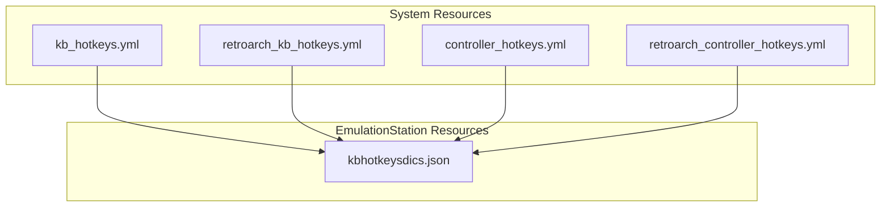
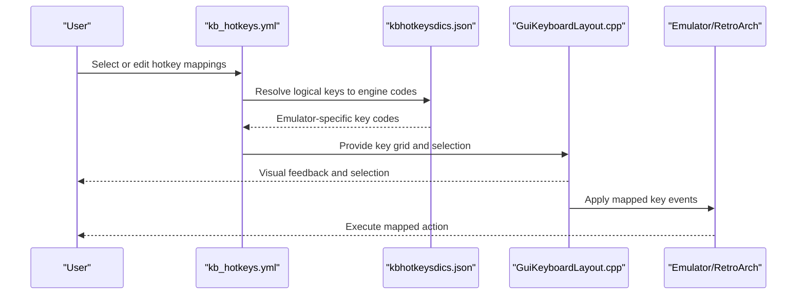
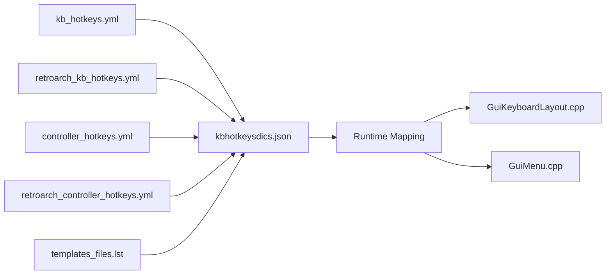

# Keyboard Shortcuts

<cite>
**Referenced Files in This Document**
- [kbhotkeysdics.json](file://emulationstation/resources/kbhotkeysdics.json)
- [kb_hotkeys.yml](file://system/resources/inputmapping/kb_hotkeys.yml)
- [retroarch_kb_hotkeys.yml](file://system/resources/inputmapping/retroarch_kb_hotkeys.yml)
- [controller_hotkeys.yml](file://system/resources/inputmapping/controller_hotkeys.yml)
- [retroarch_controller_hotkeys.yml](file://system/resources/inputmapping/retroarch_controller_hotkeys.yml)
- [GuiKeyboardLayout.cpp](file://emulationstation/.riescade/src/docs/es_src/guis/GuiKeyboardLayout.cpp)
- [GuiMenu.cpp](file://emulationstation/.riescade/src/docs/es_src/guis/GuiMenu.cpp)
- [KeyboardMapping.cpp](file://emulationstation/.riescade/src/docs/es_src/KeyboardMapping.cpp)
- [templates_files.lst](file://system/configgen/templates_files.lst)
</cite>

## Table of Contents
1. [Introduction](#introduction)
2. [Project Structure](#project-structure)
3. [Core Components](#core-components)
4. [Architecture Overview](#architecture-overview)
5. [Detailed Component Analysis](#detailed-component-analysis)
6. [Dependency Analysis](#dependency-analysis)
7. [Performance Considerations](#performance-considerations)
8. [Troubleshooting Guide](#troubleshooting-guide)
9. [Conclusion](#conclusion)

## Introduction
This document explains how keyboard shortcuts are configured and managed across the system. It covers:
- The kb_hotkeys.yml structure for defining keyboard-based hotkeys
- Key combination syntax and action assignments
- The kbhotkeysdics.json translation system for international keyboard layouts and locale-specific key mappings
- Supported key types (function keys, alphanumeric keys, special characters)
- Practical examples for emulator control, menu navigation, and system functions
- Keyboard layout detection, international key mapping support, and accessibility features
- Conflict resolution, modifier key handling, and platform-specific differences
- Troubleshooting guidance for detection and mapping issues

## Project Structure
The keyboard shortcut configuration spans two primary areas:
- Global hotkey definitions via YAML files under system/resources/inputmapping
- International key mapping dictionaries under emulationstation/resources

**Diagram sources**
- [kb_hotkeys.yml:1-34](file://system/resources/inputmapping/kb_hotkeys.yml#L1-L34)
- [retroarch_kb_hotkeys.yml:1-21](file://system/resources/inputmapping/retroarch_kb_hotkeys.yml#L1-L21)
- [controller_hotkeys.yml:1-38](file://system/resources/inputmapping/controller_hotkeys.yml#L1-L38)
- [retroarch_controller_hotkeys.yml:1-38](file://system/resources/inputmapping/retroarch_controller_hotkeys.yml#L1-L38)
- [kbhotkeysdics.json:1-100](file://emulationstation/resources/kbhotkeysdics.json#L1-L100)

**Section sources**
- [kb_hotkeys.yml:1-34](file://system/resources/inputmapping/kb_hotkeys.yml#L1-L34)
- [retroarch_kb_hotkeys.yml:1-21](file://system/resources/inputmapping/retroarch_kb_hotkeys.yml#L1-L21)
- [controller_hotkeys.yml:1-38](file://system/resources/inputmapping/controller_hotkeys.yml#L1-L38)
- [retroarch_controller_hotkeys.yml:1-38](file://system/resources/inputmapping/retroarch_controller_hotkeys.yml#L1-L38)
- [kbhotkeysdics.json:1-100](file://emulationstation/resources/kbhotkeysdics.json#L1-L100)

## Core Components
- kb_hotkeys.yml: Defines global keyboard hotkeys for multiple emulators. Supports per-emulator containers and a default fallback.
- retroarch_kb_hotkeys.yml: Defines RetroArch-specific keyboard hotkeys with per-core overrides.
- controller_hotkeys.yml and retroarch_controller_hotkeys.yml: Define controller-to-keyboard hotkey mappings for emulators and RetroArch cores.
- kbhotkeysdics.json: Provides internationalized key mappings for numerous emulators, translating logical key names to engine-specific identifiers.

These components work together to:
- Normalize hotkey actions across emulators
- Translate logical keys to engine-specific codes
- Support per-emulator and per-core customization

**Section sources**
- [kb_hotkeys.yml:1-34](file://system/resources/inputmapping/kb_hotkeys.yml#L1-L34)
- [retroarch_kb_hotkeys.yml:1-21](file://system/resources/inputmapping/retroarch_kb_hotkeys.yml#L1-L21)
- [controller_hotkeys.yml:1-38](file://system/resources/inputmapping/controller_hotkeys.yml#L1-L38)
- [retroarch_controller_hotkeys.yml:1-38](file://system/resources/inputmapping/retroarch_controller_hotkeys.yml#L1-L38)
- [kbhotkeysdics.json:1-100](file://emulationstation/resources/kbhotkeysdics.json#L1-L100)

## Architecture Overview
The keyboard shortcut pipeline:
- YAML files define logical hotkeys and target keys
- kbhotkeysdics.json translates logical keys to emulator-specific identifiers
- GUI and runtime components apply these mappings during operation

**Diagram sources**
- [kb_hotkeys.yml:1-34](file://system/resources/inputmapping/kb_hotkeys.yml#L1-L34)
- [kbhotkeysdics.json:1-100](file://emulationstation/resources/kbhotkeysdics.json#L1-L100)
- [GuiKeyboardLayout.cpp:1-295](file://emulationstation/.riescade/src/docs/es_src/guis/GuiKeyboardLayout.cpp#L1-L295)

## Detailed Component Analysis

### kb_hotkeys.yml
Purpose:
- Define default and per-emulator keyboard hotkeys
- Provide a fallback “default” container if a specific emulator container is missing

Key syntax:
- Container names match emulator/core names
- Keys are RetroArch-style hotkey names
- Values are logical key names (e.g., function keys, alphanumeric, punctuation, arrows, modifiers)

Common actions include:
- Menu toggle, fullscreen toggle, fast forward, rewind, frame advance
- Save/load state, state slot navigation
- Pause toggle, exit emulator
- Shader switching, screenshot capture
- Disk navigation and mouse grab toggle

Modifier handling:
- Logical keys include left/right variants for Shift/Ctrl/Alt
- The YAML does not encode combinations; combinations are handled by the runtime and mapping dictionaries

Practical example (conceptual):
- Set “input_menu_toggle” to “f1”
- Set “input_save_state” to “f2”
- Override per emulator by adding a container named after the emulator

**Section sources**
- [kb_hotkeys.yml:1-34](file://system/resources/inputmapping/kb_hotkeys.yml#L1-L34)

### retroarch_kb_hotkeys.yml
Purpose:
- Provide RetroArch-specific hotkeys with optional per-core overrides
- Mirrors the same container and key-value pattern as kb_hotkeys.yml

Typical entries:
- input_menu_toggle, input_save_state, input_load_state
- input_desktop_menu_toggle, input_state_slot_decrease/increase
- input_screenshot, input_rewind, input_hold_fast_forward
- Shader navigation and binding timeouts

Usage:
- Add a container named after a RetroArch core to override defaults for that core
- Leave the default container for global defaults

**Section sources**
- [retroarch_kb_hotkeys.yml:1-21](file://system/resources/inputmapping/retroarch_kb_hotkeys.yml#L1-L21)

### controller_hotkeys.yml and retroarch_controller_hotkeys.yml
Purpose:
- Map controller inputs (buttons, directions) to hotkeys
- Support per-emulator and per-core mappings
- Allow disabling hotkeys for single-button triggers via a flag

Key mapping:
- Controller inputs: a, b, x, y, l1/pageup, r1/pagedown, l2, r2, l3, r3, dpad directions
- Values: RetroArch hotkey names (e.g., menu_toggle, save_state, load_state)

Per-core containers:
- Add a container named after a core/emulator to tailor mappings
- Use a flag to disable hotkeys when using single-button shortcuts

**Section sources**
- [controller_hotkeys.yml:1-38](file://system/resources/inputmapping/controller_hotkeys.yml#L1-L38)
- [retroarch_controller_hotkeys.yml:1-38](file://system/resources/inputmapping/retroarch_controller_hotkeys.yml#L1-L38)

### kbhotkeysdics.json
Purpose:
- Provide internationalized key mappings for many emulators
- Translate logical key names to engine-specific identifiers

Structure:
- Top-level keys are emulator/core names
- Nested keys are logical key names (e.g., escape, f1, a, keypad1, up, shift)
- Values are engine-specific key codes or identifiers

Supported key types:
- Function keys: f1–f12, f13–f24 (where supported)
- Alphanumeric: a–z, 0–9
- Punctuation and symbols: dash, equals, leftbracket, rightbracket, backslash, semicolon, apostrophe, comma, period, slash
- Keypad equivalents: keypad1–keypad9, keypad0, point, enter, add, subtract, multiply, divide
- Navigation and editing: tab, return, space, backspace, insert, del/home/end, pageup/pagedown
- Locks and toggles: capslock, numlockclear, scroll_lock, printscreen, pause
- Arrows: up, down, left, right
- Modifiers: shift, rshift, ctrl, rctrl, alt, ralt

Examples of translations:
- Logical “f1” maps to engine-specific codes depending on emulator
- “keypad1” maps to numeric keypad identifiers
- “rctrl” maps to right-side Ctrl variants

**Section sources**
- [kbhotkeysdics.json:1-1844](file://emulationstation/resources/kbhotkeysdics.json#L1-L1844)

### Keyboard Layout Detection and Accessibility
- GUI keyboard layout selection:
  - Users can select a physical keyboard layout and variant
  - A helper script enumerates available variants for a given layout
  - Changes may require a reboot to take full effect

- On-screen keyboard grid:
  - A grid-based interface allows users to navigate and select keys
  - Directional navigation moves across rows and columns
  - Selection updates based on grid positions

- Accessibility:
  - Visual grid supports navigation without requiring precise key location
  - Reset and add-combination options assist in configuring keys

**Section sources**
- [GuiMenu.cpp:1381-1421](file://emulationstation/.riescade/src/docs/es_src/guis/GuiMenu.cpp#L1381-L1421)
- [GuiKeyboardLayout.cpp:1-295](file://emulationstation/.riescade/src/docs/es_src/guis/GuiKeyboardLayout.cpp#L1-L295)
- [KeyboardMapping.cpp:1-84](file://emulationstation/.riescade/src/docs/es_src/KeyboardMapping.cpp#L1-L84)

## Dependency Analysis
Relationships between configuration files and runtime components:

**Diagram sources**
- [kb_hotkeys.yml:1-34](file://system/resources/inputmapping/kb_hotkeys.yml#L1-L34)
- [retroarch_kb_hotkeys.yml:1-21](file://system/resources/inputmapping/retroarch_kb_hotkeys.yml#L1-L21)
- [controller_hotkeys.yml:1-38](file://system/resources/inputmapping/controller_hotkeys.yml#L1-L38)
- [retroarch_controller_hotkeys.yml:1-38](file://system/resources/inputmapping/retroarch_controller_hotkeys.yml#L1-L38)
- [kbhotkeysdics.json:1-100](file://emulationstation/resources/kbhotkeysdics.json#L1-L100)
- [GuiKeyboardLayout.cpp:1-295](file://emulationstation/.riescade/src/docs/es_src/guis/GuiKeyboardLayout.cpp#L1-L295)
- [GuiMenu.cpp:1381-1421](file://emulationstation/.riescade/src/docs/es_src/guis/GuiMenu.cpp#L1381-L1421)
- [templates_files.lst:56-56](file://system/configgen/templates_files.lst#L56-L56)

**Section sources**
- [kb_hotkeys.yml:1-34](file://system/resources/inputmapping/kb_hotkeys.yml#L1-L34)
- [retroarch_kb_hotkeys.yml:1-21](file://system/resources/inputmapping/retroarch_kb_hotkeys.yml#L1-L21)
- [controller_hotkeys.yml:1-38](file://system/resources/inputmapping/controller_hotkeys.yml#L1-L38)
- [retroarch_controller_hotkeys.yml:1-38](file://system/resources/inputmapping/retroarch_controller_hotkeys.yml#L1-L38)
- [kbhotkeysdics.json:1-100](file://emulationstation/resources/kbhotkeysdics.json#L1-L100)
- [GuiKeyboardLayout.cpp:1-295](file://emulationstation/.riescade/src/docs/es_src/guis/GuiKeyboardLayout.cpp#L1-L295)
- [GuiMenu.cpp:1381-1421](file://emulationstation/.riescade/src/docs/es_src/guis/GuiMenu.cpp#L1381-L1421)
- [templates_files.lst:56-56](file://system/configgen/templates_files.lst#L56-L56)

## Performance Considerations
- Dictionary lookups: Translating logical keys to engine-specific codes is O(1) per key via JSON lookup
- YAML parsing: Occurs at configuration time; minimal runtime overhead
- Grid navigation: Efficient row/column traversal in the GUI avoids expensive recalculations
- Recommendations:
  - Keep YAML containers concise and only override needed entries
  - Prefer default containers for shared defaults across emulators
  - Limit per-core overrides to essential changes

[No sources needed since this section provides general guidance]

## Troubleshooting Guide
Common issues and resolutions:

- Keyboard layout not detected or incorrect variant selected
  - Verify the selected layout and variant in the GUI
  - Some changes require a reboot to take effect
  - Use the helper script to enumerate available variants for a layout

- Key not recognized or not triggering the intended action
  - Confirm the logical key name matches the intended key (e.g., “f1”, “space”, “enter”)
  - Ensure the emulator/container is correctly named in the YAML
  - Check that the key is not mapped to another action elsewhere

- International layout mismatch
  - The kbhotkeysdics.json provides per-emulator mappings
  - If a key is missing or incorrect, verify the emulator’s entry and adjust accordingly

- Modifier key conflicts
  - Use distinct logical keys for left/right modifiers (e.g., “shift” vs “rshift”)
  - Avoid overlapping combinations that conflict with OS or window manager shortcuts

- Platform-specific differences
  - Some emulators represent keys differently (e.g., numeric keypad vs regular keys)
  - Consult the emulator’s entry in kbhotkeysdics.json for accurate mapping

- GUI navigation issues
  - Use directional navigation to move across the grid
  - Reset or add combination options can help reconfigure selections

**Section sources**
- [GuiMenu.cpp:1381-1421](file://emulationstation/.riescade/src/docs/es_src/guis/GuiMenu.cpp#L1381-L1421)
- [GuiKeyboardLayout.cpp:1-295](file://emulationstation/.riescade/src/docs/es_src/guis/GuiKeyboardLayout.cpp#L1-L295)
- [kbhotkeysdics.json:1-1844](file://emulationstation/resources/kbhotkeysdics.json#L1-L1844)

## Conclusion
The keyboard shortcut system combines YAML-based hotkey definitions with a robust international key mapping dictionary to deliver consistent, customizable controls across emulators and RetroArch. By leveraging per-emulator containers, logical key names, and GUI-driven configuration, users can tailor shortcuts to their workflow while accommodating diverse keyboard layouts and platforms.