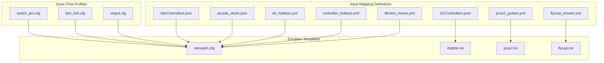
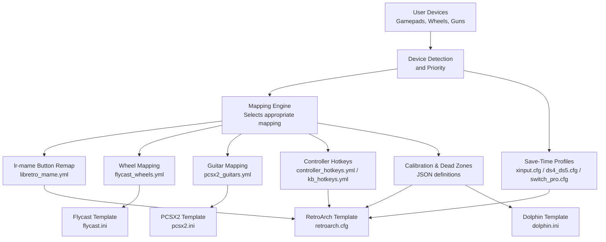
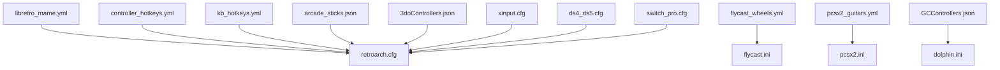

# Multi-Device Support

<cite>
**Referenced Files in This Document**
- [libretro_mame.yml](file://system/resources/inputmapping/libretro_mame.yml)
- [controller_hotkeys.yml](file://system/resources/inputmapping/controller_hotkeys.yml)
- [kb_hotkeys.yml](file://system/resources/inputmapping/kb_hotkeys.yml)
- [flycast_wheels.yml](file://system/resources/inputmapping/wheels/flycast_wheels.yml)
- [pcsx2_guitars.yml](file://system/resources/inputmapping/guitars/pcsx2_guitars.yml)
- [arcade_sticks.json](file://system/resources/inputmapping/arcade_sticks.json)
- [3doControllers.json](file://system/resources/inputmapping/3doControllers.json)
- [GCControllers.json](file://system/resources/inputmapping/GCControllers.json)
- [xinput.cfg](file://saves/hbmame/ctrlr/xinput.cfg)
- [ds4_ds5.cfg](file://saves/hbmame/ctrlr/ds4_ds5.cfg)
- [switch_pro.cfg](file://saves/hbmame/ctrlr/switch_pro.cfg)
- [retroarch.cfg](file://system/templates/retroarch/retroarch.cfg)
- [dolphin.ini](file://system/templates/dolphin-emu/User\Config/Dolphin.ini)
- [pcsx2.ini](file://system/templates/pcsx2/portable.ini)
- [flycast.ini](file://system/templates/flycast/emu.cfg)
</cite>

## Table of Contents
1. [Introduction](#introduction)
2. [Project Structure](#project-structure)
3. [Core Components](#core-components)
4. [Architecture Overview](#architecture-overview)
5. [Detailed Component Analysis](#detailed-component-analysis)
6. [Dependency Analysis](#dependency-analysis)
7. [Performance Considerations](#performance-considerations)
8. [Troubleshooting Guide](#troubleshooting-guide)
9. [Conclusion](#conclusion)

## Introduction
This document explains multi-device input support and configuration across the system. It covers simultaneous detection and management of mixed input devices (gamepads, keyboards, light guns), the lr-mame input mapping system for arcade controls, wheel configurations for racing games, and light gun setup procedures. It also documents device priority handling, input device switching, per-game device preferences, calibration and sensitivity adjustments, dead zone configuration, multi-player input scenarios, and input latency optimization. Finally, it provides troubleshooting guidance for device conflicts, input lag, and compatibility issues.

## Project Structure
The multi-device input system is organized around:
- Emulator-specific input mapping templates and configuration files
- Centralized input mapping definitions for controllers, wheels, and guitars
- Per-emulator configuration templates that define hotkeys, drivers, and device preferences
- Save-time controller profiles for specialized emulators

**Diagram sources**
- [libretro_mame.yml:1-3674](file://system/resources/inputmapping/libretro_mame.yml#L1-L3674)
- [controller_hotkeys.yml:1-38](file://system/resources/inputmapping/controller_hotkeys.yml#L1-L38)
- [kb_hotkeys.yml:1-34](file://system/resources/inputmapping/kb_hotkeys.yml#L1-L34)
- [flycast_wheels.yml:1-226](file://system/resources/inputmapping/wheels/flycast_wheels.yml#L1-L226)
- [pcsx2_guitars.yml:1-22](file://system/resources/inputmapping/guitars/pcsx2_guitars.yml#L1-L22)
- [arcade_sticks.json:1-49](file://system/resources/inputmapping/arcade_sticks.json#L1-L49)
- [3doControllers.json:1-696](file://system/resources/inputmapping/3doControllers.json#L1-L696)
- [GCControllers.json:1-101](file://system/resources/inputmapping/GCControllers.json#L1-L101)
- [retroarch.cfg](file://system/templates/retroarch/retroarch.cfg)
- [dolphin.ini](file://system/templates/dolphin-emu/User\Config/Dolphin.ini)
- [pcsx2.ini](file://system/templates/pcsx2/portable.ini)
- [flycast.ini](file://system/templates/flycast/emu.cfg)
- [xinput.cfg](file://saves/hbmame/ctrlr/xinput.cfg)
- [ds4_ds5.cfg](file://saves/hbmame/ctrlr/ds4_ds5.cfg)
- [switch_pro.cfg](file://saves/hbmame/ctrlr/switch_pro.cfg)

**Section sources**
- [libretro_mame.yml:1-3674](file://system/resources/inputmapping/libretro_mame.yml#L1-L3674)
- [controller_hotkeys.yml:1-38](file://system/resources/inputmapping/controller_hotkeys.yml#L1-L38)
- [kb_hotkeys.yml:1-34](file://system/resources/inputmapping/kb_hotkeys.yml#L1-L34)
- [flycast_wheels.yml:1-226](file://system/resources/inputmapping/wheels/flycast_wheels.yml#L1-L226)
- [pcsx2_guitars.yml:1-22](file://system/resources/inputmapping/guitars/pcsx2_guitars.yml#L1-L22)
- [arcade_sticks.json:1-49](file://system/resources/inputmapping/arcade_sticks.json#L1-L49)
- [3doControllers.json:1-696](file://system/resources/inputmapping/3doControllers.json#L1-L696)
- [GCControllers.json:1-101](file://system/resources/inputmapping/GCControllers.json#L1-L101)
- [xinput.cfg](file://saves/hbmame/ctrlr/xinput.cfg)
- [ds4_ds5.cfg](file://saves/hbmame/ctrlr/ds4_ds5.cfg)
- [switch_pro.cfg](file://saves/hbmame/ctrlr/switch_pro.cfg)
- [retroarch.cfg](file://system/templates/retroarch/retroarch.cfg)
- [dolphin.ini](file://system/templates/dolphin-emu/User\Config/Dolphin.ini)
- [pcsx2.ini](file://system/templates/pcsx2/portable.ini)
- [flycast.ini](file://system/templates/flycast/emu.cfg)

## Core Components
- lr-mame input mapping system: Defines per-game button remapping for MAME via the RetroArch core, enabling consistent arcade control layouts across titles.
- Wheel mapping system: Provides automatic mapping for racing wheels in Flycast with per-wheel type definitions, including steer, throttle, brake, paddleshift, triggers, and sticks.
- Light gun mapping: Supports light gun setups for compatible emulators and games via dedicated mapping entries and controller profiles.
- Controller hotkeys: Centralized YAML definitions for emulator hotkeys across controllers and keyboards, with per-core overrides.
- Device-specific calibration: JSON-based controller definitions include dead zones, thresholds, and calibration arrays for analog devices.
- Save-time profiles: Emulator-specific controller profiles applied at runtime for specialized controllers (e.g., HBMAME profiles).

**Section sources**
- [libretro_mame.yml:1-3674](file://system/resources/inputmapping/libretro_mame.yml#L1-L3674)
- [flycast_wheels.yml:1-226](file://system/resources/inputmapping/wheels/flycast_wheels.yml#L1-L226)
- [pcsx2_guitars.yml:1-22](file://system/resources/inputmapping/guitars/pcsx2_guitars.yml#L1-L22)
- [controller_hotkeys.yml:1-38](file://system/resources/inputmapping/controller_hotkeys.yml#L1-L38)
- [kb_hotkeys.yml:1-34](file://system/resources/inputmapping/kb_hotkeys.yml#L1-L34)
- [arcade_sticks.json:1-49](file://system/resources/inputmapping/arcade_sticks.json#L1-L49)
- [3doControllers.json:1-696](file://system/resources/inputmapping/3doControllers.json#L1-L696)
- [GCControllers.json:1-101](file://system/resources/inputmapping/GCControllers.json#L1-L101)
- [xinput.cfg](file://saves/hbmame/ctrlr/xinput.cfg)
- [ds4_ds5.cfg](file://saves/hbmame/ctrlr/ds4_ds5.cfg)
- [switch_pro.cfg](file://saves/hbmame/ctrlr/switch_pro.cfg)

## Architecture Overview
The multi-device input architecture integrates:
- Centralized mapping definitions for controllers, wheels, and guitars
- Emulator templates that consume these mappings and apply hotkeys and drivers
- Save-time profiles for specialized controllers
- Per-game lr-mame mappings for button remapping

**Diagram sources**
- [libretro_mame.yml:1-3674](file://system/resources/inputmapping/libretro_mame.yml#L1-L3674)
- [flycast_wheels.yml:1-226](file://system/resources/inputmapping/wheels/flycast_wheels.yml#L1-L226)
- [pcsx2_guitars.yml:1-22](file://system/resources/inputmapping/guitars/pcsx2_guitars.yml#L1-L22)
- [controller_hotkeys.yml:1-38](file://system/resources/inputmapping/controller_hotkeys.yml#L1-L38)
- [kb_hotkeys.yml:1-34](file://system/resources/inputmapping/kb_hotkeys.yml#L1-L34)
- [arcade_sticks.json:1-49](file://system/resources/inputmapping/arcade_sticks.json#L1-L49)
- [3doControllers.json:1-696](file://system/resources/inputmapping/3doControllers.json#L1-L696)
- [GCControllers.json:1-101](file://system/resources/inputmapping/GCControllers.json#L1-L101)
- [retroarch.cfg](file://system/templates/retroarch/retroarch.cfg)
- [dolphin.ini](file://system/templates/dolphin-emu/User\Config/Dolphin.ini)
- [pcsx2.ini](file://system/templates/pcsx2/portable.ini)
- [flycast.ini](file://system/templates/flycast/emu.cfg)
- [xinput.cfg](file://saves/hbmame/ctrlr/xinput.cfg)
- [ds4_ds5.cfg](file://saves/hbmame/ctrlr/ds4_ds5.cfg)
- [switch_pro.cfg](file://saves/hbmame/ctrlr/switch_pro.cfg)

## Detailed Component Analysis

### lr-MAME Input Mapping System
The lr-mame mapping system defines per-game button remappings for MAME when using the MAME core in RetroArch. It supports multiple layout variants and allows unsetting buttons for specific titles.

Key capabilities:
- Per-title button remapping using MAME core button IDs
- Multiple layout variants (default, modern8, 6alternative, 8alternative)
- Unmapping buttons by assigning special values
- Automatic generation of input remaps for RetroArch

Example usage:
- Select a game-specific container in the mapping file to apply its button layout
- Use variant suffixes to choose preferred button ordering
- Unset unused buttons to avoid conflicts

**Section sources**
- [libretro_mame.yml:1-3674](file://system/resources/inputmapping/libretro_mame.yml#L1-L3674)

### Wheel Configuration for Racing Games
The wheel mapping system provides automatic mapping for racing wheels in Flycast. Each wheel type includes:
- Driver selection (e.g., SDL)
- Exact device name recognition
- Steering, throttle, brake axes
- Button mappings for face buttons, triggers, and paddleshift
- Optional separate gear stick mappings
- Start/Select and stick press mappings

Examples:
- Logitech G29, G923 (PlayStation/Xbox variants), Driving Force GT, G920, G923X, Thrustmaster T300RS, Moza R5
- Per-wheeltypes, including paddleshift and trigger assignments

**Section sources**
- [flycast_wheels.yml:1-226](file://system/resources/inputmapping/wheels/flycast_wheels.yml#L1-L226)

### Light Gun Setup Procedures
Light gun support is integrated via:
- Dedicated mapping entries for compatible emulators
- Controller profiles that define input drivers and button mappings
- Emulator templates that enable light gun modes

Recommended steps:
- Select the appropriate gun profile in the mapping definitions
- Configure the emulator template to recognize the device
- Calibrate the gun surface and adjust sensitivity in the emulator settings

**Section sources**
- [pcsx2_guitars.yml:1-22](file://system/resources/inputmapping/guitars/pcsx2_guitars.yml#L1-L22)
- [pcsx2.ini](file://system/templates/pcsx2/portable.ini)

### Mixed Device Types: Gamepads + Keyboards + Light Guns
The system supports simultaneous detection and management of mixed device types:
- Controller hotkeys and keyboard hotkeys are centrally defined with per-core overrides
- Device priority and per-game preferences are handled by selecting appropriate mapping containers
- Emulator templates define hotkeys and driver preferences

Best practices:
- Use controller_hotkeys.yml to override default hotkeys per emulator/core
- Use kb_hotkeys.yml to customize keyboard shortcuts
- Apply per-game lr-mame mappings to ensure consistent button layouts

**Section sources**
- [controller_hotkeys.yml:1-38](file://system/resources/inputmapping/controller_hotkeys.yml#L1-L38)
- [kb_hotkeys.yml:1-34](file://system/resources/inputmapping/kb_hotkeys.yml#L1-L34)
- [libretro_mame.yml:1-3674](file://system/resources/inputmapping/libretro_mame.yml#L1-L3674)

### Device Priority Handling and Input Device Switching
Priority and switching are managed through:
- Centralized mapping selection by game/container
- Emulator templates that define hotkeys and driver preferences
- Save-time profiles for specialized controllers

Recommendations:
- Prefer explicit device GUIDs in mapping definitions for reliable selection
- Use per-emulator templates to enforce driver preferences
- Maintain separate save-time profiles for different controller families (e.g., XInput, DS4/DS5, Switch Pro)

**Section sources**
- [3doControllers.json:1-696](file://system/resources/inputmapping/3doControllers.json#L1-L696)
- [GCControllers.json:1-101](file://system/resources/inputmapping/GCControllers.json#L1-L101)
- [xinput.cfg](file://saves/hbmame/ctrlr/xinput.cfg)
- [ds4_ds5.cfg](file://saves/hbmame/ctrlr/ds4_ds5.cfg)
- [switch_pro.cfg](file://saves/hbmame/ctrlr/switch_pro.cfg)

### Per-Game Device Preferences
Per-game preferences are achieved by:
- Selecting the appropriate game container in lr-mame mappings
- Applying controller hotkey overrides via controller_hotkeys.yml
- Using keyboard hotkey overrides via kb_hotkeys.yml

Workflow:
- Choose the game-specific mapping container
- Adjust hotkeys for the chosen emulator/core
- Verify button layout and unmap unused buttons if needed

**Section sources**
- [libretro_mame.yml:1-3674](file://system/resources/inputmapping/libretro_mame.yml#L1-L3674)
- [controller_hotkeys.yml:1-38](file://system/resources/inputmapping/controller_hotkeys.yml#L1-L38)
- [kb_hotkeys.yml:1-34](file://system/resources/inputmapping/kb_hotkeys.yml#L1-L34)

### Complex Input Setups

#### Dual-Stick Controllers
- Use arcade_sticks.json as a reference for dual-analog stick layouts
- Map left/right sticks to movement and right stick to camera or secondary actions
- Configure hotkeys for menu and state management

**Section sources**
- [arcade_sticks.json:1-49](file://system/resources/inputmapping/arcade_sticks.json#L1-L49)

#### Steering Wheels with Pedals
- Select the appropriate wheel type in flycast_wheels.yml
- Assign steer, throttle, brake, paddleshift, and triggers
- Calibrate throttle/brake curves and adjust dead zones

**Section sources**
- [flycast_wheels.yml:1-226](file://system/resources/inputmapping/wheels/flycast_wheels.yml#L1-L226)

#### Light Gun Configurations
- Use pcsx2_guitars.yml to map gun buttons and whammy/tilt controls
- Enable light gun mode in the emulator template
- Calibrate gun sensitivity and surface alignment

**Section sources**
- [pcsx2_guitars.yml:1-22](file://system/resources/inputmapping/guitars/pcsx2_guitars.yml#L1-L22)
- [pcsx2.ini](file://system/templates/pcsx2/portable.ini)

### Device-Specific Calibration, Sensitivity, and Dead Zone Configuration
Calibration and sensitivity are defined in JSON controller mappings:
- Dead zones for analog sticks and triggers
- Thresholds for trigger activation
- Calibration arrays for precise analog behavior

Examples:
- GameCube controller mappings include main stick and C-stick calibration arrays, dead zones, and trigger thresholds
- 3DO controllers include driver-specific mappings and activation switches

**Section sources**
- [GCControllers.json:1-101](file://system/resources/inputmapping/GCControllers.json#L1-L101)
- [3doControllers.json:1-696](file://system/resources/inputmapping/3doControllers.json#L1-L696)

### Multi-Player Input Scenarios, Device Assignment, and Player Slots
Multi-player scenarios are supported by:
- Separate mapping containers for each player’s device family
- Emulator templates that define hotkeys and player slot assignments
- Save-time profiles for specialized controllers

Guidelines:
- Assign distinct device families per player (e.g., XInput vs. DS4/DS5)
- Use per-emulator templates to enforce driver preferences
- Maintain separate save-time profiles for each player’s controller

**Section sources**
- [3doControllers.json:1-696](file://system/resources/inputmapping/3doControllers.json#L1-L696)
- [GCControllers.json:1-101](file://system/resources/inputmapping/GCControllers.json#L1-L101)
- [xinput.cfg](file://saves/hbmame/ctrlr/xinput.cfg)
- [ds4_ds5.cfg](file://saves/hbmame/ctrlr/ds4_ds5.cfg)
- [switch_pro.cfg](file://saves/hbmame/ctrlr/switch_pro.cfg)

### Input Latency Optimization
Optimization strategies:
- Use SDL drivers where available for lower latency
- Reduce polling rates and enable native drivers
- Minimize unnecessary hotkeys and remaps
- Prefer direct USB connections over wireless adapters when possible

[No sources needed since this section provides general guidance]

## Dependency Analysis
The multi-device input system exhibits the following dependencies:
- lr-mame mappings depend on RetroArch templates for button remaps
- Wheel mappings depend on Flycast templates for axis/button assignments
- Guitar mappings depend on PCSX2 templates for input drivers and button mappings
- Controller hotkeys and keyboard hotkeys depend on emulator templates for hotkey execution
- Device calibration depends on JSON mapping definitions and emulator templates for applying settings

**Diagram sources**
- [libretro_mame.yml:1-3674](file://system/resources/inputmapping/libretro_mame.yml#L1-L3674)
- [flycast_wheels.yml:1-226](file://system/resources/inputmapping/wheels/flycast_wheels.yml#L1-L226)
- [pcsx2_guitars.yml:1-22](file://system/resources/inputmapping/guitars/pcsx2_guitars.yml#L1-L22)
- [controller_hotkeys.yml:1-38](file://system/resources/inputmapping/controller_hotkeys.yml#L1-L38)
- [kb_hotkeys.yml:1-34](file://system/resources/inputmapping/kb_hotkeys.yml#L1-L34)
- [arcade_sticks.json:1-49](file://system/resources/inputmapping/arcade_sticks.json#L1-L49)
- [3doControllers.json:1-696](file://system/resources/inputmapping/3doControllers.json#L1-L696)
- [GCControllers.json:1-101](file://system/resources/inputmapping/GCControllers.json#L1-L101)
- [retroarch.cfg](file://system/templates/retroarch/retroarch.cfg)
- [dolphin.ini](file://system/templates/dolphin-emu/User\Config/Dolphin.ini)
- [pcsx2.ini](file://system/templates/pcsx2/portable.ini)
- [flycast.ini](file://system/templates/flycast/emu.cfg)
- [xinput.cfg](file://saves/hbmame/ctrlr/xinput.cfg)
- [ds4_ds5.cfg](file://saves/hbmame/ctrlr/ds4_ds5.cfg)
- [switch_pro.cfg](file://saves/hbmame/ctrlr/switch_pro.cfg)

**Section sources**
- [libretro_mame.yml:1-3674](file://system/resources/inputmapping/libretro_mame.yml#L1-L3674)
- [flycast_wheels.yml:1-226](file://system/resources/inputmapping/wheels/flycast_wheels.yml#L1-L226)
- [pcsx2_guitars.yml:1-22](file://system/resources/inputmapping/guitars/pcsx2_guitars.yml#L1-L22)
- [controller_hotkeys.yml:1-38](file://system/resources/inputmapping/controller_hotkeys.yml#L1-L38)
- [kb_hotkeys.yml:1-34](file://system/resources/inputmapping/kb_hotkeys.yml#L1-L34)
- [arcade_sticks.json:1-49](file://system/resources/inputmapping/arcade_sticks.json#L1-L49)
- [3doControllers.json:1-696](file://system/resources/inputmapping/3doControllers.json#L1-L696)
- [GCControllers.json:1-101](file://system/resources/inputmapping/GCControllers.json#L1-L101)
- [retroarch.cfg](file://system/templates/retroarch/retroarch.cfg)
- [dolphin.ini](file://system/templates/dolphin-emu/User\Config/Dolphin.ini)
- [pcsx2.ini](file://system/templates/pcsx2/portable.ini)
- [flycast.ini](file://system/templates/flycast/emu.cfg)
- [xinput.cfg](file://saves/hbmame/ctrlr/xinput.cfg)
- [ds4_ds5.cfg](file://saves/hbmame/ctrlr/ds4_ds5.cfg)
- [switch_pro.cfg](file://saves/hbmame/ctrlr/switch_pro.cfg)

## Performance Considerations
- Prefer SDL drivers for lower latency when supported
- Minimize redundant remaps and hotkeys
- Use direct USB connections for controllers and guns
- Keep emulator templates optimized (disable unnecessary features)
- Calibrate dead zones and thresholds to reduce accidental inputs

[No sources needed since this section provides general guidance]

## Troubleshooting Guide
Common issues and resolutions:
- Device conflicts
  - Ensure unique GUIDs in mapping definitions
  - Use per-emulator templates to enforce driver preferences
  - Maintain separate save-time profiles for different controller families
- Input lag
  - Switch to SDL drivers where available
  - Reduce polling rates and disable unnecessary features
  - Prefer wired connections
- Compatibility problems with specialized controllers
  - Verify correct wheel type in flycast_wheels.yml
  - Confirm input driver matches the controller profile
  - Adjust hotkeys and remaps in controller_hotkeys.yml and kb_hotkeys.yml

**Section sources**
- [flycast_wheels.yml:1-226](file://system/resources/inputmapping/wheels/flycast_wheels.yml#L1-L226)
- [controller_hotkeys.yml:1-38](file://system/resources/inputmapping/controller_hotkeys.yml#L1-L38)
- [kb_hotkeys.yml:1-34](file://system/resources/inputmapping/kb_hotkeys.yml#L1-L34)
- [xinput.cfg](file://saves/hbmame/ctrlr/xinput.cfg)
- [ds4_ds5.cfg](file://saves/hbmame/ctrlr/ds4_ds5.cfg)
- [switch_pro.cfg](file://saves/hbmame/ctrlr/switch_pro.cfg)

## Conclusion
The multi-device input system provides robust support for mixed device types, lr-mame button remapping, wheel and light gun configurations, and per-game preferences. By leveraging centralized mapping definitions, emulator templates, and save-time profiles, users can achieve reliable multi-player setups with optimized latency and calibrated controls.