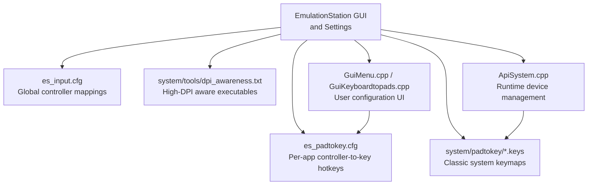
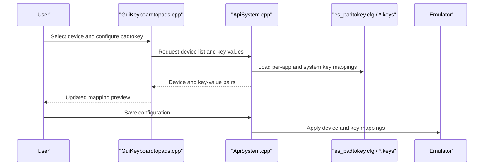
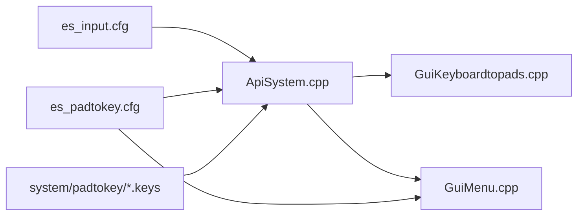

# Platform-Specific Input Handling

<cite>
**Referenced Files in This Document**
- [es_padtokey.cfg](file://emulationstation/.emulationstation/es_padtokey.cfg)
- [es_input.cfg](file://emulationstation/.emulationstation/es_input.cfg)
- [dpi_awareness.txt](file://system/tools/dpi_awareness.txt)
- [amiga1200.keys](file://system/padtokey/amiga1200.keys)
- [apple2.keys](file://system/padtokey/apple2.keys)
- [atarist.keys](file://system/padtokey/atarist.keys)
- [amstradcpc.keys](file://system/padtokey/amstradcpc.keys)
- [x68000.keys](file://system/padtokey/x68000.keys)
- [fmtowns.keys](file://system/padtokey/fmtowns.keys)
- [GuiMenu.cpp](file://emulationstation/.riescade/src/docs/es_src/guis/GuiMenu.cpp)
- [ApiSystem.cpp](file://emulationstation/.riescade/src/docs/es_src/ApiSystem.cpp)
- [GuiKeyboardtopads.cpp](file://emulationstation/.riescade/src/docs/es_src/guis/GuiKeyboardtopads.cpp)
- [dosbox-staging.conf](file://system/templates/dosbox-staging/dosbox-staging.conf)
- [es_settings.cfg](file://system/templates/emulationstation/es_settings.cfg)
</cite>

## Table of Contents
1. [Introduction](#introduction)
2. [Project Structure](#project-structure)
3. [Core Components](#core-components)
4. [Architecture Overview](#architecture-overview)
5. [Detailed Component Analysis](#detailed-component-analysis)
6. [Dependency Analysis](#dependency-analysis)
7. [Performance Considerations](#performance-considerations)
8. [Troubleshooting Guide](#troubleshooting-guide)
9. [Conclusion](#conclusion)

## Introduction
This document explains platform-specific input handling and legacy system compatibility in the repository. It focuses on:
- The padtokey system that translates modern controller inputs into classic computer keyboard equivalents for Amiga, Apple II, Atari ST, and PC-6000 series (FMTowns/X68000) systems.
- DPI awareness configuration for high-DPI displays and input scaling across different monitor setups.
- Platform-specific input quirks, timing considerations, and compatibility modes for authentic retro experiences.
- Practical examples for configuring inputs, converting keyboard mappings, and optimizing input latency.
- The relationship between input configuration and emulation accuracy, including timing-sensitive operations and keyboard-repeat behavior.
- Platform-specific troubleshooting for key repeat issues, timing problems, and compatibility limitations with modern input devices.

## Project Structure
The input handling ecosystem spans configuration files and runtime components:
- Global input mapping and hotkeys for emulators are defined in es_padtokey.cfg.
- Base input bindings for keyboard and multiple controllers are defined in es_input.cfg.
- Platform-specific key mappings for classic systems live under system/padtokey/*.keys.
- DPI-awareness hints for specific executables are defined in system/tools/dpi_awareness.txt.
- GUI and API components manage dynamic input configuration and device selection.

**Diagram sources**
- [es_padtokey.cfg:1-600](file://emulationstation/.emulationstation/es_padtokey.cfg#L1-L600)
- [es_input.cfg:1-161](file://emulationstation/.emulationstation/es_input.cfg#L1-L161)
- [amiga1200.keys:1-18](file://system/padtokey/amiga1200.keys#L1-L18)
- [apple2.keys:1-73](file://system/padtokey/apple2.keys#L1-L73)
- [atarist.keys:1-18](file://system/padtokey/atarist.keys#L1-L18)
- [amstradcpc.keys:1-14](file://system/padtokey/amstradcpc.keys#L1-L14)
- [x68000.keys:1-18](file://system/padtokey/x68000.keys#L1-L18)
- [fmtowns.keys:1-49](file://system/padtokey/fmtowns.keys#L1-L49)
- [dpi_awareness.txt:1-5](file://system/tools/dpi_awareness.txt#L1-L5)
- [ApiSystem.cpp:2757-2791](file://emulationstation/.riescade/src/docs/es_src/ApiSystem.cpp#L2757-L2791)
- [GuiMenu.cpp:4687-5072](file://emulationstation/.riescade/src/docs/es_src/guis/GuiMenu.cpp#L4687-L5072)
- [GuiKeyboardtopads.cpp:265-303](file://emulationstation/.riescade/src/docs/es_src/guis/GuiKeyboardtopads.cpp#L265-L303)

**Section sources**
- [es_padtokey.cfg:1-600](file://emulationstation/.emulationstation/es_padtokey.cfg#L1-L600)
- [es_input.cfg:1-161](file://emulationstation/.emulationstation/es_input.cfg#L1-L161)
- [dpi_awareness.txt:1-5](file://system/tools/dpi_awareness.txt#L1-L5)

## Core Components
- Padtokey per-app hotkeys: es_padtokey.cfg defines emulator-specific hotkeys and button remappings. These are used to convert controller inputs into actions recognized by individual emulators.
- Global input bindings: es_input.cfg maps generic controller buttons (a, b, x, y, start, select, directions, triggers) to keyboard keys or joystick axes/hats for all emulators.
- Classic system keymaps: system/padtokey/*.keys define how controller inputs are translated into system-specific keys for Amiga, Apple II, Atari ST, and FMTowns/X68000.
- DPI awareness: system/tools/dpi_awareness.txt lists executables that require DPI awareness adjustments for proper scaling on high-resolution displays.
- Runtime device management: ApiSystem.cpp handles device enumeration and applying per-device padtokey values. GuiMenu.cpp and GuiKeyboardtopads.cpp expose UI for selecting devices and configuring mappings.

**Section sources**
- [es_padtokey.cfg:1-600](file://emulationstation/.emulationstation/es_padtokey.cfg#L1-L600)
- [es_input.cfg:1-161](file://emulationstation/.emulationstation/es_input.cfg#L1-L161)
- [amiga1200.keys:1-18](file://system/padtokey/amiga1200.keys#L1-L18)
- [apple2.keys:1-73](file://system/padtokey/apple2.keys#L1-L73)
- [atarist.keys:1-18](file://system/padtokey/atarist.keys#L1-L18)
- [amstradcpc.keys:1-14](file://system/padtokey/amstradcpc.keys#L1-L14)
- [x68000.keys:1-18](file://system/padtokey/x68000.keys#L1-L18)
- [fmtowns.keys:1-49](file://system/padtokey/fmtowns.keys#L1-L49)
- [dpi_awareness.txt:1-5](file://system/tools/dpi_awareness.txt#L1-L5)
- [ApiSystem.cpp:2757-2791](file://emulationstation/.riescade/src/docs/es_src/ApiSystem.cpp#L2757-L2791)
- [GuiMenu.cpp:4687-5072](file://emulationstation/.riescade/src/docs/es_src/guis/GuiMenu.cpp#L4687-L5072)
- [GuiKeyboardtopads.cpp:265-303](file://emulationstation/.riescade/src/docs/es_src/guis/GuiKeyboardtopads.cpp#L265-L303)

## Architecture Overview
The padtokey pipeline converts controller inputs to system-specific keys and hotkeys:
- Users configure global mappings in es_input.cfg and per-app hotkeys in es_padtokey.cfg.
- For classic systems, system/padtokey/*.keys define the target keys for each trigger/action.
- ApiSystem.cpp enumerates devices and applies configured values to the runtime.
- GuiMenu.cpp and GuiKeyboardtopads.cpp provide UI to select devices and update mappings.

**Diagram sources**
- [GuiKeyboardtopads.cpp:265-303](file://emulationstation/.riescade/src/docs/es_src/guis/GuiKeyboardtopads.cpp#L265-L303)
- [ApiSystem.cpp:2757-2791](file://emulationstation/.riescade/src/docs/es_src/ApiSystem.cpp#L2757-L2791)
- [es_padtokey.cfg:1-600](file://emulationstation/.emulationstation/es_padtokey.cfg#L1-L600)
- [amiga1200.keys:1-18](file://system/padtokey/amiga1200.keys#L1-L18)
- [apple2.keys:1-73](file://system/padtokey/apple2.keys#L1-L73)
- [atarist.keys:1-18](file://system/padtokey/atarist.keys#L1-L18)
- [fmtowns.keys:1-49](file://system/padtokey/fmtowns.keys#L1-L49)

## Detailed Component Analysis

### Padtokey System: Controller-to-Key Translation
The padtokey system enables authentic input behavior for classic systems by translating modern controller inputs into system-specific keys. It supports:
- Per-emulator hotkeys via es_padtokey.cfg.
- System-specific keymaps via system/padtokey/*.keys.
- Runtime device management via ApiSystem.cpp and UI via GuiMenu.cpp and GuiKeyboardtopads.cpp.

Key behaviors:
- Trigger mapping: Each controller action (e.g., “start”, “up”, “a”, “b”) maps to a target key or mouse movement.
- Mouse emulation: Some systems map analog sticks or secondary sticks to mouse movement for pointer-driven inputs.
- Button mapping: D-pad, face buttons, and shoulder buttons map to keyboard keys or emulator hotkeys.

Examples of mappings:
- Amiga 1200: Left stick click and right stick click map to specific mouse buttons; secondary stick maps to mouse movement.
- Apple II: Start maps to Enter; directional pad maps to numeric keypad arrows; A/B map to Alt and Keypad 0; joystick1 directions mirror keypad arrows; X/Y map to mouse buttons.
- Atari ST: Left/right stick clicks map to mouse buttons; secondary stick maps to mouse movement.
- FMTowns/X68000: Directional pad and face buttons map to arrow keys and letter keys; Start maps to a specific key.
- Amstrad CPC: Directional pad maps to Up/Down keys.

Practical configuration tips:
- Use es_input.cfg to establish baseline controller-to-key mappings for your keyboard and primary controller.
- Override emulator-specific hotkeys in es_padtokey.cfg for accurate menu navigation and hotkeys.
- For classic systems, ensure system/padtokey/*.keys align with the emulator’s expected input model (keyboard vs. mouse).

**Section sources**
- [es_padtokey.cfg:1-600](file://emulationstation/.emulationstation/es_padtokey.cfg#L1-L600)
- [es_input.cfg:1-161](file://emulationstation/.emulationstation/es_input.cfg#L1-L161)
- [amiga1200.keys:1-18](file://system/padtokey/amiga1200.keys#L1-L18)
- [apple2.keys:1-73](file://system/padtokey/apple2.keys#L1-L73)
- [atarist.keys:1-18](file://system/padtokey/atarist.keys#L1-L18)
- [amstradcpc.keys:1-14](file://system/padtokey/amstradcpc.keys#L1-L14)
- [x68000.keys:1-18](file://system/padtokey/x68000.keys#L1-L18)
- [fmtowns.keys:1-49](file://system/padtokey/fmtowns.keys#L1-L49)
- [ApiSystem.cpp:2757-2791](file://emulationstation/.riescade/src/docs/es_src/ApiSystem.cpp#L2757-L2791)
- [GuiMenu.cpp:4687-5072](file://emulationstation/.riescade/src/docs/es_src/guis/GuiMenu.cpp#L4687-L5072)
- [GuiKeyboardtopads.cpp:265-303](file://emulationstation/.riescade/src/docs/es_src/guis/GuiKeyboardtopads.cpp#L265-L303)

### DPI Awareness and Input Scaling
DPI awareness ensures that UI and input areas remain usable on high-resolution displays:
- Executables listed in system/tools/dpi_awareness.txt are treated as DPI-aware, preventing incorrect scaling behavior.
- For CRT and NTSC-style rendering, viewport sizing and integer scaling can emulate vintage display characteristics. The dosbox-staging configuration comments describe viewport sizing and relative scaling modes that emulate CRT stretch controls.

Recommendations:
- Add emulators that exhibit scaling issues to dpi_awareness.txt to improve input responsiveness and UI layout.
- When using CRT shaders or NTSC effects, adjust viewport sizing and integer scaling to match the intended aspect ratio and emulate vintage display stretch controls.

**Section sources**
- [dpi_awareness.txt:1-5](file://system/tools/dpi_awareness.txt#L1-L5)
- [dosbox-staging.conf:405-420](file://system/templates/dosbox-staging/dosbox-staging.conf#L405-L420)

### Platform-Specific Input Quirks and Compatibility Modes
Classic systems often require specific input quirks:
- Apple II: Uses numeric keypad for directional input and special keys for A/B. Ensure keypad lock is off and numeric keypad is enabled.
- Atari ST: Relies on mouse emulation for pointer-driven menus and games.
- Amiga: Uses mouse buttons for certain actions; ensure mouse acceleration and sensitivity are tuned for precise input.
- FMTowns/X68000: Face buttons and directional pad map to keyboard letters and arrows; Start maps to a specific key.
- Amstrad CPC: Directional pad maps to Up/Down; ensure the emulator recognizes these keys.

Compatibility modes:
- Use es_padtokey.cfg to override default hotkeys for emulators that differ from the global mappings.
- For systems requiring mouse movement, ensure the system/padtokey/*.keys file includes “mouse” type mappings for the secondary stick.

**Section sources**
- [apple2.keys:1-73](file://system/padtokey/apple2.keys#L1-L73)
- [atarist.keys:1-18](file://system/padtokey/atarist.keys#L1-L18)
- [amiga1200.keys:1-18](file://system/padtokey/amiga1200.keys#L1-L18)
- [fmtowns.keys:1-49](file://system/padtokey/fmtowns.keys#L1-L49)
- [amstradcpc.keys:1-14](file://system/padtokey/amstradcpc.keys#L1-L14)
- [es_padtokey.cfg:1-600](file://emulationstation/.emulationstation/es_padtokey.cfg#L1-L600)

### Timing Considerations and Keyboard Repeat Behavior
Timing-sensitive operations and keyboard repeat behavior impact authenticity:
- Many classic systems rely on precise timing for input polling and keyboard repeat. Excessive repeat rates or delayed repeats can alter gameplay.
- CRT and NTSC shader configurations can influence perceived timing; ensure viewport and scaling match the original display characteristics.
- For systems that expect mouse movement, ensure the secondary stick mapping is active and responsive.

Optimization tips:
- Disable or reduce keyboard repeat rate in the OS when testing timing-sensitive games.
- Match CRT/NTSC shader parameters to approximate original refresh rates and scanline timing.
- Verify that padtokey mappings do not introduce unintended delays (e.g., unnecessary modifier combinations).

**Section sources**
- [dosbox-staging.conf:405-420](file://system/templates/dosbox-staging/dosbox-staging.conf#L405-L420)

### Practical Examples

#### Example 1: Configure Apple II Inputs
- Set baseline controller-to-key mappings in es_input.cfg for your keyboard.
- Confirm Apple II mappings in system/padtokey/apple2.keys: Start to Enter, directional pad to keypad arrows, A to LeftAlt, B to Keypad 0, X/Y to mouse buttons.
- Use es_padtokey.cfg to override emulator hotkeys if needed.

**Section sources**
- [es_input.cfg:1-161](file://emulationstation/.emulationstation/es_input.cfg#L1-L161)
- [apple2.keys:1-73](file://system/padtokey/apple2.keys#L1-L73)
- [es_padtokey.cfg:1-600](file://emulationstation/.emulationstation/es_padtokey.cfg#L1-L600)

#### Example 2: Configure Amiga Inputs
- Use system/padtokey/amiga1200.keys to map L3/R3 to mouse buttons and the secondary stick to mouse movement.
- Adjust es_padtokey.cfg for emulator-specific hotkeys.

**Section sources**
- [amiga1200.keys:1-18](file://system/padtokey/amiga1200.keys#L1-L18)
- [es_padtokey.cfg:1-600](file://emulationstation/.emulationstation/es_padtokey.cfg#L1-L600)

#### Example 3: Configure Atari ST Inputs
- Map L3/R3 to mouse buttons and secondary stick to mouse movement via system/padtokey/atarist.keys.
- Override hotkeys in es_padtokey.cfg if the emulator expects different keys.

**Section sources**
- [atarist.keys:1-18](file://system/padtokey/atarist.keys#L1-L18)
- [es_padtokey.cfg:1-600](file://emulationstation/.emulationstation/es_padtokey.cfg#L1-L600)

#### Example 4: Configure FMTowns/X68000 Inputs
- Map directional pad and face buttons to arrow keys and letter keys per system/padtokey/fmtowns.keys.
- Use es_padtokey.cfg for emulator hotkeys.

**Section sources**
- [fmtowns.keys:1-49](file://system/padtokey/fmtowns.keys#L1-L49)
- [es_padtokey.cfg:1-600](file://emulationstation/.emulationstation/es_padtokey.cfg#L1-L600)

#### Example 5: Configure Amstrad CPC Inputs
- Map directional pad to Up/Down using system/padtokey/amstradcpc.keys.
- Ensure the emulator recognizes these keys.

**Section sources**
- [amstradcpc.keys:1-14](file://system/padtokey/amstradcpc.keys#L1-L14)

### Relationship Between Input Configuration and Emulation Accuracy
Accurate input configuration improves emulation fidelity:
- Correct mapping of directional inputs, face buttons, and hotkeys prevents misreads during timing-sensitive sequences.
- Mouse-based inputs (e.g., Atari ST, Amiga) must be mapped precisely to avoid cursor drift or missed inputs.
- CRT/NTSC shader parameters and viewport sizing affect perceived timing; align them with original hardware behavior.

**Section sources**
- [GuiMenu.cpp:4687-5072](file://emulationstation/.riescade/src/docs/es_src/guis/GuiMenu.cpp#L4687-L5072)
- [dosbox-staging.conf:405-420](file://system/templates/dosbox-staging/dosbox-staging.conf#L405-L420)

## Dependency Analysis
The padtokey system depends on:
- es_input.cfg for baseline controller-to-key mappings.
- es_padtokey.cfg for emulator-specific overrides.
- system/padtokey/*.keys for classic system keymaps.
- ApiSystem.cpp for runtime device enumeration and applying values.
- GuiKeyboardtopads.cpp and GuiMenu.cpp for user configuration and device selection.

**Diagram sources**
- [es_input.cfg:1-161](file://emulationstation/.emulationstation/es_input.cfg#L1-L161)
- [es_padtokey.cfg:1-600](file://emulationstation/.emulationstation/es_padtokey.cfg#L1-L600)
- [amiga1200.keys:1-18](file://system/padtokey/amiga1200.keys#L1-L18)
- [ApiSystem.cpp:2757-2791](file://emulationstation/.riescade/src/docs/es_src/ApiSystem.cpp#L2757-L2791)
- [GuiKeyboardtopads.cpp:265-303](file://emulationstation/.riescade/src/docs/es_src/guis/GuiKeyboardtopads.cpp#L265-L303)
- [GuiMenu.cpp:4687-5072](file://emulationstation/.riescade/src/docs/es_src/guis/GuiMenu.cpp#L4687-L5072)

**Section sources**
- [es_input.cfg:1-161](file://emulationstation/.emulationstation/es_input.cfg#L1-L161)
- [es_padtokey.cfg:1-600](file://emulationstation/.emulationstation/es_padtokey.cfg#L1-L600)
- [amiga1200.keys:1-18](file://system/padtokey/amiga1200.keys#L1-L18)
- [ApiSystem.cpp:2757-2791](file://emulationstation/.riescade/src/docs/es_src/ApiSystem.cpp#L2757-L2791)
- [GuiKeyboardtopads.cpp:265-303](file://emulationstation/.riescade/src/docs/es_src/guis/GuiKeyboardtopads.cpp#L265-L303)
- [GuiMenu.cpp:4687-5072](file://emulationstation/.riescade/src/docs/es_src/guis/GuiMenu.cpp#L4687-L5072)

## Performance Considerations
- Minimize unnecessary modifier keys in mappings to reduce input latency.
- Keep padtokey configurations concise and aligned with the emulator’s input model to avoid extra translation overhead.
- On high-DPI displays, enable DPI awareness for problematic emulators to prevent scaling-induced input misalignment.

[No sources needed since this section provides general guidance]

## Troubleshooting Guide
Common issues and resolutions:
- Key repeat problems: Disable OS-level keyboard repeat or adjust repeat delay/rate; verify repeat behavior in es_padtokey.cfg and system/padtokey/*.keys.
- Timing problems: Align CRT/NTSC shader parameters and viewport sizing with original hardware; test with minimal input mappings.
- Compatibility limitations: Add emulators to dpi_awareness.txt if UI/input scaling behaves incorrectly on high-DPI displays.
- Device selection: Use GuiKeyboardtopads.cpp and GuiMenu.cpp to reconfigure devices and apply new padtokey values via ApiSystem.cpp.

**Section sources**
- [GuiKeyboardtopads.cpp:265-303](file://emulationstation/.riescade/src/docs/es_src/guis/GuiKeyboardtopads.cpp#L265-L303)
- [GuiMenu.cpp:4687-5072](file://emulationstation/.riescade/src/docs/es_src/guis/GuiMenu.cpp#L4687-L5072)
- [ApiSystem.cpp:2757-2791](file://emulationstation/.riescade/src/docs/es_src/ApiSystem.cpp#L2757-L2791)
- [dpi_awareness.txt:1-5](file://system/tools/dpi_awareness.txt#L1-L5)

## Conclusion
The padtokey system, combined with global input mappings and DPI awareness, provides a robust framework for authentic platform-specific input handling. By aligning controller mappings with classic system expectations, carefully managing timing and repeat behavior, and leveraging UI tools for device configuration, users can achieve high-fidelity emulation across diverse platforms and display environments.