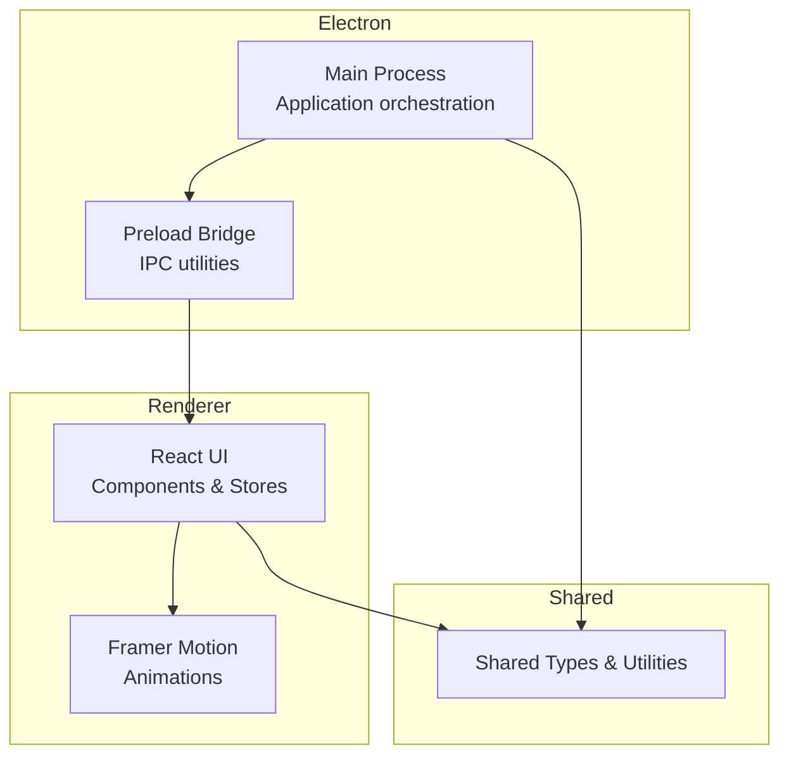
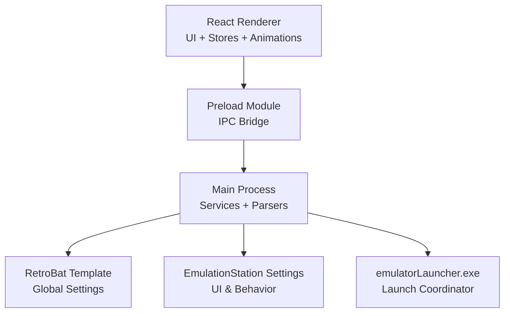
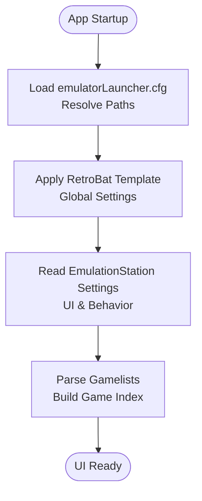
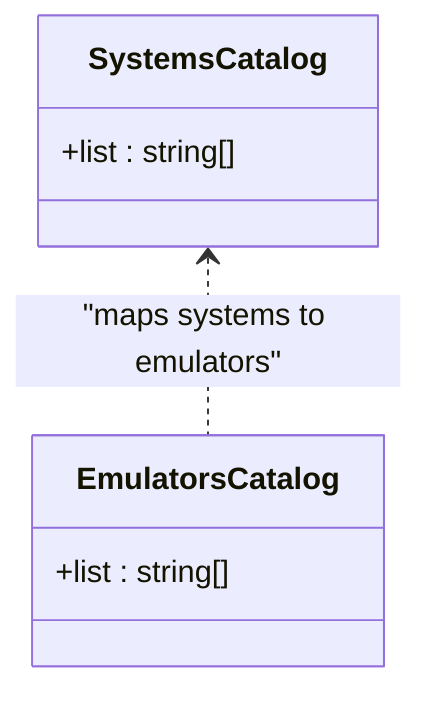
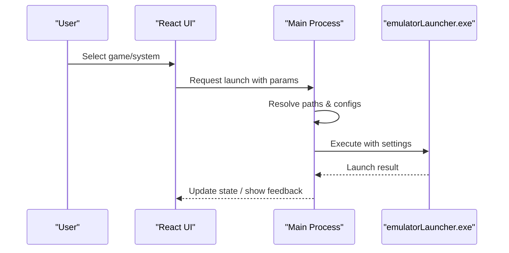
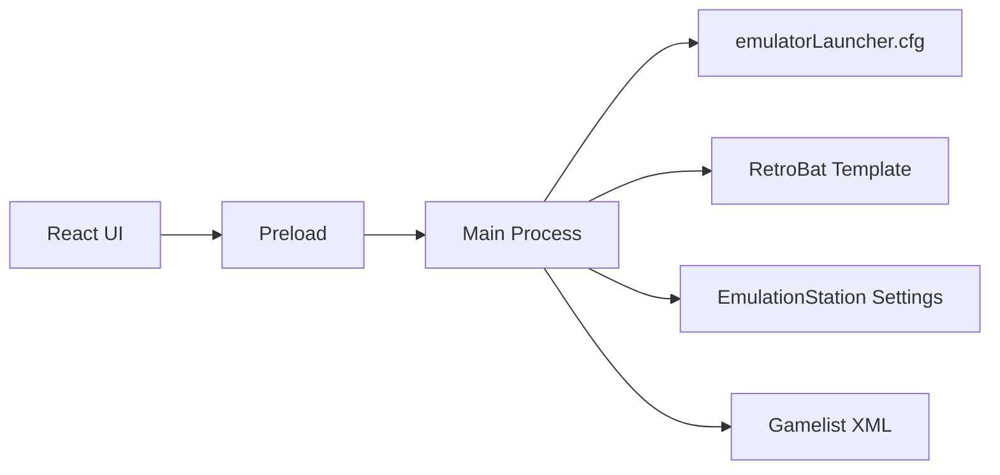

# Project Overview

<cite>
**Referenced Files in This Document**
- [README.md](file://README.md)
- [emulatorLauncher.cfg](file://emulationstation/emulatorLauncher.cfg)
- [systems_names.lst](file://system/configgen/systems_names.lst)
- [emulators_names.lst](file://system/configgen/emulators_names.lst)
- [retrobat_template.ini](file://system/resources/retrobat_template.ini)
- [es_settings.cfg](file://system/templates/emulationstation/es_settings.cfg)
- [kbhotkeysdics.json](file://system/templates/emulationstation/kbhotkeysdics.json)
- [gamelist.xml](file://system/es_menu/gamelist.xml)
</cite>

## Table of Contents
1. [Introduction](#introduction)
2. [Project Structure](#project-structure)
3. [Core Components](#core-components)
4. [Architecture Overview](#architecture-overview)
5. [Detailed Component Analysis](#detailed-component-analysis)
6. [Dependency Analysis](#dependency-analysis)
7. [Performance Considerations](#performance-considerations)
8. [Troubleshooting Guide](#troubleshooting-guide)
9. [Conclusion](#conclusion)

## Introduction
RIESCADE_SYSTEM is a modern, high-performance frontend for EmulationStation/RetroBat, built with Electron, React, and TypeScript. Its primary goal is to unify the management of 200+ emulators across 240+ gaming systems into a cohesive, visually engaging interface. The project emphasizes:
- Compatibility with RetroBat/EmulationStation configurations and gamelists
- A smooth, animated UI powered by Framer Motion
- An SQLite-ready architecture for fast game indexing and navigation
- Seamless integration with emulatorLauncher.exe for launching titles

This overview targets both newcomers and experienced developers, offering conceptual explanations and technical insights aligned with the codebase’s terminology and structure.

## Project Structure
RIESCADE_SYSTEM organizes its codebase into clear layers:
- Electron main process: orchestrates application lifecycle, parses configuration files, and coordinates backend services
- React renderer: renders the UI, manages state, and applies animations via Framer Motion
- Shared types and utilities: common interfaces and helpers used across main and renderer
- Preload scripts: secure IPC bridge enabling controlled communication between renderer and main

The application is designed to reside within the EmulationStation folder of a RetroBat installation, resolving paths relative to its location to access ROMs, BIOS, saves, shaders, and decorations.

**Section sources**
- [README.md:34-44](file://README.md#L34-L44)

## Core Components
RIESCADE_SYSTEM’s core capabilities are grounded in three pillars:
- Unified emulator and system catalog: maintains lists of supported emulators and systems to drive the UI and launch logic
- Configuration and gamelist compatibility: reads and interprets RetroBat/EmulationStation settings and gamelists
- Launch pipeline integration: coordinates with emulatorLauncher.exe to run titles with appropriate configurations

Key implementation elements:
- Systems and emulators catalogs define supported platforms and cores
- RetroBat template and EmulationStation settings govern UI behavior and resource paths
- Gamelists provide metadata and game discovery

Practical example: The system supports 240+ gaming systems and 200+ emulators, enabling a single interface to manage ROMs, BIOS, saves, and shaders across diverse platforms.

**Section sources**
- [systems_names.lst:1-241](file://system/configgen/systems_names.lst#L1-L241)
- [emulators_names.lst:1-130](file://system/configgen/emulators_names.lst#L1-L130)
- [README.md:5-11](file://README.md#L5-L11)

## Architecture Overview
RIESCADE_SYSTEM combines a modern frontend with a robust configuration and launch pipeline:
- Electron main process handles file system access, configuration parsing, and inter-process coordination
- React renderer delivers a responsive UI with animations and state-driven views
- Shared modules standardize types and utilities across the app
- Preload scripts expose safe APIs for renderer-to-main communication

**Diagram sources**
- [README.md:36-39](file://README.md#L36-L39)
- [retrobat_template.ini:1-91](file://system/resources/retrobat_template.ini#L1-L91)
- [es_settings.cfg](file://system/templates/emulationstation/es_settings.cfg)

**Section sources**
- [README.md:36-39](file://README.md#L36-L39)

## Detailed Component Analysis

### Configuration and Gamelist Compatibility
RIESCADE_SYSTEM aligns closely with RetroBat and EmulationStation:
- Paths for BIOS, saves, screenshots, shaders, decorations, and RetroAchievement sounds are defined in the EmulationStation launcher configuration
- RetroBat global settings control interface behavior, fullscreen modes, monitors, and performance options
- EmulationStation settings define UI preferences and keyboard hotkeys dictionaries
- Gamelists provide structured metadata for discovered games

**Diagram sources**
- [emulatorLauncher.cfg:1-12](file://emulationstation/emulatorLauncher.cfg#L1-L12)
- [retrobat_template.ini:49-91](file://system/resources/retrobat_template.ini#L49-L91)
- [es_settings.cfg](file://system/templates/emulationstation/es_settings.cfg)
- [gamelist.xml](file://system/es_menu/gamelist.xml)

**Section sources**
- [emulatorLauncher.cfg:1-12](file://emulationstation/emulatorLauncher.cfg#L1-L12)
- [retrobat_template.ini:1-91](file://system/resources/retrobat_template.ini#L1-L91)
- [es_settings.cfg](file://system/templates/emulationstation/es_settings.cfg)
- [gamelist.xml](file://system/es_menu/gamelist.xml)

### Systems and Emulators Catalogs
RIESCADE_SYSTEM leverages curated lists to support a broad ecosystem:
- Systems catalog enumerates supported platforms (e.g., NES, Genesis, PlayStation)
- Emulators catalog enumerates supported cores and applications (e.g., RetroArch, MAME, DuckStation)

These catalogs enable dynamic UI generation, filtering, and launch routing.

**Diagram sources**
- [systems_names.lst:1-241](file://system/configgen/systems_names.lst#L1-L241)
- [emulators_names.lst:1-130](file://system/configgen/emulators_names.lst#L1-L130)

**Section sources**
- [systems_names.lst:1-241](file://system/configgen/systems_names.lst#L1-L241)
- [emulators_names.lst:1-130](file://system/configgen/emulators_names.lst#L1-L130)

### Launch Pipeline Integration
RIESCADE_SYSTEM integrates with emulatorLauncher.exe to run titles:
- Reads and validates emulator-specific configurations
- Resolves paths for BIOS, saves, shaders, and decorations
- Applies RetroBat and EmulationStation settings during launch
- Supports keyboard and controller hotkeys via EmulationStation dictionaries

**Diagram sources**
- [README.md:10](file://README.md#L10)
- [emulatorLauncher.cfg:1-12](file://emulationstation/emulatorLauncher.cfg#L1-L12)
- [kbhotkeysdics.json](file://system/templates/emulationstation/kbhotkeysdics.json)

**Section sources**
- [README.md:10](file://README.md#L10)
- [emulatorLauncher.cfg:1-12](file://emulationstation/emulatorLauncher.cfg#L1-L12)
- [kbhotkeysdics.json](file://system/templates/emulationstation/kbhotkeysdics.json)

## Dependency Analysis
RIESCADE_SYSTEM depends on:
- Electron main process for OS-level operations and IPC
- React renderer for UI composition and animation
- Shared utilities for type safety and cross-module reuse
- Preload bridge for secure renderer-to-main communication
- Configuration files for path resolution and behavior control

**Diagram sources**
- [README.md:36-39](file://README.md#L36-L39)
- [emulatorLauncher.cfg:1-12](file://emulationstation/emulatorLauncher.cfg#L1-L12)
- [retrobat_template.ini:1-91](file://system/resources/retrobat_template.ini#L1-L91)
- [es_settings.cfg](file://system/templates/emulationstation/es_settings.cfg)
- [gamelist.xml](file://system/es_menu/gamelist.xml)

**Section sources**
- [README.md:36-39](file://README.md#L36-L39)
- [emulatorLauncher.cfg:1-12](file://emulationstation/emulatorLauncher.cfg#L1-L12)
- [retrobat_template.ini:1-91](file://system/resources/retrobat_template.ini#L1-L91)
- [es_settings.cfg](file://system/templates/emulationstation/es_settings.cfg)
- [gamelist.xml](file://system/es_menu/gamelist.xml)

## Performance Considerations
RIESCADE_SYSTEM emphasizes performance and responsiveness:
- High-performance UI with Framer Motion animations ensures smooth interactions
- SQLite-ready architecture enables fast indexing and querying of large game libraries
- Relative path resolution minimizes IO overhead and simplifies deployment
- Configuration-driven behavior allows tuning for older GPUs and varied hardware

Practical tips:
- Prefer indexed queries for large gamelists
- Batch updates to UI state to reduce re-renders
- Cache resolved paths and frequently accessed settings

**Section sources**
- [README.md:8-11](file://README.md#L8-L11)

## Troubleshooting Guide
Common issues and resolutions:
- Path resolution errors: Verify emulatorLauncher.cfg paths for BIOS, saves, shaders, and decorations
- UI behavior mismatches: Confirm RetroBat template and EmulationStation settings align with expectations
- Keyboard/controller conflicts: Review EmulationStation keyboard hotkeys dictionary and RetroBat controller mappings
- Missing games in gamelists: Ensure gamelist.xml is present and formatted correctly

Checklist:
- Confirm emulatorLauncher.cfg exists and paths are correct
- Validate RetroBat template settings for fullscreen, monitor, and performance
- Rebuild or refresh gamelists if new ROMs are not appearing
- Test launch pipeline with emulatorLauncher.exe

**Section sources**
- [emulatorLauncher.cfg:1-12](file://emulationstation/emulatorLauncher.cfg#L1-L12)
- [retrobat_template.ini:49-91](file://system/resources/retrobat_template.ini#L49-L91)
- [es_settings.cfg](file://system/templates/emulationstation/es_settings.cfg)
- [gamelist.xml](file://system/es_menu/gamelist.xml)

## Conclusion
RIESCADE_SYSTEM delivers a modern, efficient frontend for EmulationStation/RetroBat by combining a polished React UI with a robust Electron architecture. Its compatibility with existing configurations and gamelists, plus its integration with emulatorLauncher.exe, makes it a practical choice for managing a vast retro gaming ecosystem. The SQLite-ready design and Framer Motion animations further enhance usability and performance, supporting both casual users and advanced developers.