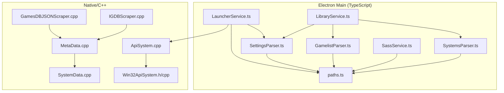
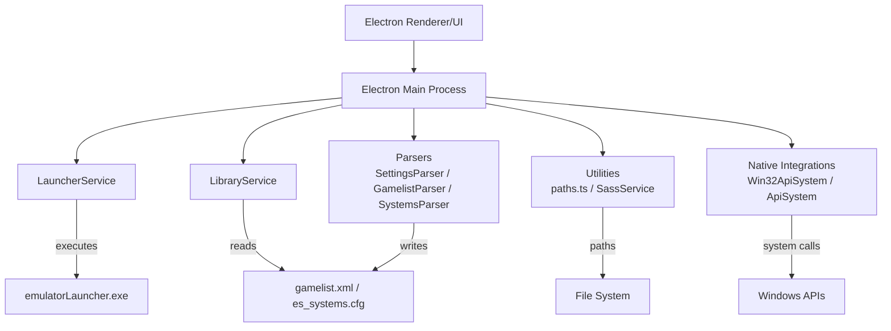
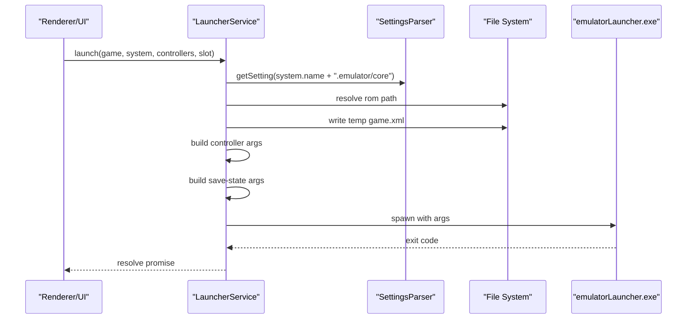
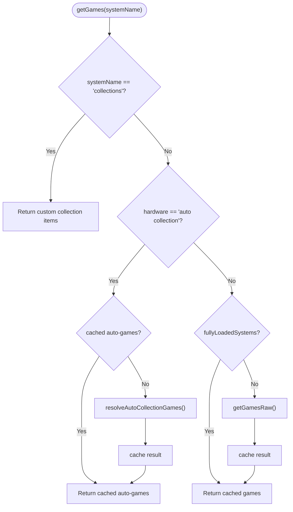
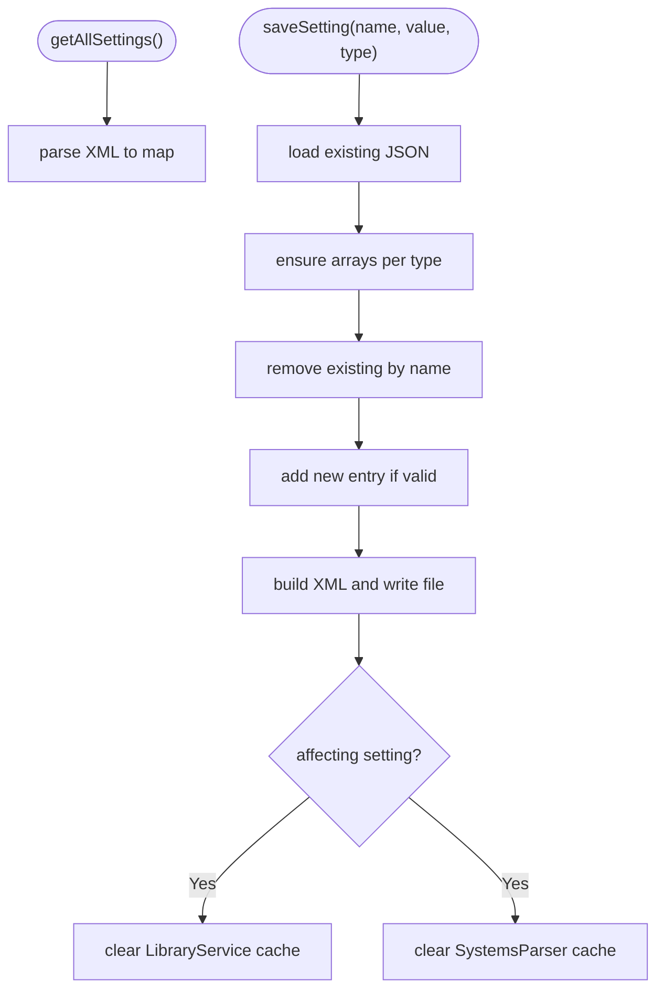
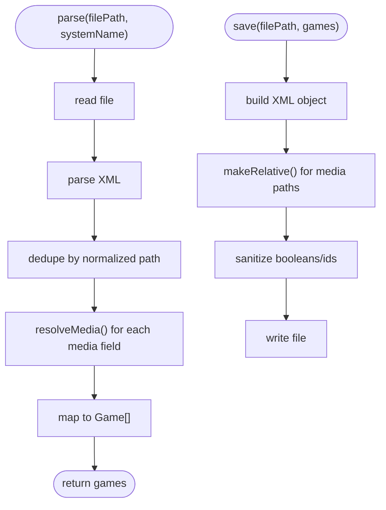
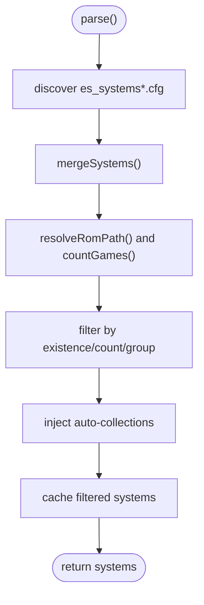
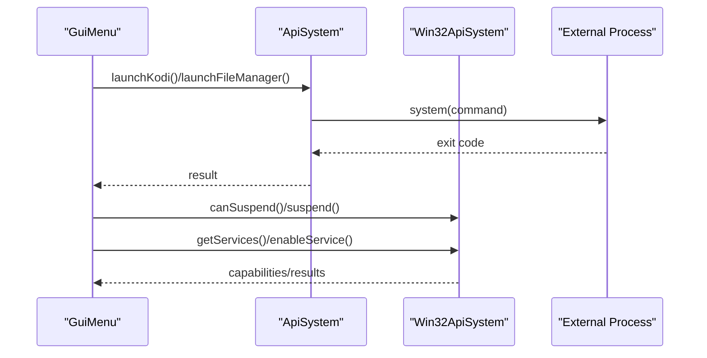
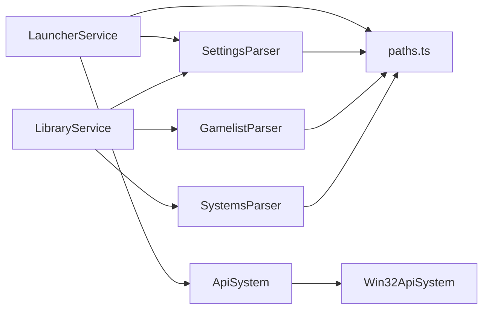

# Backend Services

<cite>
**Referenced Files in This Document**
- [LauncherService.ts](file://emulationstation/.riescade/src/src/main/services/LauncherService.ts)
- [LibraryService.ts](file://emulationstation/.riescade/src/src/main/services/LibraryService.ts)
- [SettingsParser.ts](file://emulationstation/.riescade/src/src/main/parsers/SettingsParser.ts)
- [GamelistParser.ts](file://emulationstation/.riescade/src/src/main/parsers/GamelistParser.ts)
- [SystemsParser.ts](file://emulationstation/.riescade/src/src/main/parsers/SystemsParser.ts)
- [paths.ts](file://emulationstation/.riescade/src/src/main/utils/paths.ts)
- [SassService.ts](file://emulationstation/.riescade/src/src/main/services/SassService.ts)
- [GuiMenu.cpp](file://emulationstation/.riescade/src/docs/es_src/guis/GuiMenu.cpp)
- [Win32ApiSystem.h](file://emulationstation/.riescade/src/docs/es_src/Win32ApiSystem.h)
- [Win32ApiSystem.cpp](file://emulationstation/.riescade/src/docs/es_src/Win32ApiSystem.cpp)
- [ApiSystem.cpp](file://emulationstation/.riescade/src/docs/es_src/ApiSystem.cpp)
- [MetaData.cpp](file://emulationstation/.riescade/src/docs/es_src/MetaData.cpp)
- [SystemData.cpp](file://emulationstation/.riescade/src/docs/es_src/SystemData.cpp)
- [GamesDBJSONScraper.cpp](file://emulationstation/.riescade/src/docs/es_src/scrapers/GamesDBJSONScraper.cpp)
- [IGDBScraper.cpp](file://emulationstation/.riescade/src/docs/es_src/scrapers/IGDBScraper.cpp)
</cite>

## Table of Contents
1. [Introduction](#introduction)
2. [Project Structure](#project-structure)
3. [Core Components](#core-components)
4. [Architecture Overview](#architecture-overview)
5. [Detailed Component Analysis](#detailed-component-analysis)
6. [Dependency Analysis](#dependency-analysis)
7. [Performance Considerations](#performance-considerations)
8. [Troubleshooting Guide](#troubleshooting-guide)
9. [Conclusion](#conclusion)

## Introduction
This document describes the backend service architecture of RIESCADE_SYSTEM’s emulation front-end. It focuses on the main process services and parsers responsible for emulator coordination, game library management, configuration handling, and metadata processing. It also covers service-layer patterns, caching, inter-service communication, and integration with the Electron main process and native system APIs.

## Project Structure
The backend is primarily implemented in TypeScript under the Electron main process, with complementary C++ components for system integration and scraping support. Key areas:
- Services: orchestrators for launching emulators, managing libraries, and compiling assets
- Parsers: XML configuration and gamelist loaders
- Utilities: path resolution and asset compilation
- Native integrations: Windows system APIs and external process management
- Scrapers: metadata enrichment from online databases

**Diagram sources**
- [LauncherService.ts:1-211](file://emulationstation/.riescade/src/src/main/services/LauncherService.ts#L1-L211)
- [LibraryService.ts:1-800](file://emulationstation/.riescade/src/src/main/services/LibraryService.ts#L1-L800)
- [SettingsParser.ts:1-155](file://emulationstation/.riescade/src/src/main/parsers/SettingsParser.ts#L1-L155)
- [GamelistParser.ts:1-178](file://emulationstation/.riescade/src/src/main/parsers/GamelistParser.ts#L1-L178)
- [SystemsParser.ts:1-270](file://emulationstation/.riescade/src/src/main/parsers/SystemsParser.ts#L1-L270)
- [paths.ts:1-59](file://emulationstation/.riescade/src/src/main/utils/paths.ts#L1-L59)
- [SassService.ts:1-40](file://emulationstation/.riescade/src/src/main/services/SassService.ts#L1-L40)
- [Win32ApiSystem.h:40-69](file://emulationstation/.riescade/src/docs/es_src/Win32ApiSystem.h#L40-L69)
- [Win32ApiSystem.cpp:146-202](file://emulationstation/.riescade/src/docs/es_src/Win32ApiSystem.cpp#L146-L202)
- [ApiSystem.cpp:431-479](file://emulationstation/.riescade/src/docs/es_src/ApiSystem.cpp#L431-L479)
- [MetaData.cpp:1-145](file://emulationstation/.riescade/src/docs/es_src/MetaData.cpp#L1-L145)
- [SystemData.cpp:1897-1964](file://emulationstation/.riescade/src/docs/es_src/SystemData.cpp#L1897-L1964)
- [GamesDBJSONScraper.cpp:431-473](file://emulationstation/.riescade/src/docs/es_src/scrapers/GamesDBJSONScraper.cpp#L431-L473)
- [IGDBScraper.cpp:239-266](file://emulationstation/.riescade/src/docs/es_src/scrapers/IGDBScraper.cpp#L239-L266)

**Section sources**
- [LauncherService.ts:1-211](file://emulationstation/.riescade/src/src/main/services/LauncherService.ts#L1-L211)
- [LibraryService.ts:1-800](file://emulationstation/.riescade/src/src/main/services/LibraryService.ts#L1-L800)
- [SettingsParser.ts:1-155](file://emulationstation/.riescade/src/src/main/parsers/SettingsParser.ts#L1-L155)
- [GamelistParser.ts:1-178](file://emulationstation/.riescade/src/src/main/parsers/GamelistParser.ts#L1-L178)
- [SystemsParser.ts:1-270](file://emulationstation/.riescade/src/src/main/parsers/SystemsParser.ts#L1-L270)
- [paths.ts:1-59](file://emulationstation/.riescade/src/src/main/utils/paths.ts#L1-L59)
- [SassService.ts:1-40](file://emulationstation/.riescade/src/src/main/services/SassService.ts#L1-L40)
- [Win32ApiSystem.h:40-69](file://emulationstation/.riescade/src/docs/es_src/Win32ApiSystem.h#L40-L69)
- [Win32ApiSystem.cpp:146-202](file://emulationstation/.riescade/src/docs/es_src/Win32ApiSystem.cpp#L146-L202)
- [ApiSystem.cpp:431-479](file://emulationstation/.riescade/src/docs/es_src/ApiSystem.cpp#L431-L479)
- [MetaData.cpp:1-145](file://emulationstation/.riescade/src/docs/es_src/MetaData.cpp#L1-L145)
- [SystemData.cpp:1897-1964](file://emulationstation/.riescade/src/docs/es_src/SystemData.cpp#L1897-L1964)
- [GamesDBJSONScraper.cpp:431-473](file://emulationstation/.riescade/src/docs/es_src/scrapers/GamesDBJSONScraper.cpp#L431-L473)
- [IGDBScraper.cpp:239-266](file://emulationstation/.riescade/src/docs/es_src/scrapers/IGDBScraper.cpp#L239-L266)

## Core Components
- LauncherService: resolves emulator/core selection, prepares temporary game metadata, and invokes the external emulator launcher with controller and save-state arguments.
- LibraryService: aggregates systems, builds caches, computes auto-collections, and manages per-system game lists with fast lookup and partial/full scans.
- SettingsParser: reads/writes es_settings.cfg/xml, normalizes types, and invalidates caches when system-affecting settings change.
- GamelistParser: parses gamelist.xml entries, normalizes paths, and writes back with relative paths for portability.
- SystemsParser: loads system definitions from es_systems.cfg/*.cfg, resolves paths, filters by existence/count, injects auto-collections, and caches results.
- Utility services: path resolution helpers and SCSS compilation for theme assets.
- Native integrations: Windows system APIs for services, suspend, plane mode, and script execution; external process launching for Kodi/file manager.

**Section sources**
- [LauncherService.ts:18-211](file://emulationstation/.riescade/src/src/main/services/LauncherService.ts#L18-L211)
- [LibraryService.ts:21-800](file://emulationstation/.riescade/src/src/main/services/LibraryService.ts#L21-L800)
- [SettingsParser.ts:6-155](file://emulationstation/.riescade/src/src/main/parsers/SettingsParser.ts#L6-L155)
- [GamelistParser.ts:6-178](file://emulationstation/.riescade/src/src/main/parsers/GamelistParser.ts#L6-L178)
- [SystemsParser.ts:8-270](file://emulationstation/.riescade/src/src/main/parsers/SystemsParser.ts#L8-L270)
- [paths.ts:10-59](file://emulationstation/.riescade/src/src/main/utils/paths.ts#L10-L59)
- [SassService.ts:4-40](file://emulationstation/.riescade/src/src/main/services/SassService.ts#L4-L40)
- [Win32ApiSystem.h:40-69](file://emulationstation/.riescade/src/docs/es_src/Win32ApiSystem.h#L40-L69)
- [Win32ApiSystem.cpp:146-202](file://emulationstation/.riescade/src/docs/es_src/Win32ApiSystem.cpp#L146-L202)
- [ApiSystem.cpp:431-479](file://emulationstation/.riescade/src/docs/es_src/ApiSystem.cpp#L431-L479)

## Architecture Overview
The backend follows a layered design:
- Service Layer: high-level orchestration (LauncherService, LibraryService)
- Parser Layer: structured data ingestion (SettingsParser, GamelistParser, SystemsParser)
- Utility Layer: path resolution and asset compilation
- Integration Layer: native Windows APIs and external process management
- Frontend Integration: Electron IPC and UI updates

**Diagram sources**
- [LauncherService.ts:18-211](file://emulationstation/.riescade/src/src/main/services/LauncherService.ts#L18-L211)
- [LibraryService.ts:21-800](file://emulationstation/.riescade/src/src/main/services/LibraryService.ts#L21-L800)
- [SettingsParser.ts:6-155](file://emulationstation/.riescade/src/src/main/parsers/SettingsParser.ts#L6-L155)
- [GamelistParser.ts:6-178](file://emulationstation/.riescade/src/src/main/parsers/GamelistParser.ts#L6-L178)
- [SystemsParser.ts:8-270](file://emulationstation/.riescade/src/src/main/parsers/SystemsParser.ts#L8-L270)
- [paths.ts:10-59](file://emulationstation/.riescade/src/src/main/utils/paths.ts#L10-L59)
- [Win32ApiSystem.h:40-69](file://emulationstation/.riescade/src/docs/es_src/Win32ApiSystem.h#L40-L69)
- [ApiSystem.cpp:431-479](file://emulationstation/.riescade/src/docs/es_src/ApiSystem.cpp#L431-L479)

## Detailed Component Analysis

### LauncherService
Responsibilities:
- Resolve emulator and core selection prioritizing per-game overrides, system-wide settings, and defaults.
- Prepare a temporary game XML for the launcher.
- Build controller arguments from active devices and GUID matching.
- Manage save-state autosave and slots.
- Execute emulatorLauncher.exe with constructed arguments.

Key behaviors:
- Uses SettingsParser to fetch per-system and global settings.
- Resolves ROM path relative to system path.
- Supports .menu shortcuts by parsing and executing embedded commands.
- Emits logs for diagnostics and handles exit codes.

**Diagram sources**
- [LauncherService.ts:18-211](file://emulationstation/.riescade/src/src/main/services/LauncherService.ts#L18-L211)
- [SettingsParser.ts:74-77](file://emulationstation/.riescade/src/src/main/parsers/SettingsParser.ts#L74-L77)

**Section sources**
- [LauncherService.ts:18-211](file://emulationstation/.riescade/src/src/main/services/LauncherService.ts#L18-L211)
- [SettingsParser.ts:74-77](file://emulationstation/.riescade/src/src/main/parsers/SettingsParser.ts#L74-L77)

### LibraryService
Responsibilities:
- Load and filter systems, compute game counts, and inject auto-collections.
- Build caches for systems and games to accelerate UI rendering.
- Compute quick auto-collections counts from gamelists and gamesdb.xml.
- Resolve auto-collections by genre, manufacturer, and control-type tags.
- Support preload strategies for full or per-system loading.

Key behaviors:
- Maintains static caches for games, auto-counts, and preload flags.
- Reads genres.xml to map localized genre names to collection keys.
- Parses gamesdb.xml to detect wheel/trackball/spinner/lightgun/vertical tags.
- Sends progress updates to the UI via Electron IPC.

**Diagram sources**
- [LibraryService.ts:713-759](file://emulationstation/.riescade/src/src/main/services/LibraryService.ts#L713-L759)
- [LibraryService.ts:734-748](file://emulationstation/.riescade/src/src/main/services/LibraryService.ts#L734-L748)

**Section sources**
- [LibraryService.ts:21-800](file://emulationstation/.riescade/src/src/main/services/LibraryService.ts#L21-L800)
- [LibraryService.ts:713-759](file://emulationstation/.riescade/src/src/main/services/LibraryService.ts#L713-L759)

### SettingsParser
Responsibilities:
- Parse es_settings.cfg or es_settings.xml into a normalized map.
- Save settings with type-aware arrays and deduplicate entries.
- Invalidate caches when system-affecting settings change.

Key behaviors:
- Ensures arrays for bool/string/int/float settings.
- Removes redundant “auto” values for non-global/RIESCADA settings.
- Clears LibraryService and SystemsParser caches on specific setting changes.

**Diagram sources**
- [SettingsParser.ts:37-155](file://emulationstation/.riescade/src/src/main/parsers/SettingsParser.ts#L37-L155)

**Section sources**
- [SettingsParser.ts:37-155](file://emulationstation/.riescade/src/src/main/parsers/SettingsParser.ts#L37-L155)

### GamelistParser
Responsibilities:
- Parse gamelist.xml into typed Game objects with normalized paths.
- Save games back to XML with relative media paths and sanitized attributes.

Key behaviors:
- Normalizes path separators and removes leading prefixes.
- Resolves media URLs and absolute paths to UI-friendly absolute paths.
- Converts booleans and numeric fields to appropriate types.
- Writes back with relative paths for portability.

**Diagram sources**
- [GamelistParser.ts:20-102](file://emulationstation/.riescade/src/src/main/parsers/GamelistParser.ts#L20-L102)
- [GamelistParser.ts:104-178](file://emulationstation/.riescade/src/src/main/parsers/GamelistParser.ts#L104-L178)

**Section sources**
- [GamelistParser.ts:20-102](file://emulationstation/.riescade/src/src/main/parsers/GamelistParser.ts#L20-L102)
- [GamelistParser.ts:104-178](file://emulationstation/.riescade/src/src/main/parsers/GamelistParser.ts#L104-L178)

### SystemsParser
Responsibilities:
- Load system definitions from es_systems.cfg and related files.
- Resolve ROM paths, count games, filter non-existing or empty systems.
- Inject auto-collections with themed names and virtual paths.
- Cache and expose merged system definitions.

Key behaviors:
- Merges multiple cfg files by system name.
- Resolves ~ to RetroBat root and normalizes paths.
- Counts games heuristically and sends progress updates.
- Adds auto-collections based on settings and theme mappings.

**Diagram sources**
- [SystemsParser.ts:27-178](file://emulationstation/.riescade/src/src/main/parsers/SystemsParser.ts#L27-L178)

**Section sources**
- [SystemsParser.ts:27-178](file://emulationstation/.riescade/src/src/main/parsers/SystemsParser.ts#L27-L178)

### Utility Services and Paths
- paths.ts: resolves RetroBat root, config, ROMs, emulators, and theme directories; supports dev/prod environments.
- SassService: compiles SCSS to CSS with minimal configuration and target directory logic.

**Section sources**
- [paths.ts:10-59](file://emulationstation/.riescade/src/src/main/utils/paths.ts#L10-L59)
- [SassService.ts:4-40](file://emulationstation/.riescade/src/src/main/services/SassService.ts#L4-L40)

### Native System Integration and External Processes
- Win32ApiSystem: exposes Windows-specific capabilities (suspend, plane mode, Bluetooth controller forgetting) and executes scripts.
- ApiSystem: launches external applications (e.g., Kodi, file manager) and handles exit codes.
- Frontend settings UI integrates with system services and settings persistence.

**Diagram sources**
- [GuiMenu.cpp:401-417](file://emulationstation/.riescade/src/docs/es_src/guis/GuiMenu.cpp#L401-L417)
- [ApiSystem.cpp:431-479](file://emulationstation/.riescade/src/docs/es_src/ApiSystem.cpp#L431-L479)
- [Win32ApiSystem.h:40-69](file://emulationstation/.riescade/src/docs/es_src/Win32ApiSystem.h#L40-L69)
- [Win32ApiSystem.cpp:173-187](file://emulationstation/.riescade/src/docs/es_src/Win32ApiSystem.cpp#L173-L187)

**Section sources**
- [GuiMenu.cpp:401-417](file://emulationstation/.riescade/src/docs/es_src/guis/GuiMenu.cpp#L401-L417)
- [ApiSystem.cpp:431-479](file://emulationstation/.riescade/src/docs/es_src/ApiSystem.cpp#L431-L479)
- [Win32ApiSystem.h:40-69](file://emulationstation/.riescade/src/docs/es_src/Win32ApiSystem.h#L40-L69)
- [Win32ApiSystem.cpp:173-187](file://emulationstation/.riescade/src/docs/es_src/Win32ApiSystem.cpp#L173-L187)

## Dependency Analysis
- LauncherService depends on SettingsParser and path utilities; it spawns emulatorLauncher.exe.
- LibraryService depends on SystemsParser, GamelistParser, and SettingsParser; it caches and computes auto-collections.
- SettingsParser depends on path utilities and writes to configuration files.
- GamelistParser depends on path utilities for relative path handling.
- SystemsParser depends on path utilities and emits progress events to the UI.
- Native integrations are invoked by ApiSystem and Win32ApiSystem, often from UI actions.

**Diagram sources**
- [LauncherService.ts:7-7](file://emulationstation/.riescade/src/src/main/services/LauncherService.ts#L7-L7)
- [LibraryService.ts:3-7](file://emulationstation/.riescade/src/src/main/services/LibraryService.ts#L3-L7)
- [SettingsParser.ts:4-4](file://emulationstation/.riescade/src/src/main/parsers/SettingsParser.ts#L4-L4)
- [GamelistParser.ts:3-3](file://emulationstation/.riescade/src/src/main/parsers/GamelistParser.ts#L3-L3)
- [SystemsParser.ts:5-5](file://emulationstation/.riescade/src/src/main/parsers/SystemsParser.ts#L5-L5)
- [paths.ts:1-3](file://emulationstation/.riescade/src/src/main/utils/paths.ts#L1-L3)
- [ApiSystem.cpp:431-479](file://emulationstation/.riescade/src/docs/es_src/ApiSystem.cpp#L431-L479)
- [Win32ApiSystem.h:54-62](file://emulationstation/.riescade/src/docs/es_src/Win32ApiSystem.h#L54-L62)

**Section sources**
- [LauncherService.ts:7-7](file://emulationstation/.riescade/src/src/main/services/LauncherService.ts#L7-L7)
- [LibraryService.ts:3-7](file://emulationstation/.riescade/src/src/main/services/LibraryService.ts#L3-L7)
- [SettingsParser.ts:4-4](file://emulationstation/.riescade/src/src/main/parsers/SettingsParser.ts#L4-L4)
- [GamelistParser.ts:3-3](file://emulationstation/.riescade/src/src/main/parsers/GamelistParser.ts#L3-L3)
- [SystemsParser.ts:5-5](file://emulationstation/.riescade/src/src/main/parsers/SystemsParser.ts#L5-L5)
- [paths.ts:1-3](file://emulationstation/.riescade/src/src/main/utils/paths.ts#L1-L3)
- [ApiSystem.cpp:431-479](file://emulationstation/.riescade/src/docs/es_src/ApiSystem.cpp#L431-L479)
- [Win32ApiSystem.h:54-62](file://emulationstation/.riescade/src/docs/es_src/Win32ApiSystem.h#L54-L62)

## Performance Considerations
- Caching: LibraryService maintains caches for systems, games, and auto-collections to avoid repeated filesystem scans and XML parsing.
- Lazy loading: LibraryService supports per-system preload and quick auto-count computation to reduce startup latency.
- Path normalization: Consistent path normalization reduces duplicate work and improves cache hit rates.
- XML parsing limits: Parser configurations limit entity expansions and expanded lengths to mitigate resource exhaustion.
- UI progress updates: Systems parsing and library preloading emit progress events to keep the UI responsive.
- External process management: LauncherService executes the emulator launcher asynchronously and logs exit codes for diagnostics.

[No sources needed since this section provides general guidance]

## Troubleshooting Guide
Common issues and strategies:
- Settings changes not reflected: Ensure SettingsParser.saveSetting clears caches for affected settings (e.g., VisibleSystems, HiddenSystems).
- Missing games in auto-collections: Verify genres.xml and gamesdb.xml presence; confirm LibraryService computed counts and caches are populated.
- ROM path resolution errors: Confirm SystemsParser resolved paths and that getRetroBatPath returns the expected installation directory.
- Launcher failures: Inspect LauncherService logs for command construction and emulatorLauncher.exe exit codes; validate controller GUIDs and paths.
- Native service availability: Use Win32ApiSystem capabilities and ApiSystem to verify prerequisites before invoking system services.

**Section sources**
- [SettingsParser.ts:130-153](file://emulationstation/.riescade/src/src/main/parsers/SettingsParser.ts#L130-L153)
- [LibraryService.ts:43-54](file://emulationstation/.riescade/src/src/main/services/LibraryService.ts#L43-L54)
- [SystemsParser.ts:220-246](file://emulationstation/.riescade/src/src/main/parsers/SystemsParser.ts#L220-L246)
- [LauncherService.ts:199-208](file://emulationstation/.riescade/src/src/main/services/LauncherService.ts#L199-L208)
- [Win32ApiSystem.cpp:146-171](file://emulationstation/.riescade/src/docs/es_src/Win32ApiSystem.cpp#L146-L171)
- [ApiSystem.cpp:431-479](file://emulationstation/.riescade/src/docs/es_src/ApiSystem.cpp#L431-L479)

## Conclusion
RIESCADE_SYSTEM’s backend leverages a robust service and parser architecture to coordinate emulator launches, manage game libraries, and maintain configuration state. Centralized caching, path normalization, and careful XML handling ensure performance and reliability. Native system integrations and external process management provide seamless OS-level capabilities, while UI progress reporting keeps the user informed during heavy operations.