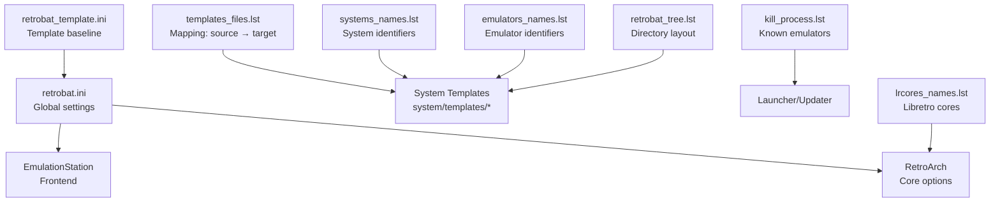
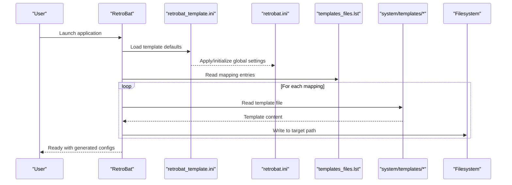
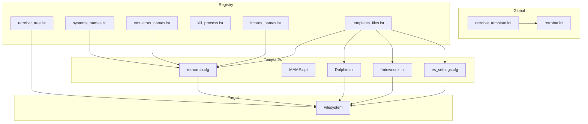
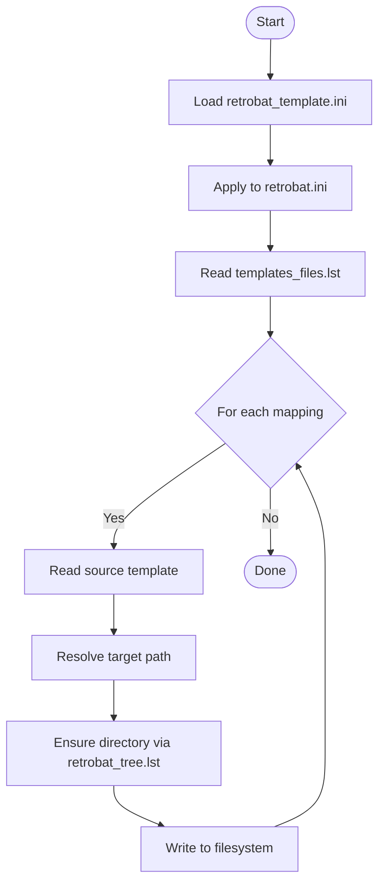
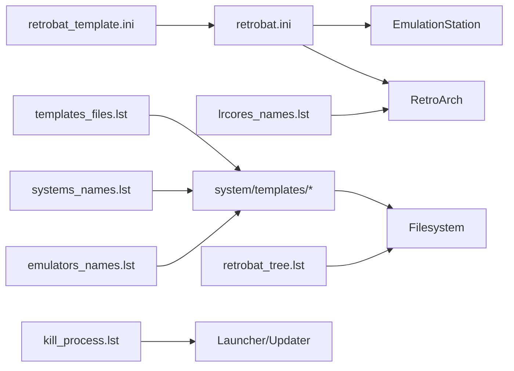

# Configuration Management

<cite>
**Referenced Files in This Document**
- [retrobat.ini](file://retrobat.ini)
- [retrobat_template.ini](file://system/resources/retrobat_template.ini)
- [templates_files.lst](file://system/configgen/templates_files.lst)
- [systems_names.lst](file://system/configgen/systems_names.lst)
- [emulators_names.lst](file://system/configgen/emulators_names.lst)
- [retrobat_tree.lst](file://system/configgen/retrobat_tree.lst)
- [kill_process.lst](file://system/configgen/kill_process.lst)
- [lrcores_names.lst](file://system/configgen/lrcores_names.lst)
- [retroarch.cfg](file://system/templates/retroarch/retroarch.cfg)
- [MAME.opt](file://system/templates/retroarch/config/MAME/MAME.opt)
- [Dolphin.ini](file://system/templates/dolphin-emu/User\Config\Dolphin.ini)
- [fmtownsux.ini](file://system/templates/mame/ini/fmtownsux.ini)
- [es_settings.cfg](file://system/templates/emulationstation/es_settings.cfg)
</cite>

## Table of Contents
1. [Introduction](#introduction)
2. [Project Structure](#project-structure)
3. [Core Components](#core-components)
4. [Architecture Overview](#architecture-overview)
5. [Detailed Component Analysis](#detailed-component-analysis)
6. [Dependency Analysis](#dependency-analysis)
7. [Performance Considerations](#performance-considerations)
8. [Troubleshooting Guide](#troubleshooting-guide)
9. [Conclusion](#conclusion)
10. [Appendices](#appendices)

## Introduction
This document explains RIESCADE_SYSTEM’s configuration management system with a focus on its template-based architecture. It covers:
- Template-based configuration using .lst files for system and emulator definitions
- Global configuration via retrobat.ini and the template-based retrobat_template.ini
- Template inheritance patterns and configuration generation
- Parameter substitution and validation workflows
- System-specific configurations, emulator core mappings, and platform compatibility
- File formats, syntax patterns, and default value resolution
- Practical examples for customization, adding systems, and troubleshooting
- Backup, migration, and version compatibility handling

## Project Structure
RIESCADE_SYSTEM organizes configuration metadata and templates under system/configgen and system/templates. The global retrobat.ini controls front-end and emulator behavior, while retrobat_template.ini provides a canonical baseline for global settings.

**Diagram sources**
- [retrobat.ini](file://retrobat.ini)
- [retrobat_template.ini](file://system/resources/retrobat_template.ini)
- [templates_files.lst](file://system/configgen/templates_files.lst)
- [systems_names.lst](file://system/configgen/systems_names.lst)
- [emulators_names.lst](file://system/configgen/emulators_names.lst)
- [retrobat_tree.lst](file://system/configgen/retrobat_tree.lst)
- [kill_process.lst](file://system/configgen/kill_process.lst)
- [lrcores_names.lst](file://system/configgen/lrcores_names.lst)

**Section sources**
- [retrobat.ini](file://retrobat.ini)
- [retrobat_template.ini](file://system/resources/retrobat_template.ini)
- [templates_files.lst](file://system/configgen/templates_files.lst)
- [systems_names.lst](file://system/configgen/systems_names.lst)
- [emulators_names.lst](file://system/configgen/emulators_names.lst)
- [retrobat_tree.lst](file://system/configgen/retrobat_tree.lst)
- [kill_process.lst](file://system/configgen/kill_process.lst)
- [lrcores_names.lst](file://system/configgen/lrcores_names.lst)

## Core Components
- Global configuration
  - retrobat.ini: runtime global settings for RetroBat, splash screen, EmulationStation, and related behaviors.
  - retrobat_template.ini: canonical template for global defaults, used to initialize or reset retrobat.ini.
- Template registry
  - templates_files.lst: maps template source paths to target installation paths for emulators and frontend.
  - systems_names.lst: enumerates supported platforms/systems.
  - emulators_names.lst: enumerates supported emulators and tools.
  - lrcores_names.lst: enumerates Libretro core names for RetroArch.
  - kill_process.lst: lists executable names to terminate during cleanup or updates.
  - retrobat_tree.lst: defines directory structure and expected locations for bios, saves, roms, emulators, and frontend assets.
- System templates
  - system/templates/*: per-emulator and per-platform configuration files (.ini, .cfg, .toml, .json) used as source templates.

Key responsibilities:
- Normalize and validate global settings against retrobat_template.ini
- Resolve system and emulator identifiers
- Generate per-emulator and per-system configuration files from templates
- Enforce directory layout and file placement via retrobat_tree.lst
- Manage emulator lifecycle via kill_process.lst

**Section sources**
- [retrobat.ini](file://retrobat.ini)
- [retrobat_template.ini](file://system/resources/retrobat_template.ini)
- [templates_files.lst](file://system/configgen/templates_files.lst)
- [systems_names.lst](file://system/configgen/systems_names.lst)
- [emulators_names.lst](file://system/configgen/emulators_names.lst)
- [lrcores_names.lst](file://system/configgen/lrcores_names.lst)
- [kill_process.lst](file://system/configgen/kill_process.lst)
- [retrobat_tree.lst](file://system/configgen/retrobat_tree.lst)

## Architecture Overview
The configuration management system follows a template-driven pipeline:
- Global settings originate from retrobat_template.ini and are applied to retrobat.ini
- System and emulator identifiers are resolved from systems_names.lst and emulators_names.lst
- templates_files.lst drives the generation of per-emulator and per-system configuration files
- retrobat_tree.lst ensures correct directory placement and file locations
- lrcores_names.lst informs RetroArch core selection and MAME options
- kill_process.lst coordinates safe shutdown of running emulators

**Diagram sources**
- [retrobat_template.ini](file://system/resources/retrobat_template.ini)
- [retrobat.ini](file://retrobat.ini)
- [templates_files.lst](file://system/configgen/templates_files.lst)
- [retrobat_tree.lst](file://system/configgen/retrobat_tree.lst)

## Detailed Component Analysis

### Global Configuration: retrobat.ini and retrobat_template.ini
- retrobat_template.ini defines canonical defaults for RetroBat behavior, splash screen, and EmulationStation options.
- retrobat.ini is the active configuration file; it can be initialized or reset using retrobat_template.ini as a baseline.
- Typical categories include:
  - RetroBat behavior: autostart, WiimoteGun, ResetConfigMode
  - SplashScreen: enable intro, filename, filepath, randomization, delays
  - EmulationStation: fullscreen modes, focus delay, GameListOnly, interface mode, monitor index, vsync, OpenGL2_1 fallback, window size, framerate overlay

Validation and resolution:
- Values are validated by checking presence and type against the template schema.
- Defaults are applied from retrobat_template.ini when keys are missing or invalid in retrobat.ini.

Practical example:
- To enable splash screen and enforce fullscreen with borderless, ensure SplashScreen.EnableIntro=1 and EmulationStation.Fullscreen=1, EmulationStation.FullscreenBorderless=1 in retrobat.ini.

**Section sources**
- [retrobat_template.ini](file://system/resources/retrobat_template.ini)
- [retrobat.ini](file://retrobat.ini)

### Template Registry: templates_files.lst
- Purpose: Define which template files to install and where.
- Format: Each line maps a source template path to a target installation path.
- Examples include:
  - Emulator-specific files: retroarch.cfg, MAME.opt, Dolphin.ini, fmtownsux.ini
  - Frontend files: emulationstation es_settings.cfg, es_input.cfg, es_padtokey.cfg
  - Save and ROM placeholders: MAME nvram, ports, PS3/WiiU example playlists

Generation process:
- For each mapping, copy the source template to the target location.
- If the target is a directory placeholder, ensure the directory exists according to retrobat_tree.lst.

**Section sources**
- [templates_files.lst](file://system/configgen/templates_files.lst)
- [retrobat_tree.lst](file://system/configgen/retrobat_tree.lst)

### System and Emulator Identifiers
- systems_names.lst: enumerates supported platforms (e.g., nes, snes, megadrive, n64, pcsx2, mame).
- emulators_names.lst: enumerates supported emulators/tools (e.g., retroarch, dolphin-emu, mame, pcsx2).
- lrcores_names.lst: enumerates Libretro core names used by RetroArch.

Usage:
- Systems map to template sets and save/ROM locations.
- Emulators map to executable names and template directories.
- Libretro cores inform RetroArch core selection and MAME options.

**Section sources**
- [systems_names.lst](file://system/configgen/systems_names.lst)
- [emulators_names.lst](file://system/configgen/emulators_names.lst)
- [lrcores_names.lst](file://system/configgen/lrcores_names.lst)

### Emulator-Specific Templates and Options

#### RetroArch
- retroarch.cfg: core audio/video/input settings, overlays, netplay, hotkeys, and asset paths.
- MAME.opt: RetroArch core options for MAME, including input deadzone, mouse enable, softlist behavior, and throttle.

Validation and defaults:
- Keys present in retroarch.cfg and MAME.opt are applied from templates.
- Missing keys fall back to RetroArch defaults; ensure critical keys (e.g., input drivers, overlays) are set in templates.

**Section sources**
- [retroarch.cfg](file://system/templates/retroarch/retroarch.cfg)
- [MAME.opt](file://system/templates/retroarch/config/MAME/MAME.opt)

#### Dolphin-Emu
- Dolphin.ini: paths for ISOs, saves, dumps, resource packs, and core settings (e.g., GFX backend, Wiimote speaker, CPU threading).

Validation and defaults:
- Paths resolve relative to the RIESCADE_SYSTEM root using retrobat_tree.lst conventions.
- Core options like SkipIPL, FastDiscSpeed, and Wiimote settings are controlled via template.

**Section sources**
- [Dolphin.ini](file://system/templates/dolphin-emu/User\Config\Dolphin.ini)

#### MAME
- fmtownsux.ini: MAME configuration including search paths, output directories, performance, render, vector, sound, input, OSD, video, sound, and post-processing options.

Validation and defaults:
- Paths (rompath, cfg_directory, nvram_directory, etc.) are set in the template.
- Post-processing and shader selections are configured via template keys.

**Section sources**
- [fmtownsux.ini](file://system/templates/mame/ini/fmtownsux.ini)

#### EmulationStation
- es_settings.cfg: frontend behavior toggles (ungroup flags, scrape settings, netplay, screensaver behavior, bezel settings).

Validation and defaults:
- Boolean/string toggles are applied from the template.
- Ungroup flags per system ensure proper grouping behavior.

**Section sources**
- [es_settings.cfg](file://system/templates/emulationstation/es_settings.cfg)

### Directory Layout and File Placement
retrobat_tree.lst defines the expected filesystem structure:
- bios/, saves/, roms/, emulators/, emulationstation/
- Per-emulator directories (e.g., emulators/retroarch, emulators/dolphin-emu)
- Per-system save/ROM directories (e.g., saves/n64, roms/nes)

Generation workflow:
- templates_files.lst entries are written respecting retrobat_tree.lst directory expectations.
- If a target is a directory placeholder, ensure the directory exists before writing files.

**Section sources**
- [retrobat_tree.lst](file://system/configgen/retrobat_tree.lst)
- [templates_files.lst](file://system/configgen/templates_files.lst)

### Emulator Lifecycle Management
kill_process.lst enumerates known emulator executables. During updates or resets, these processes are terminated to ensure safe file replacement.

**Section sources**
- [kill_process.lst](file://system/configgen/kill_process.lst)

## Architecture Overview

**Diagram sources**
- [retrobat_template.ini](file://system/resources/retrobat_template.ini)
- [retrobat.ini](file://retrobat.ini)
- [systems_names.lst](file://system/configgen/systems_names.lst)
- [emulators_names.lst](file://system/configgen/emulators_names.lst)
- [lrcores_names.lst](file://system/configgen/lrcores_names.lst)
- [kill_process.lst](file://system/configgen/kill_process.lst)
- [retrobat_tree.lst](file://system/configgen/retrobat_tree.lst)
- [templates_files.lst](file://system/configgen/templates_files.lst)
- [retroarch.cfg](file://system/templates/retroarch/retroarch.cfg)
- [MAME.opt](file://system/templates/retroarch/config/MAME/MAME.opt)
- [Dolphin.ini](file://system/templates/dolphin-emu/User\Config\Dolphin.ini)
- [fmtownsux.ini](file://system/templates/mame/ini/fmtownsux.ini)
- [es_settings.cfg](file://system/templates/emulationstation/es_settings.cfg)

## Detailed Component Analysis

### Template-Based Generation Workflow

**Diagram sources**
- [retrobat_template.ini](file://system/resources/retrobat_template.ini)
- [retrobat.ini](file://retrobat.ini)
- [templates_files.lst](file://system/configgen/templates_files.lst)
- [retrobat_tree.lst](file://system/configgen/retrobat_tree.lst)

**Section sources**
- [retrobat_template.ini](file://system/resources/retrobat_template.ini)
- [retrobat.ini](file://retrobat.ini)
- [templates_files.lst](file://system/configgen/templates_files.lst)
- [retrobat_tree.lst](file://system/configgen/retrobat_tree.lst)

### Parameter Substitution and Validation
- RetroArch and MAME templates define extensive keys; missing keys rely on emulator defaults.
- Global keys in retrobat.ini override template defaults when present.
- Validation occurs implicitly by ensuring required keys exist in templates and that paths resolve correctly via retrobat_tree.lst.

Recommendations:
- Keep retrobat_template.ini as the single source of truth for global defaults.
- Validate template completeness by comparing keys against emulator documentation.
- Use templates_files.lst to ensure all required files are deployed.

**Section sources**
- [retroarch.cfg](file://system/templates/retroarch/retroarch.cfg)
- [MAME.opt](file://system/templates/retroarch/config/MAME/MAME.opt)
- [Dolphin.ini](file://system/templates/dolphin-emu/User\Config\Dolphin.ini)
- [fmtownsux.ini](file://system/templates/mame/ini/fmtownsux.ini)
- [es_settings.cfg](file://system/templates/emulationstation/es_settings.cfg)

### System-Specific Configurations and Platform Compatibility
- systems_names.lst enumerates supported platforms; each platform maps to a set of templates and save/ROM locations.
- emulators_names.lst enumerates emulators; each emulator maps to its template directory and executable name.
- lrcores_names.lst enumerates Libretro cores; RetroArch uses these to select appropriate cores for systems.

Compatibility matrix highlights:
- MAME: Multiple MAME variants (mame, mame2003, mame2003-plus, mame2010, mame2014, mame2016) are represented in lrcores_names.lst and templates.
- Dolphin: Supports GameCube and Wii ISOs; paths and save locations are defined in Dolphin.ini.
- RetroArch: Extensive core coverage via lrcores_names.lst; MAME options are controlled via MAME.opt.

**Section sources**
- [systems_names.lst](file://system/configgen/systems_names.lst)
- [emulators_names.lst](file://system/configgen/emulators_names.lst)
- [lrcores_names.lst](file://system/configgen/lrcores_names.lst)
- [Dolphin.ini](file://system/templates/dolphin-emu/User\Config\Dolphin.ini)
- [MAME.opt](file://system/templates/retroarch/config/MAME/MAME.opt)

### Practical Examples

#### Example: Customize RetroArch Input and MAME Options
- Modify retroarch.cfg to change input driver, overlay opacity, and netplay settings.
- Adjust MAME.opt to enable softlists, adjust mouse enable, and set rotation mode.
- Regenerate configurations using templates_files.lst to deploy changes.

**Section sources**
- [retroarch.cfg](file://system/templates/retroarch/retroarch.cfg)
- [MAME.opt](file://system/templates/retroarch/config/MAME/MAME.opt)

#### Example: Add a New System
- Add the system identifier to systems_names.lst.
- Place system-specific templates under system/templates/<system>/.
- Update templates_files.lst to include mapping entries for new templates.
- Ensure retrobat_tree.lst reflects any new save/ROM directories.

**Section sources**
- [systems_names.lst](file://system/configgen/systems_names.lst)
- [templates_files.lst](file://system/configgen/templates_files.lst)
- [retrobat_tree.lst](file://system/configgen/retrobat_tree.lst)

#### Example: Reset Global Settings to Template Defaults
- Replace retrobat.ini with retrobat_template.ini to restore canonical defaults.
- Re-run template generation to re-deploy per-emulator configurations.

**Section sources**
- [retrobat_template.ini](file://system/resources/retrobat_template.ini)
- [retrobat.ini](file://retrobat.ini)

## Dependency Analysis

**Diagram sources**
- [retrobat_template.ini](file://system/resources/retrobat_template.ini)
- [retrobat.ini](file://retrobat.ini)
- [templates_files.lst](file://system/configgen/templates_files.lst)
- [retrobat_tree.lst](file://system/configgen/retrobat_tree.lst)
- [systems_names.lst](file://system/configgen/systems_names.lst)
- [emulators_names.lst](file://system/configgen/emulators_names.lst)
- [lrcores_names.lst](file://system/configgen/lrcores_names.lst)
- [kill_process.lst](file://system/configgen/kill_process.lst)

**Section sources**
- [retrobat_template.ini](file://system/resources/retrobat_template.ini)
- [retrobat.ini](file://retrobat.ini)
- [templates_files.lst](file://system/configgen/templates_files.lst)
- [retrobat_tree.lst](file://system/configgen/retrobat_tree.lst)
- [systems_names.lst](file://system/configgen/systems_names.lst)
- [emulators_names.lst](file://system/configgen/emulators_names.lst)
- [lrcores_names.lst](file://system/configgen/lrcores_names.lst)
- [kill_process.lst](file://system/configgen/kill_process.lst)

## Performance Considerations
- Minimize redundant writes: only write files whose templates differ from existing targets.
- Batch template deployments: process templates_files.lst in a single pass to reduce I/O overhead.
- Path resolution: leverage retrobat_tree.lst to avoid expensive path discovery at runtime.
- RetroArch core selection: choose appropriate cores from lrcores_names.lst to balance compatibility and performance.

## Troubleshooting Guide
Common issues and resolutions:
- EmulationStation not launching in fullscreen:
  - Verify EmulationStation.Fullscreen and EmulationStation.FullscreenBorderless in retrobat.ini.
  - Confirm EmulationStation paths in retrobat_tree.lst match actual deployment.
- RetroArch input not responding:
  - Check input drivers and overlay settings in retroarch.cfg.
  - Ensure MAME.opt keys (e.g., mame_mouse_enable) are set appropriately.
- Dolphin save paths incorrect:
  - Validate Dolphin.ini paths resolve relative to RIESCADE_SYSTEM root.
  - Confirm saves/*/dolphin-* directories exist per retrobat_tree.lst.
- MAME not finding ROMs or BIOS:
  - Verify fmtownsux.ini rompath and hashpath.
  - Ensure bios/* directories exist and contain required files.

Backup and reset:
- Back up retrobat.ini before applying retrobat_template.ini.
- Use kill_process.lst to terminate running emulators prior to updates.

**Section sources**
- [retrobat.ini](file://retrobat.ini)
- [retrobat_template.ini](file://system/resources/retrobat_template.ini)
- [retrobat_tree.lst](file://system/configgen/retrobat_tree.lst)
- [Dolphin.ini](file://system/templates/dolphin-emu/User\Config\Dolphin.ini)
- [fmtownsux.ini](file://system/templates/mame/ini/fmtownsux.ini)
- [kill_process.lst](file://system/configgen/kill_process.lst)

## Conclusion
RIESCADE_SYSTEM’s configuration management relies on a robust template-driven architecture:
- retrobat_template.ini establishes canonical global defaults
- templates_files.lst orchestrates per-emulator and per-system configuration deployment
- systems_names.lst, emulators_names.lst, and lrcores_names.lst provide semantic mapping
- retrobat_tree.lst enforces directory layout and file placement
- kill_process.lst supports safe emulator lifecycle management

Adhering to these patterns ensures consistent, maintainable, and portable configurations across platforms and emulator ecosystems.

## Appendices

### Configuration File Formats and Syntax Patterns
- INI-style templates (e.g., retroarch.cfg, Dolphin.ini, fmtownsux.ini): key=value pairs with optional sections.
- XML templates (e.g., es_settings.cfg): structured settings with typed attributes.
- Text lists (e.g., systems_names.lst, emulators_names.lst, lrcores_names.lst): newline-separated identifiers.
- Mapping lists (e.g., templates_files.lst): source → target path pairs.

**Section sources**
- [retroarch.cfg](file://system/templates/retroarch/retroarch.cfg)
- [Dolphin.ini](file://system/templates/dolphin-emu/User\Config\Dolphin.ini)
- [fmtownsux.ini](file://system/templates/mame/ini/fmtownsux.ini)
- [es_settings.cfg](file://system/templates/emulationstation/es_settings.cfg)
- [systems_names.lst](file://system/configgen/systems_names.lst)
- [emulators_names.lst](file://system/configgen/emulators_names.lst)
- [lrcores_names.lst](file://system/configgen/lrcores_names.lst)
- [templates_files.lst](file://system/configgen/templates_files.lst)