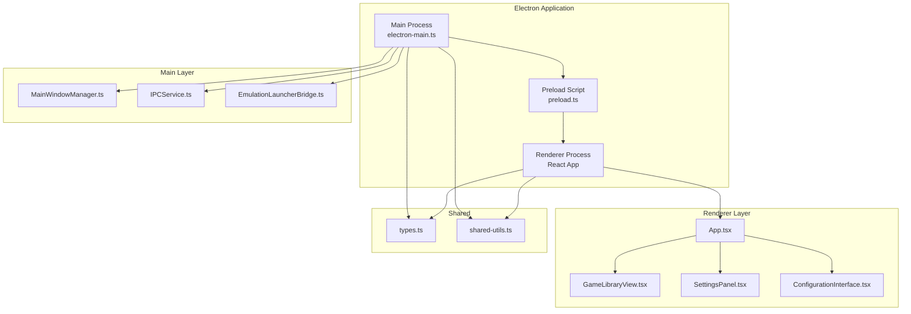
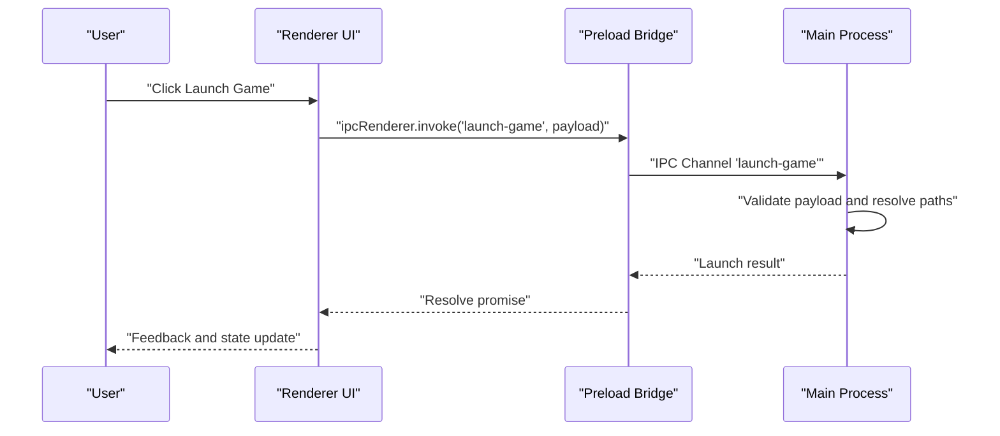
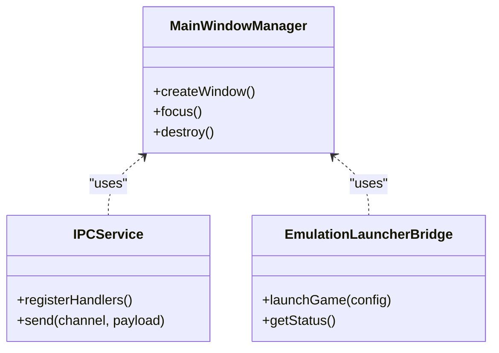
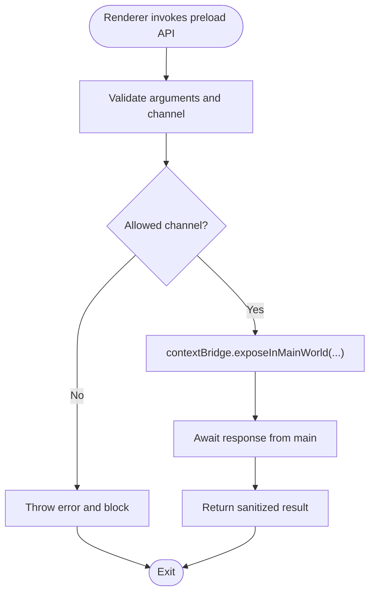
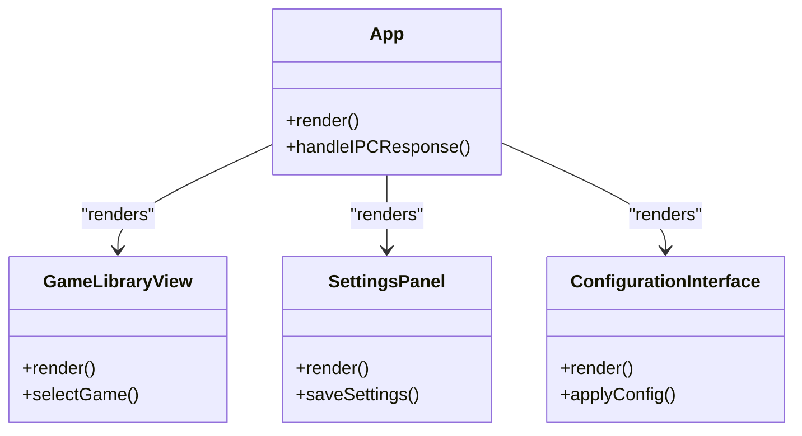
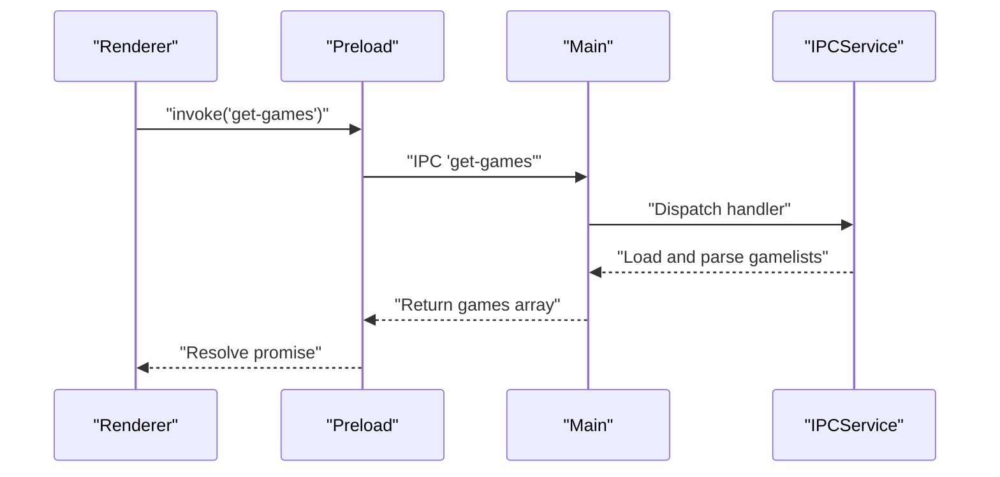
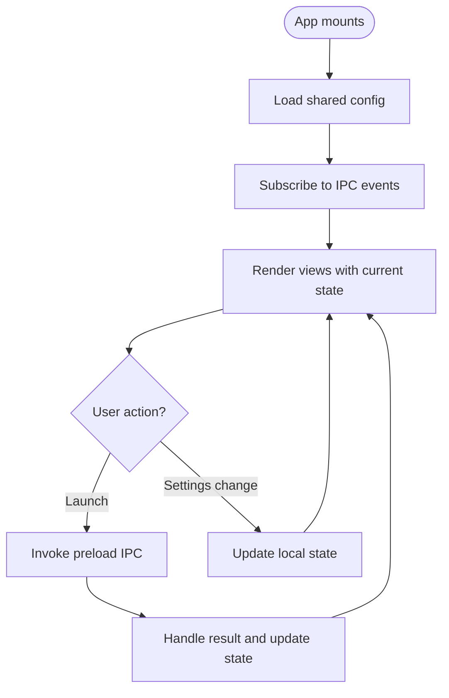
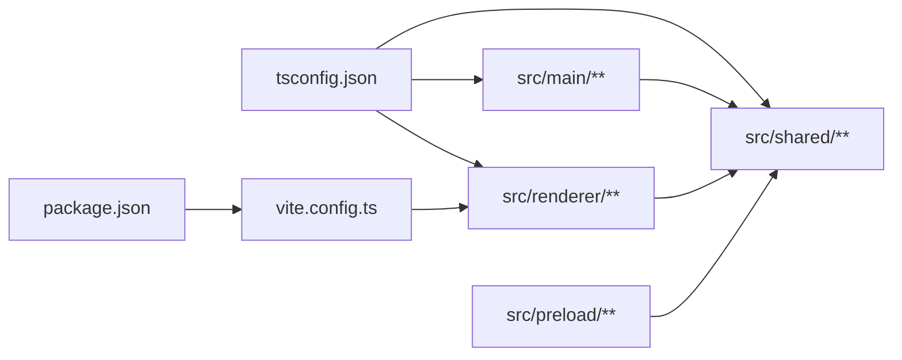

# Frontend Architecture

<cite>
**Referenced Files in This Document**
- [README.md](file://README.md)
- [package.json](file://package.json)
- [tsconfig.json](file://tsconfig.json)
- [vite.config.ts](file://vite.config.ts)
- [electron-main.ts](file://src/main/electron-main.ts)
- [preload.ts](file://src/preload/preload.ts)
- [renderer-index.tsx](file://src/renderer/index.tsx)
- [App.tsx](file://src/renderer/App.tsx)
- [GameLibraryView.tsx](file://src/renderer/views/GameLibraryView.tsx)
- [SettingsPanel.tsx](file://src/renderer/views/SettingsPanel.tsx)
- [ConfigurationInterface.tsx](file://src/renderer/components/ConfigurationInterface.tsx)
- [MainWindowManager.ts](file://src/main/MainWindowManager.ts)
- [IPCService.ts](file://src/main/services/IPCService.ts)
- [EmulationLauncherBridge.ts](file://src/main/services/EmulationLauncherBridge.ts)
- [SharedTypes.ts](file://src/shared/types.ts)
- [shared-utils.ts](file://src/shared/utils.ts)
</cite>

## Table of Contents
1. [Introduction](#introduction)
2. [Project Structure](#project-structure)
3. [Core Components](#core-components)
4. [Architecture Overview](#architecture-overview)
5. [Detailed Component Analysis](#detailed-component-analysis)
6. [Dependency Analysis](#dependency-analysis)
7. [Performance Considerations](#performance-considerations)
8. [Troubleshooting Guide](#troubleshooting-guide)
9. [Conclusion](#conclusion)

## Introduction
This document explains the frontend architecture of RIESCADE_SYSTEM, a modern Retro gaming frontend built with Electron, React, and TypeScript. The application follows a dual-process architecture:
- Main process: Handles system-level tasks, window lifecycle, IPC setup, and integration with EmulationStation/RetroBat.
- Renderer process: Implements the React-based UI, manages state, and orchestrates user interactions.

Key goals:
- Seamless integration with EmulationStation/RetroBat configuration and gamelists.
- High-performance UI leveraging modern tooling and animation libraries.
- Robust IPC communication enabling safe and efficient main-renderer collaboration.
- Cross-platform compatibility and efficient resource management.

## Project Structure
The repository organizes code into clear layers:
- src/main: Electron main process logic, window management, and services.
- src/preload: IPC bridge exposing controlled APIs to the renderer.
- src/renderer: React application, views, components, and state management.
- src/shared: Shared TypeScript types and utilities used by both processes.
- Root configuration: package.json, tsconfig.json, and vite.config.ts define build and development settings.

**Diagram sources**
- [electron-main.ts](file://src/main/electron-main.ts)
- [preload.ts](file://src/preload/preload.ts)
- [renderer-index.tsx](file://src/renderer/index.tsx)
- [App.tsx](file://src/renderer/App.tsx)
- [GameLibraryView.tsx](file://src/renderer/views/GameLibraryView.tsx)
- [SettingsPanel.tsx](file://src/renderer/views/SettingsPanel.tsx)
- [ConfigurationInterface.tsx](file://src/renderer/components/ConfigurationInterface.tsx)
- [MainWindowManager.ts](file://src/main/MainWindowManager.ts)
- [IPCService.ts](file://src/main/services/IPCService.ts)
- [EmulationLauncherBridge.ts](file://src/main/services/EmulationLauncherBridge.ts)
- [SharedTypes.ts](file://src/shared/types.ts)
- [shared-utils.ts](file://src/shared/utils.ts)

**Section sources**
- [README.md](file://README.md)
- [package.json](file://package.json)
- [tsconfig.json](file://tsconfig.json)
- [vite.config.ts](file://vite.config.ts)

## Core Components
- Electron Main Process: Initializes the application, creates and manages the main browser window, sets up IPC channels, and integrates with EmulationStation/RetroBat.
- Preload Bridge: Exposes secure, typed APIs to the renderer via contextBridge, limiting exposure surface and preventing direct Node.js access.
- React Renderer: Implements the UI with React components, views for game library and settings, and a configuration interface. Uses TypeScript for type safety and Vite for fast builds.
- Shared Types and Utilities: Define common interfaces and helper functions used across processes.
- Services: IPCService coordinates inter-process messaging; EmulationLauncherBridge handles integration with emulator launchers.

**Section sources**
- [README.md](file://README.md)
- [electron-main.ts](file://src/main/electron-main.ts)
- [preload.ts](file://src/preload/preload.ts)
- [renderer-index.tsx](file://src/renderer/index.tsx)
- [App.tsx](file://src/renderer/App.tsx)
- [SharedTypes.ts](file://src/shared/types.ts)
- [shared-utils.ts](file://src/shared/utils.ts)

## Architecture Overview
The dual-process architecture separates concerns:
- Main process: OS-level operations, window lifecycle, file system access, and integration with external tools.
- Renderer process: UI rendering, user interactions, animations, and state management.

**Diagram sources**
- [preload.ts](file://src/preload/preload.ts)
- [electron-main.ts](file://src/main/electron-main.ts)

## Detailed Component Analysis

### Electron Main Process
Responsibilities:
- Initialize the application and create the main browser window.
- Register IPC handlers for renderer requests.
- Manage window lifecycle and focus behavior.
- Integrate with EmulationStation/RetroBat configuration and gamelists.
- Coordinate with EmulationLauncherBridge for launching emulators.

**Diagram sources**
- [MainWindowManager.ts](file://src/main/MainWindowManager.ts)
- [IPCService.ts](file://src/main/services/IPCService.ts)
- [EmulationLauncherBridge.ts](file://src/main/services/EmulationLauncherBridge.ts)

**Section sources**
- [electron-main.ts](file://src/main/electron-main.ts)
- [MainWindowManager.ts](file://src/main/MainWindowManager.ts)
- [IPCService.ts](file://src/main/services/IPCService.ts)
- [EmulationLauncherBridge.ts](file://src/main/services/EmulationLauncherBridge.ts)

### Preload Bridge (IPC)
Responsibilities:
- Expose a minimal, typed API surface to the renderer using contextBridge.
- Validate and sanitize messages before forwarding to main.
- Prevent direct Node.js and Electron APIs from being exposed to web content.

**Diagram sources**
- [preload.ts](file://src/preload/preload.ts)

**Section sources**
- [preload.ts](file://src/preload/preload.ts)

### React Renderer (App Shell)
Responsibilities:
- Host top-level routing and layout.
- Render views: GameLibraryView, SettingsPanel, and ConfigurationInterface.
- Manage global state and pass props to child components.
- Coordinate with preload bridge for IPC calls.

**Diagram sources**
- [App.tsx](file://src/renderer/App.tsx)
- [GameLibraryView.tsx](file://src/renderer/views/GameLibraryView.tsx)
- [SettingsPanel.tsx](file://src/renderer/views/SettingsPanel.tsx)
- [ConfigurationInterface.tsx](file://src/renderer/components/ConfigurationInterface.tsx)

**Section sources**
- [renderer-index.tsx](file://src/renderer/index.tsx)
- [App.tsx](file://src/renderer/App.tsx)
- [GameLibraryView.tsx](file://src/renderer/views/GameLibraryView.tsx)
- [SettingsPanel.tsx](file://src/renderer/views/SettingsPanel.tsx)
- [ConfigurationInterface.tsx](file://src/renderer/components/ConfigurationInterface.tsx)

### IPC Communication Patterns
Patterns:
- Request-response via ipcRenderer.invoke and main-side handle registration.
- Event-driven updates via ipcRenderer.on for continuous streams (e.g., progress, logs).
- Centralized IPCService to register and manage channels, ensuring consistency and type safety.

**Diagram sources**
- [preload.ts](file://src/preload/preload.ts)
- [IPCService.ts](file://src/main/services/IPCService.ts)

**Section sources**
- [preload.ts](file://src/preload/preload.ts)
- [IPCService.ts](file://src/main/services/IPCService.ts)

### State Management and Event Handling
Approaches:
- React hooks for local component state (useState, useEffect).
- Centralized IPC events for cross-component updates (e.g., launch status).
- Shared types ensure consistent state shapes across processes.

**Diagram sources**
- [App.tsx](file://src/renderer/App.tsx)
- [SharedTypes.ts](file://src/shared/types.ts)

**Section sources**
- [App.tsx](file://src/renderer/App.tsx)
- [SharedTypes.ts](file://src/shared/types.ts)

### Integration with EmulationStation/RetroBat
Integration points:
- Configuration parsing and gamelist loading aligned with ES/RetroBat standards.
- Direct integration with emulatorLauncher.exe for launching titles.
- Path resolution relative to the application’s location within the RetroBat installation.

Practical examples:
- Loading systems and games from ES/RetroBat configuration files.
- Resolving ROM paths and metadata for display and launch.
- Applying emulator-specific settings through EmulationLauncherBridge.

**Section sources**
- [README.md](file://README.md)
- [EmulationLauncherBridge.ts](file://src/main/services/EmulationLauncherBridge.ts)

## Dependency Analysis
High-level dependencies:
- Main process depends on services and window manager.
- Preload depends on shared types and exposes a typed contract to renderer.
- Renderer depends on React, shared types, and preload bridge.
- Shared types and utilities are consumed by both main and renderer.

**Diagram sources**
- [tsconfig.json](file://tsconfig.json)
- [package.json](file://package.json)
- [vite.config.ts](file://vite.config.ts)
- [SharedTypes.ts](file://src/shared/types.ts)

**Section sources**
- [tsconfig.json](file://tsconfig.json)
- [package.json](file://package.json)
- [vite.config.ts](file://vite.config.ts)
- [SharedTypes.ts](file://src/shared/types.ts)

## Performance Considerations
- Keep renderer UI reactive and avoid heavy synchronous operations on the main thread.
- Use IPC batching for frequent updates (e.g., progress bars) to reduce overhead.
- Leverage Vite’s hot module replacement during development and optimized builds for production.
- Minimize asset sizes and split bundles where appropriate.
- Use lazy loading for views and components not immediately needed.
- Monitor memory usage and dispose of listeners and timers on unmount.

[No sources needed since this section provides general guidance]

## Troubleshooting Guide
Common issues and resolutions:
- IPC channel not found: Verify channel names and handler registration in IPCService.
- Preload bridge errors: Ensure contextBridge exposure and argument validation in preload.
- Window not focusing: Confirm MainWindowManager focus logic and event wiring.
- Build failures: Check Vite and TypeScript configurations for missing dependencies or incorrect paths.

**Section sources**
- [IPCService.ts](file://src/main/services/IPCService.ts)
- [preload.ts](file://src/preload/preload.ts)
- [MainWindowManager.ts](file://src/main/MainWindowManager.ts)
- [vite.config.ts](file://vite.config.ts)
- [tsconfig.json](file://tsconfig.json)

## Conclusion
RIESCADE_SYSTEM’s frontend leverages a clean dual-process architecture with Electron, a robust React renderer, and a strongly-typed IPC bridge. The design emphasizes integration with EmulationStation/RetroBat, maintainable component hierarchies, and scalable IPC patterns. Following the outlined practices ensures reliable performance, cross-platform compatibility, and a smooth user experience.