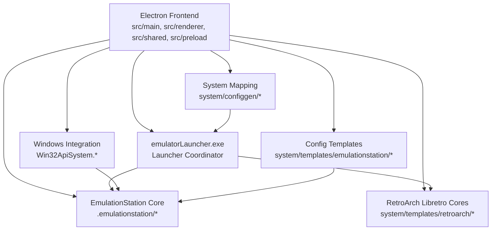
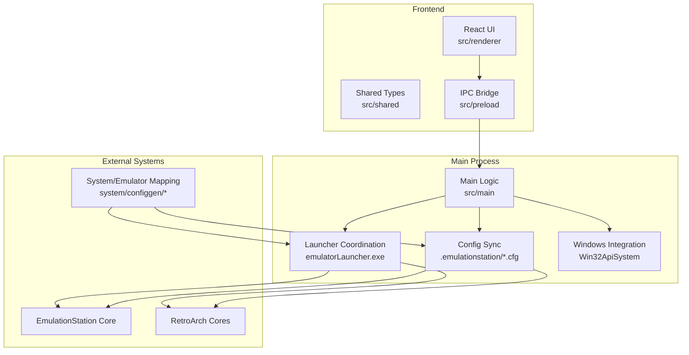
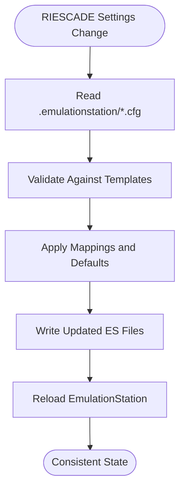
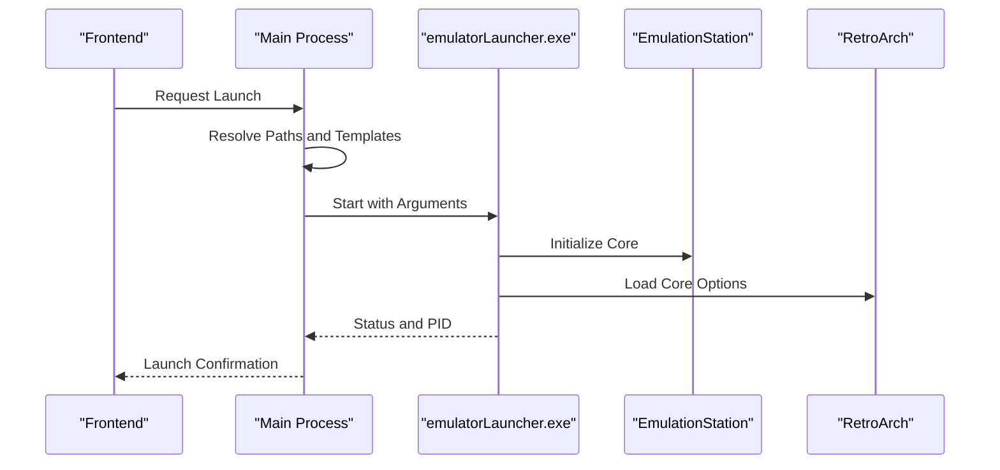
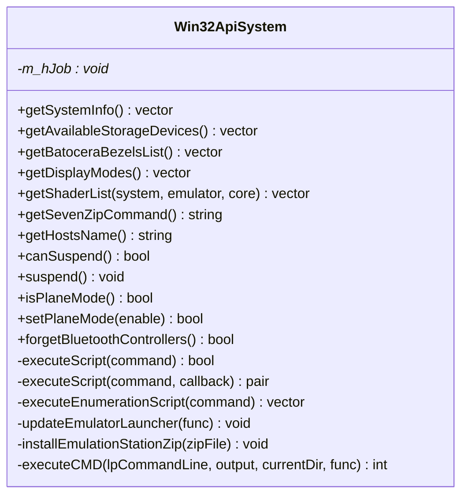
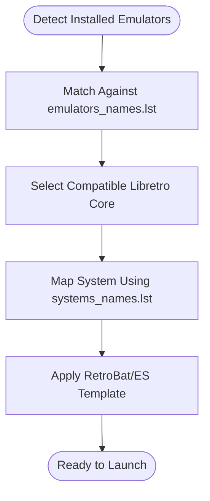
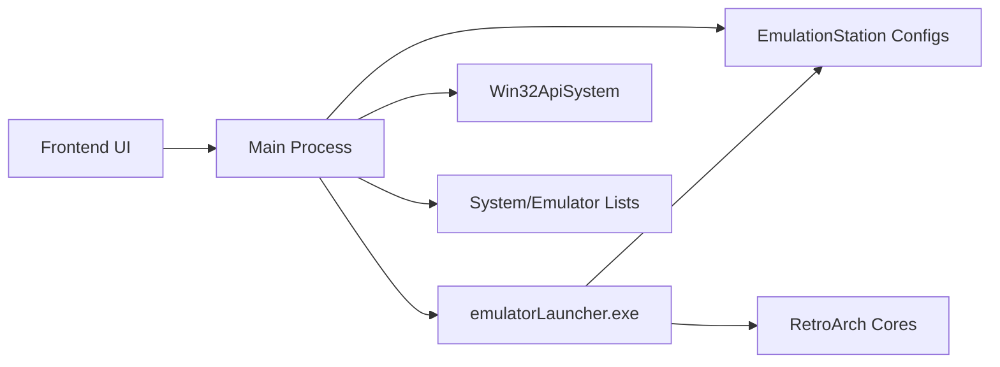
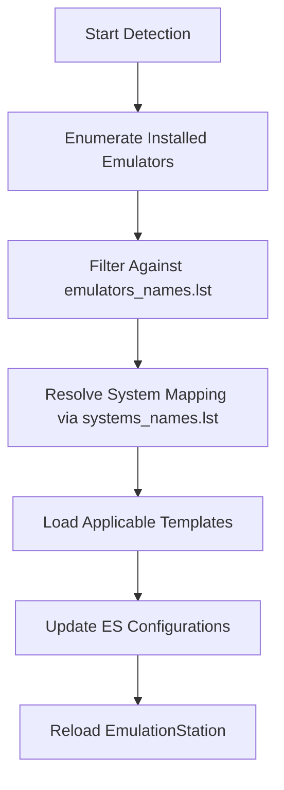
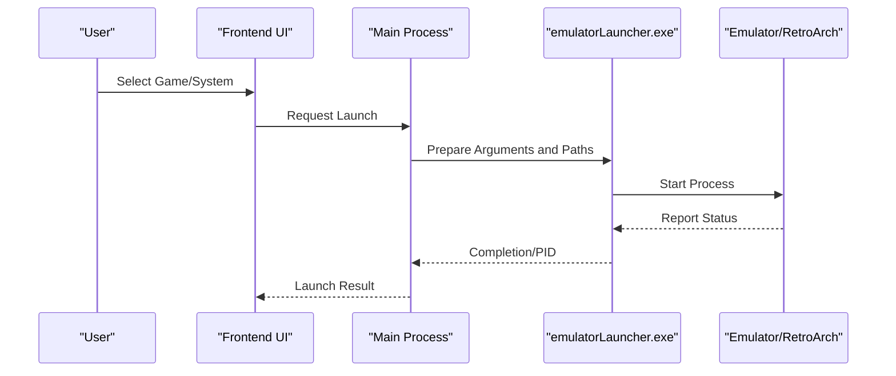
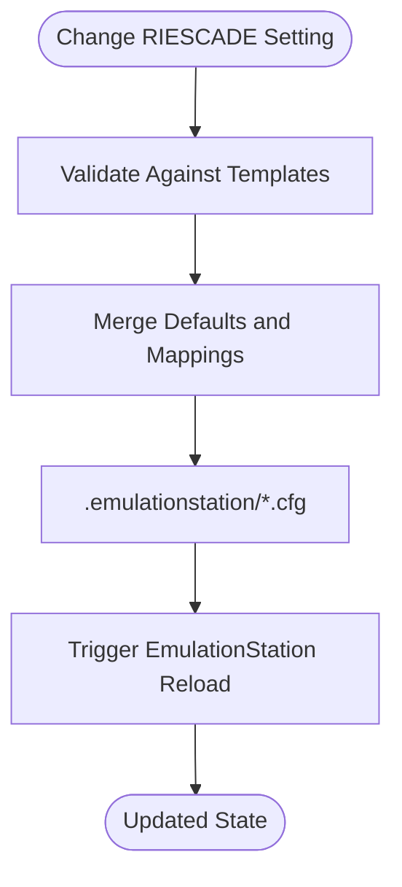

# Integration Layer

<cite>
**Referenced Files in This Document**
- [README.md](file://README.md)
- [emulatorLauncher.cfg](file://emulationstation/emulatorLauncher.cfg)
- [retrobat.ini](file://retrobat.ini)
- [emulatorLauncher.exe](file://emulationstation/emulatorLauncher.exe)
- [Win32ApiSystem.h](file://emulationstation/.riescade/src/docs/es_src/Win32ApiSystem.h)
- [Win32ApiSystem.cpp](file://emulationstation/.riescade/src/docs/es_src/Win32ApiSystem.cpp)
- [emulators_names.lst](file://system/configgen/emulators_names.lst)
- [systems_names.lst](file://system/configgen/systems_names.lst)
- [es_settings.cfg](file://emulationstation/.emulationstation/es_settings.cfg)
- [es_systems.cfg](file://emulationstation/.emulationstation/es_systems.cfg)
- [es_input.cfg](file://emulationstation/.emulationstation/es_input.cfg)
- [es_padtokey.cfg](file://emulationstation/.emulationstation/es_padtokey.cfg)
- [es_savestates.cfg](file://emulationstation/.emulationstation/es_savestates.cfg)
- [retrobat_template.ini](file://system/resources/retrobat_template.ini)
- [batocera-store.cfg](file://emulationstation/batocera-store.cfg)
</cite>

## Table of Contents
1. [Introduction](#introduction)
2. [Project Structure](#project-structure)
3. [Core Components](#core-components)
4. [Architecture Overview](#architecture-overview)
5. [Detailed Component Analysis](#detailed-component-analysis)
6. [Dependency Analysis](#dependency-analysis)
7. [Performance Considerations](#performance-considerations)
8. [Troubleshooting Guide](#troubleshooting-guide)
9. [Conclusion](#conclusion)
10. [Appendices](#appendices)

## Introduction
This document describes the integration layer of RIESCADE_SYSTEM that connects the frontend with EmulationStation core, RetroArch libretro cores, and emulatorLauncher.exe. It explains system integration services including Windows API bindings, DirectX-related capabilities, and hardware detection. It also documents configuration synchronization between RIESCADE settings and EmulationStation files (.cfg, .xml), IPC communication patterns, process management, and external tool coordination. Practical examples illustrate system detection workflows, emulator launching sequences, and configuration propagation. Finally, it covers Windows service and registry operations, hardware device management, error handling strategies, fallback mechanisms, compatibility across Windows versions, and integration testing approaches.

## Project Structure
RIESCADE_SYSTEM is organized around an Electron-based frontend integrated with EmulationStation and RetroBat tooling. The integration layer centers on:
- Frontend entry and build instructions
- EmulationStation configuration and launcher coordination
- Windows-specific system integration via Win32 APIs
- Configuration templates and synchronization with ES files
- Tooling for emulator selection and system mapping

**Diagram sources**
- [README.md:34-44](file://README.md#L34-L44)
- [emulatorLauncher.cfg:1-12](file://emulationstation/emulatorLauncher.cfg#L1-L12)
- [Win32ApiSystem.h:40-69](file://emulationstation/.riescade/src/docs/es_src/Win32ApiSystem.h#L40-L69)
- [Win32ApiSystem.cpp:421-1027](file://emulationstation/.riescade/src/docs/es_src/Win32ApiSystem.cpp#L421-L1027)
- [retrobat_template.ini](file://system/resources/retrobat_template.ini)

**Section sources**
- [README.md:1-44](file://README.md#L1-L44)
- [emulatorLauncher.cfg:1-12](file://emulationstation/emulatorLauncher.cfg#L1-L12)

## Core Components
- EmulationStation configuration synchronization: The frontend reads and writes EmulationStation settings and system files to maintain parity with RIESCADE preferences.
- emulatorLauncher.exe coordination: Centralized launcher that orchestrates emulator execution, passing arguments derived from RIESCADE configuration and system mapping.
- Windows integration services: Hardware detection, display enumeration, and OS-level operations exposed via Win32 APIs.
- Configuration templates and synchronization: RetroBat/ES-compatible templates drive consistent configuration propagation across EmulationStation and RetroArch.
- System mapping and emulator discovery: Lists of supported emulators and systems guide launcher decisions and template application.

**Section sources**
- [es_settings.cfg](file://emulationstation/.emulationstation/es_settings.cfg)
- [es_systems.cfg](file://emulationstation/.emulationstation/es_systems.cfg)
- [emulatorLauncher.cfg:1-12](file://emulationstation/emulatorLauncher.cfg#L1-12)
- [Win32ApiSystem.h:40-69](file://emulationstation/.riescade/src/docs/es_src/Win32ApiSystem.h#L40-L69)
- [Win32ApiSystem.cpp:421-1027](file://emulationstation/.riescade/src/docs/es_src/Win32ApiSystem.cpp#L421-L1027)
- [emulators_names.lst:1-130](file://system/configgen/emulators_names.lst#L1-L130)
- [systems_names.lst:1-241](file://system/configgen/systems_names.lst#L1-L241)

## Architecture Overview
The integration layer follows a layered pattern:
- Frontend layer (Electron) manages UI state and IPC with the main process.
- Main process coordinates configuration synchronization, process orchestration, and Windows integration.
- External tooling (emulatorLauncher.exe) executes emulators and RetroArch cores with validated parameters.
- Configuration templates and system mapping ensure consistent behavior across platforms and versions.

**Diagram sources**
- [README.md:36-39](file://README.md#L36-L39)
- [emulatorLauncher.cfg:1-12](file://emulationstation/emulatorLauncher.cfg#L1-L12)
- [Win32ApiSystem.h:40-69](file://emulationstation/.riescade/src/docs/es_src/Win32ApiSystem.h#L40-L69)
- [Win32ApiSystem.cpp:421-1027](file://emulationstation/.riescade/src/docs/es_src/Win32ApiSystem.cpp#L421-L1027)
- [emulators_names.lst:1-130](file://system/configgen/emulators_names.lst#L1-L130)
- [systems_names.lst:1-241](file://system/configgen/systems_names.lst#L1-L241)

## Detailed Component Analysis

### EmulationStation Configuration Synchronization
RIESCADE synchronizes settings and system definitions with EmulationStation files:
- es_settings.cfg: Global UI and runtime settings for EmulationStation.
- es_systems.cfg: System definitions and launch commands.
- es_input.cfg and related input files: Input mapping and hotkeys.
- es_padtokey.cfg and es_savestates.cfg: Additional input and save-state mappings.

The synchronization ensures that RIESCADE’s configuration choices propagate into EmulationStation, maintaining consistent behavior across sessions.

**Section sources**
- [es_settings.cfg](file://emulationstation/.emulationstation/es_settings.cfg)
- [es_systems.cfg](file://emulationstation/.emulationstation/es_systems.cfg)
- [es_input.cfg](file://emulationstation/.emulationstation/es_input.cfg)
- [es_padtokey.cfg](file://emulationstation/.emulationstation/es_padtokey.cfg)
- [es_savestates.cfg](file://emulationstation/.emulationstation/es_savestates.cfg)

### emulatorLauncher.exe Coordination
emulatorLauncher.exe centralizes emulator launching and configuration:
- Path resolution: Uses emulatorLauncher.cfg to locate shared directories (bios, saves, screenshots, shaders, decorations).
- Process orchestration: Executes emulators and RetroArch cores with validated arguments.
- Template-driven configuration: Applies RetroBat/ES templates to ensure compatibility.

**Diagram sources**
- [emulatorLauncher.cfg:1-12](file://emulationstation/emulatorLauncher.cfg#L1-L12)
- [retrobat_template.ini](file://system/resources/retrobat_template.ini)

**Section sources**
- [emulatorLauncher.cfg:1-12](file://emulationstation/emulatorLauncher.cfg#L1-L12)
- [retrobat_template.ini](file://system/resources/retrobat_template.ini)

### Windows Integration Services (Win32 APIs)
The Windows integration exposes hardware detection and OS-level capabilities:
- CPU, memory, and storage device discovery
- Display mode enumeration (resolution, refresh rate, color depth)
- Script execution hooks for system tasks
- Suspend and airplane mode toggles (platform-specific behaviors)

**Diagram sources**
- [Win32ApiSystem.h:40-69](file://emulationstation/.riescade/src/docs/es_src/Win32ApiSystem.h#L40-L69)
- [Win32ApiSystem.cpp:421-1027](file://emulationstation/.riescade/src/docs/es_src/Win32ApiSystem.cpp#L421-L1027)

**Section sources**
- [Win32ApiSystem.h:40-69](file://emulationstation/.riescade/src/docs/es_src/Win32ApiSystem.h#L40-L69)
- [Win32ApiSystem.cpp:421-1027](file://emulationstation/.riescade/src/docs/es_src/Win32ApiSystem.cpp#L421-L1027)

### System Detection and Mapping
RIESCADE relies on curated lists to discover supported emulators and systems:
- emulators_names.lst: List of recognized emulators for template and launcher selection.
- systems_names.lst: List of supported systems for mapping and gamelist generation.

These lists guide the integration layer to select appropriate cores, templates, and launch parameters.

**Section sources**
- [emulators_names.lst:1-130](file://system/configgen/emulators_names.lst#L1-L130)
- [systems_names.lst:1-241](file://system/configgen/systems_names.lst#L1-L241)

### Configuration Propagation Examples
- Global UI and runtime settings: es_settings.cfg is synchronized with RIESCADE preferences.
- System definitions and launch commands: es_systems.cfg reflects system mappings and emulator choices.
- Input and save-state mappings: es_input.cfg, es_padtokey.cfg, and es_savestates.cfg ensure consistent input behavior.

Practical propagation steps:
- On configuration change, validate against templates.
- Apply defaults and mappings.
- Write updated ES files.
- Trigger EmulationStation reload.

**Section sources**
- [es_settings.cfg](file://emulationstation/.emulationstation/es_settings.cfg)
- [es_systems.cfg](file://emulationstation/.emulationstation/es_systems.cfg)
- [es_input.cfg](file://emulationstation/.emulationstation/es_input.cfg)
- [es_padtokey.cfg](file://emulationstation/.emulationstation/es_padtokey.cfg)
- [es_savestates.cfg](file://emulationstation/.emulationstation/es_savestates.cfg)

### IPC Communication Patterns
The Electron architecture separates concerns:
- Main process handles heavy lifting (configuration sync, process management, Windows integration).
- Renderer renders UI and interacts with main via IPC.
- Preload script bridges renderer and main safely.

Typical flows:
- Renderer requests launch → Main validates and invokes emulatorLauncher.exe → Main reports status back to Renderer.
- Renderer requests hardware info → Main queries Win32ApiSystem → Main returns results to Renderer.

**Section sources**
- [README.md:36-39](file://README.md#L36-L39)

### Process Management and External Tool Coordination
- Job object management for process groups.
- Command execution with optional callbacks and working directory control.
- Launcher updates and EmulationStation zip installation routines.

Operational highlights:
- Use job objects to group child processes for coordinated termination.
- Execute shell commands with structured output capture.
- Update launcher binaries and reinstall EmulationStation packages when needed.

**Section sources**
- [Win32ApiSystem.h:40-69](file://emulationstation/.riescade/src/docs/es_src/Win32ApiSystem.h#L40-L69)
- [Win32ApiSystem.cpp:421-1027](file://emulationstation/.riescade/src/docs/es_src/Win32ApiSystem.cpp#L421-L1027)

### Windows Services, Registry, and Hardware Device Management
- Autostart and startup delay controls are configured via retrobat.ini.
- WiimoteGun integration at startup is controlled via retrobat.ini.
- Hardware detection includes CPU, memory, and display modes.
- Bluetooth controller management and airplane mode toggles are exposed.

Operational highlights:
- RetroBat global configuration governs autostart behavior and intro video settings.
- Windows integration provides display enumeration and shader list discovery.
- Script execution hooks support system-level automation.

**Section sources**
- [retrobat.ini:1-94](file://retrobat.ini#L1-L94)
- [Win32ApiSystem.cpp:421-1027](file://emulationstation/.riescade/src/docs/es_src/Win32ApiSystem.cpp#L421-L1027)

## Dependency Analysis
The integration layer exhibits clear separation of concerns:
- Frontend depends on main process for heavy operations.
- Main process depends on emulatorLauncher.exe for execution.
- Main process depends on Windows integration for hardware and OS-level features.
- Configuration templates and system mapping underpin launcher and ES synchronization.

**Diagram sources**
- [README.md:36-39](file://README.md#L36-L39)
- [emulatorLauncher.cfg:1-12](file://emulationstation/emulatorLauncher.cfg#L1-L12)
- [Win32ApiSystem.h:40-69](file://emulationstation/.riescade/src/docs/es_src/Win32ApiSystem.h#L40-L69)
- [Win32ApiSystem.cpp:421-1027](file://emulationstation/.riescade/src/docs/es_src/Win32ApiSystem.cpp#L421-L1027)
- [emulators_names.lst:1-130](file://system/configgen/emulators_names.lst#L1-L130)
- [systems_names.lst:1-241](file://system/configgen/systems_names.lst#L1-L241)

**Section sources**
- [README.md:36-39](file://README.md#L36-L39)
- [emulatorLauncher.cfg:1-12](file://emulationstation/emulatorLauncher.cfg#L1-L12)
- [Win32ApiSystem.h:40-69](file://emulationstation/.riescade/src/docs/es_src/Win32ApiSystem.h#L40-L69)
- [Win32ApiSystem.cpp:421-1027](file://emulationstation/.riescade/src/docs/es_src/Win32ApiSystem.cpp#L421-L1027)
- [emulators_names.lst:1-130](file://system/configgen/emulators_names.lst#L1-L130)
- [systems_names.lst:1-241](file://system/configgen/systems_names.lst#L1-L241)

## Performance Considerations
- Minimize repeated file I/O by batching configuration writes and deferring EmulationStation reloads.
- Cache hardware and display mode enumerations to avoid frequent Win32 API calls.
- Use job objects to efficiently manage emulator processes and prevent orphaned processes.
- Prefer asynchronous script execution with callbacks to keep the UI responsive.

## Troubleshooting Guide
Common issues and strategies:
- Configuration drift: Verify es_settings.cfg and es_systems.cfg synchronization against templates; re-apply defaults if needed.
- Launcher failures: Confirm emulatorLauncher.exe paths and arguments; check emulatorLauncher.log for errors.
- Hardware detection anomalies: Re-run display mode enumeration and verify Win32 API calls; ensure required privileges.
- Autostart problems: Review retrobat.ini settings for Autostart and AutoStartDelay; test with elevated privileges.
- Compatibility across Windows versions: Validate DirectX and shader support; fall back to compatible renderers when necessary.

**Section sources**
- [retrobat.ini:1-94](file://retrobat.ini#L1-L94)
- [emulatorLauncher.cfg:1-12](file://emulationstation/emulatorLauncher.cfg#L1-L12)
- [Win32ApiSystem.cpp:421-1027](file://emulationstation/.riescade/src/docs/es_src/Win32ApiSystem.cpp#L421-L1027)

## Conclusion
RIESCADE_SYSTEM’s integration layer provides a robust bridge between the Electron frontend and EmulationStation/RetroBat ecosystems. Through centralized launcher coordination, Windows integration services, and strict configuration synchronization, it ensures reliable emulator launching, consistent user experiences, and maintainable system behavior across diverse environments.

## Appendices

### Practical Workflows

#### System Detection Workflow

**Section sources**
- [emulators_names.lst:1-130](file://system/configgen/emulators_names.lst#L1-L130)
- [systems_names.lst:1-241](file://system/configgen/systems_names.lst#L1-L241)
- [es_systems.cfg](file://emulationstation/.emulationstation/es_systems.cfg)

#### Emulator Launching Sequence

**Section sources**
- [emulatorLauncher.cfg:1-12](file://emulationstation/emulatorLauncher.cfg#L1-L12)
- [README.md:10](file://README.md#L10)

#### Configuration Propagation Example

**Section sources**
- [es_settings.cfg](file://emulationstation/.emulationstation/es_settings.cfg)
- [es_systems.cfg](file://emulationstation/.emulationstation/es_systems.cfg)
- [retrobat_template.ini](file://system/resources/retrobat_template.ini)

### Integration Testing Approaches
- Unit tests for configuration parsing and template merging.
- End-to-end tests for emulator launching and ES reload triggers.
- Hardware detection tests across different Windows versions and GPUs.
- Regression tests for launcher argument validation and path resolution.
- Compatibility tests for various libretro cores and emulator versions.