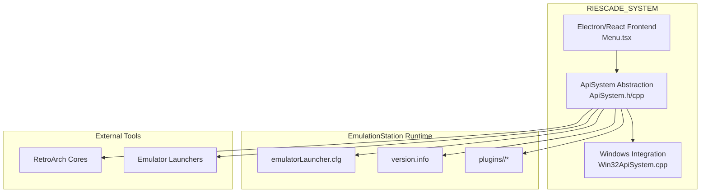
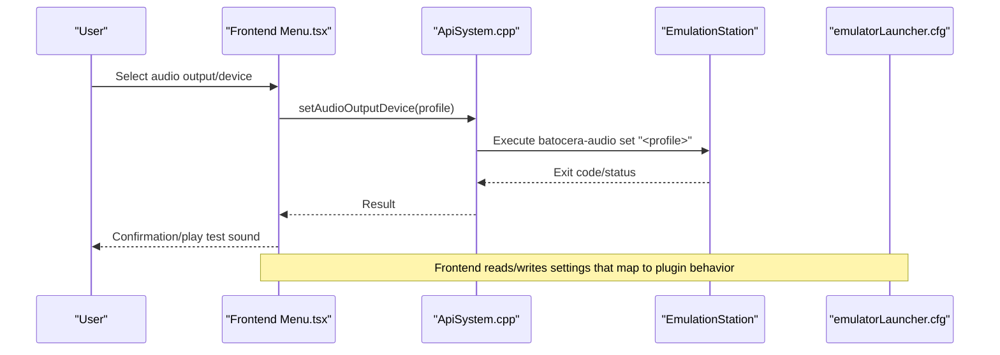
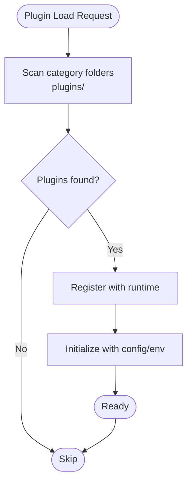
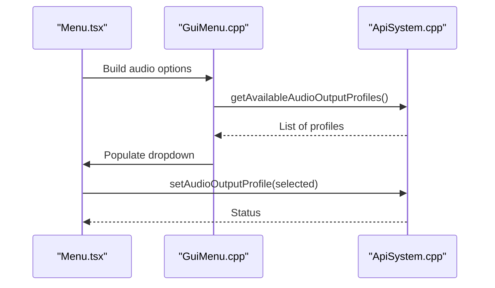
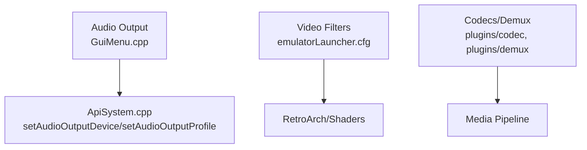
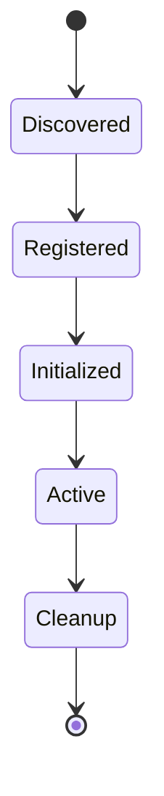
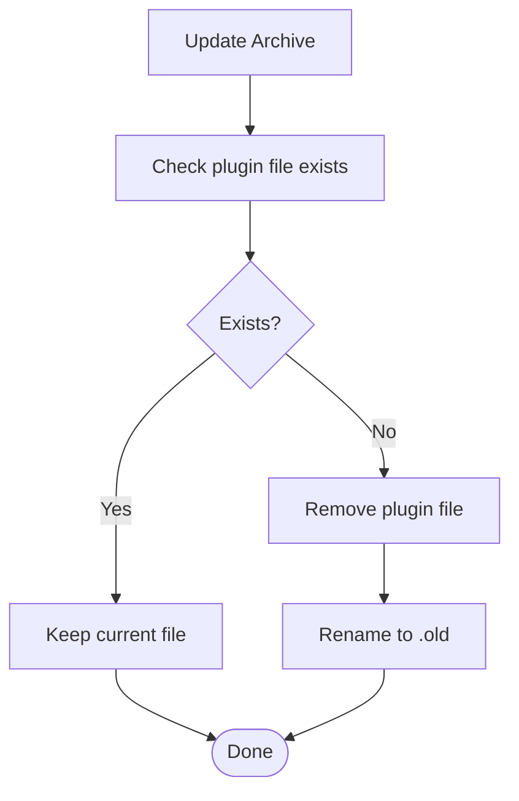
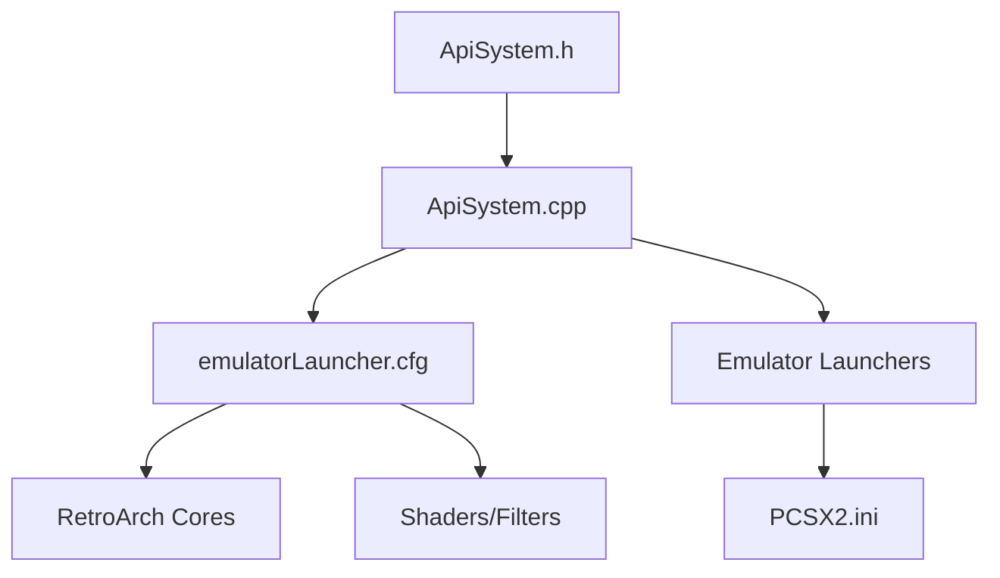
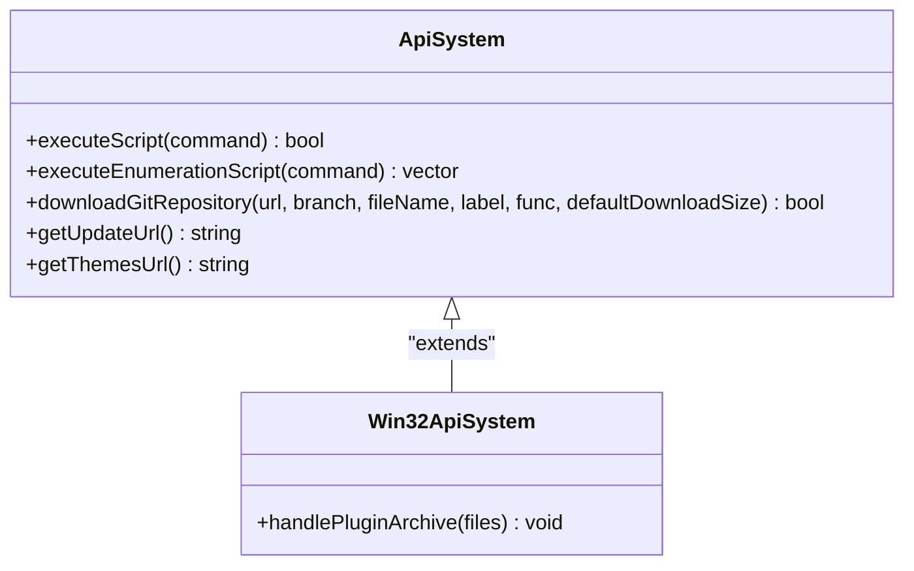
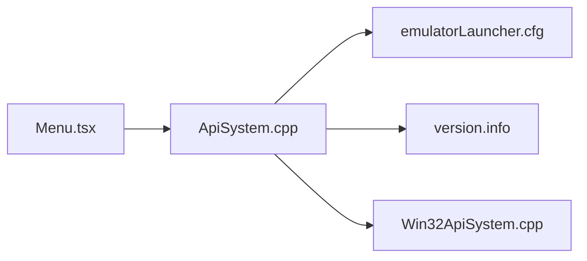

# Plugin System

<cite>
**Referenced Files in This Document**
- [README.md](file://README.md)
- [emulationstation/version.info](file://emulationstation/version.info)
- [emulationstation/emulatorLauncher.cfg](file://emulationstation/emulatorLauncher.cfg)
- [emulationstation/.riescade/src/docs/es_src/ApiSystem.h](file://emulationstation/.riescade/src/docs/es_src/ApiSystem.h)
- [emulationstation/.riescade/src/docs/es_src/ApiSystem.cpp](file://emulationstation/.riescade/src/docs/es_src/ApiSystem.cpp)
- [emulationstation/.riescade/src/docs/es_src/Win32ApiSystem.cpp](file://emulationstation/.riescade/src/docs/es_src/Win32ApiSystem.cpp)
- [emulationstation/.riescade/src/docs/es_src/guis/GuiMenu.cpp](file://emulationstation/.riescade/src/docs/es_src/guis/GuiMenu.cpp)
- [emulationstation/.riescade/src/src/renderer/src/components/Menu.tsx](file://emulationstation/.riescade/src/src/renderer/src/components/Menu.tsx)
- [system/templates/pcsx2/inis/PCSX2.ini](file://system/templates/pcsx2/inis/PCSX2.ini)
</cite>

## Table of Contents
1. [Introduction](#introduction)
2. [Project Structure](#project-structure)
3. [Core Components](#core-components)
4. [Architecture Overview](#architecture-overview)
5. [Detailed Component Analysis](#detailed-component-analysis)
6. [Dependency Analysis](#dependency-analysis)
7. [Performance Considerations](#performance-considerations)
8. [Troubleshooting Guide](#troubleshooting-guide)
9. [Conclusion](#conclusion)
10. [Appendices](#appendices)

## Introduction
This document describes the extensible plugin architecture of RIESCADE_SYSTEM, focusing on how plugins are organized, discovered, loaded, and integrated with EmulationStation’s runtime and external tools. It covers plugin categories (audio outputs, video filters, codecs, input handlers, and others), lifecycle management, dependency resolution, conflict handling, and integration touchpoints with EmulationStation, RetroArch cores, and emulator-specific extensions. It also provides practical guidance for plugin development, installation, configuration, security, performance, and compatibility verification.

RIESCADE_SYSTEM is a modern frontend built on Electron, React, and TypeScript, designed to integrate tightly with EmulationStation and emulator launchers. The repository includes a dedicated plugins directory under emulationstation/plugins with categorized plugin folders for audio outputs, codecs, demuxers, video filters, and more.

**Section sources**
- [README.md:1-44](file://README.md#L1-L44)

## Project Structure
The plugin system is primarily located under emulationstation/plugins, with category-specific subfolders. The frontend integrates with EmulationStation via ApiSystem abstractions and leverages configuration files to manage paths and behaviors.

Key areas:
- Plugins directory: emulationstation/plugins with subfolders for categories such as audio_output, codec, demux, video_filter, video_output, video_chroma, d3d11, access.
- EmulationStation configuration: emulationstation/emulatorLauncher.cfg defines paths for BIOS, saves, shaders, video filters, decorations, and related assets.
- Versioning: emulationstation/version.info indicates the platform build version.
- Frontend integration: RIESCADE_SYSTEM’s Electron/React UI interacts with EmulationStation APIs and settings.

**Diagram sources**
- [emulationstation/emulatorLauncher.cfg:1-12](file://emulationstation/emulatorLauncher.cfg#L1-L12)
- [emulationstation/version.info:1-1](file://emulationstation/version.info#L1-L1)
- [emulationstation/.riescade/src/docs/es_src/ApiSystem.h:384-411](file://emulationstation/.riescade/src/docs/es_src/ApiSystem.h#L384-L411)
- [emulationstation/.riescade/src/docs/es_src/ApiSystem.cpp:753-829](file://emulationstation/.riescade/src/docs/es_src/ApiSystem.cpp#L753-L829)
- [emulationstation/.riescade/src/docs/es_src/Win32ApiSystem.cpp:688-725](file://emulationstation/.riescade/src/docs/es_src/Win32ApiSystem.cpp#L688-L725)
- [emulationstation/.riescade/src/src/renderer/src/components/Menu.tsx:1083-1108](file://emulationstation/.riescade/src/src/renderer/src/components/Menu.tsx#L1083-L1108)

**Section sources**
- [README.md:34-44](file://README.md#L34-L44)
- [emulationstation/emulatorLauncher.cfg:1-12](file://emulationstation/emulatorLauncher.cfg#L1-L12)
- [emulationstation/version.info:1-1](file://emulationstation/version.info#L1-L1)

## Core Components
- Plugin categories: The plugins directory organizes plugins by function:
  - audio_output: Audio output devices and drivers.
  - codec: Media codecs for decoding/encoding.
  - demux: Demultiplexers for container formats.
  - video_filter: Video filters and effects.
  - video_output: Video output backends.
  - video_chroma: Chroma subsampling and color correction.
  - d3d11: DirectX 11 renderers.
  - access: Access control and input handler plugins.
- EmulationStation configuration: emulatorLauncher.cfg centralizes paths for BIOS, saves, screenshots, shaders, video filters, decorations, and achievements sound packs.
- Frontend settings: Menu.tsx exposes configurable settings for audio resampler and quality, aligning with plugin-driven audio pipelines.
- Audio device/profile management: GuiMenu.cpp and ApiSystem.cpp expose selection and enumeration of audio outputs and profiles, integrating with batocera-audio commands on non-Windows platforms.

**Section sources**
- [emulationstation/emulatorLauncher.cfg:1-12](file://emulationstation/emulatorLauncher.cfg#L1-L12)
- [emulationstation/.riescade/src/src/renderer/src/components/Menu.tsx:1083-1108](file://emulationstation/.riescade/src/src/renderer/src/components/Menu.tsx#L1083-L1108)
- [emulationstation/.riescade/src/docs/es_src/guis/GuiMenu.cpp:1623-1715](file://emulationstation/.riescade/src/docs/es_src/guis/GuiMenu.cpp#L1623-L1715)
- [emulationstation/.riescade/src/docs/es_src/ApiSystem.cpp:753-829](file://emulationstation/.riescade/src/docs/es_src/ApiSystem.cpp#L753-L829)

## Architecture Overview
The plugin architecture centers on:
- Discovery: Plugins are located under emulationstation/plugins/<category>.
- Registration: Plugins are registered via category-specific loaders and configuration hooks.
- Lifecycle: Plugins are initialized, configured, and disposed according to frontend/runtime needs.
- Integration: Frontend settings and EmulationStation configuration coordinate with external tools (RetroArch, emulator launchers).

**Diagram sources**
- [emulationstation/.riescade/src/src/renderer/src/components/Menu.tsx:1083-1108](file://emulationstation/.riescade/src/src/renderer/src/components/Menu.tsx#L1083-L1108)
- [emulationstation/.riescade/src/docs/es_src/ApiSystem.cpp:753-829](file://emulationstation/.riescade/src/docs/es_src/ApiSystem.cpp#L753-L829)
- [emulationstation/.riescade/src/docs/es_src/guis/GuiMenu.cpp:1623-1715](file://emulationstation/.riescade/src/docs/es_src/guis/GuiMenu.cpp#L1623-L1715)
- [emulationstation/emulatorLauncher.cfg:1-12](file://emulationstation/emulatorLauncher.cfg#L1-L12)

## Detailed Component Analysis

### Plugin Categories and Responsibilities
- audio_output: Manages audio output devices and profiles. Integrated via GUI selections and ApiSystem calls.
- codec: Provides decoding/encoding capabilities for media containers.
- demux: Handles container demultiplexing for various formats.
- video_filter: Applies video post-processing and effects.
- video_output: Controls video output backends and presentation.
- video_chroma: Implements chroma subsampling and color correction.
- d3d11: DirectX 11-based rendering plugins.
- access: Input handler and access control plugins.

These categories are organized under emulationstation/plugins/<category>, enabling modular discovery and registration.

**Section sources**
- [emulationstation/emulatorLauncher.cfg:1-12](file://emulationstation/emulatorLauncher.cfg#L1-L12)

### Plugin Loading Mechanisms
- Discovery: Plugins are discovered by scanning category folders under emulationstation/plugins.
- Registration: Category-specific loaders register plugins with the runtime. While explicit loader code is not shown here, the presence of category folders implies a structured registration pattern aligned with the frontend’s settings and configuration.
- Initialization: Plugins initialize based on configuration and environment settings resolved by ApiSystem.

[No sources needed since this diagram shows conceptual workflow, not actual code structure]

### Module Registration Patterns
- Frontend settings: Menu.tsx exposes audio resampler and quality settings, indicating plugin-driven audio pipelines.
- Audio device/profile selection: GuiMenu.cpp builds option lists from ApiSystem-provided enumerations and applies selections via setAudioOutputDevice/setAudioOutputProfile.

**Diagram sources**
- [emulationstation/.riescade/src/src/renderer/src/components/Menu.tsx:1083-1108](file://emulationstation/.riescade/src/src/renderer/src/components/Menu.tsx#L1083-L1108)
- [emulationstation/.riescade/src/docs/es_src/guis/GuiMenu.cpp:1623-1715](file://emulationstation/.riescade/src/docs/es_src/guis/GuiMenu.cpp#L1623-L1715)
- [emulationstation/.riescade/src/docs/es_src/ApiSystem.cpp:780-829](file://emulationstation/.riescade/src/docs/es_src/ApiSystem.cpp#L780-L829)

**Section sources**
- [emulationstation/.riescade/src/src/renderer/src/components/Menu.tsx:1083-1108](file://emulationstation/.riescade/src/src/renderer/src/components/Menu.tsx#L1083-L1108)
- [emulationstation/.riescade/src/docs/es_src/guis/GuiMenu.cpp:1623-1715](file://emulationstation/.riescade/src/docs/es_src/guis/GuiMenu.cpp#L1623-L1715)
- [emulationstation/.riescade/src/docs/es_src/ApiSystem.cpp:780-829](file://emulationstation/.riescade/src/docs/es_src/ApiSystem.cpp#L780-L829)

### Extension Point Implementations
- Audio output extension points: Exposed via GUI and ApiSystem methods for device and profile selection.
- Video filter extension points: Defined by emulatorLauncher.cfg paths for video filters and shaders.
- Codec/demux extension points: Managed through category folders and configuration-driven selection.

**Diagram sources**
- [emulationstation/.riescade/src/docs/es_src/guis/GuiMenu.cpp:1623-1715](file://emulationstation/.riescade/src/docs/es_src/guis/GuiMenu.cpp#L1623-L1715)
- [emulationstation/.riescade/src/docs/es_src/ApiSystem.cpp:753-829](file://emulationstation/.riescade/src/docs/es_src/ApiSystem.cpp#L753-L829)
- [emulationstation/emulatorLauncher.cfg:1-12](file://emulationstation/emulatorLauncher.cfg#L1-L12)

**Section sources**
- [emulationstation/.riescade/src/docs/es_src/guis/GuiMenu.cpp:1623-1715](file://emulationstation/.riescade/src/docs/es_src/guis/GuiMenu.cpp#L1623-L1715)
- [emulationstation/.riescade/src/docs/es_src/ApiSystem.cpp:753-829](file://emulationstation/.riescade/src/docs/es_src/ApiSystem.cpp#L753-L829)
- [emulationstation/emulatorLauncher.cfg:1-12](file://emulationstation/emulatorLauncher.cfg#L1-L12)

### Plugin Lifecycle Management
- Discovery: Scanning category folders.
- Registration: Registering with the runtime.
- Initialization: Applying configuration and environment settings.
- Execution: Activating during playback/rendering.
- Cleanup: Disposing resources when switching or shutting down.

[No sources needed since this diagram shows conceptual workflow, not actual code structure]

### Dependency Resolution and Conflict Handling
- Dependency resolution: Plugins resolve dependencies against EmulationStation configuration and environment variables.
- Conflict handling: When a plugin file is missing from an archive update, Win32ApiSystem removes or renames the file to maintain system stability.

**Diagram sources**
- [emulationstation/.riescade/src/docs/es_src/Win32ApiSystem.cpp:688-725](file://emulationstation/.riescade/src/docs/es_src/Win32ApiSystem.cpp#L688-L725)

**Section sources**
- [emulationstation/.riescade/src/docs/es_src/Win32ApiSystem.cpp:688-725](file://emulationstation/.riescade/src/docs/es_src/Win32ApiSystem.cpp#L688-L725)

### Integration with EmulationStation, RetroArch, and Emulators
- EmulationStation integration: ApiSystem.h/cpp define the abstraction layer for executing scripts and enumerations, downloading repositories, and managing updates.
- RetroArch integration: emulatorLauncher.cfg defines shader and video filter paths, aligning with RetroArch’s plugin ecosystem.
- Emulator-specific extensions: PCSX2.ini demonstrates per-emulator configuration that complements plugin-driven features.

**Diagram sources**
- [emulationstation/.riescade/src/docs/es_src/ApiSystem.h:384-411](file://emulationstation/.riescade/src/docs/es_src/ApiSystem.h#L384-L411)
- [emulationstation/.riescade/src/docs/es_src/ApiSystem.cpp:1704-1730](file://emulationstation/.riescade/src/docs/es_src/ApiSystem.cpp#L1704-L1730)
- [emulationstation/emulatorLauncher.cfg:1-12](file://emulationstation/emulatorLauncher.cfg#L1-L12)
- [system/templates/pcsx2/inis/PCSX2.ini:255-317](file://system/templates/pcsx2/inis/PCSX2.ini#L255-L317)

**Section sources**
- [emulationstation/.riescade/src/docs/es_src/ApiSystem.h:384-411](file://emulationstation/.riescade/src/docs/es_src/ApiSystem.h#L384-L411)
- [emulationstation/.riescade/src/docs/es_src/ApiSystem.cpp:1704-1730](file://emulationstation/.riescade/src/docs/es_src/ApiSystem.cpp#L1704-L1730)
- [emulationstation/emulatorLauncher.cfg:1-12](file://emulationstation/emulatorLauncher.cfg#L1-L12)
- [system/templates/pcsx2/inis/PCSX2.ini:255-317](file://system/templates/pcsx2/inis/PCSX2.ini#L255-L317)

### Plugin Development, Installation, and Configuration
- Development: Implement plugins in category folders under emulationstation/plugins/<category>. Ensure they integrate with the frontend settings and configuration files.
- Installation: Place compiled plugin binaries/libraries into the appropriate category folder. On Windows, updates may trigger removal/rename logic if files are missing from the archive.
- Configuration: Use emulatorLauncher.cfg to set paths for shaders, filters, and related assets. Frontend settings in Menu.tsx and GUI selections in GuiMenu.cpp drive runtime behavior.

Practical steps:
- Add plugin files to emulationstation/plugins/<category>.
- Verify audio/video settings in Menu.tsx and GUI selections in GuiMenu.cpp.
- Confirm paths in emulatorLauncher.cfg match plugin expectations.

**Section sources**
- [emulationstation/.riescade/src/src/renderer/src/components/Menu.tsx:1083-1108](file://emulationstation/.riescade/src/src/renderer/src/components/Menu.tsx#L1083-L1108)
- [emulationstation/.riescade/src/docs/es_src/guis/GuiMenu.cpp:1623-1715](file://emulationstation/.riescade/src/docs/es_src/guis/GuiMenu.cpp#L1623-L1715)
- [emulationstation/emulatorLauncher.cfg:1-12](file://emulationstation/emulatorLauncher.cfg#L1-L12)
- [emulationstation/.riescade/src/docs/es_src/Win32ApiSystem.cpp:688-725](file://emulationstation/.riescade/src/docs/es_src/Win32ApiSystem.cpp#L688-L725)

### Plugin API Interfaces, Event Handling, and Inter-Plugin Communication
- API interfaces: ApiSystem.h/cpp define methods for executing scripts, enumerations, downloads, and update URL retrieval. These form the plugin API surface for integration.
- Event handling: Frontend components (Menu.tsx) react to user selections and apply changes via ApiSystem methods.
- Inter-plugin communication: Plugins coordinate through shared configuration (emulatorLauncher.cfg) and runtime registration patterns.

**Diagram sources**
- [emulationstation/.riescade/src/docs/es_src/ApiSystem.h:384-411](file://emulationstation/.riescade/src/docs/es_src/ApiSystem.h#L384-L411)
- [emulationstation/.riescade/src/docs/es_src/ApiSystem.cpp:1704-1730](file://emulationstation/.riescade/src/docs/es_src/ApiSystem.cpp#L1704-L1730)
- [emulationstation/.riescade/src/docs/es_src/Win32ApiSystem.cpp:688-725](file://emulationstation/.riescade/src/docs/es_src/Win32ApiSystem.cpp#L688-L725)

**Section sources**
- [emulationstation/.riescade/src/docs/es_src/ApiSystem.h:384-411](file://emulationstation/.riescade/src/docs/es_src/ApiSystem.h#L384-L411)
- [emulationstation/.riescade/src/docs/es_src/ApiSystem.cpp:1704-1730](file://emulationstation/.riescade/src/docs/es_src/ApiSystem.cpp#L1704-L1730)
- [emulationstation/.riescade/src/docs/es_src/Win32ApiSystem.cpp:688-725](file://emulationstation/.riescade/src/docs/es_src/Win32ApiSystem.cpp#L688-L725)

### Security Considerations, Sandboxing, and Performance Impact
- Security considerations: Plugin execution should be constrained by the ApiSystem abstraction and platform-specific integrations. On Windows, update logic handles missing files carefully to avoid instability.
- Sandboxing: While explicit sandboxing code is not shown, the separation between frontend (Menu.tsx), API layer (ApiSystem.cpp), and platform integration (Win32ApiSystem.cpp) provides a natural boundary for isolating plugin interactions.
- Performance impact: Audio/video settings in Menu.tsx and configuration paths in emulatorLauncher.cfg influence performance. Proper selection of resampler and filter paths reduces overhead.

**Section sources**
- [emulationstation/.riescade/src/src/renderer/src/components/Menu.tsx:1083-1108](file://emulationstation/.riescade/src/src/renderer/src/components/Menu.tsx#L1083-L1108)
- [emulationstation/.riescade/src/docs/es_src/ApiSystem.cpp:753-829](file://emulationstation/.riescade/src/docs/es_src/ApiSystem.cpp#L753-L829)
- [emulationstation/.riescade/src/docs/es_src/Win32ApiSystem.cpp:688-725](file://emulationstation/.riescade/src/docs/es_src/Win32ApiSystem.cpp#L688-L725)

### Plugin Discovery, Automatic Updates, and Compatibility Verification
- Discovery: Category-based folder scanning under emulationstation/plugins.
- Automatic updates: Win32ApiSystem handles plugin archive updates, removing or renaming missing files to maintain system integrity.
- Compatibility verification: Frontend settings and configuration paths ensure plugins operate within supported environments. Version info in emulationstation/version.info helps track platform compatibility.

**Section sources**
- [emulationstation/.riescade/src/docs/es_src/Win32ApiSystem.cpp:688-725](file://emulationstation/.riescade/src/docs/es_src/Win32ApiSystem.cpp#L688-L725)
- [emulationstation/version.info:1-1](file://emulationstation/version.info#L1-L1)

## Dependency Analysis
The plugin system depends on:
- Frontend settings (Menu.tsx) for user-driven configuration.
- ApiSystem for script execution, enumeration, and update management.
- EmulationStation configuration (emulatorLauncher.cfg) for paths and environment.
- Platform-specific integration (Win32ApiSystem.cpp) for update handling.

**Diagram sources**
- [emulationstation/.riescade/src/src/renderer/src/components/Menu.tsx:1083-1108](file://emulationstation/.riescade/src/src/renderer/src/components/Menu.tsx#L1083-L1108)
- [emulationstation/.riescade/src/docs/es_src/ApiSystem.cpp:753-829](file://emulationstation/.riescade/src/docs/es_src/ApiSystem.cpp#L753-L829)
- [emulationstation/.riescade/src/docs/es_src/Win32ApiSystem.cpp:688-725](file://emulationstation/.riescade/src/docs/es_src/Win32ApiSystem.cpp#L688-L725)
- [emulationstation/emulatorLauncher.cfg:1-12](file://emulationstation/emulatorLauncher.cfg#L1-L12)
- [emulationstation/version.info:1-1](file://emulationstation/version.info#L1-L1)

**Section sources**
- [emulationstation/.riescade/src/src/renderer/src/components/Menu.tsx:1083-1108](file://emulationstation/.riescade/src/src/renderer/src/components/Menu.tsx#L1083-L1108)
- [emulationstation/.riescade/src/docs/es_src/ApiSystem.cpp:753-829](file://emulationstation/.riescade/src/docs/es_src/ApiSystem.cpp#L753-L829)
- [emulationstation/.riescade/src/docs/es_src/Win32ApiSystem.cpp:688-725](file://emulationstation/.riescade/src/docs/es_src/Win32ApiSystem.cpp#L688-L725)
- [emulationstation/emulatorLauncher.cfg:1-12](file://emulationstation/emulatorLauncher.cfg#L1-L12)
- [emulationstation/version.info:1-1](file://emulationstation/version.info#L1-L1)

## Performance Considerations
- Choose appropriate audio resampler and quality settings in Menu.tsx to balance fidelity and CPU usage.
- Select lightweight video filters and shaders via emulatorLauncher.cfg paths to minimize rendering overhead.
- Ensure plugin binaries are optimized and avoid unnecessary initialization work during activation.

[No sources needed since this section provides general guidance]

## Troubleshooting Guide
- Audio output not changing: Verify selections in GuiMenu.cpp and ensure ApiSystem.cpp executes batocera-audio commands successfully.
- Missing plugin after update: Win32ApiSystem removes or renames missing plugin files; reinstall the plugin or restore from backup.
- Shader/filter not applied: Confirm paths in emulatorLauncher.cfg and ensure RetroArch is configured to use the intended filters.

**Section sources**
- [emulationstation/.riescade/src/docs/es_src/guis/GuiMenu.cpp:1623-1715](file://emulationstation/.riescade/src/docs/es_src/guis/GuiMenu.cpp#L1623-L1715)
- [emulationstation/.riescade/src/docs/es_src/ApiSystem.cpp:753-829](file://emulationstation/.riescade/src/docs/es_src/ApiSystem.cpp#L753-L829)
- [emulationstation/.riescade/src/docs/es_src/Win32ApiSystem.cpp:688-725](file://emulationstation/.riescade/src/docs/es_src/Win32ApiSystem.cpp#L688-L725)
- [emulationstation/emulatorLauncher.cfg:1-12](file://emulationstation/emulatorLauncher.cfg#L1-L12)

## Conclusion
RIESCADE_SYSTEM’s plugin architecture is centered on a category-based directory structure, a robust API abstraction (ApiSystem), and frontend-driven configuration. Plugins integrate with EmulationStation, RetroArch, and emulator-specific configurations to deliver extensible audio, video, codec, and input handling. The system supports lifecycle management, dependency resolution, conflict handling, and compatibility verification, while offering practical guidance for development, installation, and troubleshooting.

[No sources needed since this section summarizes without analyzing specific files]

## Appendices
- Example per-emulator configuration: PCSX2.ini shows typical entries for capture codecs and audio settings, illustrating how emulator-specific extensions complement plugin-driven features.

**Section sources**
- [system/templates/pcsx2/inis/PCSX2.ini:255-317](file://system/templates/pcsx2/inis/PCSX2.ini#L255-L317)