# System Architecture

<cite>
**Referenced Files in This Document**
- [README.md](file://README.md)
- [index.html](file://emulationstation/resources/services/index.html)
- [index.ts](file://emulationstation/.riescade/src/src/main/index.ts)
- [preload-index.ts](file://emulationstation/.riescade/src/src/preload/index.ts)
- [electron.vite.config.ts](file://emulationstation/.riescade/src/electron.vite.config.ts)
- [FileFilterIndex.h](file://emulationstation/.riescade/src/docs/es_src/FileFilterIndex.h)
- [FileFilterIndex.cpp](file://emulationstation/.riescade/src/docs/es_src/FileFilterIndex.cpp)
- [emulatorLauncher.cfg](file://emulationstation/emulatorLauncher.cfg)
- [WiimoteGun.exe.config](file://emulationstation/WiimoteGun.exe.config)
- [version.info](file://emulationstation/version.info)
- [retrobat.ini](file://retrobat.ini)
</cite>

## Table of Contents
1. [Introduction](#introduction)
2. [Project Structure](#project-structure)
3. [Core Components](#core-components)
4. [Architecture Overview](#architecture-overview)
5. [Detailed Component Analysis](#detailed-component-analysis)
6. [Dependency Analysis](#dependency-analysis)
7. [Performance Considerations](#performance-considerations)
8. [Troubleshooting Guide](#troubleshooting-guide)
9. [Conclusion](#conclusion)
10. [Appendices](#appendices)

## Introduction
RIESCADE_SYSTEM is a modern retro gaming frontend built on Electron and React, designed to integrate tightly with EmulationStation/RetroBat environments. It provides a high-performance UI with fast game indexing via an SQLite-ready architecture, a template-based configuration system, and a plugin architecture for extensibility. The system orchestrates game launching through emulatorLauncher.exe, integrates with EmulationStation’s core, and supports Windows APIs and DirectX-based rendering paths.

Key architectural goals:
- Electron main process handles system logic, parsers, and IPC orchestration.
- Renderer UI built with React and TypeScript for responsive, animated experiences.
- Shared utilities and typed contracts between main and renderer.
- IPC bridge enabling secure communication between main and renderer.
- Integration with EmulationStation core, RetroArch libretro cores, and emulatorLauncher.exe.
- Cross-cutting concerns: configuration management, game library indexing, and input device handling.

## Project Structure
RIESCADE_SYSTEM organizes code into layered modules:
- src/main: Electron main process logic, window lifecycle, and IPC handlers.
- src/renderer: React frontend application code.
- src/preload: IPC bridge exposing a controlled subset of main-process capabilities.
- src/shared: Shared types and utilities.
- emulationstation: EmulationStation resources, services, and configuration files.
- system: Templates, modules, tools, and configuration for emulators and launcher integration.
- user: User-specific overrides and customizations.

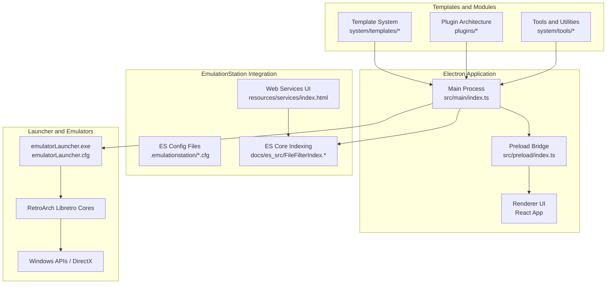

**Diagram sources**
- [index.ts:32-62](file://emulationstation/.riescade/src/src/main/index.ts#L32-L62)
- [preload-index.ts:1-77](file://emulationstation/.riescade/src/src/preload/index.ts#L1-L77)
- [index.html:1-174](file://emulationstation/resources/services/index.html#L1-L174)
- [FileFilterIndex.h:129-148](file://emulationstation/.riescade/src/docs/es_src/FileFilterIndex.h#L129-L148)
- [FileFilterIndex.cpp:107-198](file://emulationstation/.riescade/src/docs/es_src/FileFilterIndex.cpp#L107-L198)
- [emulatorLauncher.cfg](file://emulationstation/emulatorLauncher.cfg)

**Section sources**
- [README.md:34-43](file://README.md#L34-L43)
- [electron.vite.config.ts:1-20](file://emulationstation/.riescade/src/electron.vite.config.ts#L1-L20)

## Core Components
- Electron Main Process: Initializes the BrowserWindow, loads renderer content, and exposes IPC handlers for library management, scraping, launching, and system commands.
- Preload Bridge: Exposes a minimal, typed API surface to the renderer via contextBridge, handling invoke/on patterns for requests and events.
- Renderer UI: React application consuming main-provided services for game lists, collections, input configuration, and media downloads.
- EmulationStation Integration: Web services UI for quick actions, ES configuration files, and core indexing logic for fast filtering.
- Template-Based Configuration: Centralized per-emulator configuration templates under system/templates, enabling consistent and reproducible setups.
- Plugin Architecture: Extensible plugin system under plugins/ for codecs, filters, outputs, and access controls.
- Launcher Integration: Direct invocation of emulatorLauncher.exe with system-specific configuration and RetroArch cores.

**Section sources**
- [index.ts:32-62](file://emulationstation/.riescade/src/src/main/index.ts#L32-L62)
- [preload-index.ts:5-63](file://emulationstation/.riescade/src/src/preload/index.ts#L5-L63)
- [README.md:5-11](file://README.md#L5-L11)
- [index.html:16-43](file://emulationstation/resources/services/index.html#L16-L43)

## Architecture Overview
RIESCADE_SYSTEM follows a layered architecture:
- Presentation Layer: React renderer with state management and UI components.
- Application Layer: Preload bridge and main-process IPC handlers implementing service contracts.
- Domain Layer: Game library indexing, scraping, and media management.
- Integration Layer: EmulationStation core, emulatorLauncher.exe, and RetroArch libretro cores.
- Infrastructure Layer: Windows APIs and DirectX for rendering and device handling.

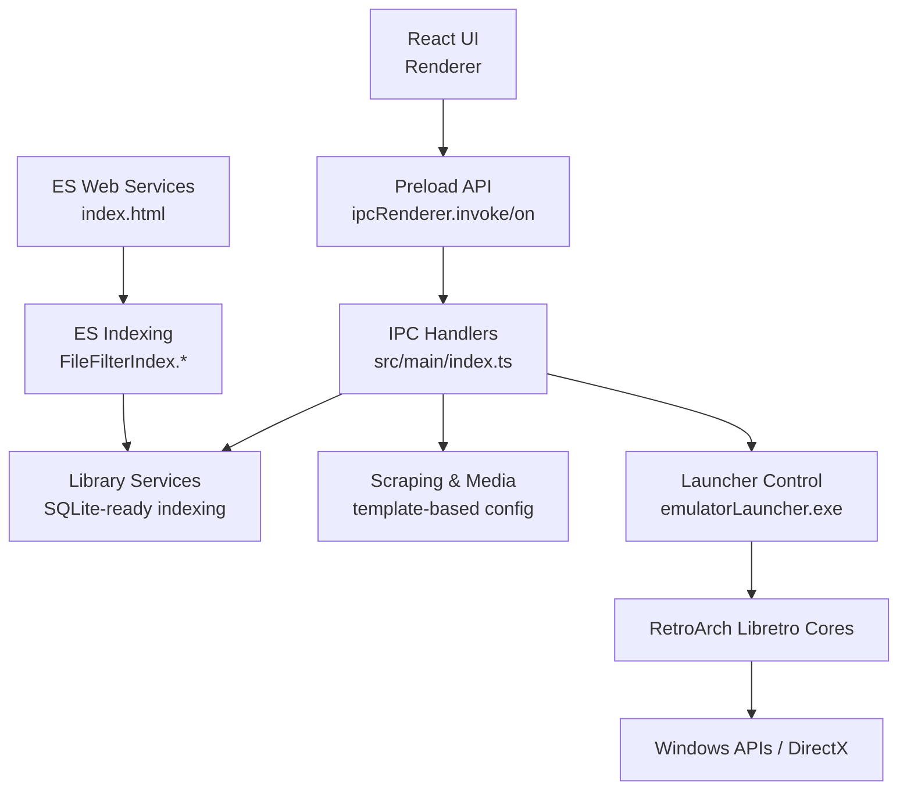

**Diagram sources**
- [index.ts:32-62](file://emulationstation/.riescade/src/src/main/index.ts#L32-L62)
- [preload-index.ts:5-63](file://emulationstation/.riescade/src/src/preload/index.ts#L5-L63)
- [index.html:16-43](file://emulationstation/resources/services/index.html#L16-L43)
- [FileFilterIndex.h:129-148](file://emulationstation/.riescade/src/docs/es_src/FileFilterIndex.h#L129-L148)
- [FileFilterIndex.cpp:107-198](file://emulationstation/.riescade/src/docs/es_src/FileFilterIndex.cpp#L107-L198)

## Detailed Component Analysis

### Electron Main Process
Responsibilities:
- Create and manage the main BrowserWindow.
- Load renderer content from dev server or packaged HTML.
- Register IPC handlers for library operations, scraping, launching, and system commands.
- Watch theme changes and coordinate reloads.

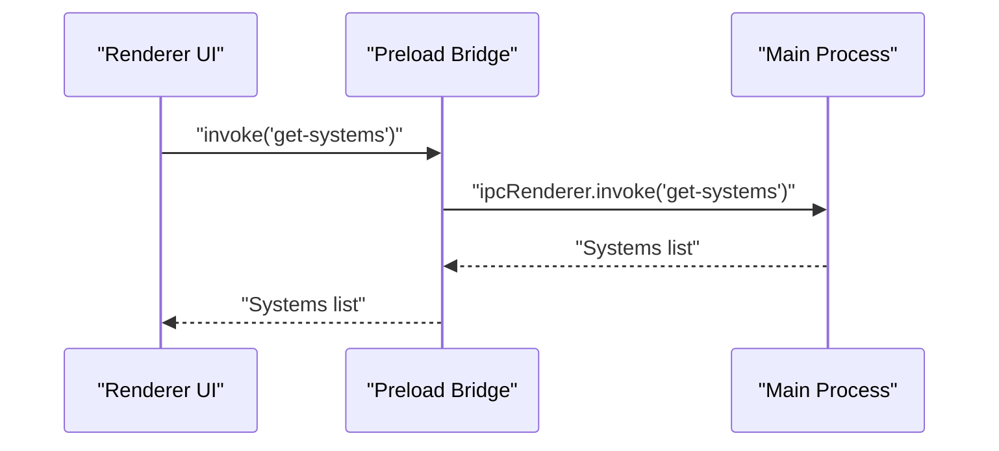

**Diagram sources**
- [index.ts:32-62](file://emulationstation/.riescade/src/src/main/index.ts#L32-L62)
- [preload-index.ts:8-8](file://emulationstation/.riescade/src/src/preload/index.ts#L8-L8)

**Section sources**
- [index.ts:32-62](file://emulationstation/.riescade/src/src/main/index.ts#L32-L62)

### Preload Bridge (IPC)
Responsibilities:
- Expose a typed API surface to the renderer.
- Support invoke/on patterns for synchronous requests and event subscriptions.
- Provide accessors for library, scraping, launching, input configuration, and system commands.

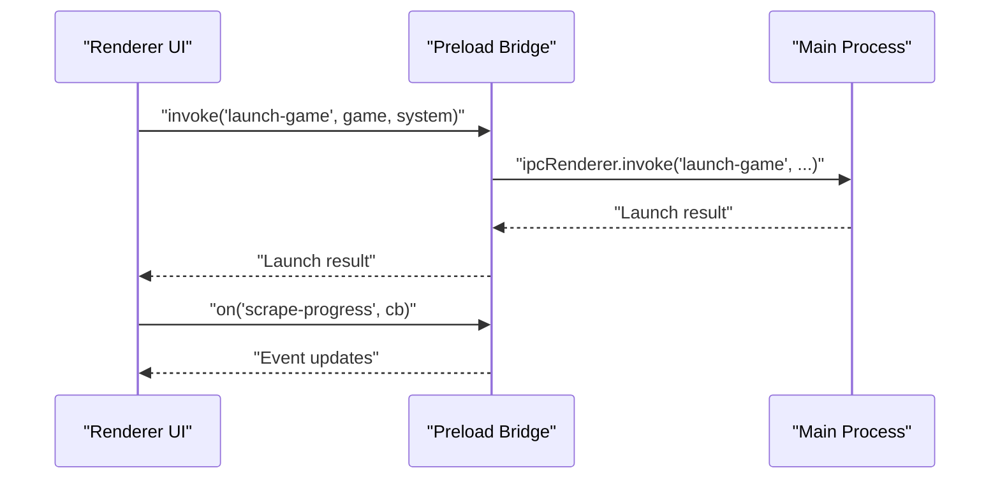

**Diagram sources**
- [preload-index.ts:5-63](file://emulationstation/.riescade/src/src/preload/index.ts#L5-L63)

**Section sources**
- [preload-index.ts:5-63](file://emulationstation/.riescade/src/src/preload/index.ts#L5-L63)

### EmulationStation Integration
Responsibilities:
- Web services UI for quick actions (quit, reload gamelists, kill emulator, launch game).
- ES configuration files (.emulationstation/*.cfg) for input mapping, settings, and systems.
- Core indexing logic (FileFilterIndex.*) enabling fast filtering across attributes (favorites, genre, family, players, ratings, etc.).

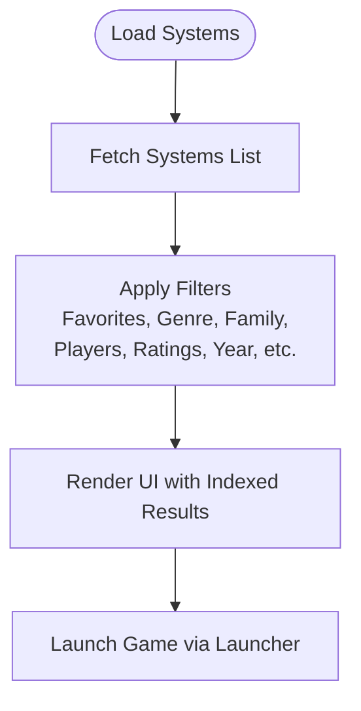

**Diagram sources**
- [index.html:16-43](file://emulationstation/resources/services/index.html#L16-L43)
- [FileFilterIndex.h:129-148](file://emulationstation/.riescade/src/docs/es_src/FileFilterIndex.h#L129-L148)
- [FileFilterIndex.cpp:107-198](file://emulationstation/.riescade/src/docs/es_src/FileFilterIndex.cpp#L107-L198)

**Section sources**
- [index.html:16-43](file://emulationstation/resources/services/index.html#L16-L43)
- [FileFilterIndex.h:129-148](file://emulationstation/.riescade/src/docs/es_src/FileFilterIndex.h#L129-L148)
- [FileFilterIndex.cpp:107-198](file://emulationstation/.riescade/src/docs/es_src/FileFilterIndex.cpp#L107-L198)

### Template-Based Configuration System
Responsibilities:
- Provide per-emulator configuration templates under system/templates.
- Enable consistent configuration generation and updates across emulators.
- Support overlays, shaders, and controller mappings.

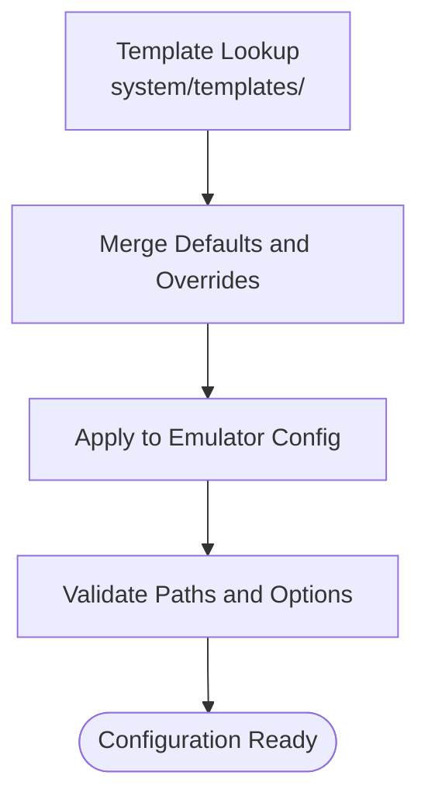

**Diagram sources**
- [README.md:9-10](file://README.md#L9-L10)

**Section sources**
- [README.md:9-10](file://README.md#L9-L10)

### Plugin Architecture
Responsibilities:
- Extend functionality via plugins under plugins/.
- Examples include access controls, audio outputs, codecs, D3D11, demuxers, video filters, and video outputs.

**Diagram sources**
- [README.md:9-10](file://README.md#L9-L10)

**Section sources**
- [README.md:9-10](file://README.md#L9-L10)

### Launcher Integration (emulatorLauncher.exe)
Responsibilities:
- Launch emulators with appropriate arguments and configuration.
- Integrate with RetroArch libretro cores and Windows APIs/DirectX.

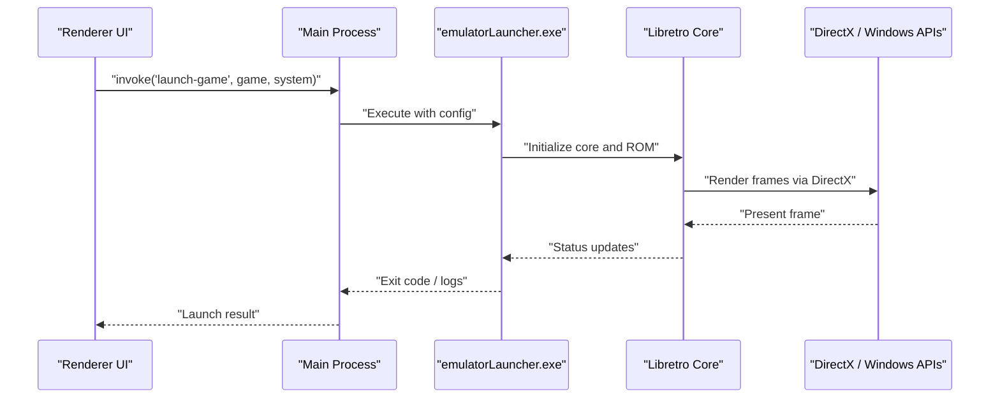

**Diagram sources**
- [preload-index.ts:12-12](file://emulationstation/.riescade/src/src/preload/index.ts#L12-L12)
- [emulatorLauncher.cfg](file://emulationstation/emulatorLauncher.cfg)

**Section sources**
- [preload-index.ts:12-12](file://emulationstation/.riescade/src/src/preload/index.ts#L12-L12)
- [emulatorLauncher.cfg](file://emulationstation/emulatorLauncher.cfg)

### Cross-Cutting Concerns

#### Configuration Management
- ES configuration files (.emulationstation/*.cfg) drive input mapping, settings, and system definitions.
- Global configuration file retrobat.ini provides centralized settings for the system.

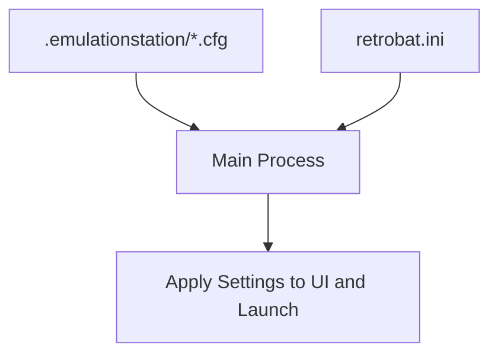

**Diagram sources**
- [retrobat.ini](file://retrobat.ini)

**Section sources**
- [retrobat.ini](file://retrobat.ini)

#### Game Library Indexing
- SQLite-ready architecture enables fast game indexing and filtering.
- ES core indexing logic (FileFilterIndex.*) maintains indices for multiple attributes.

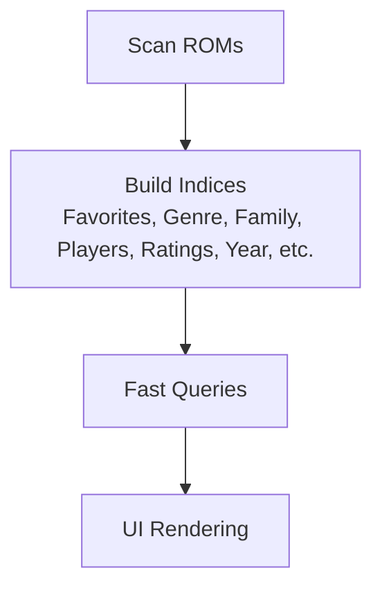

**Diagram sources**
- [FileFilterIndex.h:129-148](file://emulationstation/.riescade/src/docs/es_src/FileFilterIndex.h#L129-L148)
- [FileFilterIndex.cpp:107-198](file://emulationstation/.riescade/src/docs/es_src/FileFilterIndex.cpp#L107-L198)

**Section sources**
- [README.md:9-9](file://README.md#L9-L9)
- [FileFilterIndex.h:129-148](file://emulationstation/.riescade/src/docs/es_src/FileFilterIndex.h#L129-L148)
- [FileFilterIndex.cpp:107-198](file://emulationstation/.riescade/src/docs/es_src/FileFilterIndex.cpp#L107-L198)

#### Input Device Handling
- Retrieve configured controllers and save input configurations.
- Bluetooth device discovery and mapping support.

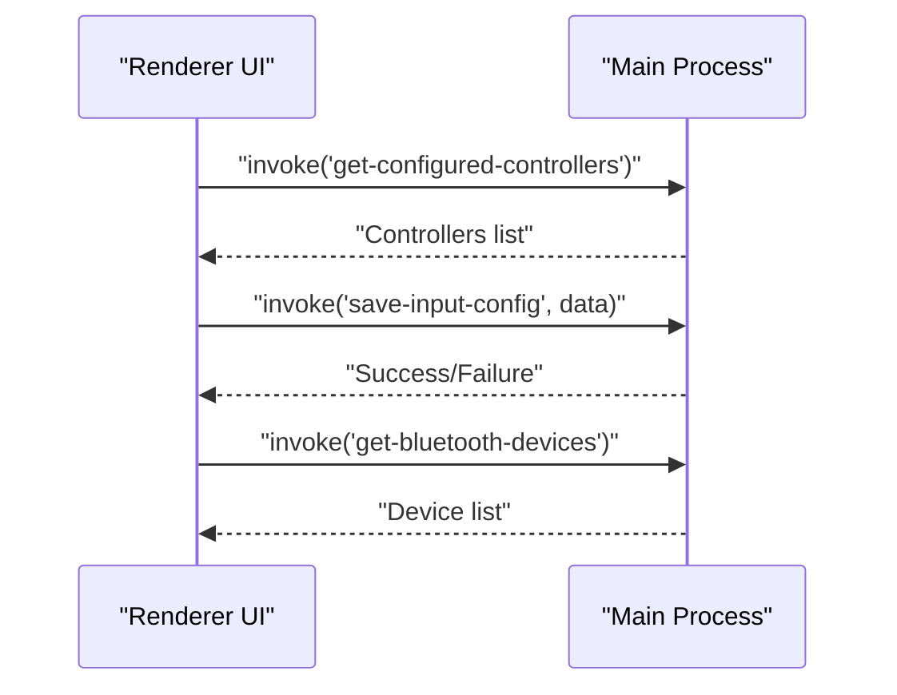

**Diagram sources**
- [preload-index.ts:42-46](file://emulationstation/.riescade/src/src/preload/index.ts#L42-L46)

**Section sources**
- [preload-index.ts:42-46](file://emulationstation/.riescade/src/src/preload/index.ts#L42-L46)

## Dependency Analysis
RIESCADE_SYSTEM exhibits clear separation of concerns:
- Main depends on preload for IPC exposure and renderer for UI consumption.
- Renderer consumes preload API for all system operations.
- Main coordinates with ES core indexing, launcher integration, and Windows APIs.
- Templates and plugins provide extensibility without tight coupling.

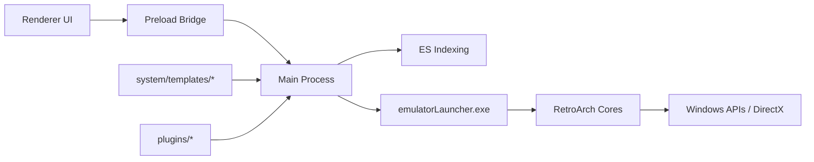

**Diagram sources**
- [index.ts:32-62](file://emulationstation/.riescade/src/src/main/index.ts#L32-L62)
- [preload-index.ts:5-63](file://emulationstation/.riescade/src/src/preload/index.ts#L5-L63)
- [emulatorLauncher.cfg](file://emulationstation/emulatorLauncher.cfg)

**Section sources**
- [index.ts:32-62](file://emulationstation/.riescade/src/src/main/index.ts#L32-L62)
- [preload-index.ts:5-63](file://emulationstation/.riescade/src/src/preload/index.ts#L5-L63)
- [README.md:9-10](file://README.md#L9-L10)

## Performance Considerations
- SQLite-ready architecture ensures fast game indexing and filtering across multiple attributes.
- Vite-based renderer build pipeline optimizes development and production builds.
- Minimal IPC overhead through typed invoke/on patterns reduces latency.
- ES core indexing minimizes UI render-time computations by precomputing indices.

[No sources needed since this section provides general guidance]

## Troubleshooting Guide
Common areas to inspect:
- IPC channel mismatches between renderer and main.
- Missing or misconfigured emulator templates under system/templates.
- ES configuration file corruption (.emulationstation/*.cfg).
- emulatorLauncher.exe execution failures or missing cores.
- Windows API/DirectX rendering issues.

Diagnostic steps:
- Verify IPC channels used by preload API and corresponding main handlers.
- Confirm template paths and permissions for target emulators.
- Validate ES configuration files and gamelist.xml integrity.
- Check emulatorLauncher.cfg and WiimoteGun.exe.config for correct paths and options.
- Review version.info and retrobat.ini for environment and feature flags.

**Section sources**
- [preload-index.ts:5-63](file://emulationstation/.riescade/src/src/preload/index.ts#L5-L63)
- [emulatorLauncher.cfg](file://emulationstation/emulatorLauncher.cfg)
- [WiimoteGun.exe.config](file://emulationstation/WiimoteGun.exe.config)
- [version.info](file://emulationstation/version.info)
- [retrobat.ini](file://retrobat.ini)

## Conclusion
RIESCADE_SYSTEM delivers a modern, high-performance frontend for EmulationStation/RetroBat with a clean Electron architecture, robust IPC bridge, and deep integration with emulator launchers and ES core indexing. Its SQLite-ready design, template-based configuration system, and plugin architecture enable scalable customization and fast game discovery. By leveraging Windows APIs and DirectX, it provides a native-feeling experience while maintaining compatibility with existing RetroBat ecosystems.

[No sources needed since this section summarizes without analyzing specific files]

## Appendices
- Development and deployment commands are defined in the repository’s top-level documentation.
- The application expects to be placed in the EmulationStation folder of a RetroBat installation for automatic path resolution.

**Section sources**
- [README.md:12-32](file://README.md#L12-L32)