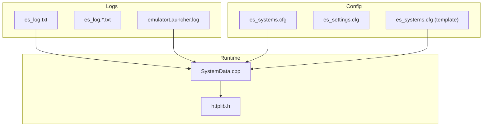
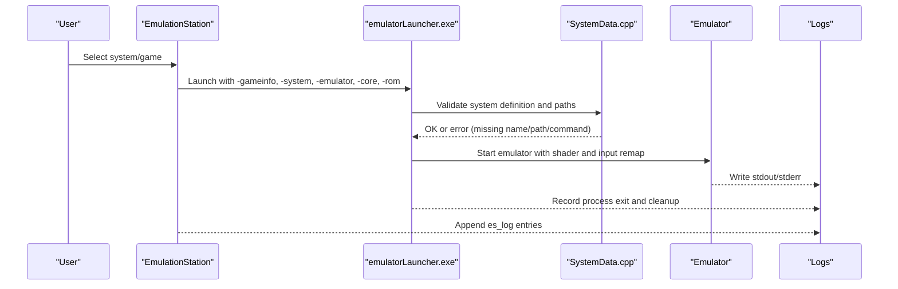
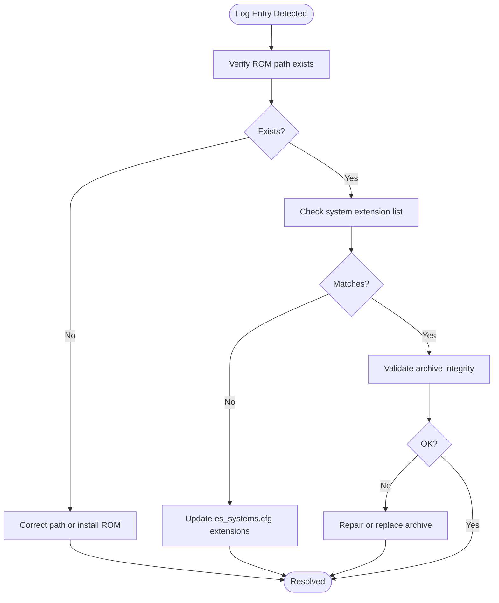
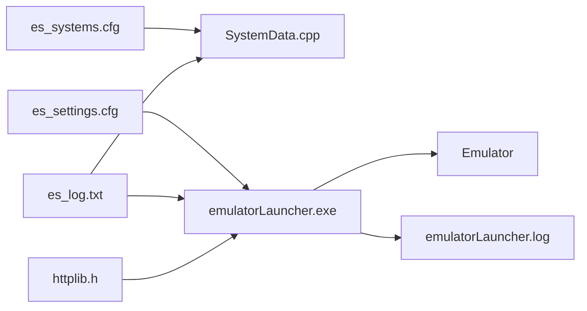

# Common Errors and Solutions

<cite>
**Referenced Files in This Document**
- [es_log.txt](file://emulationstation/.emulationstation/es_log.txt)
- [es_systems.cfg](file://emulationstation/.emulationstation/es_systems.cfg)
- [es_settings.cfg](file://emulationstation/.emulationstation/es_settings.cfg)
- [emulatorLauncher.log](file://emulationstation/emulatorLauncher.log)
- [es_systems.cfg (template)](file://system/templates/emulationstation/es_systems.cfg)
- [SystemData.cpp](file://emulationstation/.riescade/src/docs/es_src/SystemData.cpp)
- [httplib.h](file://emulationstation/.riescade/src/docs/es_src/services/httplib.h)
</cite>

## Table of Contents
1. [Introduction](#introduction)
2. [Project Structure](#project-structure)
3. [Core Components](#core-components)
4. [Architecture Overview](#architecture-overview)
5. [Detailed Component Analysis](#detailed-component-analysis)
6. [Dependency Analysis](#dependency-analysis)
7. [Performance Considerations](#performance-considerations)
8. [Troubleshooting Guide](#troubleshooting-guide)
9. [Conclusion](#conclusion)

## Introduction
This document provides a practical guide to diagnosing and resolving common RIESCADE_SYSTEM errors observed in the repository. It focuses on error messages present in the log files, typical failure patterns for ROM loading, metadata extraction, game library scanning, input devices, controller mapping, hotkeys, shader/theme application, and update failures. It also outlines diagnostic techniques and step-by-step remediation procedures for recurring issues.

## Project Structure
RIESCADE_SYSTEM organizes logs, configuration, and emulation metadata under the emulationstation directory. Key artifacts include:
- es_log.txt and rotated log files for runtime diagnostics
- es_systems.cfg and es_settings.cfg for system and UI configuration
- emulatorLauncher.log for per-game launch diagnostics
- Template es_systems.cfg for system definitions
- Internal source references for system validation and HTTP client behavior

**Diagram sources**
- [es_log.txt](file://emulationstation/.emulationstation/es_log.txt)
- [emulatorLauncher.log](file://emulationstation/emulatorLauncher.log)
- [es_systems.cfg](file://emulationstation/.emulationstation/es_systems.cfg)
- [es_systems.cfg (template)](file://system/templates/emulationstation/es_systems.cfg)
- [SystemData.cpp](file://emulationstation/.riescade/src/docs/es_src/SystemData.cpp)
- [httplib.h](file://emulationstation/.riescade/src/docs/es_src/services/httplib.h)

**Section sources**
- [es_log.txt](file://emulationstation/.emulationstation/es_log.txt)
- [es_systems.cfg](file://emulationstation/.emulationstation/es_systems.cfg)
- [es_settings.cfg](file://emulationstation/.emulationstation/es_settings.cfg)
- [emulatorLauncher.log](file://emulationstation/emulatorLauncher.log)
- [es_systems.cfg (template)](file://system/templates/emulationstation/es_systems.cfg)
- [SystemData.cpp](file://emulationstation/.riescade/src/docs/es_src/SystemData.cpp)
- [httplib.h](file://emulationstation/.riescade/src/docs/es_src/services/httplib.h)

## Core Components
- Log ingestion and parsing: es_log.txt and emulatorLauncher.log capture runtime events and errors.
- System definition and validation: es_systems.cfg defines ROM paths, extensions, emulators, and commands; SystemData.cpp validates completeness and existence.
- UI and rendering settings: es_settings.cfg controls themes, shaders, video driver, and related options.
- Network connectivity: httplib.h powers embedded HTTP client behavior used during updates and scraping.

Typical error categories observed:
- File path and ROM loading errors
- Metadata and gamelist generation failures
- System configuration validation failures
- Shader/theme application issues
- Update and network connectivity failures
- Input device detection and controller mapping problems

**Section sources**
- [es_log.txt](file://emulationstation/.emulationstation/es_log.txt)
- [emulatorLauncher.log](file://emulationstation/emulatorLauncher.log)
- [es_systems.cfg](file://emulationstation/.emulationstation/es_systems.cfg)
- [es_systems.cfg (template)](file://system/templates/emulationstation/es_systems.cfg)
- [es_settings.cfg](file://emulationstation/.emulationstation/es_settings.cfg)
- [SystemData.cpp](file://emulationstation/.riescade/src/docs/es_src/SystemData.cpp)
- [httplib.h](file://emulationstation/.riescade/src/docs/es_src/services/httplib.h)

## Architecture Overview
The system orchestrates ROM launching via emulatorLauncher.exe, which reads ES settings and system definitions, validates paths and cores, and launches the target emulator with configured shaders and input remapping. Logs record successes and failures across these steps.

**Diagram sources**
- [emulatorLauncher.log](file://emulationstation/emulatorLauncher.log)
- [es_log.txt](file://emulationstation/.emulationstation/es_log.txt)
- [es_systems.cfg](file://emulationstation/.emulationstation/es_systems.cfg)
- [SystemData.cpp](file://emulationstation/.riescade/src/docs/es_src/SystemData.cpp)

## Detailed Component Analysis

### ROM Loading and FileData Creation Failures
Observed pattern:
- Repeated "Error finding/creating FileData for ..." entries pointing to ROM paths.
- Often occur for squashfs, wsquashfs, and table archives.

Interpretation:
- The system could not create a FileData entry for the given ROM path, indicating either a missing file, unsupported extension, or invalid path resolution.

Resolution checklist:
- Verify the ROM exists at the reported path.
- Confirm the system extension list matches the ROM type.
- Ensure the ROM path resolves correctly (no tilde expansion issues).
- Check for special characters or long paths that might cause issues.
- Validate archive integrity if using squashfs/wsquashfs.

**Diagram sources**
- [es_log.txt](file://emulationstation/.emulationstation/es_log.txt)
- [es_systems.cfg](file://emulationstation/.emulationstation/es_systems.cfg)

**Section sources**
- [es_log.txt](file://emulationstation/.emulationstation/es_log.txt)
- [es_systems.cfg](file://emulationstation/.emulationstation/es_systems.cfg)

### System Definition Validation Failures
Observed pattern:
- "System ... is missing name, extension, or command!" logged during system load.

Interpretation:
- A system definition is incomplete; the loader requires name, path, extensions, and command to be present.

Resolution checklist:
- Open the system definition XML and ensure all required fields are set.
- Confirm the path resolves to an existing directory.
- Ensure the command template includes placeholders for gameinfo, controllers, system, emulator, core, and ROM.
- Validate that the path uses proper separators and tilde expansion if applicable.

**Section sources**
- [SystemData.cpp](file://emulationstation/.riescade/src/docs/es_src/SystemData.cpp)
- [es_systems.cfg](file://emulationstation/.emulationstation/es_systems.cfg)
- [es_systems.cfg (template)](file://system/templates/emulationstation/es_systems.cfg)

### Shader and Theme Application Issues
Observed pattern:
- Shader assignment in emulatorLauncher.log (e.g., "--set-shader ...").
- es_settings.cfg contains global shader set and theme settings.

Interpretation:
- Shaders are applied per-launch; theme and shader selections are controlled via settings.

Resolution checklist:
- Confirm the selected shader exists in the configured shader path.
- Verify the theme name in es_settings.cfg corresponds to an available theme.
- Check for typos in shader set names and theme names.
- If using Vulkan, ensure the backend supports the chosen shader pipeline.

**Section sources**
- [emulatorLauncher.log](file://emulationstation/emulatorLauncher.log)
- [es_settings.cfg](file://emulationstation/.emulationstation/es_settings.cfg)

### Update and Network Connectivity Failures
Observed pattern:
- "HttpReq::onError (3) : Couldn't connect to server" indicates network connectivity issues.

Interpretation:
- The embedded HTTP client failed to establish a connection, often due to firewall, proxy, or DNS issues.

Resolution checklist:
- Test connectivity to the update/scrape endpoints from the host.
- Review proxy settings and firewall rules.
- Temporarily disable antivirus or proxy interception for testing.
- Validate SSL/TLS support if HTTPS endpoints are used.

**Section sources**
- [es_log.txt](file://emulationstation/.emulationstation/es_log.txt)
- [httplib.h](file://emulationstation/.riescade/src/docs/es_src/services/httplib.h)

### Input Device Detection and Controller Mapping Problems
Observed patterns:
- Multiple controller connections detected and mapped.
- PadToKey listeners started and exited around game launches.
- Controller GUIDs and paths recorded.

Interpretation:
- The system recognizes and maps controllers; mismatches or missing mappings can cause hotkeys or gameplay issues.

Resolution checklist:
- Ensure the correct emulator core is selected for the system.
- Verify input remap files exist for the chosen core.
- Confirm controller GUIDs and paths are recognized by the OS.
- Rebuild input remaps if custom mappings changed.
- Check for conflicting hotkeys in es_padtokey.cfg and per-emulator configs.

**Section sources**
- [emulatorLauncher.log](file://emulationstation/emulatorLauncher.log)
- [es_settings.cfg](file://emulationstation/.emulationstation/es_settings.cfg)

## Dependency Analysis
RIESCADE_SYSTEM ties together configuration, logging, and runtime components. The following diagram highlights key dependencies among components.

**Diagram sources**
- [es_systems.cfg](file://emulationstation/.emulationstation/es_systems.cfg)
- [es_systems.cfg (template)](file://system/templates/emulationstation/es_systems.cfg)
- [es_settings.cfg](file://emulationstation/.emulationstation/es_settings.cfg)
- [SystemData.cpp](file://emulationstation/.riescade/src/docs/es_src/SystemData.cpp)
- [emulatorLauncher.log](file://emulationstation/emulatorLauncher.log)
- [es_log.txt](file://emulationstation/.emulationstation/es_log.txt)
- [httplib.h](file://emulationstation/.riescade/src/docs/es_src/services/httplib.h)

**Section sources**
- [es_systems.cfg](file://emulationstation/.emulationstation/es_systems.cfg)
- [es_systems.cfg (template)](file://system/templates/emulationstation/es_systems.cfg)
- [es_settings.cfg](file://emulationstation/.emulationstation/es_settings.cfg)
- [SystemData.cpp](file://emulationstation/.riescade/src/docs/es_src/SystemData.cpp)
- [emulatorLauncher.log](file://emulationstation/emulatorLauncher.log)
- [es_log.txt](file://emulationstation/.emulationstation/es_log.txt)
- [httplib.h](file://emulationstation/.riescade/src/docs/es_src/services/httplib.h)

## Performance Considerations
- Excessive repeated FileData creation errors indicate scanning overhead; consolidate duplicate ROMs or fix system definitions to reduce redundant scans.
- Shader switching and theme reloads can impact startup time; keep shader sets minimal and avoid unnecessary theme changes.
- Network-dependent operations (updates, scraping) can block UI; schedule during idle periods.

## Troubleshooting Guide

### Step-by-Step Diagnostics
1. Identify the error category:
   - ROM loading failures: inspect es_log.txt for FileData errors.
   - System definition issues: look for "missing name, extension, or command".
   - Shader/theme issues: confirm entries in es_settings.cfg and presence of shader/theme files.
   - Update/network issues: search for HttpReq errors.
   - Input/controller issues: review emulatorLauncher.log for controller mapping and PadToKey activity.

2. Validate configurations:
   - es_systems.cfg: ensure name, path, extensions, and command are defined and paths exist.
   - es_settings.cfg: verify theme, shader set, and video driver settings.

3. Reproduce and isolate:
   - Launch the failing game manually via emulatorLauncher.exe with verbose logging.
   - Temporarily disable custom shaders/themes to test baseline behavior.

4. Apply targeted fixes:
   - Correct missing ROMs or update system extensions.
   - Fix system definition fields or paths.
   - Repair or replace corrupted archives.
   - Adjust network/proxy/firewall settings for connectivity.
   - Rebuild input remaps and hotkeys.

5. Verify resolution:
   - Re-run the game and confirm logs show successful launches.
   - Check es_log.txt for residual errors.

### Common Error Patterns and Fixes
- FileData creation errors:
  - Cause: ROM path missing or extension mismatch.
  - Fix: Install ROM, adjust system extensions, or correct path.
- System definition missing fields:
  - Cause: Incomplete system definition.
  - Fix: Populate name, path, extensions, and command; ensure path exists.
- Shader/theme application issues:
  - Cause: Nonexistent shader/theme or misconfiguration.
  - Fix: Select existing shader/theme; verify paths.
- Update/connectivity failures:
  - Cause: Network/proxy restrictions.
  - Fix: Test connectivity; adjust proxy/firewall; retry.
- Input device/controller mapping:
  - Cause: Incorrect core selection or missing remaps.
  - Fix: Choose correct core; rebuild remaps; resolve hotkey conflicts.

**Section sources**
- [es_log.txt](file://emulationstation/.emulationstation/es_log.txt)
- [emulatorLauncher.log](file://emulationstation/emulatorLauncher.log)
- [es_systems.cfg](file://emulationstation/.emulationstation/es_systems.cfg)
- [es_systems.cfg (template)](file://system/templates/emulationstation/es_systems.cfg)
- [es_settings.cfg](file://emulationstation/.emulationstation/es_settings.cfg)
- [SystemData.cpp](file://emulationstation/.riescade/src/docs/es_src/SystemData.cpp)
- [httplib.h](file://emulationstation/.riescade/src/docs/es_src/services/httplib.h)

## Conclusion
By correlating log entries with system definitions and settings, most RIESCADE_SYSTEM errors can be diagnosed and resolved systematically. Focus on validating ROM paths and extensions, ensuring complete system definitions, confirming shader/theme availability, verifying network connectivity, and aligning controller mappings with the selected emulator core. Regular maintenance of these areas reduces recurring failures and improves stability.