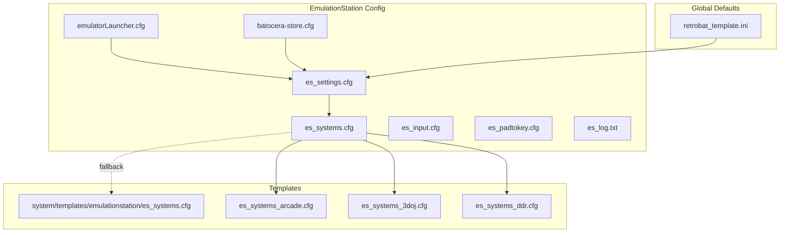
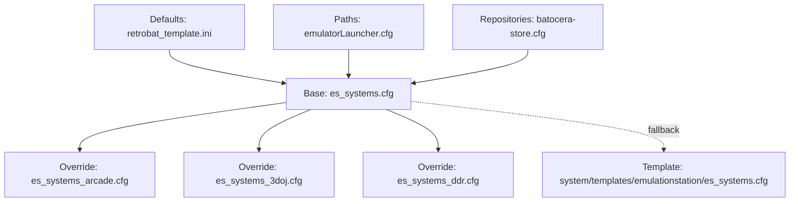
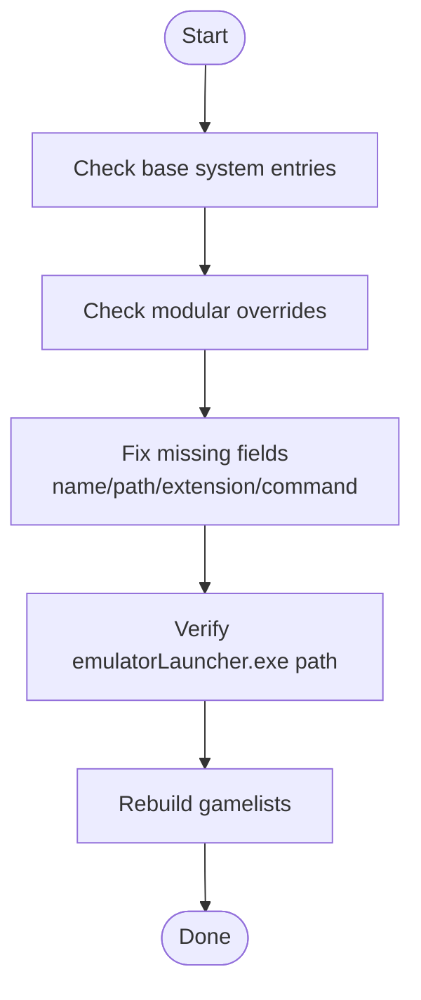
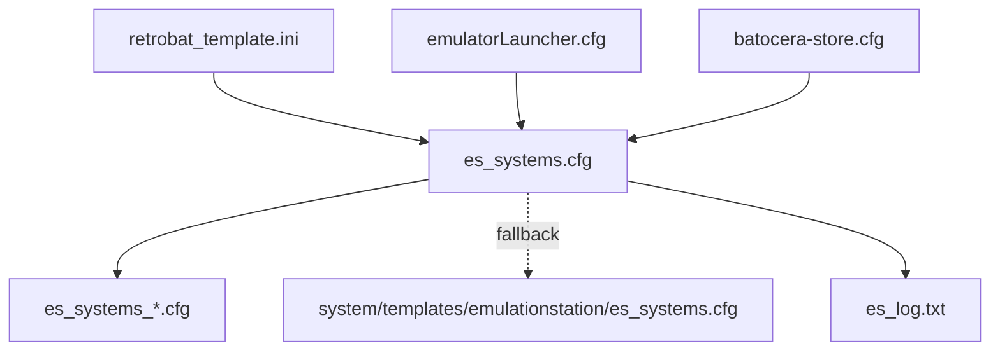

# Configuration Problems

<cite>
**Referenced Files in This Document**
- [es_settings.cfg](file://emulationstation/.emulationstation/es_settings.cfg)
- [es_systems.cfg](file://emulationstation/.emulationstation/es_systems.cfg)
- [es_systems_arcade.cfg](file://emulationstation/.emulationstation/es_systems_arcade.cfg)
- [es_systems_3doj.cfg](file://emulationstation/.emulationstation/es_systems_3doj.cfg)
- [es_systems_ddr.cfg](file://emulationstation/.emulationstation/es_systems_ddr.cfg)
- [es_input.cfg](file://emulationstation/.emulationstation/es_input.cfg)
- [es_padtokey.cfg](file://emulationstation/.emulationstation/es_padtokey.cfg)
- [es_log.txt](file://emulationstation/.emulationstation/es_log.txt)
- [emulatorLauncher.cfg](file://emulationstation/emulatorLauncher.cfg)
- [batocera-store.cfg](file://emulationstation/batocera-store.cfg)
- [retrobat_template.ini](file://system/resources/retrobat_template.ini)
- [es_systems.cfg (template)](file://system/templates/emulationstation/es_systems.cfg)
</cite>

## Table of Contents
1. [Introduction](#introduction)
2. [Project Structure](#project-structure)
3. [Core Components](#core-components)
4. [Architecture Overview](#architecture-overview)
5. [Detailed Component Analysis](#detailed-component-analysis)
6. [Dependency Analysis](#dependency-analysis)
7. [Performance Considerations](#performance-considerations)
8. [Troubleshooting Guide](#troubleshooting-guide)
9. [Conclusion](#conclusion)

## Introduction
This document provides a comprehensive troubleshooting guide for RIESCADE_SYSTEM configuration issues. It focuses on resolving common problems such as system detection failures, emulator path misconfigurations, platform-specific setting conflicts, corrupted or missing configuration files, incorrect system templates, and theme-loading failures. It also covers validation, regeneration, and reset procedures for configuration files, along with backup and restoration guidance and how to diagnose syntax errors in XML and INI files.

## Project Structure
RIESCADE_SYSTEM organizes configuration files under the EmulationStation directory and supports modular system templates and per-emulator configuration files. Key locations include:
- EmulationStation configuration: es_settings.cfg, es_systems.cfg, es_input.cfg, es_padtokey.cfg, es_log.txt
- Modular system templates: es_systems_*.cfg files for platform-specific overrides
- Launcher configuration: emulatorLauncher.cfg
- Store repositories: batocera-store.cfg
- Global RetroBat defaults: retrobat_template.ini
- Template baseline: system/templates/emulationstation/es_systems.cfg

**Diagram sources**
- [es_settings.cfg](file://emulationstation/.emulationstation/es_settings.cfg)
- [es_systems.cfg](file://emulationstation/.emulationstation/es_systems.cfg)
- [es_systems_arcade.cfg](file://emulationstation/.emulationstation/es_systems_arcade.cfg)
- [es_systems_3doj.cfg](file://emulationstation/.emulationstation/es_systems_3doj.cfg)
- [es_systems_ddr.cfg](file://emulationstation/.emulationstation/es_systems_ddr.cfg)
- [emulatorLauncher.cfg](file://emulationstation/emulatorLauncher.cfg)
- [batocera-store.cfg](file://emulationstation/batocera-store.cfg)
- [retrobat_template.ini](file://system/resources/retrobat_template.ini)
- [es_systems.cfg (template)](file://system/templates/emulationstation/es_systems.cfg)

**Section sources**
- [es_settings.cfg](file://emulationstation/.emulationstation/es_settings.cfg)
- [es_systems.cfg](file://emulationstation/.emulationstation/es_systems.cfg)
- [es_systems_arcade.cfg](file://emulationstation/.emulationstation/es_systems_arcade.cfg)
- [es_systems_3doj.cfg](file://emulationstation/.emulationstation/es_systems_3doj.cfg)
- [es_systems_ddr.cfg](file://emulationstation/.emulationstation/es_systems_ddr.cfg)
- [emulatorLauncher.cfg](file://emulationstation/emulatorLauncher.cfg)
- [batocera-store.cfg](file://emulationstation/batocera-store.cfg)
- [retrobat_template.ini](file://system/resources/retrobat_template.ini)
- [es_systems.cfg (template)](file://system/templates/emulationstation/es_systems.cfg)

## Core Components
- es_settings.cfg: Stores global UI, audio, scraping, and per-system grouping preferences. It includes thousands of per-system toggles and global options.
- es_systems.cfg: Defines ROM paths, supported extensions, emulator choices, and platform groups. Modular *.cfg files override or extend the base.
- es_input.cfg: Maps keyboard and joystick inputs to EmulationStation actions.
- es_padtokey.cfg: Translates controller inputs to emulator hotkeys for many applications.
- emulatorLauncher.cfg: Sets shared paths for BIOS, saves, screenshots, shaders, and decorations.
- batocera-store.cfg: Declares external repositories used by the store.
- retrobat_template.ini: Provides global defaults for RetroBat behavior and EmulationStation launch options.

**Section sources**
- [es_settings.cfg](file://emulationstation/.emulationstation/es_settings.cfg)
- [es_systems.cfg](file://emulationstation/.emulationstation/es_systems.cfg)
- [es_input.cfg](file://emulationstation/.emulationstation/es_input.cfg)
- [es_padtokey.cfg](file://emulationstation/.emulationstation/es_padtokey.cfg)
- [emulatorLauncher.cfg](file://emulationstation/emulatorLauncher.cfg)
- [batocera-store.cfg](file://emulationstation/batocera-store.cfg)
- [retrobat_template.ini](file://system/resources/retrobat_template.ini)

## Architecture Overview
RIESCADE_SYSTEM composes configurations from multiple sources:
- Base system definitions in es_systems.cfg
- Platform-specific overrides via es_systems_*.cfg
- Global defaults from retrobat_template.ini
- Launcher paths from emulatorLauncher.cfg
- Store repositories from batocera-store.cfg
- Runtime logs from es_log.txt

**Diagram sources**
- [es_systems.cfg](file://emulationstation/.emulationstation/es_systems.cfg)
- [es_systems_arcade.cfg](file://emulationstation/.emulationstation/es_systems_arcade.cfg)
- [es_systems_3doj.cfg](file://emulationstation/.emulationstation/es_systems_3doj.cfg)
- [es_systems_ddr.cfg](file://emulationstation/.emulationstation/es_systems_ddr.cfg)
- [es_systems.cfg (template)](file://system/templates/emulationstation/es_systems.cfg)
- [retrobat_template.ini](file://system/resources/retrobat_template.ini)
- [emulatorLauncher.cfg](file://emulationstation/emulatorLauncher.cfg)
- [batocera-store.cfg](file://emulationstation/batocera-store.cfg)

## Detailed Component Analysis

### System Detection Failures
Symptoms:
- Missing systems in the UI
- Errors indicating systems lack required fields
- Log messages about missing name, extension, or command

Common causes:
- Missing or malformed system entries in es_systems.cfg or modular overrides
- Incorrect path or extension definitions
- Missing command template placeholder usage

Resolution steps:
1. Validate system entries in es_systems.cfg and modular overrides.
2. Ensure each system has name, path, extension, and command placeholders.
3. Confirm emulatorLauncher.exe path exists and is reachable from the configured HOME.
4. Rebuild gamelists after changes.

**Diagram sources**
- [es_systems.cfg](file://emulationstation/.emulationstation/es_systems.cfg)
- [es_systems_arcade.cfg](file://emulationstation/.emulationstation/es_systems_arcade.cfg)
- [es_systems_3doj.cfg](file://emulationstation/.emulationstation/es_systems_3doj.cfg)
- [es_systems_ddr.cfg](file://emulationstation/.emulationstation/es_systems_ddr.cfg)
- [emulatorLauncher.cfg](file://emulationstation/emulatorLauncher.cfg)

**Section sources**
- [es_systems.cfg](file://emulationstation/.emulationstation/es_systems.cfg)
- [es_systems_arcade.cfg](file://emulationstation/.emulationstation/es_systems_arcade.cfg)
- [es_systems_3doj.cfg](file://emulationstation/.emulationstation/es_systems_3doj.cfg)
- [es_systems_ddr.cfg](file://emulationstation/.emulationstation/es_systems_ddr.cfg)
- [emulatorLauncher.cfg](file://emulationstation/emulatorLauncher.cfg)

### Emulator Path Misconfigurations
Symptoms:
- Launch failures when starting games
- Errors related to missing executables or paths

Root causes:
- Incorrect HOME or executable path in command templates
- Missing emulator binaries or wrong architecture
- Incorrect shader, BIOS, or save paths

Remediation:
1. Confirm emulatorLauncher.cfg paths for bios, saves, shaders, and decorations.
2. Verify emulator binaries exist and match OS architecture.
3. Ensure HOME resolves to the EmulationStation directory.
4. Test launching a single system with a minimal command.

**Section sources**
- [emulatorLauncher.cfg](file://emulationstation/emulatorLauncher.cfg)
- [es_systems.cfg](file://emulationstation/.emulationstation/es_systems.cfg)

### Platform-Specific Setting Conflicts
Symptoms:
- Unexpected grouping or visibility of systems
- Per-system toggles overriding defaults

Resolution:
1. Review es_settings.cfg for per-system ungroup toggles and global grouping settings.
2. Adjust grouping strings and per-system flags to desired behavior.
3. Regenerate collections and restart the frontend.

**Section sources**
- [es_settings.cfg](file://emulationstation/.emulationstation/es_settings.cfg)

### Theme Loading Failures
Symptoms:
- Missing or broken theme visuals
- Errors referencing theme sets

Resolution:
1. Verify ThemeSet and related theme-related settings in es_settings.cfg.
2. Ensure theme assets exist in the themes directory.
3. Reset theme settings to default if corrupted.

**Section sources**
- [es_settings.cfg](file://emulationstation/.emulationstation/es_settings.cfg)

### Input Device Configuration Conflicts
Symptoms:
- Controls not mapped or mapped incorrectly
- Conflicts between keyboard and controller mappings

Resolution:
1. Inspect es_input.cfg for device mappings and GUIDs.
2. Validate pad-to-key mappings in es_padtokey.cfg for target applications.
3. Recreate mappings if devices change or GUIDs mismatch.

**Section sources**
- [es_input.cfg](file://emulationstation/.emulationstation/es_input.cfg)
- [es_padtokey.cfg](file://emulationstation/.emulationstation/es_padtokey.cfg)

### Store Repositories and Updates
Symptoms:
- Store fails to connect or lists outdated content

Resolution:
1. Confirm batocera-store.cfg repository URLs are reachable.
2. Temporarily disable problematic repositories if connection errors occur.
3. Clear caches and retry updates.

**Section sources**
- [batocera-store.cfg](file://emulationstation/batocera-store.cfg)

## Dependency Analysis
RIESCADE_SYSTEM configuration depends on layered files and external resources:
- es_systems.cfg drives ROM discovery and launch commands
- Modular overrides refine platform-specific behavior
- emulatorLauncher.cfg centralizes shared paths
- es_log.txt captures runtime diagnostics
- retrobat_template.ini provides global defaults
- batocera-store.cfg enables external content

**Diagram sources**
- [es_systems.cfg](file://emulationstation/.emulationstation/es_systems.cfg)
- [es_systems_arcade.cfg](file://emulationstation/.emulationstation/es_systems_arcade.cfg)
- [es_systems_3doj.cfg](file://emulationstation/.emulationstation/es_systems_3doj.cfg)
- [es_systems_ddr.cfg](file://emulationstation/.emulationstation/es_systems_ddr.cfg)
- [es_systems.cfg (template)](file://system/templates/emulationstation/es_systems.cfg)
- [retrobat_template.ini](file://system/resources/retrobat_template.ini)
- [emulatorLauncher.cfg](file://emulationstation/emulatorLauncher.cfg)
- [batocera-store.cfg](file://emulationstation/batocera-store.cfg)
- [es_log.txt](file://emulationstation/.emulationstation/es_log.txt)

**Section sources**
- [es_systems.cfg](file://emulationstation/.emulationstation/es_systems.cfg)
- [es_systems_arcade.cfg](file://emulationstation/.emulationstation/es_systems_arcade.cfg)
- [es_systems_3doj.cfg](file://emulationstation/.emulationstation/es_systems_3doj.cfg)
- [es_systems_ddr.cfg](file://emulationstation/.emulationstation/es_systems_ddr.cfg)
- [es_systems.cfg (template)](file://system/templates/emulationstation/es_systems.cfg)
- [retrobat_template.ini](file://system/resources/retrobat_template.ini)
- [emulatorLauncher.cfg](file://emulationstation/emulatorLauncher.cfg)
- [batocera-store.cfg](file://emulationstation/batocera-store.cfg)
- [es_log.txt](file://emulationstation/.emulationstation/es_log.txt)

## Performance Considerations
- Limit per-system toggles to necessary items to reduce parsing overhead.
- Keep modular overrides minimal and targeted.
- Prefer grouped systems to reduce UI rendering work.
- Use appropriate shader and decoration sets for your hardware.

## Troubleshooting Guide

### Step-by-Step: Validate and Repair es_systems.cfg
1. Open es_systems.cfg and verify each system block includes:
   - name
   - path
   - extension
   - command with placeholders
2. Compare against the template baseline to spot missing fields.
3. If corruption is suspected, replace with the template content and reapply modular overrides.

**Section sources**
- [es_systems.cfg](file://emulationstation/.emulationstation/es_systems.cfg)
- [es_systems.cfg (template)](file://system/templates/emulationstation/es_systems.cfg)

### Step-by-Step: Regenerate System Templates
1. Backup current es_systems.cfg.
2. Replace with the template file content.
3. Apply modular overrides selectively:
   - es_systems_arcade.cfg
   - es_systems_3doj.cfg
   - es_systems_ddr.cfg
4. Restart the frontend and rebuild gamelists.

**Section sources**
- [es_systems.cfg](file://emulationstation/.emulationstation/es_systems.cfg)
- [es_systems_arcade.cfg](file://emulationstation/.emulationstation/es_systems_arcade.cfg)
- [es_systems_3doj.cfg](file://emulationstation/.emulationstation/es_systems_3doj.cfg)
- [es_systems_ddr.cfg](file://emulationstation/.emulationstation/es_systems_ddr.cfg)
- [es_systems.cfg (template)](file://system/templates/emulationstation/es_systems.cfg)

### Step-by-Step: Reset Emulator Configuration Paths
1. Edit emulatorLauncher.cfg to ensure paths resolve correctly:
   - home
   - bios
   - saves
   - screenshots
   - shaders
   - videofilters
   - decorations
   - system.decorations
   - retroachievementsounds
2. Confirm emulator binaries exist and are accessible.
3. Restart the frontend.

**Section sources**
- [emulatorLauncher.cfg](file://emulationstation/emulatorLauncher.cfg)

### Step-by-Step: Resolve es_settings.cfg Issues
1. Review per-system toggles for grouping and visibility.
2. Adjust global settings like ThemeSet, video driver, and language.
3. Save and restart the frontend.

**Section sources**
- [es_settings.cfg](file://emulationstation/.emulationstation/es_settings.cfg)

### Step-by-Step: Fix Input Device Conflicts
1. Inspect es_input.cfg for device GUIDs and mappings.
2. Update GUIDs or remap keys/buttons as needed.
3. Validate pad-to-key mappings in es_padtokey.cfg for affected apps.
4. Save and test controls.

**Section sources**
- [es_input.cfg](file://emulationstation/.emulationstation/es_input.cfg)
- [es_padtokey.cfg](file://emulationstation/.emulationstation/es_padtokey.cfg)

### Step-by-Step: Diagnose and Fix Configuration Syntax Errors
- XML errors (es_systems.cfg, es_input.cfg, es_settings.cfg):
  - Use an XML validator to check for unclosed tags, invalid attributes, or misplaced nodes.
  - Validate the systemList root element presence and structure.
- INI errors (retrobat_template.ini, emulatorLauncher.cfg):
  - Ensure all keys have values and comments are on separate lines.
  - Avoid special characters without escaping where required.
- After corrections, restart the frontend and review es_log.txt for remaining issues.

**Section sources**
- [es_systems.cfg](file://emulationstation/.emulationstation/es_systems.cfg)
- [es_input.cfg](file://emulationstation/.emulationstation/es_input.cfg)
- [es_settings.cfg](file://emulationstation/.emulationstation/es_settings.cfg)
- [retrobat_template.ini](file://system/resources/retrobat_template.ini)
- [emulatorLauncher.cfg](file://emulationstation/emulatorLauncher.cfg)

### Step-by-Step: Backup and Restore Configuration
- Backup:
  - Copy the entire .emulationstation directory to a safe location.
  - Archive emulatorLauncher.cfg, es_settings.cfg, es_systems.cfg, and modular overrides.
- Restore:
  - Stop the frontend.
  - Replace the target configuration files with backed-up copies.
  - Restart the frontend and verify functionality.

**Section sources**
- [es_settings.cfg](file://emulationstation/.emulationstation/es_settings.cfg)
- [es_systems.cfg](file://emulationstation/.emulationstation/es_systems.cfg)
- [emulatorLauncher.cfg](file://emulationstation/emulatorLauncher.cfg)

### Step-by-Step: Diagnose Runtime Issues with es_log.txt
1. Open es_log.txt and filter recent errors.
2. Look for:
   - Missing system definitions (e.g., “System X is missing name, extension, or command!”)
   - File creation errors for gamelists or ROMs
   - Network errors connecting to stores
3. Address root causes identified in the log and rerun the frontend.

**Section sources**
- [es_log.txt](file://emulationstation/.emulationstation/es_log.txt)

## Conclusion
RIESCADE_SYSTEM relies on layered configuration files to deliver a flexible and robust frontend experience. Most configuration problems stem from missing or malformed system entries, incorrect paths, conflicting per-system settings, or input device mismatches. By validating XML and INI syntax, regenerating templates, resetting paths, and using logs for diagnosis, most issues can be resolved quickly. Maintain regular backups and apply modular overrides carefully to avoid conflicts.