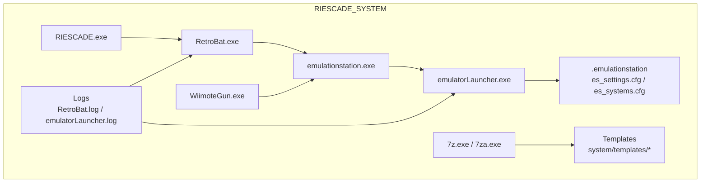
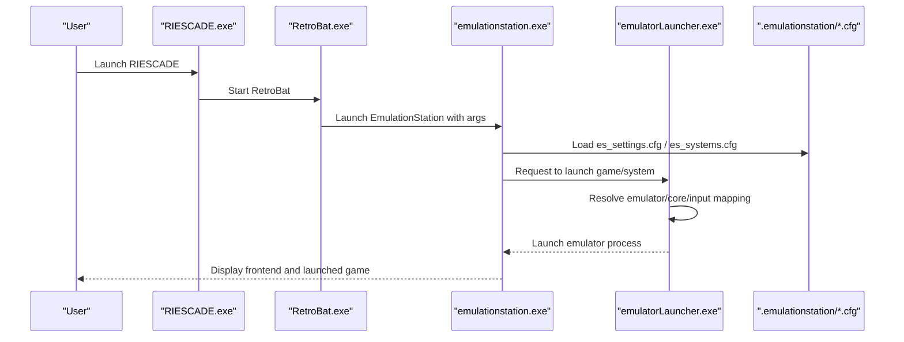
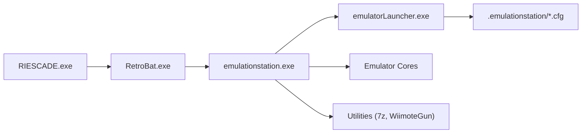

# Installation Issues

<cite>
**Referenced Files in This Document**
- [README.md](file://README.md)
- [license.txt](file://license.txt)
- [retrobat.ini](file://retrobat.ini)
- [RetroBat.log](file://RetroBat.log)
- [emulatorLauncher.log](file://emulationstation/emulatorLauncher.log)
- [RIESCADE.exe](file://RIESCADE.exe)
- [RetroBat.exe](file://RetroBat.exe)
- [emulationstation.exe](file://emulationstation/emulationstation.exe)
- [emulatorLauncher.exe](file://emulationstation/emulatorLauncher.exe)
- [WiimoteGun.exe](file://emulationstation/WiimoteGun.exe)
- [7z.exe](file://emulationstation/7z.exe)
- [7za.exe](file://emulationstation/7za.exe)
- [WiimoteGun.exe.config](file://emulationstation/WiimoteGun.exe.config)
- [WiimoteGun.log](file://emulationstation/batocera-store.log)
- [es_update.log](file://emulationstation/es-update.log)
- [es_checkversion.log](file://emulationstation/es-checkversion.log)
- [x64controllers.log](file://emulationstation/x64controllers.log)
- [emulatorLauncher.log](file://emulationstation/emulatorLauncher.log)
- [installed.txt](file://system/templates/ppsspp/installed.txt)
- [Configure Ryujinx.bat](file://system/templates/ryujinx/Configure Ryujinx.bat)
- [Configure altirra.bat](file://system/templates/altirra/Configure altirra.bat)
- [version.info](file://emulationstation/version.info)
- [version.info](file://system/version.info)
</cite>

## Table of Contents
1. [Introduction](#introduction)
2. [Project Structure](#project-structure)
3. [Core Components](#core-components)
4. [Architecture Overview](#architecture-overview)
5. [Detailed Component Analysis](#detailed-component-analysis)
6. [Dependency Analysis](#dependency-analysis)
7. [Performance Considerations](#performance-considerations)
8. [Troubleshooting Guide](#troubleshooting-guide)
9. [Conclusion](#conclusion)
10. [Appendices](#appendices)

## Introduction
This document provides comprehensive troubleshooting guidance for RIESCADE_SYSTEM installation problems. It focuses on common failure modes such as missing dependencies, permission issues, compatibility with existing EmulationStation/RetroBat installations, Windows Defender/UAC prompts, and rollback/recovery procedures. It also covers cleanup of partial installations and resolving file conflicts with existing retro gaming distributions.

## Project Structure
RIESCADE_SYSTEM is organized as a modern Electron-based frontend integrated with EmulationStation/RetroBat. The repository includes:
- Electron main/renderer code and shared utilities
- EmulationStation/RetroBat integration assets and templates
- Launcher and emulator integration logs
- Utility executables and configuration files

**Diagram sources**
- [RIESCADE.exe](file://RIESCADE.exe)
- [RetroBat.exe](file://RetroBat.exe)
- [emulationstation.exe](file://emulationstation/emulationstation.exe)
- [emulatorLauncher.exe](file://emulationstation/emulatorLauncher.exe)
- [WiimoteGun.exe](file://emulationstation/WiimoteGun.exe)
- [7z.exe](file://emulationstation/7z.exe)
- [7za.exe](file://emulationstation/7za.exe)
- [es_settings.cfg](file://emulationstation/.emulationstation/es_settings.cfg)
- [es_systems.cfg](file://emulationstation/.emulationstation/es_systems.cfg)
- [RetroBat.log](file://RetroBat.log)
- [emulatorLauncher.log](file://emulationstation/emulatorLauncher.log)

**Section sources**
- [README.md:34-44](file://README.md#L34-L44)

## Core Components
- RIESCADE.exe: Entry point for the RIESCADE frontend.
- RetroBat.exe: Launcher orchestrating EmulationStation and RetroBat configuration.
- emulationstation.exe: EmulationStation frontend.
- emulatorLauncher.exe: Integrates with EmulationStation to launch emulators and cores.
- WiimoteGun.exe: Optional Wiimote gun utility.
- 7z.exe / 7za.exe: Archive extraction utilities used by the distribution.
- Templates: System templates for emulators and tools.
- Logs: RetroBat.log and emulatorLauncher.log capture runtime diagnostics.

**Section sources**
- [README.md:12-32](file://README.md#L12-L32)
- [README.md:34-44](file://README.md#L34-L44)

## Architecture Overview
RIESCADE_SYSTEM integrates with EmulationStation/RetroBat by placing itself under the EmulationStation folder and leveraging emulatorLauncher.exe to orchestrate emulator launches. The launcher reads configuration files and coordinates UI, input mapping, and core selection.

**Diagram sources**
- [RetroBat.log:37-49](file://RetroBat.log#L37-L49)
- [emulatorLauncher.log:1-20](file://emulationstation/emulatorLauncher.log#L1-L20)
- [es_settings.cfg](file://emulationstation/.emulationstation/es_settings.cfg)
- [es_systems.cfg](file://emulationstation/.emulationstation/es_systems.cfg)

**Section sources**
- [README.md:41-44](file://README.md#L41-L44)
- [RetroBat.log:37-49](file://RetroBat.log#L37-L49)
- [emulatorLauncher.log:1-20](file://emulationstation/emulatorLauncher.log#L1-L20)

## Detailed Component Analysis

### Installation Entry Points and Paths
- RIESCADE.exe and RetroBat.exe are the primary executables.
- emulationstation.exe must be present and discoverable by RetroBat.
- emulatorLauncher.exe is used to launch emulators and cores.

Common issues:
- Executable not found errors indicate incorrect placement or missing binaries.
- Path resolution failures occur when the app is not placed under the EmulationStation folder.

**Section sources**
- [README.md:41-44](file://README.md#L41-L44)
- [RetroBat.log:37-39](file://RetroBat.log#L37-L39)

### EmulationStation/RetroBat Configuration
- es_settings.cfg and es_systems.cfg are critical configuration files.
- retrobat.ini controls RetroBat behavior such as fullscreen, monitors, and autostart.

Common issues:
- Corrupted or missing configuration files cause UI or launch failures.
- Incorrect monitor index or fullscreen settings can prevent proper display.

**Section sources**
- [retrobat.ini:50-94](file://retrobat.ini#L50-L94)
- [RetroBat.log:38-39](file://RetroBat.log#L38-L39)

### Emulator Integration and Cores
- emulatorLauncher.exe generates per-system configurations and launches cores.
- Logs show core availability checks and launch commands.

Common issues:
- Missing cores result in “Core is not installed” errors.
- Incorrect shader or core paths lead to launch failures.

**Section sources**
- [emulatorLauncher.log:331-334](file://emulationstation/emulatorLauncher.log#L331-L334)
- [emulatorLauncher.log:18-20](file://emulationstation/emulatorLauncher.log#L18-L20)

### Tools and Utilities
- 7z.exe and 7za.exe are used for archive extraction.
- WiimoteGun.exe supports Wiimote navigation.

Common issues:
- Missing or incompatible DLLs cause crashes or failures.
- WiimoteGun.exe requires proper configuration via WiimoteGun.exe.config.

**Section sources**
- [7z.exe](file://emulationstation/7z.exe)
- [7za.exe](file://emulationstation/7za.exe)
- [WiimoteGun.exe.config](file://emulationstation/WiimoteGun.exe.config)

### Version Information
- version.info files in emulationstation and system directories track distribution versions.

**Section sources**
- [version.info](file://emulationstation/version.info)
- [version.info](file://system/version.info)

## Dependency Analysis
RIESCADE_SYSTEM relies on:
- Electron-based frontend (RIESCADE.exe)
- RetroBat launcher (RetroBat.exe)
- EmulationStation frontend (emulationstation.exe)
- EmulatorLauncher integration (emulatorLauncher.exe)
- Emulator cores and tools (cores, shaders, utilities)
- Configuration files (.emulationstation/*.cfg)

**Diagram sources**
- [RIESCADE.exe](file://RIESCADE.exe)
- [RetroBat.exe](file://RetroBat.exe)
- [emulationstation.exe](file://emulationstation/emulationstation.exe)
- [emulatorLauncher.exe](file://emulationstation/emulatorLauncher.exe)
- [es_settings.cfg](file://emulationstation/.emulationstation/es_settings.cfg)
- [es_systems.cfg](file://emulationstation/.emulationstation/es_systems.cfg)

**Section sources**
- [README.md:36-39](file://README.md#L36-L39)
- [emulatorLauncher.log:1-20](file://emulationstation/emulatorLauncher.log#L1-L20)

## Performance Considerations
- Fullscreen and monitor settings impact performance and display behavior.
- VSync and OpenGL compatibility settings affect rendering stability.
- Shader and core selection influence launch speed and stability.

[No sources needed since this section provides general guidance]

## Troubleshooting Guide

### Step-by-Step Solutions

#### 1. Missing Dependencies
Symptoms:
- Application fails to start or displays dependency-related errors.
- Missing DLLs or tools cause crashes.

Actions:
- Verify presence of required executables and libraries:
  - RIESCADE.exe, RetroBat.exe, emulationstation.exe, emulatorLauncher.exe
  - 7z.exe/7za.exe, WiimoteGun.exe
  - Required DLLs (e.g., SDL2.dll, SQLite.Interop.dll)
- Confirm all template tools are present under system/templates.

Recovery:
- Reinstall the distribution to restore missing binaries.
- Ensure the working directory contains all expected files.

**Section sources**
- [RIESCADE.exe](file://RIESCADE.exe)
- [RetroBat.exe](file://RetroBat.exe)
- [emulationstation.exe](file://emulationstation/emulationstation.exe)
- [emulatorLauncher.exe](file://emulationstation/emulatorLauncher.exe)
- [7z.exe](file://emulationstation/7z.exe)
- [7za.exe](file://emulationstation/7za.exe)
- [WiimoteGun.exe](file://emulationstation/WiimoteGun.exe)

#### 2. Permission Issues and UAC Prompts
Symptoms:
- Windows Defender SmartScreen or UAC blocks execution.
- Installation or updates fail due to insufficient privileges.

Actions:
- Run executables as Administrator when performing installation or updates.
- Adjust SmartScreen settings temporarily during installation if necessary.
- Ensure the target installation path allows write access.

Notes:
- Some operations may require elevation; avoid running from protected locations like Program Files unless properly signed.

**Section sources**
- [RetroBat.log:40-41](file://RetroBat.log#L40-L41)

#### 3. Compatibility Problems with Existing EmulationStation/RetroBat Installations
Symptoms:
- Conflicts with existing EmulationStation/RetroBat configurations.
- es_settings.cfg or es_systems.cfg not recognized or overwritten unexpectedly.

Actions:
- Place RIESCADE_SYSTEM under the EmulationStation folder as intended by the project structure.
- Back up existing es_settings.cfg and es_systems.cfg before installation.
- Review retrobat.ini for conflicting settings (fullscreen, monitors, autostart).

Recovery:
- Restore backed-up configuration files if overwritten.
- Adjust retrobat.ini to match your environment.

**Section sources**
- [README.md:41-44](file://README.md#L41-L44)
- [retrobat.ini:50-94](file://retrobat.ini#L50-L94)
- [RetroBat.log:38-39](file://RetroBat.log#L38-L39)

#### 4. Dependency Conflicts and Core Availability
Symptoms:
- “Core is not installed” errors during launch.
- Missing cores or mismatched core versions.

Actions:
- Use emulatorLauncher’s core update mechanism (visible in logs).
- Verify core presence in the expected cores directory.
- Ensure shader paths referenced by emulatorLauncher are valid.

Recovery:
- Install missing cores via the store/update mechanism.
- Rebuild or repair the cores/shaders directory structure.

**Section sources**
- [emulatorLauncher.log:331-334](file://emulationstation/emulatorLauncher.log#L331-L334)
- [emulatorLauncher.log:18-20](file://emulationstation/emulatorLauncher.log#L18-L20)

#### 5. Windows Compatibility Issues
Symptoms:
- Rendering glitches, missing features, or crashes related to graphics drivers.
- Incompatibility with older GPUs or outdated OpenGL support.

Actions:
- Enable OpenGL2_1 compatibility mode in retrobat.ini if needed.
- Adjust VSync and fullscreen settings to stabilize rendering.
- Reduce shader complexity or switch to compatible presets.

**Section sources**
- [retrobat.ini:82-83](file://retrobat.ini#L82-L83)
- [retrobat.ini:76-77](file://retrobat.ini#L76-L77)

#### 6. Integration Challenges with Existing Retro Gaming Setups
Symptoms:
- Conflicts with existing ROMs, saves, or configs.
- Template tools not launching correctly.

Actions:
- Review template scripts (e.g., Configure Ryujinx.bat, Configure altirra.bat) for correct paths.
- Ensure installed.txt entries point to valid save directories.
- Keep ROMs and saves outside conflicting paths managed by the launcher.

Recovery:
- Adjust template paths to match your setup.
- Validate save directories referenced by installed.txt.

**Section sources**
- [Configure Ryujinx.bat](file://system/templates/ryujinx/Configure Ryujinx.bat)
- [Configure altirra.bat](file://system/templates/altirra/Configure altirra.bat)
- [installed.txt](file://system/templates/ppsspp/installed.txt)

#### 7. Antivirus Interference and Windows Defender Warnings
Symptoms:
- Antivirus flags executables as suspicious.
- SmartScreen prompts block unsigned or unknown publishers.

Actions:
- Temporarily whitelist the installation directory during setup.
- Sign executables with a trusted certificate for production environments.
- Provide a note in the installer that the project is open-source and safe.

Notes:
- Some actions may require administrator consent; ensure UAC is configured appropriately.

**Section sources**
- [RetroBat.log:40-41](file://RetroBat.log#L40-L41)

#### 8. Rollback Procedures for Failed Installations
Steps:
- Stop all running processes (RIESCADE.exe, RetroBat.exe, emulationstation.exe, emulatorLauncher.exe).
- Remove or rename the current installation directory.
- Restore backed-up configuration files (es_settings.cfg, es_systems.cfg).
- Reinstall a known-good version of the distribution.
- Re-apply any custom retrobat.ini settings carefully.

Validation:
- Launch RetroBat.exe and confirm EmulationStation starts without errors.
- Check RetroBat.log and emulatorLauncher.log for successful initialization.

**Section sources**
- [RetroBat.log:37-49](file://RetroBat.log#L37-L49)
- [emulatorLauncher.log:1-20](file://emulationstation/emulatorLauncher.log#L1-L20)

#### 9. Recovery from Corrupted Installations
Steps:
- Clean up partial files left behind by uninstalling or resetting the directory.
- Re-extract the distribution to a fresh location.
- Reconfigure es_settings.cfg and es_systems.cfg from backups.
- Reinstall missing cores and utilities.

Validation:
- Run emulatorLauncher.exe manually to verify core detection and shader paths.
- Launch emulationstation.exe and confirm UI responsiveness.

**Section sources**
- [emulatorLauncher.log:331-334](file://emulationstation/emulatorLauncher.log#L331-L334)
- [emulatorLauncher.log:18-20](file://emulationstation/emulatorLauncher.log#L18-L20)

#### 10. Cleaning Up Partial Installations and Resolving File Conflicts
Actions:
- Identify leftover files from previous installs (logs, temporary directories).
- Remove conflicting configuration files and replace with clean copies.
- Delete orphaned cores or shaders that do not belong to the current setup.
- Ensure no lingering processes are locking files.

Validation:
- Restart the system if necessary to release file locks.
- Verify that emulatorLauncher.exe can write logs and temporary files.

**Section sources**
- [emulatorLauncher.log:1-20](file://emulationstation/emulatorLauncher.log#L1-L20)

### Platform-Specific Guidance

#### Windows Versions and Architectures
- Ensure the correct architecture (x64) binaries are used for your OS.
- Older Windows versions may require additional compatibility settings.
- Some legacy GPUs may need OpenGL2_1 compatibility mode.

**Section sources**
- [retrobat.ini:82-83](file://retrobat.ini#L82-L83)

#### License and Distribution Notes
- The project is distributed under the LGPL v3 and CC BY-NC-SA 4.0 licenses.
- Commercial use is restricted; redistribution rules apply.

**Section sources**
- [license.txt:1-19](file://license.txt#L1-L19)

## Conclusion
RIESCADE_SYSTEM integrates tightly with EmulationStation/RetroBat and depends on correct placement, configuration, and core availability. Most installation issues stem from missing dependencies, permission/UAC prompts, configuration conflicts, or core availability. Following the step-by-step solutions and rollback procedures outlined here will resolve most problems and enable a stable setup.

## Appendices

### Appendix A: Key Log Locations
- RetroBat.log: General launcher and startup diagnostics.
- emulatorLauncher.log: Emulator launch, core detection, and input mapping logs.

**Section sources**
- [RetroBat.log:1-50](file://RetroBat.log#L1-L50)
- [emulatorLauncher.log:1-20](file://emulationstation/emulatorLauncher.log#L1-L20)