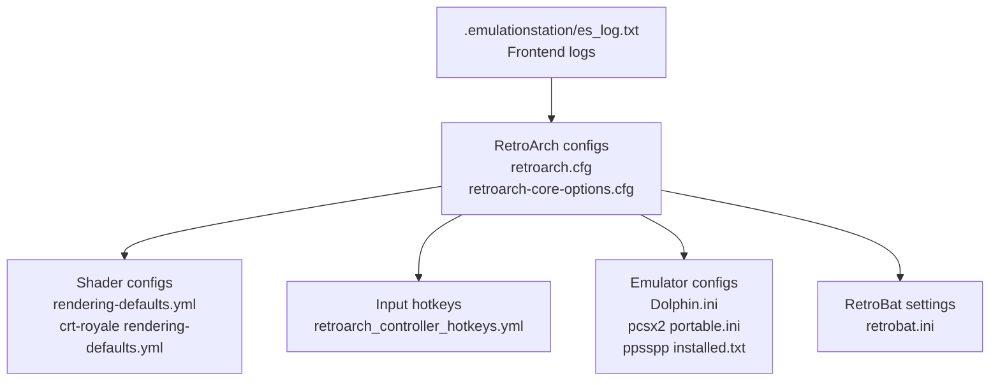
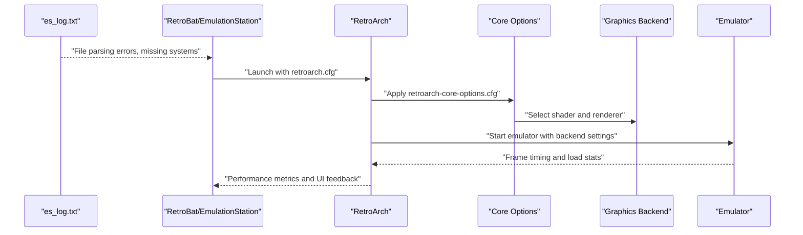
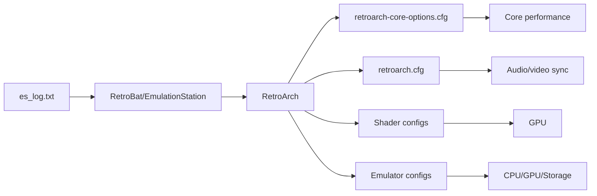

# Performance Troubleshooting

<cite>
**Referenced Files in This Document**
- [es_log.txt](file://emulationstation/.emulationstation/es_log.txt)
- [retrobat.ini](file://retrobat.ini)
- [retroarch.cfg](file://system/templates/retroarch/retroarch.cfg)
- [retroarch-core-options.cfg](file://system/templates/retroarch/retroarch-core-options.cfg)
- [rendering-defaults.yml](file://system/shaders/configs/[riescade]/rendering-defaults.yml)
- [crt-royale rendering-defaults.yml](file://system/shaders/configs/crt-royale/rendering-defaults.yml)
- [Dolphin.ini](file://system/templates/dolphin-emu/User\Config/Dolphin.ini)
- [pcsx2 portable.ini](file://system/templates/pcsx2/portable.ini)
- [installed.txt](file://system/templates/ppsspp/installed.txt)
- [retroarch_controller_hotkeys.yml](file://system/resources/inputmapping/retroarch_controller_hotkeys.yml)
</cite>

## Table of Contents
1. [Introduction](#introduction)
2. [Project Structure](#project-structure)
3. [Core Components](#core-components)
4. [Architecture Overview](#architecture-overview)
5. [Detailed Component Analysis](#detailed-component-analysis)
6. [Dependency Analysis](#dependency-analysis)
7. [Performance Considerations](#performance-considerations)
8. [Troubleshooting Guide](#troubleshooting-guide)
9. [Conclusion](#conclusion)
10. [Appendices](#appendices)

## Introduction
This document provides a comprehensive performance troubleshooting guide for RIESCADE_SYSTEM. It focuses on diagnosing and resolving common performance issues such as slow game loading, emulator launch delays, and visual rendering problems. It explains how to analyze es_log.txt for performance bottlenecks, identify resource-intensive emulators, and optimize system settings for improved performance. Guidance is included for shader-related performance issues, memory leaks, graphics driver conflicts, CPU usage spikes, GPU utilization problems, and disk I/O bottlenecks. Practical steps are provided for performance monitoring, system optimization, and hardware compatibility.

## Project Structure
RIESCADE_SYSTEM organizes performance-critical configuration under several key areas:
- EmulationStation logs and frontend settings
- RetroArch global and per-core options
- Shader configurations for CRT and modern effects
- Emulator-specific configurations (e.g., Dolphin, PCSX2, PPSSPP)
- Input mapping and hotkeys for performance-sensitive actions

**Diagram sources**
- [es_log.txt](file://emulationstation/.emulationstation/es_log.txt)
- [retroarch.cfg](file://system/templates/retroarch/retroarch.cfg)
- [retroarch-core-options.cfg](file://system/templates/retroarch/retroarch-core-options.cfg)
- [rendering-defaults.yml](file://system/shaders/configs/[riescade]/rendering-defaults.yml)
- [crt-royale rendering-defaults.yml](file://system/shaders/configs/crt-royale/rendering-defaults.yml)
- [retroarch_controller_hotkeys.yml](file://system/resources/inputmapping/retroarch_controller_hotkeys.yml)
- [Dolphin.ini](file://system/templates/dolphin-emu/User\Config/Dolphin.ini)
- [pcsx2 portable.ini](file://system/templates/pcsx2/portable.ini)
- [installed.txt](file://system/templates/ppsspp/installed.txt)
- [retrobat.ini](file://retrobat.ini)

**Section sources**
- [es_log.txt](file://emulationstation/.emulationstation/es_log.txt)
- [retrobat.ini](file://retrobat.ini)
- [retroarch.cfg](file://system/templates/retroarch/retroarch.cfg)
- [retroarch-core-options.cfg](file://system/templates/retroarch/retroarch-core-options.cfg)
- [rendering-defaults.yml](file://system/shaders/configs/[riescade]/rendering-defaults.yml)
- [crt-royale rendering-defaults.yml](file://system/shaders/configs/crt-royale/rendering-defaults.yml)
- [Dolphin.ini](file://system/templates/dolphin-emu/User\Config/Dolphin.ini)
- [pcsx2 portable.ini](file://system/templates/pcsx2/portable.ini)
- [installed.txt](file://system/templates/ppsspp/installed.txt)
- [retroarch_controller_hotkeys.yml](file://system/resources/inputmapping/retroarch_controller_hotkeys.yml)

## Core Components
- EmulationStation logs: Identify file parsing errors, missing systems, and network connectivity issues that impact performance.
- RetroArch configuration: Controls audio latency, synchronization, shaders, and core options that directly affect frame pacing and throughput.
- Shader configurations: Select CRT or modern shaders that balance authenticity and performance.
- Emulator-specific settings: Graphics backend selection, CPU threading, and fast-load options influence launch and runtime performance.
- Input hotkeys: Streamlined hotkeys reduce UI overhead during gameplay.

Key configuration anchors:
- Frontend and rendering: [retrobat.ini](file://retrobat.ini), [rendering-defaults.yml](file://system/shaders/configs/[riescade]/rendering-defaults.yml), [crt-royale rendering-defaults.yml](file://system/shaders/configs/crt-royale/rendering-defaults.yml)
- RetroArch engine: [retroarch.cfg](file://system/templates/retroarch/retroarch.cfg), [retroarch-core-options.cfg](file://system/templates/retroarch/retroarch-core-options.cfg)
- Emulators: [Dolphin.ini](file://system/templates/dolphin-emu/User\Config/Dolphin.ini), [pcsx2 portable.ini](file://system/templates/pcsx2/portable.ini), [installed.txt](file://system/templates/ppsspp/installed.txt)
- Input: [retroarch_controller_hotkeys.yml](file://system/resources/inputmapping/retroarch_controller_hotkeys.yml)

**Section sources**
- [retrobat.ini](file://retrobat.ini)
- [rendering-defaults.yml](file://system/shaders/configs/[riescade]/rendering-defaults.yml)
- [crt-royale rendering-defaults.yml](file://system/shaders/configs/crt-royale/rendering-defaults.yml)
- [retroarch.cfg](file://system/templates/retroarch/retroarch.cfg)
- [retroarch-core-options.cfg](file://system/templates/retroarch/retroarch-core-options.cfg)
- [Dolphin.ini](file://system/templates/dolphin-emu/User\Config/Dolphin.ini)
- [pcsx2 portable.ini](file://system/templates/pcsx2/portable.ini)
- [installed.txt](file://system/templates/ppsspp/installed.txt)
- [retroarch_controller_hotkeys.yml](file://system/resources/inputmapping/retroarch_controller_hotkeys.yml)

## Architecture Overview
The performance pipeline connects frontend logging, RetroArch rendering, and emulator backends. Logs inform diagnostics; configurations tune synchronization, shaders, and cores; and emulator settings govern GPU/CPU utilization.

**Diagram sources**
- [es_log.txt](file://emulationstation/.emulationstation/es_log.txt)
- [retroarch.cfg](file://system/templates/retroarch/retroarch.cfg)
- [retroarch-core-options.cfg](file://system/templates/retroarch/retroarch-core-options.cfg)
- [Dolphin.ini](file://system/templates/dolphin-emu/User\Config/Dolphin.ini)

## Detailed Component Analysis

### EmulationStation Logging and Slow Loading
Common symptoms:
- Repeated “Error finding/creating FileData” messages indicate ROM path issues or unsupported extensions.
- “System is missing name, extension, or command!” suggests misconfigured systems.

Diagnosis steps:
- Filter es_log.txt for “Error finding/creating FileData” and “System ... is missing name, extension, or command!”.
- Verify ROM paths and supported extensions for each system.
- Confirm system commands and extensions match installed emulators.

Resolution tips:
- Remove or fix problematic ROM entries.
- Correct system definitions in EmulationStation configuration.
- Reduce gamelist.xml parsing scope if needed via RetroBat settings.

**Section sources**
- [es_log.txt](file://emulationstation/.emulationstation/es_log.txt)

### RetroArch Rendering and Shader Performance
Shaders significantly impact GPU utilization and frame pacing:
- CRT shaders emulate phosphor trails and scanlines but increase fill rate.
- Modern shaders improve sharpness but may raise bandwidth pressure.

Recommendations:
- Use [rendering-defaults.yml](file://system/shaders/configs/[riescade]/rendering-defaults.yml) to select CRT geometry shaders and scanlines for CRT feel.
- Switch to [crt-royale rendering-defaults.yml](file://system/shaders/configs/crt-royale/rendering-defaults.yml) for higher-quality CRT simulation if GPU can handle it.
- Monitor FPS and adjust shader intensity or disable scanlines for performance.

**Section sources**
- [rendering-defaults.yml](file://system/shaders/configs/[riescade]/rendering-defaults.yml)
- [crt-royale rendering-defaults.yml](file://system/shaders/configs/crt-royale/rendering-defaults.yml)

### RetroArch Global and Per-Core Tuning
Global tuning (retroarch.cfg):
- Audio latency and resampler quality affect responsiveness and CPU usage.
- Synchronization settings (rate control, fastforward frameskip) influence smoothness.
- Auto overrides and remaps reduce per-game overhead.

Per-core tuning (retroarch-core-options.cfg):
- CPU overclock, GPU renderer, and internal resolution toggles vary by core.
- Frame skipping and low-pass filters can stabilize frame rates on weak GPUs.
- DSP and audio quality controls impact CPU load.

Action checklist:
- Lower audio latency and resampler quality for lower CPU usage.
- Enable frameskip and adjust thresholds for stutter-free playback.
- Disable expensive filters and textures for problematic cores.

**Section sources**
- [retroarch.cfg](file://system/templates/retroarch/retroarch.cfg)
- [retroarch-core-options.cfg](file://system/templates/retroarch/retroarch-core-options.cfg)

### Emulator-Specific Performance (Dolphin)
Dolphin settings affecting performance:
- Graphics backend selection (Vulkan) impacts stability and speed.
- Fast disc speed and CPU threading toggle can reduce load times.
- Texture cache accuracy and mipmapping trade quality for speed.

Optimization tips:
- Prefer Vulkan backend for modern GPUs.
- Enable fast disc speed for disc-based titles.
- Reduce texture cache accuracy or disable mipmaps for older GPUs.

**Section sources**
- [Dolphin.ini](file://system/templates/dolphin-emu/User\Config/Dolphin.ini)

### Emulator-Specific Performance (PCSX2)
Minimal configuration indicates wizard completion and defaults. Typical performance improvements:
- Enable hardware shader and accurate multiplication for visual fidelity.
- Adjust resolution factor and texture filtering for GPU-bound scenarios.

**Section sources**
- [pcsx2 portable.ini](file://system/templates/pcsx2/portable.ini)

### Emulator-Specific Performance (PPSSPP)
Location and save path configuration:
- Ensure installed.txt points to a valid saves directory to avoid I/O stalls.
- Use external storage on SSD for faster load times.

**Section sources**
- [installed.txt](file://system/templates/ppsspp/installed.txt)

### Input Hotkeys and UI Overhead
Streamlined hotkeys reduce UI lag during gameplay:
- Use [retroarch_controller_hotkeys.yml](file://system/resources/inputmapping/retroarch_controller_hotkeys.yml) to minimize menu toggles and state operations during performance-sensitive sessions.

**Section sources**
- [retroarch_controller_hotkeys.yml](file://system/resources/inputmapping/retroarch_controller_hotkeys.yml)

## Dependency Analysis
Performance depends on coordinated settings across frontend, RetroArch, shaders, and emulators.

**Diagram sources**
- [es_log.txt](file://emulationstation/.emulationstation/es_log.txt)
- [retroarch.cfg](file://system/templates/retroarch/retroarch.cfg)
- [retroarch-core-options.cfg](file://system/templates/retroarch/retroarch-core-options.cfg)
- [rendering-defaults.yml](file://system/shaders/configs/[riescade]/rendering-defaults.yml)
- [crt-royale rendering-defaults.yml](file://system/shaders/configs/crt-royale/rendering-defaults.yml)
- [Dolphin.ini](file://system/templates/dolphin-emu/User\Config/Dolphin.ini)

**Section sources**
- [es_log.txt](file://emulationstation/.emulationstation/es_log.txt)
- [retroarch.cfg](file://system/templates/retroarch/retroarch.cfg)
- [retroarch-core-options.cfg](file://system/templates/retroarch/retroarch-core-options.cfg)
- [rendering-defaults.yml](file://system/shaders/configs/[riescade]/rendering-defaults.yml)
- [crt-royale rendering-defaults.yml](file://system/shaders/configs/crt-royale/rendering-defaults.yml)
- [Dolphin.ini](file://system/templates/dolphin-emu/User\Config/Dolphin.ini)

## Performance Considerations
- CPU usage spikes:
  - Reduce audio resampler quality and latency.
  - Disable overlays and excessive hotkeys.
  - Lower core overclock and renderer quality for heavy cores.
- GPU utilization problems:
  - Switch to less demanding CRT shaders or modern alternatives.
  - Disable scanlines and expensive post-processing.
  - Prefer Vulkan/Direct3D12 backends on modern GPUs.
- Disk I/O bottlenecks:
  - Move saves and cache to SSD.
  - Enable fast disc speed in emulators.
  - Reduce texture cache sizes and mipmaps.
- Memory leaks:
  - Restart emulators periodically.
  - Disable long-running background features.
  - Use minimal shader sets and fewer overlays.

[No sources needed since this section provides general guidance]

## Troubleshooting Guide

### Diagnose Slow Game Loading
- Review es_log.txt for repeated “Error finding/creating FileData” and “System ... is missing name, extension, or command!” entries.
- Confirm ROM paths and supported extensions.
- Narrow gamelist scope via RetroBat settings if parsing is slow.

**Section sources**
- [es_log.txt](file://emulationstation/.emulationstation/es_log.txt)
- [retrobat.ini](file://retrobat.ini)

### Resolve Emulator Launch Delays
- Verify system commands and extensions in EmulationStation.
- Ensure emulator backends (e.g., Vulkan) are selected appropriately.
- Enable fast disc speed and skip BIOS where applicable.

**Section sources**
- [Dolphin.ini](file://system/templates/dolphin-emu/User\Config/Dolphin.ini)

### Fix Visual Rendering Problems
- Adjust shader selection in [rendering-defaults.yml](file://system/shaders/configs/[riescade]/rendering-defaults.yml) or switch to [crt-royale rendering-defaults.yml](file://system/shaders/configs/crt-royale/rendering-defaults.yml).
- Disable scanlines or lower shader intensity for GPU-limited systems.

**Section sources**
- [rendering-defaults.yml](file://system/shaders/configs/[riescade]/rendering-defaults.yml)
- [crt-royale rendering-defaults.yml](file://system/shaders/configs/crt-royale/rendering-defaults.yml)

### Optimize RetroArch Settings
- Tune audio latency and resampler quality in [retroarch.cfg](file://system/templates/retroarch/retroarch.cfg).
- Apply per-core options in [retroarch-core-options.cfg](file://system/templates/retroarch/retroarch-core-options.cfg) to balance quality and performance.

**Section sources**
- [retroarch.cfg](file://system/templates/retroarch/retroarch.cfg)
- [retroarch-core-options.cfg](file://system/templates/retroarch/retroarch-core-options.cfg)

### Address CPU Usage Spikes
- Lower audio resampler quality and latency.
- Disable overlays and unnecessary hotkeys.
- Reduce core overclock and renderer quality.

**Section sources**
- [retroarch.cfg](file://system/templates/retroarch/retroarch.cfg)
- [retroarch-core-options.cfg](file://system/templates/retroarch/retroarch-core-options.cfg)
- [retroarch_controller_hotkeys.yml](file://system/resources/inputmapping/retroarch_controller_hotkeys.yml)

### Improve GPU Utilization
- Choose appropriate shader sets and disable scanlines.
- Prefer Vulkan/Direct3D12 backends.
- Reduce texture cache and mipmaps for older GPUs.

**Section sources**
- [rendering-defaults.yml](file://system/shaders/configs/[riescade]/rendering-defaults.yml)
- [crt-royale rendering-defaults.yml](file://system/shaders/configs/crt-royale/rendering-defaults.yml)
- [Dolphin.ini](file://system/templates/dolphin-emu/User\Config/Dolphin.ini)

### Reduce Disk I/O Bottlenecks
- Place saves and cache on SSD.
- Enable fast disc speed in emulators.
- Disable heavy texture caching and mipmaps.

**Section sources**
- [installed.txt](file://system/templates/ppsspp/installed.txt)
- [Dolphin.ini](file://system/templates/dolphin-emu/User\Config/Dolphin.ini)

### Resolve Memory Leaks
- Restart emulators regularly.
- Disable long-running background features.
- Use minimal shader sets and fewer overlays.

[No sources needed since this section provides general guidance]

### Hardware Compatibility Issues
- Use modern graphics backends (Vulkan/Direct3D12) when available.
- Adjust CRT shader intensity for integrated GPUs.
- Prefer lower internal resolutions for weak CPUs/GPUs.

[No sources needed since this section provides general guidance]

## Conclusion
RIESCADE_SYSTEM performance hinges on coordinated configuration across EmulationStation logs, RetroArch settings, shaders, and emulator backends. Use es_log.txt to identify file and system issues, apply targeted RetroArch and emulator optimizations, and select shader configurations that match your hardware capabilities. Regular maintenance, SSD placement, and sensible defaults will sustain smooth performance across diverse emulators.

[No sources needed since this section summarizes without analyzing specific files]

## Appendices

### Quick Reference: Key Files and Sections
- Frontend logging and system issues: [es_log.txt](file://emulationstation/.emulationstation/es_log.txt)
- Frontend rendering and UI: [retrobat.ini](file://retrobat.ini)
- RetroArch engine and per-core tuning: [retroarch.cfg](file://system/templates/retroarch/retroarch.cfg), [retroarch-core-options.cfg](file://system/templates/retroarch/retroarch-core-options.cfg)
- Shader configurations: [rendering-defaults.yml](file://system/shaders/configs/[riescade]/rendering-defaults.yml), [crt-royale rendering-defaults.yml](file://system/shaders/configs/crt-royale/rendering-defaults.yml)
- Emulator backends: [Dolphin.ini](file://system/templates/dolphin-emu/User\Config/Dolphin.ini), [pcsx2 portable.ini](file://system/templates/pcsx2/portable.ini), [installed.txt](file://system/templates/ppsspp/installed.txt)
- Input hotkeys: [retroarch_controller_hotkeys.yml](file://system/resources/inputmapping/retroarch_controller_hotkeys.yml)

[No sources needed since this section lists files without analysis]