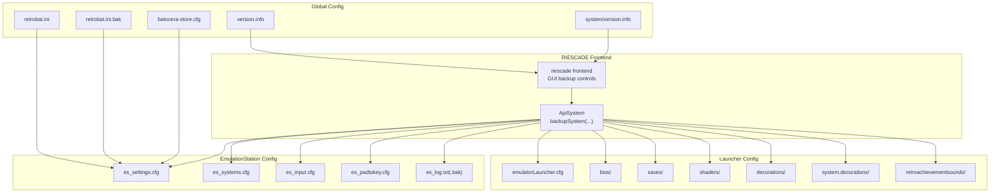
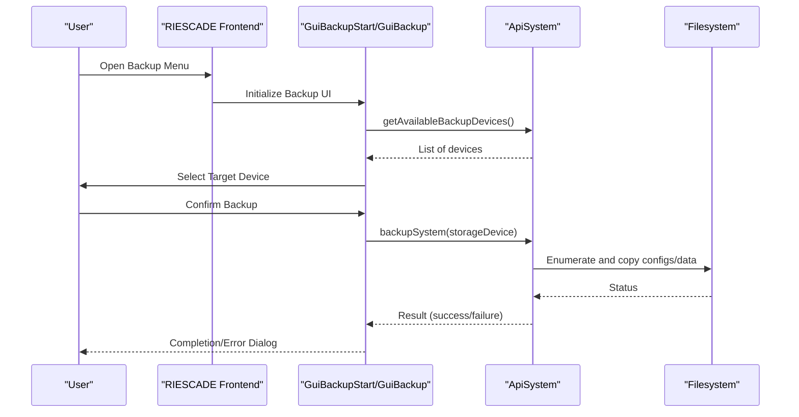
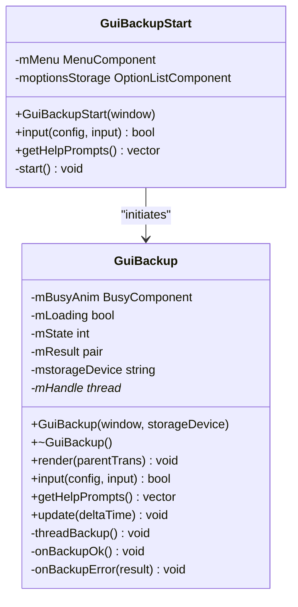
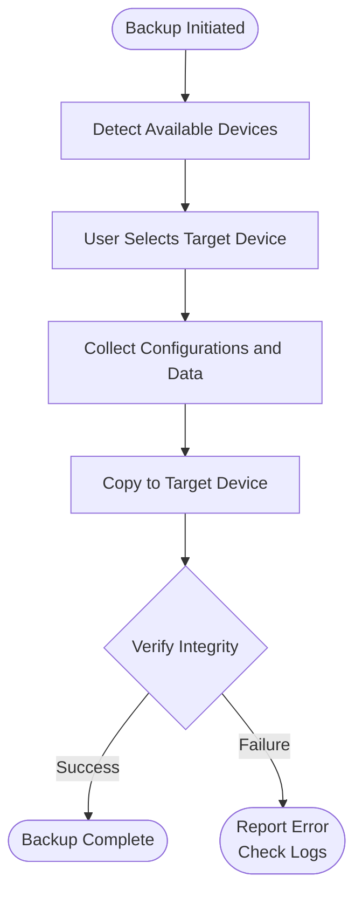
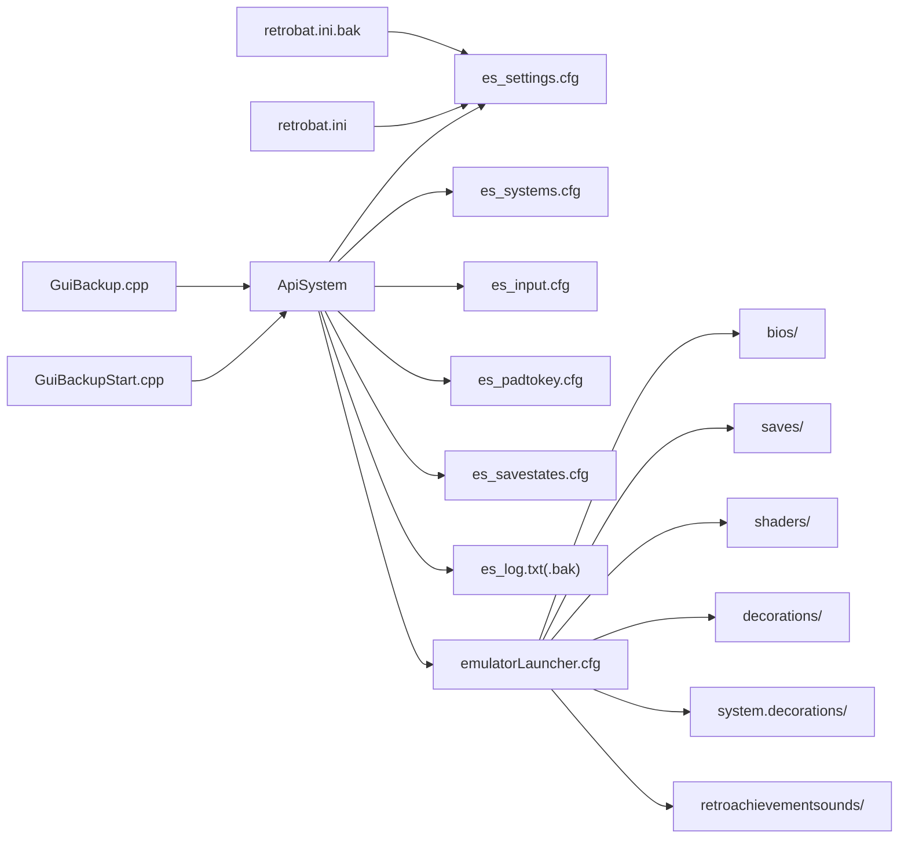

# Recovery and Reset Procedures

<cite>
**Referenced Files in This Document**
- [README.md](file://README.md)
- [retrobat.ini](file://retrobat.ini)
- [retrobat.ini.bak](file://retrobat.ini.bak)
- [emulatorLauncher.cfg](file://emulationstation/emulatorLauncher.cfg)
- [version.info](file://emulationstation/version.info)
- [system.version.info](file://system/version.info)
- [GuiBackupStart.cpp](file://emulationstation/.riescade/src/docs/es_src/guis/GuiBackupStart.cpp)
- [GuiBackup.cpp](file://emulationstation/.riescade/src/docs/es_src/guis/GuiBackup.cpp)
- [GuiBackup.h](file://emulationstation/.riescade/src/docs/es_src/guis/GuiBackup.h)
- [es_settings.cfg](file://emulationstation/.emulationstation/es_settings.cfg)
- [es_systems.cfg](file://emulationstation/.emulationstation/es_systems.cfg)
- [es_input.cfg](file://emulationstation/.emulationstation/es_input.cfg)
- [es_padtokey.cfg](file://emulationstation/.emulationstation/es_padtokey.cfg)
- [es_savestates.cfg](file://emulationstation/.emulationstation/es_savestates.cfg)
- [es_log.txt](file://emulationstation/.emulationstation/es_log.txt)
- [es_log.txt.bak](file://emulationstation/.emulationstation/es_log.txt.bak)
- [batocera-store.cfg](file://emulationstation/batocera-store.cfg)
- [user.inputmapping.mame](file://user/inputmapping/mame)
- [user.tattoos](file://user/tattoos)
- [system.templates.emulationstation.es_settings.cfg](file://system/templates/emulationstation/es_settings.cfg)
- [system.templates.emulationstation.es_systems.cfg](file://system/templates/emulationstation/es_systems.cfg)
- [system.templates.emulationstation.es_input.cfg](file://system/templates/emulationstation/es_input.cfg)
- [system.templates.emulationstation.es_padtokey.cfg](file://system/templates/emulationstation/es_padtokey.cfg)
</cite>

## Table of Contents
1. [Introduction](#introduction)
2. [Project Structure](#project-structure)
3. [Core Components](#core-components)
4. [Architecture Overview](#architecture-overview)
5. [Detailed Component Analysis](#detailed-component-analysis)
6. [Dependency Analysis](#dependency-analysis)
7. [Performance Considerations](#performance-considerations)
8. [Troubleshooting Guide](#troubleshooting-guide)
9. [Conclusion](#conclusion)
10. [Appendices](#appendices)

## Introduction
This document provides comprehensive recovery and reset procedures for RIESCADE_SYSTEM. It covers backup and restore of configuration files, user data, and system settings; performing clean reinstalls; resetting configurations to defaults; recovering from corrupted installations; handling critical failures and emulator integration issues; emergency resets and safe mode operations; recovery from update failures; and preserving data during maintenance. Step-by-step procedures are included for backing up current configurations, restoring from backups, and migrating between versions.

## Project Structure
RIESCADE_SYSTEM integrates with EmulationStation/RetroBat and exposes a built-in backup mechanism via the RIESCADE frontend. Key areas for recovery include:
- Global configuration files for RIESCADE and EmulationStation
- EmulatorLauncher configuration pointing to shared data directories
- Version metadata for tracking updates
- Backup UI components that orchestrate system backups to external devices
- User-specific data such as input mappings and tattoos

**Diagram sources**
- [GuiBackupStart.cpp:10-50](file://emulationstation/.riescade/src/docs/es_src/guis/GuiBackupStart.cpp#L10-L50)
- [GuiBackup.cpp:85-93](file://emulationstation/.riescade/src/docs/es_src/guis/GuiBackup.cpp#L85-L93)
- [emulatorLauncher.cfg:1-12](file://emulationstation/emulatorLauncher.cfg#L1-L12)
- [es_settings.cfg](file://emulationstation/.emulationstation/es_settings.cfg)
- [es_systems.cfg](file://emulationstation/.emulationstation/es_systems.cfg)
- [es_input.cfg](file://emulationstation/.emulationstation/es_input.cfg)
- [es_padtokey.cfg](file://emulationstation/.emulationstation/es_padtokey.cfg)
- [es_log.txt](file://emulationstation/.emulationstation/es_log.txt)
- [retrobat.ini:1-94](file://retrobat.ini#L1-L94)
- [retrobat.ini.bak:1-94](file://retrobat.ini.bak#L1-L94)
- [batocera-store.cfg:1-24](file://emulationstation/batocera-store.cfg#L1-L24)
- [version.info:1-1](file://emulationstation/version.info#L1-L1)
- [system.version.info:1-1](file://system/version.info#L1-L1)

**Section sources**
- [README.md:1-44](file://README.md#L1-L44)
- [emulatorLauncher.cfg:1-12](file://emulationstation/emulatorLauncher.cfg#L1-L12)
- [retrobat.ini:1-94](file://retrobat.ini#L1-L94)
- [retrobat.ini.bak:1-94](file://retrobat.ini.bak#L1-L94)
- [version.info:1-1](file://emulationstation/version.info#L1-L1)
- [system.version.info:1-1](file://system/version.info#L1-L1)

## Core Components
- Backup UI and orchestration:
  - GuiBackupStart: Presents target device selection and initiates backup.
  - GuiBackup: Manages the backup process, progress, and completion/error dialogs.
- Configuration roots:
  - EmulationStation settings and systems files under .emulationstation.
  - Launcher configuration pointing to shared data directories (bios, saves, shaders, etc.).
  - Global RetroBat configuration and its backup copy.
- Version tracking:
  - Frontend and system version.info files indicate current build for migration and rollback scenarios.

Key responsibilities:
- Backup UI validates available devices and delegates to ApiSystem::backupSystem.
- ApiSystem performs the backup operation and returns status to the GUI.
- Configuration files define frontend behavior, emulator integration, and data locations.

**Section sources**
- [GuiBackupStart.cpp:10-50](file://emulationstation/.riescade/src/docs/es_src/guis/GuiBackupStart.cpp#L10-L50)
- [GuiBackup.cpp:85-93](file://emulationstation/.riescade/src/docs/es_src/guis/GuiBackup.cpp#L85-L93)
- [GuiBackup.h:9-39](file://emulationstation/.riescade/src/docs/es_src/guis/GuiBackup.h#L9-L39)
- [emulatorLauncher.cfg:1-12](file://emulationstation/emulatorLauncher.cfg#L1-L12)
- [es_settings.cfg](file://emulationstation/.emulationstation/es_settings.cfg)
- [es_systems.cfg](file://emulationstation/.emulationstation/es_systems.cfg)
- [retrobat.ini:1-94](file://retrobat.ini#L1-L94)
- [retrobat.ini.bak:1-94](file://retrobat.ini.bak#L1-L94)
- [version.info:1-1](file://emulationstation/version.info#L1-L1)
- [system.version.info:1-1](file://system/version.info#L1-L1)

## Architecture Overview
The backup workflow is initiated from the RIESCADE frontend, validated against available storage devices, and executed asynchronously. The backup routine collects configuration and user data, then reports success or failure to the user.

**Diagram sources**
- [GuiBackupStart.cpp:14-41](file://emulationstation/.riescade/src/docs/es_src/guis/GuiBackupStart.cpp#L14-L41)
- [GuiBackup.cpp:85-107](file://emulationstation/.riescade/src/docs/es_src/guis/GuiBackup.cpp#L85-L107)

## Detailed Component Analysis

### Backup UI Components
- GuiBackupStart: Builds the initial menu, lists available devices, and triggers the backup process.
- GuiBackup: Handles asynchronous execution, progress indication, and user feedback on completion or errors.

**Diagram sources**
- [GuiBackupStart.cpp:10-90](file://emulationstation/.riescade/src/docs/es_src/guis/GuiBackupStart.cpp#L10-L90)
- [GuiBackup.cpp:11-107](file://emulationstation/.riescade/src/docs/es_src/guis/GuiBackup.cpp#L11-L107)
- [GuiBackup.h:9-39](file://emulationstation/.riescade/src/docs/es_src/guis/GuiBackup.h#L9-L39)

**Section sources**
- [GuiBackupStart.cpp:10-90](file://emulationstation/.riescade/src/docs/es_src/guis/GuiBackupStart.cpp#L10-L90)
- [GuiBackup.cpp:11-107](file://emulationstation/.riescade/src/docs/es_src/guis/GuiBackup.cpp#L11-L107)
- [GuiBackup.h:9-39](file://emulationstation/.riescade/src/docs/es_src/guis/GuiBackup.h#L9-L39)

### Configuration Roots and Data Locations
- EmulationStation configuration files under .emulationstation:
  - es_settings.cfg, es_systems.cfg, es_input.cfg, es_padtokey.cfg, es_savestates.cfg, es_log.txt(.bak)
- EmulatorLauncher configuration defines shared data directories:
  - bios, saves, screenshots, shaders, videofilters, decorations, system.decorations, retroachievementsounds
- Global RetroBat configuration and its backup:
  - retrobat.ini and retrobat.ini.bak
- Store repositories:
  - batocera-store.cfg enumerates repository URLs for content downloads

**Diagram sources**
- [GuiBackupStart.cpp:14-41](file://emulationstation/.riescade/src/docs/es_src/guis/GuiBackupStart.cpp#L14-L41)
- [GuiBackup.cpp:85-107](file://emulationstation/.riescade/src/docs/es_src/guis/GuiBackup.cpp#L85-L107)
- [emulatorLauncher.cfg:1-12](file://emulationstation/emulatorLauncher.cfg#L1-L12)
- [es_settings.cfg](file://emulationstation/.emulationstation/es_settings.cfg)
- [es_systems.cfg](file://emulationstation/.emulationstation/es_systems.cfg)
- [es_input.cfg](file://emulationstation/.emulationstation/es_input.cfg)
- [es_padtokey.cfg](file://emulationstation/.emulationstation/es_padtokey.cfg)
- [es_savestates.cfg](file://emulationstation/.emulationstation/es_savestates.cfg)
- [es_log.txt](file://emulationstation/.emulationstation/es_log.txt)
- [retrobat.ini:1-94](file://retrobat.ini#L1-L94)
- [retrobat.ini.bak:1-94](file://retrobat.ini.bak#L1-L94)
- [batocera-store.cfg:1-24](file://emulationstation/batocera-store.cfg#L1-L24)

**Section sources**
- [emulatorLauncher.cfg:1-12](file://emulationstation/emulatorLauncher.cfg#L1-L12)
- [es_settings.cfg](file://emulationstation/.emulationstation/es_settings.cfg)
- [es_systems.cfg](file://emulationstation/.emulationstation/es_systems.cfg)
- [es_input.cfg](file://emulationstation/.emulationstation/es_input.cfg)
- [es_padtokey.cfg](file://emulationstation/.emulationstation/es_padtokey.cfg)
- [es_savestates.cfg](file://emulationstation/.emulationstation/es_savestates.cfg)
- [es_log.txt](file://emulationstation/.emulationstation/es_log.txt)
- [es_log.txt.bak](file://emulationstation/.emulationstation/es_log.txt.bak)
- [retrobat.ini:1-94](file://retrobat.ini#L1-L94)
- [retrobat.ini.bak:1-94](file://retrobat.ini.bak#L1-L94)
- [batocera-store.cfg:1-24](file://emulationstation/batocera-store.cfg#L1-L24)

### Version Tracking and Migration
- Frontend and system version.info files indicate current build.
- Use version.info to compare builds before and after migrations.
- system/version.info provides system-level version context.

**Section sources**
- [version.info:1-1](file://emulationstation/version.info#L1-L1)
- [system.version.info:1-1](file://system/version.info#L1-L1)

## Dependency Analysis
- Backup UI depends on ApiSystem for device enumeration and backup execution.
- Backup targets EmulationStation configuration files and shared data directories defined by emulatorLauncher.cfg.
- Global RetroBat configuration influences frontend behavior and can be restored from retrobat.ini.bak.

**Diagram sources**
- [GuiBackupStart.cpp:14-41](file://emulationstation/.riescade/src/docs/es_src/guis/GuiBackupStart.cpp#L14-L41)
- [GuiBackup.cpp:85-107](file://emulationstation/.riescade/src/docs/es_src/guis/GuiBackup.cpp#L85-L107)
- [emulatorLauncher.cfg:1-12](file://emulationstation/emulatorLauncher.cfg#L1-L12)
- [es_settings.cfg](file://emulationstation/.emulationstation/es_settings.cfg)
- [es_systems.cfg](file://emulationstation/.emulationstation/es_systems.cfg)
- [es_input.cfg](file://emulationstation/.emulationstation/es_input.cfg)
- [es_padtokey.cfg](file://emulationstation/.emulationstation/es_padtokey.cfg)
- [es_savestates.cfg](file://emulationstation/.emulationstation/es_savestates.cfg)
- [es_log.txt](file://emulationstation/.emulationstation/es_log.txt)
- [retrobat.ini:1-94](file://retrobat.ini#L1-L94)
- [retrobat.ini.bak:1-94](file://retrobat.ini.bak#L1-L94)

**Section sources**
- [GuiBackupStart.cpp:14-41](file://emulationstation/.riescade/src/docs/es_src/guis/GuiBackupStart.cpp#L14-L41)
- [GuiBackup.cpp:85-107](file://emulationstation/.riescade/src/docs/es_src/guis/GuiBackup.cpp#L85-L107)
- [emulatorLauncher.cfg:1-12](file://emulationstation/emulatorLauncher.cfg#L1-L12)
- [retrobat.ini:1-94](file://retrobat.ini#L1-L94)
- [retrobat.ini.bak:1-94](file://retrobat.ini.bak#L1-L94)

## Performance Considerations
- Backup runs asynchronously to avoid blocking the UI.
- Progress indication improves user experience during long operations.
- Limit concurrent backups and ensure sufficient disk space on target devices.

## Troubleshooting Guide

### Backup Failures
- Symptom: Backup completes with an error dialog.
- Actions:
  - Check logs under the system logs directory for details.
  - Verify target device availability and write permissions.
  - Retry backup after freeing disk space.

**Section sources**
- [GuiBackup.cpp:95-101](file://emulationstation/.riescade/src/docs/es_src/guis/GuiBackup.cpp#L95-L101)
- [es_log.txt](file://emulationstation/.emulationstation/es_log.txt)

### Corrupted Configuration Files
- Symptom: Frontend misbehaves or fails to launch.
- Actions:
  - Restore from retrobat.ini.bak to revert global settings.
  - Replace corrupted EmulationStation files with template copies from system/templates/emulationstation.

**Section sources**
- [retrobat.ini.bak:1-94](file://retrobat.ini.bak#L1-L94)
- [system.templates.emulationstation.es_settings.cfg](file://system/templates/emulationstation/es_settings.cfg)
- [system.templates.emulationstation.es_systems.cfg](file://system/templates/emulationstation/es_systems.cfg)
- [system.templates.emulationstation.es_input.cfg](file://system/templates/emulationstation/es_input.cfg)
- [system.templates.emulationstation.es_padtokey.cfg](file://system/templates/emulationstation/es_padtokey.cfg)

### Emulator Integration Problems
- Symptom: Emulators fail to launch or cannot locate resources.
- Actions:
  - Verify emulatorLauncher.cfg paths for bios, saves, shaders, decorations, and system.decorations.
  - Ensure shared directories exist and are writable.
  - Confirm repository URLs in batocera-store.cfg are reachable.

**Section sources**
- [emulatorLauncher.cfg:1-12](file://emulationstation/emulatorLauncher.cfg#L1-L12)
- [batocera-store.cfg:1-24](file://emulationstation/batocera-store.cfg#L1-L24)

### Emergency Reset and Safe Mode
- Emergency reset:
  - Rename or move current es_settings.cfg, es_systems.cfg, es_input.cfg, es_padtokey.cfg to preserve originals, then replace with template files from system/templates/emulationstation.
- Safe mode:
  - Launch with minimal configuration by temporarily renaming problematic files; restore after diagnostics.

**Section sources**
- [es_settings.cfg](file://emulationstation/.emulationstation/es_settings.cfg)
- [es_systems.cfg](file://emulationstation/.emulationstation/es_systems.cfg)
- [es_input.cfg](file://emulationstation/.emulationstation/es_input.cfg)
- [es_padtokey.cfg](file://emulationstation/.emulationstation/es_padtokey.cfg)
- [system.templates.emulationstation.es_settings.cfg](file://system/templates/emulationstation/es_settings.cfg)
- [system.templates.emulationstation.es_systems.cfg](file://system/templates/emulationstation/es_systems.cfg)
- [system.templates.emulationstation.es_input.cfg](file://system/templates/emulationstation/es_input.cfg)
- [system.templates.emulationstation.es_padtokey.cfg](file://system/templates/emulationstation/es_padtokey.cfg)

### Recovery from Update Failures
- Steps:
  - Compare version.info and system/version.info before and after failure.
  - If rollback is needed, restore previous configuration files and data from backups.
  - Re-run update after ensuring sufficient disk space and network connectivity.

**Section sources**
- [version.info:1-1](file://emulationstation/version.info#L1-L1)
- [system.version.info:1-1](file://system/version.info#L1-L1)

### Data Preservation During Maintenance
- Preserve user-specific data:
  - Keep user/inputmapping and user/tattoos intact.
  - Back up before applying major updates or configuration changes.

**Section sources**
- [user.inputmapping.mame](file://user/inputmapping/mame)
- [user.tattoos](file://user/tattoos)

## Conclusion
RIESCADE_SYSTEM provides a robust backup mechanism integrated into the frontend and leverages standard EmulationStation configuration files and shared data directories. By following the documented procedures—backing up configurations, restoring from templates, handling failures, and preserving user data—you can reliably recover from corruption, perform clean reinstalls, and migrate between versions while minimizing downtime.

## Appendices

### Step-by-Step Backup Procedure
1. Open the RIESCADE frontend and navigate to the Backup section.
2. Select a target device from the available list.
3. Confirm the backup operation; progress is displayed.
4. On completion, verify the backup on the target device.

**Section sources**
- [GuiBackupStart.cpp:14-41](file://emulationstation/.riescade/src/docs/es_src/guis/GuiBackupStart.cpp#L14-L41)
- [GuiBackup.cpp:85-107](file://emulationstation/.riescade/src/docs/es_src/guis/GuiBackup.cpp#L85-L107)

### Step-by-Step Restore Procedure
1. From the frontend, select Restore or replace configuration files manually.
2. Replace corrupted files with template copies from system/templates/emulationstation.
3. Restore global settings from retrobat.ini.bak if needed.
4. Restart the frontend to apply changes.

**Section sources**
- [system.templates.emulationstation.es_settings.cfg](file://system/templates/emulationstation/es_settings.cfg)
- [system.templates.emulationstation.es_systems.cfg](file://system/templates/emulationstation/es_systems.cfg)
- [system.templates.emulationstation.es_input.cfg](file://system/templates/emulationstation/es_input.cfg)
- [system.templates.emulationstation.es_padtokey.cfg](file://system/templates/emulationstation/es_padtokey.cfg)
- [retrobat.ini.bak:1-94](file://retrobat.ini.bak#L1-L94)

### Clean Reinstall Checklist
- Back up:
  - EmulationStation configuration files (.emulationstation/*)
  - Global RetroBat configuration (retrobat.ini, retrobat.ini.bak)
  - Shared data directories (bios, saves, shaders, decorations, system.decorations)
  - User-specific data (user/inputmapping, user/tattoos)
- Reinstall RIESCADE_SYSTEM and restore backed-up items.
- Validate emulatorLauncher.cfg paths and repository URLs.

**Section sources**
- [emulatorLauncher.cfg:1-12](file://emulationstation/emulatorLauncher.cfg#L1-L12)
- [retrobat.ini:1-94](file://retrobat.ini#L1-L94)
- [retrobat.ini.bak:1-94](file://retrobat.ini.bak#L1-L94)
- [user.inputmapping.mame](file://user/inputmapping/mame)
- [user.tattoos](file://user/tattoos)